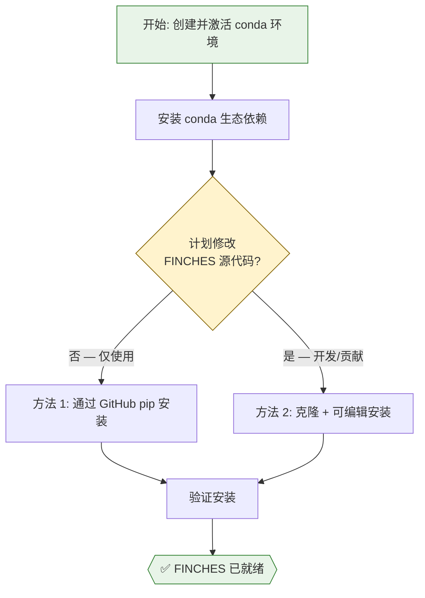
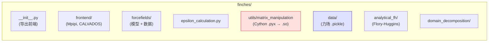

---
slug:3-installation-guide
blog_type:normal
---


本指南将引导你完成在系统上安装和验证 **FINCHES**（基于化学特异性的第一性原理相互作用）所需的每一个步骤。FINCHES 是一个用于计算 IDR 相关化学特异性的 Python 包，其安装过程涉及编译 Cython 扩展以及若干科学计算相关的 Python 依赖项。阅读完本页面后，你将拥有一个可用的环境，随时可以开始 [快速入门](2-quick-start) 的探索。

来源: [README.md](/README.md#L1-L176), [pyproject.toml](/pyproject.toml#L1-L76)

## 前提条件

在安装 FINCHES 之前，请查阅以下要求与限制，以确保安装过程顺畅：

| 要求 | 详情 |
|---|---|
| **Python 版本** | 要求 ≥ 3.7；**推荐 3.11 或 3.12** 以获得最佳性能 |
| **许可证** | CC BY-NC 4.0 — **仅供非商业用途** |
| **C++ 编译器** | 编译 Cython 扩展时必需（大多数操作系统开发工具中已附带） |
| **Git** | 两种安装方法均必需 |
| **Conda**（推荐） | 用于管理环境与依赖生态 |

<CgxTip>FINCHES 包含一个经过 Cython 编译的模块（`matrix_manipulation.pyx`），用于加速矩阵运算。该扩展在安装期间构建，需要一个可用的 C 编译器。在 macOS 上，请确保已安装 Xcode 命令行工具（`xcode-select --install`）。在 Linux 上，`gcc` 通常默认可用。</CgxTip>

来源: [pyproject.toml](/pyproject.toml#L26-L31), [setup.py](/setup.py#L1-L30), [LICENSE](/LICENSE#L1-L5)

## 核心依赖

FINCHES 依赖于以下运行时包，它们在 `pyproject.toml` 中声明。了解这些依赖有助于排查任何版本冲突：

| 包 | 版本约束 | 作用 |
|---|---|---|
| `numpy` | （推荐 ≥ 2） | 数组运算，Cython 包含路径 |
| `afrc` | ≥ 0.3.4 | 解析 FRC（Flory 无规线团）标度 |
| `scipy` | 任意 | 数值积分与优化 |
| `soursop` | ≥ 0.2.4 | 聚合物物理计算 |
| `pandas` | 任意 | 数据结构操作 |
| `metapredict` | 任意（仅限 pip） | 内在无序区预测 |
| `ipython` | 任意 | 交互式计算支持 |

**构建时**依赖（仅在安装期间需要）为 `setuptools≥61.0`、`wheel`、`versioningit≈2.0`、`cython` 和 `numpy`。

来源: [pyproject.toml](/pyproject.toml#L29-L31), [pyproject.toml](/pyproject.toml#L1-L8)

## 安装方法一览

以下流程图展示了两种受支持的安装路径及其决策标准：



### 方法 1：从 GitHub 直接使用 pip 安装

这是面向大多数用户的**推荐方法**。它将 FINCHES 的固定副本直接安装到你的活跃环境中，而无需在本地克隆仓库。

```bash
pip install git+https://git@github.com/idptools/finches.git
```

此命令将拉取最新的 `main` 分支、编译 Cython 扩展并自动安装所有依赖项。你可以在任何目录下运行此命令——该包最终会安装到你的环境的 site-packages 中。

来源: [README.md](/README.md#L113-L118)

### 方法 2：克隆与可编辑安装

如果你打算修改源代码、贡献修复补丁，或者希望享受通过 `git pull` 进行更新的便利，请使用此方法。**请将其克隆到一个合理的工作目录中**——仓库将被复制到该位置。

```bash
# 1. 克隆仓库
git clone git@github.com:idptools/finches.git

# 2. 进入项目根目录（即 pyproject.toml 所在目录）
cd finches

# 3. 以可编辑模式安装
pip install -e .
```

`-e`（可编辑）标志会创建一个指向源代码目录的动态链接，而非将文件复制到 site-packages 中。这提供了两个关键优势：

1. **即时更新** — 在克隆的目录中执行 `git pull` 后，下次导入 FINCHES 时会立即反映代码的变更，无需重新安装。
2. **正确的 Cython 编译** — 在可编辑安装期间，Cython 扩展（`matrix_manipulation.pyx`）会就地编译。目前，非可编辑的 pip 安装存在一个已知的打包问题，可能导致编译后的 `.so` 文件无法正确分发。

<CgxTip>如果你使用了方法 2，随后又切换到其他分支或拉取了重大更新，Cython 的 `.so` 文件不会自动重新编译。在重大更新后，请重新运行 `pip install -e .` 以重建扩展。</CgxTip>

来源: [README.md](/README.md#L120-L145), [setup.py](/setup.py#L17-L29)

## 逐步操作：Conda 环境设置

以下流程已在干净的 conda 环境中经过测试，是最可靠的安装路径。它谨慎地管理依赖生态，以避免在混用 conda 和 PyPI 包时可能出现的跨平台 numpy 冲突。

### 第 1 步 — 创建并激活环境

```bash
conda create -n finches python=3.12 -y
conda activate finches
```

来源: [README.md](/README.md#L84-L91)

### 第 2 步 — 通过 Conda 安装生态依赖

**从 conda** 安装核心科学计算包，以确保 ABI 兼容性。这在 macOS 上尤为重要，因为混用 conda 和 PyPI 的 numpy/PyTorch 构建版本会导致段错误。

```bash
# 从 pytorch 频道安装以获得一致的 ABI
conda install numpy pytorch scipy cython matplotlib jupyter -c pytorch

# mdtraj 单独安装（不同的频道/依赖链）
conda install mdtraj
```

### 第 3 步 — 安装仅限 pip 的依赖

```bash
# metapredict 仅通过 PyPI 分发
pip install metapredict
```

来源: [README.md](/README.md#L94-L108)

### 第 4 步 — 安装 FINCHES

从上文介绍的安装方法中选择方法 1 或方法 2。对于大多数用户：

```bash
pip install git+https://git@github.com/idptools/finches.git
```

来源: [README.md](/README.md#L110-L118)

### 第 5 步 — 验证安装

离开安装目录（以避免导入混淆）并运行验证命令：

```bash
cd ~
python -c "from finches.frontend.mpipi_frontend import Mpipi_frontend; mf = Mpipi_frontend(); print('Success')"
```

如果输出为 `Success`，则说明 FINCHES 已正确安装，且力场数据与 Cython 扩展均可正常访问。首次调用可能需要稍作等待，因为 Python 需要编译并缓存导入的模块。

来源: [README.md](/README.md#L147-L158)

## 完整安装摘要

下表提供了从全新系统开始进行完整安装流程的单一参考：

| 步骤 | 命令 | 目的 |
|---|---|---|
| 1 | `conda create -n finches python=3.12 -y` | 创建隔离环境 |
| 2 | `conda activate finches` | 激活环境 |
| 3 | `conda install numpy pytorch scipy cython matplotlib jupyter -c pytorch` | 核心科学计算依赖 |
| 4 | `conda install mdtraj` | 轨迹分析依赖 |
| 5 | `pip install metapredict` | IDR 预测依赖 (仅限 PyPI) |
| 6a | `pip install git+https://git@github.com/idptools/finches.git` | 安装 FINCHES (直接安装) |
| 6b | `git clone git@github.com:idptools/finches.git && cd finches && pip install -e .` | 安装 FINCHES (可编辑安装) |
| 7 | `python -c "from finches.frontend.mpipi_frontend import Mpipi_frontend; mf = Mpipi_frontend(); print('Success')"` | 验证安装 |

来源: [README.md](/README.md#L75-L158), [pyproject.toml](/pyproject.toml#L29-L31)

## 平台特别说明

### macOS

在 Apple Silicon (M1/M2/M3) 和 Intel Mac 上，**最关键的规则**是从**相同的包生态**安装 `numpy` 和 `pytorch`——要么两者都来自 conda，要么都来自 PyPI。混用它们会因不兼容的 C ABI 绑定而产生段错误。上述逐步指南中采用的 conda 优先策略在设计上规避了此问题。

在运行 `pip install` 之前，请确保已安装 Xcode 命令行工具，因为 Cython 扩展需要 C 编译器：

```bash
xcode-select --install
```

### Linux

Linux 系统通常预装了 `gcc`。若未预装，请通过发行版的包管理器安装（如在 Debian/Ubuntu 上执行 `sudo apt install build-essential`）。无需其他特定于平台的步骤。

### Windows

FINCHES 尚未在 Windows 上进行官方测试。Windows 用户的推荐路径是使用 **Windows Subsystem for Linux (WSL2)**，并在 WSL 环境中安装 conda 发行版，然后按照 Linux 说明进行操作。

来源: [README.md](/README.md#L76-L78), [setup.py](/setup.py#L1-L30)

## 故障排除

| 症状 | 可能原因 | 解决方案 |
|---|---|---|
| `ModuleNotFoundError: No module named 'finches.utils.matrix_manipulation'` | Cython `.pyx` 未编译为 `.so` | 从项目根目录重新运行 `pip install -e .`，或改用方法 1 |
| `ImportError: numpy.core.multiarray failed to import` | 编译时与运行时的 numpy 版本不匹配 | 在当前环境中重新安装 numpy：`conda install numpy --force-reinstall` |
| 导入时出现段错误 | 混用 conda/PyPI 的 numpy + pytorch | 移除两者并从 conda 重新安装：`conda install numpy pytorch -c pytorch` |
| 安装期间出现 `versioningit` 错误 | 缺少构建依赖 | 单独安装：`pip install versioningit`，然后重试 |
| 找不到 `metapredict` | 未通过 pip 安装 | `pip install metapredict`（conda 不分发此包） |
| 首次导入缓慢 | 正常现象 — Python 在首次运行时缓存字节码 | 后续导入将会很快；无需采取任何行动 |

来源: [README.md](/README.md#L76-L158), [setup.py](/setup.py#L17-L29), [pyproject.toml](/pyproject.toml#L1-L8)

## 安装内容

了解包的布局有助于诊断导入问题并明确数据文件的存放位置。下图直观展示了已安装的包结构：



**红色**节点（`matrix_manipulation`）是经过 Cython 编译的模块——如果此文件缺少其编译后的 `.so` 对应物，FINCHES 将在导入时失败。**蓝色**节点（`data/`）包含序列化的力场参数文件（`.pickle`），它们在运行时由前端对象加载。

来源: [finches/__init__.py](/finches/__init__.py#L1-L24), [setup.py](/setup.py#L12-L22), [MANIFEST.in](/MANIFEST.in#L1-L17)

## 替代安装方式：Google Colab

如果你不想在本地安装任何内容，FINCHES 也提供了一组**预配置的 Google Colab 笔记本**。这无需任何本地设置——只需在浏览器中打开笔记本并运行即可：

- **Colab 笔记本**: [github.com/idptools/finches-colab](https://github.com/idptools/finches-colab)
- **Web 服务器**: [finches-online.com](https://www.finches-online.com/)

这些替代方案非常适合快速探索或教学，不过在以编程方式使用时，它们缺乏本地安装的灵活性。

来源: [README.md](/README.md#L10-L14)

## 后续步骤

FINCHES 安装并验证完成后，你即可开始使用：

1. **[快速入门](2-quick-start)** — 在一分钟内运行你的首次相互作用预测
2. **[架构概览](4-architecture-overview)** — 了解前端、力场与计算层的连接方式
3. **[Mpipi 与 CALVADOS 前端](5-mpipi-and-calvados-frontends)** — 学习用于相互作用图谱、epsilon 值与残基向量的主要 API