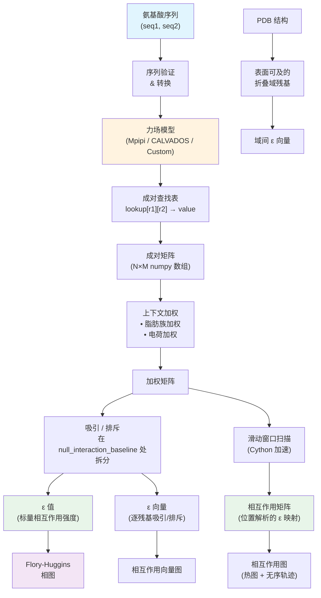

---
slug:4-architecture-overview
blog_type:normal
---


FINCHES（**F**irst-principle **I**nteractions via **CHE**mical **S**pecificity，基于化学特异性的第一性原理相互作用）采用四层架构组织，清晰地分离了用户交互、核心计算、生物物理模型和参数数据。本页映射了完整的模块拓扑，追溯了从氨基酸序列到相图的主要数据流，并识别出使系统可在多种力场模型间扩展的设计模式。

来源: [__init__.py](/finches/__init__.py#L1-L24), [README.md](/README.md#L1-L176)

## 结构层

代码库被划分为四个不同的层，每层具有单一职责。**前端层**暴露面向用户的 API 并处理可视化。**核心计算层**实现了构建相互作用矩阵、计算 epsilon 值和构造残基向量的数学机制。**力场层**将生物物理模型封装为可互换的插件。**数据层**以序列化字典的形式存储预计算的参数集。这种分离确保了添加新力场时无需修改计算或前端代码。

```
finches/
├── frontend/                  ← 第 1 层: 面向用户的 API 与可视化
│   ├── frontend_base.py           FinchesFrontend (抽象基类)
│   ├── mpipi_frontend.py          Mpipi_frontend (具体实现)
│   ├── calvados_frontend.py       CALVADOS_frontend (具体实现)
│   └── interlogo.py               Logo 生成工具
│
├── epsilon_calculation.py    ← 第 2 层: 核心计算
├── epsilon_stateless.py          无状态向量/epsilon 函数
├── epsilon_to_FHtheory.py        Flory-Huggins 理论桥接
├── interaction_vector.py         相互作用向量绘图
├── sequence_tools.py             序列属性计算器 (FCR, NCPR)
├── parsing_aminoacid_sequences.py 序列解析工具
│
├── forcefields/               ← 第 3 层: 力场模型 (接口模式)
│   ├── mpipi.py                   Mpipi_model
│   ├── calvados.py                calvados_model
│   ├── custom_model.py            custom_model (用户自定义)
│   └── calibration/              校准数据与脚本
│
├── analytical_fh/            ← 第 2b 层: Flory-Huggins 求解器
│   ├── backend.py                 原始 Qian 等人的求解器
│   └── floryhuggins.py            封装 API
│
├── domain_decomposition/     ← 横切关注点: 区域分析
│   └── domain_analysis.py         InteractingRegions, extract_regions
│
├── PDB_structure_tools.py    ← 横切关注点: 折叠域整合
│
├── utils/                    ← 性能: Cython 加速
│   ├── matrix_manipulation.pyx    dict2matrix, matrix_scan (Cython)
│   └── folded_domain_utils.py     折叠域辅助函数
│
├── data/                     ← 第 4 层: 参数数据
│   ├── Mpipi/                     Mpipi 序列化参数文件
│   ├── calvados/                  CALVADOS 序列化参数文件
│   ├── fingerprints.py            参数指纹识别
│   ├── forcefield_dependencies.py 基线与预因子计算
│   └── reference_sequence_info.py 参考序列数据
│
└── tests/                    ← 验证
    ├── test_epsilon_calculation.py
    ├── test_FH_diagrams.py
    ├── test_finches.py
    └── test_frontend_mpipi.py
```

来源: [__init__.py](/finches/__init__.py#L1-L24), [epsilon_calculation.py](/finches/epsilon_calculation.py#L1-L50), [frontend_base.py](/finches/frontend_base.py#L1-L30)

## 核心设计模式

FINCHES 采用两种主要设计模式来管理模块间的交互方式。

### 接口模式：InteractionMatrixConstructor

**InteractionMatrixConstructor** 是架构的枢纽。它接受任何实现了所需约定的力场对象——具体为 `ALL_RESIDUES_TYPES`、`compute_interaction_parameter(r1, r2)` 和 `CONFIGS`——并为计算成对矩阵、加权矩阵、epsilon 值和滑动窗口矩阵提供统一的 API，而无需考虑底层的生物物理模型。这是经典的接口（或策略）模式：计算算法是固定的，而相互作用参数的来源是可互换的。

| 力场约定方法 | 用途 | 定义位置 |
|---|---|---|
| `ALL_RESIDUES_TYPES` | 有效残基组列表（例如，蛋白质 + RNA） | 所有力场类 |
| `compute_interaction_parameter(r1, r2)` | 返回残基对的成对相互作用值 | 所有力场类 |
| `CONFIGS` | 包含 `charge_prefactor` 和 `null_interaction_baseline` 的字典 | 所有力场类 |

来源: [epsilon_calculation.py](/finches/epsilon_calculation.py#L29-L100)

### 继承模式：FinchesFrontend 层次结构

**前端**层使用类继承来共享实现，同时允许特定于模型的定制。`FinchesFrontend` 是一个抽象基类，定义了共享方法（`intermolecular_idr_matrix`、`epsilon`、`interaction_figure`、`per_residue_attractive_vector`）。`Mpipi_frontend` 和 `CALVADOS_frontend` 派生自它，各自构建自己的力场模型和 `InteractionMatrixConstructor` 实例，然后委托给超类进行计算。`CALVADOS_frontend` 额外应用了 `@RNA_check` 装饰器来拒绝包含 RNA 的序列，因为 CALVADOS2 不支持核酸残基。

| 类 | 父类 | 力场 | RNA 支持 | 关键覆写 |
|---|---|---|---|---|
| `FinchesFrontend` | — | 无 (抽象) | — | 无法直接实例化 |
| `Mpipi_frontend` | `FinchesFrontend` | `Mpipi_GGv1` | ✅ (通过 `U` 残基) | 处理 `U` → 禁用无序预测 |
| `CALVADOS_frontend` | `FinchesFrontend` | `CALVADOS2` | ❌ | 所有方法上的 `@RNA_check` 装饰器 |

来源: [frontend_base.py](/finches/frontend_base.py#L12-L28), [mpipi_frontend.py](/finches/frontend/mpipi_frontend.py#L1-L15), [calvados_frontend.py](/finches/frontend/calvados_frontend.py#L1-L40)

## 数据流架构

下图追溯了从氨基酸序列到最终输出的主要计算流水线。FINCHES 中的每一次分析都遵循此核心路径，并带有通向相图和折叠域相互作用的可选分支。



**阶段 1 — 序列摄入与验证**：根据 `ALL_RESIDUES_TYPES` 验证输入序列，以确保所有残基属于同一残基组。可选的 `sequence_converter` 函数可以在验证前转换序列（用于掩码或自定义残基映射）。

**阶段 2 — 力场解析**：为每个残基对调用力场模型的 `compute_interaction_parameter(r1, r2)` 来填充查找字典。这在 `InteractionMatrixConstructor` 初始化期间发生一次，如果调用了 `_update_parameters()` 则会再次发生。

**阶段 3 — 矩阵构建**：通过为每个 (residue_i, residue_j) 对索引查找表来构建成对相互作用矩阵。Cython 加速的 `dict2matrix()` 函数在性能关键路径上处理此操作。

**阶段 4 — 上下文加权**：两种可选的加权方案修改原始矩阵。**脂肪族加权**放大被其他脂肪族残基包围的残基的相互作用，捕获疏水斑块效应。**电荷加权**减少带相反电荷邻居之间的排斥（由 `charge_prefactor` 缩放），对侧链重定向和 pKa 偏移进行建模。

**阶段 5 — Epsilon 计算**：加权矩阵在 `null_interaction_baseline`（以 poly(GS) 序列作为高斯链参考进行校准）处被拆分为吸引和排斥分量。求和与平均后产生标量 ε 值或逐残基的 ε 向量。

**阶段 6 — 滑动窗口扫描**：对于相互作用图，序列被分解为重叠窗口，并计算每个窗口对的 ε，生成位置解析的 2D 矩阵。在此步骤中，Cython 的 `matrix_scan()` 函数比纯 Python 提供了约 12 倍的加速。

来源: [epsilon_calculation.py](/finches/epsilon_calculation.py#L200-L400), [epsilon_stateless.py](/finches/epsilon_stateless.py#L1-L200), [matrix_manipulation.pyx](/finches/utils/matrix_manipulation.pyx#L1-L80)

## 力场模型比较

三种力场模型在物理基础、参数来源和支持的残基类型上有所不同。三者都实现了相同的约定，使得它们在 `InteractionMatrixConstructor` 中可互换。

| 属性 | Mpipi (Mpipi_GGv1) | CALVADOS (CALVADOS2) | 自定义模型 |
|---|---|---|---|
| **物理基础** | Mie 势 + Debye-Hückel | Ashbaugh-Hatch LJ + Yukawa | 用户定义 |
| **参数来源** | Joseph et al. 2021, Lotthammer et al. 2024 | Tesei et al. 2021 | 用户提供的字典 |
| **条件依赖** | 盐浓度，介电常数 | 盐浓度，pH，温度 | 通过回调任意定义 |
| **RNA 支持** | ✅ (U 残基) | ❌ | 用户定义 |
| **参数存储** | 5 个序列化字典 (σ, ε, ν, μ, charge) | 1 个序列化 DataFrame | 内联字典 |
| **默认 charge_prefactor** | 0.20 | 0.70 | 用户定义 |
| **默认 null_interaction_baseline** | −0.128533 | −0.45 | 用户定义 |

`custom_model` 类通过接受成对相互作用的扁平字典（例如，`{'A_A': -1, 'A_K': 0.5}`）、用于可调参数的可选 `condition_dictionary` 以及在条件改变时重新计算相互作用的 `condition_dependence_function` 回调，实现了任意的力场定义。这使得无需修改 FINCHES 源代码即可原型化新型粗粒化模型。

来源: [mpipi.py](/finches/forcefields/mpipi.py#L1-L50), [calvados.py](/finches/forcefields/calvados.py#L1-L80), [custom_model.py](/finches/forcefields/custom_model.py#L1-L60)

## 横切模块

多个模块跨越多个层并与外部工具集成：

**折叠域整合** (`PDB_structure_tools.py`)：使用 `soursop` 解析 PDB 结构，使用 7Å 探针半径计算溶剂可及表面积 (SASA)，并提取表面可及的折叠域 (SAFD) 残基。然后将这些残基输入到 `get_interdomain_epsilon_vectors()` 中，以计算 IDR 如何与相邻折叠域的表面相互作用，并通过距离依赖加权来考虑空间邻近性。

**域分解** (`domain_decomposition/domain_analysis.py`)：使用逐行/列 ε 谱的峰值查找，识别 2D 相互作用矩阵内的连续相互作用区域。返回封装了起止位置、序列以及用于在相互作用图上叠加的矩形坐标的 `InteractingRegions` 对象。

**Flory-Huggins 桥接** (`epsilon_to_FHtheory.py`)：将计算出的 ε 值转换为 Flory-Huggins χ 参数并构建相图。通过迭代重新初始化力场模型并在每个条件点重新计算 ε，支持跨盐浓度、pH 和介电常数的条件依赖扫描。

**序列工具** (`sequence_tools.py`)：提供序列级属性计算器，包括带电残基比例 (FCR)、净电荷 per 残基 (NCPR) 以及用于电荷模式分析的 κ (kappa) 参数。

来源: [PDB_structure_tools.py](/finches/PDB_structure_tools.py#L1-L80), [domain_analysis.py](/finches/domain_decomposition/domain_analysis.py#L1-L100), [epsilon_to_FHtheory.py](/finches/epsilon_to_FHtheory.py#L1-L50), [sequence_tools.py](/finches/sequence_tools.py#L1-L80)

## 性能架构

FINCHES 使用 Cython 处理两个性能关键操作。`dict2matrix()` 函数使用带有 `@cython.boundscheck(False)` 的类型化 C 级循环将 Python 查找字典转换为 NumPy 2D 数组。`matrix_scan()` 函数使用预分配数组和 C 级算术实现滑动窗口 ε 计算，与等效的纯 Python 实现相比，提供了约 **12 倍的加速**。两者均在安装时通过 `cython` 依赖项编译，并在向前端方法传递 `use_cython=True`（默认值）时自动使用。

<CgxTip>在生产运行中始终保持 `use_cython=True`（默认值）。Cython 路径会被透明调用——无需更改代码。仅在调试时设置 `use_cython=False`，因为对于大序列，纯 Python 回退机制会显著变慢。</CgxTip>

来源: [matrix_manipulation.pyx](/finches/utils/matrix_manipulation.pyx#L1-L80)

## 推荐阅读路径

既然你已经了解了架构，以下进阶路径将从面向用户的 API 逐步深入到计算细节：

1. **[Mpipi 与 CALVADOS 前端](5-mpipi-and-calvados-frontends)** — 从此处开始了解主要 API 入口点
2. **[InteractionMatrixConstructor](8-interactionmatrixconstructor)** — 理解连接前端与力场的核心接口
3. **[Epsilon 计算与加权](9-epsilon-calculation-and-weighting)** — 深入探讨相互作用强度是如何量化的
4. **[Mpipi 力场参数](11-mpipi-forcefield-parameters)** — 详细检查默认力场模型
5. **[Flory-Huggins 相图](14-flory-huggins-phase-diagrams)** — 了解 ε 值如何预测相行为