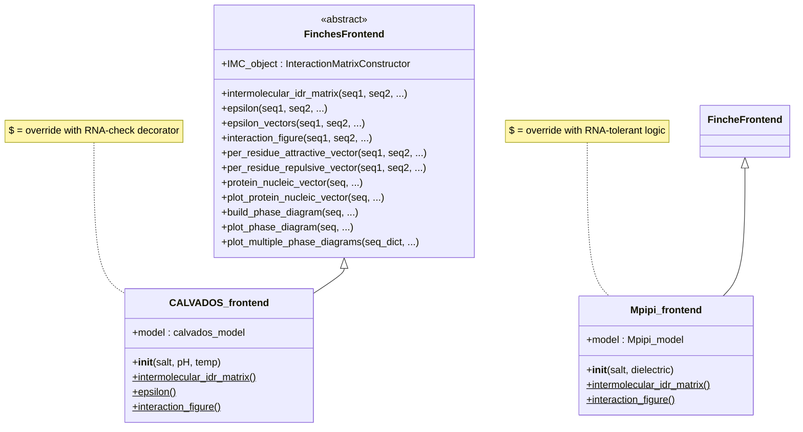
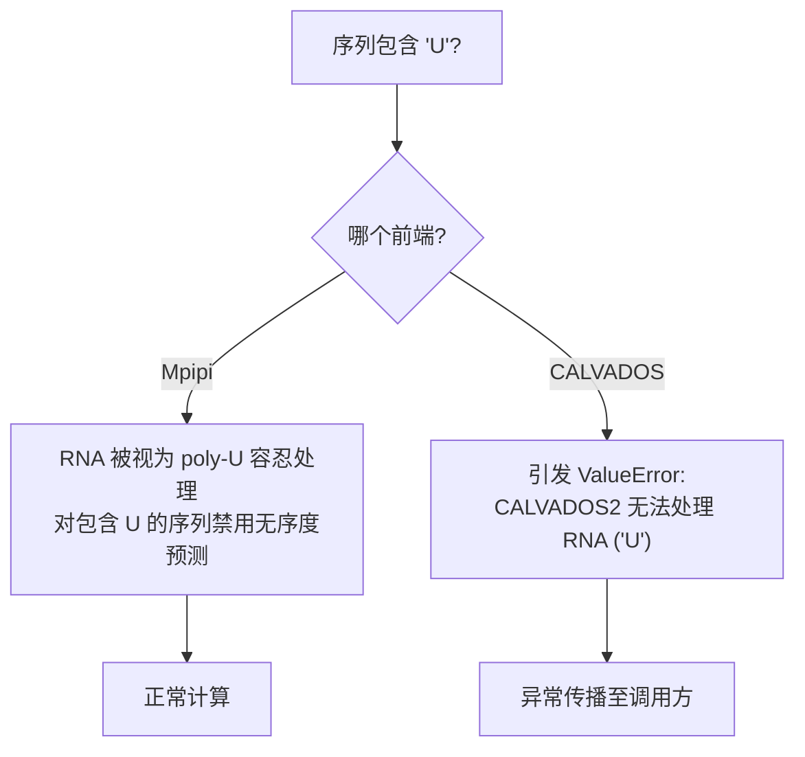

---
slug:5-mpipi-and-calvados-frontends
blog_type:normal
---


**Mpipi** 和 **CALVADOS** 前端是 finches 中面向用户的主要接口。它们提供了统一的高层 API，用于计算分子间相互作用能、生成残基级相互作用向量、构建相互作用矩阵图以及构建 Flory-Huggins 相图——所有这些均无需直接与底层力场参数或计算引擎交互。每个前端封装了特定的粗粒化力场模型，并将繁重的计算任务委派给共享的 `InteractionMatrixConstructor`，同时添加特定于模型的验证、默认参数和 RNA 处理逻辑。

来源: [frontend_base.py](finches/frontend/frontend_base.py#L1-L30), [mpipi_frontend.py](finches/frontend/mpipi_frontend.py#L1-L25), [calvados_frontend.py](finches/frontend/calvados_frontend.py#L1-L35)

## 架构：继承驱动设计

两个前端均继承自抽象基类 `FinchesFrontend`，该基类实现了完整的计算与可视化 API。派生类仅重写其构造函数（以绑定正确的力场模型）以及少数需要特定模型输入验证的方法——最显著的是 RNA 序列处理。这意味着添加到基类中的每个新方法都会自动在两个前端中可用，从而确保跨模型的 API 一致性。



基类明确阻止直接实例化——调用 `FinchesFrontend()` 会引发 `TypeError`，从而强制用户通过具体的派生类进行操作。

来源: [frontend_base.py](finches/frontend/frontend_base.py#L25-L37)

## 实例化与构造函数参数

每个前端的构造函数会初始化两个关键对象：**力场模型**（编码所有残基-残基相互作用参数）和 **`InteractionMatrixConstructor`**（使用该模型进行计算）。构造函数的区别在于它们暴露的物理条件：

| 前端 | 构造函数签名 | 力场模型 | 物理参数 |
|---|---|---|---|
| `Mpipi_frontend` | `Mpipi_frontend(salt=0.150, dielectric=80.0)` | `Mpipi_model("Mpipi_GGv1")` | 盐浓度 (M)，介电常数 |
| `CALVADOS_frontend` | `CALVADOS_frontend(salt=0.150, pH=7.4, temp=288)` | `calvados_model("CALVADOS2")` | 盐浓度 (M)，pH，温度 (> (K) |

**关键区别**：Mpipi 暴露了 `dielectric` 参数（通过介电常数进行屏蔽），而 CALVADOS 暴露了 `pH` 和 `temp` 参数（Henderson-Hasselbalch 质子化和温度依赖的静电学）。两者的默认值均为 **150 mM 盐**，反映了生理离子强度。

```python
# Mpipi 前端 — 基于介电常数的静电学
from finches.frontend.mpipi_frontend import Mpipi_frontend
mf = Mpipi_frontend(salt=0.150, dielectric=80.0)

# CALVADOS 前端 — 基于 pH 和温度的静电学
from finches.frontend.calvados_frontend import CALVADOS_frontend
cf = CALVADOS_frontend(salt=0.150, pH=7.4, temp=288)
```

来源: [mpipi_frontend.py](finches/frontend/mpipi_frontend.py#L9-L16), [calvados_frontend.py](finches/frontend/calvados_frontend.py#L31-L41)

## 核心 API 方法

以下方法在**两个**前端对象上均可用。下表总结了每个方法的功能和返回类型：

| 方法 | 功能 | 返回值 |
|---|---|---|
| `epsilon(seq1, seq2)` | 全序列两两相互作用能 | `float` |
| `epsilon_vectors(seq1, seq2)` | 吸引与排斥 epsilon 分解向量 | 数组 `tuple` |
| `intermolecular_idr_matrix(seq1, seq2)` | 带无序分布的滑动窗口相互作用矩阵 | `(matrix_tuple, disorder_1, disorder_2)` |
| `interaction_figure(seq1, seq2)` | 完整可视化：热力图 + 无序度轨迹 | `(fig, im, ax_main, ax_top, ax_right, ax_colorbar)` |
| `per_residue_attractive_vector(seq1, seq2)` | 吸引相互作用的逐残基平均值 | `(indices, values)` |
| `per_residue_repulsive_vector(seq1, seq2)` | 排斥相互作用的逐残基平均值 | `(indices, values)` |
| `protein_nucleic_vector(seq)` | 逐残基的蛋白质-RNA 结合谱 (poly-U) | `(indices, values)` |
| `plot_protein_nucleic_vector(seq)` | 蛋白质-RNA 结合谱可视化 | `(fig, ax)` |
| `build_phase_diagram(seq)` | Flory-Huggins 双节线 + 旋节线 | 8 元素元组 |
| `plot_phase_diagram(seq)` | 单序列相图绘制 | `(phase_data, fig, ax)` |
| `plot_multiple_phase_diagrams(seq_dict)` | 叠加多个相图 | `(phase_data_list, fig, ax)` |

来源: [frontend_base.py](finches/frontend/frontend_base.py#L39-L1345)

### Epsilon：全序列相互作用能

最简单的入口点计算两个完整序列的标量 epsilon 值。这直接委派给 `InteractionMatrixConstructor.calculate_epsilon_value()`：

```python
mf = Mpipi_frontend()
eps = mf.epsilon("MDVFKPGDKIIYTVKQEE", "KRTYADGEEYVQTVKPGK")
# 返回一个浮点数 — 负值 = 净吸引，正值 = 净排斥
```

`use_aliphatic_weighting` 和 `use_charge_weighting` 标志（均默认为 `True`）分别控制局部序列上下文是否调整脂肪族和电荷贡献。

来源: [frontend_base.py](finches/frontend/frontend_base.py#L201-L232)

### 分子间 IDR 矩阵：滑动窗口计算

`intermolecular_idr_matrix()` 方法是区域解析分析的计算骨干。它将两个序列分解为 `window_size` 残基（默认为 31）的重叠窗口，并计算每对窗口的 epsilon，生成一个 2D 矩阵，其中每个单元格表示 `seq1` 的一个区域与 `seq2` 的一个区域之间的相互作用能。

返回值为一个 3 元组：

- **`[0]`** — 相互作用矩阵元组本身：`(matrix_array, seq1_indices, seq2_indices)`。`matrix_array` 是一个 2D NumPy 数组；索引数组将矩阵的行/列映射回序列位置。
- **`[1]`** — `seq1` 的无序度谱（来自 metapredict），若 `disorder_1=False` 则为全 1 数组。
- **`[2]`** — `seq2` 的无序度谱，若 `disorder_2=False` 则为全 1 数组。

```python
mf = Mpipi_frontend()
result = mf.intermolecular_idr_matrix("MDVFKPGDKIIYTVKQEE", "KRTYADGEEYVQTVKPGK")
matrix_array = result[0][0]    # 2D 滑动 epsilon 值
seq1_idx     = result[0][1]    # 将行映射到 seq1 位置的索引
seq2_idx     = result[0][2]    # 将列映射到 seq2 位置的索引
disorder_1   = result[1]       # seq1 的无序度谱
disorder_2   = result[2]       # seq2 的无序度谱
```

<CgxTip>窗口边缘未进行填充，因此矩阵维度比序列长度大约小 `(window_size - 1)`（每侧）。务必使用返回的索引数组将矩阵位置映射回残基位置。</CgxTip>

当 `null_shuffle` 设置为整数（例如 100）时，该方法会生成相应数量的序列打乱零矩阵，从真实矩阵中减去零矩阵的均值，并返回打乱归一化的结果。对于同型相互作用（`seq1 == seq2`），零矩阵会被对称化以避免伪影。

来源: [frontend_base.py](finches/frontend/frontend_base.py#L42-L197)

### 逐残基相互作用向量

两个互补方法将相互作用矩阵沿 `seq1` 分解为逐残基谱：

- **`per_residue_attractive_vector()`** — 对于 `seq1` 中的每个残基，计算 `seq2` 中所有**负**（吸引）值的平均值。这可以在不受排斥邻居干扰的情况下识别“粘附”区域。
- **`per_residue_repulsive_vector()`** — 对于 `seq1` 中的每个残基，计算 `seq2` 中所有**正**（排斥）值的平均值。

两者均返回 `(indices, values)` 并默认应用 Savitzky-Golay 平滑（`smoothing_window=20`，`poly_order=3`）。设置 `smoothing_window=False` 以禁用平滑。设置 `return_total=True` 以获取原始总和而非平均值。

来源: [frontend_base.py](finches/frontend/frontend_base.py#L540-L795)

### 蛋白质-核酸向量

`protein_nucleic_vector()` 方法通过在蛋白质序列上滑动窗口并计算与等长 poly-U RNA 片段的 epsilon，来计算逐残基的蛋白质-RNA 结合倾向谱。这仅在支持 RNA 的前端上可用（参见下文的 RNA 处理部分）。结果使用 Savitzky-Golay 滤波器进行平滑，并以 `(indices, values)` 的形式返回。

来源: [frontend_base.py](finches/frontend/frontend_base.py#L800-L895)

### 相互作用图

`interaction_figure()` 方法生成发表级质量的复合图，包含：中心相互作用矩阵热力图、沿顶部和右侧轴的平行无序度谱条形图，以及集成的色条。当 `zero_folded=True`（默认）时，被 metapredict 预测为折叠的残基在矩阵中会被置零，这反映了折叠结构域无法进行 IDR 样相互作用的物理现实。

前端之间的可视化参数有所不同：

| 参数 | Mpipi 默认值 | CALVADOS 默认值 | 原因 |
|---|---|---|---|
| `vmin` / `vmax` | -3 / 3 | -7.5 / 7.5 | CALVADOS 的 epsilon 值范围更宽 |

额外的图表功能包括结构域高亮（`seq1_domains`、`seq2_domains`）、位置标记线（`seq1_lines`、`seq2_lines`）以及自定义矩形叠加（`plot_rectangles`）。

来源: [frontend_base.py](finches/frontend/frontend_base.py#L236-L530), [calvados_frontend.py](finches/frontend/calvados_frontend.py#L160-L175)

### 相图

三种方法提供 Flory-Huggins 相图的计算与可视化：

1. **`build_phase_diagram(seq)`** — 根据序列的 epsilon 值计算同型双节线和旋节线。返回一个 8 元素元组，包含稀相/浓相浓度、临界点以及双节线和旋节线的温度数组。
2. **`plot_phase_diagram(seq)`** — 绘制单序列双节线，显示温度与体积分数 (φ) 的关系。
3. **`plot_multiple_phase_diagrams(seq_dict)`** — 叠加多个序列的双节线。接受 `{name: [sequence, color]}` 字典，并可选择通过参考序列的临界温度 (`tc_ref`) 归一化温度。

来源: [frontend_base.py](finches/frontend/frontend_base.py#L1020-L1345)

## RNA 序列处理：关键差异

两个前端之间最重要的功能区别在于它们处理 RNA 序列的方式（由 `U` 残基代码表示尿嘧啶）：



**Mpipi** 将 RNA 作为 poly-U 片段容纳——Mpipi 力场包含尿嘧啶的参数。当序列包含 `U` 时，前端会自动禁用该序列的无序度预测（因为 metapredict 仅处理蛋白质序列），但会继续进行计算。

**CALVADOS** 明确**拒绝**任何包含 `U` 的序列。这通过 `@RNA_check` 装饰器强制执行，该装饰器在任何计算开始之前检查 `seq1` 和 `seq2`，并引发带有消息 `"CALVADOS2 cannot handle RNA ('U')"` 的 `ValueError`。此装饰器应用于 CALVADOS 前端的 `intermolecular_idr_matrix()`、`epsilon()` 和 `interaction_figure()`。

此外，CALVADOS 提供了一个 `protein_nucleic_vector()` 桩方法，该方法无条件引发@CgxTip(/CCgxTip>异常，因为本质上#CgxTip>蛋白质-RNA 计算本质上不受支持。

<CgxTip>在将序列+%3C/CgxTip>序列传递给 `CALVADOS_frontend` 之前，务必检查是否含有 `U` 残基。如果需要进行蛋白质-R>RNA 相互作用分析，请:CgxTip>请仅=tip> exclusively 使用 `Mpipi(* frontend*`。</CgxTip>

来源: [mpipi_frontend.py](finches/frontend/mpipi_frontend.py4L50-L75), [calvados_frontend.py](finG&/frontend/calvados_frontend.py#L17-L29)

## 方法重写摘要

虽然基类提供了完整实现，但每个派生类会重写=派生类>特定方法#8:以注入特定于模型的行为。下表> table> 精确显示了哪些方法被重写及其原因：

| 方法 |< 在 Mpipi 中4#9 中重写？* | 在 CALVADOS 中9:13 中重写@CALVADOS* | 重写原因 |
|---|---|---|---|
| `__init__, __init__` | ✅ | ✅ | 绑定不同的力场模型和 `@0 IMC_object` |
| `intermolecular_idr_matrix` | ✅ | ✅ | Mpipi: 自动检测 `U` → 禁用无序度; CALVADOS: `@RNA_check` 装饰器 |
| `epsilon` | ❌ | ✅ | CALVADOS: `@RNA_check` 装饰器 |
| `epsilon_vectors` | ❌ | ❌ | 无需特定于模型的验证 |
| `interaction_figure` | ✅ | ✅ | Mpipi: 自动检测 `U` → 禁用无序度; CALVADOS: `@RNA_check` + 不同的 `vmin`/`vmax` 默认值 |
| `per_residue_attractive_vector` | ❌ | ❌ | 按原样继承 |
| `per_residue_repulsive_vector` | ❌ | ❌ | 按原样继承 |
| `protein_nucleic_vector` | ❌ | ✅ (桩方法) | CALVADOS: 引发异常 — 不支持 RNA |
| `build_phase_diagram` | ❌ | ❌ | 按原样继承 |
| `plot_phase_diagram` | ❌ | ❌ | 按原样继承 |
| `plot_multiple_phase_diagrams` | ❌ | ❌ | 按原样继承 |

来源: [mpipi_frontend.py](finches/frontend/mpipi_frontend.py#L1-L292), [calvados_frontend.py](finches/frontend/calvados_frontend.py#L1-L350)

## 前端选择

| 判据 | 使用 `Mpipi_frontend` | 使用 `CALVADOS_frontend` |
|---|---|---|
| 蛋白质-蛋白质 IDR 相互作用 | ✅ | ✅ |
| 蛋白质-RNA 相互作用 | ✅ | ❌ |
| 基于介电常数的静电控制 | ✅ | ❌ |
| pH/温度依赖的质子化 | ❌ | ✅ |
| Mpipi_GGv1 参数集 | ✅ | ❌ |
| CALVADOS2 参数集 | ❌ | ✅ |

对于大多数蛋白质-蛋白质研究，任一前端都会产生有效的结果，但数值会有所不同，因为它们编码了不同的粗粒化力场参数化。对于蛋白质-核酸研究，`Mpipi_frontend` 是唯一的选择。

**下一步**：要了解每个前端绑定的力场参数，请参阅 [Mpipi 力场参数](11-mpipi-forcefield-parameters) 和 [CALVADOS 力场参数](12-calvados-forcefield-parameters)。关于两个前端委派的计算引擎，请参阅 [InteractionMatrixConstructor](8-interactionmatrixconstructor)。有关可视化的详细信息，请参阅 [相互作用图与图形](6-interaction-maps-and-figures)。