---
slug:6-interaction-maps-and-figures
blog_type:normal
---


交互图是 FINCHES 的主要可视化输出，它提供了一个二维热图，展示了两个内在无序区（IDR）的各个局部区域之间预测的交互方式。它们通过 `Mpipi_frontend` 或 `CALVADOS_frontend` 对象的 **`interaction_figure()`** 方法生成，该方法在内部计算滑动窗口 epsilon 矩阵，叠加逐序列的无序分布曲线，掩蔽折叠区域，并在单次调用中渲染出可用于发表的 matplotlib 图像。

## 交互图的工作原理

交互图的构建方式是将两个序列分解为 `window_size` 个残基的重叠片段，然后计算序列 1 的每个片段与序列 2 的每个片段之间的逐对 epsilon（交互能量）。生成的二维矩阵以热图形式展示，其中 **x 轴**映射序列 1 的位置，**y 轴**映射序列 2 的位置，**像素颜色**表示预测的交互强度——默认情况下，负值（吸引）显示为绿色，正值（排斥）显示为紫色。沿顶部和右侧边缘的平行条形轨道展示了每个残基的预测无序概率，而折叠域则自动置零。

```mermaid
flowchart TD
    A["两条氨基酸<br/>序列 &#40;seq1, seq2&#41;"] --> B["滑动窗口<br/>分片<br/>&#40;window_size=31&#41;"]
    B --> C["逐对 epsilon<br/>计算<br/>&#40;IMC_object&#41;"]
    C --> D["原始交互<br/>矩阵 &#40;2D ndarray&#41;"]
    D --> E{"null_shuffle<br/>已启用?"}
    E -- 是 --> F["减去乱序<br/>基线矩阵"]
    E -- 否 --> G["继续"]
    F --> G
    G --> H{"zero_folded<br/>已启用?"}
    H -- 是 --> I["将折叠域<br/>区域掩蔽为零"]
    H -- 否 --> J["继续"]
    I --> J
    J --> K["渲染热图 +<br/>无序度条形轨道<br/>+ 颜色条"]
    K --> L["返回 fig, im,<br/>ax_main, ax_top,<br/>ax_right, ax_colorbar"]
```



上面的流程图展示了从原始序列到渲染图像的完整决策流程。每个阶段都可通过 `interaction_figure()` 的参数集进行配置。

来源：[frontend_base.py](finches/frontend/frontend_base.py#L247-L399)，[frontend_base.py](finches/frontend/frontend_base.py#L131-L198)

## 生成交互图

最简单的用法只需要两个序列和一个前端对象：

```python
from finches.frontend.mpipi_frontend import Mpipi_frontend

mf = Mpipi_frontend()

s1 = 'MESNQSNNGGSGNAALNRGGRYVPPHLRGGDGGAAAAASAGGDDRRGGAGGGGYRRGGGNSGGGGGGGYDRGYNDNRDDRDNRGGSGGYGRDRNYEDRGYNGGGGGGGNRGYNNNRGGGGGGYNRQDRGDGGSSNFSRGGYNNRDEGSDNRGSGRSYNNDRRDNGGD'
s2 = 'LEGMSGDMRSGGGYRGRGGRGNGQRFGGRDHRYQGGSGNGGGGNGGGGGFGGGGQRSGGGGGFQSGGGGGRQQQQQQRAQPQQDWWS'

# 生成交互图（同源型）
mf.interaction_figure(s1, s1, tic_frequency=15)

# 生成交互图（异源型）
mf.interaction_figure(s1, s2, tic_frequency=15)
```

该方法返回一个由 matplotlib 对象组成的元组，以便进一步自定义：`(fig, im, ax_main, ax_top, ax_right, ax_colorbar)`。如果设置了 `no_disorder=True`，返回值将简化为 `(fig, im, ax_main)`。

来源：[frontend_base.py](finches/frontend/frontend_base.py#L247-L399)，[interaction_matrix_demo.ipynb](demo/protein_matrix/interaction_matrix_demo.ipynb#L87-L120)

## 交互图参数

`interaction_figure()` 方法提供了对计算、视觉样式和域注释的广泛控制：

| 参数 | 类型 | 默认值 | 用途 |
|---|---|---|---|
| `seq1`, `seq2` | str | — | 待比较的氨基酸序列 |
| `window_size` | int | 31 | 滑动窗口长度（必须为奇数） |
| `use_cython` | bool | True | 使用 Cython 加速矩阵计算 |
| `use_aliphatic_weighting` | bool | True | 按局部脂肪族密度对脂肪族残基进行加权 |
| `use_charge_weighting` | bool | True | 按局部电荷密度对带电残基进行加权 |
| `tic_frequency` | int | 100 | 坐标轴刻度间距 |
| `vmin`, `vmax` | float | -3, 3 | 色阶范围（kT 单位） |
| `cmap` | str | `'PRGn'` | Matplotlib 颜色映射名称 |
| `zero_folded` | bool | True | 将折叠域像素置零 |
| `disorder_1`, `disorder_2` | bool | True | 计算并展示无序度分布曲线 |
| `no_disorder` | bool | False | 完全省略无序度轨道 |
| `null_shuffle` | bool/int | False | 用于零基线减法的序列乱序次数 |
| `fname` | str | None | 图像保存路径（None = 仅显示） |
| `seq1_domains`, `seq2_domains` | list | [] | 以深色条高亮显示的域区域 |
| `seq1_lines`, `seq2_lines` | list | [] | 垂直/水平参考线 |
| `plot_rectangles` | list | None | 自定义矩形叠加层 `[s1_start, s1_end, s2_start, s2_end, kwargs]` |
| `linewidth` | float | 1 | 域边界线的宽度 |

来源：[frontend_base.py](finches/frontend/frontend_base.py#L247-L399)

## 图像布局与坐标轴

交互图使用 `plt.subplot2grid((4, 4), ...)` 在单个图像中排列四个面板：

| 坐标轴 | 网格位置 | 内容 |
|---|---|---|
| `ax_main` | (1,0) colspan=3, rowspan=3 | 二维交互热图 |
| `ax_top` | (0,0) colspan=3 | 序列 1 的无序度条形图（垂直条，0–1 刻度） |
| `ax_right` | (1,3) rowspan=3 | 序列 2 的无序度条形图（水平条，0–1 刻度） |
| `ax_colorbar` | (0,3) | 热图的色阶图例 |

通过 `seq1_domains` 或 `seq2_domains` 传入的域高亮，会在相应的无序度轨道上渲染为深色的垂直或水平跨度。来自 `plot_rectangles` 的自定义矩形直接在 `ax_main` 上绘制为仅含边框的色块，这对于标注特定的交互热点非常有用。

来源：[frontend_base.py](finches/frontend/frontend_base.py#L400-L560)

## 访问原始矩阵

当你需要底层数值数据进行自定义分析或可视化时，请调用 `intermolecular_idr_matrix()` 而非 `interaction_figure()`：

```python
# 返回 (B, disorder_1, disorder_2)
result = mf.intermolecular_idr_matrix(s1, s2, window_size=31)

# 解包矩阵元组
B       = result[0]   # 交互矩阵结构
d1      = result[1]   # 序列 1 的无序度分布
d2      = result[2]   # 序列 2 的无序度分布

# B 本身是一个包含 3 个元素的元组：
matrix  = B[0]   # 滑动 epsilon 值的二维 numpy 数组
idx_s1  = B[1]   # 将矩阵列映射到序列 1 位置的索引数组
idx_s2  = B[2]   # 将矩阵行映射到序列 2 位置的索引数组
```

之所以需要索引数组，是因为滑动窗口不会对序列进行填充——矩阵边缘的起始和结束位置取决于 `window_size`。具体而言，第一个有效索引位于 `window_size // 2 + 1`，最后一个位于 `len(seq) - window_size // 2`。

来源：[frontend_base.py](finches/frontend/frontend_base.py#L58-L198)

## 零乱序归一化

将 `null_shuffle` 设置为整数（推荐：100）会从交互矩阵中减去一个序列乱序基线。在每次乱序迭代中，两个序列都会被随机重排，计算一个新的矩阵，所有乱序矩阵的均值即为零基线。对于**同源型**交互（seq1 == seq2），该零基线会被对称化以避免伪影。这种归一化突出了依赖于残基顺序而非仅依赖组成的交互模式。

```python
# 基于 100 次乱序对照进行归一化
mf.interaction_figure(s1, s2, null_shuffle=100, tic_frequency=15)
```

来源：[frontend_base.py](finches/frontend/frontend_base.py#L147-L192)

## 折叠域掩蔽

当 `zero_folded=True`（默认值）时，`interaction_figure()` 方法使用 **metapredict** 来识别折叠域边界，并将所有对应折叠残基的矩阵像素置零。这可以防止稳定折叠区域产生误导性的交互信号，因为粗粒度力场模型是针对无序环境校准的。当使用 `plot_protein_nucleic_vector()` 时，相同的折叠边界会在无序度轨道上以灰色阴影显示。

来源：[frontend_base.py](finches/frontend/frontend_base.py#L400-L440)

## 序列标志可视化

`interlogo` 模块提供了 HTML 渲染的序列标志，根据每个残基的化学语境和交互贡献为其着色并调整大小。这些设计用于 Jupyter notebook 的展示。

### 化学语境配色方案

残基使用 `AA_COLOR` 中定义的固定调色板按化学类别进行着色：

| 化学类别 | 残基 | 颜色 |
|---|---|---|
| 芳香族 | Y, W, F | `#ff9d00` (橙色) |
| 脂肪族 | A, L, M, I, V | `#171616` (黑色) |
| 极性 | Q, N, S, T, H, G | `#04700d` (绿色) |
| 负电 | E, D | `#ff0d0d` (红色) |
| 正电 | R, K | `#2900f5` (蓝色) |
| 半胱氨酸 | C | `#ffe70d` (黄色) |
| 脯氨酸 | P | `#cf30b7` (洋红色) |

一个单独的 `AA_CHARGE_COLOR` 字典提供了仅显示电荷的视图，其中只有 E/D（红色）和 R/K（蓝色）被着色；其他所有残基均为黑色。

### 吸引与排斥标志

```python
from finches.frontend.interlogo import plot_attractive_logo, plot_repulsive_logo

# 吸引标志：残基大小由有利的交互贡献决定
plot_attractive_logo(s1, s2, mf, window_size=31, quantile_threshold=0.7)

# 排斥标志：残基大小由不利的交互贡献决定
plot_repulsive_logo(s1, s2, mf, window_size=31, quantile_threshold=0.7)
```

`quantile_threshold` 参数（默认 0.7）控制可见性截断：低于大小分布阈值分位数的残基将渲染为浅灰色（`#cccccc`），而非其化学类别颜色，从而确保只有与交互最相关的位置在视觉上突出。

### 自定义化学语境图

若需手动控制，`chemical_context_seq_plot()` 可接受任何序列和缩放向量：

```python
from finches.frontend.interlogo import chemical_context_seq_plot
import numpy as np

scale_vector = np.random.rand(len(s1))  # 任意逐残基数值
chemical_context_seq_plot(s1, scale_vector, min_font_sz=8, max_font_sz=30, quantile_threshold=0.7)
```

来源：[interlogo.py](finches/frontend/interlogo.py#L1-L270)

## 窗口大小注意事项

默认的 `window_size=31` 是根据经验选择的：约 30 个残基的 IDR 代表了一个长度尺度，在此尺度上化学特异性可以被有效编码。较小的窗口会提高空间分辨率，但会减少交互能量平均所依赖的片段长度，这可能会引入噪声。较大的窗口能平滑局部变异，但可能会遗漏细粒度的交互模式。使用非默认窗口时，应相应调整 `vmin`/`vmax`，因为能量范围会发生偏移：

```python
# 较小的窗口 — 较窄的能量范围
mf.interaction_figure(s1, s2, window_size=13, vmin=-2, vmax=2, tic_frequency=15)
```

来源：[idr_idr.rst](docs/idr_idr.rst#L52-L67)

## 前端模型差异

`Mpipi_frontend` 和 `CALVADOS_frontend` 都暴露了相同的 `interaction_figure()` 接口，但在底层力场和初始化参数上有所不同：

| 特性 | Mpipi_frontend | CALVADOS_frontend |
|---|---|---|
| 力场 | Mpipi_GGv1 | CALVADOS2 |
| 初始化参数 | `salt`, `dielectric` | `salt`, `pH`, `temp` |
| RNA 支持 | 是（通过序列中的 `U`） | 否（引发 `ValueError`） |
| 默认盐浓度 | 0.150 M | 0.150 M |

CALVADOS 前端应用了 `@RNA_check` 装饰器，如果任一输入序列中出现 `'U'`，则会引发 `ValueError`；而 Mpipi 前端原生支持蛋白质-核酸交互。

来源：[mpipi_frontend.py](finches/frontend/mpipi_frontend.py#L1-L100)，[calvados_frontend.py](finches/frontend/calvados_frontend.py#L1-L150)

<CgxTip>当生成用于发表的交互图时，设置 `fname` 以 350 DPI 保存，并根据序列长度手动调整 `tic_frequency`——对于 200 个残基以下的序列使用约 15，对于超过 500 个残基的序列使用约 100，以保持刻度标签的可读性。</CgxTip>

<CgxTip>`plot_rectangles` 参数是标注交互热点最灵活的方式：传入 `[[s1_start, s1_end, s2_start, s2_end, {'edgecolor':'red', 'linestyle':'--'}]]` 可直接在热图上绘制自定义样式的矩形，而不会改变底层数据。</CgxTip>