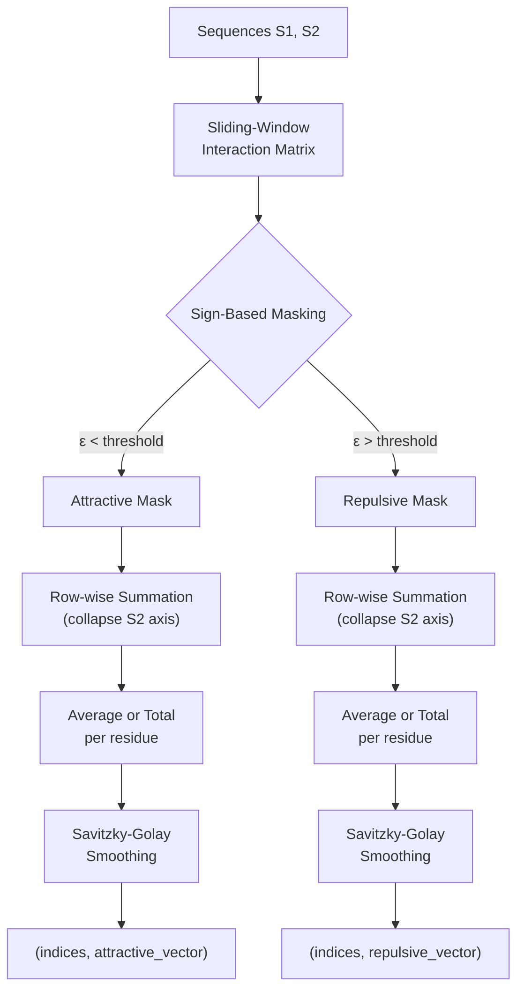
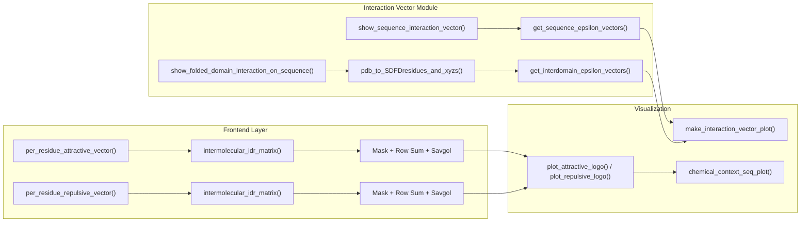

---
slug:7-per-residue-interaction-vectors
blog_type:normal
---


每个残基的相互作用向量将全局 ε 相互作用值分解为**位置解析图谱**，揭示了其中一条序列上的哪些残基驱动了与另一条序列之间的吸引或排斥相互作用。这是一种诊断透镜，将单一的标量摘要转化为逐残基的相互作用化学图谱——这对于识别“贴标”区域、理解结构域边界，以及在本质上无序区域内合理解释突变效应至关重要。

## 概念基础

每个残基的相互作用向量回答了这样一个问题：*对于序列 1 中的每个位置 i，它与序列 2 的净相互作用特征是什么？* 答案并非一个单一的数值，而是两个互补的向量——**吸引**和**排斥**——每个向量的长度均为 *N*（即参考序列中的残基数量）。这些向量的计算方式是：沿某一轴折叠完整的滑动窗口相互作用矩阵，应用基于符号的掩码以分离吸引（ε < 0）和排斥（ε > 0）贡献，并可选择对结果进行平滑处理。

这种分解之所以重要，是因为对某个区域取平均值可能会掩盖贴标与间隔之间的相互作用：一个区域可能在少数位置上具有强吸引力，而在其他位置则是排斥的。由于本质上无序区域（IDR）中的排斥区域可以通过重排来彼此规避，而吸引残基则主动驱动聚结，因此逐残基图谱使你能够识别推定的贴标残基，**而不会与邻近的排斥元素相混淆**。



来源: [frontend_base.py](finches/frontend/frontend_base.py#L570-L696), [frontend_base.py](finches/frontend/frontend_base.py#L702-L828)

## 两个 API 层：前端与相互作用向量模块

Finches 通过**两个互补的 API 层**暴露逐残基相互作用向量，每一层都适用于不同的工作流。前端层通过 `FinchesFrontend` 对象上的方法提供了最高级别且最便捷的访问方式，而 `interaction_vector` 模块则提供了带有直接绘图功能的独立函数。

| 特性 | 前端 (`FinchesFrontend`) | 相互作用向量模块 |
|---|---|---|
| 入口点 | `xf.per_residue_attractive_vector()` / `xf.per_residue_repulsive_vector()` | `show_sequence_interaction_vector()` / `show_folded_domain_interaction_vector()` |
| 返回值 | `(indices, values)` numpy 数组 | matplotlib 图形（若 `return_vectors=True` 则返回向量） |
| 计算基础 | 滑动窗口矩阵 → 行缩减 | 直接调用 `get_sequence_epsilon_vectors()` |
| 平滑处理 | 内置 Savitzky-Golay | 无（绘制原始向量） |
| 折叠结构域支持 | 否（仅支持 IDR–IDR） | 是，通过 PDB 表面残基支持 |
| 标志可视化 | 通过 `interlogo.plot_attractive_logo()` | 通过 `make_interaction_vector_plot()` |

来源: [frontend_base.py](finches/frontend/frontend_base.py#L570-L696), [interaction_vector.py](finches/interaction_vector.py#L100-L144)

## 前端 API：`per_residue_attractive_vector` 和 `per_residue_repulsive_vector`

任何 `FinchesFrontend` 实例（例如 `MpipiFrontend` 或 `CalvadosFrontend`）上的这些方法，都通过完整的滑动窗口相互作用矩阵来计算逐残基向量。计算分为三个阶段进行：**矩阵生成** → **掩码行缩减** → **平滑处理**。

### 吸引向量

```python
from finches.frontend.mpipi_frontend import MpipiFrontend

xf = MpipiFrontend()

seq1 = "MDFFVLSVQEGDSNVQVDVLGATAAYSVLEA"
seq2 = "GSTDRRAGATQNEVSMVSQLQDKVKVLGAP"

indices, attractive_vals = xf.per_residue_attractive_vector(
    seq1, seq2,
    window_size=31,
    return_total=False,
    attractive_threshold=0,
    smoothing_window=20,
    poly_order=3
)
```

该函数首先调用 `intermolecular_idr_matrix()` 获取滑动窗口矩阵 *B*，然后构造一个 `attractive_mask`，其中满足 `B < attractive_threshold`。对 `B * attractive_mask` 逐行求和，得出每个位置的总吸引贡献。当 `return_total=False`（默认值）时，该总和将除以每行中吸引项的数量，得出**平均**吸引相互作用；当设置为 `True` 时，将返回原始总和，这可以揭示具有许多微弱吸引残基的区域，这些残基能够共同驱动结合。

<CgxTip>设置 `return_total=True` 会将解释的侧重点从“每个残基的平均吸引力有多大”转变为“每个残基所受的总吸引力有多大”——后者在预测贴标驱动的相行为时具有更大的物理意义，因为多个弱贴标可以等效地协同作用，达到与少数强贴标相同的效果。</CgxTip>

### 排斥向量

```python
indices, repulsive_vals = xf.per_residue_repulsive_vector(
    seq1, seq2,
    window_size=31,
    return_total=False,
    repulsive_threshold=0,
    smoothing_window=20,
    poly_order=3
)
```

其逻辑与吸引向量类似，但应用了 `repulsive_mask = B > repulsive_threshold`。同样的 `return_total` 标志控制着返回平均值还是总和的行为。

### 参数参考

| 参数 | 类型 | 默认值 | 描述 |
|---|---|---|---|
| `seq1` | str | — | 第一条氨基酸序列（向量的参考序列） |
| `seq2` | str | — | 第二条氨基酸序列 |
| `window_size` | int | 31 | 相互作用矩阵的滑动窗口大小 |
| `use_cython` | bool | True | 使用 Cython 加速的矩阵计算 |
| `use_aliphatic_weighting` | bool | True | 按局部脂肪族残基密度加权 |
| `use_charge_weighting` | bool | True | 按局部电荷环境加权 |
| `return_total` | bool | False | 返回每行的总和而非平均值 |
| `attractive_threshold` / `repulsive_threshold` | float | 0 | 掩码的符号边界 |
| `smoothing_window` | int / False | 20 | Savitzky-Golay 窗口（传入 False 以禁用） |
| `poly_order` | int / False | 3 | Savitzky-Golay 多项式阶数（传入 False 以禁用） |

来源: [frontend_base.py](finches/frontend/frontend_base.py#L570-L696), [frontend_base.py](finches/frontend/frontend_base.py#L702-L828)

## 独立模块 API：`interaction_vector`

`finches.interaction_vector` 模块提供了四个独立于前端运行的函数，同时支持 **IDR–IDR** 和 **IDR–折叠结构域** 相互作用向量的计算，并内置了 matplotlib 绘图功能。

### IDR–IDR 相互作用向量

`show_sequence_interaction_vector()` 计算并绘制两条 IDR 序列之间的逐残基相互作用图谱。它是 `epsilon_calculation.get_sequence_epsilon_vectors()` 和 `make_interaction_vector_plot()` 的便捷封装：

```python
from finches.interaction_vector import show_sequence_interaction_vector
from finches.forcefields.mpipi import Mpipi_model
from finches.epsilon_calculation import InteractionMatrixConstructor

params = Mpipi_model(version='Mpipi_GGv1')
IMC = InteractionMatrixConstructor(parameters=params)

seq1 = "MDFFVLSVQEGDSNVQVDVLGATAAYSVLEA"
seq2 = "GSTDRRAGATQNEVSMVSQLQDKVKVLGAP"

fig = show_sequence_interaction_vector(
    seq1, seq2, IMC,
    charge_prefactor=None,
    null_interaction_baseline=None,
    use_charge_weighting=True,
    use_aliphatic_weighting=True,
    sequence_names=['Protein_A', 'Protein_B'],
    title=None
)
```

返回的图形将吸引向量（红色）和排斥向量（蓝色）显示为叠加的折线图，x 轴为残基位置。当 `all_resi_labels=True`（默认值）时，x 轴刻度标签将显示实际的氨基酸残基，并**按其化学类别着色**（芳香族 = 橙色，带电 = 红色/蓝色，极性 = 绿色，脂肪族 = 黑色，半胱氨酸 = 黄色，脯氨酸 = 紫色）。

### IDR–折叠结构域 相互作用向量

`show_folded_domain_interaction_on_sequence()` 将相互作用向量的计算扩展到 IDR 与**相邻折叠结构域上的溶剂可及残基**相互作用这一具有生物学关键意义的情况。它将 PDB 结构解析与结构域间向量计算链接在一起：

```python
from finches.interaction_vector import show_folded_domain_interaction_on_sequence

fig = show_folded_domain_interaction_on_sequence(
    pdb='structure.pdb',
    FD_start=50,
    FD_end=150,
    sequence2='GGGGDDDDRRRR...',  # the IDR
    X=IMC,
    idr_position='Cterm',
    sequence_of_ref='sequence2',  # project onto the IDR
    sequence_names=['Full_protein', 'IDR_region']
)
```

该工作流首先调用 `pdb_to_SDFDresidues_and_xyzs()` 提取溶剂可及折叠结构域（SAFD）残基及其 3D 坐标，然后将它们传递给 `get_interdomain_epsilon_vectors()`，该函数会考虑**空间邻近性**——在 3D 空间中更靠近 IDR 附着点的残基贡献更大。`sequence_of_ref` 参数控制向量投影到哪条序列上：`'sequence2'`（IDR）或 `'sequence1'`（SAFD 表面）。

### 完整折叠结构域向量

`make_interaction_vector_for_folded_domain()` 返回长度等于**整个折叠结构域**（而不仅仅是溶剂可及残基）的向量。埋藏位置用零填充，使向量可以直接与完整的结构域序列对齐：

```python
from finches.interaction_vector import make_interaction_vector_for_folded_domain

full_attractive, full_repulsive = make_interaction_vector_for_folded_domain(
    pdb='structure.pdb',
    FD_start=50, FD_end=150,
    sequence2='GGGGDDDDRRRR...',
    X=IMC,
    idr_position='Cterm'
)
# len(full_attractive) == FD_end - FD_start + 1
```

来源: [interaction_vector.py](finches/interaction_vector.py#L19-L95), [interaction_vector.py](finches/interaction_vector.py#L100-L144), [interaction_vector.py](finches/interaction_vector.py#L256-L314)

## 可视化：相互作用向量图与序列标志

### 折线图渲染

`make_interaction_vector_plot()` 将双重的吸引/排斥向量渲染为带有可配置残基标签 x 轴的 matplotlib 图形：

```python
from finches.interaction_vector import make_interaction_vector_plot

fig = make_interaction_vector_plot(
    attractive_vector, repulsive_vector, sequence1,
    sequence_names=['Protein_A', 'Protein_B'],
    title='Custom title',
    all_resi_labels=True,   # color-coded residue tick labels
    fig=None                # pass existing figure to overlay
)
```

该图形在 y=0 处使用一条灰色虚线作为相互作用基线，吸引值（负值，红色）位于下方，排斥值（正值，蓝色）位于上方。图形宽度随序列长度动态缩放，大约为 `len(sequence) / 5.5` 英寸。

### HTML 序列标志

`interlogo` 模块提供了一种替代的可视化方式，将氨基酸序列渲染为**带有残基特定字体大小的 HTML 字符串**，其中较大的字符表示较强的相互作用。这在 Jupyter 笔记本中快速视觉扫描贴标位置时特别有效：

```python
from finches.frontend.interlogo import plot_attractive_logo, plot_repulsive_logo

# Attractive logo: larger residues = more attractive
plot_attractive_logo(seq1, seq2, xf, window_size=31, quantile_threshold=0.7)

# Repulsive logo: larger residues = more repulsive
plot_repulsive_logo(seq1, seq2, xf, window_size=31, quantile_threshold=0.7)
```

`quantile_threshold` 参数（默认值为 0.7）控制视觉截断：低于相互作用幅度第 70 百分位的残基以浅灰色（`#cccccc`）渲染，从而将视线吸引到最强的相互作用残基上。残基按化学类别使用 6 类方案着色：

| 化学类别 | 残基 | 颜色 |
|---|---|---|
| 芳香族 | Y, W, F | `#ff9d00` (橙色) |
| 肪肪族 | A, L, M, I, V | `#171616` (近黑色) |
| 极性 | Q, N, S, T, H, G | `#04700d` (绿色) |
| 负电 | E, D | `#ff0d0d` (红色) |
| 正电 | R, K | `#2900f5` (蓝色) |
| 特殊 | C, P | `#ffe70d` (黄色), `#cf30b7` (紫色) |

底层的 `chemical_context_seq_plot()` 函数将相互作用向量归一化到字体大小范围（默认 3–40 像素），并委托给 `styled_text()` 生成 HTML，每 50 个残基插入一个换行符以提高可读性。

来源: [interaction_vector.py](finches/interaction_vector.py#L149-L253), [interlogo.py](finches/interlogo.py#L194-L268), [interlogo.py](finches/interlogo.py#L121-L173)

## 蛋白质-核酸相互作用向量

一个专门的变体 `protein_nucleic_vector()` 用于计算蛋白质与 poly-U RNA 序列之间的逐残基相互作用图谱。这绕过了完整的矩阵构建，而是使用针对固定 poly-U 靶标的**滑动窗口 epsilon 计算**：

```python
indices, binding_profile = xf.protein_nucleic_vector(
    seq='MDFFVLSVQEGDSNVQVDVLGATAAYSVLEA',
    fragsize=21,
    smoothing_window=30,
    poly_order=3
)
```

蛋白质中每个长度为 `fragsize` 的窗口都会与相同长度的 poly-U RNA 片段进行评估，并将得到的 epsilon 值（按片段长度归一化）分配给该窗口的中心。这生成了一个沿蛋白质链的 RNA 结合倾向的一维图谱。

来源: [frontend_base.py](finches/frontend/frontend_base.py#L834-L872)

## 计算流水线总结



来源: [interaction_vector.py](finches/interaction_vector.py#L1-L16), [frontend_base.py](finches/frontend/frontend_base.py#L567-L696), [interlogo.py](finches/interlogo.py#L1-L48)

## 实际考量

**平滑处理默认开启。** Savitzky-Golay 滤波器（window=20, poly_order=3）消除了逐残基图谱中的高频噪声，但可能会模糊结构域边界处的尖锐过渡。当你需要原始的残基级别信号时，可以通过传入 `smoothing_window=False` 或 `poly_order=False` 来禁用它。

**索引偏移取决于窗口大小。** 由于滑动窗口矩阵不会填充序列，返回的索引数组从 `(window_size + 1) / 2` 开始，到 `len(sequence) - (window_size - 1) / 2` 结束。请始终使用返回的索引，而不是假定其为 `range(len(sequence))`。

**`sequence_of_ref` 参数对折叠结构域很重要。** 当计算 IDR–折叠结构域向量时，`sequence_of_ref='sequence2'` 会将向量投影到 IDR 上（有助于识别哪些 IDR 残基受折叠表面的影响最大），而 `sequence_of_ref='sequence1'` 投影到 SAFD 表面上（有助于映射哪些表面斑块与 IDR 的相互作用最强）。

<CgxTip>对于折叠结构域分析，当需要将向量与完整结构域序列对齐（例如，与其他逐残基注释叠加）时，推荐使用 `make_interaction_vector_for_folded_domain()` 而非 `show_folded_domain_interaction_on_sequence()`，因为前者返回完整结构域长度的向量，并在埋藏位置处用零填充。</CgxTip>

来源: [interaction_vector.py](finches/interaction_vector.py#L256-L314), [frontend_base.py](finches/frontend/frontend_base.py#L652-L696)

## 相关页面

- 关于这些向量基础的滑动窗口矩阵，请参见 [Sliding Window Matrix Computation](10-sliding-window-matrix-computation)。
- 关于 epsilon 分解逻辑（吸引/排斥拆分），请参见 [Epsilon Calculation and Weighting](9-epsilon-calculation-and-weighting)。
- 关于托管 `per_residue_*_vector()` 方法的前端对象，请参见 [Mpipi and CALVADOS Frontends](5-mpipi-and-calvados-frontends)。
- 关于折叠结构域向量中使用的 PDB 表面残基提取，请参见 [PDB Surface Residue Extraction](16-pdb-surface-residue-extraction)。