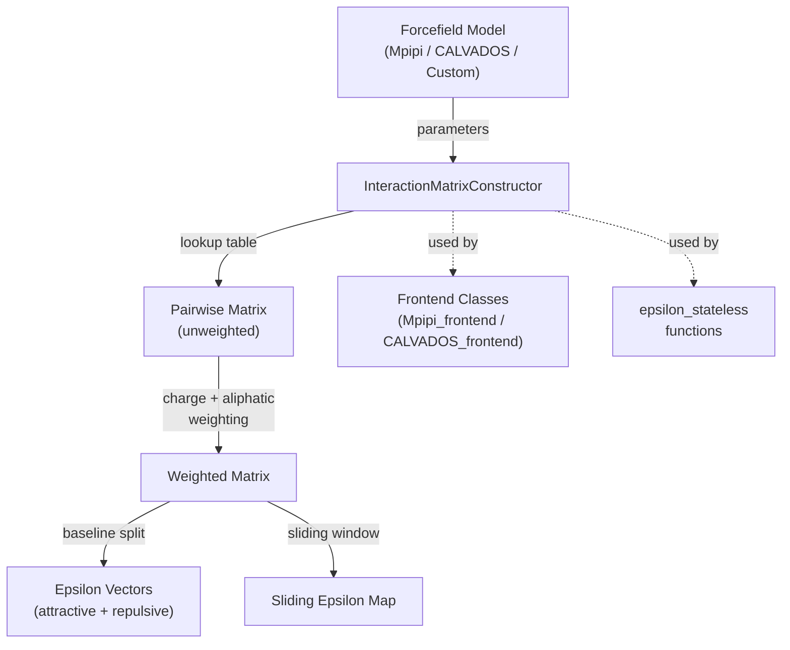

---
slug:8-interactionmatrixconstructor
blog_type:normal
---


**InteractionMatrixConstructor** 是 finches 中的核心计算引擎——一个通过**接口设计模式**连接力场模型与序列水平相互作用分析的类。它接受任何经过验证的力场对象（例如 Mpipi、CALVADOS），并暴露统一的 API，用于计算两两矩阵、加权矩阵、epsilon 向量以及滑动窗口 epsilon 图。如果你需要在前端提供的功能之外对相互作用计算进行细粒度控制，这就是你的入口。

来源：[epsilon_calculation.py](/finches/epsilon_calculation.py#L1-L25)

## 架构角色

`InteractionMatrixConstructor` 在 finches 的计算流水线中占据关键位置。力场模型定义了残基*如何*相互作用（生物物理层面）；而 `InteractionMatrixConstructor` 定义了利用这些相互作用*计算什么*（分析层面）。这种分离意味着相同的分析代码在不同力场下无需修改即可运行——这是经典的接口模式。



前端（[Mpipi 和 CALVADOS 前端](5-mpipi-and-calvados-frontends)）在内部实例化一个 `InteractionMatrixConstructor` 并将操作委托给它，而 `epsilon_stateless` 中的无状态函数则接受一个 IMC 实例作为其 `X` 参数，以实现零开销的函数调用。

来源：[epsilon_calculation.py](/finches/epsilon_calculation.py#L27-L42), [frontend_base.py](/finches/frontend/frontend_base.py#L40-L41)

## 初始化与配置

构造函数接受一个力场对象以及几个特定于模型的调优参数：

```python
from finches.forcefields.mpipi import Mpipi_model
from finches.epsilon_calculation import InteractionMatrixConstructor

# 初始化力场
Mpipi_GGv1_params = Mpipi_model(version='Mpipi_GGv1')

# 初始化 InteractionMatrixConstructor
IMC = InteractionMatrixConstructor(
    parameters=Mpipi_GGv1_params,
    sequence_converter=False,
    charge_prefactor=None,
    null_interaction_baseline=None,
    compute_forcefield_dependencies=False
)
```

| 参数 | 类型 | 默认值 | 用途 |
|-----------|------|---------|---------|
| `parameters` | 力场对象 | *(必填)* | `finches.forcefields` 中实现了 `ALL_RESIDUES_TYPES`、`compute_interaction_parameter()` 和 `CONFIGS` 的任何对象 |
| `sequence_converter` | 可调用对象 | `lambda a: a` | 在计算前转换输入序列（例如，掩码残基） |
| `charge_prefactor` | 浮点数 | 来自 `CONFIGS` | 缩放电荷加权强度的标量（0–1）；用于调节同种电荷排斥的软化程度 |
| `null_interaction_baseline` | 浮点数 | 来自 `CONFIGS` | 区分吸引与排斥相互作用的阈值；默认为 poly(GS) 参考值 |
| `compute_forcefield_dependencies` | 布尔值 | `False` | 若为 `True`，当 `CONFIGS` 中不可用时，将在运行时重新计算 `null_interaction_baseline` |

来源：[epsilon_calculation.py](/finches/epsilon_calculation.py#L20-L131)

### 力场契约

`parameters` 对象必须实现三个特定的属性——这就是**力场接口契约**：

1. **`ALL_RESIDUES_TYPES`** — 一个列表的列表，其中每个内部列表定义了属于同一分子类型的残基（例如，一个列表用于氨基酸，一个列表用于 RNA 碱基）。所有列表中的每个残基都必须具有可计算的两两参数。

2. **`compute_interaction_parameter(r1, r2)`** — 一个为任意有效残基对返回相互作用参数的函数。返回值是一个序列，其 `[0]` 号元素为标量相互作用强度（负数 = 吸引，正数 = 排斥）。

3. **`CONFIGS`** — 一个包含预计算的力场特定常量的字典，至少包括 `'charge_prefactor'` 和 `'null_interaction_baseline'`。

例如，Mpipi 模型将 `ALL_RESIDUES_TYPES` 定义为 `[['M','G','K','T','Y','A','D','E','V','L','Q','W','R','F','S','H','N','P','C','I'], ['U']]`，将蛋白质残基与 RNA 尿嘧啶分离开来。

来源：[epsilon_calculation.py](/finches/epsilon_calculation.py#L59-L89), [mpipi.py](/finches/forcefields/mpipi.py#L199-L199)

### 构造时的内部状态

在 `__init__` 期间，构造函数会构建一个**查找字典**——一个嵌套的 `dict`，其中 `self.lookup[r1][r2]` 直接映射到每个有效残基对的相互作用值。这种预计算意味着后续的矩阵计算避免了重复的力场函数调用，转而执行常数时间的字典查找。该查找表由 `_update_lookup_dict()` 构建，它会遍历扁平化残基集中所有叉积对。

来源：[epsilon_calculation.py](/finches/epsilon_calculation.py#L134-L189), [epsilon_calculation.py](/finches/epsilon_calculation.py#L195-L252)

## 核心方法

### 两两矩阵构建

这些方法通过序列到序列的残基查找来构建原始（未加权）的相互作用矩阵。

**`calculate_pairwise_heterotypic_matrix(sequence1, sequence2, convert_to_custom=True, use_cython=True)`** → 形状为 `(len(seq1), len(seq2))` 的 `np.ndarray`

返回完整的两两矩阵，其中每个元素 `[i][j]` 为 `self.lookup[seq1[i]][seq2[j]]`。通过 `matrix_manipulation.dict2matrix()` 实现的 Cython 加速路径比纯 Python 回退快约 10 倍。序列在计算前会通过序列转换器和 `_check_sequence()` 进行验证。

**`calculate_pairwise_homotypic_matrix(sequence, convert_to_custom=True)`** → `np.ndarray`

一个便捷的包装器，调用异型方法并传入 `sequence2 = sequence1`。

来源：[epsilon_calculation.py](/finches/epsilon_calculation.py#L396-L488)

### 加权矩阵构建

**`calculate_weighted_pairwise_matrix(sequence1, sequence2, convert_to_custom=True, charge_prefactor=None, use_charge_weighting=True, use_aliphatic_weighting=True, use_cython=True)`** → `np.ndarray`

这是引入生物物理上下文的环节。从原始两两矩阵开始，会依次应用两次加权操作：

1. **电荷加权** — 对于每对带电残基，将每个残基周围的局部 ±1 残基窗口拼接起来，并计算 `|NCPR|/FCR` 比率。该权重反映了同种电荷残基是否聚集在一起。加权矩阵变为：`w_matrix = matrix - (matrix * repulsive_mask * charge_prefactor)`，有效地软化了存在电荷簇区域的同种电荷排斥。

2. **脂肪族加权** — 一个由局部脂肪族区块（A、L、M、I、V）导出的乘性掩码，放大了嵌入在富含脂肪族区域中残基的相互作用强度。

这两种加权方案都可以通过各自的布尔标志独立切换。

来源：[epsilon_calculation.py](/finches/epsilon_calculation.py#L494-L603), [parsing_aminoacid_sequences.py](/finches/parsing_aminoacid_sequences.py#L25-L96)

### Epsilon 向量与值计算

**`calculate_epsilon_vectors(sequence1, sequence2, use_charge_weighting=True, use_aliphatic_weighting=True)`** → `tuple[list, list]`

返回 `(attractive_vector, repulsive_vector)`——相互作用的逐残基分解。内部委托给 `epsilon_stateless.get_sequence_epsilon_vectors()`，其流程为：(1) 构建加权矩阵，(2) 在 `null_interaction_baseline` 处将其分割为吸引/排斥子矩阵，(3) 减去基线使得零值代表无相互作用，(4) 计算列均值以生成逐残基向量。

**`calculate_epsilon_value(sequence1, sequence2, use_charge_weighting=True, use_aliphatic_weighting=True)`** → `float`

返回标量 epsilon——即吸引向量和排斥向量中所有元素的总和。该单一值量化了两个序列之间的整体相互作用强度。

来源：[epsilon_calculation.py](/finches/epsilon_calculation.py#L614-L701), [epsilon_stateless.py](/finches/epsilon_stateless.py#L119-L201)

### 滑动窗口 Epsilon

**`calculate_sliding_epsilon(sequence1, sequence2, window_size=31, use_charge_weighting=True, use_aliphatic_weighting=True, use_cython=True)`** → `tuple[np.ndarray, np.ndarray, np.ndarray]`

这是计算量最大且视觉信息最丰富的输出。它不是计算整个序列的单个 epsilon，而是在加权两两矩阵上滑动一个 `window_size × window_size` 的窗口，并为每个窗口位置计算局部 epsilon。结果是一个带有相关序列位置索引数组的 2D 热图矩阵。

返回的元组为 `(epsilon_matrix, seq2_indices, seq1_indices)`，其中索引数组将矩阵坐标映射回蛋白质空间的残基编号（从 1 开始索引）。默认使用通过 `matrix_manipulation.matrix_scan()` 实现的 Cython 路径以提升性能。

```python
B = IMC.calculate_sliding_epsilon(seq1, seq2, window_size=31)

import matplotlib.pyplot as plt
fig, ax = plt.subplots(figsize=(10, 10))
plt.imshow(B[0],
           extent=[B[1][0], B[1][-1], B[2][0], B[2][-1]],
           aspect='auto', vmax=4, vmin=-4,
           cmap='seismic', origin='lower')
```

<CgxTip>窗口大小必须为奇数——如果传入偶数值，它会被静默递增。窗口不能超过任一序列的长度。</CgxTip>

来源：[epsilon_calculation.py](/finches/epsilon_calculation.py#L705-L872)

## 实用与更新方法

### 序列验证

**`_check_sequence(sequence)`** — 验证序列中的所有残基是否恰好属于 `self.valid_residue_groups` 中的**一个**残基组。如果序列混合了残基类型（例如，同一字符串中包含蛋白质和 RNA）或包含未知残基，则抛出异常。

**`get_converted_sequence(sequence)`** → `str` — 将序列传递给 `self.sequence_converter`，然后进行验证。有助于检查实际参与计算的转换后序列。

来源：[epsilon_calculation.py](/finches/epsilon_calculation.py#L302-L383)

### 力场热替换

**`_update_parameters(new_parameters)`** — 替换当前的力场对象并重建查找字典，同时保留 `charge_prefactor`、`sequence_converter` 和 `null_interaction_baseline`。这使得无需完全重新实例化即可在运行时切换力场。

**`_update_lookup_dict(unknown_set_to_zero=False)`** — 使用当前的 `self.parameters` 从头重建 `self.lookup` 字典。若 `unknown_set_to_zero=True`，缺失的残基对将被静默设置为 0.0 而不是抛出错误——这对于参数集不完整的模型很有用。

来源：[epsilon_calculation.py](/finches/epsilon_calculation.py#L195-L296)

## 完整方法摘要

| 方法 | 返回值 | 描述 |
|--------|---------|-------------|
| `calculate_pairwise_homotypic_matrix(seq)` | `np.ndarray (n×n)` | 原始未加权的自相互作用矩阵 |
| `calculate_pairwise_heterotypic_matrix(s1, s2)` | `np.ndarray (n×m)` | 原始未加权的交叉相互作用矩阵 |
| `calculate_weighted_pairwise_matrix(s1, s2)` | `np.ndarray (n×m)` | 电荷 + 脂肪族加权后的矩阵 |
| `calculate_epsilon_vectors(s1, s2)` | `(list, list)` | 逐残基的吸引和排斥向量 |
| `calculate_epsilon_value(s1, s2)` | `float` | 标量整体相互作用强度 |
| `calculate_sliding_epsilon(s1, s2)` | `(matrix, idx1, idx2)` | 带索引的 2D 局部 epsilon 热图 |
| `get_converted_sequence(seq)` | `str` | 经转换器 + 验证后的序列 |
| `_update_parameters(params)` | `None` | 热替换力场，重建查找表 |
| `_update_lookup_dict()` | `None` | 从当前参数重建查找表 |

来源：[epsilon_calculation.py](/finches/epsilon_calculation.py#L18-L874)

## 数据流：从残基到 Epsilon

一对序列的完整计算流水线遵循以下演进过程：

```mermaid
flowchart LR
    A["Residue pair<br/>r1, r2"] -->|lookup[r1][r2]| B["Raw pairwise<br/>matrix"]
    B -->|charge_prefactor ×<br/>repulsive_mask| C["Charge-weighted<br/>matrix"]
    C -->|× aliphatic_mask| D["Fully weighted<br/>matrix"]
    D -->|split at baseline| E["Attractive +<br/>Repulsive matrices"]
    E -->|subtract baseline<br/>+ column means| F["Epsilon vectors"]
    F -->|sum| G["Scalar epsilon"]
    D -->|sliding window| H["2D epsilon map"]
```

该类中的每个方法都是这条单一计算路径上的路标——这些方法仅仅暴露了流水线不同阶段的中间结果。

来源：[epsilon_calculation.py](/finches/epsilon_calculation.py#L386-L872), [epsilon_stateless.py](/finches/epsilon_stateless.py#L14-L49)

## 与其他组件的关系

`InteractionMatrixConstructor` **被**以下组件**消费**（而非消费者）：

- **前端类** — `Mpipi_frontend` 和 `CALVADOS_frontend` 都将 IMC 实例存储为 `self.IMC_object`，并将它们的 `intermolecular_idr_matrix()` 和 epsilon 调用委托给它。参见 [Mpipi 和 CALVADOS 前端](5-mpipi-and-calvados-frontends)。

- **`epsilon_stateless` 函数** — 无状态函数 `get_sequence_epsilon_vectors()` 和 `get_sequence_epsilon_value()` 接受 IMC 作为其 `X` 参数，并调用其 `calculate_weighted_pairwise_matrix()` 方法。参见 [Epsilon 计算与加权](9-epsilon-calculation-and-weighting)。

- **`interaction_vector` 模块** — 可视化函数将 IMC 传递给 epsilon 计算，以生成逐残基相互作用图。参见 [逐残基相互作用向量](7-per-residue-interaction-vectors)。

- **Cython 加速** — `calculate_pairwise_heterotypic_matrix()` 和 `calculate_sliding_epsilon()` 都通过 `matrix_manipulation` 的 Cython 函数来处理性能关键的循环。参见 [Cython 矩阵加速](20-cython-matrix-acceleration)。

<CgxTip>在直接使用 IMC 和使用前端之间做选择时，对于标准分析建议首选前端。当你需要自定义加权组合、检查中间矩阵或在单次会话中进行力场热替换时，请直接使用 IMC。</CgxTip>