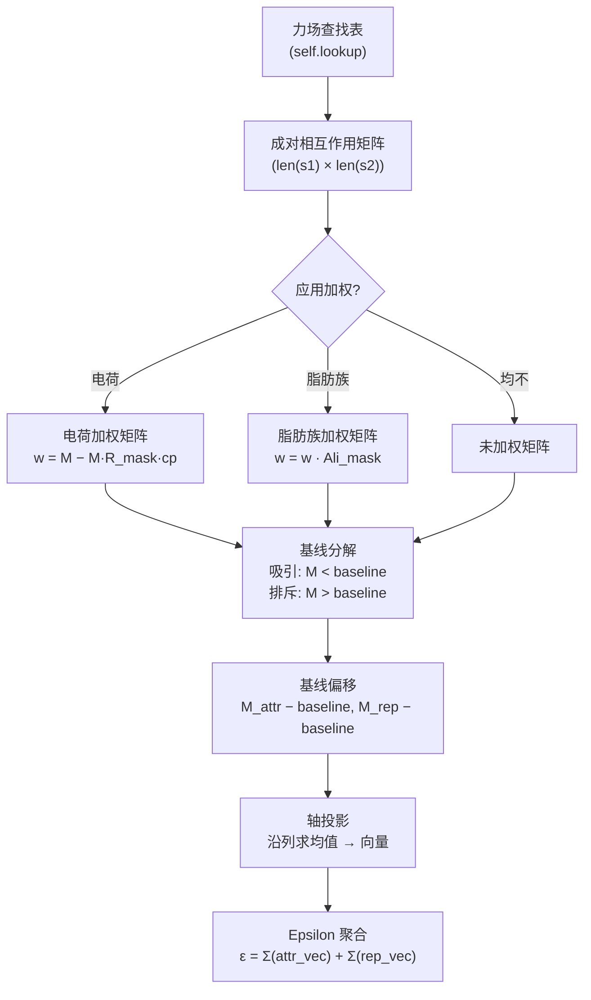

---
slug:9-epsilon-calculation-and-weighting
blog_type:normal
---


epsilon 计算流程是 finches 的定量核心——它将原始的成对力场参数转换为标量相互作用参数（ε），该参数编码了两个氨基酸序列之间净吸引与排斥的特征。该流程通过分层架构运行：力场查找 → 矩阵构建 → 上下文加权 → 基线分解 → epsilon 聚合。理解每一层对于解释相行为预测以及在前端默认值之外自定义分析至关重要。

## 计算流程概述

epsilon 的计算遵循确定性的五阶段流程。每个阶段将原始残基间能量逐步细化为更符合生物物理现实的序列:序列相互作用表征：



该流程由 `InteractionMatrixConstructor` 类（负责控制矩阵构建和加权）以及 `epsilon_stateless` 中的无状态函数（负责处理分解和聚合）协调执行。这种分离确保了无论输入矩阵来源于同型、异型还是结构域间计算，都应用相同的分解逻辑。

来源：[epsilon_calculation.py](/finches/epsilon_calculation.py#L18-L131), [epsilon_stateless.py](/finches/epsilon_stateless.py#L1-L50)

## InteractionMatrixConstructor 作为 Epsilon 引擎

`InteractionMatrixConstructor` 是所有 epsilon 相关计算流经的主要对象。它使用力场参数对象和两个特定模型的校准常量——`charge_prefactor` 和 `null_interaction_baseline`——进行初始化，这两个常量分别控制原始交互值的加权和划分方式：

```python
from finches.forcefields.mpipi import Mpipi_model
from finches.epsilon_calculation import InteractionMatrixConstructor

# 初始化力场
params = Mpipi_model(version='Mpipi_GGv1')

# 使用自动校准的常量初始化构造器
IMC = InteractionMatrixConstructor(parameters=params)
```

在构造时，该对象会构建一个**查找字典**（`self.lookup`），通过 `parameters.compute_interaction_parameter(r1, r2)` 预先计算所有有效残基对的相互作用。该字典是所有后续矩阵操作的基础，避免了在序列分析期间进行冗余的力场计算。如果未显式提供 `charge_prefactor` 或 `null_interaction_baseline`，构造器将尝试从 `parameters.CONFIGS` 中获取预计算值；如果不可用且 `compute_forcefield_dependencies=True`，则会即时重新计算。

来源：[epsilon_calculation.py](/finches/epsilon_calculation.py#L18-L189)

### 构造器参数及其作用

| 参数 | 类型 | 作用 | 默认来源 |
|---|---|---|---|
| `parameters` | 力场对象 | 提供 `compute_interaction_parameter()`、`ALL_RESIDUES_TYPES`、`CONFIGS` | 必需 |
| `sequence_converter` | 函数 | 在矩阵构建前转换输入序列（例如掩码处理） | 恒等函数 |
| `charge_prefactor` | float ∈ (0, 1) | 缩放排斥相互作用中电荷上下文加权的强度 | `parameters.CONFIGS['charge_prefactor']` |
| `null_interaction_baseline` | float | 划分吸引和排斥相互作用的阈值 | `parameters.CONFIGS['null_interaction_baseline']` |
| `compute_forcefield_dependencies` | bool | 如果 `CONFIGS` 中缺失校准常量，则重新计算 | `False` |

`sequence_converter` 参数实现了强大的间接调用：可以注入任何将输入字符串转换为有效残基序列的函数，从而允许在不修改核心计算路径的情况下进行掩码处理、结构域提取或残基重映射。

来源：[epsilon_calculation.py](/finches/epsilon_calculation.py#L20-L131)

## 零相互作用基线校准

**零相互作用基线**是 epsilon 流程中影响最大的校准常量。它定义了能量阈值：低于该阈值的成对相互作用被分类为*吸引*，高于该阈值则被分类为*排斥*。该阈值不为零——它是参考序列的相互作用能，该参考序列预期表现为非相互作用的 Gaussian 链。标准参考序列是 400 个残基的 poly(GS) 重复序列：

```python
# 校准函数内部求解的过程
seq = 'GS' * 200
# 寻找使 epsilon(seq, seq) = 0 的基线
result = root_scalar(f, bracket=[-10.0, 10.0])
```

校准过程使用 `scipy.optimize.root_scalar` 来寻找计算出的 poly(GS) 同源二聚体的 epsilon 越过零点时的基线值，此时电荷和脂肪族加权均被**禁用**。这种寻根方法确保了基线与底层力场自洽——更改力场版本需要重新校准。

`finches.data.forcefield_dependencies` 中的 `get_null_interaction_baseline` 函数为新的或自定义力场公开了此校准过程。预计算的基线存储在每个力场的 `CONFIGS` 字典中，以避免在运行时进行昂贵的重复计算。

来源：[forcefield_dependencies.py](/finches/data/forcefield_dependencies.py#L17-L68)

## 矩阵构建：从查找到成对数组

三种矩阵构建方法构成了 epsilon 计算的基础，每种方法都生成一个二维 NumPy 数组，其中元素 `[i][j]` 表示序列 1 的残基 `i` 与序列 2 的残基 `j` 之间的相互作用能：

### 未加权矩阵构建

**`calculate_pairwise_heterotypic_matrix(sequence1, sequence2)`** 通过在 `self.lookup` 中查找每个残基对来构建原始相互作用矩阵。有两种后端可用：速度约快 10 倍的 Cython 实现（`matrix_manipulation.dict2matrix`）和纯 Python 回退方案。同型变体（`calculate_pairwise_homotypic_matrix`）只需简单地使用两个相同的序列调用异型方法即可。

### 加权矩阵构建

**`calculate_weighted_pairwise_matrix(sequence1, sequence2, ...)`** 对原始矩阵应用两种可选的加权方案，由布尔标志控制：

```python
w_matrix = IMC.calculate_weighted_pairwise_matrix(
    sequence1, sequence2,
    use_charge_weighting=True,    # 缩放排斥的电荷-电荷相互作用
    use_aliphatic_weighting=True   # 增强成簇的脂肪族相互作用
)
```

加权是**按顺序**应用的——首先是电荷加权，然后对已经过电荷加权的矩阵进行脂肪族加权。此顺序很重要，因为脂肪族加权是一个乘性掩码，它可以放大或衰减已被电荷加权修改的值。

来源：[epsilon_calculation.py](/finches/epsilon_calculation.py#L426-L603)

## 电荷上下文加权

电荷加权实现了一种生物物理洞察：两个残基之间的同电荷排斥取决于每个残基周围的**局部电荷上下文**，而不仅仅是孤立的残基对。两侧被其他赖氨酸包围的两个赖氨酸比嵌入在中性序列上下文中的两个赖氨酸经历更强的有效排斥，因为同电荷残基簇无法重新定向其侧链以彼此避开。

加权计算如下：

$$w_{matrix} = M - (M \times R_{mask} \times c_p)$$

其中 $R_{mask}$ 是排斥电荷掩码，$c_p$ 是 `charge_prefactor`。该掩码通过检查每个带电残基对 `(r1, r2)` 并计算每个残基在 ±1 残基窗口内的局部电荷不对称性来构建：

$$\text{charge\_weight} = \left|\frac{\text{NCPR}}{\text{FCR}}\right|$$

此处，NCPR 是每个残基的净电荷，FCR 是拼接的局部片段中带电残基的比例。当片段均匀带同种电荷时（需要最大排斥缓解），该比率接近 1.0；当片段电荷平衡时（无需缓解），该比率接近 0.0。仅应用电荷加权的**排斥**分量——虽然计算了吸引掩码，但目前未使用，因为经验验证表明，仅排斥方案在所有基准测试中表现更好。

| 片段示例 | NCPR | FCR | |NCPR/FCR| | 解释 |
|---|---|---|---|---|
| `KKK` + `KKK` | +1.0 | 1.0 | 1.0 | 最大排斥缓解 |
| `EEE` + `EEE` | −1.0 | 1.0 | 1.0 | 最大排斥缓解 |
| `KKK` + `EEE` | 0.0 | 1.0 | 0.0 | 无缓解（异种电荷） |
| `KAK` + `EAE` | 0.0 | 0.67 | 0.0 | 无缓解（电荷平衡） |

来源：[parsing_aminoacid_sequences.py](/finches/parsing_aminoacid_sequences.py#L25-L194), [epsilon_calculation.py](/finches/epsilon_calculation.py#L546-L594)

## 脂肪族上下文加权

脂肪族加权近似模拟了一种溶剂介导效应：脂肪族残基之间的疏水吸引并非简单的成对叠加，而是取决于脂肪族残基是否形成**连续簇**。单个亮氨酸在孤立状态下具有最小的疏水驱动力，但三个相邻亮氨酸的序列创建了足够大的界面以释放多个水分子，从而产生不成比例的更强吸引力。

实现过程分为两个阶段：

1. **分组**：每个脂肪族残基 (A, V, I, L, M) 根据其最近邻中同样为脂肪族的数量被分配一个组号（0、1、2 或 3）。组 0 = 非脂肪族；组 1 = 孤立脂肪族；组 2 = 一个脂肪族相邻；组 3 = 两个或更多脂肪族相邻。

2. **掩码乘法**：对称乘数表将组组合映射到缩放因子：

| 组₁ \ 组₂ | 1 (孤立) | 2 (对) | 3 (簇) |
|---|---|---|---|
| **1** (孤立) | 1.0 | 1.0 | 1.0 |
| **2** (对) | 1.0 | 1.5 | 1.5 |
| **3** (簇) | 1.0 | 1.5 | **3.0** |

最终加权矩阵为：`w_matrix = w_matrix * aliphatic_mask`。这意味着跨序列相互作用的两个成簇脂肪族区域其吸引相互作用获得 **3 倍提升**，而孤立脂肪族保留其未加权值（乘数 = 1.0）。表中的不对称性（簇 × 簇 = 3.0，而对 × 对 = 1.5）反映了水释放随界面尺寸的非线性缩放。

来源：[parsing_aminoacid_sequences.py](/finches/parsing_aminoacid_sequences.py#L252-L341)

## 基线分解与 Epsilon 聚合

一旦构建了加权矩阵，`epsilon_stateless` 中的无状态函数会将其划分为吸引和排斥分量，并聚合每个残基或全序列的 epsilon 值。

### 吸引-排斥分解

**`get_attractive_repulsive_matrices(matrix, null_interaction_baseline)`** 执行阈值拆分：

```python
attractive_matrix = (matrix < null_interaction_baseline) * matrix
repulsive_matrix  = (matrix > null_interaction_baseline) * matrix
```

恰好等于基线的元素在两个矩阵中均置零。然后从两个矩阵中减去基线，使得零代表非相互作用参考，负值表示吸引，正值表示排斥：

```python
attractive_matrix = attractive_matrix - null_interaction_baseline
repulsive_matrix  = repulsive_matrix  - null_interaction_baseline
```

### Epsilon 向量

**`get_sequence_epsilon_vectors(sequence1, sequence2, X, ...)`** 通过沿列轴投影分解后的矩阵（对序列 2 残基取均值，计算序列 1 每个残基的值）来生成每个残基的向量：

```python
attractive_vector = np.mean(attractive_matrix, axis=1)  # len == len(sequence1)
repulsive_vector  = np.mean(repulsive_matrix, axis=1)
```

这些向量揭示了序列 1 中哪些区域相对于序列 2 是局部吸引或排斥的，并且是相互作用向量图的基础数据。

### 标量 Epsilon

**`get_sequence_epsilon_value(sequence1, sequence2, X, ...)`** 将向量折叠为单个标量：

```python
epsilon = np.sum(attractive_vector) + np.sum(repulsive_vector)
```

负 epsilon 表示净吸引相互作用（驱动凝聚）；正 epsilon 表示净排斥。该标量是构建 Flory-Huggins 相图的输入。

来源：[epsilon_stateless.py](/finches/epsilon_stateless.py#L14-L268)

## 结构域间 Epsilon：折叠结构域表面相互作用

epsilon 计算的一种特殊变体用于处理**折叠结构域（FD）的溶剂可及表面**与相邻本征无序区（IDR）之间的相互作用。函数 `get_interdomain_epsilon_vectors()` 引入了一个空间可及性掩码（`SAFD_cords`），该掩码将相互作用限制在 IDR 链可及的 FD 表面残基上，给定 IDR 的附着点（C 端、N 端或自定义原点）：

```python
from finches.epsilon_stateless import get_interdomain_epsilon_value

epsilon = get_interdomain_epsilon_value(
    SAFD_sequence,   # 仅表面残基
    idr_sequence,    # IDR
    IMC,             # InteractionMatrixConstructor
    SAFD_cords,      # 用于掩码的空间坐标
    IDR_positon='Cterm',
    sequence_of_ref='sequence2'  # 投影到 IDR 上
)
```

与标准 epsilon 计算的关键区别：(1) 成对矩阵受空间可及性过滤器（`build_column_mask_based_on_xyz`）掩码处理，(2) **不应用脂肪族加权**，因为脂肪族分组仅在连续序列区域之间有意义，而折叠结构域表面残基在定义上是不连续的。电荷加权使用专用的 FD 变体（`get_charge_weighted_FD_mask`），其中 FD 残基被视为孤立（FD 侧无 ±1 窗口）。

来源：[epsilon_stateless.py](/finches/epsilon_stateless.py#L271-L530)

## 方法目录：InteractionMatrixConstructor

下表总结了 `InteractionMatrixConstructor` 类上所有与 epsilon 相关的方法及其与无状态函数层的关系：

| IMC 方法 | 委托给 | 返回 | 描述 |
|---|---|---|---|
| `calculate_pairwise_heterotypic_matrix(s1, s2)` | Cython/Python 查找 | `np.array (len_s1 × len_s2)` | 原始未加权矩阵 |
| `calculate_pairwise_homotypic_matrix(s)` | heterotypic(s, s) | `np.array (n × n)` | 自相互作用矩阵 |
| `calculate_weighted_pairwise_matrix(s1, s2, ...)` | 异型 + 加权 | `np.array (len_s1 × len_s2)` | 电荷 + 脂肪族加权矩阵 |
| `calculate_epsilon_vectors(s1, s2, ...)` | `get_sequence_epsilon_vectors` | `(attr_vec, rep_vec)` | 每个残基的吸引/排斥向量 |
| `calculate_epsilon_value(s1, s2, ...)` | `get_sequence_epsilon_value` | `float` | 标量 epsilon |
| `calculate_sliding_epsilon(s1, s2, window_size, ...)` | Cython/Python 滑动窗口 | `(matrix, s2_idx, s1_idx)` | 局部 epsilon 分布 |

来源：[epsilon_calculation.py](/finches/epsilon_calculation.py#L396-L872)

## 加权标志组合及其语义

`use_charge_weighting` 和 `use_aliphatic_weighting` 标志的四种可能组合会产生性质不同的相互作用模型：

| 电荷 | 脂肪族 | 生物物理解释 | 适用场景 |
|---|---|---|---|
| ✗ | ✗ | 纯平均场：每个残基对贡献其裸力场值 | 基线比较；调试；力场验证 |
| ✓ | ✗ | 电荷上下文感知：同电荷簇获得排斥缓解 | 具有显著电荷模式的序列 |
| ✗ | ✓ | 脂肪族簇感知：疏水斑块获得吸引增强 | 具有脂肪族成簇但电荷最少的序列 |
| ✓ | ✓ | 完整生物物理模型：两种效应均激活 | **默认且推荐用于生产环境** |

`calculate_epsilon_value` 和 `calculate_epsilon_vectors` 的默认设置是**两者均启用**（`True`），这反映了在 finches 基准测试套件中经验验证的配置。

来源：[epsilon_calculation.py](/finches/epsilon_calculation.py#L614-L701), [epsilon_stateless.py](/finches/epsilon_stateless.py#L120-L268)

<CgxTip>`null_interaction_baseline` 是力场版本特定的——将一个力场版本的基线与另一版本的参数混合使用将导致静默的 epsilon 值错误。务必验证 `IMC.null_interaction_baseline` 是否与力场 `CONFIGS` 字典中的预期值匹配。</CgxTip>

<CgxTip>电荷加权仅生成排斥修正（同电荷簇获得排斥缓解）。尽管代码计算了吸引掩码，但不存在吸引电荷加权——这是经验验证得出的有意设计决策，而非缺陷。</CgxTip>

## 相关页面

- `InteractionMatrixConstructor` 类的详细文档见 [InteractionMatrixConstructor](8-interactionmatrixconstructor)
- 滑动窗口 epsilon 计算扩展了这些概念，见 [Sliding Window Matrix Computation](10-sliding-window-matrix-computation)
- 此处描述的加权方案连接至更广泛的框架，见 [Sequence Context Weighting Schemes](19-sequence-context-weighting-schemes)
- 输入到 epsilon 计算的力场参数对象：[Mpipi Forcefield Parameters](11-mpipi-forcefield-parameters) 和 [CALVADOS Forcefield Parameters](12-calvados-forcefield-parameters)
- Epsilon 值流入相图构建，见 [Flory-Huggins Phase Diagrams](14-flory-huggins-phase-diagrams)