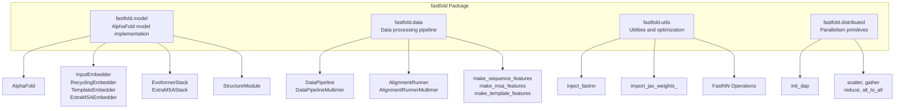
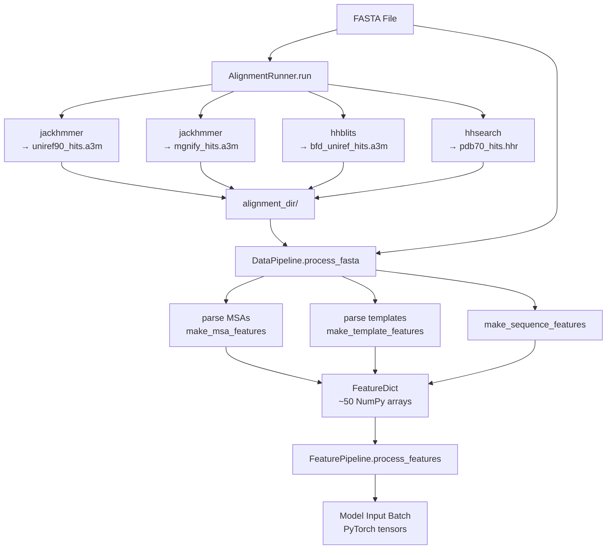
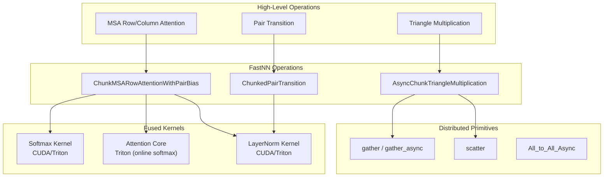
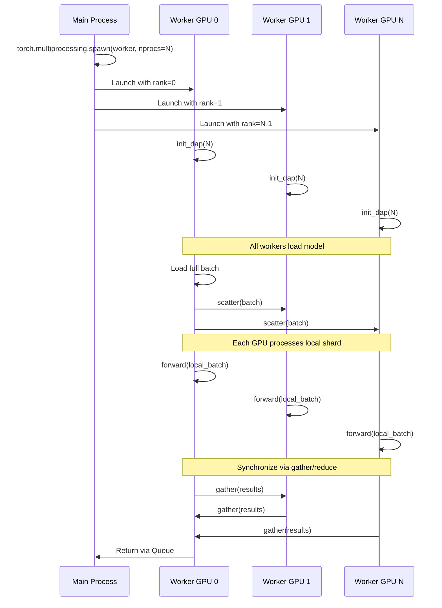

# API Reference

> **Relevant source files**
> * [README.md](https://github.com/hpcaitech/FastFold/blob/eba49680/README.md?plain=1)
> * [environment.yml](https://github.com/hpcaitech/FastFold/blob/eba49680/environment.yml)
> * [fastfold/common/protein.py](https://github.com/hpcaitech/FastFold/blob/eba49680/fastfold/common/protein.py)
> * [fastfold/data/data_pipeline.py](https://github.com/hpcaitech/FastFold/blob/eba49680/fastfold/data/data_pipeline.py)
> * [fastfold/model/hub/alphafold.py](https://github.com/hpcaitech/FastFold/blob/eba49680/fastfold/model/hub/alphafold.py)
> * [fastfold/model/nn/embedders.py](https://github.com/hpcaitech/FastFold/blob/eba49680/fastfold/model/nn/embedders.py)
> * [fastfold/model/nn/template.py](https://github.com/hpcaitech/FastFold/blob/eba49680/fastfold/model/nn/template.py)
> * [fastfold/utils/import_weights.py](https://github.com/hpcaitech/FastFold/blob/eba49680/fastfold/utils/import_weights.py)
> * [inference.py](https://github.com/hpcaitech/FastFold/blob/eba49680/inference.py)

This page provides comprehensive API documentation for FastFold's public interfaces. It covers the core classes, functions, and modules that developers interact with when using FastFold for protein structure prediction, training, or building custom applications.

**Scope**: This reference documents programmatic interfaces only. For usage patterns and workflows, see [Getting Started](/hpcaitech/FastFold/2-getting-started), [Inference Pipeline](/hpcaitech/FastFold/5-inference-pipeline), and [Training System](/hpcaitech/FastFold/7-training-system). For performance optimization APIs, see [Performance Optimizations](/hpcaitech/FastFold/8-performance-optimizations).

---

## Module Organization

FastFold's API is organized into four primary modules:



**Sources**: [README.md L82-L113](https://github.com/hpcaitech/FastFold/blob/eba49680/README.md?plain=1#L82-L113)

 [fastfold/model/hub/alphafold.py L1-L535](https://github.com/hpcaitech/FastFold/blob/eba49680/fastfold/model/hub/alphafold.py#L1-L535)

 [fastfold/data/data_pipeline.py L1-L1297](https://github.com/hpcaitech/FastFold/blob/eba49680/fastfold/data/data_pipeline.py#L1-L1297)

---

## 11.1 Model API

The Model API provides the core AlphaFold architecture implementation and its constituent components.

### Core Model Class

#### AlphaFold

**Location**: [fastfold/model/hub/alphafold.py L46-L534](https://github.com/hpcaitech/FastFold/blob/eba49680/fastfold/model/hub/alphafold.py#L46-L534)

Main model class implementing the AlphaFold architecture (Algorithm 2 from the paper).

**Constructor Signature**:

```
AlphaFold(config: ml_collections.ConfigDict)
```

| Parameter | Type | Description |
| --- | --- | --- |
| `config` | `ConfigDict` | Configuration object from `model_config()` containing model architecture parameters |

**Key Attributes**:

| Attribute | Type | Description |
| --- | --- | --- |
| `globals` | `ConfigDict` | Global configuration (chunk_size, inplace, is_multimer) |
| `input_embedder` | `InputEmbedder` or `InputEmbedderMultimer` | Embeds input features into MSA and pair representations |
| `recycling_embedder` | `RecyclingEmbedder` | Embeds previous iteration outputs for recycling |
| `template_embedder` | `TemplateEmbedder` or `TemplateEmbedderMultimer` | Processes template structures |
| `extra_msa_embedder` | `ExtraMSAEmbedder` | Embeds extra MSA sequences |
| `extra_msa_stack` | `ExtraMSAStack` | Processes extra MSA features |
| `evoformer` | `EvoformerStack` | Main trunk processing MSA and pair representations |
| `structure_module` | `StructureModule` | Predicts 3D atomic coordinates |
| `aux_heads` | `AuxiliaryHeads` | Prediction heads (pLDDT, distogram, TM-score, etc.) |

**Primary Methods**:

##### forward(batch: Dict[str, torch.Tensor]) -> Dict[str, torch.Tensor]

**Location**: [fastfold/model/hub/alphafold.py L444-L534](https://github.com/hpcaitech/FastFold/blob/eba49680/fastfold/model/hub/alphafold.py#L444-L534)

Runs forward pass through the model.

**Parameters**:

| Parameter | Type | Shape | Description |
| --- | --- | --- | --- |
| `batch["aatype"]` | `torch.Tensor` | `[*, N_res, N_recycle]` | Residue type indices (not one-hot) |
| `batch["target_feat"]` | `torch.Tensor` | `[*, N_res, C_tf, N_recycle]` | One-hot target sequence encoding |
| `batch["residue_index"]` | `torch.Tensor` | `[*, N_res, N_recycle]` | Consecutive residue indices |
| `batch["msa_feat"]` | `torch.Tensor` | `[*, N_seq, N_res, C_msa, N_recycle]` | MSA features |
| `batch["seq_mask"]` | `torch.Tensor` | `[*, N_res, N_recycle]` | 1D sequence mask |
| `batch["msa_mask"]` | `torch.Tensor` | `[*, N_seq, N_res, N_recycle]` | MSA mask |
| `batch["template_*"]` | `torch.Tensor` | Various | Template features (if enabled) |
| `batch["extra_msa_*"]` | `torch.Tensor` | Various | Extra MSA features (if enabled) |

**Returns**:

| Key | Shape | Description |
| --- | --- | --- |
| `"msa"` | `[*, N_seq, N_res, C_m]` | Final MSA representation |
| `"pair"` | `[*, N_res, N_res, C_z]` | Final pair representation |
| `"single"` | `[*, N_res, C_s]` | Single representation for structure module |
| `"sm"` | `Dict` | Structure module outputs (positions, frames) |
| `"final_atom_positions"` | `[*, N_res, 37, 3]` | Predicted atom37 coordinates |
| `"final_atom_mask"` | `[*, N_res, 37]` | Atom presence mask |
| `"plddt"` | `[*, N_res]` | Per-residue confidence (pLDDT) |
| `"distogram"` | `Dict` | Distance distribution logits |
| `"predicted_aligned_error"` | `Dict` | PAE/TM-score predictions (if PTM head enabled) |

**Example Usage**:

```javascript
from fastfold.model.hub import AlphaFoldfrom fastfold.config import model_config # Initialize modelconfig = model_config("model_1")model = AlphaFold(config) # Forward passoutputs = model(batch)positions = outputs["final_atom_positions"]  # [*, N_res, 37, 3]plddt = outputs["plddt"]  # [*, N_res]
```

##### iteration(feats, m_1_prev, z_prev, x_prev, _recycle=True)

**Location**: [fastfold/model/hub/alphafold.py L173-L424](https://github.com/hpcaitech/FastFold/blob/eba49680/fastfold/model/hub/alphafold.py#L173-L424)

Single recycling iteration. Called internally by `forward()`.

**Sources**: [fastfold/model/hub/alphafold.py L46-L534](https://github.com/hpcaitech/FastFold/blob/eba49680/fastfold/model/hub/alphafold.py#L46-L534)

---

### Embedder Classes

#### InputEmbedder

**Location**: [fastfold/model/nn/embedders.py L35-L137](https://github.com/hpcaitech/FastFold/blob/eba49680/fastfold/model/nn/embedders.py#L35-L137)

Embeds target and MSA features into initial representations (Algorithm 3).

**Constructor Parameters**:

| Parameter | Type | Description |
| --- | --- | --- |
| `tf_dim` | `int` | Target feature dimension (typically 21 or 22) |
| `msa_dim` | `int` | MSA feature dimension (typically 49) |
| `c_z` | `int` | Pair embedding channel dimension |
| `c_m` | `int` | MSA embedding channel dimension |
| `relpos_k` | `int` | Relative position encoding window size |

**Methods**:

##### forward(tf, ri, msa) -> Tuple[torch.Tensor, torch.Tensor]

| Input | Shape | Description |
| --- | --- | --- |
| `tf` | `[*, N_res, tf_dim]` | Target features |
| `ri` | `[*, N_res]` | Residue indices |
| `msa` | `[*, N_clust, N_res, msa_dim]` | MSA features |

| Output | Shape | Description |
| --- | --- | --- |
| `msa_emb` | `[*, N_clust, N_res, C_m]` | MSA embedding |
| `pair_emb` | `[*, N_res, N_res, C_z]` | Pair embedding |

**Sources**: [fastfold/model/nn/embedders.py L35-L137](https://github.com/hpcaitech/FastFold/blob/eba49680/fastfold/model/nn/embedders.py#L35-L137)

---

#### RecyclingEmbedder

**Location**: [fastfold/model/nn/embedders.py L140-L233](https://github.com/hpcaitech/FastFold/blob/eba49680/fastfold/model/nn/embedders.py#L140-L233)

Embeds previous iteration outputs for recycling (Algorithm 32).

**Constructor Parameters**:

| Parameter | Type | Description |
| --- | --- | --- |
| `c_m` | `int` | MSA channel dimension |
| `c_z` | `int` | Pair embedding channel dimension |
| `min_bin` | `float` | Smallest distogram bin (Angstroms) |
| `max_bin` | `float` | Largest distogram bin (Angstroms) |
| `no_bins` | `int` | Number of distogram bins |
| `inf` | `float` | Large value for masking (default: 1e8) |

**Methods**:

##### forward(m, z, x) -> Tuple[torch.Tensor, torch.Tensor]

| Input | Shape | Description |
| --- | --- | --- |
| `m` | `[*, N_res, C_m]` | First MSA row from previous iteration |
| `z` | `[*, N_res, N_res, C_z]` | Pair embedding from previous iteration |
| `x` | `[*, N_res, 3]` | Predicted C-beta coordinates from previous iteration |

| Output | Shape | Description |
| --- | --- | --- |
| `m_update` | `[*, N_res, C_m]` | Recycled MSA embedding |
| `z_update` | `[*, N_res, N_res, C_z]` | Recycled pair embedding (includes distance bins) |

**Sources**: [fastfold/model/nn/embedders.py L140-L233](https://github.com/hpcaitech/FastFold/blob/eba49680/fastfold/model/nn/embedders.py#L140-L233)

---

#### TemplateEmbedder

**Location**: [fastfold/model/nn/embedders.py L235-L324](https://github.com/hpcaitech/FastFold/blob/eba49680/fastfold/model/nn/embedders.py#L235-L324)

Processes template structures to generate template embeddings.

**Constructor Parameters**:

| Parameter | Type | Description |
| --- | --- | --- |
| `config` | `ConfigDict` | Template configuration dict |

**Sub-components**:

* `template_angle_embedder`: Embeds template torsion angles
* `template_pair_embedder`: Embeds template pair features (distances, angles)
* `template_pair_stack`: Processes template pairs through attention/triangle operations
* `template_pointwise_att`: Aggregates templates via attention

**Methods**:

##### forward(batch, z, pair_mask, templ_dim, chunk_size, _mask_trans=True)

| Input | Type | Description |
| --- | --- | --- |
| `batch` | `Dict` | Template features (`template_aatype`, `template_all_atom_positions`, etc.) |
| `z` | `torch.Tensor` | Query pair embedding |
| `pair_mask` | `torch.Tensor` | Query pair mask |
| `templ_dim` | `int` | Template dimension in batch tensors |
| `chunk_size` | `int` | Chunk size for memory management |

**Returns**: Dict with `"template_pair_embedding"` and optionally `"template_single_embedding"`

**Sources**: [fastfold/model/nn/embedders.py L235-L324](https://github.com/hpcaitech/FastFold/blob/eba49680/fastfold/model/nn/embedders.py#L235-L324)

 [fastfold/model/nn/template.py L1-L363](https://github.com/hpcaitech/FastFold/blob/eba49680/fastfold/model/nn/template.py#L1-L363)

---

#### ExtraMSAEmbedder

**Location**: [fastfold/model/nn/embedders.py L414-L451](https://github.com/hpcaitech/FastFold/blob/eba49680/fastfold/model/nn/embedders.py#L414-L451)

Embeds unclustered MSA sequences (Algorithm 2, line 15).

**Constructor Parameters**:

| Parameter | Type | Description |
| --- | --- | --- |
| `c_in` | `int` | Input channel dimension |
| `c_out` | `int` | Output channel dimension |

**Methods**:

##### forward(x) -> torch.Tensor

| Input | Shape | Description |
| --- | --- | --- |
| `x` | `[*, N_extra, N_res, C_in]` | Extra MSA features |

| Output | Shape | Description |
| --- | --- | --- |
| Result | `[*, N_extra, N_res, C_out]` | Extra MSA embedding |

**Sources**: [fastfold/model/nn/embedders.py L414-L451](https://github.com/hpcaitech/FastFold/blob/eba49680/fastfold/model/nn/embedders.py#L414-L451)

---

### Model Component Hierarchy

```mermaid
flowchart TD

AlphaFold["AlphaFold"]
InputEmb["input_embedder:<br>InputEmbedder"]
RecycEmb["recycling_embedder:<br>RecyclingEmbedder"]
TempEmb["template_embedder:<br>TemplateEmbedder"]
ExtraEmb["extra_msa_embedder:<br>ExtraMSAEmbedder"]
ExtraStack["extra_msa_stack:<br>ExtraMSAStack"]
Evo["evoformer:<br>EvoformerStack"]
SM["structure_module:<br>StructureModule"]
Heads["aux_heads:<br>AuxiliaryHeads"]
TempAngle["template_angle_embedder"]
TempPair["template_pair_embedder"]
TempStack["template_pair_stack:<br>TemplatePairStack"]
TempAttn["template_pointwise_att:<br>TemplatePointwiseAttention"]
ExtraBlocks["blocks: ModuleList<br>ExtraMSABlock x N"]
EvoBlocks["blocks: ModuleList<br>EvoformerBlock x N"]
IPA["ipa: InvariantPointAttention"]
BBUpdate["bb_update: BackboneUpdate"]
AngleResnet["angle_resnet: AngleResnet"]
PLDDT["plddt: PerResidueLDDTCaPredictor"]
Distogram["distogram: DistogramHead"]
TM["tm: TMScoreHead"]
Masked["masked_msa: MaskedMSAHead"]
ExpRes["experimentally_resolved"]

AlphaFold --> InputEmb
AlphaFold --> RecycEmb
AlphaFold --> TempEmb
AlphaFold --> ExtraEmb
AlphaFold --> ExtraStack
AlphaFold --> Evo
AlphaFold --> SM
AlphaFold --> Heads
TempEmb --> TempAngle
TempEmb --> TempPair
TempEmb --> TempStack
TempEmb --> TempAttn
ExtraStack --> ExtraBlocks
Evo --> EvoBlocks
SM --> IPA
SM --> BBUpdate
SM --> AngleResnet
Heads --> PLDDT
Heads --> Distogram
Heads --> TM
Heads --> Masked
Heads --> ExpRes
```



**Sources**: [fastfold/model/hub/alphafold.py L46-L106](https://github.com/hpcaitech/FastFold/blob/eba49680/fastfold/model/hub/alphafold.py#L46-L106)

---

## 11.2 Data Pipeline API

The Data Pipeline API handles conversion of raw biological data (FASTA sequences, structures) into model-ready numerical features.

### Pipeline Classes

#### DataPipeline

**Location**: [fastfold/data/data_pipeline.py L820-L947](https://github.com/hpcaitech/FastFold/blob/eba49680/fastfold/data/data_pipeline.py#L820-L947)

Processes monomer protein data through the full pipeline.

**Constructor Parameters**:

| Parameter | Type | Description |
| --- | --- | --- |
| `template_featurizer` | `TemplateHitFeaturizer` | Template processing object |

**Methods**:

##### process_fasta(fasta_path, alignment_dir) -> FeatureDict

**Location**: [fastfold/data/data_pipeline.py L822-L947](https://github.com/hpcaitech/FastFold/blob/eba49680/fastfold/data/data_pipeline.py#L822-L947)

Processes a FASTA file and alignment results into features.

| Parameter | Type | Description |
| --- | --- | --- |
| `fasta_path` | `str` | Path to FASTA file with single sequence |
| `alignment_dir` | `str` | Directory containing alignment outputs |

**Returns**: `FeatureDict` (Dict[str, np.ndarray]) with ~50 features including:

* `aatype`: Residue type one-hot encoding
* `msa`: Multiple sequence alignment
* `deletion_matrix_int`: MSA deletion counts
* `template_aatype`, `template_all_atom_positions`, etc.: Template features
* `residue_index`, `seq_mask`: Sequence metadata

**Expected Files in `alignment_dir`**:

* `uniref90_hits.a3m`: UniRef90 MSA
* `mgnify_hits.a3m`: MGnify MSA
* `bfd_uniref_hits.a3m` or `small_bfd_hits.sto`: BFD/UniRef30 MSA
* `pdb70_hits.hhr`: PDB70 template hits

**Sources**: [fastfold/data/data_pipeline.py L820-L947](https://github.com/hpcaitech/FastFold/blob/eba49680/fastfold/data/data_pipeline.py#L820-L947)

---

#### DataPipelineMultimer

**Location**: [fastfold/data/data_pipeline.py L950-L1121](https://github.com/hpcaitech/FastFold/blob/eba49680/fastfold/data/data_pipeline.py#L950-L1121)

Processes multimer protein complexes with MSA pairing.

**Constructor Parameters**:

| Parameter | Type | Description |
| --- | --- | --- |
| `monomer_data_pipeline` | `DataPipeline` | Pipeline for processing individual chains |

**Methods**:

##### process_fasta(fasta_path, alignment_dir) -> FeatureDict

| Parameter | Type | Description |
| --- | --- | --- |
| `fasta_path` | `str` | Multi-chain FASTA (separated by `>` headers) |
| `alignment_dir` | `str` | Directory with per-chain alignment subdirectories |

**Returns**: Multimer `FeatureDict` with additional features:

* `asym_id`: Asymmetric unit chain identifier
* `entity_id`: Sequence entity identifier (same for identical chains)
* `sym_id`: Symmetry copy identifier
* `num_templates`: Per-chain template counts

**Sources**: [fastfold/data/data_pipeline.py L950-L1121](https://github.com/hpcaitech/FastFold/blob/eba49680/fastfold/data/data_pipeline.py#L950-L1121)

---

### Alignment Runners

#### AlignmentRunner

**Location**: [fastfold/data/data_pipeline.py L263-L457](https://github.com/hpcaitech/FastFold/blob/eba49680/fastfold/data/data_pipeline.py#L263-L457)

Executes bioinformatics tools to generate alignments and template hits for monomers.

**Constructor Parameters**:

| Parameter | Type | Default | Description |
| --- | --- | --- | --- |
| `jackhmmer_binary_path` | `str` | `None` | Path to jackhmmer executable |
| `hhblits_binary_path` | `str` | `None` | Path to hhblits executable |
| `hhsearch_binary_path` | `str` | `None` | Path to hhsearch executable |
| `uniref90_database_path` | `str` | `None` | UniRef90 database path |
| `mgnify_database_path` | `str` | `None` | MGnify database path |
| `bfd_database_path` | `str` | `None` | BFD database path |
| `uniref30_database_path` | `str` | `None` | UniRef30 database path |
| `pdb70_database_path` | `str` | `None` | PDB70 database path |
| `use_small_bfd` | `bool` | `None` | Use small BFD with jackhmmer instead of full BFD with hhblits |
| `no_cpus` | `int` | `None` | CPU count (defaults to all available) |
| `uniref_max_hits` | `int` | `10000` | Max UniRef90 hits |
| `mgnify_max_hits` | `int` | `5000` | Max MGnify hits |

**Methods**:

##### run(fasta_path, output_dir) -> None

**Location**: [fastfold/data/data_pipeline.py L404-L457](https://github.com/hpcaitech/FastFold/blob/eba49680/fastfold/data/data_pipeline.py#L404-L457)

Runs all configured alignment tools.

| Parameter | Type | Description |
| --- | --- | --- |
| `fasta_path` | `str` | Input FASTA file |
| `output_dir` | `str` | Directory to write alignment results |

**Output Files**:

* `uniref90_hits.a3m`: UniRef90 alignment (if configured)
* `mgnify_hits.a3m`: MGnify alignment (if configured)
* `bfd_uniref_hits.a3m` or `small_bfd_hits.sto`: BFD alignment (if configured)
* `pdb70_hits.hhr`: PDB70 template search results (if configured)

**Execution Time**: Typically 5-20 minutes depending on sequence length and databases.

**Sources**: [fastfold/data/data_pipeline.py L263-L457](https://github.com/hpcaitech/FastFold/blob/eba49680/fastfold/data/data_pipeline.py#L263-L457)

---

#### AlignmentRunnerMultimer

**Location**: [fastfold/data/data_pipeline.py L461-L668](https://github.com/hpcaitech/FastFold/blob/eba49680/fastfold/data/data_pipeline.py#L461-L668)

Executes alignment tools for multimer prediction.

**Constructor Parameters**: Similar to `AlignmentRunner` with additional:

| Parameter | Type | Description |
| --- | --- | --- |
| `hmmsearch_binary_path` | `str` | Path to hmmsearch executable |
| `hmmbuild_binary_path` | `str` | Path to hmmbuild executable |
| `uniprot_database_path` | `str` | UniProt database path |
| `pdb_seqres_database_path` | `str` | PDB seqres database path |
| `uniprot_max_hits` | `int` | Max UniProt hits (default: 50000) |

**Methods**:

##### run(fasta_path, output_dir) -> None

Similar to monomer version but uses hmmsearch for template search instead of hhsearch.

**Output Files**: Similar to monomer, plus:

* `uniprot_hits.sto`: UniProt alignment

**Sources**: [fastfold/data/data_pipeline.py L461-L668](https://github.com/hpcaitech/FastFold/blob/eba49680/fastfold/data/data_pipeline.py#L461-L668)

---

### Feature Construction Functions

#### make_sequence_features

**Location**: [fastfold/data/data_pipeline.py L90-L109](https://github.com/hpcaitech/FastFold/blob/eba49680/fastfold/data/data_pipeline.py#L90-L109)

```python
def make_sequence_features(    sequence: str,     description: str,     num_res: int) -> FeatureDict
```

Constructs basic sequence features.

**Returns**:

* `aatype`: `[num_res]` one-hot encoded residue types
* `residue_index`: `[num_res]` indices from 0 to num_res-1
* `seq_length`: `[num_res]` constant array of num_res
* `sequence`: `[1]` encoded sequence string
* `domain_name`: `[1]` encoded description
* `between_segment_residues`: `[num_res]` zeros (for domain breaks)

**Sources**: [fastfold/data/data_pipeline.py L90-L109](https://github.com/hpcaitech/FastFold/blob/eba49680/fastfold/data/data_pipeline.py#L90-L109)

---

#### make_msa_features

**Location**: [fastfold/data/data_pipeline.py L205-L242](https://github.com/hpcaitech/FastFold/blob/eba49680/fastfold/data/data_pipeline.py#L205-L242)

```python
def make_msa_features(    msas: Sequence[parsers.Msa]) -> FeatureDict
```

Constructs MSA features from parsed alignment objects.

**Input**: List of `Msa` objects (from `parsers.parse_a3m()` or `parsers.parse_stockholm()`)

**Returns**:

* `msa`: `[N_seq, N_res]` integer residue codes
* `deletion_matrix_int`: `[N_seq, N_res]` deletion counts
* `num_alignments`: `[N_res]` constant array of N_seq
* `msa_species_identifiers`: `[N_seq]` species identifiers

**Note**: Automatically deduplicates sequences.

**Sources**: [fastfold/data/data_pipeline.py L205-L242](https://github.com/hpcaitech/FastFold/blob/eba49680/fastfold/data/data_pipeline.py#L205-L242)

---

#### make_template_features

**Location**: [fastfold/data/data_pipeline.py L57-L87](https://github.com/hpcaitech/FastFold/blob/eba49680/fastfold/data/data_pipeline.py#L57-L87)

```python
def make_template_features(    input_sequence: str,    hits: Sequence[Any],    template_featurizer: Union[TemplateHitFeaturizer, HmmsearchHitFeaturizer],    query_pdb_code: Optional[str] = None,    query_release_date: Optional[str] = None,) -> FeatureDict
```

Processes template hits into template features.

**Returns** (when templates exist):

* `template_aatype`: `[N_templ, N_res]` template residue types
* `template_all_atom_positions`: `[N_templ, N_res, 37, 3]` atom coordinates
* `template_all_atom_mask`: `[N_templ, N_res, 37]` atom presence mask
* `template_sum_probs`: `[N_templ, 1]` template confidence scores

**Returns** (when no templates): Empty arrays with shape `[0, ...]`

**Sources**: [fastfold/data/data_pipeline.py L57-L87](https://github.com/hpcaitech/FastFold/blob/eba49680/fastfold/data/data_pipeline.py#L57-L87)

---

### Data Pipeline Workflow



**Sources**: [fastfold/data/data_pipeline.py L263-L947](https://github.com/hpcaitech/FastFold/blob/eba49680/fastfold/data/data_pipeline.py#L263-L947)

 [inference.py L340-L439](https://github.com/hpcaitech/FastFold/blob/eba49680/inference.py#L340-L439)

---

## 11.3 FastNN Kernel API

The FastNN Kernel API provides optimized implementations of core operations with performance improvements of 2-10x over standard implementations.

### Optimization Injection

#### inject_fastnn

**Location**: [fastfold/utils/inject_fastnn.py](https://github.com/hpcaitech/FastFold/blob/eba49680/fastfold/utils/inject_fastnn.py)

 (referenced in [README.md L104-L113](https://github.com/hpcaitech/FastFold/blob/eba49680/README.md?plain=1#L104-L113)

 [inference.py L42-L141](https://github.com/hpcaitech/FastFold/blob/eba49680/inference.py#L42-L141)

)

```python
def inject_fastnn(model: nn.Module) -> nn.Module
```

Replaces standard Evoformer blocks with optimized FastNN implementations.

**Parameters**:

| Parameter | Type | Description |
| --- | --- | --- |
| `model` | `nn.Module` | AlphaFold model instance |

**Returns**: Modified model with FastNN operations injected

**What It Replaces**:

* `EvoformerStack` → Chunk-aware, memory-optimized version
* `ExtraMSAStack` → Chunk-aware version
* MSA attention operations → Fused attention kernels
* Triangle multiplication → Async distributed versions (if DAP enabled)
* Softmax/LayerNorm → CUDA/Triton fused kernels

**Usage**:

```javascript
from fastfold.model.hub import AlphaFoldfrom fastfold.utils import inject_fastnn model = AlphaFold(config)model = inject_fastnn(model)  # In-place replacement
```

**Performance Impact**: Typically 2-5x speedup on forward/backward passes.

**Sources**: [README.md L104-L113](https://github.com/hpcaitech/FastFold/blob/eba49680/README.md?plain=1#L104-L113)

 [inference.py L141](https://github.com/hpcaitech/FastFold/blob/eba49680/inference.py#L141-L141)

---

### Chunk Size Control

#### set_chunk_size

**Location**: [fastfold/model/fastnn/__init__.py](https://github.com/hpcaitech/FastFold/blob/eba49680/fastfold/model/fastnn/__init__.py)

 (referenced in [inference.py L36-L145](https://github.com/hpcaitech/FastFold/blob/eba49680/inference.py#L36-L145)

)

```python
def set_chunk_size(chunk_size: Optional[int]) -> None
```

Sets global chunk size for memory-efficient processing.

**Parameters**:

| Parameter | Type | Description |
| --- | --- | --- |
| `chunk_size` | `int` or `None` | Number of residues to process per chunk. Lower values reduce memory usage. `None` disables chunking. |

**Effect**: Controls memory-compute tradeoff in:

* MSA row/column attention
* Triangle multiplication
* Pair transition
* Template processing

**Memory Behavior**:

| Chunk Size | Memory Usage | Speed | Recommended For |
| --- | --- | --- | --- |
| `None` (no chunking) | Highest | Fastest | Short sequences (<512 residues), large GPU memory |
| `256` | Medium | Medium | Medium sequences (512-2048 residues) |
| `128` | Low | Slower | Long sequences (2048-5000 residues) |
| `64` | Very Low | Slowest | Ultra-long sequences (>5000 residues) |

**Usage**:

```javascript
from fastfold.model.fastnn import set_chunk_size set_chunk_size(128)  # Enable chunking with size 128model = inject_fastnn(model)
```

**Sources**: [inference.py L36-L145](https://github.com/hpcaitech/FastFold/blob/eba49680/inference.py#L36-L145)

 [README.md L143-L146](https://github.com/hpcaitech/FastFold/blob/eba49680/README.md?plain=1#L143-L146)

---

### Fused Kernel Control

#### set_fused_triangle_multiplication

**Location**: [fastfold/model/nn/triangular_multiplicative_update.py](https://github.com/hpcaitech/FastFold/blob/eba49680/fastfold/model/nn/triangular_multiplicative_update.py)

 (referenced in [inference.py L37-L134](https://github.com/hpcaitech/FastFold/blob/eba49680/inference.py#L37-L134)

)

```python
def set_fused_triangle_multiplication() -> None
```

Enables fused triangle multiplication kernels (required for AlphaFold v3 weights).

**Effect**: Uses optimized kernel that fuses:

* Left/right projections
* Gating operations
* Output projection

into a single CUDA kernel.

**Performance**: ~2x speedup on triangle multiplication operations.

**Compatibility**: Required when loading AlphaFold v2.3/v3 weights.

**Sources**: [inference.py L37-L134](https://github.com/hpcaitech/FastFold/blob/eba49680/inference.py#L37-L134)

---

### Kernel Architecture



**Sources**: README.md, System Architecture diagrams

---

## 11.4 Distributed API

The Distributed API enables parallelism across multiple GPUs for ultra-long sequences and distributed training.

### DAP Initialization

#### init_dap

**Location**: [fastfold/distributed/__init__.py](https://github.com/hpcaitech/FastFold/blob/eba49680/fastfold/distributed/__init__.py)

 (referenced in [README.md L89-L95](https://github.com/hpcaitech/FastFold/blob/eba49680/README.md?plain=1#L89-L95)

 [inference.py L127](https://github.com/hpcaitech/FastFold/blob/eba49680/inference.py#L127-L127)

)

```python
def init_dap(tensor_model_parallel_size: int = 1) -> None
```

Initializes Dynamic Axial Parallelism for distributed execution.

**Parameters**:

| Parameter | Type | Default | Description |
| --- | --- | --- | --- |
| `tensor_model_parallel_size` | `int` | `1` | Number of GPUs to shard sequence across |

**Environment Variables Required** (set by `torch.multiprocessing.spawn` or `torchrun`):

* `RANK`: Global rank of current process
* `LOCAL_RANK`: Local rank on current node
* `WORLD_SIZE`: Total number of processes

**Effect**:

* Initializes `torch.distributed` process group
* Configures sequence sharding across GPUs
* Enables communication primitives (scatter, gather, etc.)

**Memory Benefit**: Enables sequences up to `tensor_model_parallel_size × 3000` residues.

**Usage in Inference**:

```javascript
import torch.multiprocessing as mpfrom fastfold.distributed import init_dap def worker(rank, world_size):    os.environ['RANK'] = str(rank)    os.environ['LOCAL_RANK'] = str(rank)    os.environ['WORLD_SIZE'] = str(world_size)        init_dap(tensor_model_parallel_size=world_size)    # ... model inference ... # Spawn processesmp.spawn(worker, nprocs=2, args=(2,))
```

**Sources**: [README.md L89-L95](https://github.com/hpcaitech/FastFold/blob/eba49680/README.md?plain=1#L89-L95)

 [inference.py L122-L128](https://github.com/hpcaitech/FastFold/blob/eba49680/inference.py#L122-L128)

---

### Communication Primitives

All primitives are autograd-aware and handle gradient synchronization automatically.

#### scatter

**Location**: [fastfold/distributed/comm.py](https://github.com/hpcaitech/FastFold/blob/eba49680/fastfold/distributed/comm.py)

 (inferred from architecture)

```python
def scatter(    input: torch.Tensor,    dim: int = 0) -> torch.Tensor
```

Scatters tensor along dimension across GPUs in tensor model parallel group.

**Parameters**:

| Parameter | Type | Description |
| --- | --- | --- |
| `input` | `torch.Tensor` | Input tensor (only valid on rank 0) |
| `dim` | `int` | Dimension to scatter along |

**Returns**: Local shard of input tensor

**Gradient Behavior**: `backward()` performs `gather` to reconstruct full gradient.

---

#### gather

**Location**: [fastfold/distributed/comm.py](https://github.com/hpcaitech/FastFold/blob/eba49680/fastfold/distributed/comm.py)

 (inferred)

```python
def gather(    input: torch.Tensor,    dim: int = 0) -> torch.Tensor
```

Gathers sharded tensor from all GPUs.

**Returns**: Full tensor concatenated along `dim`

**Gradient Behavior**: `backward()` performs `scatter` to distribute gradients.

---

#### gather_async / gather_async_opp

**Location**: [fastfold/distributed/comm.py](https://github.com/hpcaitech/FastFold/blob/eba49680/fastfold/distributed/comm.py)

 (inferred)

Asynchronous gather enabling computation-communication overlap.

```python
def gather_async(input: torch.Tensor, dim: int = 0) -> torch.Tensordef gather_async_opp(input: torch.Tensor) -> torch.Tensor
```

**Pattern**:

```markdown
# Start gather (non-blocking)x_gathering = gather_async(x, dim=0) # Do independent computationy = some_computation(other_data) # Wait for gather to completex_full = gather_async_opp(x_gathering)
```

**Performance**: 20-30% speedup when computation overlaps with communication.

---

#### reduce

```python
def reduce(    input: torch.Tensor,    op: str = 'sum') -> torch.Tensor
```

Reduces tensor across all GPUs (sum, mean, max, etc.).

**Gradient Behavior**: `backward()` is identity (all ranks receive same gradient).

---

#### All_to_All_Async

**Location**: [fastfold/distributed/comm.py](https://github.com/hpcaitech/FastFold/blob/eba49680/fastfold/distributed/comm.py)

 (inferred)

```python
def All_to_All_Async(    input: torch.Tensor,    dim: int = 0) -> torch.Tensor
```

Performs all-to-all exchange (transposes distributed dimension).

**Use Case**: Converting between row-wise and column-wise MSA/pair sharding.

**Gradient Behavior**: `backward()` performs another all-to-all (operation is self-inverse).

---

### Distributed Execution Patterns



**Sources**: [inference.py L122-L160](https://github.com/hpcaitech/FastFold/blob/eba49680/inference.py#L122-L160)

---

## Weight Import Utilities

### import_jax_weights_

**Location**: [fastfold/utils/import_weights.py L588-L618](https://github.com/hpcaitech/FastFold/blob/eba49680/fastfold/utils/import_weights.py#L588-L618)

```python
def import_jax_weights_(    model: nn.Module,    npz_path: str,    version: str = "model_1") -> None
```

Imports DeepMind's JAX-format AlphaFold weights into PyTorch model.

**Parameters**:

| Parameter | Type | Description |
| --- | --- | --- |
| `model` | `nn.Module` | AlphaFold model instance |
| `npz_path` | `str` | Path to `.npz` weight file |
| `version` | `str` | Model version (e.g., "model_1", "model_1_ptm", "model_1_multimer") |

**Supported Versions**:

* `model_1` through `model_5`: Monomer models
* `model_1_ptm` through `model_5_ptm`: Monomer models with pTM head
* `model_1_multimer` through `model_5_multimer`: Multimer models

**In-Place Operation**: Modifies model weights directly (no return value).

**Usage**:

```javascript
from fastfold.model.hub import AlphaFoldfrom fastfold.config import model_configfrom fastfold.utils.import_weights import import_jax_weights_ config = model_config("model_1")model = AlphaFold(config)import_jax_weights_(model, "data/params/params_model_1.npz", version="model_1")
```

**Weight Transformations**:

* Linear weights transposed from JAX (column-major) to PyTorch (row-major)
* Multi-head attention weights reshaped
* Parameter names mapped between JAX and PyTorch conventions

**Sources**: [fastfold/utils/import_weights.py L1-L628](https://github.com/hpcaitech/FastFold/blob/eba49680/fastfold/utils/import_weights.py#L1-L628)

 [inference.py L44-L139](https://github.com/hpcaitech/FastFold/blob/eba49680/inference.py#L44-L139)

---

## Configuration System

### model_config

**Location**: [fastfold/config.py](https://github.com/hpcaitech/FastFold/blob/eba49680/fastfold/config.py)

 (referenced in [inference.py L35-L342](https://github.com/hpcaitech/FastFold/blob/eba49680/inference.py#L35-L342)

)

```python
def model_config(    name: str,    train: bool = False,    low_prec: bool = False) -> ml_collections.ConfigDict
```

Returns configuration for specified model variant.

**Parameters**:

| Parameter | Type | Default | Description |
| --- | --- | --- | --- |
| `name` | `str` | - | Model preset name |
| `train` | `bool` | `False` | Whether config is for training (affects dropout, etc.) |
| `low_prec` | `bool` | `False` | Whether to use low precision (FP16/BF16) |

**Available Presets**:

| Name | Description |
| --- | --- |
| `model_1`, `model_2`, ..., `model_5` | Standard monomer models |
| `model_1_ptm`, ..., `model_5_ptm` | Monomer models with pTM (predicted TM-score) head |
| `model_1_multimer`, ..., `model_5_multimer` | Multimer models |
| `initial_training` | Training preset (reduced blocks/dimensions) |
| `finetuning` | Fine-tuning preset |

**Configuration Structure**:

| Top-Level Key | Description |
| --- | --- |
| `globals` | Global settings (chunk_size, inplace, is_multimer) |
| `model` | Model architecture parameters |
| `model.input_embedder` | Input embedding dimensions |
| `model.recycling_embedder` | Recycling parameters |
| `model.template` | Template processing configuration |
| `model.extra_msa` | Extra MSA stack configuration |
| `model.evoformer_stack` | Evoformer architecture |
| `model.structure_module` | Structure module parameters |
| `model.heads` | Prediction head configurations |
| `data` | Data processing/augmentation parameters |
| `relax` | Amber relaxation settings |

**Example**:

```javascript
from fastfold.config import model_config config = model_config("model_1")config.globals.chunk_size = 128  # Override chunk sizeconfig.globals.inplace = True    # Enable in-place ops
```

**Sources**: [inference.py L35-L342](https://github.com/hpcaitech/FastFold/blob/eba49680/inference.py#L35-L342)

---

## Common Data Types

### FeatureDict

**Definition**: `Mapping[str, np.ndarray]`

Dictionary mapping feature names to NumPy arrays. Used throughout data pipeline.

**Common Features**:

| Feature Name | Shape | Description |
| --- | --- | --- |
| `aatype` | `[N_res]` or `[N_res, 21]` | Residue types (int or one-hot) |
| `residue_index` | `[N_res]` | Residue indices |
| `seq_mask` | `[N_res]` | Sequence mask (1.0 = valid) |
| `msa` | `[N_seq, N_res]` | MSA integer codes |
| `deletion_matrix_int` | `[N_seq, N_res]` | Deletion counts |
| `msa_mask` | `[N_seq, N_res]` | MSA validity mask |
| `extra_msa` | `[N_extra, N_res]` | Extra MSA sequences |
| `extra_msa_mask` | `[N_extra, N_res]` | Extra MSA mask |
| `template_aatype` | `[N_templ, N_res]` | Template residue types |
| `template_all_atom_positions` | `[N_templ, N_res, 37, 3]` | Template atom coords |
| `template_all_atom_mask` | `[N_templ, N_res, 37]` | Template atom mask |
| `template_mask` | `[N_templ]` | Template validity mask |

**Multimer Additional Features**:

| Feature Name | Shape | Description |
| --- | --- | --- |
| `asym_id` | `[N_res]` | Asymmetric chain ID |
| `entity_id` | `[N_res]` | Entity (sequence) ID |
| `sym_id` | `[N_res]` | Symmetry copy ID |

**Sources**: [fastfold/data/data_pipeline.py L44](https://github.com/hpcaitech/FastFold/blob/eba49680/fastfold/data/data_pipeline.py#L44-L44)

 [fastfold/common/protein.py L27](https://github.com/hpcaitech/FastFold/blob/eba49680/fastfold/common/protein.py#L27-L27)

---

## API Usage Examples

### Complete Inference Pipeline

```javascript
import torchfrom fastfold.model.hub import AlphaFoldfrom fastfold.config import model_configfrom fastfold.data import data_pipeline, feature_pipelinefrom fastfold.utils import inject_fastnnfrom fastfold.utils.import_weights import import_jax_weights_from fastfold.distributed import init_dap # 1. Setup data pipelinetemplate_featurizer = templates.TemplateHitFeaturizer(    mmcif_dir="data/pdb_mmcif/mmcif_files/",    max_template_date="2022-01-01",    max_hits=4,    kalign_binary_path="kalign",)data_proc = data_pipeline.DataPipeline(template_featurizer=template_featurizer) # 2. Process input datafeature_dict = data_proc.process_fasta(    fasta_path="target.fasta",    alignment_dir="alignments/") # 3. Prepare features for modelconfig = model_config("model_1_ptm")feat_proc = feature_pipeline.FeaturePipeline(config.data)batch = feat_proc.process_features(feature_dict, mode='predict') # 4. Initialize modelmodel = AlphaFold(config)import_jax_weights_(model, "data/params/params_model_1_ptm.npz", version="model_1_ptm")model = inject_fastnn(model)  # Enable FastNN optimizationsmodel = model.eval().cuda() # 5. Run inferencewith torch.no_grad():    batch = {k: torch.as_tensor(v).cuda() for k, v in batch.items()}    outputs = model(batch)    positions = outputs["final_atom_positions"]  # [N_res, 37, 3]plddt = outputs["plddt"]  # [N_res]
```

**Sources**: [inference.py L122-L439](https://github.com/hpcaitech/FastFold/blob/eba49680/inference.py#L122-L439)

---

### Distributed Multi-GPU Inference

```javascript
import osimport torchimport torch.multiprocessing as mpfrom fastfold.distributed import init_dap def inference_worker(rank, world_size, batch):    # Set environment variables    os.environ['RANK'] = str(rank)    os.environ['LOCAL_RANK'] = str(rank)    os.environ['WORLD_SIZE'] = str(world_size)        # Initialize DAP    init_dap(tensor_model_parallel_size=world_size)    torch.cuda.set_device(rank)        # Load model (same code as above)    config = model_config("model_1")    config.globals.chunk_size = 64  # Lower memory usage    model = AlphaFold(config).cuda()    import_jax_weights_(model, "params.npz")    model = inject_fastnn(model)        # Run inference    with torch.no_grad():        batch = {k: torch.as_tensor(v).cuda() for k, v in batch.items()}        outputs = model(batch)        # Synchronize    torch.distributed.barrier()    return outputs # Spawn workersmanager = mp.Manager()result_queue = manager.Queue()mp.spawn(inference_worker, nprocs=4, args=(4, batch))
```

**Sources**: [inference.py L122-L160](https://github.com/hpcaitech/FastFold/blob/eba49680/inference.py#L122-L160)

---

## Summary Tables

### Primary Classes by Module

| Module | Class | Purpose | Key Methods |
| --- | --- | --- | --- |
| `fastfold.model.hub` | `AlphaFold` | Main model | `forward()`, `iteration()` |
| `fastfold.model.nn.embedders` | `InputEmbedder` | Embed input features | `forward(tf, ri, msa)` |
| `fastfold.model.nn.embedders` | `RecyclingEmbedder` | Embed recycling | `forward(m, z, x)` |
| `fastfold.model.nn.embedders` | `TemplateEmbedder` | Process templates | `forward(batch, z, ...)` |
| `fastfold.data.data_pipeline` | `DataPipeline` | Monomer pipeline | `process_fasta()` |
| `fastfold.data.data_pipeline` | `DataPipelineMultimer` | Multimer pipeline | `process_fasta()` |
| `fastfold.data.data_pipeline` | `AlignmentRunner` | Run alignments | `run(fasta_path, output_dir)` |

### Utility Functions

| Function | Module | Purpose |
| --- | --- | --- |
| `inject_fastnn()` | `fastfold.utils` | Enable optimized kernels |
| `import_jax_weights_()` | `fastfold.utils.import_weights` | Load DeepMind weights |
| `model_config()` | `fastfold.config` | Get model configuration |
| `init_dap()` | `fastfold.distributed` | Initialize distributed parallelism |
| `set_chunk_size()` | `fastfold.model.fastnn` | Control memory usage |

**Sources**: All sections above