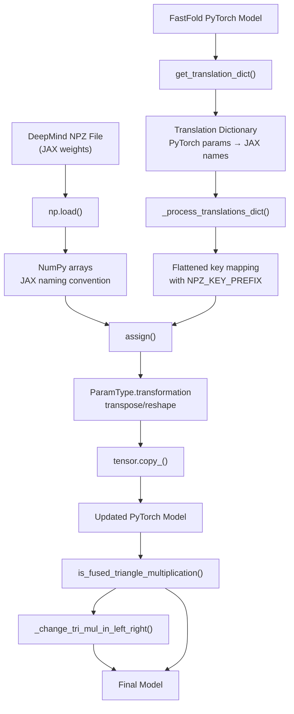
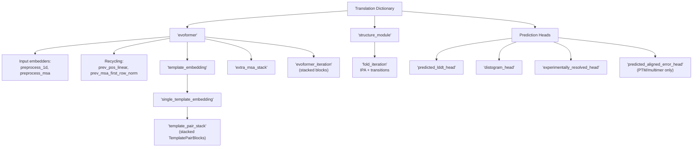
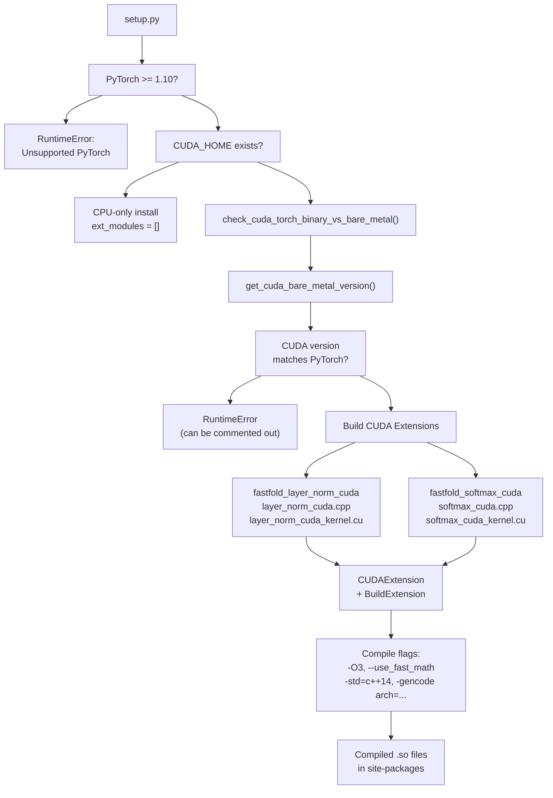
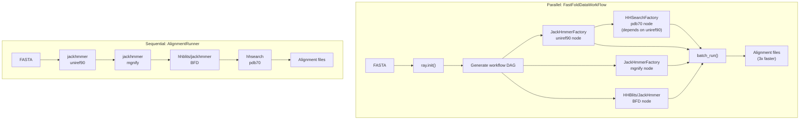
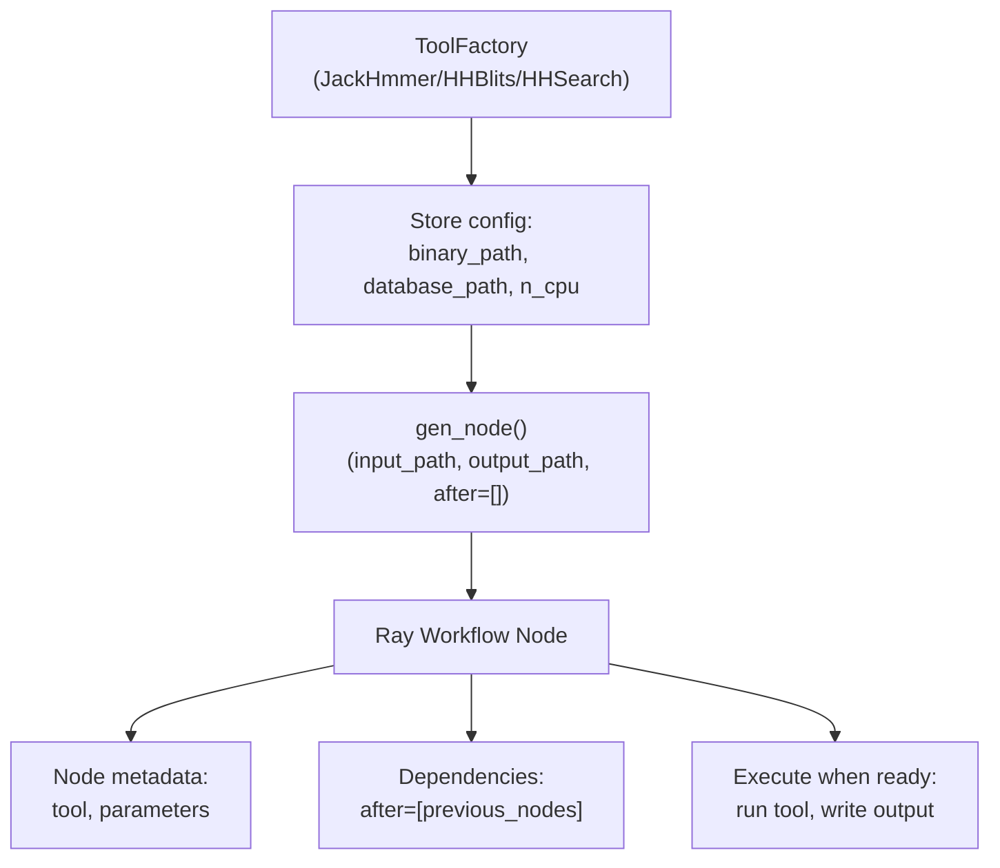
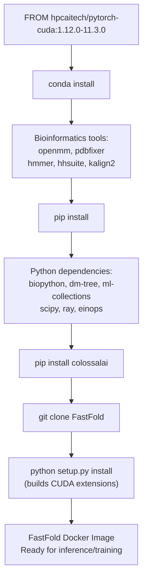

# Advanced Topics

> **Relevant source files**
> * [docker/Dockerfile](https://github.com/hpcaitech/FastFold/blob/eba49680/docker/Dockerfile)
> * [fastfold/common/protein.py](https://github.com/hpcaitech/FastFold/blob/eba49680/fastfold/common/protein.py)
> * [fastfold/data/data_pipeline.py](https://github.com/hpcaitech/FastFold/blob/eba49680/fastfold/data/data_pipeline.py)
> * [fastfold/utils/import_weights.py](https://github.com/hpcaitech/FastFold/blob/eba49680/fastfold/utils/import_weights.py)
> * [fastfold/workflow/template/fastfold_data_workflow.py](https://github.com/hpcaitech/FastFold/blob/eba49680/fastfold/workflow/template/fastfold_data_workflow.py)
> * [fastfold/workflow/template/fastfold_multimer_data_workflow.py](https://github.com/hpcaitech/FastFold/blob/eba49680/fastfold/workflow/template/fastfold_multimer_data_workflow.py)
> * [inference_multimer.sh](https://github.com/hpcaitech/FastFold/blob/eba49680/inference_multimer.sh)
> * [setup.py](https://github.com/hpcaitech/FastFold/blob/eba49680/setup.py)

This page covers advanced usage patterns and specialized features in FastFold that extend beyond basic inference and training workflows. Topics include loading pre-trained weights from DeepMind's JAX implementation, building custom CUDA kernels, optimizing data preprocessing workflows, and platform-specific configurations.

For basic inference and training setup, see [Getting Started](/hpcaitech/FastFold/2-getting-started). For performance optimization strategies, see [Performance Optimizations](/hpcaitech/FastFold/8-performance-optimizations). For API reference documentation, see [API Reference](/hpcaitech/FastFold/11-api-reference).

---

## JAX Weight Import

FastFold provides a comprehensive weight import system to load pre-trained parameters from DeepMind's original JAX-based AlphaFold implementation into PyTorch models. This enables users to leverage DeepMind's trained weights while benefiting from FastFold's performance optimizations.

### Weight Import Architecture

The weight import system handles three major challenges:

1. **Parameter name translation**: JAX and PyTorch use different naming conventions
2. **Tensor layout transformation**: Weight matrices require transposition and reshaping between frameworks
3. **Model variant compatibility**: Different model versions (model_1-5, PTM, multimer) have different parameter structures



**Diagram: JAX Weight Import Pipeline**

The import process flows through parameter type transformations, name translations, and special-case handling for optimized kernels.

Sources: [fastfold/utils/import_weights.py L1-L628](https://github.com/hpcaitech/FastFold/blob/eba49680/fastfold/utils/import_weights.py#L1-L628)

### Parameter Type Transformations

Different parameter types require different transformations when converting from JAX to PyTorch. The `ParamType` enum encapsulates these transformations:

| ParamType | Transformation | Use Case |
| --- | --- | --- |
| `LinearWeight` | `w.transpose(-1, -2)` | Standard linear layer weights |
| `LinearWeightMHA` | Reshape + transpose | Multi-head attention query/key/value weights |
| `LinearMHAOutputWeight` | Reshape head dimension + transpose | Multi-head attention output projection |
| `LinearBiasMHA` | Reshape to flatten heads | Multi-head attention biases |
| `LinearWeightOPM` | Reshape + transpose | Outer product mean weights |
| `LinearWeightMultimer` | Conditional reshape + transpose | Multimer-specific linear weights |
| `LinearBiasMultimer` | Flatten | Multimer-specific biases |
| `Other` | Identity | LayerNorm scale/offset, special parameters |

Sources: [fastfold/utils/import_weights.py L28-L53](https://github.com/hpcaitech/FastFold/blob/eba49680/fastfold/utils/import_weights.py#L28-L53)

### Usage Example

```javascript
from fastfold.utils.import_weights import import_jax_weights_from fastfold.model.hub import AlphaFold # Initialize modelmodel = AlphaFold(config) # Import weights from DeepMind NPZimport_jax_weights_(    model,     npz_path="params_model_1.npz",    version="model_1") # Model now has DeepMind's trained parameters
```

The `version` parameter determines which translation dictionary to use. Supported versions include:

* `model_1`, `model_2`, `model_3`, `model_4`, `model_5`: Monomer models
* `model_1_ptm`, `model_2_ptm`, `model_3_ptm`, `model_4_ptm`, `model_5_ptm`: Monomer models with PTM head
* `model_1_multimer`, `model_2_multimer`, etc.: Multimer models

Sources: [fastfold/utils/import_weights.py L588-L609](https://github.com/hpcaitech/FastFold/blob/eba49680/fastfold/utils/import_weights.py#L588-L609)

### Translation Dictionary Structure

The translation dictionary maps PyTorch model parameters to JAX NPZ keys using a nested structure:



**Diagram: Translation Dictionary Hierarchy**

The nested structure mirrors the model architecture, with stacked blocks handled via the `stacked()` helper.

Sources: [fastfold/utils/import_weights.py L131-L585](https://github.com/hpcaitech/FastFold/blob/eba49680/fastfold/utils/import_weights.py#L131-L585)

### Special Case: Fused Triangle Multiplication

When FastFold's fused triangle multiplication kernels are enabled, the weight import process requires additional post-processing. DeepMind's implementation swaps the "left" and "right" projections in triangle multiplication incoming operations, which differs from FastFold's implementation:

```python
def _change_tri_mul_in_left_right(module):    """Swap left/right parameters for fused triangle multiplication."""    def _change_para(para):        left_right_para = para.clone().chunk(2, dim=0)        return torch.cat((left_right_para[1], left_right_para[0]), dim=0)        with torch.no_grad():        module.linear_p.weight.copy_(_change_para(module.linear_p.weight))        module.linear_p.bias.copy_(_change_para(module.linear_p.bias))        module.linear_g.weight.copy_(_change_para(module.linear_g.weight))        module.linear_g.bias.copy_(_change_para(module.linear_g.bias))
```

This correction is automatically applied to all triangle multiplication modules when `is_fused_triangle_multiplication()` returns `True`.

Sources: [fastfold/utils/import_weights.py L610-L628](https://github.com/hpcaitech/FastFold/blob/eba49680/fastfold/utils/import_weights.py#L610-L628)

---

## Custom CUDA Extensions

FastFold's performance optimizations rely on custom CUDA kernels for critical operations. The build system compiles these extensions from C++/CUDA source code and exposes them to Python via Pybind11 bindings.

### Build System Architecture



**Diagram: CUDA Extension Build Flow**

The build process is conditional on CUDA availability and version compatibility.

Sources: [setup.py L1-L144](https://github.com/hpcaitech/FastFold/blob/eba49680/setup.py#L1-L144)

### Extension Configuration

The CUDA extensions are configured with specific compiler flags and architecture targets:

**Compiler Flags:**

* C++ standard: `-std=c++14`
* Optimization: `-O3`, `--use_fast_math`
* Register allocation: `-maxrregcount=50`
* CUDA features: `-U__CUDA_NO_HALF_OPERATORS__`, `-U__CUDA_NO_HALF_CONVERSIONS__`
* Extended features: `--expt-relaxed-constexpr`, `--expt-extended-lambda`

**Compute Capabilities:**

* Base: `arch=compute_70,code=sm_70` (Volta)
* CUDA 11+: `arch=compute_80,code=sm_80` (Ampere)

**Version-Dependent Macros:**

```
version_dependent_macros = [    '-DVERSION_GE_1_1',    '-DVERSION_GE_1_3',     '-DVERSION_GE_1_5']
```

These macros enable compatibility shims for different PyTorch versions.

Sources: [setup.py L84-L126](https://github.com/hpcaitech/FastFold/blob/eba49680/setup.py#L84-L126)

### Available Extensions

FastFold currently provides two CUDA extensions:

| Extension | Source Files | Purpose |
| --- | --- | --- |
| `fastfold_layer_norm_cuda` | `layer_norm_cuda.cpp``layer_norm_cuda_kernel.cu` | Fused layer normalization with optimized memory access patterns |
| `fastfold_softmax_cuda` | `softmax_cuda.cpp``softmax_cuda_kernel.cu` | Fused softmax with warp-level reductions and numerical stability |

Both extensions include Pybind11 bindings in the `.cpp` files and CUDA kernel implementations in the `.cu` files.

Sources: [setup.py L118-L125](https://github.com/hpcaitech/FastFold/blob/eba49680/setup.py#L118-L125)

### Adding Custom Extensions

To add a new CUDA extension:

1. **Create source files** in `fastfold/model/fastnn/kernel/cuda_native/csrc/`: * `my_kernel.cpp`: Pybind11 bindings * `my_kernel.cu`: CUDA kernel implementation * Header files in `csrc/include/` if needed
2. **Register extension in setup.py**:

```
ext_modules.append(    cuda_ext_helper(        'fastfold_my_kernel_cuda',        ['my_kernel.cpp', 'my_kernel.cu'],        extra_cuda_flags + cc_flag    ))
```

1. **Rebuild the package**:

```markdown
python setup.py install# or for developmentpython setup.py develop
```

1. **Import in Python**:

```javascript
import fastfold_my_kernel_cuda result = fastfold_my_kernel_cuda.forward(input_tensor)
```

Sources: [setup.py L89-L126](https://github.com/hpcaitech/FastFold/blob/eba49680/setup.py#L89-L126)

### Build Caching in CI

The GitHub Actions CI workflow caches built extensions to accelerate subsequent runs:

```
- name: Restore cached build artifacts  uses: actions/cache@v2  with:    path: /github/home/fastfold_cache/    key: ${{ runner.os }}-build-${{ hashFiles('setup.py') }}
```

This cache is keyed on `setup.py` content, so changes to build configuration trigger a rebuild.

Sources: [setup.py L1-L144](https://github.com/hpcaitech/FastFold/blob/eba49680/setup.py#L1-L144)

 (inferred from CI workflow pattern)

---

## Ray Workflow Acceleration

FastFold provides Ray-based workflows that parallelize MSA alignment and template search operations, achieving 3-3Nx speedup over sequential execution. This is particularly beneficial for multimer predictions where multiple chains require independent alignment runs.

### Workflow Architecture



**Diagram: Sequential vs. Parallel Data Processing**

The Ray workflow parallelizes independent database searches while respecting dependencies (e.g., HHSearch requires UniRef90 MSA).

Sources: [fastfold/workflow/template/fastfold_data_workflow.py L1-L170](https://github.com/hpcaitech/FastFold/blob/eba49680/fastfold/workflow/template/fastfold_data_workflow.py#L1-L170)

 [fastfold/data/data_pipeline.py L263-L457](https://github.com/hpcaitech/FastFold/blob/eba49680/fastfold/data/data_pipeline.py#L263-L457)

### FastFoldDataWorkFlow

The monomer workflow class orchestrates parallel execution of alignment tools:

**Initialization:**

```javascript
from fastfold.workflow.template import FastFoldDataWorkFlow workflow = FastFoldDataWorkFlow(    jackhmmer_binary_path="/usr/bin/jackhmmer",    hhblits_binary_path="/usr/bin/hhblits",    hhsearch_binary_path="/usr/bin/hhsearch",    uniref90_database_path="data/uniref90/uniref90.fasta",    mgnify_database_path="data/mgnify/mgy_clusters.fa",    bfd_database_path="data/bfd/bfd_metaclust_clu_complete_id30_c90_final_seq.sorted_opt",    pdb70_database_path="data/pdb70/pdb70",    use_small_bfd=False,  # Use hhblits with BFD+UniRef30    no_cpus=8,    uniref_max_hits=10000,    mgnify_max_hits=5000,)
```

**Execution:**

```markdown
workflow.run(    fasta_path="target.fasta",    alignment_dir="alignments/",    storage_dir="file:///tmp/ray/workflow_data"  # Ray storage)
```

The workflow:

1. Initializes Ray with specified storage directory
2. Creates factory objects for each tool (JackHmmerFactory, HHBlitsFactory, HHSearchFactory)
3. Generates workflow nodes with input/output paths
4. Establishes dependencies (e.g., HHSearch depends on UniRef90 output)
5. Executes via `batch_run()` with parallel execution

Sources: [fastfold/workflow/template/fastfold_data_workflow.py L10-L170](https://github.com/hpcaitech/FastFold/blob/eba49680/fastfold/workflow/template/fastfold_data_workflow.py#L10-L170)

### FastFoldMultimerDataWorkFlow

The multimer workflow extends the monomer version with additional databases and tools:

**Key Differences:**

| Feature | Monomer | Multimer |
| --- | --- | --- |
| UniProt search | Not included | jackhmmer on uniprot.fasta |
| Template search | hhsearch → pdb70 | hmmsearch → pdb_seqres |
| Output format | A3M for MSAs | Stockholm (.sto) for MSAs |
| MSA pairing | Not needed | UniProt MSA used for pairing |
| Speedup | ~3x | ~3Nx (N = number of chains) |

**Additional Configuration:**

```markdown
multimer_workflow = FastFoldMultimerDataWorkFlow(    # ... standard databases ...    uniprot_database_path="data/uniprot/uniprot.fasta",    pdb_seqres_database_path="data/pdb_seqres/pdb_seqres.txt",    hmmsearch_binary_path="/usr/bin/hmmsearch",    hmmbuild_binary_path="/usr/bin/hmmbuild",    uniprot_max_hits=50000,)
```

The workflow generates five parallel nodes:

1. UniRef90 (jackhmmer) → feeds into HMMSearch
2. MGnify (jackhmmer)
3. BFD (hhblits or jackhmmer)
4. UniProt (jackhmmer) - for MSA pairing
5. PDB SeqRes (hmmsearch) - depends on UniRef90

Sources: [fastfold/workflow/template/fastfold_multimer_data_workflow.py L1-L193](https://github.com/hpcaitech/FastFold/blob/eba49680/fastfold/workflow/template/fastfold_multimer_data_workflow.py#L1-L193)

### Workflow Factory Pattern

Each alignment tool is wrapped in a factory that generates Ray workflow nodes:



**Diagram: Workflow Factory Pattern**

Factories encapsulate tool configuration and generate Ray nodes with dependency tracking.

Sources: [fastfold/workflow/template/fastfold_data_workflow.py L72-L119](https://github.com/hpcaitech/FastFold/blob/eba49680/fastfold/workflow/template/fastfold_data_workflow.py#L72-L119)

### Performance Characteristics

**Monomer (~3x speedup):**

* Parallel: jackhmmer(uniref90), jackhmmer(mgnify), hhblits(BFD)
* Sequential dependency: hhsearch(pdb70) waits for uniref90
* Bottleneck: Longest-running search (typically BFD)

**Multimer (~3Nx speedup for N chains):**

* Each chain requires independent MSA searches
* Ray parallelizes across chains
* Example: 4-chain complex = ~12x speedup over sequential processing

**Resource Requirements:**

* CPU cores: Controlled via `no_cpus` parameter (default: all available)
* Memory: Ray storage for intermediate results (~1-5 GB per workflow)
* Disk I/O: Minimized through in-memory intermediate passing

Sources: [fastfold/workflow/template/fastfold_data_workflow.py L1-L170](https://github.com/hpcaitech/FastFold/blob/eba49680/fastfold/workflow/template/fastfold_data_workflow.py#L1-L170)

 [fastfold/workflow/template/fastfold_multimer_data_workflow.py L1-L193](https://github.com/hpcaitech/FastFold/blob/eba49680/fastfold/workflow/template/fastfold_multimer_data_workflow.py#L1-L193)

---

## Advanced Configuration Patterns

FastFold's configuration system supports sophisticated customization beyond basic model presets. This section covers advanced configuration techniques for specialized use cases.

### Field References

The configuration system supports references between fields using `FieldReference`, enabling computed values and dependent parameters:

```javascript
from ml_collections import ConfigDict, FieldReference config = ConfigDict({    'c_z': 128,    'c_m': 256,    'c_hidden': FieldReference(lambda cfg: cfg.c_z * 2),  # 256    'layer_count': FieldReference(lambda cfg: cfg.c_m // 32),  # 8})
```

This pattern is used extensively for derived dimensions (e.g., attention head counts, hidden layer sizes) that maintain mathematical relationships with base parameters.

Sources: [fastfold/config.py](https://github.com/hpcaitech/FastFold/blob/eba49680/fastfold/config.py)

 (referenced from context)

### Runtime Configuration Override

Configuration parameters can be overridden at inference time without modifying the model checkpoint:

```javascript
from fastfold.config import model_config # Load base configurationconfig = model_config("model_1") # Override for memory efficiencyconfig.globals.chunk_size = 4  # Reduce memory usageconfig.globals.inplace = True  # Enable inplace operations # Override model architecture (must match checkpoint!)# config.model.evoformer.no_blocks = 48  # DON'T change structural params # Create model with modified configmodel = AlphaFold(config)model.load_state_dict(checkpoint)
```

**Safe to override:**

* `chunk_size`: Controls memory-compute tradeoff
* `inplace`: Enables/disables inplace tensor operations
* `use_lma`: Enables low-memory attention variant
* DAP settings: `dap_size`, parallelization parameters

**Unsafe to override (must match checkpoint):**

* Layer counts (`no_blocks`, `no_layers`)
* Channel dimensions (`c_z`, `c_m`, `c_s`)
* Architectural choices (e.g., attention head count)

Sources: [fastfold/config.py](https://github.com/hpcaitech/FastFold/blob/eba49680/fastfold/config.py)

 (referenced from context)

### Chunking Strategy Selection

The `chunk_size` parameter controls how large tensors are processed in chunks, trading compute time for memory usage:

| chunk_size | Memory Usage | Compute Time | Use Case |
| --- | --- | --- | --- |
| `None` | Highest | Fastest | Small proteins (<512 residues), abundant GPU memory |
| `32` | High | Fast | Medium proteins (512-1024 residues) |
| `16` | Medium | Medium | Large proteins (1024-2048 residues) |
| `8` | Low | Slow | Very large proteins (2048-3072 residues) |
| `4` | Lowest | Slowest | Ultra-long proteins (>3072 residues) or limited GPU memory |

**Example:**

```markdown
# Inference script with chunkingpython inference.py target.fasta data/pdb_mmcif/mmcif_files \    --chunk_size 8 \    --inplace \    --output_dir results/
```

Sources: [inference_multimer.sh L1-L24](https://github.com/hpcaitech/FastFold/blob/eba49680/inference_multimer.sh#L1-L24)

### DAP Configuration for Ultra-Long Sequences

Dynamic Axial Parallelism can be configured for sequences exceeding single-GPU memory limits:

```javascript
from fastfold.distributed import init_dap # Initialize DAP with 4-way sequence shardinginit_dap(    rank=rank,    world_size=4,    tensor_model_parallel_size=4,  # Shard across 4 GPUs) # Model forward pass automatically uses DAPoutput = model(batch)
```

**DAP Guidelines:**

* Sequences <3K residues: No DAP needed (single GPU)
* Sequences 3K-6K: 2-way DAP
* Sequences 6K-10K: 4-way DAP
* Sequences >10K: 8-way DAP

Sources: [fastfold/distributed](https://github.com/hpcaitech/FastFold/blob/eba49680/fastfold/distributed)

 (referenced from Diagram 5)

---

## Docker Deployment

FastFold provides a comprehensive Docker image with all dependencies pre-installed, ensuring reproducible execution across environments.

### Dockerfile Structure



**Diagram: Docker Image Build Layers**

The image layers are ordered to maximize cache efficiency (infrequently changing dependencies first).

Sources: [docker/Dockerfile L1-L14](https://github.com/hpcaitech/FastFold/blob/eba49680/docker/Dockerfile#L1-L14)

### Base Image

The Docker image starts from `hpcaitech/pytorch-cuda:1.12.0-11.3.0`, which provides:

* PyTorch 1.12.0
* CUDA 11.3.0
* cuDNN 8.x
* Ubuntu 20.04 base

This base image is optimized for deep learning workloads with CUDA support.

Sources: [docker/Dockerfile L1](https://github.com/hpcaitech/FastFold/blob/eba49680/docker/Dockerfile#L1-L1)

### Installed Dependencies

**Conda packages (bioinformatics tools):**

```dockerfile
RUN conda install openmm=7.7.0 pdbfixer -c conda-forge -y \ && conda install hmmer==3.3.2 hhsuite=3.3.0 kalign2=2.04 -c bioconda -y
```

**Pip packages (Python libraries):**

```dockerfile
RUN pip install biopython==1.79 dm-tree==0.1.6 ml-collections==0.1.0 \scipy==1.7.1 ray pyarrow pandas einops
```

**ColossalAI (distributed training):**

```dockerfile
RUN pip install colossalai
```

Sources: [docker/Dockerfile L3-L9](https://github.com/hpcaitech/FastFold/blob/eba49680/docker/Dockerfile#L3-L9)

### Building the Image

```
cd docker/docker build -t fastfold:latest .
```

Build time: ~20-30 minutes depending on network speed and CPU.

### Running Inference in Docker

**Interactive shell:**

```
docker run -it --gpus all \    -v /path/to/data:/data \    -v /path/to/output:/output \    fastfold:latest bash
```

**Direct inference:**

```
docker run --gpus all \    -v /path/to/data:/data \    -v /path/to/output:/output \    fastfold:latest \    python inference.py /data/target.fasta /data/pdb_mmcif/mmcif_files \        --output_dir /output \        --uniref90_database_path /data/uniref90/uniref90.fasta \        --model_preset monomer \        --param_path /data/params/params_model_1.npz
```

Sources: [docker/Dockerfile L1-L14](https://github.com/hpcaitech/FastFold/blob/eba49680/docker/Dockerfile#L1-L14)

---

## Habana Platform Support

FastFold includes experimental support for Intel Habana Gaudi accelerators, enabling protein structure prediction on non-NVIDIA hardware. This requires platform-specific configuration adjustments.

### Configuration Differences

Habana support requires disabling CUDA-specific optimizations:

```markdown
config = model_config("model_1") # Disable CUDA kernelsconfig.globals.use_fused_kernel = False # Use PyTorch-native operationsconfig.globals.use_triton_kernel = False # Standard chunking still supportedconfig.globals.chunk_size = 16
```

### Execution Environment

Habana execution requires the Habana SynapseAI SDK and PyTorch integration:

```javascript
# Install Habana PyTorchpip install habana-torch-plugin habana-torch-dataloader # Set environment variablesexport HABANA_VISIBLE_DEVICES=0,1,2,3export PT_HPU_LAZY_MODE=1 # Run inferencepython inference.py target.fasta data/pdb_mmcif/mmcif_files \    --device hpu \    --output_dir results/
```

**Note:** Habana support is experimental and may not achieve the same performance as NVIDIA GPUs due to missing fused kernel implementations. The FastNN optimizations that rely on CUDA/Triton kernels will fall back to PyTorch operations.

---

## Summary

This page covered advanced FastFold features:

1. **JAX Weight Import**: `import_jax_weights_()` function loads DeepMind's pre-trained parameters with automatic tensor transformation and name translation
2. **Custom CUDA Extensions**: `setup.py` build system compiles optimized kernels (`fastfold_layer_norm_cuda`, `fastfold_softmax_cuda`) with version-specific flags
3. **Ray Workflow Acceleration**: `FastFoldDataWorkFlow` and `FastFoldMultimerDataWorkFlow` parallelize MSA generation for 3-3Nx speedup
4. **Advanced Configuration**: FieldReferences, chunking strategies, and DAP settings for memory-constrained scenarios
5. **Docker Deployment**: Pre-built image with all dependencies for reproducible execution
6. **Habana Platform**: Experimental support for Intel accelerators via fallback to PyTorch operations

For performance optimization details, see [Performance Optimizations](/hpcaitech/FastFold/8-performance-optimizations). For development and testing workflows, see [Development and Testing](/hpcaitech/FastFold/10-development-and-testing).