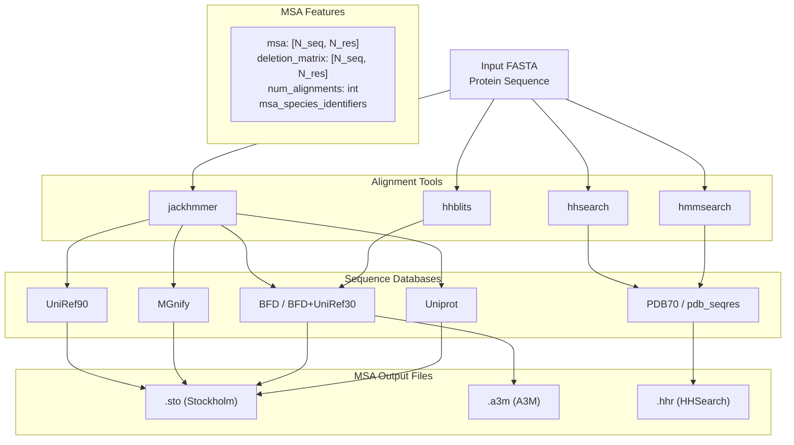
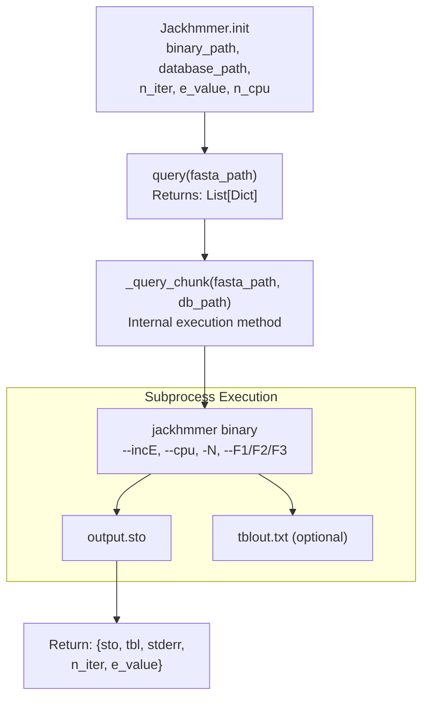
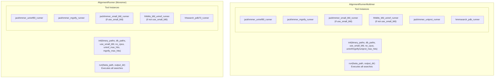
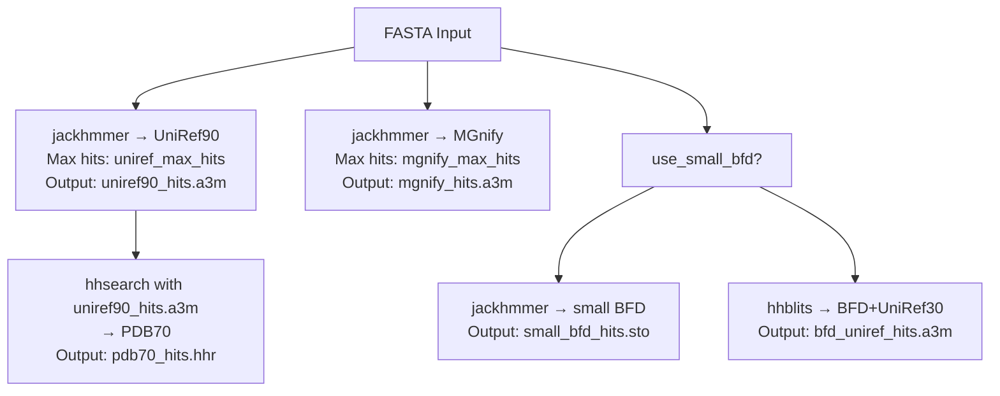
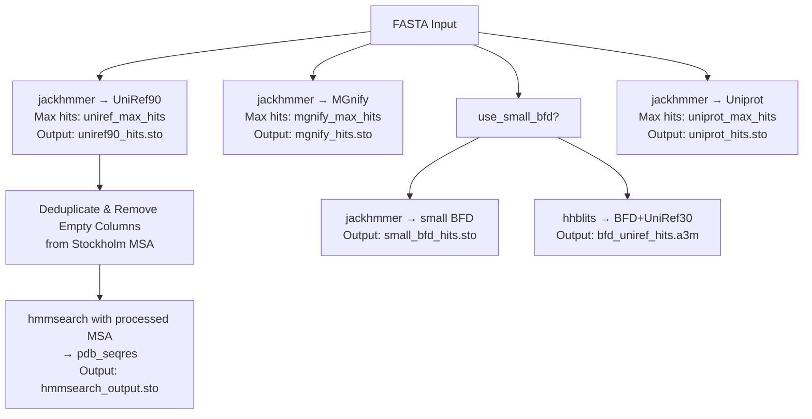
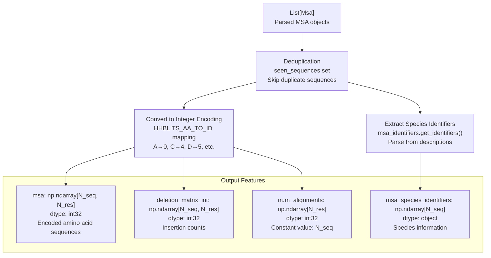
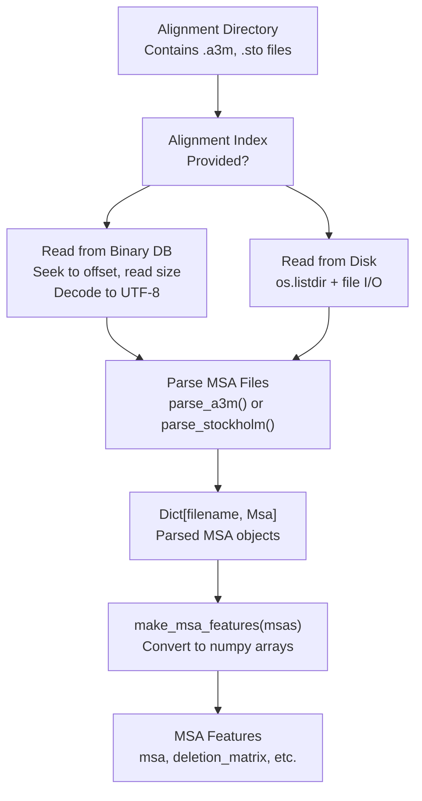

# Alignment and MSA Generation

> **Relevant source files**
> * [fastfold/common/protein.py](https://github.com/hpcaitech/FastFold/blob/eba49680/fastfold/common/protein.py)
> * [fastfold/data/data_pipeline.py](https://github.com/hpcaitech/FastFold/blob/eba49680/fastfold/data/data_pipeline.py)
> * [fastfold/data/feature_processing_multimer.py](https://github.com/hpcaitech/FastFold/blob/eba49680/fastfold/data/feature_processing_multimer.py)
> * [fastfold/data/msa_pairing.py](https://github.com/hpcaitech/FastFold/blob/eba49680/fastfold/data/msa_pairing.py)
> * [fastfold/data/parsers.py](https://github.com/hpcaitech/FastFold/blob/eba49680/fastfold/data/parsers.py)
> * [fastfold/data/templates.py](https://github.com/hpcaitech/FastFold/blob/eba49680/fastfold/data/templates.py)
> * [fastfold/data/tools/hmmbuild.py](https://github.com/hpcaitech/FastFold/blob/eba49680/fastfold/data/tools/hmmbuild.py)
> * [fastfold/data/tools/jackhmmer.py](https://github.com/hpcaitech/FastFold/blob/eba49680/fastfold/data/tools/jackhmmer.py)
> * [fastfold/utils/import_weights.py](https://github.com/hpcaitech/FastFold/blob/eba49680/fastfold/utils/import_weights.py)

## Purpose and Scope

This page documents the alignment and MSA (Multiple Sequence Alignment) generation pipeline in FastFold, which performs homology searches against protein sequence databases to identify evolutionarily related sequences. These alignments provide critical co-evolutionary signals that the AlphaFold model uses to predict protein structure.

This page covers:

* Bioinformatics tools (jackhmmer, hhblits, hhsearch, hmmsearch)
* Database search workflows (UniRef90, MGnify, BFD, Uniprot)
* MSA file parsing and format conversion
* Feature extraction from MSAs into NumPy arrays

For template structure processing, see [Template Search and Processing](/hpcaitech/FastFold/4.2-template-search-and-processing). For Ray-accelerated execution, see [Ray Workflow Acceleration](/hpcaitech/FastFold/4.3-ray-workflow-acceleration). For multimer-specific MSA pairing logic, see [Multimer Data Processing](/hpcaitech/FastFold/4.4-multimer-data-processing).

---

## Overview

The alignment pipeline transforms a protein sequence (FASTA format) into numerical features suitable for the AlphaFold model. The process involves querying multiple sequence databases with various alignment tools, parsing the results, and extracting features that capture evolutionary information.



**Sources:** [fastfold/data/data_pipeline.py L263-L457](https://github.com/hpcaitech/FastFold/blob/eba49680/fastfold/data/data_pipeline.py#L263-L457)

 [fastfold/data/data_pipeline.py L461-L668](https://github.com/hpcaitech/FastFold/blob/eba49680/fastfold/data/data_pipeline.py#L461-L668)

---

## Alignment Tools

FastFold uses four primary bioinformatics tools for sequence alignment, each optimized for different database types and search strategies.

### Jackhmmer

`Jackhmmer` is an iterative sequence search tool from the HMMER suite. It builds a profile HMM from the query sequence, searches the database, then refines the HMM using hits and iterates. FastFold uses jackhmmer for FASTA-format databases.

**Key Configuration:**

* **n_iter**: Number of iterations (default: 1)
* **e_value**: E-value threshold for inclusion (default: 0.0001)
* **filter_f1/f2/f3**: Pre-filter thresholds to reduce runtime
* **n_cpu**: Parallel execution threads

**Databases Queried:**

* UniRef90 (universal reference sequences)
* MGnify (metagenomic sequences)
* Small BFD (if `use_small_bfd=True`)
* Uniprot (multimer pipeline only)



**Sources:** [fastfold/data/tools/jackhmmer.py L30-L249](https://github.com/hpcaitech/FastFold/blob/eba49680/fastfold/data/tools/jackhmmer.py#L30-L249)

### HHBlits

`HHBlits` performs HMM-HMM comparisons for faster searching of large databases. It's used for the full BFD database (optionally combined with UniRef30), which is too large for efficient jackhmmer searching.

**Key Differences from Jackhmmer:**

* Uses HMM databases (not FASTA)
* Faster on large databases
* Returns A3M format (compressed MSA with lowercase insertions)
* Searches BFD and optionally UniRef30 together

**Configuration in AlignmentRunner:**

[fastfold/data/data_pipeline.py L369-L386](https://github.com/hpcaitech/FastFold/blob/eba49680/fastfold/data/data_pipeline.py#L369-L386)

```
if bfd_database_path is not None:    if use_small_bfd:        self.jackhmmer_small_bfd_runner = jackhmmer.Jackhmmer(...)    else:        dbs = [bfd_database_path]        if(uniref30_database_path is not None):            dbs.append(uniref30_database_path)        self.hhblits_bfd_uniref_runner = hhblits.HHBlits(            binary_path=hhblits_binary_path,            databases=dbs,            n_cpu=no_cpus,        )
```

**Sources:** [fastfold/data/data_pipeline.py L324-L329](https://github.com/hpcaitech/FastFold/blob/eba49680/fastfold/data/data_pipeline.py#L324-L329)

 [fastfold/data/data_pipeline.py L369-L386](https://github.com/hpcaitech/FastFold/blob/eba49680/fastfold/data/data_pipeline.py#L369-L386)

### HHSearch

`HHSearch` searches an HMM database with an HMM query, used primarily for template structure identification. It takes a pre-built MSA (typically from UniRef90 jackhmmer results) and searches PDB70 to find structural templates.

**Role in Pipeline:**

1. UniRef90 jackhmmer creates initial MSA
2. MSA converted to A3M format
3. HHSearch queries PDB70 with the MSA
4. Results parsed for template hits

This is primarily covered in [Template Search and Processing](/hpcaitech/FastFold/4.2-template-search-and-processing), but is initialized in `AlignmentRunner`:

[fastfold/data/data_pipeline.py L396-L402](https://github.com/hpcaitech/FastFold/blob/eba49680/fastfold/data/data_pipeline.py#L396-L402)

**Sources:** [fastfold/data/data_pipeline.py L396-L402](https://github.com/hpcaitech/FastFold/blob/eba49680/fastfold/data/data_pipeline.py#L396-L402)

 [fastfold/data/data_pipeline.py L422-L428](https://github.com/hpcaitech/FastFold/blob/eba49680/fastfold/data/data_pipeline.py#L422-L428)

### Hmmsearch and Hmmbuild (Multimer)

For multimer predictions, `hmmsearch` replaces `hhsearch` for template searches. The workflow uses `hmmbuild` to construct an HMM profile from the MSA, then `hmmsearch` to query the pdb_seqres database.

**Workflow:**

1. Build HMM from Stockholm MSA using `Hmmbuild`
2. Search pdb_seqres database with `Hmmsearch`
3. Parse hits for template featurization

[fastfold/data/data_pipeline.py L595-L630](https://github.com/hpcaitech/FastFold/blob/eba49680/fastfold/data/data_pipeline.py#L595-L630)

**Sources:** [fastfold/data/data_pipeline.py L595-L630](https://github.com/hpcaitech/FastFold/blob/eba49680/fastfold/data/data_pipeline.py#L595-L630)

 [fastfold/data/tools/hmmbuild.py L25-L137](https://github.com/hpcaitech/FastFold/blob/eba49680/fastfold/data/tools/hmmbuild.py#L25-L137)

---

## AlignmentRunner Architecture

FastFold provides two runner classes that encapsulate the complete alignment workflow: `AlignmentRunner` for monomers and `AlignmentRunnerMultimer` for multimeric complexes.



### Initialization and Validation

Both runners perform extensive validation during initialization to ensure that:

* Required binaries are provided when databases are specified
* Database paths exist (if not using streaming)
* UniRef90 is available when template searches are requested

[fastfold/data/data_pipeline.py L315-L350](https://github.com/hpcaitech/FastFold/blob/eba49680/fastfold/data/data_pipeline.py#L315-L350)

```
db_map = {    "jackhmmer": {        "binary": jackhmmer_binary_path,        "dbs": [            uniref90_database_path,            mgnify_database_path,            bfd_database_path if use_small_bfd else None,        ],    },    "hhblits": {        "binary": hhblits_binary_path,        "dbs": [            bfd_database_path if not use_small_bfd else None,        ],    },    "hhsearch": {        "binary": hhsearch_binary_path,        "dbs": [            pdb70_database_path,        ],    },} for name, dic in db_map.items():    binary, dbs = dic["binary"], dic["dbs"]    if(binary is None and not all([x is None for x in dbs])):        raise ValueError(            f"{name} DBs provided but {name} binary is None"        )
```

**Sources:** [fastfold/data/data_pipeline.py L263-L403](https://github.com/hpcaitech/FastFold/blob/eba49680/fastfold/data/data_pipeline.py#L263-L403)

 [fastfold/data/data_pipeline.py L461-L601](https://github.com/hpcaitech/FastFold/blob/eba49680/fastfold/data/data_pipeline.py#L461-L601)

---

## Database Search Workflow

The alignment workflow executes a specific sequence of database searches, with outputs from earlier searches sometimes feeding into later ones.

### Monomer Search Sequence



**Key Implementation Details:**

1. **UniRef90 → A3M Conversion**: Stockholm output is converted to A3M with sequence limit

[fastfold/data/data_pipeline.py L410-L420](https://github.com/hpcaitech/FastFold/blob/eba49680/fastfold/data/data_pipeline.py#L410-L420)

```
jackhmmer_uniref90_result = self.jackhmmer_uniref90_runner.query(    fasta_path)[0]uniref90_msa_as_a3m = parsers.convert_stockholm_to_a3m(    jackhmmer_uniref90_result["sto"],     max_sequences=self.uniref_max_hits)uniref90_out_path = os.path.join(output_dir, "uniref90_hits.a3m")with open(uniref90_out_path, "w") as f:    f.write(uniref90_msa_as_a3m)
```

1. **HHSearch Uses UniRef90 MSA**: The A3M is fed directly to hhsearch

[fastfold/data/data_pipeline.py L422-L428](https://github.com/hpcaitech/FastFold/blob/eba49680/fastfold/data/data_pipeline.py#L422-L428)

1. **Separate BFD Paths**: Small BFD uses jackhmmer; full BFD uses hhblits

[fastfold/data/data_pipeline.py L442-L456](https://github.com/hpcaitech/FastFold/blob/eba49680/fastfold/data/data_pipeline.py#L442-L456)

**Sources:** [fastfold/data/data_pipeline.py L404-L457](https://github.com/hpcaitech/FastFold/blob/eba49680/fastfold/data/data_pipeline.py#L404-L457)

### Multimer Search Sequence

The multimer pipeline adds Uniprot searches and uses hmmsearch instead of hhsearch for templates.



**Multimer-Specific Processing:**

The UniRef90 MSA undergoes preprocessing before template search:

[fastfold/data/data_pipeline.py L620-L630](https://github.com/hpcaitech/FastFold/blob/eba49680/fastfold/data/data_pipeline.py#L620-L630)

```
template_msa = jackhmmer_uniref90_result["sto"]template_msa = parsers.deduplicate_stockholm_msa(template_msa)template_msa = parsers.remove_empty_columns_from_stockholm_msa(    template_msa) if(self.hmmsearch_pdb_runner is not None):    pdb_templates_result = self.hmmsearch_pdb_runner.query(        template_msa,        output_dir=output_dir    )
```

**Sources:** [fastfold/data/data_pipeline.py L603-L668](https://github.com/hpcaitech/FastFold/blob/eba49680/fastfold/data/data_pipeline.py#L603-L668)

---

## MSA File Formats and Parsing

FastFold handles three primary MSA file formats, each with different conventions for representing gaps and insertions.

### Stockholm Format (.sto)

Stockholm format is used by HMMER tools (jackhmmer, hmmsearch). It's a structured format with metadata and alignment blocks.

**Characteristics:**

* Sequence names on the left, aligned sequences on the right
* Gap character: `-`
* Metadata lines start with `#`
* End marker: `//`

**Parser Implementation:**

[fastfold/data/parsers.py L99-L158](https://github.com/hpcaitech/FastFold/blob/eba49680/fastfold/data/parsers.py#L99-L158)

```python
def parse_stockholm(stockholm_string: str) -> Msa:    """Parses sequences and deletion matrix from stockholm format alignment."""    name_to_sequence = collections.OrderedDict()    for line in stockholm_string.splitlines():        line = line.strip()        if not line or line.startswith(("#", "//")):            continue        name, sequence = line.split()        if name not in name_to_sequence:            name_to_sequence[name] = ""        name_to_sequence[name] += sequence     msa = []    deletion_matrix = []    query = ""    keep_columns = []        for seq_index, sequence in enumerate(name_to_sequence.values()):        if seq_index == 0:            # Gather the columns with gaps from the query            query = sequence            keep_columns = [i for i, res in enumerate(query) if res != "-"]                # Remove the columns with gaps in the query from all sequences        aligned_sequence = "".join([sequence[c] for c in keep_columns])        msa.append(aligned_sequence)                # Count the number of deletions w.r.t. query        deletion_vec = []        deletion_count = 0        for seq_res, query_res in zip(sequence, query):            if seq_res != "-" or query_res != "-":                if query_res == "-":                    deletion_count += 1                else:                    deletion_vec.append(deletion_count)                    deletion_count = 0        deletion_matrix.append(deletion_vec)     return Msa(        sequences=msa,         deletion_matrix=deletion_matrix,         descriptions=list(name_to_sequence.keys())    )
```

**Key Processing Steps:**

1. Parse sequence names and alignments
2. Identify query sequence (first entry)
3. Remove columns that are gaps in the query
4. Build deletion matrix tracking insertions relative to query

**Sources:** [fastfold/data/parsers.py L99-L158](https://github.com/hpcaitech/FastFold/blob/eba49680/fastfold/data/parsers.py#L99-L158)

### A3M Format (.a3m)

A3M is a compact FASTA-like format where lowercase letters indicate insertions relative to the query.

**Characteristics:**

* FASTA format with `>` headers
* Uppercase: aligned positions
* Lowercase: insertions (not aligned to query)
* Gap character: `-`

**Parser Implementation:**

[fastfold/data/parsers.py L161-L196](https://github.com/hpcaitech/FastFold/blob/eba49680/fastfold/data/parsers.py#L161-L196)

```python
def parse_a3m(a3m_string: str) -> Msa:    """Parses sequences and deletion matrix from a3m format alignment."""    sequences, descriptions = parse_fasta(a3m_string)     deletion_matrix = []        for msa_sequence in sequences:        deletion_vec = []        deletion_count = 0        for j in msa_sequence:            if j.islower():                deletion_count += 1            else:                deletion_vec.append(deletion_count)                deletion_count = 0        deletion_matrix.append(deletion_vec)     # Make the MSA matrix out of aligned (deletion-free) sequences    deletion_table = str.maketrans("", "", string.ascii_lowercase)    aligned_sequences = [s.translate(deletion_table) for s in sequences]        return Msa(        sequences=aligned_sequences,         deletion_matrix=deletion_matrix,        descriptions=descriptions    )
```

**Key Difference:** Lowercase characters are insertions; they're counted for the deletion matrix but removed from the aligned sequence.

**Sources:** [fastfold/data/parsers.py L161-L196](https://github.com/hpcaitech/FastFold/blob/eba49680/fastfold/data/parsers.py#L161-L196)

### Format Conversion: Stockholm → A3M

The pipeline frequently converts Stockholm to A3M, particularly for feeding UniRef90 MSAs to hhsearch.

[fastfold/data/parsers.py L209-L268](https://github.com/hpcaitech/FastFold/blob/eba49680/fastfold/data/parsers.py#L209-L268)

**Conversion Logic:**

1. Parse Stockholm sequences
2. Identify query sequence gaps
3. For non-query positions: convert gaps in other sequences to lowercase
4. Remove dots (optional gaps in Stockholm)
5. Apply sequence limit if specified

Example from the workflow:

[fastfold/data/data_pipeline.py L414-L416](https://github.com/hpcaitech/FastFold/blob/eba49680/fastfold/data/data_pipeline.py#L414-L416)

```
uniref90_msa_as_a3m = parsers.convert_stockholm_to_a3m(    jackhmmer_uniref90_result["sto"],     max_sequences=self.uniref_max_hits)
```

**Sources:** [fastfold/data/parsers.py L209-L268](https://github.com/hpcaitech/FastFold/blob/eba49680/fastfold/data/parsers.py#L209-L268)

 [fastfold/data/data_pipeline.py L414-L416](https://github.com/hpcaitech/FastFold/blob/eba49680/fastfold/data/data_pipeline.py#L414-L416)

### Msa Dataclass

All parsers return the same structured dataclass:

[fastfold/data/parsers.py L28-L53](https://github.com/hpcaitech/FastFold/blob/eba49680/fastfold/data/parsers.py#L28-L53)

```python
@dataclasses.dataclass(frozen=True)class Msa:    """Class representing a parsed MSA file"""    sequences: Sequence[str]    deletion_matrix: DeletionMatrix    descriptions: Optional[Sequence[str]]     def __post_init__(self):        if(not (            len(self.sequences) ==             len(self.deletion_matrix) ==             len(self.descriptions)        )):            raise ValueError(                "All fields for an MSA must have the same length"            )     def __len__(self):        return len(self.sequences)     def truncate(self, max_seqs: int):        return Msa(            sequences=self.sequences[:max_seqs],            deletion_matrix=self.deletion_matrix[:max_seqs],            descriptions=self.descriptions[:max_seqs],        )
```

**Sources:** [fastfold/data/parsers.py L28-L53](https://github.com/hpcaitech/FastFold/blob/eba49680/fastfold/data/parsers.py#L28-L53)

---

## MSA Feature Extraction

After parsing, MSAs are converted into numerical features that the model can consume. This is handled by `make_msa_features`.

### Feature Generation Pipeline



### Implementation Details

[fastfold/data/data_pipeline.py L205-L242](https://github.com/hpcaitech/FastFold/blob/eba49680/fastfold/data/data_pipeline.py#L205-L242)

```python
def make_msa_features(msas: Sequence[parsers.Msa]) -> FeatureDict:    """Constructs a feature dict of MSA features."""    if not msas:        raise ValueError("At least one MSA must be provided.")     int_msa = []    deletion_matrix = []    species_ids = []    seen_sequences = set()        for msa_index, msa in enumerate(msas):        if not msa:            raise ValueError(                f"MSA {msa_index} must contain at least one sequence."            )        for sequence_index, sequence in enumerate(msa.sequences):            if sequence in seen_sequences:                continue            seen_sequences.add(sequence)                        int_msa.append(                [residue_constants.HHBLITS_AA_TO_ID[res] for res in sequence]            )            deletion_matrix.append(msa.deletion_matrix[sequence_index])                        identifiers = msa_identifiers.get_identifiers(                msa.descriptions[sequence_index]            )            species_ids.append(identifiers.species_id.encode('utf-8'))     num_res = len(msas[0].sequences[0])    num_alignments = len(int_msa)        features = {}    features["deletion_matrix_int"] = np.array(deletion_matrix, dtype=np.int32)    features["msa"] = np.array(int_msa, dtype=np.int32)    features["num_alignments"] = np.array(        [num_alignments] * num_res, dtype=np.int32    )    features["msa_species_identifiers"] = np.array(species_ids, dtype=np.object_)    return features
```

**Key Steps:**

1. **Deduplication**: Track `seen_sequences` to skip exact duplicates
2. **Integer Encoding**: Map amino acids using `HHBLITS_AA_TO_ID` (A=0, C=4, D=5, E=6, F=7, G=8, H=9, I=10, K=11, L=12, M=13, N=14, P=15, Q=16, R=17, S=18, T=19, V=20, W=21, Y=22, X=23, -=21)
3. **Species Extraction**: Parse description strings to identify species
4. **Broadcast num_alignments**: Create array of constant value for compatibility with model input shape

**Sources:** [fastfold/data/data_pipeline.py L205-L242](https://github.com/hpcaitech/FastFold/blob/eba49680/fastfold/data/data_pipeline.py#L205-L242)

### MSA Feature Schema

| Feature Name | Shape | Dtype | Description |
| --- | --- | --- | --- |
| `msa` | `[N_seq, N_res]` | `int32` | Integer-encoded aligned sequences |
| `deletion_matrix_int` | `[N_seq, N_res]` | `int32` | Number of insertions after each position |
| `num_alignments` | `[N_res]` | `int32` | Total sequences in MSA (broadcast) |
| `msa_species_identifiers` | `[N_seq]` | `object` | Species information as byte strings |

Where:

* `N_seq`: Number of aligned sequences (after deduplication)
* `N_res`: Number of residues in the query sequence

**Sources:** [fastfold/data/data_pipeline.py L205-L242](https://github.com/hpcaitech/FastFold/blob/eba49680/fastfold/data/data_pipeline.py#L205-L242)

---

## DataPipeline Integration

The `DataPipeline` class orchestrates MSA parsing, template processing, and feature extraction into a unified workflow.

### Processing MSA Data



**Indexed Access for Training:**

For efficient training data loading, alignments can be stored in a binary database with an index:

[fastfold/data/data_pipeline.py L798-L825](https://github.com/hpcaitech/FastFold/blob/eba49680/fastfold/data/data_pipeline.py#L798-L825)

```python
def _parse_msa_data(    self,    alignment_dir: str,    _alignment_index: Optional[Any] = None,) -> Mapping[str, Any]:    msa_data = {}        if(_alignment_index is not None):        fp = open(os.path.join(alignment_dir, _alignment_index["db"]), "rb")         def read_msa(start, size):            fp.seek(start)            msa = fp.read(size).decode("utf-8")            return msa         for (name, start, size) in _alignment_index["files"]:            filename, ext = os.path.splitext(name)             if(ext == ".a3m"):                msa = parsers.parse_a3m(read_msa(start, size))            elif(ext == ".sto" and not "hmm_output" == filename):                msa = parsers.parse_stockholm(read_msa(start, size))            else:                continue                       msa_data[name] = msa                fp.close()
```

This allows random access without parsing the entire alignment database.

**Sources:** [fastfold/data/data_pipeline.py L792-L916](https://github.com/hpcaitech/FastFold/blob/eba49680/fastfold/data/data_pipeline.py#L792-L916)

### Complete Feature Assembly

The `process_fasta` method combines sequence features, MSA features, and template features:

[fastfold/data/data_pipeline.py L918-L960](https://github.com/hpcaitech/FastFold/blob/eba49680/fastfold/data/data_pipeline.py#L918-L960)

```python
def process_fasta(    self,    fasta_path: str,    alignment_dir: str,    _alignment_index: Optional[str] = None,) -> FeatureDict:    """Assembles features for a single sequence in a FASTA file"""     with open(fasta_path) as f:        fasta_str = f.read()    input_seqs, input_descs = parsers.parse_fasta(fasta_str)    if len(input_seqs) != 1:        raise ValueError(            f"More than one input sequence found in {fasta_path}."        )    input_sequence = input_seqs[0]    input_description = input_descs[0]    num_res = len(input_sequence)     hits = self._parse_template_hits(        alignment_dir,         input_sequence,        _alignment_index,    )        template_features = make_template_features(        input_sequence,        hits,        self.template_featurizer,    )     sequence_features = make_sequence_features(        sequence=input_sequence,        description=input_description,        num_res=num_res,    )     msa_features = self._process_msa_feats(        alignment_dir, input_sequence, _alignment_index    )        return {        **sequence_features,        **msa_features,         **template_features    }
```

**Output Feature Dictionary:**

The returned `FeatureDict` contains:

* **Sequence features**: `aatype`, `residue_index`, `seq_length`, `domain_name`, `sequence`
* **MSA features**: `msa`, `deletion_matrix_int`, `num_alignments`, `msa_species_identifiers`
* **Template features**: `template_aatype`, `template_all_atom_positions`, `template_all_atom_mask`, `template_sum_probs`

**Sources:** [fastfold/data/data_pipeline.py L918-L960](https://github.com/hpcaitech/FastFold/blob/eba49680/fastfold/data/data_pipeline.py#L918-L960)

---

## Execution Examples

### Monomer Alignment

```javascript
from fastfold.data.data_pipeline import AlignmentRunner # Initialize runneralignment_runner = AlignmentRunner(    jackhmmer_binary_path="/usr/bin/jackhmmer",    hhblits_binary_path="/usr/bin/hhblits",    hhsearch_binary_path="/usr/bin/hhsearch",    uniref90_database_path="/data/uniref90/uniref90.fasta",    mgnify_database_path="/data/mgnify/mgy_clusters.fa",    bfd_database_path="/data/bfd/bfd_metaclust_clu_complete_id30_c90_final_seq.sorted_opt",    uniref30_database_path="/data/uniref30/UniRef30_2020_06",    pdb70_database_path="/data/pdb70/pdb70",    use_small_bfd=False,    no_cpus=8,    uniref_max_hits=10000,    mgnify_max_hits=5000,) # Run alignment workflowalignment_runner.run(    fasta_path="query.fasta",    output_dir="alignments/")# Creates:# - alignments/uniref90_hits.a3m# - alignments/mgnify_hits.a3m# - alignments/bfd_uniref_hits.a3m# - alignments/pdb70_hits.hhr
```

**Sources:** [fastfold/data/data_pipeline.py L263-L403](https://github.com/hpcaitech/FastFold/blob/eba49680/fastfold/data/data_pipeline.py#L263-L403)

 [fastfold/data/data_pipeline.py L404-L457](https://github.com/hpcaitech/FastFold/blob/eba49680/fastfold/data/data_pipeline.py#L404-L457)

### Feature Processing

```javascript
from fastfold.data.data_pipeline import DataPipelinefrom fastfold.data.templates import TemplateHitFeaturizer # Initialize feature pipelinetemplate_featurizer = TemplateHitFeaturizer(    mmcif_dir="/data/pdb_mmcif/mmcif_files",    max_template_date="2020-05-14",    max_hits=20,    kalign_binary_path="/usr/bin/kalign",    release_dates_path="/data/pdb_mmcif/release_dates.json",    obsolete_pdbs_path="/data/pdb_mmcif/obsolete.dat",) data_pipeline = DataPipeline(    template_featurizer=template_featurizer) # Process FASTA with alignmentsfeatures = data_pipeline.process_fasta(    fasta_path="query.fasta",    alignment_dir="alignments/") # features is a dictionary with keys:# - aatype, residue_index, seq_length, domain_name, sequence# - msa, deletion_matrix_int, num_alignments, msa_species_identifiers# - template_aatype, template_all_atom_positions, template_all_atom_mask, template_sum_probs
```

**Sources:** [fastfold/data/data_pipeline.py L784-L960](https://github.com/hpcaitech/FastFold/blob/eba49680/fastfold/data/data_pipeline.py#L784-L960)

---

## Performance Considerations

### Sequence Limits

To manage memory and computation, the pipeline applies maximum sequence limits:

| Database | Default Max Sequences | Configuration Parameter |
| --- | --- | --- |
| UniRef90 | 10,000 | `uniref_max_hits` |
| MGnify | 5,000 | `mgnify_max_hits` |
| Uniprot (multimer) | 50,000 | `uniprot_max_hits` |

Limits are applied during parsing:

[fastfold/data/parsers.py L291-L311](https://github.com/hpcaitech/FastFold/blob/eba49680/fastfold/data/parsers.py#L291-L311)

**Sources:** [fastfold/data/data_pipeline.py L277-L279](https://github.com/hpcaitech/FastFold/blob/eba49680/fastfold/data/data_pipeline.py#L277-L279)

 [fastfold/data/parsers.py L291-L311](https://github.com/hpcaitech/FastFold/blob/eba49680/fastfold/data/parsers.py#L291-L311)

### Filter Parameters

Jackhmmer's pre-filter stages reduce runtime by eliminating unlikely hits early:

| Filter | Purpose | Default Value |
| --- | --- | --- |
| `filter_f1` | MSV and biased composition pre-filter | 0.0005 |
| `filter_f2` | Viterbi pre-filter | 0.00005 |
| `filter_f3` | Forward pre-filter | 0.0000005 |

Lower values = more aggressive filtering = faster execution but potential sensitivity loss.

[fastfold/data/tools/jackhmmer.py L86-L90](https://github.com/hpcaitech/FastFold/blob/eba49680/fastfold/data/tools/jackhmmer.py#L86-L90)

**Sources:** [fastfold/data/tools/jackhmmer.py L43-L45](https://github.com/hpcaitech/FastFold/blob/eba49680/fastfold/data/tools/jackhmmer.py#L43-L45)

 [fastfold/data/tools/jackhmmer.py L111-L123](https://github.com/hpcaitech/FastFold/blob/eba49680/fastfold/data/tools/jackhmmer.py#L111-L123)

### Database Streaming

For large databases, jackhmmer supports chunked streaming to reduce local storage requirements:

[fastfold/data/tools/jackhmmer.py L195-L249](https://github.com/hpcaitech/FastFold/blob/eba49680/fastfold/data/tools/jackhmmer.py#L195-L249)

This downloads chunks on-demand, processes them, then deletes them before downloading the next chunk.

**Sources:** [fastfold/data/tools/jackhmmer.py L195-L249](https://github.com/hpcaitech/FastFold/blob/eba49680/fastfold/data/tools/jackhmmer.py#L195-L249)

---

## Summary

The alignment and MSA generation pipeline is a critical preprocessing step that:

1. **Searches multiple databases** using specialized tools (jackhmmer, hhblits, hhsearch, hmmsearch)
2. **Generates MSA files** in Stockholm and A3M formats
3. **Parses and deduplicates** sequences while extracting species information
4. **Converts to numerical features** suitable for neural network consumption

The resulting MSA features capture evolutionary constraints and co-evolutionary signals essential for accurate structure prediction. For subsequent processing steps, see:

* [Template Search and Processing](/hpcaitech/FastFold/4.2-template-search-and-processing) - How template structures are identified and featurized
* [Ray Workflow Acceleration](/hpcaitech/FastFold/4.3-ray-workflow-acceleration) - Distributed execution for 3-3Nx speedup
* [Multimer Data Processing](/hpcaitech/FastFold/4.4-multimer-data-processing) - MSA pairing and chain merging for complexes

**Sources:** [fastfold/data/data_pipeline.py L1-L1556](https://github.com/hpcaitech/FastFold/blob/eba49680/fastfold/data/data_pipeline.py#L1-L1556)

 [fastfold/data/parsers.py L1-L650](https://github.com/hpcaitech/FastFold/blob/eba49680/fastfold/data/parsers.py#L1-L650)

 [fastfold/data/tools/jackhmmer.py L1-L250](https://github.com/hpcaitech/FastFold/blob/eba49680/fastfold/data/tools/jackhmmer.py#L1-L250)