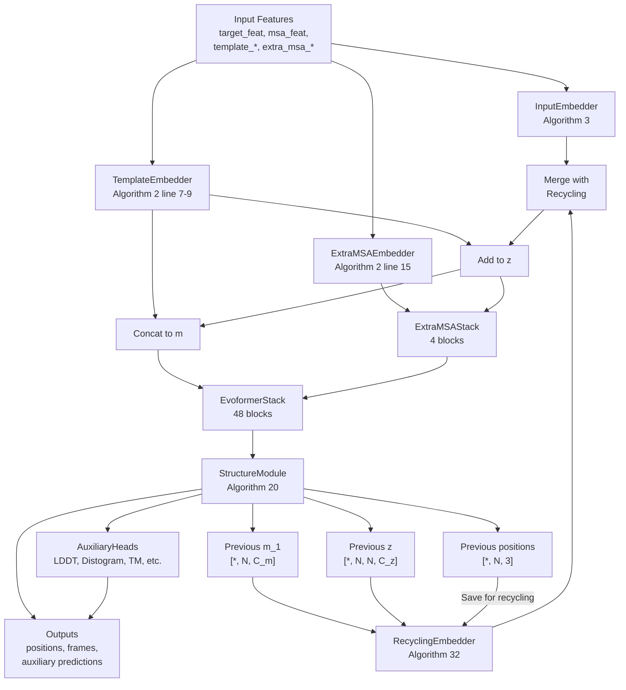
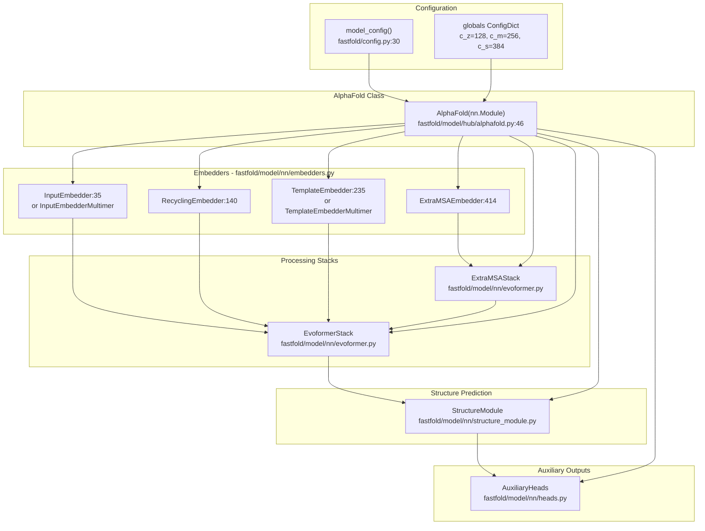
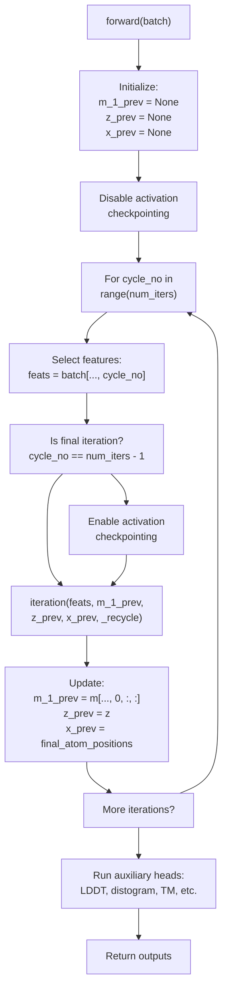
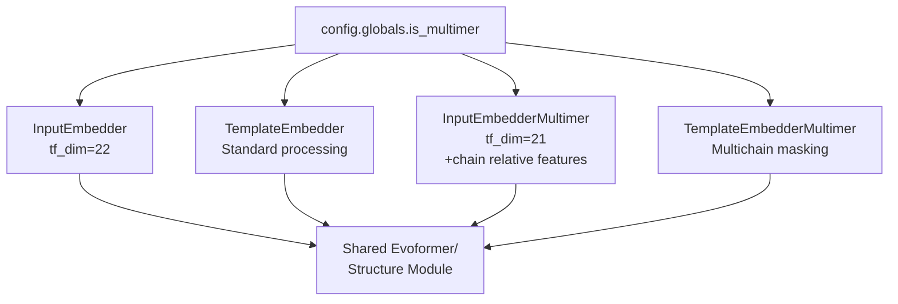

# AlphaFold Model Architecture

> **Relevant source files**
> * [LICENSE](https://github.com/hpcaitech/FastFold/blob/eba49680/LICENSE)
> * [fastfold/config.py](https://github.com/hpcaitech/FastFold/blob/eba49680/fastfold/config.py)
> * [fastfold/model/fastnn/kernel/layer_norm.py](https://github.com/hpcaitech/FastFold/blob/eba49680/fastfold/model/fastnn/kernel/layer_norm.py)
> * [fastfold/model/hub/alphafold.py](https://github.com/hpcaitech/FastFold/blob/eba49680/fastfold/model/hub/alphafold.py)
> * [fastfold/model/nn/embedders.py](https://github.com/hpcaitech/FastFold/blob/eba49680/fastfold/model/nn/embedders.py)
> * [fastfold/model/nn/template.py](https://github.com/hpcaitech/FastFold/blob/eba49680/fastfold/model/nn/template.py)
> * [fastfold/relax/relax.py](https://github.com/hpcaitech/FastFold/blob/eba49680/fastfold/relax/relax.py)
> * [fastfold/relax/utils.py](https://github.com/hpcaitech/FastFold/blob/eba49680/fastfold/relax/utils.py)

## Purpose and Scope

This page documents the implementation of the AlphaFold model architecture in FastFold, specifically the `AlphaFold` class defined in [fastfold/model/hub/alphafold.py](https://github.com/hpcaitech/FastFold/blob/eba49680/fastfold/model/hub/alphafold.py)

 The model implements Algorithm 2 from the AlphaFold paper, transforming protein sequence and multiple sequence alignment (MSA) features into 3D structure predictions.

This page covers the high-level architecture, component initialization, and forward pass flow. For detailed information on specific components, see:

* [Input Embedders](/hpcaitech/FastFold/6.1-input-embedders) - InputEmbedder, TemplateEmbedder, ExtraMSAEmbedder
* [Recycling Mechanism](/hpcaitech/FastFold/6.2-recycling-mechanism) - Iterative refinement process
* [Evoformer Stack](/hpcaitech/FastFold/6.3-evoformer-stack) - Main trunk architecture and optimizations

For data processing that feeds into this model, see [Data Processing Pipeline](/hpcaitech/FastFold/4-data-processing-pipeline). For training infrastructure, see [Training System](/hpcaitech/FastFold/7-training-system).

## Architecture Overview

The AlphaFold model consists of a sequential pipeline of embedding layers, the Evoformer trunk, and a structure prediction module. The model supports both monomer and multimer protein prediction with configurable recycling iterations.

### High-Level Architecture Flow



**Sources:** [fastfold/model/hub/alphafold.py L46-L534](https://github.com/hpcaitech/FastFold/blob/eba49680/fastfold/model/hub/alphafold.py#L46-L534)

 [fastfold/config.py L146-L533](https://github.com/hpcaitech/FastFold/blob/eba49680/fastfold/config.py#L146-L533)

## Model Components and Code Mapping

The `AlphaFold` class orchestrates multiple neural network modules. The following diagram maps architectural concepts to actual code entities:



**Sources:** [fastfold/model/hub/alphafold.py L53-L106](https://github.com/hpcaitech/FastFold/blob/eba49680/fastfold/model/hub/alphafold.py#L53-L106)

 [fastfold/model/nn/embedders.py L35-L452](https://github.com/hpcaitech/FastFold/blob/eba49680/fastfold/model/nn/embedders.py#L35-L452)

 [fastfold/config.py L128-L139](https://github.com/hpcaitech/FastFold/blob/eba49680/fastfold/config.py#L128-L139)

## Forward Pass Implementation

The model's forward pass implements a recycling loop where predictions from previous iterations inform the next iteration. This implements Algorithm 2 from the AlphaFold paper.

### Recycling Loop Structure



**Sources:** [fastfold/model/hub/alphafold.py L444-L534](https://github.com/hpcaitech/FastFold/blob/eba49680/fastfold/model/hub/alphafold.py#L444-L534)

 [fastfold/model/hub/alphafold.py L173-L424](https://github.com/hpcaitech/FastFold/blob/eba49680/fastfold/model/hub/alphafold.py#L173-L424)

### Single Iteration Flow

The `iteration()` method at [fastfold/model/hub/alphafold.py L173-L424](https://github.com/hpcaitech/FastFold/blob/eba49680/fastfold/model/hub/alphafold.py#L173-L424)

 implements the core processing pipeline:

| Step | Operation | Input Shapes | Output Shapes | Code Reference |
| --- | --- | --- | --- | --- |
| 1 | Initialize MSA/pair | `target_feat [*, N, 22]``msa_feat [*, S_c, N, 49]` | `m [*, S_c, N, C_m]``z [*, N, N, C_z]` | [173-210](https://github.com/hpcaitech/FastFold/blob/eba49680/173-210) |
| 2 | Apply recycling | `m_1_prev [*, N, C_m]``z_prev [*, N, N, C_z]``x_prev [*, N, 37, 3]` | Add to m, z | [213-258](https://github.com/hpcaitech/FastFold/blob/eba49680/213-258) |
| 3 | Embed templates | `template_* features` | `template_pair_embedding [*, N, N, C_z]``template_single_embedding [*, S_t, N, C_m]` | [262-327](https://github.com/hpcaitech/FastFold/blob/eba49680/262-327) |
| 4 | Process extra MSA | `extra_msa_feat [*, S_e, N, 25]` | `z [*, N, N, C_z]` updated | [331-362](https://github.com/hpcaitech/FastFold/blob/eba49680/331-362) |
| 5 | Evoformer trunk | `m [*, S, N, C_m]``z [*, N, N, C_z]` | `m [*, S, N, C_m]``z [*, N, N, C_z]``s [*, N, C_s]` | [369-390](https://github.com/hpcaitech/FastFold/blob/eba49680/369-390) |
| 6 | Structure module | `s [*, N, C_s]``z [*, N, N, C_z]``aatype [*, N]` | `positions [*, N, 14, 3]``frames [*, N, 7, 7]` | [398-408](https://github.com/hpcaitech/FastFold/blob/eba49680/398-408) |

**Sources:** [fastfold/model/hub/alphafold.py L173-L424](https://github.com/hpcaitech/FastFold/blob/eba49680/fastfold/model/hub/alphafold.py#L173-L424)

## Component Details

### Input Processing

The `InputEmbedder` (monomer) or `InputEmbedderMultimer` (multimer) converts raw sequence and MSA features into learned representations. The embedder implements Algorithm 3 from the AlphaFold paper.

**Key operations:**

* Target features → pair representation via two linear projections: [fastfold/model/nn/embedders.py L72-L73](https://github.com/hpcaitech/FastFold/blob/eba49680/fastfold/model/nn/embedders.py#L72-L73)
* Relative positional encoding (Algorithm 4): [fastfold/model/nn/embedders.py L82-L97](https://github.com/hpcaitech/FastFold/blob/eba49680/fastfold/model/nn/embedders.py#L82-L97)
* MSA features → MSA representation: [fastfold/model/nn/embedders.py L75](https://github.com/hpcaitech/FastFold/blob/eba49680/fastfold/model/nn/embedders.py#L75-L75)

**Dimensions:**

* Input: `target_feat [*, N_res, 22]`, `msa_feat [*, N_clust, N_res, 49]`
* Output: `m [*, N_clust, N_res, 256]`, `z [*, N_res, N_res, 128]`

**Sources:** [fastfold/model/nn/embedders.py L35-L138](https://github.com/hpcaitech/FastFold/blob/eba49680/fastfold/model/nn/embedders.py#L35-L138)

 [fastfold/model/hub/alphafold.py L67-L80](https://github.com/hpcaitech/FastFold/blob/eba49680/fastfold/model/hub/alphafold.py#L67-L80)

### Template Processing

Template structures provide evolutionary and structural priors. The `TemplateEmbedder` processes template features through:

1. **Template Pair Embedder** - embeds pairwise template features (distances, angles)
2. **Template Pair Stack** - 2-block attention/triangle network
3. **Template Pointwise Attention** - aggregates templates via attention over template dimension

Templates are processed one at a time (poor man's vmap) and then aggregated: [fastfold/model/hub/alphafold.py L107-L171](https://github.com/hpcaitech/FastFold/blob/eba49680/fastfold/model/hub/alphafold.py#L107-L171)

**Optional angle embedding:** If `config.template.embed_angles=True`, template torsion angles are embedded and concatenated to the MSA representation.

**Sources:** [fastfold/model/nn/embedders.py L235-L324](https://github.com/hpcaitech/FastFold/blob/eba49680/fastfold/model/nn/embedders.py#L235-L324)

 [fastfold/model/nn/template.py L45-L363](https://github.com/hpcaitech/FastFold/blob/eba49680/fastfold/model/nn/template.py#L45-L363)

 [fastfold/model/hub/alphafold.py L262-L327](https://github.com/hpcaitech/FastFold/blob/eba49680/fastfold/model/hub/alphafold.py#L262-L327)

### Extra MSA Processing

The `ExtraMSAStack` processes unclustered MSA sequences (typically 1024-5120 sequences) to extract co-evolutionary information that updates the pair representation.

**Architecture:**

* 4 blocks (configurable via `config.model.extra_msa.extra_msa_stack.no_blocks`)
* Each block contains: MSA row attention, MSA column attention, MSA transition, outer product mean, triangle multiplication, triangle attention
* Output updates only the pair representation `z`

**Memory optimization:** Extra MSA is typically very large, so the stack uses chunking and optional activation checkpointing.

**Sources:** [fastfold/model/hub/alphafold.py L331-L362](https://github.com/hpcaitech/FastFold/blob/eba49680/fastfold/model/hub/alphafold.py#L331-L362)

 [fastfold/config.py L375-L398](https://github.com/hpcaitech/FastFold/blob/eba49680/fastfold/config.py#L375-L398)

### Main Trunk (Evoformer)

The `EvoformerStack` is the core of the network, consisting of 48 blocks (monomer) that process MSA and pair representations jointly. See [Evoformer Stack](/hpcaitech/FastFold/6.3-evoformer-stack) for detailed architecture.

**Key features:**

* Joint MSA and pair representation processing
* Outputs single representation `s` for structure module
* Supports FastNN optimization via `inject_fastnn` ([Performance Optimizations](/hpcaitech/FastFold/8-performance-optimizations))

**Sources:** [fastfold/model/hub/alphafold.py L369-L390](https://github.com/hpcaitech/FastFold/blob/eba49680/fastfold/model/hub/alphafold.py#L369-L390)

 [fastfold/config.py L400-L418](https://github.com/hpcaitech/FastFold/blob/eba49680/fastfold/config.py#L400-L418)

### Structure Module

The `StructureModule` predicts 3D atomic coordinates from the single and pair representations using Invariant Point Attention (IPA). It outputs:

* `positions`: Atom14 coordinates `[*, N_res, 14, 3]`
* `frames`: Backbone frames `[*, N_res, 7, 7]` (rotation and translation)
* `final_atom_positions`: Converted to atom37 format

**Sources:** [fastfold/model/hub/alphafold.py L398-L408](https://github.com/hpcaitech/FastFold/blob/eba49680/fastfold/model/hub/alphafold.py#L398-L408)

 [fastfold/config.py L419-L435](https://github.com/hpcaitech/FastFold/blob/eba49680/fastfold/config.py#L419-L435)

### Auxiliary Heads

The `AuxiliaryHeads` module computes additional predictions:

| Head | Purpose | Output Shape | Enabled By |
| --- | --- | --- | --- |
| LDDT | Per-residue confidence | `[*, N_res, 50]` | Always |
| Distogram | Distance distribution | `[*, N_res, N_res, 64]` | Always |
| TM Score | Template modeling score | `[*, N_res, N_res, 64]` | `config.model.heads.tm.enabled` |
| Masked MSA | MSA recovery | `[*, N_seq, N_res, 23]` | Training only |
| Experimentally Resolved | Per-atom resolution prediction | `[*, N_res, 37]` | Training only |

**Sources:** [fastfold/model/hub/alphafold.py L531-L532](https://github.com/hpcaitech/FastFold/blob/eba49680/fastfold/model/hub/alphafold.py#L531-L532)

 [fastfold/config.py L436-L459](https://github.com/hpcaitech/FastFold/blob/eba49680/fastfold/config.py#L436-L459)

## Recycling Mechanism

The model supports iterative refinement through recycling. The number of recycling iterations is specified in the input batch via `batch["aatype"].shape[-1]`.

**Recycling embeddings:**

1. **MSA recycling:** First row of MSA from previous iteration `m[..., 0, :, :]`
2. **Pair recycling:** Pair representation from previous iteration
3. **Structure recycling:** Pseudo-beta positions from predicted coordinates, binned into distance features

The `RecyclingEmbedder` at [fastfold/model/nn/embedders.py L140-L233](https://github.com/hpcaitech/FastFold/blob/eba49680/fastfold/model/nn/embedders.py#L140-L233)

 processes these into embeddings that are added to the initial representations.

**Gradient management:** Only the final recycling iteration has gradients enabled to save memory: [fastfold/model/hub/alphafold.py L514-L519](https://github.com/hpcaitech/FastFold/blob/eba49680/fastfold/model/hub/alphafold.py#L514-L519)

For detailed recycling implementation, see [Recycling Mechanism](/hpcaitech/FastFold/6.2-recycling-mechanism).

**Sources:** [fastfold/model/hub/alphafold.py L213-L258](https://github.com/hpcaitech/FastFold/blob/eba49680/fastfold/model/hub/alphafold.py#L213-L258)

 [fastfold/model/hub/alphafold.py L496-L528](https://github.com/hpcaitech/FastFold/blob/eba49680/fastfold/model/hub/alphafold.py#L496-L528)

 [fastfold/model/nn/embedders.py L140-L233](https://github.com/hpcaitech/FastFold/blob/eba49680/fastfold/model/nn/embedders.py#L140-L233)

## Configuration Parameters

The model architecture is controlled by configuration in [fastfold/config.py](https://github.com/hpcaitech/FastFold/blob/eba49680/fastfold/config.py)

 Key dimension parameters use `FieldReference` for global coordination:

### Core Dimensions

| Parameter | Default | Description |
| --- | --- | --- |
| `c_z` | 128 | Pair representation dimension |
| `c_m` | 256 | MSA representation dimension |
| `c_t` | 64 | Template representation dimension |
| `c_e` | 64 | Extra MSA representation dimension |
| `c_s` | 384 | Single representation dimension |
| `blocks_per_ckpt` | None | Blocks per activation checkpoint (None = disabled) |
| `chunk_size` | None | Chunking size for memory optimization (None = auto) |
| `eps` | 1e-8 | Numerical stability epsilon |

**Sources:** [fastfold/config.py L128-L139](https://github.com/hpcaitech/FastFold/blob/eba49680/fastfold/config.py#L128-L139)

 [fastfold/config.py L304-L314](https://github.com/hpcaitech/FastFold/blob/eba49680/fastfold/config.py#L304-L314)

### Model Presets

The `model_config()` function provides preset configurations matching AlphaFold2 paper:

| Preset | Template Enabled | Extra MSA Size | Notes |
| --- | --- | --- | --- |
| `model_1` | ✓ | 5120 | AF2 Model 1.1.1 |
| `model_2` | ✓ | 1024 | AF2 Model 1.1.2 |
| `model_3` | ✗ | 5120 | AF2 Model 1.2.1 (no templates) |
| `model_4` | ✗ | 5120 | AF2 Model 1.2.2 (no templates) |
| `model_5` | ✗ | 1024 | AF2 Model 1.2.3 (no templates) |
| `model_*_ptm` | Varies | Varies | Add pTM head for confidence |
| `model_*_multimer` | ✓ | Varies | Multimer prediction |

**Sources:** [fastfold/config.py L30-L125](https://github.com/hpcaitech/FastFold/blob/eba49680/fastfold/config.py#L30-L125)

## Monomer vs Multimer Variants

The model supports both monomer and multimer prediction through conditional initialization:



**Key differences:**

**Multimer modifications:**

* Different input embedder with chain-relative positional encoding: [fastfold/config.py L536-L545](https://github.com/hpcaitech/FastFold/blob/eba49680/fastfold/config.py#L536-L545)
* Template embedder respects chain boundaries: [fastfold/model/hub/alphafold.py L268-L277](https://github.com/hpcaitech/FastFold/blob/eba49680/fastfold/model/hub/alphafold.py#L268-L277)
* MSA pairing for co-evolution across chains (data processing)
* Structure module `trans_scale_factor=20` vs 10 for monomer: [fastfold/config.py L99](https://github.com/hpcaitech/FastFold/blob/eba49680/fastfold/config.py#L99-L99)

**Sources:** [fastfold/model/hub/alphafold.py L67-L80](https://github.com/hpcaitech/FastFold/blob/eba49680/fastfold/model/hub/alphafold.py#L67-L80)

 [fastfold/config.py L96-L111](https://github.com/hpcaitech/FastFold/blob/eba49680/fastfold/config.py#L96-L111)

 [fastfold/config.py L535-L606](https://github.com/hpcaitech/FastFold/blob/eba49680/fastfold/config.py#L535-L606)

## Activation Checkpointing

The model supports gradient checkpointing to reduce memory usage during training. Checkpointing is controlled dynamically:

1. **Disabled** for all non-final recycling iterations to save computation
2. **Enabled** only for the final iteration where gradients are computed

**Checkpointing locations:**

* `TemplatePairStack.blocks_per_ckpt`: [fastfold/config.py L357](https://github.com/hpcaitech/FastFold/blob/eba49680/fastfold/config.py#L357-L357)
* `EvoformerStack.blocks_per_ckpt`: [fastfold/config.py L414](https://github.com/hpcaitech/FastFold/blob/eba49680/fastfold/config.py#L414-L414)
* `ExtraMSAStack`: Per-block checkpointing via `ckpt` flag [fastfold/config.py L396](https://github.com/hpcaitech/FastFold/blob/eba49680/fastfold/config.py#L396-L396)

**Runtime control:**

* `_disable_activation_checkpointing()`: [fastfold/model/hub/alphafold.py L426-L432](https://github.com/hpcaitech/FastFold/blob/eba49680/fastfold/model/hub/alphafold.py#L426-L432)
* `_enable_activation_checkpointing()`: [fastfold/model/hub/alphafold.py L433-L442](https://github.com/hpcaitech/FastFold/blob/eba49680/fastfold/model/hub/alphafold.py#L433-L442)

**Sources:** [fastfold/model/hub/alphafold.py L426-L442](https://github.com/hpcaitech/FastFold/blob/eba49680/fastfold/model/hub/alphafold.py#L426-L442)

 [fastfold/model/hub/alphafold.py L498-L519](https://github.com/hpcaitech/FastFold/blob/eba49680/fastfold/model/hub/alphafold.py#L498-L519)

## Inplace Operations

For memory efficiency, the model supports inplace update mode controlled by `config.globals.inplace`:

**Standard mode (inplace=False):**

```
z = self.extra_msa_stack(extra_msa_feat, z, ...)m, z, s = self.evoformer(m, z, ...)
```

**Inplace mode (inplace=True):**

```
extra_msa_feat = [extra_msa_feat]z = [z]z = self.extra_msa_stack.inplace(extra_msa_feat, z, ...)[0] m = [m]z = [z]m, z, s = self.evoformer.inplace(m, z, ...)m = m[0]z = z[0]
```

The inplace mode wraps tensors in lists to enable in-place mutation, reducing memory allocations. This is particularly beneficial for large sequences.

**Sources:** [fastfold/model/hub/alphafold.py L342-L361](https://github.com/hpcaitech/FastFold/blob/eba49680/fastfold/model/hub/alphafold.py#L342-L361)

 [fastfold/model/hub/alphafold.py L369-L390](https://github.com/hpcaitech/FastFold/blob/eba49680/fastfold/model/hub/alphafold.py#L369-L390)