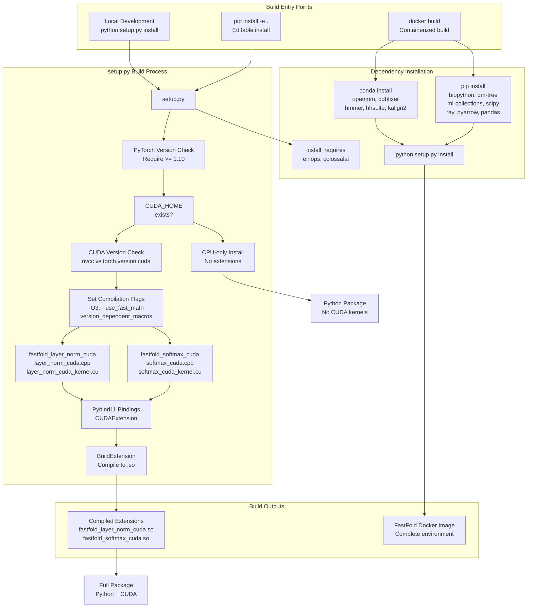
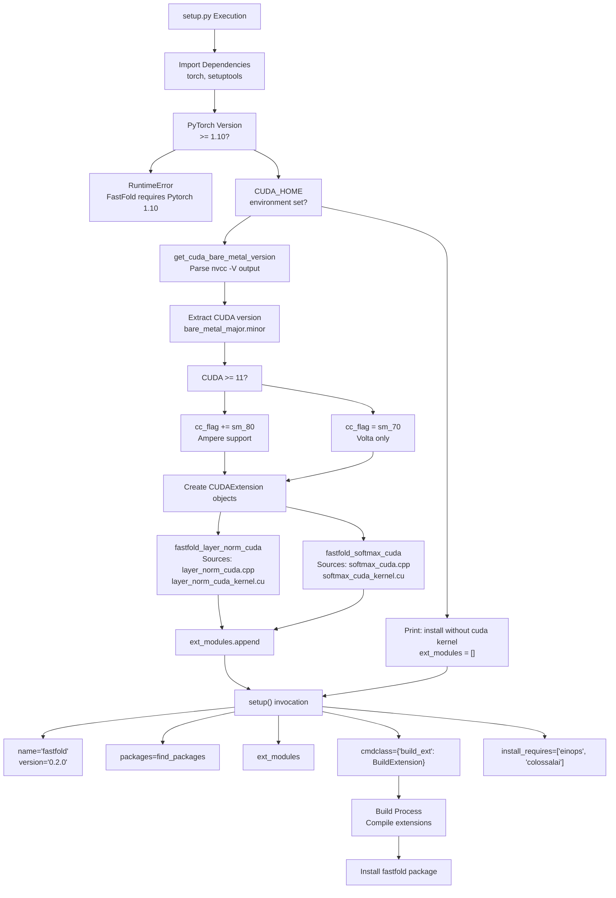
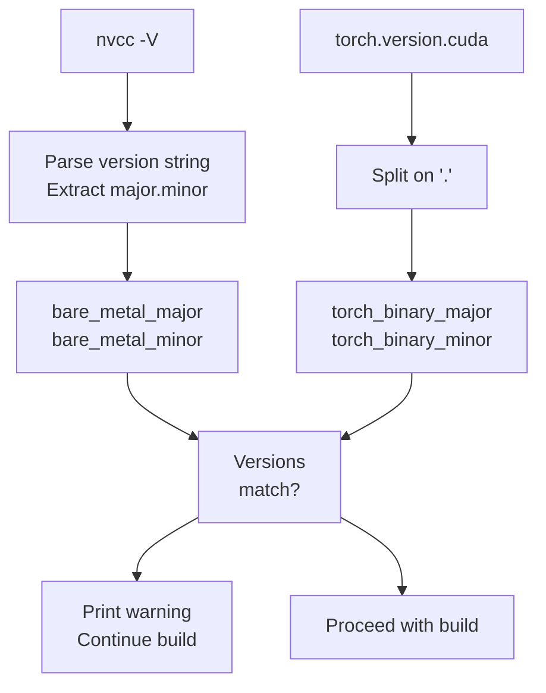
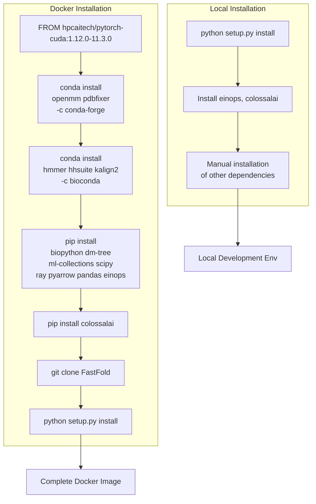
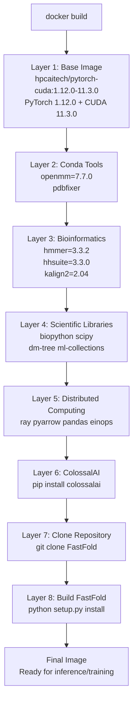

# Build System

> **Relevant source files**
> * [docker/Dockerfile](https://github.com/hpcaitech/FastFold/blob/eba49680/docker/Dockerfile)
> * [setup.py](https://github.com/hpcaitech/FastFold/blob/eba49680/setup.py)

## Purpose and Scope

This document explains FastFold's build system, which handles compilation of CUDA extensions, dependency management, and package installation. The build system is implemented primarily through [setup.py](https://github.com/hpcaitech/FastFold/blob/eba49680/setup.py)

() and [docker/Dockerfile](https://github.com/hpcaitech/FastFold/blob/eba49680/docker/Dockerfile)

(), providing both local development and containerized deployment paths.

For information about continuous integration and automated testing, see [Continuous Integration](/hpcaitech/FastFold/10.3-continuous-integration). For deployment and runtime environments, see [Docker Deployment](/hpcaitech/FastFold/10.4-docker-deployment).

---

## Build System Architecture

The FastFold build system operates through two primary pathways: local installation via `setup.py` and containerized deployment via Docker. Both paths ensure proper compilation of CUDA extensions and installation of required dependencies.

### Build System Components



**Diagram: Build System Architecture**

This diagram shows the two build pathways: local installation processes PyTorch version checks and conditionally compiles CUDA extensions, while Docker builds layer dependencies and invoke `setup.py` for a complete containerized environment.

Sources: [setup.py L1-L143](https://github.com/hpcaitech/FastFold/blob/eba49680/setup.py#L1-L143)

 [docker/Dockerfile L1-L14](https://github.com/hpcaitech/FastFold/blob/eba49680/docker/Dockerfile#L1-L14)

---

## setup.py Structure

The `setup.py` file orchestrates package building, dependency management, and CUDA extension compilation. It implements version compatibility checks and conditional compilation based on CUDA availability.

### Key Components

| Component | Purpose | File Location |
| --- | --- | --- |
| **Version Checking** | Validates PyTorch >= 1.10 | [setup.py L68-L74](https://github.com/hpcaitech/FastFold/blob/eba49680/setup.py#L68-L74) |
| **CUDA Detection** | Checks for CUDA_HOME environment | [setup.py L86-L127](https://github.com/hpcaitech/FastFold/blob/eba49680/setup.py#L86-L127) |
| **Extension Helper** | Creates CUDAExtension objects | [setup.py L89-L103](https://github.com/hpcaitech/FastFold/blob/eba49680/setup.py#L89-L103) |
| **Compilation Flags** | Sets NVCC and C++ compiler flags | [setup.py L98-L116](https://github.com/hpcaitech/FastFold/blob/eba49680/setup.py#L98-L116) |
| **Package Metadata** | Defines package name, version, structure | [setup.py L129-L143](https://github.com/hpcaitech/FastFold/blob/eba49680/setup.py#L129-L143) |

### Build Execution Flow



**Diagram: setup.py Execution Flow**

This flowchart traces the execution path from initial version checks through CUDA detection, extension creation, and final package installation.

Sources: [setup.py L1-L143](https://github.com/hpcaitech/FastFold/blob/eba49680/setup.py#L1-L143)

---

## CUDA Extension Compilation

FastFold compiles two critical CUDA extensions that provide optimized kernel implementations: `fastfold_layer_norm_cuda` and `fastfold_softmax_cuda`.

### Extension Configuration

The `cuda_ext_helper` function [setup.py L89-L103](https://github.com/hpcaitech/FastFold/blob/eba49680/setup.py#L89-L103)

 creates `CUDAExtension` objects with the following configuration:

```css
# Conceptual structure (not actual code)CUDAExtension(    name="fastfold_layer_norm_cuda",    sources=[        "fastfold/model/fastnn/kernel/cuda_native/csrc/layer_norm_cuda.cpp",        "fastfold/model/fastnn/kernel/cuda_native/csrc/layer_norm_cuda_kernel.cu"    ],    include_dirs=["fastfold/model/fastnn/kernel/cuda_native/csrc/include"],    extra_compile_args={        'cxx': ['-O3'] + version_dependent_macros,        'nvcc': ['-O3', '--use_fast_math', ...] + cc_flags    })
```

### Compilation Flags and Optimizations

| Flag Category | Flags | Purpose |
| --- | --- | --- |
| **Optimization** | `-O3`, `--use_fast_math` | Maximum optimization, fast math operations |
| **C++ Standard** | `-std=c++14` | C++14 language features |
| **Register Usage** | `-maxrregcount=50` | Limit register usage per thread |
| **CUDA Features** | `-U__CUDA_NO_HALF_OPERATORS__``-U__CUDA_NO_HALF_CONVERSIONS__` | Enable half-precision operations |
| **Extensions** | `--expt-relaxed-constexpr``--expt-extended-lambda` | Extended CUDA language features |
| **Version Macros** | `-DVERSION_GE_1_1``-DVERSION_GE_1_3``-DVERSION_GE_1_5` | PyTorch compatibility macros |
| **Compute Capability** | `-gencode arch=compute_70,code=sm_70``-gencode arch=compute_80,code=sm_80` | Target Volta (sm_70) and Ampere (sm_80) |

Sources: [setup.py L84-L116](https://github.com/hpcaitech/FastFold/blob/eba49680/setup.py#L84-L116)

### CUDA Version Validation

The build system validates CUDA compatibility through `get_cuda_bare_metal_version` [setup.py L12-L20](https://github.com/hpcaitech/FastFold/blob/eba49680/setup.py#L12-L20)

 and `check_cuda_torch_binary_vs_bare_metal` [setup.py L23-L38](https://github.com/hpcaitech/FastFold/blob/eba49680/setup.py#L23-L38)

 While the strict version check is commented out [setup.py L87](https://github.com/hpcaitech/FastFold/blob/eba49680/setup.py#L87-L87)

 the system still warns about version mismatches.



**Diagram: CUDA Version Validation Process**

Sources: [setup.py L12-L38](https://github.com/hpcaitech/FastFold/blob/eba49680/setup.py#L12-L38)

---

## Dependency Management

FastFold requires a comprehensive set of dependencies spanning deep learning frameworks, scientific computing libraries, and bioinformatics tools.

### Python Dependencies

The build system manages Python dependencies at two levels:

**Core Dependencies** (installed via `setup.py`):

* `einops`: Tensor manipulation library
* `colossalai`: Distributed training framework

**Extended Dependencies** (installed manually or via Docker):

* `biopython==1.79`: Bioinformatics data structures
* `dm-tree==0.1.6`: Tree data structures (DeepMind)
* `ml-collections==0.1.0`: Configuration system
* `scipy==1.7.1`: Scientific computing
* `ray`, `pyarrow`, `pandas`: Distributed computing and data processing

Sources: [setup.py L142](https://github.com/hpcaitech/FastFold/blob/eba49680/setup.py#L142-L142)

 [docker/Dockerfile L6-L9](https://github.com/hpcaitech/FastFold/blob/eba49680/docker/Dockerfile#L6-L9)

### Bioinformatics Tools (Conda)

The Docker build installs specialized bioinformatics tools via Conda [docker/Dockerfile L3-L4](https://github.com/hpcaitech/FastFold/blob/eba49680/docker/Dockerfile#L3-L4)

:

| Tool | Version | Purpose |
| --- | --- | --- |
| **openmm** | 7.7.0 | Molecular dynamics simulation |
| **pdbfixer** | - | PDB structure correction |
| **hmmer** | 3.3.2 | Sequence homology search |
| **hhsuite** | 3.3.0 | Remote homology detection |
| **kalign2** | 2.04 | Multiple sequence alignment |

### Dependency Installation Flow



**Diagram: Dependency Installation Pathways**

Sources: [docker/Dockerfile L1-L14](https://github.com/hpcaitech/FastFold/blob/eba49680/docker/Dockerfile#L1-L14)

 [setup.py L142](https://github.com/hpcaitech/FastFold/blob/eba49680/setup.py#L142-L142)

---

## Build Configuration Options

### Conditional CUDA Compilation

The build system adapts to the presence or absence of CUDA:

**CUDA Available** [setup.py L86-L125](https://github.com/hpcaitech/FastFold/blob/eba49680/setup.py#L86-L125)

:

* Detects `CUDA_HOME` environment variable
* Validates CUDA version compatibility
* Compiles layer normalization and softmax extensions
* Sets compute capability flags (sm_70 for Volta, sm_80 for Ampere)

**CUDA Not Available** [setup.py L126-L127](https://github.com/hpcaitech/FastFold/blob/eba49680/setup.py#L126-L127)

:

* Prints notice: "install without cuda kernel"
* Installs Python package without compiled extensions
* Allows CPU-only execution (with performance limitations)

### Compute Capability Targeting

The build system automatically selects compute capabilities based on CUDA version [setup.py L107-L111](https://github.com/hpcaitech/FastFold/blob/eba49680/setup.py#L107-L111)

:

| CUDA Version | Compute Capabilities | GPU Architectures |
| --- | --- | --- |
| **< 11** | `sm_70` | Volta (V100) |
| **>= 11** | `sm_70`, `sm_80` | Volta (V100), Ampere (A100) |

### Parallel Compilation

For CUDA 11.2+, the build system enables parallel NVCC threads [setup.py L41-L45](https://github.com/hpcaitech/FastFold/blob/eba49680/setup.py#L41-L45)

:

```markdown
# Conceptual logicif cuda_version >= (11, 2):    nvcc_args += ["--threads", "4"]
```

This reduces compilation time for the CUDA kernels.

Sources: [setup.py L41-L45](https://github.com/hpcaitech/FastFold/blob/eba49680/setup.py#L41-L45)

 [setup.py L107-L111](https://github.com/hpcaitech/FastFold/blob/eba49680/setup.py#L107-L111)

---

## Docker Build Process

The Dockerfile [docker/Dockerfile L1-L14](https://github.com/hpcaitech/FastFold/blob/eba49680/docker/Dockerfile#L1-L14)

 provides a reproducible containerized environment with all dependencies pre-installed.

### Build Stages



**Diagram: Docker Multi-Stage Build Layers**

Each layer is cached independently, allowing faster rebuilds when only later stages change.

### Base Image Selection

The Docker build uses `hpcaitech/pytorch-cuda:1.12.0-11.3.0` [docker/Dockerfile L1](https://github.com/hpcaitech/FastFold/blob/eba49680/docker/Dockerfile#L1-L1)

 as the base image, which provides:

* PyTorch 1.12.0 pre-installed
* CUDA 11.3.0 toolkit and runtime
* cuDNN libraries
* Python 3.x environment

### Package Installation Channels

The build uses multiple package channels for optimal compatibility:

| Channel | Packages | Purpose |
| --- | --- | --- |
| **conda-forge** | openmm, pdbfixer | General scientific computing |
| **bioconda** | hmmer, hhsuite, kalign2 | Bioinformatics-specific tools |
| **PyPI (pip)** | biopython, ml-collections, ray, colossalai | Python libraries |

Sources: [docker/Dockerfile L1-L14](https://github.com/hpcaitech/FastFold/blob/eba49680/docker/Dockerfile#L1-L14)

---

## Build Troubleshooting

### Common Build Issues

**Issue: CUDA Version Mismatch**

* **Symptom**: RuntimeError about CUDA version mismatch
* **Cause**: NVCC version differs from PyTorch CUDA version
* **Solution**: Ensure `CUDA_HOME` points to the same CUDA version used to compile PyTorch, or comment out the check at [setup.py L87](https://github.com/hpcaitech/FastFold/blob/eba49680/setup.py#L87-L87)

**Issue: Missing CUDA Extensions**

* **Symptom**: "install without cuda kernel" message
* **Cause**: `CUDA_HOME` environment variable not set
* **Solution**: Set `CUDA_HOME` to CUDA installation directory (e.g., `/usr/local/cuda`)

**Issue: Compilation Errors on Older GPUs**

* **Symptom**: NVCC compilation fails with architecture errors
* **Cause**: Compute capability flags target newer architectures
* **Solution**: Modify `cc_flag` at [setup.py L107-L111](https://github.com/hpcaitech/FastFold/blob/eba49680/setup.py#L107-L111)  to match your GPU architecture

**Issue: PyTorch Version Too Old**

* **Symptom**: RuntimeError about PyTorch version requirement
* **Cause**: PyTorch version < 1.10
* **Solution**: Update PyTorch: `pip install torch>=1.10`

### Build Validation

After installation, verify CUDA extensions loaded correctly:

```javascript
# Check if CUDA extensions are availableimport fastfold_layer_norm_cudaimport fastfold_softmax_cuda print("CUDA extensions loaded successfully")
```

If imports fail, the package fell back to CPU-only mode.

Sources: [setup.py L48-L74](https://github.com/hpcaitech/FastFold/blob/eba49680/setup.py#L48-L74)

 [setup.py L126-L127](https://github.com/hpcaitech/FastFold/blob/eba49680/setup.py#L126-L127)

---

## Integration with CI/CD

The build system integrates with GitHub Actions for continuous integration (see [Continuous Integration](/hpcaitech/FastFold/10.3-continuous-integration)). The CI workflow:

1. Uses a self-hosted GPU runner with Docker support
2. Leverages build artifact caching at `/github/home/fastfold_cache/`
3. Executes `pip install -e .` to build CUDA extensions
4. Runs test suite to validate compiled extensions

The Docker build process can be invoked independently:

```markdown
# Build Docker imagedocker build -t fastfold:latest -f docker/Dockerfile . # Run container with GPU supportdocker run --gpus all -it fastfold:latest
```

Sources: [docker/Dockerfile L1-L14](https://github.com/hpcaitech/FastFold/blob/eba49680/docker/Dockerfile#L1-L14)

---

## Summary

The FastFold build system provides flexible compilation pathways through `setup.py` and Docker, with intelligent CUDA detection, version validation, and conditional extension compilation. Key features include:

* **Automatic CUDA Detection**: Conditionally compiles extensions when CUDA_HOME is available
* **Version Compatibility**: Validates PyTorch >= 1.10 and warns about CUDA version mismatches
* **Optimized Compilation**: Uses aggressive optimization flags (`-O3`, `--use_fast_math`) and targets modern GPU architectures (Volta, Ampere)
* **Dual Installation Modes**: Local development via pip/setup.py or containerized deployment via Docker
* **Comprehensive Dependencies**: Manages Python packages, bioinformatics tools, and distributed computing frameworks

The build system ensures reproducible environments across development, testing, and production deployments while maximizing performance through native CUDA kernel compilation.

Sources: [setup.py L1-L143](https://github.com/hpcaitech/FastFold/blob/eba49680/setup.py#L1-L143)

 [docker/Dockerfile L1-L14](https://github.com/hpcaitech/FastFold/blob/eba49680/docker/Dockerfile#L1-L14)