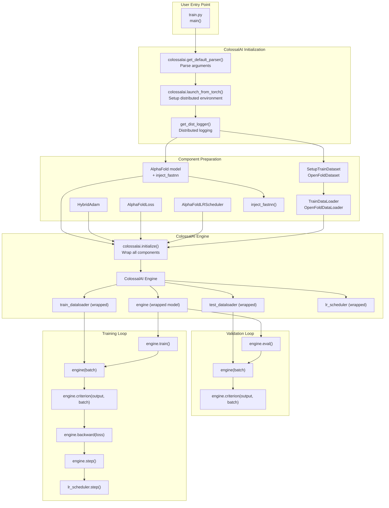
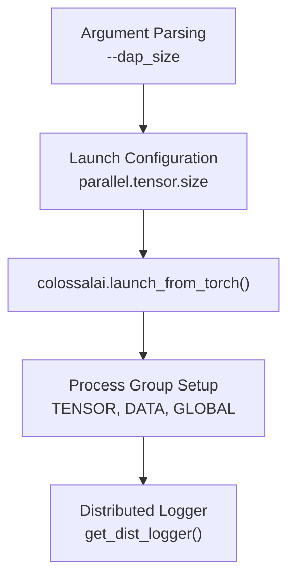
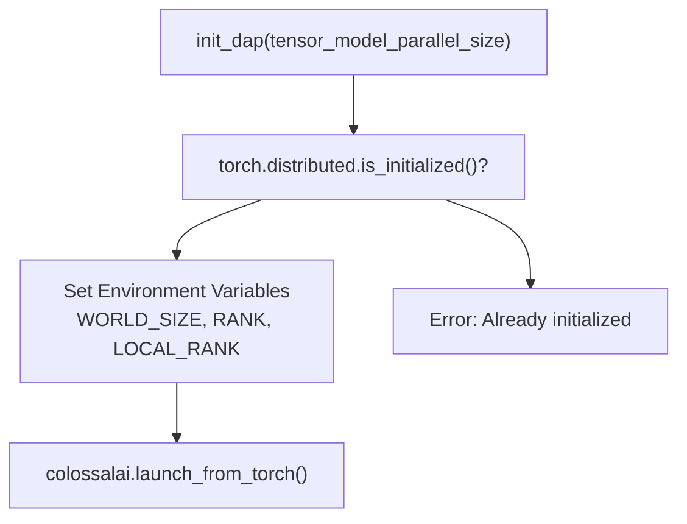
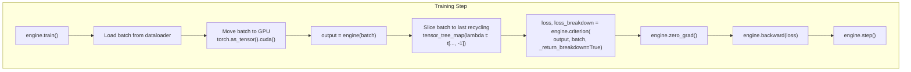
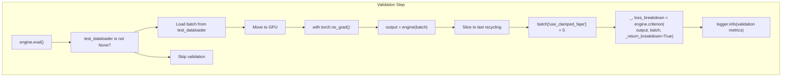
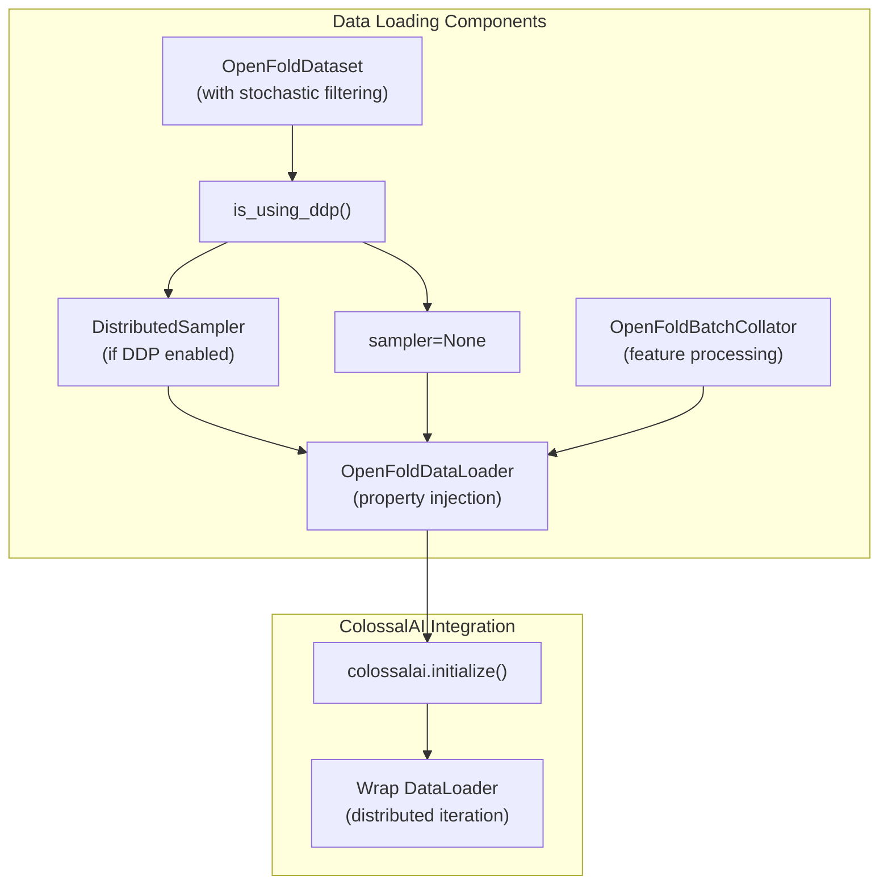
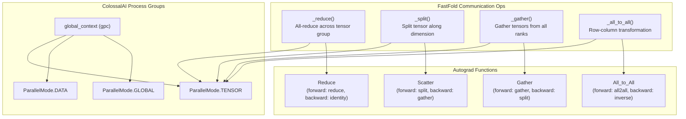
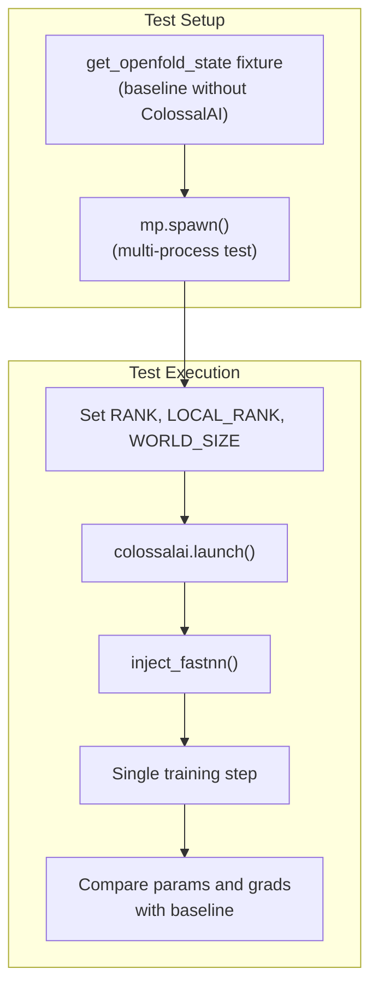
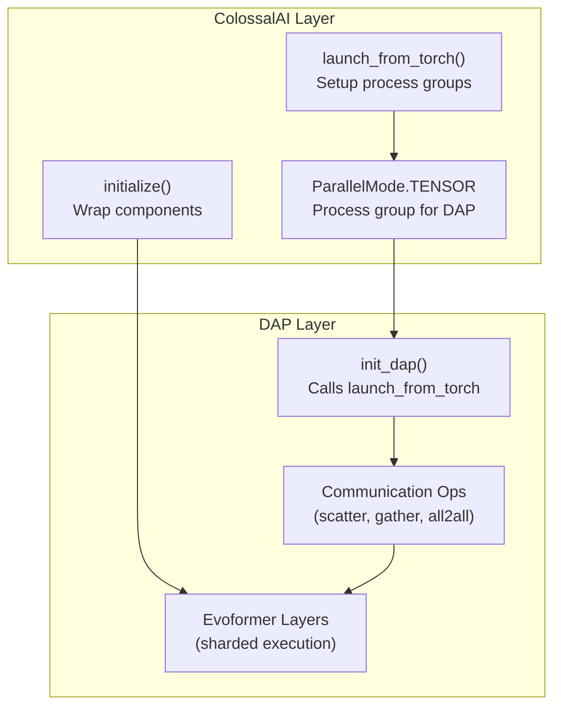

# ColossalAI Integration

> **Relevant source files**
> * [benchmark/perf.py](https://github.com/hpcaitech/FastFold/blob/eba49680/benchmark/perf.py)
> * [fastfold/data/data_modules.py](https://github.com/hpcaitech/FastFold/blob/eba49680/fastfold/data/data_modules.py)
> * [fastfold/distributed/__init__.py](https://github.com/hpcaitech/FastFold/blob/eba49680/fastfold/distributed/__init__.py)
> * [fastfold/distributed/comm.py](https://github.com/hpcaitech/FastFold/blob/eba49680/fastfold/distributed/comm.py)
> * [fastfold/distributed/core.py](https://github.com/hpcaitech/FastFold/blob/eba49680/fastfold/distributed/core.py)
> * [fastfold/model/__init__.py](https://github.com/hpcaitech/FastFold/blob/eba49680/fastfold/model/__init__.py)
> * [fastfold/utils/tensor_utils.py](https://github.com/hpcaitech/FastFold/blob/eba49680/fastfold/utils/tensor_utils.py)
> * [fastfold/utils/test_utils.py](https://github.com/hpcaitech/FastFold/blob/eba49680/fastfold/utils/test_utils.py)
> * [tests/test_train.py](https://github.com/hpcaitech/FastFold/blob/eba49680/tests/test_train.py)
> * [train.py](https://github.com/hpcaitech/FastFold/blob/eba49680/train.py)

## Purpose and Scope

This document explains how FastFold integrates ColossalAI as its distributed training engine. ColossalAI manages model parallelism, data parallelism, optimizer updates, and loss computation during training. This integration is specific to the training workflow (`train.py`).

For information about Dynamic Axial Parallelism (DAP) which also uses ColossalAI infrastructure for inference, see [Dynamic Axial Parallelism](/hpcaitech/FastFold/8.1-dynamic-axial-parallelism-(dap)). For distributed communication primitives used in both training and inference, see [Distributed Communication Primitives](/hpcaitech/FastFold/8.4-distributed-communication-primitives).

---

## Architecture Overview



**Architecture Overview**: ColossalAI serves as the central orchestrator for distributed training. The integration follows three phases: (1) **Initialization** via `launch_from_torch` to setup the distributed environment; (2) **Engine Creation** via `initialize()` to wrap model, optimizer, loss, scheduler, and dataloaders; (3) **Training Execution** using engine methods for forward/backward/step operations. The engine abstracts away distributed training complexity, providing a unified interface regardless of parallelism strategy.

Sources: [train.py L1-L258](https://github.com/hpcaitech/FastFold/blob/eba49680/train.py#L1-L258)

---

## Initialization and Configuration

### Launch Configuration

ColossalAI initialization occurs early in the training workflow with specific configuration for tensor parallelism:



**Initialization Flow**: The `--dap_size` argument specifies tensor model parallel size. This value is passed to `launch_from_torch()` in a configuration dict. ColossalAI then initializes process groups and distributed logging infrastructure.

The initialization code in `train.py`:

| Line Range | Operation | Purpose |
| --- | --- | --- |
| [train.py L37-L38](https://github.com/hpcaitech/FastFold/blob/eba49680/train.py#L37-L38) | `colossalai.get_default_parser()` | Get argument parser with ColossalAI-specific flags |
| [train.py L155-L156](https://github.com/hpcaitech/FastFold/blob/eba49680/train.py#L155-L156) | `--dap_size` argument | Specify tensor parallelism size (1 to nproc_per_node) |
| [train.py L164-L166](https://github.com/hpcaitech/FastFold/blob/eba49680/train.py#L164-L166) | `colossalai.launch_from_torch()` | Initialize distributed environment with config dict |
| [train.py L167-L169](https://github.com/hpcaitech/FastFold/blob/eba49680/train.py#L167-L169) | `disable_existing_loggers()`, `get_dist_logger()` | Setup distributed logging |

Configuration structure:

```
config=dict(    parallel=dict(        tensor=dict(size=args.dap_size)    ),    torch_ddp=dict(static_graph=True))
```

The `static_graph=True` option enables PyTorch DDP optimizations for static computational graphs, which is appropriate for AlphaFold's fixed architecture.

Sources: [train.py L36-L169](https://github.com/hpcaitech/FastFold/blob/eba49680/train.py#L36-L169)

 [fastfold/distributed/core.py L17-L41](https://github.com/hpcaitech/FastFold/blob/eba49680/fastfold/distributed/core.py#L17-L41)

### Alternative Initialization: init_dap

For inference and standalone testing, FastFold provides `init_dap()` as a simplified wrapper around ColossalAI initialization:



**init_dap Usage**: This function handles single-device launches by setting missing environment variables (WORLD_SIZE=1, RANK=0, etc.) and defaults to localhost:18417 for master address. It detects if `torch.distributed` is already initialized and errors out to prevent double initialization.

Sources: [fastfold/distributed/core.py L17-L41](https://github.com/hpcaitech/FastFold/blob/eba49680/fastfold/distributed/core.py#L17-L41)

 [benchmark/perf.py L37](https://github.com/hpcaitech/FastFold/blob/eba49680/benchmark/perf.py#L37-L37)

---

## Engine Creation

The ColossalAI engine wraps all training components into a unified interface:

```mermaid
flowchart TD

Model["AlphaFold model<br>(after inject_fastnn)"]
Optimizer["HybridAdam optimizer"]
Criterion["AlphaFoldLoss"]
Scheduler["AlphaFoldLRScheduler"]
TrainDL["train_dataloader<br>OpenFoldDataLoader"]
TestDL["test_dataloader<br>OpenFoldDataLoader"]
InitCall["colossalai.initialize(<br>model, optimizer, criterion,<br>lr_scheduler, train_dataloader,<br>test_dataloader)"]
Engine["engine<br>(wrapped model)"]
WrappedTrain["train_dataloader<br>(wrapped)"]
WrappedTest["test_dataloader<br>(wrapped)"]
WrappedSched["lr_scheduler<br>(wrapped)"]

Model --> InitCall
Optimizer --> InitCall
Criterion --> InitCall
Scheduler --> InitCall
TrainDL --> InitCall
TestDL --> InitCall
InitCall --> Engine
InitCall --> WrappedTrain
InitCall --> WrappedTest
InitCall --> WrappedSched

subgraph subGraph2 ["Output Components"]
    Engine
    WrappedTrain
    WrappedTest
    WrappedSched
end

subgraph colossalai.initialize() ["colossalai.initialize()"]
    InitCall
end

subgraph subGraph0 ["Input Components"]
    Model
    Optimizer
    Criterion
    Scheduler
    TrainDL
    TestDL
end
```

**Engine Creation**: `colossalai.initialize()` performs several critical operations: (1) distributes model parameters across devices according to parallelism configuration; (2) wraps the optimizer to handle distributed gradients; (3) wraps dataloaders to handle distributed sampling; (4) creates the engine object that exposes unified training methods. The returned engine contains methods for forward passes, loss computation, backward passes, and optimizer steps.

### Engine Creation Code

The engine creation happens after all components are prepared:

```markdown
# Lines 213-220 in train.pyengine, train_dataloader, test_dataloader, lr_scheduler = colossalai.initialize(    model=model,    optimizer=optimizer,    criterion=criterion,    lr_scheduler=lr_scheduler,    train_dataloader=train_dataloader,    test_dataloader=test_dataloader,)
```

| Component | Type | Wrapped? | Purpose |
| --- | --- | --- | --- |
| `model` | `AlphaFold` | Yes (into engine) | Forward pass execution |
| `optimizer` | `HybridAdam` | Yes (internal) | Gradient updates with mixed precision |
| `criterion` | `AlphaFoldLoss` | Yes (into engine) | Loss computation |
| `lr_scheduler` | `AlphaFoldLRScheduler` | Yes (returned) | Learning rate scheduling |
| `train_dataloader` | `OpenFoldDataLoader` | Yes (returned) | Training data iteration |
| `test_dataloader` | `OpenFoldDataLoader` | Yes (returned) | Validation data iteration |

Sources: [train.py L206-L220](https://github.com/hpcaitech/FastFold/blob/eba49680/train.py#L206-L220)

---

## Training Loop Integration

### Forward Pass and Loss Computation

The ColossalAI engine provides a unified interface for training operations:



**Training Step Execution**: Each training iteration follows a strict sequence. The `engine.train()` call sets the model to training mode. The batch is moved to GPU and passed through `engine(batch)` which invokes the model's forward method. The batch is then sliced to the last recycling iteration (as AlphaFold uses recycling). Loss is computed via `engine.criterion()` which internally handles any distributed loss aggregation. Finally, `engine.zero_grad()`, `engine.backward()`, and `engine.step()` perform the optimization.

### Training Loop Code Structure

```css
# Training loop: lines 224-238 in train.pyfor epoch in range(args.max_epochs):    engine.train()    for i, batch in enumerate(train_dataloader):        batch = {k: torch.as_tensor(v).cuda() for k, v in batch.items()}        output = engine(batch)        batch = tensor_tree_map(lambda t: t[..., -1], batch)        loss, loss_breakdown = engine.criterion(                output, batch, _return_breakdown=True)        if (i+1) % args.log_interval == 0:            logger.info(f'Training, Epoch: {epoch}, Step: {i+1}, ...')        engine.zero_grad()        engine.backward(loss)        engine.step()    lr_scheduler.step()
```

Key observations:

* **Batch Processing**: Batch dict converted to tensors and moved to GPU [train.py L227](https://github.com/hpcaitech/FastFold/blob/eba49680/train.py#L227-L227)
* **Recycling Slicing**: `tensor_tree_map(lambda t: t[..., -1], batch)` extracts the last recycling iteration [train.py L229](https://github.com/hpcaitech/FastFold/blob/eba49680/train.py#L229-L229)
* **Loss Breakdown**: `_return_breakdown=True` returns detailed loss components for logging [train.py L231](https://github.com/hpcaitech/FastFold/blob/eba49680/train.py#L231-L231)
* **LR Scheduling**: `lr_scheduler.step()` called once per epoch [train.py L238](https://github.com/hpcaitech/FastFold/blob/eba49680/train.py#L238-L238)

Sources: [train.py L224-L238](https://github.com/hpcaitech/FastFold/blob/eba49680/train.py#L224-L238)

### Validation Loop



**Validation Execution**: Validation runs in `torch.no_grad()` context to disable gradient computation. The key difference from training is setting `use_clamped_fape=0.` which disables FAPE loss clamping during validation. Validation metrics include superimposition metrics (RMSD calculations) in addition to loss values.

Sources: [train.py L240-L251](https://github.com/hpcaitech/FastFold/blob/eba49680/train.py#L240-L251)

---

## Data Loading Integration

ColossalAI integrates with FastFold's data loading through distributed samplers:



**Data Loading Integration**: The `is_using_ddp()` function from ColossalAI checks if distributed data parallel mode is active. If so, a `DistributedSampler` ensures each rank processes different data samples. The `OpenFoldDataLoader` adds batch properties (recycling iterations, FAPE clamping) before ColossalAI's initialization wraps it for distributed iteration.

### Distributed Sampler Code

```markdown
# Lines 607-610 in fastfold/data/data_modules.pytrain_sampler = Noneif is_using_ddp():    train_sampler = torch.utils.data.distributed.DistributedSampler(train_dataset)
```

The sampler is created separately for train and test datasets:

| Dataset | Lines | Purpose |
| --- | --- | --- |
| Training | [fastfold/data/data_modules.py L607-L610](https://github.com/hpcaitech/FastFold/blob/eba49680/fastfold/data/data_modules.py#L607-L610) | Distribute training samples across ranks |
| Validation | [fastfold/data/data_modules.py L624-L626](https://github.com/hpcaitech/FastFold/blob/eba49680/fastfold/data/data_modules.py#L624-L626) | Distribute validation samples across ranks |

Note: Line 626 contains a bug - it creates a sampler for `train_dataset` instead of `test_dataset`, though this typically doesn't cause issues since validation is often None.

Sources: [fastfold/data/data_modules.py L592-L639](https://github.com/hpcaitech/FastFold/blob/eba49680/fastfold/data/data_modules.py#L592-L639)

 [colossalai import at line 24](https://github.com/hpcaitech/FastFold/blob/eba49680/colossalai import at line 24)

---

## Communication Primitives

ColossalAI's process group infrastructure underlies FastFold's distributed communication:



**Communication Infrastructure**: FastFold's communication primitives in `fastfold/distributed/comm.py` use ColossalAI's `global_context` and `ParallelMode.TENSOR` to access the tensor parallel process group. Each primitive operation has a corresponding autograd function that defines gradient propagation. For example, `Scatter.forward()` splits tensors while `Scatter.backward()` gathers gradients.

### Process Group Access

```python
# Example from fastfold/distributed/comm.py:18-27def _reduce(tensor: Tensor) -> Tensor:    if gpc.get_world_size(ParallelMode.TENSOR) == 1:        return tensor     dist.all_reduce(tensor,                    op=dist.ReduceOp.SUM,                    group=gpc.get_group(ParallelMode.TENSOR),                    async_op=False)     return tensor
```

Key ColossalAI APIs used:

| API | Purpose | Usage Example |
| --- | --- | --- |
| `gpc.get_world_size(mode)` | Get size of process group | Check if distributed [comm.py L19](https://github.com/hpcaitech/FastFold/blob/eba49680/comm.py#L19-L19) |
| `gpc.get_group(mode)` | Get process group handle | Pass to dist operations [comm.py L24](https://github.com/hpcaitech/FastFold/blob/eba49680/comm.py#L24-L24) |
| `gpc.get_local_rank(mode)` | Get rank within group | Select shard [comm.py L37](https://github.com/hpcaitech/FastFold/blob/eba49680/comm.py#L37-L37) |

Sources: [fastfold/distributed/comm.py L1-L204](https://github.com/hpcaitech/FastFold/blob/eba49680/fastfold/distributed/comm.py#L1-L204)

---

## Configuration Options

### Tensor Parallelism Configuration

The primary configuration axis for ColossalAI in FastFold is tensor model parallelism:

```
config = dict(    parallel=dict(        tensor=dict(size=args.dap_size)    ),    torch_ddp=dict(static_graph=True))
```

| Parameter | Type | Default | Valid Range | Purpose |
| --- | --- | --- | --- | --- |
| `parallel.tensor.size` | int | 1 | 1 to nproc_per_node | Number of GPUs for tensor parallelism |
| `torch_ddp.static_graph` | bool | True | True/False | Enable DDP optimizations for static graphs |

**Tensor Parallelism Size**: This value determines how many GPUs share a single model copy. With DAP (Dynamic Axial Parallelism), the sequence dimension is sharded across these GPUs, enabling longer sequences. Setting `dap_size=1` disables tensor parallelism.

**Static Graph Optimization**: AlphaFold's architecture is fixed (no dynamic control flow), so `static_graph=True` enables PyTorch DDP to skip dynamic graph analysis and improve performance.

Sources: [train.py L165-L166](https://github.com/hpcaitech/FastFold/blob/eba49680/train.py#L165-L166)

### Recommended Configurations

| Use Case | dap_size | Rationale |
| --- | --- | --- |
| Single GPU | 1 | No parallelism needed |
| Standard sequences (≤512 residues) | 1-2 | Minimal communication overhead |
| Long sequences (512-1024 residues) | 2-4 | Balance memory and speed |
| Ultra-long sequences (>1024 residues) | 4-8 | Required for memory |

Sources: [train.py L155-L157](https://github.com/hpcaitech/FastFold/blob/eba49680/train.py#L155-L157)

---

## Checkpoint Management

While ColossalAI provides sophisticated checkpoint utilities, FastFold uses simple PyTorch checkpointing:

```markdown
# Lines 253-254 in train.pyif (args.save_ckpt_path is not None) and ((epoch+1) % args.save_ckpt_interval == 0):    torch.save(engine.model, os.path.join(args.save_ckpt_path, 'model.pth'))
```

**Checkpoint Saving**: The entire wrapped model is saved using `torch.save(engine.model, ...)`. The `engine.model` attribute contains the original `AlphaFold` model with all parameters. Checkpoints are saved every `save_ckpt_interval` epochs to `save_ckpt_path`.

Command-line arguments for checkpointing:

| Argument | Type | Default | Purpose |
| --- | --- | --- | --- |
| `--save_ckpt_path` | str | None | Directory to save checkpoints (None disables saving) |
| `--save_ckpt_interval` | int | 1 | Save checkpoint every N epochs |

Sources: [train.py L146-L154](https://github.com/hpcaitech/FastFold/blob/eba49680/train.py#L146-L154)

 [train.py L253-L254](https://github.com/hpcaitech/FastFold/blob/eba49680/train.py#L253-L254)

---

## Testing and Validation

FastFold includes tests that verify ColossalAI integration correctness:



**Test Strategy**: `test_train.py` compares training results with and without FastNN optimization. The baseline (`get_openfold_state`) runs without ColossalAI or FastNN. The test case runs with both, using `mp.spawn()` to simulate distributed training. Parameters and gradients are compared with tolerance thresholds.

Test tolerances:

* Parameter difference: < 1e-3
* Gradient difference: < 5e-3

Sources: [tests/test_train.py L1-L112](https://github.com/hpcaitech/FastFold/blob/eba49680/tests/test_train.py#L1-L112)

---

## Common Patterns and Best Practices

### Pattern 1: Engine Method Usage

Always use engine methods instead of direct model/optimizer calls:

```markdown
# Correctoutput = engine(batch)loss, breakdown = engine.criterion(output, batch, _return_breakdown=True)engine.zero_grad()engine.backward(loss)engine.step() # Incorrectoutput = model(batch)  # Bypasses distributed wrapperloss = criterion(output, batch)  # Doesn't aggregate across ranksoptimizer.zero_grad()  # Doesn't clear distributed gradients
```

### Pattern 2: Batch Preprocessing

Consistently preprocess batches before engine operations:

```css
# Move to GPUbatch = {k: torch.as_tensor(v).cuda() for k, v in batch.items()} # Forward passoutput = engine(batch) # Slice to last recycling iterationbatch = tensor_tree_map(lambda t: t[..., -1], batch) # Loss computationloss, breakdown = engine.criterion(output, batch, _return_breakdown=True)
```

### Pattern 3: Mode Switching

Explicitly set training/evaluation mode:

```markdown
# Trainingengine.train()for batch in train_dataloader:    output = engine(batch)    # ... training step # Validationengine.eval()with torch.no_grad():    for batch in test_dataloader:        output = engine(batch)        # ... validation step
```

Sources: [train.py L224-L251](https://github.com/hpcaitech/FastFold/blob/eba49680/train.py#L224-L251)

---

## Relationship to Dynamic Axial Parallelism

ColossalAI and DAP work together in FastFold's distributed training:



**Integration Points**:

1. **Initialization**: Both training and inference call `colossalai.launch_from_torch()` with tensor parallelism configuration
2. **Process Groups**: DAP communication operations use `ParallelMode.TENSOR` process groups created by ColossalAI
3. **Model Execution**: The ColossalAI engine's forward pass internally uses DAP-enabled Evoformer layers

The key difference: Training uses the full ColossalAI engine with optimizer/scheduler wrapping, while inference uses only the process group infrastructure via `init_dap()`.

Sources: [train.py L165-L166](https://github.com/hpcaitech/FastFold/blob/eba49680/train.py#L165-L166)

 [fastfold/distributed/core.py L39-L40](https://github.com/hpcaitech/FastFold/blob/eba49680/fastfold/distributed/core.py#L39-L40)

 [fastfold/distributed/comm.py L7-L8](https://github.com/hpcaitech/FastFold/blob/eba49680/fastfold/distributed/comm.py#L7-L8)