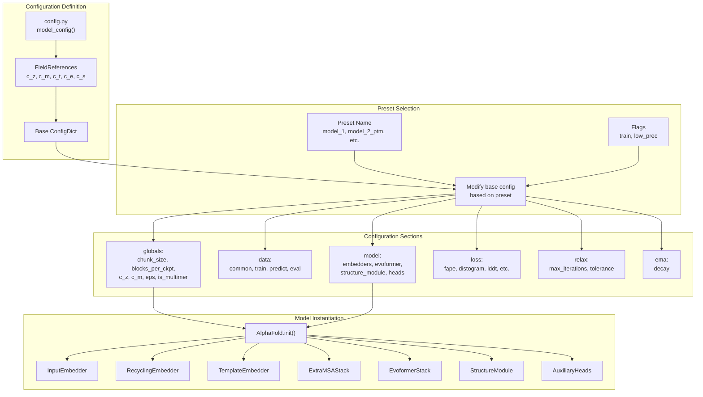
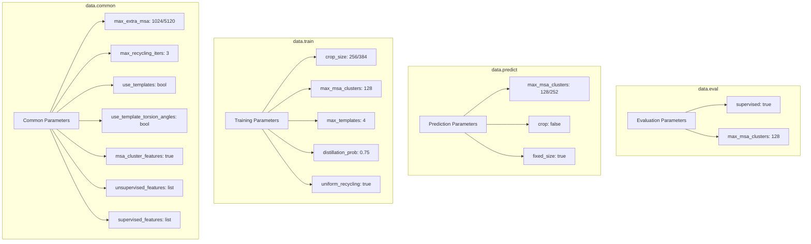
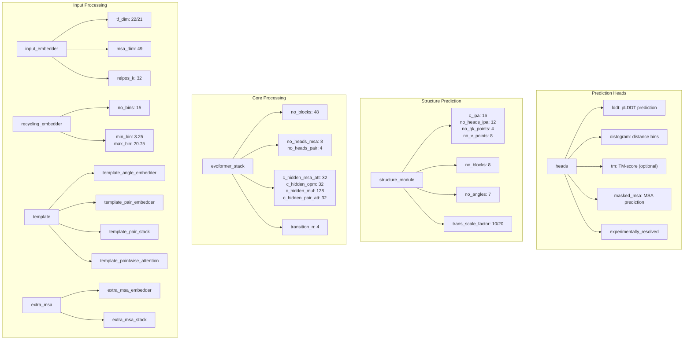
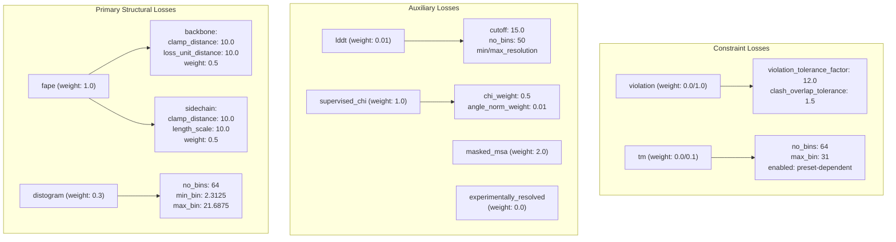
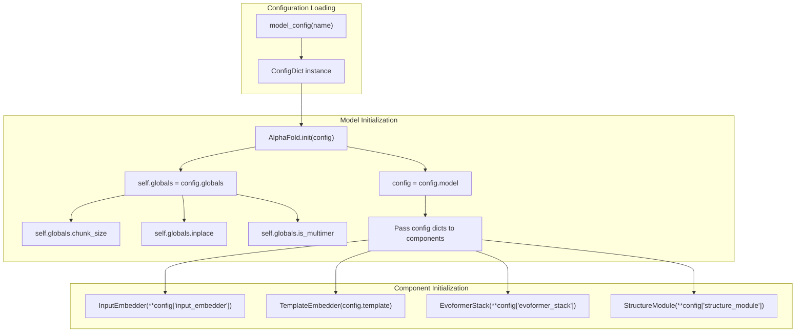

# Configuration Parameters

> **Relevant source files**
> * [LICENSE](https://github.com/hpcaitech/FastFold/blob/eba49680/LICENSE)
> * [fastfold/config.py](https://github.com/hpcaitech/FastFold/blob/eba49680/fastfold/config.py)
> * [fastfold/model/fastnn/kernel/layer_norm.py](https://github.com/hpcaitech/FastFold/blob/eba49680/fastfold/model/fastnn/kernel/layer_norm.py)
> * [fastfold/model/hub/alphafold.py](https://github.com/hpcaitech/FastFold/blob/eba49680/fastfold/model/hub/alphafold.py)
> * [fastfold/model/nn/embedders.py](https://github.com/hpcaitech/FastFold/blob/eba49680/fastfold/model/nn/embedders.py)
> * [fastfold/model/nn/template.py](https://github.com/hpcaitech/FastFold/blob/eba49680/fastfold/model/nn/template.py)
> * [fastfold/relax/relax.py](https://github.com/hpcaitech/FastFold/blob/eba49680/fastfold/relax/relax.py)
> * [fastfold/relax/utils.py](https://github.com/hpcaitech/FastFold/blob/eba49680/fastfold/relax/utils.py)

This page provides a comprehensive reference for all configuration parameters in FastFold. It documents the hierarchical configuration structure, global field references, and component-specific parameters used throughout the system. For information about model presets and how to select configurations, see [Model Presets](/hpcaitech/FastFold/3.1-model-presets).

The FastFold configuration system is built on `ml_collections.ConfigDict` and uses `FieldReference` objects to maintain consistency across related parameters. All configuration is centralized in `fastfold/config.py`(), which defines parameters for data processing, model architecture, loss functions, and optimization.

## Configuration Architecture

The configuration system uses a hierarchical structure with shared references to ensure parameter consistency across components. The following diagram illustrates how configuration flows from definition to model instantiation:

**Configuration Flow and Structure**



**Sources:** [fastfold/config.py L30-L125](https://github.com/hpcaitech/FastFold/blob/eba49680/fastfold/config.py#L30-L125)

 [fastfold/model/hub/alphafold.py L53-L105](https://github.com/hpcaitech/FastFold/blob/eba49680/fastfold/model/hub/alphafold.py#L53-L105)

## Global Parameters and Field References

Global parameters are shared across multiple components using `ml_collections.FieldReference`. This ensures consistency when the same value is used in different parts of the model.

**Field References System**

```mermaid
flowchart TD

c_z["c_z = 128<br>Pair embedding dim"]
c_m["c_m = 256<br>MSA embedding dim"]
c_t["c_t = 64<br>Template embedding dim"]
c_e["c_e = 64<br>Extra MSA embedding dim"]
c_s["c_s = 384<br>Single representation dim"]
eps["eps = 1e-8<br>Numerical stability"]
chunk["chunk_size = None<br>Chunking parameter"]
ckpt["blocks_per_ckpt = None<br>Gradient checkpointing"]
IE_cz["input_embedder.c_z"]
RE_cz["recycling_embedder.c_z"]
Evo_cz["evoformer_stack.c_z"]
IE_cm["input_embedder.c_m"]
RE_cm["recycling_embedder.c_m"]
Evo_cm["evoformer_stack.c_m"]
Evo_cs["evoformer_stack.c_s"]
SM_cs["structure_module.c_s"]
Multi["Multiple components<br>for numerical stability"]
Runtime["Runtime chunking<br>control"]
GradCkpt["Gradient checkpointing<br>control"]

c_z --> IE_cz
c_z --> RE_cz
c_z --> Evo_cz
c_m --> IE_cm
c_m --> RE_cm
c_m --> Evo_cm
c_s --> Evo_cs
c_s --> SM_cs
eps --> Multi
chunk --> Runtime
ckpt --> GradCkpt

subgraph subGraph1 ["Usage in Components"]
    IE_cz
    RE_cz
    Evo_cz
    IE_cm
    RE_cm
    Evo_cm
    Evo_cs
    SM_cs
    Multi
    Runtime
    GradCkpt
end

subgraph subGraph0 ["FieldReference Definitions"]
    c_z
    c_m
    c_t
    c_e
    c_s
    eps
    chunk
    ckpt
end
```



**Sources:** [fastfold/config.py L128-L139](https://github.com/hpcaitech/FastFold/blob/eba49680/fastfold/config.py#L128-L139)

 [fastfold/config.py L304-L314](https://github.com/hpcaitech/FastFold/blob/eba49680/fastfold/config.py#L304-L314)

### Global Configuration Parameters

| Parameter | Type | Default | Description |
| --- | --- | --- | --- |
| `blocks_per_ckpt` | int | `None` | Number of blocks per gradient checkpoint. `None` disables checkpointing. Set to `1` during training. |
| `chunk_size` | int | `None` | Controls memory-compute tradeoff by chunking operations. `None` disables chunking (inference default). |
| `c_z` | int | `128` | Pair embedding channel dimension |
| `c_m` | int | `256` | MSA embedding channel dimension |
| `c_t` | int | `64` | Template embedding channel dimension |
| `c_e` | int | `64` | Extra MSA embedding channel dimension |
| `c_s` | int | `384` | Single representation channel dimension |
| `eps` | float | `1e-8` | Small constant for numerical stability. Set to `1e-4` in low precision mode. |
| `is_multimer` | bool | `False` | Whether to use multimer-specific components |
| `inplace` | bool | - | Whether to use in-place operations for memory efficiency |

**Sources:** [fastfold/config.py L128-L139](https://github.com/hpcaitech/FastFold/blob/eba49680/fastfold/config.py#L128-L139)

 [fastfold/config.py L304-L314](https://github.com/hpcaitech/FastFold/blob/eba49680/fastfold/config.py#L304-L314)

 [fastfold/config.py L116-L123](https://github.com/hpcaitech/FastFold/blob/eba49680/fastfold/config.py#L116-L123)

## Data Configuration Parameters

Data configuration controls feature preprocessing, MSA handling, template usage, and data augmentation. The configuration varies between training, evaluation, and prediction modes.

**Data Configuration Structure**



**Sources:** [fastfold/config.py L148-L301](https://github.com/hpcaitech/FastFold/blob/eba49680/fastfold/config.py#L148-L301)

### Common Data Parameters

| Parameter | Type | Default | Description |
| --- | --- | --- | --- |
| `max_extra_msa` | int | `1024` | Maximum number of extra MSA sequences. Set to `5120` for models 1, 3, 4 and finetuning. |
| `max_recycling_iters` | int | `3` | Number of recycling iterations during inference |
| `msa_cluster_features` | bool | `True` | Whether to use MSA cluster features |
| `reduce_msa_clusters_by_max_templates` | bool | `False` | Reduce MSA clusters when templates are used (models 1, 2) |
| `resample_msa_in_recycling` | bool | `True` | Whether to resample MSA features during recycling |
| `use_templates` | bool | Varies | Whether to use template features (controlled by preset) |
| `use_template_torsion_angles` | bool | Varies | Whether to use template torsion angle features |
| `masked_msa.profile_prob` | float | `0.1` | Probability of masking with profile |
| `masked_msa.same_prob` | float | `0.1` | Probability of masking with same amino acid |
| `masked_msa.uniform_prob` | float | `0.1` | Probability of masking with uniform distribution |

**Sources:** [fastfold/config.py L148-L244](https://github.com/hpcaitech/FastFold/blob/eba49680/fastfold/config.py#L148-L244)

### Training Data Parameters

| Parameter | Type | Default | Description |
| --- | --- | --- | --- |
| `crop` | bool | `True` | Whether to crop sequences during training |
| `crop_size` | int | `256` | Sequence crop size. Set to `384` for finetuning. |
| `max_msa_clusters` | int | `128` | Maximum MSA clusters in training batch |
| `max_templates` | int | `4` | Maximum number of template structures |
| `max_template_hits` | int | `4` | Maximum template hits from search |
| `shuffle_top_k_prefiltered` | int | `20` | Shuffle top K templates before selection |
| `subsample_templates` | bool | `True` | Whether to subsample templates |
| `masked_msa_replace_fraction` | float | `0.15` | Fraction of MSA to mask |
| `clamp_prob` | float | `0.9` | Probability of clamping violations |
| `distillation_prob` | float | `0.75` | Probability of using distillation data |
| `max_distillation_msa_clusters` | int | `1000` | Maximum MSA clusters for distillation |
| `uniform_recycling` | bool | `True` | Whether to uniformly sample recycling iterations |

**Sources:** [fastfold/config.py L279-L294](https://github.com/hpcaitech/FastFold/blob/eba49680/fastfold/config.py#L279-L294)

### Prediction/Evaluation Data Parameters

| Parameter | Type | Default (Predict) | Default (Eval) | Description |
| --- | --- | --- | --- | --- |
| `fixed_size` | bool | `True` | `True` | Whether to use fixed-size features |
| `crop` | bool | `False` | `False` | Whether to crop (disabled for inference) |
| `supervised` | bool | `False` | `True` | Whether supervised features are available |
| `subsample_templates` | bool | `False` | `False` | Use top templates without subsampling |
| `max_msa_clusters` | int | `128` (monomer)`252` (multimer) | `128` | Maximum MSA clusters |
| `uniform_recycling` | bool | `False` | `False` | Fixed recycling iterations |

**Sources:** [fastfold/config.py L255-L278](https://github.com/hpcaitech/FastFold/blob/eba49680/fastfold/config.py#L255-L278)

 [fastfold/config.py L96-L101](https://github.com/hpcaitech/FastFold/blob/eba49680/fastfold/config.py#L96-L101)

## Model Configuration Parameters

Model configuration defines the architecture of all neural network components, from input embedders through the Evoformer stack to the structure module and prediction heads.

**Model Component Hierarchy**



**Sources:** [fastfold/config.py L315-L459](https://github.com/hpcaitech/FastFold/blob/eba49680/fastfold/config.py#L315-L459)

 [fastfold/config.py L535-L606](https://github.com/hpcaitech/FastFold/blob/eba49680/fastfold/config.py#L535-L606)

### Input Embedder Parameters

| Parameter | Type | Monomer | Multimer | Description |
| --- | --- | --- | --- | --- |
| `tf_dim` | int | `22` | `21` | Target feature dimension |
| `msa_dim` | int | `49` | `49` | MSA feature dimension |
| `c_z` | FieldRef | `128` | `128` | Pair embedding output dimension |
| `c_m` | FieldRef | `256` | `256` | MSA embedding output dimension |
| `relpos_k` | int | `32` | `32` | Relative position encoding window size |
| `max_relative_chain` | int | - | `2` | Maximum relative chain encoding (multimer only) |
| `max_relative_idx` | int | - | `32` | Maximum relative index (multimer only) |
| `use_chain_relative` | bool | - | `True` | Use chain-relative encoding (multimer only) |

**Sources:** [fastfold/config.py L317-L323](https://github.com/hpcaitech/FastFold/blob/eba49680/fastfold/config.py#L317-L323)

 [fastfold/config.py L536-L545](https://github.com/hpcaitech/FastFold/blob/eba49680/fastfold/config.py#L536-L545)

 [fastfold/model/nn/embedders.py L42-L81](https://github.com/hpcaitech/FastFold/blob/eba49680/fastfold/model/nn/embedders.py#L42-L81)

### Recycling Embedder Parameters

| Parameter | Type | Default | Description |
| --- | --- | --- | --- |
| `c_z` | FieldRef | `128` | Pair embedding dimension |
| `c_m` | FieldRef | `256` | MSA embedding dimension |
| `min_bin` | float | `3.25` | Minimum distogram bin (Angstroms) |
| `max_bin` | float | `20.75` | Maximum distogram bin (Angstroms) |
| `no_bins` | int | `15` | Number of distogram bins |
| `inf` | float | `1e8` | Large constant for masking |

**Sources:** [fastfold/config.py L324-L331](https://github.com/hpcaitech/FastFold/blob/eba49680/fastfold/config.py#L324-L331)

 [fastfold/model/nn/embedders.py L147-L182](https://github.com/hpcaitech/FastFold/blob/eba49680/fastfold/model/nn/embedders.py#L147-L182)

### Template Configuration Parameters

**Template Embedder Components**

| Component | Key Parameters | Description |
| --- | --- | --- |
| **template_angle_embedder** | `c_in: 57`, `c_out: c_m (256)` | Embeds template torsion angles |
| **template_pair_embedder** | `c_in: 88` (monomer)`c_dgram: 39, c_aatype: 22` (multimer) | Embeds template pair features |
| **template_pair_stack** | `no_blocks: 2`, `c_hidden_tri_att: 16`, `c_hidden_tri_mul: 64`, `no_heads: 4`, `pair_transition_n: 2`, `dropout_rate: 0.25` | Processes template pairs through triangular updates |
| **template_pointwise_attention** | `c_t: 64`, `c_z: 128`, `c_hidden: 16`, `no_heads: 4` | Aggregates template information to pair representation |

**Template Distogram**

| Parameter | Type | Default | Description |
| --- | --- | --- | --- |
| `min_bin` | float | `3.25` | Minimum distance bin (Angstroms) |
| `max_bin` | float | `50.75` | Maximum distance bin (Angstroms) |
| `no_bins` | int | `39` | Number of distance bins |

**Template Global Settings**

| Parameter | Type | Default | Description |
| --- | --- | --- | --- |
| `enabled` | bool | Varies | Whether templates are used (preset-dependent) |
| `embed_angles` | bool | Varies | Whether to embed template torsion angles |
| `use_unit_vector` | bool | `False` | Use unit vectors in pair features |
| `inf` | float | `1e5` | Large constant for masking |
| `eps` | float | `1e-8` | Numerical stability constant |

**Sources:** [fastfold/config.py L332-L374](https://github.com/hpcaitech/FastFold/blob/eba49680/fastfold/config.py#L332-L374)

 [fastfold/config.py L546-L581](https://github.com/hpcaitech/FastFold/blob/eba49680/fastfold/config.py#L546-L581)

 [fastfold/model/nn/template.py L45-L363](https://github.com/hpcaitech/FastFold/blob/eba49680/fastfold/model/nn/template.py#L45-L363)

### Extra MSA Configuration Parameters

| Parameter | Type | Default | Description |
| --- | --- | --- | --- |
| **extra_msa_embedder.c_in** | int | `25` | Input channel dimension |
| **extra_msa_embedder.c_out** | FieldRef | `c_e (64)` | Output channel dimension |
| **extra_msa_stack.c_m** | FieldRef | `c_e (64)` | MSA channel dimension |
| **extra_msa_stack.c_z** | FieldRef | `c_z (128)` | Pair channel dimension |
| **extra_msa_stack.c_hidden_msa_att** | int | `8` | Hidden dimension for MSA attention |
| **extra_msa_stack.c_hidden_opm** | int | `32` | Hidden dimension for outer product mean |
| **extra_msa_stack.c_hidden_mul** | int | `128` | Hidden dimension for triangle multiplication |
| **extra_msa_stack.c_hidden_pair_att** | int | `32` | Hidden dimension for pair attention |
| **extra_msa_stack.no_heads_msa** | int | `8` | Number of MSA attention heads |
| **extra_msa_stack.no_heads_pair** | int | `4` | Number of pair attention heads |
| **extra_msa_stack.no_blocks** | int | `4` | Number of extra MSA blocks |
| **extra_msa_stack.transition_n** | int | `4` | Transition layer expansion factor |
| **extra_msa_stack.msa_dropout** | float | `0.15` | MSA dropout rate |
| **extra_msa_stack.pair_dropout** | float | `0.25` | Pair dropout rate |
| **extra_msa_stack.clear_cache_between_blocks** | bool | `True` | Clear cache between blocks |
| **extra_msa_stack.ckpt** | bool | Depends on `blocks_per_ckpt` | Use gradient checkpointing |
| **enabled** | bool | `True` | Whether extra MSA is used |

**Sources:** [fastfold/config.py L375-L399](https://github.com/hpcaitech/FastFold/blob/eba49680/fastfold/config.py#L375-L399)

### Evoformer Stack Parameters

| Parameter | Type | Default | Description |
| --- | --- | --- | --- |
| `c_m` | FieldRef | `c_m (256)` | MSA representation dimension |
| `c_z` | FieldRef | `c_z (128)` | Pair representation dimension |
| `c_s` | FieldRef | `c_s (384)` | Single representation dimension |
| `c_hidden_msa_att` | int | `32` | Hidden dimension for MSA attention |
| `c_hidden_opm` | int | `32` | Hidden dimension for outer product mean |
| `c_hidden_mul` | int | `128` | Hidden dimension for triangle multiplication |
| `c_hidden_pair_att` | int | `32` | Hidden dimension for pair attention |
| `no_heads_msa` | int | `8` | Number of MSA attention heads |
| `no_heads_pair` | int | `4` | Number of pair attention heads |
| `no_blocks` | int | `48` | Number of Evoformer blocks |
| `transition_n` | int | `4` | Transition layer expansion factor |
| `msa_dropout` | float | `0.15` | MSA dropout rate |
| `pair_dropout` | float | `0.25` | Pair dropout rate |
| `blocks_per_ckpt` | FieldRef | `None` | Blocks per gradient checkpoint |
| `clear_cache_between_blocks` | bool | `False` | Clear cache between blocks |
| `inf` | float | `1e9` | Large constant for masking |
| `eps` | float | `1e-8` | Numerical stability constant |

**Sources:** [fastfold/config.py L400-L418](https://github.com/hpcaitech/FastFold/blob/eba49680/fastfold/config.py#L400-L418)

### Structure Module Parameters

| Parameter | Type | Monomer | Multimer | Description |
| --- | --- | --- | --- | --- |
| `c_s` | FieldRef | `384` | `384` | Single representation dimension |
| `c_z` | FieldRef | `128` | `128` | Pair representation dimension |
| `c_ipa` | int | `16` | `16` | Invariant point attention channel dimension |
| `c_resnet` | int | `128` | `128` | ResNet channel dimension |
| `no_heads_ipa` | int | `12` | `12` | Number of IPA heads |
| `no_qk_points` | int | `4` | `4` | Number of query/key points per head |
| `no_v_points` | int | `8` | `8` | Number of value points per head |
| `dropout_rate` | float | `0.1` | `0.1` | Dropout rate |
| `no_blocks` | int | `8` | `8` | Number of structure module blocks |
| `no_transition_layers` | int | `1` | `1` | Number of transition layers |
| `no_resnet_blocks` | int | `2` | `2` | Number of ResNet blocks |
| `no_angles` | int | `7` | `7` | Number of torsion angles to predict |
| `trans_scale_factor` | int | `10` | `20` | Translation scale factor (doubled for multimer) |
| `epsilon` | float | `1e-8` | `1e-8` | Numerical stability constant |
| `inf` | float | `1e5` | `1e5` | Large constant for masking |

**Sources:** [fastfold/config.py L419-L435](https://github.com/hpcaitech/FastFold/blob/eba49680/fastfold/config.py#L419-L435)

 [fastfold/config.py L99](https://github.com/hpcaitech/FastFold/blob/eba49680/fastfold/config.py#L99-L99)

### Prediction Heads Parameters

**Prediction Heads Overview**

| Head | Key Parameters | Enabled By Default | Description |
| --- | --- | --- | --- |
| **lddt** | `no_bins: 50`, `c_in: c_s (384)`, `c_hidden: 128` | ✓ | pLDDT confidence prediction |
| **distogram** | `c_z: 128`, `no_bins: 64` | ✓ | Distance distribution prediction |
| **tm** | `c_z: 128`, `no_bins: 64`, `enabled: false/true` | ✗ (✓ for PTM models) | TM-score prediction (enabled for _ptm models) |
| **masked_msa** | `c_m: 256`, `c_out: 23/22` | ✓ | Masked MSA prediction |
| **experimentally_resolved** | `c_s: 384`, `c_out: 37` | ✓ | Per-atom resolution prediction |

**Sources:** [fastfold/config.py L436-L459](https://github.com/hpcaitech/FastFold/blob/eba49680/fastfold/config.py#L436-L459)

 [fastfold/config.py L582-L605](https://github.com/hpcaitech/FastFold/blob/eba49680/fastfold/config.py#L582-L605)

## Loss Configuration Parameters

Loss configuration defines the objective functions used during training, including structural losses (FAPE, distogram), auxiliary losses (masked MSA, lddt), and constraint violations.

**Loss Components and Weights**



**Sources:** [fastfold/config.py L468-L531](https://github.com/hpcaitech/FastFold/blob/eba49680/fastfold/config.py#L468-L531)

### FAPE Loss Parameters

Frame Aligned Point Error (FAPE) is the primary structural loss function.

| Parameter | Type | Default | Description |
| --- | --- | --- | --- |
| `weight` | float | `1.0` | Overall FAPE loss weight |
| `eps` | float | `1e-4` | Numerical stability constant |
| **backbone.clamp_distance** | float | `10.0` | Maximum backbone distance (Angstroms) |
| **backbone.loss_unit_distance** | float | `10.0` | Backbone loss unit distance |
| **backbone.weight** | float | `0.5` | Backbone FAPE weight |
| **sidechain.clamp_distance** | float | `10.0` | Maximum sidechain distance (Angstroms) |
| **sidechain.length_scale** | float | `10.0` | Sidechain length scale |
| **sidechain.weight** | float | `0.5` | Sidechain FAPE weight |

**Sources:** [fastfold/config.py L482-L495](https://github.com/hpcaitech/FastFold/blob/eba49680/fastfold/config.py#L482-L495)

### Auxiliary Loss Parameters

| Loss Component | Weight | Key Parameters | Description |
| --- | --- | --- | --- |
| **distogram** | `0.3` | `no_bins: 64`, `min_bin: 2.3125`, `max_bin: 21.6875` | C_beta distance distribution |
| **lddt** | `0.01` | `no_bins: 50`, `cutoff: 15.0`, `min_resolution: 0.1`, `max_resolution: 3.0` | Local distance difference test |
| **masked_msa** | `2.0` | `eps: 1e-8` | Masked MSA reconstruction |
| **supervised_chi** | `1.0` | `chi_weight: 0.5`, `angle_norm_weight: 0.01` | Sidechain torsion angle supervision |
| **experimentally_resolved** | `0.0` | `min_resolution: 0.1`, `max_resolution: 3.0` | Per-atom experimental resolution (disabled by default) |
| **violation** | `0.0` (initial)`1.0` (finetuning) | `violation_tolerance_factor: 12.0`, `clash_overlap_tolerance: 1.5` | Structural constraint violations |
| **tm** | `0.0` (standard)`0.1` (PTM models) | `no_bins: 64`, `max_bin: 31`, `enabled: preset-dependent` | TM-score prediction (enabled for _ptm presets) |

**Sources:** [fastfold/config.py L469-L531](https://github.com/hpcaitech/FastFold/blob/eba49680/fastfold/config.py#L469-L531)

## Additional Configuration

### Relaxation Parameters

Energy minimization parameters for Amber relaxation (see [Structure Refinement with Amber](/hpcaitech/FastFold/5.3-structure-refinement-with-amber) for usage details).

| Parameter | Type | Default | Description |
| --- | --- | --- | --- |
| `max_iterations` | int | `0` | Maximum L-BFGS iterations. `0` means no limit. |
| `tolerance` | float | `2.39` | Energy tolerance (kcal/mol) for L-BFGS convergence |
| `stiffness` | float | `10.0` | Spring constant (kcal/mol/Ų) for restraining potential |
| `max_outer_iterations` | int | `20` | Maximum violation-informed relaxation iterations |
| `exclude_residues` | list | `[]` | Residues to exclude from restraints (zero-indexed) |

**Sources:** [fastfold/config.py L461-L467](https://github.com/hpcaitech/FastFold/blob/eba49680/fastfold/config.py#L461-L467)

 [fastfold/relax/relax.py L27-L59](https://github.com/hpcaitech/FastFold/blob/eba49680/fastfold/relax/relax.py#L27-L59)

### EMA Parameters

Exponential Moving Average for model weights during training.

| Parameter | Type | Default | Description |
| --- | --- | --- | --- |
| `decay` | float | `0.999` | EMA decay factor |

**Sources:** [fastfold/config.py L531](https://github.com/hpcaitech/FastFold/blob/eba49680/fastfold/config.py#L531-L531)

## Configuration Usage Examples

### Accessing Configuration in Model Code

The following diagram shows how configuration flows from the config file to model components:

**Configuration Access Patterns**



**Sources:** [fastfold/model/hub/alphafold.py L53-L105](https://github.com/hpcaitech/FastFold/blob/eba49680/fastfold/model/hub/alphafold.py#L53-L105)

### Runtime Configuration Access

Configuration parameters are accessed at runtime for controlling execution:

```markdown
# In AlphaFold.iteration() - accessing chunk_sizetemplate_embeds = self.template_embedder(    template_feats,    z,    pair_mask.to(dtype=z.dtype),    no_batch_dims,    chunk_size=self.globals.chunk_size,  # Runtime chunking control) # In AlphaFold.iteration() - accessing inplace flagif self.globals.inplace:    extra_msa_feat = [extra_msa_feat]    z = [z]    z = self.extra_msa_stack.inplace(...)else:    z = self.extra_msa_stack(...)
```

**Sources:** [fastfold/model/hub/alphafold.py L275-L362](https://github.com/hpcaitech/FastFold/blob/eba49680/fastfold/model/hub/alphafold.py#L275-L362)

### Preset-Based Configuration Modification

Different presets modify the base configuration:

```markdown
# From model_config() functionif name == "finetuning":    c.data.common.max_extra_msa = 5120    c.data.train.crop_size = 384    c.data.train.max_msa_clusters = 512    c.loss.violation.weight = 1. elif name == "model_1_ptm":    c.data.common.max_extra_msa = 5120    c.model.template.enabled = True    c.model.heads.tm.enabled = True    c.loss.tm.weight = 0.1 elif "multimer" in name:    c.globals.is_multimer = True    c.data.predict.max_msa_clusters = 252    c.model.structure_module.trans_scale_factor = 20
```

**Sources:** [fastfold/config.py L32-L113](https://github.com/hpcaitech/FastFold/blob/eba49680/fastfold/config.py#L32-L113)

### Training vs Inference Configuration

Configuration is modified based on execution mode:

```markdown
# From model_config() functionif train:    c.globals.blocks_per_ckpt = 1      # Enable gradient checkpointing    c.globals.chunk_size = None         # Disable chunking for training if low_prec:    c.globals.eps = 1e-4                # Larger epsilon for FP16    set_inf(c, 1e4)                     # Smaller inf constant
```

**Sources:** [fastfold/config.py L115-L123](https://github.com/hpcaitech/FastFold/blob/eba49680/fastfold/config.py#L115-L123)

## Configuration Parameter Summary

The complete configuration hierarchy can be summarized as:

```mermaid
flowchart TD

Config["config: ConfigDict"]
Globals["globals: 9 parameters"]
Data["data: 4 modes × ~15 parameters"]
Model["model: 8 components"]
Loss["loss: 8 loss types"]
Relax["relax: 5 parameters"]
EMA["ema: 1 parameter"]
G_Dims["Dimensions: c_z, c_m, c_t, c_e, c_s"]
G_Control["Control: chunk_size, blocks_per_ckpt, inplace"]
G_Flags["Flags: is_multimer, eps"]
D_Common["common: templates, MSA, recycling"]
D_Train["train: crop, distillation, augmentation"]
D_Predict["predict: inference settings"]
D_Eval["eval: evaluation settings"]
M_Input["input_embedder, recycling_embedder"]
M_Template["template: 4 sub-components"]
M_ExtraMSA["extra_msa: 2 sub-components"]
M_Evoformer["evoformer_stack: core processing"]
M_Structure["structure_module: 3D prediction"]
M_Heads["heads: 5 prediction heads"]
L_Structural["FAPE, distogram"]
L_Auxiliary["lddt, masked_msa, supervised_chi"]
L_Optional["tm, violation, experimentally_resolved"]

Config --> Globals
Config --> Data
Config --> Model
Config --> Loss
Config --> Relax
Config --> EMA
Globals --> G_Dims
Globals --> G_Control
Globals --> G_Flags
Data --> D_Common
Data --> D_Train
Data --> D_Predict
Data --> D_Eval
Model --> M_Input
Model --> M_Template
Model --> M_ExtraMSA
Model --> M_Evoformer
Model --> M_Structure
Model --> M_Heads
Loss --> L_Structural
Loss --> L_Auxiliary
Loss --> L_Optional
```



**Sources:** [fastfold/config.py L146-L533](https://github.com/hpcaitech/FastFold/blob/eba49680/fastfold/config.py#L146-L533)

This configuration system provides fine-grained control over all aspects of model architecture, training, and inference while maintaining parameter consistency through the FieldReference mechanism.