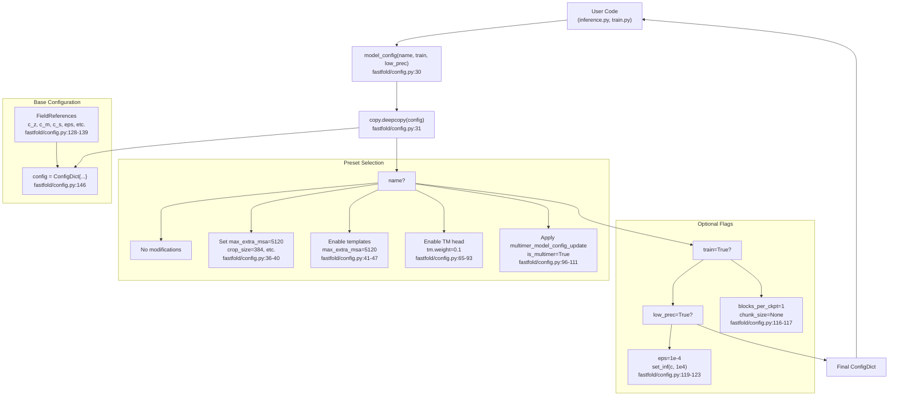

# Configuration System

> **Relevant source files**
> * [LICENSE](https://github.com/hpcaitech/FastFold/blob/eba49680/LICENSE)
> * [README.md](https://github.com/hpcaitech/FastFold/blob/eba49680/README.md?plain=1)
> * [environment.yml](https://github.com/hpcaitech/FastFold/blob/eba49680/environment.yml)
> * [fastfold/config.py](https://github.com/hpcaitech/FastFold/blob/eba49680/fastfold/config.py)
> * [fastfold/model/fastnn/kernel/layer_norm.py](https://github.com/hpcaitech/FastFold/blob/eba49680/fastfold/model/fastnn/kernel/layer_norm.py)
> * [fastfold/relax/relax.py](https://github.com/hpcaitech/FastFold/blob/eba49680/fastfold/relax/relax.py)
> * [fastfold/relax/utils.py](https://github.com/hpcaitech/FastFold/blob/eba49680/fastfold/relax/utils.py)
> * [inference.py](https://github.com/hpcaitech/FastFold/blob/eba49680/inference.py)

FastFold's configuration system provides a structured, preset-based approach to defining model architectures, training parameters, data processing settings, and loss functions. It uses the `ml_collections` library to create hierarchical configuration dictionaries with shared parameter references that propagate changes across the entire configuration tree.

For information about using configurations during inference, see [Inference Pipeline](/hpcaitech/FastFold/5-inference-pipeline). For training-specific configuration usage, see [Training System](/hpcaitech/FastFold/7-training-system).

---

## System Architecture

The configuration system is built on three core components: **FieldReferences** for shared parameters, a **base configuration dictionary** with complete settings, and the **model_config() function** that applies preset-specific modifications.

**Configuration Generation Flow**



Sources: [fastfold/config.py L1-L607](https://github.com/hpcaitech/FastFold/blob/eba49680/fastfold/config.py#L1-L607)

---

## FieldReference System

FieldReferences enable centralized parameter management by creating shared references that automatically propagate across the configuration. When a FieldReference is updated, all locations that reference it receive the new value.

**FieldReference Propagation Mechanism**

```mermaid
flowchart TD

c_z["c_z = FieldReference(128)<br>fastfold/config.py:128"]
c_m["c_m = FieldReference(256)<br>fastfold/config.py:129"]
c_s["c_s = FieldReference(384)<br>fastfold/config.py:132"]
eps["eps = FieldReference(1e-8)<br>fastfold/config.py:137"]
chunk_size["chunk_size = FieldReference(None)<br>fastfold/config.py:134"]
GlobalsZ["globals.c_z: c_z<br>fastfold/config.py:307"]
GlobalsM["globals.c_m: c_m<br>fastfold/config.py:308"]
GlobalsS["globals.c_s: c_s<br>fastfold/config.py:311"]
GlobalsEps["globals.eps: eps<br>fastfold/config.py:312"]
GlobalsChunk["globals.chunk_size: chunk_size<br>fastfold/config.py:306"]
InputEmb["input_embedder.c_z: c_z<br>fastfold/config.py:320"]
InputEmbM["input_embedder.c_m: c_m<br>fastfold/config.py:321"]
EvoZ["evoformer_stack.c_z: c_z<br>fastfold/config.py:402"]
EvoM["evoformer_stack.c_m: c_m<br>fastfold/config.py:401"]
StructS["structure_module.c_s: c_s<br>fastfold/config.py:420"]
LossEps["distogram.eps: eps<br>fastfold/config.py:473"]
LossEps2["lddt.eps: eps<br>fastfold/config.py:501"]

c_z --> GlobalsZ
c_z --> InputEmb
c_z --> EvoZ
c_m --> GlobalsM
c_m --> InputEmbM
c_m --> EvoM
c_s --> GlobalsS
c_s --> StructS
eps --> GlobalsEps
eps --> LossEps
eps --> LossEps2
chunk_size --> GlobalsChunk

subgraph subGraph3 ["Usage in loss"]
    LossEps
    LossEps2
end

subgraph subGraph2 ["Usage in model components"]
    InputEmb
    InputEmbM
    EvoZ
    EvoM
    StructS
end

subgraph subGraph1 ["Usage in globals"]
    GlobalsZ
    GlobalsM
    GlobalsS
    GlobalsEps
    GlobalsChunk
end

subgraph subGraph0 ["FieldReference Definitions"]
    c_z
    c_m
    c_s
    eps
    chunk_size
end
```



**Defined FieldReferences**

| FieldReference | Default Value | Type | Purpose |
| --- | --- | --- | --- |
| `c_z` | 128 | int | Pair representation channel dimension |
| `c_m` | 256 | int | MSA representation channel dimension |
| `c_t` | 64 | int | Template embedding channel dimension |
| `c_e` | 64 | int | Extra MSA embedding channel dimension |
| `c_s` | 384 | int | Single representation channel dimension |
| `blocks_per_ckpt` | None | int | Gradient checkpointing frequency |
| `chunk_size` | None | int | Memory optimization chunk size |
| `aux_distogram_bins` | 64 | int | Auxiliary distogram prediction bins |
| `tm_enabled` | False | bool | Enable TM-score prediction head |
| `eps` | 1e-8 | float | Numerical stability epsilon |
| `templates_enabled` | True | bool | Enable template embeddings |
| `embed_template_torsion_angles` | True | bool | Embed template torsion angles |

Sources: [fastfold/config.py L128-L139](https://github.com/hpcaitech/FastFold/blob/eba49680/fastfold/config.py#L128-L139)

---

## Base Configuration Structure

The base configuration dictionary contains six major sections, each controlling a different aspect of the system.

```mermaid
flowchart TD

RootConfig["config = ConfigDict<br>fastfold/config.py:146"]
Data["data<br>fastfold/config.py:148-301"]
Globals["globals<br>fastfold/config.py:304-314"]
Model["model<br>fastfold/config.py:315-460"]
Relax["relax<br>fastfold/config.py:461-467"]
Loss["loss<br>fastfold/config.py:468-530"]
EMA["ema<br>fastfold/config.py:531"]
DataCommon["common<br>Feature shapes, MSA params<br>fastfold/config.py:149-244"]
DataSupervised["supervised<br>Ground truth features<br>fastfold/config.py:245-254"]
DataPredict["predict<br>Inference settings<br>fastfold/config.py:255-266"]
DataEval["eval<br>Evaluation settings<br>fastfold/config.py:267-278"]
DataTrain["train<br>Training settings<br>fastfold/config.py:279-294"]
DataModule["data_module<br>DataLoader params<br>fastfold/config.py:295-301"]
GlobalBlocksCkpt["blocks_per_ckpt: FieldRef"]
GlobalChunk["chunk_size: FieldRef"]
GlobalChannels["c_z, c_m, c_t, c_e, c_s"]
GlobalEps["eps: FieldRef"]
GlobalMultimer["is_multimer: False"]
ModelInput["input_embedder<br>fastfold/config.py:317-323"]
ModelRecycle["recycling_embedder<br>fastfold/config.py:324-331"]
ModelTemplate["template<br>fastfold/config.py:332-374"]
ModelExtraMSA["extra_msa<br>fastfold/config.py:375-399"]
ModelEvo["evoformer_stack<br>fastfold/config.py:400-418"]
ModelStruct["structure_module<br>fastfold/config.py:419-435"]
ModelHeads["heads (lddt, distogram, tm, etc.)<br>fastfold/config.py:436-459"]
LossDistogram["distogram: 0.3 weight"]
LossFAPE["fape: 1.0 weight"]
LossLDDT["lddt: 0.01 weight"]
LossMaskedMSA["masked_msa: 2.0 weight"]
LossChi["supervised_chi: 1.0 weight"]
LossViolation["violation: 0.0 weight"]
LossTM["tm: 0.0 weight (enabled by preset)"]

RootConfig --> Data
RootConfig --> Globals
RootConfig --> Model
RootConfig --> Relax
RootConfig --> Loss
RootConfig --> EMA
Data --> DataCommon
Data --> DataSupervised
Data --> DataPredict
Data --> DataEval
Data --> DataTrain
Data --> DataModule
Globals --> GlobalBlocksCkpt
Globals --> GlobalChunk
Globals --> GlobalChannels
Globals --> GlobalEps
Globals --> GlobalMultimer
Model --> ModelInput
Model --> ModelRecycle
Model --> ModelTemplate
Model --> ModelExtraMSA
Model --> ModelEvo
Model --> ModelStruct
Model --> ModelHeads
Loss --> LossDistogram
Loss --> LossFAPE
Loss --> LossLDDT
Loss --> LossMaskedMSA
Loss --> LossChi
Loss --> LossViolation
Loss --> LossTM

subgraph LossSection ["Loss Components"]
    LossDistogram
    LossFAPE
    LossLDDT
    LossMaskedMSA
    LossChi
    LossViolation
    LossTM
end

subgraph ModelSection ["Model Architecture"]
    ModelInput
    ModelRecycle
    ModelTemplate
    ModelExtraMSA
    ModelEvo
    ModelStruct
    ModelHeads
end

subgraph GlobalsSection ["Global Parameters"]
    GlobalBlocksCkpt
    GlobalChunk
    GlobalChannels
    GlobalEps
    GlobalMultimer
end

subgraph DataSection ["Data Configuration"]
    DataCommon
    DataSupervised
    DataPredict
    DataEval
    DataTrain
    DataModule
end
```



Sources: [fastfold/config.py L146-L533](https://github.com/hpcaitech/FastFold/blob/eba49680/fastfold/config.py#L146-L533)

---

## Model Presets

The `model_config()` function supports 18 named presets that modify the base configuration for specific use cases. Each preset follows AlphaFold's published model variants.

**Preset Decision Tree**

```mermaid
flowchart TD

Start["model_config(name)"]
CheckName["name value?"]
InitTrain["Initial Training<br>Base config unchanged<br>fastfold/config.py:32-34"]
Finetune["Finetuning<br>max_extra_msa=5120<br>crop_size=384<br>max_msa_clusters=512<br>violation.weight=1.0<br>fastfold/config.py:35-40"]
M1["Model 1<br>Templates enabled<br>max_extra_msa=5120<br>reduce_clusters_by_templates=True<br>fastfold/config.py:41-47"]
M2["Model 2<br>Templates enabled<br>reduce_clusters_by_templates=True<br>(no max_extra_msa change)<br>fastfold/config.py:48-53"]
M3["Model 3<br>Templates disabled<br>max_extra_msa=5120<br>fastfold/config.py:54-57"]
M4["Model 4<br>Templates disabled<br>max_extra_msa=5120<br>fastfold/config.py:58-61"]
M5["Model 5<br>Templates disabled<br>(no max_extra_msa change)<br>fastfold/config.py:62-64"]
PTM["PTM Variants<br>Same as base model_X<br>+ TM head enabled<br>+ tm.weight=0.1<br>fastfold/config.py:65-93"]
Multimer["Multimer Models<br>is_multimer=True<br>max_msa_clusters=252<br>trans_scale_factor=20<br>Apply multimer_model_config_update<br>Add unsupervised features<br>fastfold/config.py:96-111"]
RelaxOnly["Relax Only<br>Base config unchanged<br>fastfold/config.py:94-95"]
Error["ValueError<br>'Invalid model name'<br>fastfold/config.py:113"]

Start --> CheckName
CheckName --> InitTrain
CheckName --> Finetune
CheckName --> M1
CheckName --> M2
CheckName --> M3
CheckName --> M4
CheckName --> M5
CheckName --> PTM
CheckName --> Multimer
CheckName --> RelaxOnly
CheckName --> Error
```



**Model Preset Summary**

| Preset Name | Templates | Max Extra MSA | TM Head | Multimer | Notes |
| --- | --- | --- | --- | --- | --- |
| `initial_training` | ✓ | 1024 | ✗ | ✗ | Base configuration |
| `finetuning` | ✓ | 5120 | ✗ | ✗ | Larger MSA, violation loss enabled |
| `model_1` | ✓ | 5120 | ✗ | ✗ | AlphaFold Model 1.1.1 |
| `model_2` | ✓ | 1024 | ✗ | ✗ | AlphaFold Model 1.1.2 |
| `model_3` | ✗ | 5120 | ✗ | ✗ | AlphaFold Model 1.2.1 |
| `model_4` | ✗ | 5120 | ✗ | ✗ | AlphaFold Model 1.2.2 |
| `model_5` | ✗ | 1024 | ✗ | ✗ | AlphaFold Model 1.2.3 |
| `model_1_ptm` | ✓ | 5120 | ✓ | ✗ | Model 1 + pTM prediction |
| `model_2_ptm` | ✓ | 1024 | ✓ | ✗ | Model 2 + pTM prediction |
| `model_3_ptm` | ✗ | 5120 | ✓ | ✗ | Model 3 + pTM prediction |
| `model_4_ptm` | ✗ | 5120 | ✓ | ✗ | Model 4 + pTM prediction |
| `model_5_ptm` | ✗ | 1024 | ✓ | ✗ | Model 5 + pTM prediction |
| `model_X_multimer` | ✓ | varies | ✓ | ✓ | Multimer variant (any X) |

**Multimer-Specific Modifications**

When `"multimer"` appears in the model name, the following changes are applied in addition to base model settings:

```markdown
# Key multimer configuration updates (fastfold/config.py:96-111)c.globals.is_multimer = Truec.data.predict.max_msa_clusters = 252  # vs 128 for monomerc.model.structure_module.trans_scale_factor = 20  # vs 10 for monomer # Multimer-specific model architecture (fastfold/config.py:535-606)- Input embedder: uses chain-relative positional encoding- Template embedder: separate single/pair template embedders- Unsupervised features: adds asym_id, entity_id, sym_id for chain tracking- TM head: always enabled for multimer
```

Sources: [fastfold/config.py L30-L125](https://github.com/hpcaitech/FastFold/blob/eba49680/fastfold/config.py#L30-L125)

 [fastfold/config.py L535-L606](https://github.com/hpcaitech/FastFold/blob/eba49680/fastfold/config.py#L535-L606)

---

## Configuration Usage Patterns

**Basic Configuration Retrieval**

```javascript
from fastfold.config import model_config # Get configuration for a specific modelconfig = model_config("model_1") # Training mode: disables chunking, enables gradient checkpointingconfig = model_config("model_1", train=True) # Low precision mode: reduces epsilon, sets inf to 1e4config = model_config("model_1", low_prec=True)
```

Sources: [inference.py L129](https://github.com/hpcaitech/FastFold/blob/eba49680/inference.py#L129-L129)

 [fastfold/config.py L30-L125](https://github.com/hpcaitech/FastFold/blob/eba49680/fastfold/config.py#L30-L125)

**Runtime Configuration Modification**

```javascript
# Modify chunk size for memory optimization (inference.py:130-131)if args.chunk_size:    config.globals.chunk_size = args.chunk_size # Enable/disable features (inference.py:136-137)config.globals.inplace = args.inplaceconfig.globals.is_multimer = args.model_preset == 'multimer' # Set triangle multiplication mode (inference.py:133-134)if "v3" in args.param_path:    from fastfold.model.nn.triangular_multiplicative_update import set_fused_triangle_multiplication    set_fused_triangle_multiplication()
```

Sources: [inference.py L129-L145](https://github.com/hpcaitech/FastFold/blob/eba49680/inference.py#L129-L145)

**Accessing Configuration Values**

```markdown
# Access nested configuration valuesmsa_dim = config.model.input_embedder.msa_dim  # 49c_z = config.globals.c_z  # 128 (FieldReference value)num_blocks = config.model.evoformer_stack.no_blocks  # 48 # Access data processing settingsmax_templates = config.data.predict.max_templates  # 4max_msa_clusters = config.data.predict.max_msa_clusters  # 128 or 252 # Access loss weightsfape_weight = config.loss.fape.weight  # 1.0distogram_weight = config.loss.distogram.weight  # 0.3
```

---

## Customization and Extension

**Creating Custom Presets**

To add a new model preset, extend the `model_config()` function:

```markdown
# In fastfold/config.py, add a new elif branchelif name == "custom_model":    c.data.common.max_extra_msa = 2048    c.model.evoformer_stack.no_blocks = 24    c.loss.distogram.weight = 0.5    # Additional customizations...
```

**Defining New FieldReferences**

```css
# Add new shared parameter (fastfold/config.py:128-139 pattern)custom_dim = mlc.FieldReference(512, field_type=int) # Use in configurationconfig = mlc.ConfigDict({    "globals": {        "custom_dim": custom_dim,    },    "model": {        "custom_module": {            "c_custom": custom_dim,  # References same value        }    }})
```

**Configuration Validation**

The configuration system performs basic validation through ml_collections:

* Type checking via `field_type` parameter in FieldReferences
* Immutability options via ConfigDict settings
* Nested structure enforcement

However, semantic validation (e.g., ensuring crop_size ≤ max sequence length) must be performed at runtime by the consuming code.

Sources: [fastfold/config.py L128-L139](https://github.com/hpcaitech/FastFold/blob/eba49680/fastfold/config.py#L128-L139)

 [fastfold/config.py L30-L125](https://github.com/hpcaitech/FastFold/blob/eba49680/fastfold/config.py#L30-L125)

---

## Configuration Sections Reference

### Data Configuration

The `data` section controls all aspects of feature generation and data preprocessing.

**Common Settings** ([fastfold/config.py L149-L244](https://github.com/hpcaitech/FastFold/blob/eba49680/fastfold/config.py#L149-L244)

):

* `feat`: Dictionary of expected feature shapes with placeholders (NUM_RES, NUM_MSA_SEQ, etc.)
* `masked_msa`: MSA masking probabilities for training
* `max_extra_msa`: Maximum extra MSA sequences (1024 default, 5120 for some models)
* `max_recycling_iters`: Number of recycling iterations (3)
* `template_features`: List of template feature names to extract
* `unsupervised_features`: List of features available without ground truth
* `use_templates`: Whether to use template information
* `use_template_torsion_angles`: Whether to embed template torsions

**Mode-Specific Settings**:

* `predict` ([fastfold/config.py L255-L266](https://github.com/hpcaitech/FastFold/blob/eba49680/fastfold/config.py#L255-L266) ): Inference settings with no cropping
* `eval` ([fastfold/config.py L267-L278](https://github.com/hpcaitech/FastFold/blob/eba49680/fastfold/config.py#L267-L278) ): Evaluation with supervision
* `train` ([fastfold/config.py L279-L294](https://github.com/hpcaitech/FastFold/blob/eba49680/fastfold/config.py#L279-L294) ): Training with cropping, subsample templates

### Globals Configuration

The `globals` section ([fastfold/config.py L304-L314](https://github.com/hpcaitech/FastFold/blob/eba49680/fastfold/config.py#L304-L314)

) contains system-wide parameters:

| Parameter | Type | Purpose |
| --- | --- | --- |
| `blocks_per_ckpt` | int/None | Gradient checkpointing frequency (None = no checkpointing) |
| `chunk_size` | int/None | Memory optimization chunk size (None = no chunking) |
| `c_z` | int | Pair representation channels (128) |
| `c_m` | int | MSA representation channels (256) |
| `c_t` | int | Template embedding channels (64) |
| `c_e` | int | Extra MSA embedding channels (64) |
| `c_s` | int | Single representation channels (384) |
| `eps` | float | Numerical stability epsilon (1e-8) |
| `is_multimer` | bool | Multimer mode flag (False) |

### Model Configuration

The `model` section ([fastfold/config.py L315-L460](https://github.com/hpcaitech/FastFold/blob/eba49680/fastfold/config.py#L315-L460)

) defines the neural network architecture:

* **input_embedder**: Target features and MSA embedding parameters
* **recycling_embedder**: Recycling embedding with distance bins
* **template**: Template processing with distogram, angle, and pair embedders
* **extra_msa**: Extra MSA stack configuration (4 blocks)
* **evoformer_stack**: Main Evoformer with 48 blocks, attention heads, dropout
* **structure_module**: IPA-based structure prediction (8 blocks, 12 heads)
* **heads**: Prediction heads (lddt, distogram, masked_msa, experimentally_resolved, tm)

### Loss Configuration

The `loss` section ([fastfold/config.py L468-L530](https://github.com/hpcaitech/FastFold/blob/eba49680/fastfold/config.py#L468-L530)

) defines training objectives and their weights:

| Loss Component | Default Weight | Purpose |
| --- | --- | --- |
| `distogram` | 0.3 | Distance distribution prediction |
| `fape` | 1.0 | Frame aligned point error (backbone + sidechain) |
| `lddt` | 0.01 | Local distance difference test |
| `masked_msa` | 2.0 | Masked MSA language modeling |
| `supervised_chi` | 1.0 | Sidechain torsion angle supervision |
| `violation` | 0.0 | Structural violation penalty (enabled for finetuning) |
| `tm` | 0.0 | TM-score prediction (enabled for PTM models) |
| `experimentally_resolved` | 0.0 | Experimental resolution prediction |

### Relax Configuration

The `relax` section ([fastfold/config.py L461-L467](https://github.com/hpcaitech/FastFold/blob/eba49680/fastfold/config.py#L461-L467)

) controls Amber relaxation:

* `max_iterations`: Maximum L-BFGS iterations (0 = no limit)
* `tolerance`: Energy tolerance in kcal/mol (2.39)
* `stiffness`: Restraint spring constant in kcal/mol Ų (10.0)
* `max_outer_iterations`: Violation-informed relax iterations (20)
* `exclude_residues`: Residues to exclude from restraints ([])

Sources: [fastfold/config.py L146-L533](https://github.com/hpcaitech/FastFold/blob/eba49680/fastfold/config.py#L146-L533)

 [fastfold/relax/relax.py L24-L92](https://github.com/hpcaitech/FastFold/blob/eba49680/fastfold/relax/relax.py#L24-L92)

---

## Advanced Topics

### Training vs Inference Configurations

When `train=True` is passed to `model_config()`, specific changes are made:

```markdown
# Training mode modifications (fastfold/config.py:116-117)c.globals.blocks_per_ckpt = 1      # Enable gradient checkpointing per blockc.globals.chunk_size = None        # Disable chunking (full batch processing)
```

This ensures gradient computation is memory-efficient during training while allowing full-speed inference with chunking.

### Low Precision Mode

When `low_prec=True` is specified, the configuration adapts for reduced precision:

```markdown
# Low precision modifications (fastfold/config.py:119-123)c.globals.eps = 1e-4               # Larger epsilon for stabilityset_inf(c, 1e4)                    # Reduce infinity values to prevent overflow
```

The `set_inf()` function recursively replaces all `"inf"` fields in the configuration with the specified value to prevent numerical overflow in lower precision arithmetic.

### Configuration Inheritance

The system uses a deep copy pattern to ensure preset modifications don't affect the base configuration:

```python
def model_config(name, train=False, low_prec=False):    c = copy.deepcopy(config)      # Create independent copy    # Apply modifications...    return c
```

This allows multiple configurations to coexist without interference.

Sources: [fastfold/config.py L115-L125](https://github.com/hpcaitech/FastFold/blob/eba49680/fastfold/config.py#L115-L125)

 [fastfold/config.py L22-L28](https://github.com/hpcaitech/FastFold/blob/eba49680/fastfold/config.py#L22-L28)