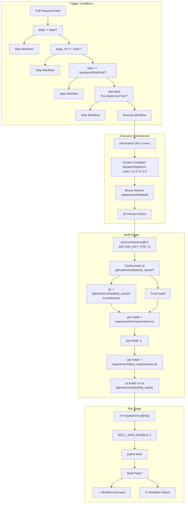
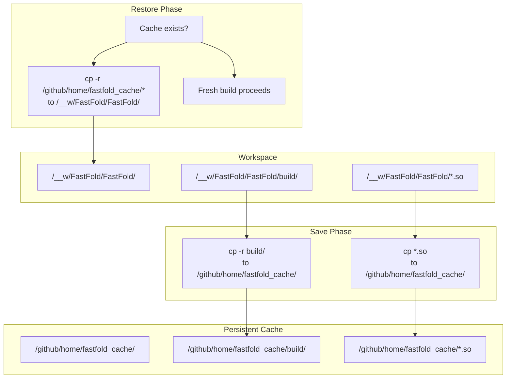
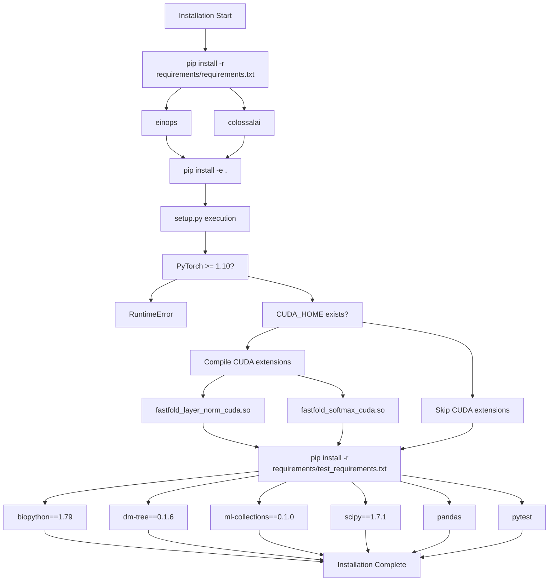
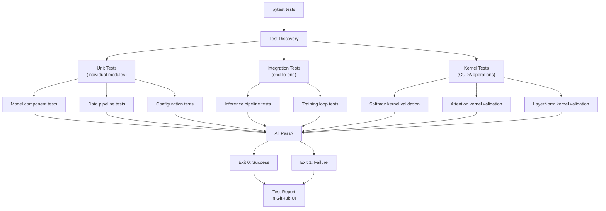

# Continuous Integration

> **Relevant source files**
> * [.github/workflows/build.yml](https://github.com/hpcaitech/FastFold/blob/eba49680/.github/workflows/build.yml)
> * [requirements/requirements.txt](https://github.com/hpcaitech/FastFold/blob/eba49680/requirements/requirements.txt)
> * [requirements/test_requirements.txt](https://github.com/hpcaitech/FastFold/blob/eba49680/requirements/test_requirements.txt)

## Purpose and Scope

This document describes FastFold's continuous integration (CI) system implemented using GitHub Actions. The CI pipeline automates build verification, dependency installation, CUDA extension compilation, and test execution for pull requests. The system runs on self-hosted GPU runners to validate changes that require CUDA functionality.

For information about the build system itself, see [Build System](/hpcaitech/FastFold/10.1-build-system). For details on the test suite, see [Testing Framework](/hpcaitech/FastFold/10.2-testing-framework). For Docker-based deployment, see [Docker Deployment](/hpcaitech/FastFold/10.4-docker-deployment).

---

## Workflow Overview

FastFold's CI is implemented as a single GitHub Actions workflow defined in `.github/workflows/build.yml`. The workflow provides automated validation of pull requests through a three-stage pipeline: environment setup, dependency installation with caching, and test execution.

**CI Pipeline Architecture**



**Sources:** [.github/workflows/build.yml L1-L40](https://github.com/hpcaitech/FastFold/blob/eba49680/.github/workflows/build.yml#L1-L40)

---

## Workflow Triggers and Conditions

The CI workflow uses a gated execution model with multiple conditions to control when builds run. This approach conserves GPU resources by limiting execution to ready-for-review pull requests.

### Trigger Configuration

The workflow triggers on `pull_request` events with specific types:

```yaml
on:   pull_request:    types: [synchronize, labeled]
```

* **synchronize**: Triggered when new commits are pushed to the PR branch
* **labeled**: Triggered when labels are added to the PR

**Sources:** [.github/workflows/build.yml L3-L5](https://github.com/hpcaitech/FastFold/blob/eba49680/.github/workflows/build.yml#L3-L5)

### Execution Conditions

All conditions must be satisfied for the workflow to execute:

| Condition | Expression | Purpose |
| --- | --- | --- |
| **Not Draft** | `github.event.pull_request.draft == false` | Skip draft PRs not ready for review |
| **Target Branch** | `github.base_ref == 'main'` | Only validate merges to main branch |
| **Repository** | `github.event.pull_request.base.repo.full_name == 'hpcaitech/FastFold'` | Prevent execution on forks |
| **Label Gating** | `contains(github.event.pull_request.labels.*.name, 'Run Build and Test')` | Explicit opt-in via label |

The label-based gating mechanism allows maintainers to control which PRs trigger GPU-based builds, preventing resource waste on trivial changes (e.g., documentation updates).

**Sources:** [.github/workflows/build.yml L10-L14](https://github.com/hpcaitech/FastFold/blob/eba49680/.github/workflows/build.yml#L10-L14)

---

## Execution Environment

### Self-Hosted GPU Runner

The workflow executes on a self-hosted runner with GPU access:

```
runs-on: [self-hosted, gpu]
```

Self-hosted runners are required because:

* CUDA extension compilation requires NVCC compiler
* Tests validate GPU-specific kernels (softmax, attention, layer norm)
* GitHub-hosted runners do not provide GPU access

**Sources:** [.github/workflows/build.yml L15](https://github.com/hpcaitech/FastFold/blob/eba49680/.github/workflows/build.yml#L15-L15)

### Docker Container Configuration

The workflow runs inside a pre-configured Docker container:

```yaml
container:  image: hpcaitech/pytorch-cuda:1.12.0-11.3.0  options: --gpus all --rm -v /data/scratch/fastfold:/data/scratch/fastfold
```

**Container Specifications:**

| Configuration | Value | Purpose |
| --- | --- | --- |
| **Base Image** | `hpcaitech/pytorch-cuda:1.12.0-11.3.0` | PyTorch 1.12.0 + CUDA 11.3.0 environment |
| **GPU Access** | `--gpus all` | Expose all host GPUs to container |
| **Cleanup** | `--rm` | Remove container after execution |
| **Volume Mount** | `/data/scratch/fastfold` | Access test data and cached artifacts |

The container provides a consistent environment with:

* PyTorch 1.12.0 (required by setup.py checks)
* CUDA 11.3.0 toolkit and libraries
* NVCC compiler for CUDA extension builds
* cuBLAS, cuDNN, and other CUDA dependencies

**Sources:** [.github/workflows/build.yml L16-L18](https://github.com/hpcaitech/FastFold/blob/eba49680/.github/workflows/build.yml#L16-L18)

### Timeout Configuration

The workflow enforces a 40-minute timeout to prevent hung jobs from consuming runner resources:

```
timeout-minutes: 40
```

Typical execution time breakdown:

* Checkout: ~10 seconds
* Dependency installation (cached): ~2 minutes
* Dependency installation (fresh): ~5 minutes
* CUDA extension compilation: ~3-5 minutes
* Test execution: ~5-15 minutes

**Sources:** [.github/workflows/build.yml L19](https://github.com/hpcaitech/FastFold/blob/eba49680/.github/workflows/build.yml#L19-L19)

---

## Build Caching Strategy

FastFold implements a custom caching mechanism to accelerate subsequent CI runs by reusing compiled CUDA extensions and build artifacts.

**Caching Architecture**



### Cache Restoration

Before dependency installation, the workflow checks for cached artifacts:

```
[ ! -z "$(ls -A /github/home/fastfold_cache/)" ] && \  cp -r /github/home/fastfold_cache/* /__w/FastFold/FastFold/
```

This command:

1. Tests if `/github/home/fastfold_cache/` is non-empty
2. If artifacts exist, copies entire cache directory to workspace
3. Restores `build/` directory with compiled object files
4. Restores `*.so` shared library files

**Sources:** [.github/workflows/build.yml L27](https://github.com/hpcaitech/FastFold/blob/eba49680/.github/workflows/build.yml#L27-L27)

### Cache Population

After successful installation, the workflow saves artifacts for future runs:

```
cp -r /__w/FastFold/FastFold/build /github/home/fastfold_cache/cp /__w/FastFold/FastFold/*.so /github/home/fastfold_cache/
```

**Cached Artifacts:**

| Artifact | Description | Impact |
| --- | --- | --- |
| `build/` directory | Compiled object files (`.o`), build metadata | Avoids recompiling unchanged CUDA sources |
| `*.so` files | Shared libraries (`fastfold_layer_norm_cuda.so`, `fastfold_softmax_cuda.so`) | Enables immediate import without rebuild |

Cache invalidation occurs automatically when:

* CUDA extension source code changes (triggers recompilation)
* PyTorch version changes (ABI incompatibility)
* Runner is reset or cache directory is cleared

**Sources:** [.github/workflows/build.yml L31-L32](https://github.com/hpcaitech/FastFold/blob/eba49680/.github/workflows/build.yml#L31-L32)

---

## Installation Process

The installation phase installs dependencies and compiles CUDA extensions. The process is split into three `pip install` commands to leverage caching effectively.

**Installation Dependency Graph**



### Step 1: Core Dependencies

```
pip install -r requirements/requirements.txt
```

Installs minimal runtime dependencies:

* **einops**: Tensor manipulation library (used in model code)
* **colossalai**: Distributed training framework (required for `init_dap`, training)

**Sources:** [.github/workflows/build.yml L28](https://github.com/hpcaitech/FastFold/blob/eba49680/.github/workflows/build.yml#L28-L28)

 [requirements/requirements.txt L1-L2](https://github.com/hpcaitech/FastFold/blob/eba49680/requirements/requirements.txt#L1-L2)

### Step 2: Package Installation with CUDA Extensions

```
pip install -e .
```

Executes `setup.py` in editable mode, which:

1. Checks PyTorch version >= 1.10 (required for compatibility)
2. Detects `CUDA_HOME` environment variable
3. If CUDA is available, compiles extensions: * `fastfold_layer_norm_cuda` - Fused layer normalization kernel * `fastfold_softmax_cuda` - Fused softmax kernel
4. Builds Pybind11 bindings
5. Generates `.so` shared libraries

The editable install (`-e`) allows modifications to Python source files without reinstallation, useful for debugging CI failures.

**Sources:** [.github/workflows/build.yml L29](https://github.com/hpcaitech/FastFold/blob/eba49680/.github/workflows/build.yml#L29-L29)

### Step 3: Test Dependencies

```
pip install -r requirements/test_requirements.txt
```

Installs testing and validation dependencies:

| Package | Version | Purpose |
| --- | --- | --- |
| `biopython` | 1.79 | PDB/mmCIF parsing in data pipeline tests |
| `dm-tree` | 0.1.6 | Nested structure manipulation (DeepMind utility) |
| `ml-collections` | 0.1.0 | Configuration system used in model configs |
| `scipy` | 1.7.1 | Scientific computing (used in Amber relaxation) |
| `pandas` | Latest | Data manipulation for test fixtures |
| `pytest` | Latest | Test framework |

**Sources:** [.github/workflows/build.yml L30](https://github.com/hpcaitech/FastFold/blob/eba49680/.github/workflows/build.yml#L30-L30)

 [requirements/test_requirements.txt L1-L6](https://github.com/hpcaitech/FastFold/blob/eba49680/requirements/test_requirements.txt#L1-L6)

---

## Test Execution

The test phase runs the FastFold test suite using pytest with specific environment configuration for distributed GPU testing.

### Environment Configuration

Two environment settings are critical for test execution:

**PYTHONPATH Configuration:**

```
PYTHONPATH=$PWD pytest tests
```

Sets Python module search path to current working directory, ensuring `fastfold` package imports resolve correctly from the workspace rather than any system-installed version.

**NCCL Shared Memory Disable:**

```yaml
env:  NCCL_SHM_DISABLE: 1
```

Disables NVIDIA Collective Communications Library (NCCL) shared memory transport. This is required in containerized environments where:

* `/dev/shm` may have limited size
* Permission issues prevent NCCL from creating shared memory segments
* Multiple test processes need isolated communication

Without `NCCL_SHM_DISABLE=1`, distributed tests may fail with errors like:

```
NCCL WARN Failed to open shared memory segment
```

**Sources:** [.github/workflows/build.yml L34-L37](https://github.com/hpcaitech/FastFold/blob/eba49680/.github/workflows/build.yml#L34-L37)

### Pytest Execution

```
pytest tests
```

The command executes all test files in the `tests/` directory. Pytest automatically discovers:

* Test files matching `test_*.py` or `*_test.py`
* Test functions prefixed with `test_`
* Test classes prefixed with `Test`

**Test Execution Flow**



**Sources:** [.github/workflows/build.yml L35](https://github.com/hpcaitech/FastFold/blob/eba49680/.github/workflows/build.yml#L35-L35)

---

## Troubleshooting Common CI Issues

### Build Failures

**CUDA Extension Compilation Errors**

**Symptom:** Error during `pip install -e .` with NVCC compilation failures.

**Causes:**

* CUDA version mismatch between container and host
* Insufficient disk space in `/tmp` for compilation
* Cache corruption from interrupted previous builds

**Solutions:**

1. Clear cache: Remove `/github/home/fastfold_cache/*`
2. Verify CUDA_HOME: Should point to `/usr/local/cuda-11.3`
3. Check disk space: `df -h /tmp`

**Cache Restoration Issues**

**Symptom:** Installation takes longer than expected despite cache.

**Causes:**

* Cache directory empty (first run after runner reset)
* Permissions preventing read from cache
* Incompatible cache from different PyTorch version

**Solutions:**

1. Verify cache exists: `ls -la /github/home/fastfold_cache/`
2. Check permissions: Should be readable by runner user
3. Force fresh build: Clear cache directory

### Test Failures

**NCCL Communication Errors**

**Symptom:** Tests fail with NCCL warnings about shared memory.

**Cause:** `NCCL_SHM_DISABLE=1` environment variable not set.

**Solution:** Verify environment is correctly configured in workflow YAML [.github/workflows/build.yml L37](https://github.com/hpcaitech/FastFold/blob/eba49680/.github/workflows/build.yml#L37-L37)

**GPU Out of Memory**

**Symptom:** CUDA OOM errors during test execution.

**Causes:**

* Previous test processes not cleaned up
* Multiple workflows running simultaneously on same GPU
* Test using larger batch sizes than available memory

**Solutions:**

1. Add cleanup steps between tests
2. Configure sequential workflow execution
3. Reduce test batch sizes or sequence lengths

**Import Errors**

**Symptom:** `ModuleNotFoundError: No module named 'fastfold'`

**Cause:** `PYTHONPATH` not set correctly.

**Solution:** Verify `PYTHONPATH=$PWD` is set before pytest execution [.github/workflows/build.yml L35](https://github.com/hpcaitech/FastFold/blob/eba49680/.github/workflows/build.yml#L35-L35)

### Workflow Not Triggering

**Symptom:** PR updated but workflow does not run.

**Checklist:**

1. ✓ PR is not a draft (`draft: false`)
2. ✓ Target branch is `main` (not `dev`, `feature/*`, etc.)
3. ✓ Base repository is `hpcaitech/FastFold` (not a fork)
4. ✓ PR has label "Run Build and Test" (case-sensitive)

If all conditions are met but workflow still doesn't trigger, check GitHub Actions permissions and runner availability.

**Sources:** [.github/workflows/build.yml L10-L14](https://github.com/hpcaitech/FastFold/blob/eba49680/.github/workflows/build.yml#L10-L14)

---

## CI Workflow Timeline

Typical execution timeline for a successful CI run:

| Phase | Duration | Cumulative | Activity |
| --- | --- | --- | --- |
| **Trigger & Queue** | 5-10s | 0:10 | Workflow triggered, queued for runner |
| **Checkout** | 5-10s | 0:20 | Clone repository with SSH key |
| **Cache Restore** | 2-5s | 0:25 | Copy cached build artifacts |
| **Requirements Install** | 30-60s | 1:25 | Install einops, colossalai |
| **Package Install (cached)** | 60-90s | 2:55 | Editable install, skip compilation |
| **Package Install (fresh)** | 180-300s | 7:55 | Compile CUDA extensions |
| **Test Requirements** | 30-45s | 8:40 | Install test dependencies |
| **Cache Save** | 2-5s | 8:45 | Copy build artifacts to cache |
| **Test Execution** | 300-900s | 23:45 | Run pytest test suite |
| **Reporting** | 5-10s | 24:00 | Upload results to GitHub |

**Total:** ~2-4 minutes (cached) or ~8-15 minutes (fresh build) for typical PRs.

**Sources:** [.github/workflows/build.yml L19](https://github.com/hpcaitech/FastFold/blob/eba49680/.github/workflows/build.yml#L19-L19)

---

This CI system ensures code quality by validating GPU-dependent functionality on every labeled PR, while caching mechanisms minimize iteration time for developers. The gated execution model balances resource conservation with comprehensive testing coverage.