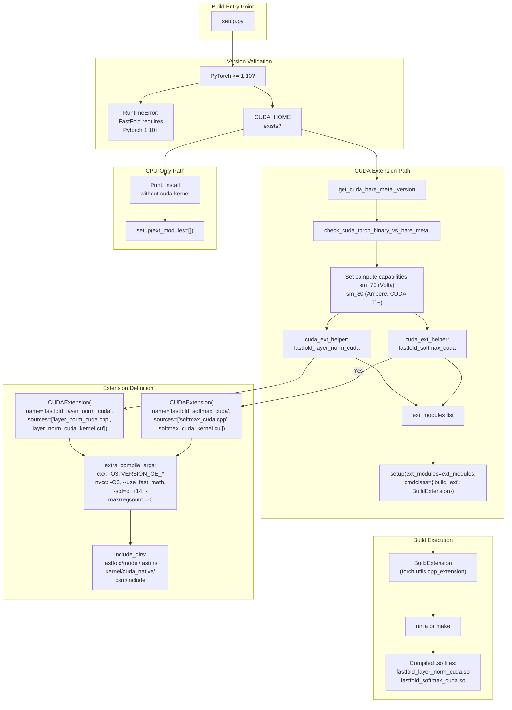
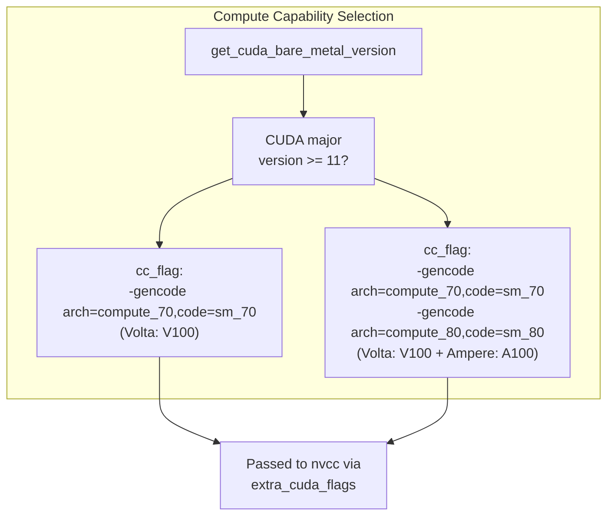
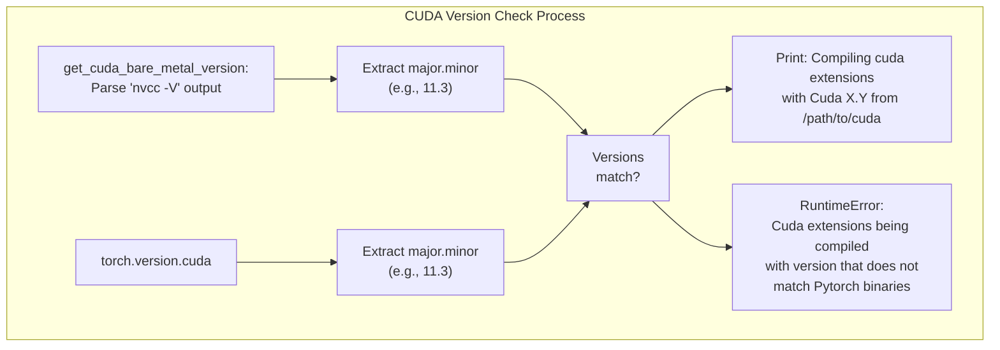
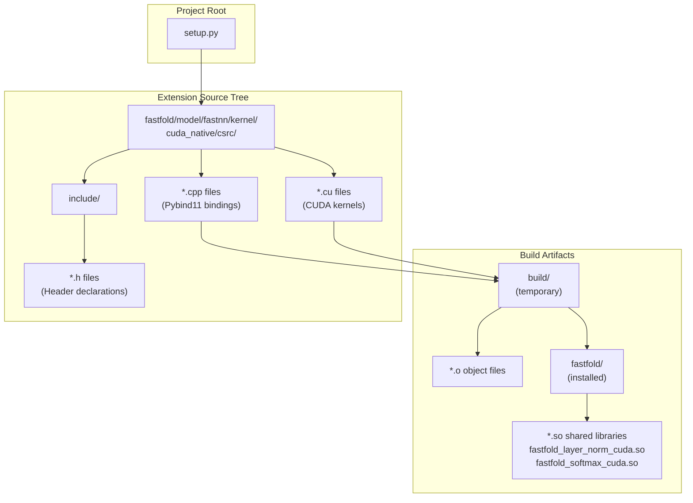
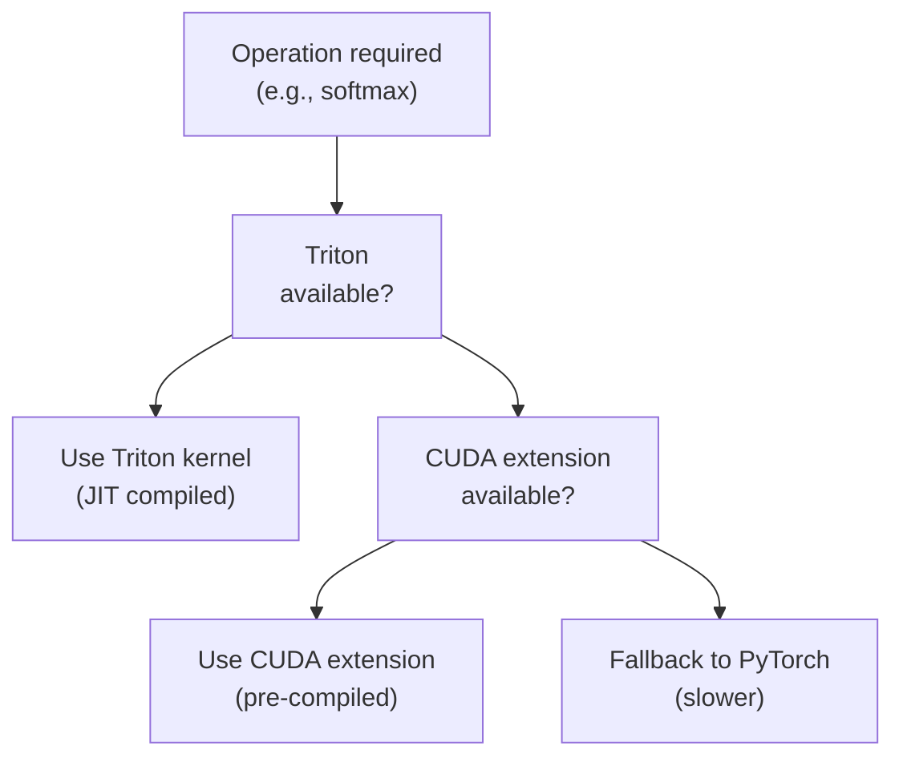

# Custom CUDA Extensions

> **Relevant source files**
> * [docker/Dockerfile](https://github.com/hpcaitech/FastFold/blob/eba49680/docker/Dockerfile)
> * [setup.py](https://github.com/hpcaitech/FastFold/blob/eba49680/setup.py)

## Purpose and Scope

This document explains FastFold's custom CUDA extension build system, which compiles high-performance GPU kernels for critical operations. CUDA extensions provide 2-10x speedups over standard PyTorch implementations through fused operations and optimized memory access patterns.

This page covers the build infrastructure in [setup.py](https://github.com/hpcaitech/FastFold/blob/eba49680/setup.py)

 and how extensions are compiled and integrated. For details on the kernel implementations themselves (softmax, attention, layer norm), see [Optimized Kernels](/hpcaitech/FastFold/8.3-optimized-kernels). For information about building and deploying the complete FastFold package, see [Build System](/hpcaitech/FastFold/10.1-build-system) and [Docker Deployment](/hpcaitech/FastFold/10.4-docker-deployment).

---

## Overview

FastFold includes two native CUDA extensions that replace performance-critical operations:

| Extension | Purpose | Source Files | Performance Gain |
| --- | --- | --- | --- |
| `fastfold_layer_norm_cuda` | Fused layer normalization with configurable epsilon | `layer_norm_cuda.cpp`, `layer_norm_cuda_kernel.cu` | 2-5x vs PyTorch |
| `fastfold_softmax_cuda` | Fused softmax with warp-level reduction | `softmax_cuda.cpp`, `softmax_cuda_kernel.cu` | 2-10x vs PyTorch |

Extensions are compiled during installation and linked into the Python runtime via Pybind11 bindings. The build system supports conditional compilation: if `CUDA_HOME` is not available, FastFold installs in CPU-only mode.

**Sources:** [setup.py L1-L144](https://github.com/hpcaitech/FastFold/blob/eba49680/setup.py#L1-L144)

---

## Build System Architecture



**Diagram: CUDA Extension Build Flow**

The build system performs multi-stage validation before compiling extensions. First, PyTorch version is checked ([setup.py L72-L74](https://github.com/hpcaitech/FastFold/blob/eba49680/setup.py#L72-L74)

), requiring at least version 1.10. Then, `CUDA_HOME` presence determines whether CUDA extensions can be built ([setup.py L86-L128](https://github.com/hpcaitech/FastFold/blob/eba49680/setup.py#L86-L128)

). If CUDA is available, version compatibility between CUDA toolkit and PyTorch binaries is verified ([setup.py L23-L38](https://github.com/hpcaitech/FastFold/blob/eba49680/setup.py#L23-L38)

).

**Sources:** [setup.py L1-L144](https://github.com/hpcaitech/FastFold/blob/eba49680/setup.py#L1-L144)

---

## Extension Definition System

### Helper Function: cuda_ext_helper

The `cuda_ext_helper` function ([setup.py L89-L103](https://github.com/hpcaitech/FastFold/blob/eba49680/setup.py#L89-L103)

) provides a standardized interface for creating CUDA extensions:

```python
def cuda_ext_helper(name, sources, extra_cuda_flags):    return CUDAExtension(        name=name,        sources=[os.path.join('fastfold/model/fastnn/kernel/cuda_native/csrc', path)                  for path in sources],        include_dirs=[os.path.join(this_dir, 'fastfold/model/fastnn/kernel/cuda_native/csrc/include')],        extra_compile_args={            'cxx': ['-O3'] + version_dependent_macros,            'nvcc': append_nvcc_threads(['-O3', '--use_fast_math'] +                                        version_dependent_macros + extra_cuda_flags)        }    )
```

**Key Features:**

| Feature | Implementation | Purpose |
| --- | --- | --- |
| **Source Path Resolution** | Joins paths relative to `csrc/` directory | Centralized kernel location |
| **Include Directories** | Points to `csrc/include/` | Access to header files |
| **Optimization Flags** | `-O3`, `--use_fast_math` | Maximum performance |
| **Version Macros** | `VERSION_GE_1_1`, `VERSION_GE_1_3`, `VERSION_GE_1_5` | PyTorch API compatibility |
| **C++ Standard** | `-std=c++14` | Required for modern C++ features |
| **Register Limit** | `-maxrregcount=50` | Optimize occupancy |

**Sources:** [setup.py L89-L103](https://github.com/hpcaitech/FastFold/blob/eba49680/setup.py#L89-L103)

---

### Compute Capability Configuration

FastFold targets multiple GPU architectures through CUDA's compute capability system:



**Diagram: GPU Architecture Targeting**

The system dynamically adds compute capabilities based on CUDA version ([setup.py L107-L111](https://github.com/hpcaitech/FastFold/blob/eba49680/setup.py#L107-L111)

):

* **CUDA < 11**: Only Volta (sm_70) - V100 GPUs
* **CUDA >= 11**: Volta (sm_70) + Ampere (sm_80) - V100 and A100 GPUs

This ensures optimal code generation for each architecture while maintaining backward compatibility.

**Sources:** [setup.py L107-L111](https://github.com/hpcaitech/FastFold/blob/eba49680/setup.py#L107-L111)

---

## Version Compatibility System

### PyTorch Version Checking

FastFold requires PyTorch 1.10 or newer due to API dependencies:

```python
TORCH_MAJOR = int(torch.__version__.split('.')[0])TORCH_MINOR = int(torch.__version__.split('.')[1]) if TORCH_MAJOR < 1 or (TORCH_MAJOR == 1 and TORCH_MINOR < 10):    raise RuntimeError("FastFold requires Pytorch 1.10 or newer.\n" +                       "The latest stable release can be obtained from https://pytorch.org/")
```

**Sources:** [setup.py L68-L74](https://github.com/hpcaitech/FastFold/blob/eba49680/setup.py#L68-L74)

---

### CUDA Version Validation

The `check_cuda_torch_binary_vs_bare_metal` function ([setup.py L23-L38](https://github.com/hpcaitech/FastFold/blob/eba49680/setup.py#L23-L38)

) prevents subtle runtime errors by ensuring CUDA toolkit version matches PyTorch's compiled CUDA version:



**Diagram: CUDA Version Compatibility Check**

This validation prevents issues like:

* **ABI incompatibility**: Different CUDA versions may have incompatible binary interfaces
* **Missing features**: Older CUDA toolkits may lack features used by newer PyTorch
* **Performance degradation**: Version mismatches can prevent optimizations

**Sources:** [setup.py L12-L38](https://github.com/hpcaitech/FastFold/blob/eba49680/setup.py#L12-L38)

---

## Compilation Flags and Optimizations

### Compiler Flags

The build system applies multiple optimization and compatibility flags:

| Flag Category | Flags | Purpose |
| --- | --- | --- |
| **Optimization** | `-O3`, `--use_fast_math` | Maximum performance, fast math operations |
| **C++ Standard** | `-std=c++14` | Enable modern C++ features (lambdas, templates) |
| **CUDA Operators** | `-U__CUDA_NO_HALF_OPERATORS__`, `-U__CUDA_NO_HALF_CONVERSIONS__` | Enable FP16 operations |
| **Extended Features** | `--expt-relaxed-constexpr`, `--expt-extended-lambda` | Allow advanced CUDA features |
| **Register Limit** | `-maxrregcount=50` | Control register usage for better occupancy |
| **Version Macros** | `-DVERSION_GE_1_1`, `-DVERSION_GE_1_3`, `-DVERSION_GE_1_5` | Conditional compilation for PyTorch versions |

**Sources:** [setup.py L84-L116](https://github.com/hpcaitech/FastFold/blob/eba49680/setup.py#L84-L116)

---

### Multi-threaded Compilation

For CUDA 11.2+, the build system enables parallel compilation:

```python
def append_nvcc_threads(nvcc_extra_args):    _, bare_metal_major, bare_metal_minor = get_cuda_bare_metal_version(CUDA_HOME)    if int(bare_metal_major) >= 11 and int(bare_metal_minor) >= 2:        return nvcc_extra_args + ["--threads", "4"]    return nvcc_extra_args
```

This reduces compilation time by ~4x on multi-core systems.

**Sources:** [setup.py L41-L45](https://github.com/hpcaitech/FastFold/blob/eba49680/setup.py#L41-L45)

---

## Current CUDA Extensions

### Layer Normalization Extension

**Extension Name:** `fastfold_layer_norm_cuda`

**Source Files:**

* `fastfold/model/fastnn/kernel/cuda_native/csrc/layer_norm_cuda.cpp` - Pybind11 bindings
* `fastfold/model/fastnn/kernel/cuda_native/csrc/layer_norm_cuda_kernel.cu` - CUDA kernel implementation

**Compilation:**

```
ext_modules.append(    cuda_ext_helper('fastfold_layer_norm_cuda',                    ['layer_norm_cuda.cpp', 'layer_norm_cuda_kernel.cu'],                    extra_cuda_flags + cc_flag))
```

This extension provides fused forward and backward passes for layer normalization, reducing memory bandwidth by combining multiple operations into single kernel launches.

**Sources:** [setup.py L118-L121](https://github.com/hpcaitech/FastFold/blob/eba49680/setup.py#L118-L121)

---

### Softmax Extension

**Extension Name:** `fastfold_softmax_cuda`

**Source Files:**

* `fastfold/model/fastnn/kernel/cuda_native/csrc/softmax_cuda.cpp` - Pybind11 bindings
* `fastfold/model/fastnn/kernel/cuda_native/csrc/softmax_cuda_kernel.cu` - CUDA kernel implementation

**Compilation:**

```
ext_modules.append(    cuda_ext_helper('fastfold_softmax_cuda',                     ['softmax_cuda.cpp', 'softmax_cuda_kernel.cu'],                    extra_cuda_flags + cc_flag))
```

This extension implements warp-level reduction for softmax operations, achieving higher performance than PyTorch's default implementation through optimized shared memory usage.

**Sources:** [setup.py L123-L125](https://github.com/hpcaitech/FastFold/blob/eba49680/setup.py#L123-L125)

---

## File Organization



**Diagram: Extension File Organization**

**Directory Structure:**

* **`csrc/`**: C++ and CUDA source files * `layer_norm_cuda.cpp`, `layer_norm_cuda_kernel.cu` * `softmax_cuda.cpp`, `softmax_cuda_kernel.cu`
* **`csrc/include/`**: Header files for kernel declarations
* **`build/`**: Temporary build artifacts (auto-generated)
* **Package root**: Compiled `.so` files installed alongside Python modules

**Sources:** [setup.py L92-L96](https://github.com/hpcaitech/FastFold/blob/eba49680/setup.py#L92-L96)

---

## Installation Process

### Standard Installation

```markdown
# From source directorypython setup.py install
```

This command:

1. Checks PyTorch version (>= 1.10 required)
2. Detects CUDA_HOME environment variable
3. Validates CUDA toolkit vs PyTorch version
4. Compiles CUDA extensions with appropriate flags
5. Installs compiled `.so` files and Python modules

**Sources:** [setup.py L129-L143](https://github.com/hpcaitech/FastFold/blob/eba49680/setup.py#L129-L143)

 [docker/Dockerfile L13](https://github.com/hpcaitech/FastFold/blob/eba49680/docker/Dockerfile#L13-L13)

---

### Development Installation

For active development:

```markdown
# Editable installpip install -e .
```

This creates symbolic links instead of copying files, allowing code changes without reinstallation. CUDA extensions are still compiled and linked.

---

### Docker Installation

The provided Dockerfile demonstrates a complete build process:

```dockerfile
FROM hpcaitech/pytorch-cuda:1.12.0-11.3.0 RUN conda install openmm=7.7.0 pdbfixer -c conda-forge -y \ && conda install hmmer==3.3.2 hhsuite=3.3.0 kalign2=2.04 -c bioconda -y RUN pip install biopython==1.79 dm-tree==0.1.6 ml-collections==0.1.0 \scipy==1.7.1 ray pyarrow pandas einops RUN pip install colossalai Run git clone https://github.com/hpcaitech/FastFold.git \ && cd ./FastFold \ && python setup.py install
```

This ensures:

* Compatible PyTorch + CUDA base image
* All dependencies pre-installed
* CUDA extensions built during image creation

**Sources:** [docker/Dockerfile L1-L13](https://github.com/hpcaitech/FastFold/blob/eba49680/docker/Dockerfile#L1-L13)

---

## Adding New CUDA Extensions

### Step-by-Step Guide

**1. Create Kernel Implementation**

Add files to `fastfold/model/fastnn/kernel/cuda_native/csrc/`:

* `my_kernel.cpp` - Pybind11 interface
* `my_kernel.cu` - CUDA kernel implementation
* `include/my_kernel.h` - Header declarations (optional)

**2. Register Extension in `setup.py`**

Add to the extension list ([setup.py L118-L125](https://github.com/hpcaitech/FastFold/blob/eba49680/setup.py#L118-L125)

):

```
ext_modules.append(    cuda_ext_helper('my_custom_kernel',                    ['my_kernel.cpp', 'my_kernel.cu'],                    extra_cuda_flags + cc_flag))
```

**3. Implement Pybind11 Bindings**

Example structure for `my_kernel.cpp`:

```c
#include <torch/extension.h> // Forward declarationstorch::Tensor my_kernel_forward(torch::Tensor input);torch::Tensor my_kernel_backward(torch::Tensor grad_output); PYBIND11_MODULE(TORCH_EXTENSION_NAME, m) {    m.def("forward", &my_kernel_forward, "My kernel forward");    m.def("backward", &my_kernel_backward, "My kernel backward");}
```

**4. Implement CUDA Kernel**

Example structure for `my_kernel.cu`:

```javascript
#include <cuda.h>#include <cuda_runtime.h> __global__ void my_kernel_impl(const float* input, float* output, int n) {    int idx = blockIdx.x * blockDim.x + threadIdx.x;    if (idx < n) {        output[idx] = input[idx] * 2.0f;  // Example operation    }} torch::Tensor my_kernel_forward(torch::Tensor input) {    // Implementation}
```

**5. Rebuild Extension**

```markdown
python setup.py clean  # Remove old buildspython setup.py install
```

---

### Extension Requirements

**Mandatory Elements:**

| Element | Description |
| --- | --- |
| **Pybind11 Module** | `PYBIND11_MODULE(TORCH_EXTENSION_NAME, m)` macro |
| **Function Exports** | `m.def("name", &function)` for each exposed function |
| **CUDA Launch Configuration** | Proper block/grid dimensions for kernels |
| **Error Checking** | CUDA error handling with `cudaGetLastError()` |
| **Tensor Compatibility** | Support for required tensor types and devices |

---

## Troubleshooting

### Common Build Issues

**Issue: `RuntimeError: FastFold requires Pytorch 1.10 or newer`**

**Solution:** Upgrade PyTorch:

```
pip install torch>=1.10.0
```

---

**Issue: `CUDA_HOME environment variable is not set`**

**Solution:** Set CUDA_HOME to your CUDA installation:

```javascript
export CUDA_HOME=/usr/local/cuda
```

Or install in CPU-only mode (extensions will be skipped).

---

**Issue: `Cuda extensions are being compiled with a version of Cuda that does not match...`**

**Solution:** Ensure CUDA toolkit version matches PyTorch:

```javascript
# Check PyTorch CUDA versionpython -c "import torch; print(torch.version.cuda)" # Check CUDA toolkit version  nvcc --version
```

Install matching versions or comment out the version check at your own risk ([setup.py L31-L38](https://github.com/hpcaitech/FastFold/blob/eba49680/setup.py#L31-L38)

).

---

**Issue: Compilation fails with `undefined reference to __cxa_guard_acquire`**

**Solution:** This indicates ABI incompatibility. Rebuild PyTorch from source with the same compiler, or use prebuilt binaries that match your system.

---

### Debug Build

For debugging CUDA extensions:

```css
# In setup.py, modify extra_compile_argsextra_compile_args={    'cxx': ['-g', '-O0'],  # Debug symbols, no optimization    'nvcc': ['-g', '-G', '-O0']  # CUDA debug mode}
```

This enables:

* **Symbol information** for debuggers (gdb, cuda-gdb)
* **Line-level debugging** of kernel code
* **Unoptimized code** for easier inspection

Note: Debug builds are 5-10x slower than optimized builds.

---

## Performance Considerations

### Register Usage

The `-maxrregcount=50` flag ([setup.py L114](https://github.com/hpcaitech/FastFold/blob/eba49680/setup.py#L114-L114)

) limits register usage per thread, trading register pressure for higher occupancy. This is optimal for FastFold's kernels, which benefit from more concurrent threads.

**Trade-off:**

* **Lower register limit**: More concurrent threads, better occupancy
* **Higher register limit**: Fewer concurrent threads, but each thread may be faster

---

### Fast Math

The `--use_fast_math` flag ([setup.py L101](https://github.com/hpcaitech/FastFold/blob/eba49680/setup.py#L101-L101)

) enables aggressive floating-point optimizations:

**Enabled Optimizations:**

* Approximate division and square root
* Fused multiply-add operations
* Relaxed IEEE 754 compliance

**Impact:** ~10-30% performance improvement with negligible accuracy loss for neural network operations.

---

## Integration with FastFold

### Runtime Loading

Extensions are loaded dynamically at runtime via Python's import system:

```javascript
import fastfold_layer_norm_cudaimport fastfold_softmax_cuda # Use in kernel implementationsoutput = fastfold_layer_norm_cuda.forward(input, weight, bias, eps)
```

The Triton kernels fall back to these CUDA extensions when Triton compilation fails or is unavailable (see [Fused Softmax Kernel](/hpcaitech/FastFold/8.3.1-fused-softmax-kernel)).

---

### Kernel Selection

FastFold uses a hierarchy for kernel selection:



**Diagram: Kernel Selection Hierarchy**

This ensures maximum performance when optimized kernels are available while maintaining functionality when they're not.

**Sources:** [setup.py L1-L144](https://github.com/hpcaitech/FastFold/blob/eba49680/setup.py#L1-L144)