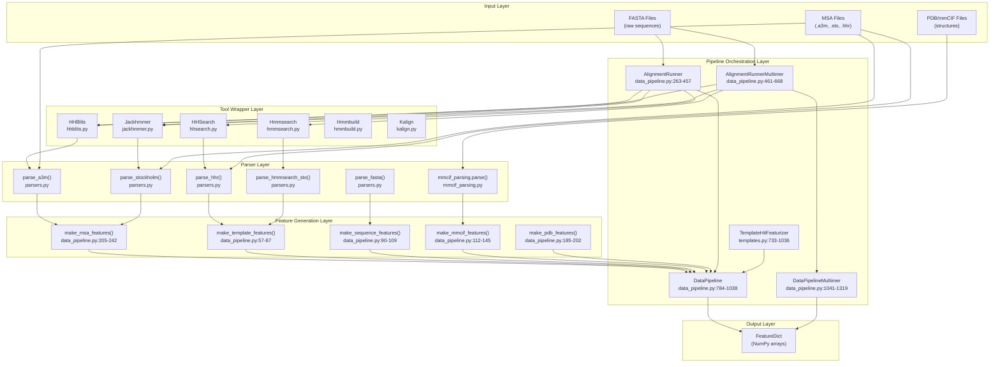
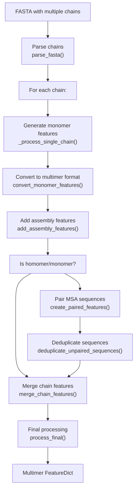
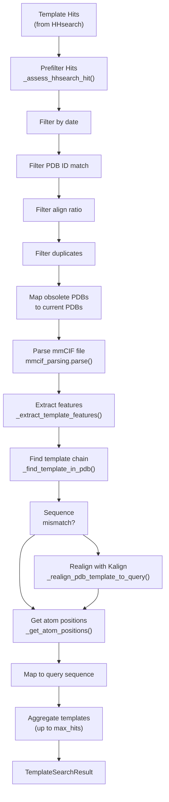

# Data Pipeline API

> **Relevant source files**
> * [fastfold/common/protein.py](https://github.com/hpcaitech/FastFold/blob/eba49680/fastfold/common/protein.py)
> * [fastfold/data/data_pipeline.py](https://github.com/hpcaitech/FastFold/blob/eba49680/fastfold/data/data_pipeline.py)
> * [fastfold/data/feature_processing_multimer.py](https://github.com/hpcaitech/FastFold/blob/eba49680/fastfold/data/feature_processing_multimer.py)
> * [fastfold/data/msa_pairing.py](https://github.com/hpcaitech/FastFold/blob/eba49680/fastfold/data/msa_pairing.py)
> * [fastfold/data/parsers.py](https://github.com/hpcaitech/FastFold/blob/eba49680/fastfold/data/parsers.py)
> * [fastfold/data/templates.py](https://github.com/hpcaitech/FastFold/blob/eba49680/fastfold/data/templates.py)
> * [fastfold/data/tools/hmmbuild.py](https://github.com/hpcaitech/FastFold/blob/eba49680/fastfold/data/tools/hmmbuild.py)
> * [fastfold/data/tools/jackhmmer.py](https://github.com/hpcaitech/FastFold/blob/eba49680/fastfold/data/tools/jackhmmer.py)
> * [fastfold/utils/import_weights.py](https://github.com/hpcaitech/FastFold/blob/eba49680/fastfold/utils/import_weights.py)

This page provides a comprehensive API reference for FastFold's data processing pipeline. These classes and functions transform raw biological data (FASTA sequences, PDB/mmCIF structures, MSA files) into numerical feature dictionaries consumable by the AlphaFold model.

For end-to-end data processing workflows and conceptual overviews, see [Data Processing Pipeline](/hpcaitech/FastFold/4-data-processing-pipeline). For alignment acceleration with Ray, see [Ray Workflow Acceleration](/hpcaitech/FastFold/4.3-ray-workflow-acceleration). For multimer-specific processing concepts, see [Multimer Data Processing](/hpcaitech/FastFold/4.4-multimer-data-processing).

---

## System Overview

The Data Pipeline API consists of several layers that work together to produce model-ready features:



**Sources:** [fastfold/data/data_pipeline.py L1-L1556](https://github.com/hpcaitech/FastFold/blob/eba49680/fastfold/data/data_pipeline.py#L1-L1556)

 [fastfold/data/templates.py L1-L1244](https://github.com/hpcaitech/FastFold/blob/eba49680/fastfold/data/templates.py#L1-L1244)

 [fastfold/data/parsers.py L1-L664](https://github.com/hpcaitech/FastFold/blob/eba49680/fastfold/data/parsers.py#L1-L664)

---

## Core Data Structures

### FeatureDict

Type alias for the primary data structure passed between pipeline stages and into the model.

**Definition:** [fastfold/data/data_pipeline.py L44](https://github.com/hpcaitech/FastFold/blob/eba49680/fastfold/data/data_pipeline.py#L44-L44)

```
FeatureDict = Mapping[str, np.ndarray]
```

A `FeatureDict` is a dictionary mapping feature names (strings) to NumPy arrays. Standard features include:

| Feature Name | Shape | dtype | Description |
| --- | --- | --- | --- |
| `aatype` | `(N_res,)` or `(N_res, 21)` | `int64` or `float32` | Amino acid type (one-hot or integer) |
| `residue_index` | `(N_res,)` | `int32` | Residue index in sequence |
| `msa` | `(N_seq, N_res)` | `int32` | MSA sequences as integer codes |
| `deletion_matrix_int` | `(N_seq, N_res)` | `int32` | Number of deletions at each position |
| `template_aatype` | `(N_templ, N_res)` | `int64` | Template amino acid types |
| `template_all_atom_positions` | `(N_templ, N_res, 37, 3)` | `float32` | Template atomic coordinates |
| `template_all_atom_mask` | `(N_templ, N_res, 37)` | `float32` | Mask for template atoms |

**Sources:** [fastfold/data/data_pipeline.py L44](https://github.com/hpcaitech/FastFold/blob/eba49680/fastfold/data/data_pipeline.py#L44-L44)

### Protein

Dataclass representing a protein structure with atomic coordinates and metadata.

**Definition:** [fastfold/common/protein.py L36-L70](https://github.com/hpcaitech/FastFold/blob/eba49680/fastfold/common/protein.py#L36-L70)

```python
@dataclasses.dataclass(frozen=True)class Protein:    atom_positions: np.ndarray  # [num_res, num_atom_type, 3]    aatype: np.ndarray          # [num_res]    atom_mask: np.ndarray       # [num_res, num_atom_type]    residue_index: np.ndarray   # [num_res]    chain_index: np.ndarray     # [num_res]    b_factors: np.ndarray       # [num_res, num_atom_type]
```

**Key Functions:**

* `from_pdb_string(pdb_str: str, chain_id: Optional[str]) -> Protein` - Parse PDB string [fastfold/common/protein.py L72-L149](https://github.com/hpcaitech/FastFold/blob/eba49680/fastfold/common/protein.py#L72-L149)
* `from_proteinnet_string(proteinnet_str: str) -> Protein` - Parse ProteinNet format [fastfold/common/protein.py L152-L202](https://github.com/hpcaitech/FastFold/blob/eba49680/fastfold/common/protein.py#L152-L202)
* `to_pdb(prot: Protein) -> str` - Convert to PDB string [fastfold/common/protein.py L213-L306](https://github.com/hpcaitech/FastFold/blob/eba49680/fastfold/common/protein.py#L213-L306)
* `from_prediction(features: FeatureDict, result: ModelOutput) -> Protein` - Build from model output [fastfold/common/protein.py L322-L358](https://github.com/hpcaitech/FastFold/blob/eba49680/fastfold/common/protein.py#L322-L358)

**Sources:** [fastfold/common/protein.py L36-L358](https://github.com/hpcaitech/FastFold/blob/eba49680/fastfold/common/protein.py#L36-L358)

### Msa

Dataclass representing a parsed multiple sequence alignment.

**Definition:** [fastfold/data/parsers.py L28-L53](https://github.com/hpcaitech/FastFold/blob/eba49680/fastfold/data/parsers.py#L28-L53)

```python
@dataclasses.dataclass(frozen=True)class Msa:    sequences: Sequence[str]    deletion_matrix: DeletionMatrix    descriptions: Optional[Sequence[str]]        def truncate(self, max_seqs: int) -> Msa:        # Truncate to max_seqs sequences
```

**Sources:** [fastfold/data/parsers.py L28-L53](https://github.com/hpcaitech/FastFold/blob/eba49680/fastfold/data/parsers.py#L28-L53)

### TemplateHit

Dataclass representing a template search hit from HHsearch or hmmsearch.

**Definition:** [fastfold/data/parsers.py L56-L68](https://github.com/hpcaitech/FastFold/blob/eba49680/fastfold/data/parsers.py#L56-L68)

```python
@dataclasses.dataclass(frozen=True)class TemplateHit:    index: int    name: str    aligned_cols: int    sum_probs: Optional[float]    query: str    hit_sequence: str    indices_query: List[int]    indices_hit: List[int]
```

**Sources:** [fastfold/data/parsers.py L56-L68](https://github.com/hpcaitech/FastFold/blob/eba49680/fastfold/data/parsers.py#L56-L68)

---

## Pipeline Orchestration Classes

### DataPipeline

Primary class for processing monomer protein data into model features.

**Class Definition:** [fastfold/data/data_pipeline.py L784-L1038](https://github.com/hpcaitech/FastFold/blob/eba49680/fastfold/data/data_pipeline.py#L784-L1038)

```python
class DataPipeline:    def __init__(        self,        template_featurizer: Optional[templates.TemplateHitFeaturizer],    )
```

**Methods:**

#### process_fasta

Process a FASTA file and alignment directory into features.

```python
def process_fasta(    self,    fasta_path: str,    alignment_dir: str,    _alignment_index: Optional[str] = None,) -> FeatureDict
```

**Workflow:**

1. Parse FASTA file to extract sequence [fastfold/data/data_pipeline.py L925-L933](https://github.com/hpcaitech/FastFold/blob/eba49680/fastfold/data/data_pipeline.py#L925-L933)
2. Parse MSA files from alignment directory [fastfold/data/data_pipeline.py L954](https://github.com/hpcaitech/FastFold/blob/eba49680/fastfold/data/data_pipeline.py#L954-L954)
3. Parse template hits (.hhr files) [fastfold/data/data_pipeline.py L936-L940](https://github.com/hpcaitech/FastFold/blob/eba49680/fastfold/data/data_pipeline.py#L936-L940)
4. Generate sequence features [fastfold/data/data_pipeline.py L948-L952](https://github.com/hpcaitech/FastFold/blob/eba49680/fastfold/data/data_pipeline.py#L948-L952)
5. Generate MSA features [fastfold/data/data_pipeline.py L954](https://github.com/hpcaitech/FastFold/blob/eba49680/fastfold/data/data_pipeline.py#L954-L954)
6. Generate template features [fastfold/data/data_pipeline.py L942-L946](https://github.com/hpcaitech/FastFold/blob/eba49680/fastfold/data/data_pipeline.py#L942-L946)
7. Merge all features into single dictionary [fastfold/data/data_pipeline.py L956-L960](https://github.com/hpcaitech/FastFold/blob/eba49680/fastfold/data/data_pipeline.py#L956-L960)

**Sources:** [fastfold/data/data_pipeline.py L918-L960](https://github.com/hpcaitech/FastFold/blob/eba49680/fastfold/data/data_pipeline.py#L918-L960)

#### process_mmcif

Process an mmCIF object and alignment directory.

```python
def process_mmcif(    self,    mmcif: mmcif_parsing.MmcifObject,    alignment_dir: str,    chain_id: Optional[str] = None,    _alignment_index: Optional[str] = None,) -> FeatureDict
```

**Sources:** [fastfold/data/data_pipeline.py L962-L998](https://github.com/hpcaitech/FastFold/blob/eba49680/fastfold/data/data_pipeline.py#L962-L998)

#### process_pdb

Process a PDB file and alignment directory.

```python
def process_pdb(    self,    pdb_path: str,    alignment_dir: str,    is_distillation: bool = True,    chain_id: Optional[str] = None,    _structure_index: Optional[str] = None,    _alignment_index: Optional[str] = None,) -> FeatureDict
```

**Sources:** [fastfold/data/data_pipeline.py L1000-L1038](https://github.com/hpcaitech/FastFold/blob/eba49680/fastfold/data/data_pipeline.py#L1000-L1038)

---

### DataPipelineMultimer

Extended pipeline for processing multimer complexes with MSA pairing.

**Class Definition:** [fastfold/data/data_pipeline.py L1041-L1319](https://github.com/hpcaitech/FastFold/blob/eba49680/fastfold/data/data_pipeline.py#L1041-L1319)

```python
class DataPipelineMultimer(DataPipeline):    def __init__(        self,        monomer_data_pipeline: DataPipeline,        num_predictions_per_model: int = 5,    )
```

**Key Method:**

#### process_fasta

Process multiple chains with MSA pairing.

```python
def process_fasta(    self,    fasta_path: str,    alignment_dir: str,    _is_prokaryotic: Optional[bool] = None,) -> FeatureDict
```

**Multimer Processing Workflow:**



**Sources:** [fastfold/data/data_pipeline.py L1041-L1319](https://github.com/hpcaitech/FastFold/blob/eba49680/fastfold/data/data_pipeline.py#L1041-L1319)

 [fastfold/data/msa_pairing.py L56-L88](https://github.com/hpcaitech/FastFold/blob/eba49680/fastfold/data/msa_pairing.py#L56-L88)

 [fastfold/data/feature_processing_multimer.py L50-L84](https://github.com/hpcaitech/FastFold/blob/eba49680/fastfold/data/feature_processing_multimer.py#L50-L84)

---

## Alignment Runner Classes

### AlignmentRunner

Orchestrates running bioinformatics tools (jackhmmer, hhblits, hhsearch) for MSA and template search.

**Class Definition:** [fastfold/data/data_pipeline.py L263-L457](https://github.com/hpcaitech/FastFold/blob/eba49680/fastfold/data/data_pipeline.py#L263-L457)

```python
class AlignmentRunner:    def __init__(        self,        jackhmmer_binary_path: Optional[str] = None,        hhblits_binary_path: Optional[str] = None,        hhsearch_binary_path: Optional[str] = None,        uniref90_database_path: Optional[str] = None,        mgnify_database_path: Optional[str] = None,        bfd_database_path: Optional[str] = None,        uniref30_database_path: Optional[str] = None,        pdb70_database_path: Optional[str] = None,        use_small_bfd: Optional[bool] = None,        no_cpus: Optional[int] = None,        uniref_max_hits: int = 10000,        mgnify_max_hits: int = 5000,    )
```

**Method:**

#### run

Execute all configured alignment tools and save results.

```python
def run(    self,    fasta_path: str,    output_dir: str,)
```

**Execution Order:**

1. **UniRef90 search** (if configured) → `uniref90_hits.a3m` [fastfold/data/data_pipeline.py L410-L420](https://github.com/hpcaitech/FastFold/blob/eba49680/fastfold/data/data_pipeline.py#L410-L420)
2. **PDB70 template search** (if UniRef90 ran) → `pdb70_hits.hhr` [fastfold/data/data_pipeline.py L422-L428](https://github.com/hpcaitech/FastFold/blob/eba49680/fastfold/data/data_pipeline.py#L422-L428)
3. **MGnify search** (if configured) → `mgnify_hits.a3m` [fastfold/data/data_pipeline.py L430-L440](https://github.com/hpcaitech/FastFold/blob/eba49680/fastfold/data/data_pipeline.py#L430-L440)
4. **BFD search** (if configured): * Small BFD with jackhmmer → `small_bfd_hits.sto` [fastfold/data/data_pipeline.py L442-L448](https://github.com/hpcaitech/FastFold/blob/eba49680/fastfold/data/data_pipeline.py#L442-L448) * Full BFD with hhblits → `bfd_uniref_hits.a3m` [fastfold/data/data_pipeline.py L449-L456](https://github.com/hpcaitech/FastFold/blob/eba49680/fastfold/data/data_pipeline.py#L449-L456)

**Database Search Matrix:**

| Database | Tool | Output Format | Max Hits |
| --- | --- | --- | --- |
| UniRef90 | jackhmmer | `.a3m` | `uniref_max_hits` |
| MGnify | jackhmmer | `.a3m` | `mgnify_max_hits` |
| Small BFD | jackhmmer | `.sto` | unlimited |
| BFD + UniRef30 | hhblits | `.a3m` | unlimited |
| PDB70 | hhsearch | `.hhr` | N/A (templates) |

**Sources:** [fastfold/data/data_pipeline.py L263-L457](https://github.com/hpcaitech/FastFold/blob/eba49680/fastfold/data/data_pipeline.py#L263-L457)

---

### AlignmentRunnerMultimer

Extended alignment runner for multimer complexes, adds UniProt and PDB seqres searches.

**Class Definition:** [fastfold/data/data_pipeline.py L461-L668](https://github.com/hpcaitech/FastFold/blob/eba49680/fastfold/data/data_pipeline.py#L461-L668)

```python
class AlignmentRunnerMultimer:    def __init__(        self,        jackhmmer_binary_path: Optional[str] = None,        hhblits_binary_path: Optional[str] = None,        hmmsearch_binary_path: Optional[str] = None,        hmmbuild_binary_path: Optional[str] = None,        uniref90_database_path: Optional[str] = None,        mgnify_database_path: Optional[str] = None,        bfd_database_path: Optional[str] = None,        uniref30_database_path: Optional[str] = None,        uniprot_database_path: Optional[str] = None,        pdb_seqres_database_path: Optional[str] = None,        use_small_bfd: Optional[bool] = None,        no_cpus: Optional[int] = None,        uniref_max_hits: int = 10000,        mgnify_max_hits: int = 5000,        uniprot_max_hits: int = 50000,    )
```

**Additional Databases:**

* **UniProt** - Full UniProt database searched with jackhmmer for multimer pairing
* **PDB seqres** - PDB sequences searched with hmmsearch for template finding

**Method:**

#### run

```python
def run(    self,    fasta_path: str,    output_dir: str,)
```

**Execution Order:**

1. UniRef90 search → `uniref90_hits.sto` [fastfold/data/data_pipeline.py L609-L618](https://github.com/hpcaitech/FastFold/blob/eba49680/fastfold/data/data_pipeline.py#L609-L618)
2. PDB seqres template search (using hmmsearch) → output via `Hmmsearch.query()` [fastfold/data/data_pipeline.py L626-L630](https://github.com/hpcaitech/FastFold/blob/eba49680/fastfold/data/data_pipeline.py#L626-L630)
3. MGnify search → `mgnify_hits.sto` [fastfold/data/data_pipeline.py L632-L640](https://github.com/hpcaitech/FastFold/blob/eba49680/fastfold/data/data_pipeline.py#L632-L640)
4. BFD search (small or full) → `small_bfd_hits.sto` or `bfd_uniref_hits.a3m` [fastfold/data/data_pipeline.py L642-L657](https://github.com/hpcaitech/FastFold/blob/eba49680/fastfold/data/data_pipeline.py#L642-L657)
5. UniProt search → `uniprot_hits.sto` [fastfold/data/data_pipeline.py L659-L667](https://github.com/hpcaitech/FastFold/blob/eba49680/fastfold/data/data_pipeline.py#L659-L667)

**Sources:** [fastfold/data/data_pipeline.py L461-L668](https://github.com/hpcaitech/FastFold/blob/eba49680/fastfold/data/data_pipeline.py#L461-L668)

---

## Feature Generation Functions

These functions convert parsed data structures into NumPy arrays suitable for model input.

### Sequence Features

#### make_sequence_features

Generate basic sequence-level features.

```python
def make_sequence_features(    sequence: str,     description: str,     num_res: int) -> FeatureDict
```

**Generated Features:**

* `aatype`: One-hot encoded amino acid types `(num_res, 21)`
* `between_segment_residues`: Zeros `(num_res,)`
* `domain_name`: Description as bytes `(1,)`
* `residue_index`: 0-indexed positions `(num_res,)`
* `seq_length`: Constant array `(num_res,)` filled with `num_res`
* `sequence`: Sequence as bytes `(1,)`

**Sources:** [fastfold/data/data_pipeline.py L90-L109](https://github.com/hpcaitech/FastFold/blob/eba49680/fastfold/data/data_pipeline.py#L90-L109)

---

### MSA Features

#### make_msa_features

Convert parsed MSA objects into numerical features.

```python
def make_msa_features(msas: Sequence[parsers.Msa]) -> FeatureDict
```

**Generated Features:**

* `msa`: Integer-encoded sequences `(num_alignments, num_res)`
* `deletion_matrix_int`: Deletion counts `(num_alignments, num_res)`
* `num_alignments`: Constant array `(num_res,)` with total alignment count
* `msa_species_identifiers`: Species IDs as bytes `(num_alignments,)`

**Encoding Details:**

* Amino acids encoded using `residue_constants.HHBLITS_AA_TO_ID` mapping
* Duplicate sequences are removed during processing
* Species IDs extracted from MSA descriptions via `msa_identifiers.get_identifiers()`

**Sources:** [fastfold/data/data_pipeline.py L205-L242](https://github.com/hpcaitech/FastFold/blob/eba49680/fastfold/data/data_pipeline.py#L205-L242)

---

### Template Features

#### make_template_features

Generate template features from search hits.

```python
def make_template_features(    input_sequence: str,    hits: Sequence[Any],    template_featurizer: Union[        templates.TemplateHitFeaturizer,         templates.HmmsearchHitFeaturizer    ],    query_pdb_code: Optional[str] = None,    query_release_date: Optional[str] = None,) -> FeatureDict
```

**Generated Features:**

* `template_aatype`: Template amino acid types `(num_templates, num_res)`
* `template_all_atom_positions`: Atomic coordinates `(num_templates, num_res, 37, 3)`
* `template_all_atom_mask`: Atom presence mask `(num_templates, num_res, 37)`
* `template_sum_probs`: Sum probabilities from HHsearch `(num_templates, 1)`

**Featurizer Selection:**

* `TemplateHitFeaturizer`: For monomer templates (HHsearch hits)
* `HmmsearchHitFeaturizer`: For multimer templates (hmmsearch hits)

**Empty Template Handling:**
If no hits or featurizer is None, returns `empty_template_feats(len(input_sequence))` [fastfold/data/data_pipeline.py L47-L54](https://github.com/hpcaitech/FastFold/blob/eba49680/fastfold/data/data_pipeline.py#L47-L54)

**Sources:** [fastfold/data/data_pipeline.py L57-L87](https://github.com/hpcaitech/FastFold/blob/eba49680/fastfold/data/data_pipeline.py#L57-L87)

---

### Structure Features

#### make_mmcif_features

Extract features from parsed mmCIF structure.

```python
def make_mmcif_features(    mmcif_object: mmcif_parsing.MmcifObject,     chain_id: str) -> FeatureDict
```

**Generated Features:**

* All sequence features (via `make_sequence_features`)
* `all_atom_positions`: Atomic coordinates `(num_res, 37, 3)`
* `all_atom_mask`: Atom presence mask `(num_res, 37)`
* `resolution`: Structure resolution `(1,)`
* `release_date`: Release date as bytes `(1,)`
* `is_distillation`: Float 0.0 `(1,)`

**Sources:** [fastfold/data/data_pipeline.py L112-L145](https://github.com/hpcaitech/FastFold/blob/eba49680/fastfold/data/data_pipeline.py#L112-L145)

#### make_pdb_features

Extract features from PDB Protein object with confidence filtering.

```python
def make_pdb_features(    protein_object: protein.Protein,    description: str,    confidence_threshold: float = 0.5,    is_distillation: bool = True,) -> FeatureDict
```

**Confidence Filtering:**
If `is_distillation=True`, masks out atoms where B-factor ≤ `confidence_threshold` [fastfold/data/data_pipeline.py L195-L200](https://github.com/hpcaitech/FastFold/blob/eba49680/fastfold/data/data_pipeline.py#L195-L200)

**Generated Features:**

* All protein features (via `make_protein_features`)
* `all_atom_positions`: Atomic coordinates
* `all_atom_mask`: Filtered by B-factor confidence
* `resolution`: 0.0 (unknown)
* `is_distillation`: 1.0 or 0.0

**Sources:** [fastfold/data/data_pipeline.py L185-L202](https://github.com/hpcaitech/FastFold/blob/eba49680/fastfold/data/data_pipeline.py#L185-L202)

---

## Template Processing API

### TemplateHitFeaturizer

Class for processing HHsearch template hits into numerical features.

**Class Definition:** [fastfold/data/templates.py L733-L1036](https://github.com/hpcaitech/FastFold/blob/eba49680/fastfold/data/templates.py#L733-L1036)

```python
class TemplateHitFeaturizer:    def __init__(        self,        mmcif_dir: str,        max_template_date: str,        max_hits: int,        kalign_binary_path: str,        release_dates_path: Optional[str] = None,        obsolete_pdbs_path: Optional[str] = None,        strict_error_check: bool = False,    )
```

**Key Method:**

#### get_templates

```python
def get_templates(    self,    query_sequence: str,    hits: Sequence[parsers.TemplateHit],    query_pdb_code: Optional[str] = None,    query_release_date: Optional[datetime.datetime] = None,) -> TemplateSearchResult
```

**Processing Pipeline:**



**Prefiltering Criteria:**

1. **Date check**: Template release date ≤ `max_template_date` [fastfold/data/templates.py L235-L240](https://github.com/hpcaitech/FastFold/blob/eba49680/fastfold/data/templates.py#L235-L240)
2. **PDB ID check**: Not identical to query PDB code [fastfold/data/templates.py L242-L244](https://github.com/hpcaitech/FastFold/blob/eba49680/fastfold/data/templates.py#L242-L244)
3. **Align ratio**: `aligned_cols / len(query_sequence) > min_align_ratio` (0.1) [fastfold/data/templates.py L246-L250](https://github.com/hpcaitech/FastFold/blob/eba49680/fastfold/data/templates.py#L246-L250)
4. **Duplicate check**: Template not exact subsequence of query [fastfold/data/templates.py L252-L256](https://github.com/hpcaitech/FastFold/blob/eba49680/fastfold/data/templates.py#L252-L256)
5. **Length check**: Template length ≥ 10 residues [fastfold/data/templates.py L258-L261](https://github.com/hpcaitech/FastFold/blob/eba49680/fastfold/data/templates.py#L258-L261)

**Sources:** [fastfold/data/templates.py L733-L1036](https://github.com/hpcaitech/FastFold/blob/eba49680/fastfold/data/templates.py#L733-L1036)

---

### HmmsearchHitFeaturizer

Specialized featurizer for hmmsearch-based template hits (used in multimers).

**Class Definition:** [fastfold/data/templates.py L1039-L1244](https://github.com/hpcaitech/FastFold/blob/eba49680/fastfold/data/templates.py#L1039-L1244)

```python
class HmmsearchHitFeaturizer:    def __init__(        self,        mmcif_dir: str,        max_template_date: str,        max_hits: int,        kalign_binary_path: str,        release_dates_path: Optional[str] = None,        obsolete_pdbs_path: Optional[str] = None,    )
```

**Key Method:**

#### get_templates

```python
def get_templates(    self,    query_sequence: str,    hits: Sequence[parsers.TemplateHit],) -> TemplateSearchResult
```

**Differences from TemplateHitFeaturizer:**

* Uses E-value instead of sum_probs for ranking
* Different sequence mapping logic for hmmsearch hits
* No PDB code comparison (multimer use case)

**Sources:** [fastfold/data/templates.py L1039-L1244](https://github.com/hpcaitech/FastFold/blob/eba49680/fastfold/data/templates.py#L1039-L1244)

---

## Parser Functions

### FASTA Parsing

#### parse_fasta

Parse FASTA format into sequences and descriptions.

```python
def parse_fasta(fasta_string: str) -> Tuple[Sequence[str], Sequence[str]]
```

**Returns:** `(sequences, descriptions)` where descriptions are from comment lines (without `>`)

**Sources:** [fastfold/data/parsers.py L70-L96](https://github.com/hpcaitech/FastFold/blob/eba49680/fastfold/data/parsers.py#L70-L96)

---

### MSA Parsing

#### parse_stockholm

Parse Stockholm format MSA with deletion matrix.

```python
def parse_stockholm(stockholm_string: str) -> Msa
```

**Format:** Stockholm (.sto) files from jackhmmer

* Removes gaps in query sequence from all alignments
* Computes deletion counts relative to query

**Sources:** [fastfold/data/parsers.py L99-L158](https://github.com/hpcaitech/FastFold/blob/eba49680/fastfold/data/parsers.py#L99-L158)

#### parse_a3m

Parse A3M format MSA with lowercase deletions.

```python
def parse_a3m(a3m_string: str) -> Msa
```

**Format:** A3M files from hhblits

* Lowercase letters represent insertions (deleted in aligned sequences)
* Deletion count tracked before each uppercase position

**Sources:** [fastfold/data/parsers.py L161-L196](https://github.com/hpcaitech/FastFold/blob/eba49680/fastfold/data/parsers.py#L161-L196)

#### convert_stockholm_to_a3m

Convert Stockholm MSA to A3M format.

```python
def convert_stockholm_to_a3m(    stockholm_format: str,    max_sequences: Optional[int] = None,    remove_first_row_gaps: bool = True,) -> str
```

**Sources:** [fastfold/data/parsers.py L209-L268](https://github.com/hpcaitech/FastFold/blob/eba49680/fastfold/data/parsers.py#L209-L268)

---

### Template Parsing

#### parse_hhr

Parse HHsearch output (.hhr file) into template hits.

```python
def parse_hhr(hhr_string: str) -> Sequence[TemplateHit]
```

**Extracts:**

* Hit name and index
* Alignment statistics (aligned_cols, sum_probs)
* Aligned query and hit sequences
* Residue indices for both sequences

**Sources:** [fastfold/data/parsers.py L517-L534](https://github.com/hpcaitech/FastFold/blob/eba49680/fastfold/data/parsers.py#L517-L534)

#### parse_hmmsearch_sto

Parse hmmsearch Stockholm output for multimer templates.

```python
def parse_hmmsearch_sto(    sto_string: str,    query_sequence: str,) -> Sequence[TemplateHit]
```

**Sources:** [fastfold/data/parsers.py L585-L664](https://github.com/hpcaitech/FastFold/blob/eba49680/fastfold/data/parsers.py#L585-L664)

---

## Bioinformatics Tool Wrappers

### Jackhmmer

Python wrapper for jackhmmer MSA search tool.

**Class Definition:** [fastfold/data/tools/jackhmmer.py L30-L249](https://github.com/hpcaitech/FastFold/blob/eba49680/fastfold/data/tools/jackhmmer.py#L30-L249)

```python
class Jackhmmer:    def __init__(        self,        *,        binary_path: str,        database_path: str,        n_cpu: int = 8,        n_iter: int = 1,        e_value: float = 0.0001,        z_value: Optional[int] = None,        get_tblout: bool = False,        filter_f1: float = 0.0005,        filter_f2: float = 0.00005,        filter_f3: float = 0.0000005,        incdom_e: Optional[float] = None,        dom_e: Optional[float] = None,        num_streamed_chunks: Optional[int] = None,        streaming_callback: Optional[Callable[[int], None]] = None,    )
```

**Method:**

#### query

Run jackhmmer search and return results.

```python
def query(    self,    input_fasta_path: str,     max_sequences: Optional[int] = None) -> Sequence[Mapping[str, Any]]
```

**Returns:** List of result dictionaries with keys:

* `sto`: Stockholm format alignment string
* `tbl`: E-value table (if `get_tblout=True`)
* `stderr`: stderr from jackhmmer
* `n_iter`: Number of iterations used
* `e_value`: E-value threshold used

**Database Streaming:** If `num_streamed_chunks` specified, queries database in chunks to reduce memory usage [fastfold/data/tools/jackhmmer.py L195-L249](https://github.com/hpcaitech/FastFold/blob/eba49680/fastfold/data/tools/jackhmmer.py#L195-L249)

**Sources:** [fastfold/data/tools/jackhmmer.py L30-L249](https://github.com/hpcaitech/FastFold/blob/eba49680/fastfold/data/tools/jackhmmer.py#L30-L249)

---

### HHBlits

Wrapper for HHBlits (profile-profile search).

**Class Definition:** [fastfold/data/tools/hhblits.py L23-L118](https://github.com/hpcaitech/FastFold/blob/eba49680/fastfold/data/tools/hhblits.py#L23-L118)

**Method:**

#### query

```python
def query(self, input_fasta_path: str) -> Mapping[str, Any]
```

**Returns:** Dictionary with key `a3m` containing A3M format alignment

**Sources:** [fastfold/data/tools/hhblits.py L23-L118](https://github.com/hpcaitech/FastFold/blob/eba49680/fastfold/data/tools/hhblits.py#L23-L118)

---

### HHSearch

Wrapper for HHsearch (HMM-HMM comparison for template search).

**Class Definition:** [fastfold/data/tools/hhsearch.py L24-L119](https://github.com/hpcaitech/FastFold/blob/eba49680/fastfold/data/tools/hhsearch.py#L24-L119)

**Method:**

#### query

```python
def query(self, msa: str) -> str
```

**Input:** A3M format MSA
**Returns:** HHR format template hits

**Sources:** [fastfold/data/tools/hhsearch.py L24-L119](https://github.com/hpcaitech/FastFold/blob/eba49680/fastfold/data/tools/hhsearch.py#L24-L119)

---

### Hmmsearch

Wrapper for hmmsearch (profile search for multimer templates).

**Class Definition:** [fastfold/data/tools/hmmsearch.py L25-L165](https://github.com/hpcaitech/FastFold/blob/eba49680/fastfold/data/tools/hmmsearch.py#L25-L165)

**Method:**

#### query

```python
def query(    self,     msa_sto: str,     output_dir: str) -> str
```

**Workflow:**

1. Build HMM profile with `hmmbuild` [fastfold/data/tools/hmmsearch.py L113-L115](https://github.com/hpcaitech/FastFold/blob/eba49680/fastfold/data/tools/hmmsearch.py#L113-L115)
2. Search database with `hmmsearch` [fastfold/data/tools/hmmsearch.py L117-L149](https://github.com/hpcaitech/FastFold/blob/eba49680/fastfold/data/tools/hmmsearch.py#L117-L149)
3. Return Stockholm format hits

**Sources:** [fastfold/data/tools/hmmsearch.py L25-L165](https://github.com/hpcaitech/FastFold/blob/eba49680/fastfold/data/tools/hmmsearch.py#L25-L165)

---

### Hmmbuild

Wrapper for hmmbuild (HMM profile construction).

**Class Definition:** [fastfold/data/tools/hmmbuild.py L25-L137](https://github.com/hpcaitech/FastFold/blob/eba49680/fastfold/data/tools/hmmbuild.py#L25-L137)

**Methods:**

#### build_profile_from_sto

```python
def build_profile_from_sto(    self,     sto: str,     model_construction: str = 'fast') -> str
```

**Model Construction Modes:**

* `'fast'`: Use default consensus determination
* `'hand'`: Use reference annotation in MSA

**Returns:** HMM profile as string

**Sources:** [fastfold/data/tools/hmmbuild.py L45-L59](https://github.com/hpcaitech/FastFold/blob/eba49680/fastfold/data/tools/hmmbuild.py#L45-L59)

---

## Multimer-Specific Processing

### MSA Pairing

#### create_paired_features

Pair MSA sequences across chains based on species co-occurrence.

```python
def create_paired_features(    chains: Iterable[Mapping[str, np.ndarray]],) -> List[Mapping[str, np.ndarray]]
```

**Algorithm:**

1. For each species present in multiple chains: * Find sequences from that species in each chain's MSA * Sort by sequence similarity to target * Pair sequences with matching ranks
2. Return chains with `_all_seq` features filtered to paired rows

**Sources:** [fastfold/data/msa_pairing.py L56-L88](https://github.com/hpcaitech/FastFold/blob/eba49680/fastfold/data/msa_pairing.py#L56-L88)

#### pair_sequences

Core pairing logic that matches MSA rows across chains.

```python
def pair_sequences(    examples: List[Mapping[str, np.ndarray]],) -> Dict[int, np.ndarray]
```

**Returns:** Dictionary mapping `num_chains_paired` to array of paired row indices

**Sources:** [fastfold/data/msa_pairing.py L181-L232](https://github.com/hpcaitech/FastFold/blob/eba49680/fastfold/data/msa_pairing.py#L181-L232)

---

### Feature Merging

#### merge_chain_features

Merge features from multiple chains into single FeatureDict for multimer.

```python
def merge_chain_features(    np_chains_list: List[Mapping[str, np.ndarray]],    pair_msa_sequences: bool,    max_templates: int) -> Mapping[str, np.ndarray]
```

**Processing Steps:**

1. Pad templates to `max_templates` [fastfold/data/msa_pairing.py L446-L447](https://github.com/hpcaitech/FastFold/blob/eba49680/fastfold/data/msa_pairing.py#L446-L447)
2. Merge homomers (same entity_id) with dense MSA [fastfold/data/msa_pairing.py L448](https://github.com/hpcaitech/FastFold/blob/eba49680/fastfold/data/msa_pairing.py#L448-L448)
3. Block-diagonalize unpaired MSA features [fastfold/data/msa_pairing.py L451-L452](https://github.com/hpcaitech/FastFold/blob/eba49680/fastfold/data/msa_pairing.py#L451-L452)
4. Concatenate paired MSA features (if applicable) [fastfold/data/msa_pairing.py L453-L454](https://github.com/hpcaitech/FastFold/blob/eba49680/fastfold/data/msa_pairing.py#L453-L454)
5. Add/recompute merged features [fastfold/data/msa_pairing.py L455-L458](https://github.com/hpcaitech/FastFold/blob/eba49680/fastfold/data/msa_pairing.py#L455-L458)

**Feature Merging Rules:**

| Feature Type | Paired MSA Mode | Unpaired MSA Mode |
| --- | --- | --- |
| MSA features (`msa`, `deletion_matrix`, etc.) | Concatenate along `num_res` | Block diagonalize |
| Sequence features (`aatype`, `residue_index`, etc.) | Concatenate along `num_res` | Concatenate along `num_res` |
| Template features | Concatenate along `num_res` | Concatenate along `num_res` |
| Chain features (`num_alignments`, `seq_length`) | Sum | Sum |

**Sources:** [fastfold/data/msa_pairing.py L433-L460](https://github.com/hpcaitech/FastFold/blob/eba49680/fastfold/data/msa_pairing.py#L433-L460)

---

### Assembly Features

#### add_assembly_features

Add chain assembly identifiers (entity_id, asym_id, sym_id).

```python
def add_assembly_features(    all_chain_features: MutableMapping[str, FeatureDict],) -> MutableMapping[str, FeatureDict]
```

**Generated Features:**

* `entity_id`: Unique ID for each unique sequence `(num_res,)`
* `asym_id`: Unique ID for each chain instance `(num_res,)`
* `sym_id`: Symmetry ID (1, 2, 3... for copies of same entity) `(num_res,)`

**Chain Naming Convention:** Keys become `"{entity_id}_{sym_id}"` (e.g., `A_1`, `A_2`, `B_1`)

**Sources:** [fastfold/data/data_pipeline.py L727-L769](https://github.com/hpcaitech/FastFold/blob/eba49680/fastfold/data/data_pipeline.py#L727-L769)

#### int_id_to_str_id

Convert integer to reverse spreadsheet-style string ID.

```python
def int_id_to_str_id(num: int) -> str
```

**Examples:** `1 → "A"`, `2 → "B"`, `27 → "AA"`, `28 → "BA"`

**Sources:** [fastfold/data/data_pipeline.py L705-L724](https://github.com/hpcaitech/FastFold/blob/eba49680/fastfold/data/data_pipeline.py#L705-L724)

---

## Utility Functions

### Feature Conversion

#### convert_monomer_features

Convert monomer features to multimer format.

```python
def convert_monomer_features(    monomer_features: FeatureDict,    chain_id: str) -> FeatureDict
```

**Key Transformations:**

* Remove leading dimensions from single-chain features
* Convert one-hot `aatype` to integer
* Reorder template `aatype` via `MAP_HHBLITS_AATYPE_TO_OUR_AATYPE`
* Add `auth_chain_id` feature

**Sources:** [fastfold/data/data_pipeline.py L678-L702](https://github.com/hpcaitech/FastFold/blob/eba49680/fastfold/data/data_pipeline.py#L678-L702)

---

### Empty Features

#### empty_template_feats

Generate empty template features for sequences without templates.

```python
def empty_template_feats(n_res: int) -> FeatureDict
```

**Returns:** Dictionary with zero-filled arrays:

* `template_aatype`: `(0, n_res)`
* `template_all_atom_positions`: `(0, n_res, 37, 3)`
* `template_sum_probs`: `(0, 1)`
* `template_all_atom_mask`: `(0, n_res, 37)`

**Sources:** [fastfold/data/data_pipeline.py L47-L54](https://github.com/hpcaitech/FastFold/blob/eba49680/fastfold/data/data_pipeline.py#L47-L54)

---

## Complete API Reference Table

### Main Classes

| Class | Location | Purpose |
| --- | --- | --- |
| `DataPipeline` | [data_pipeline.py L784](https://github.com/hpcaitech/FastFold/blob/eba49680/data_pipeline.py#L784-L784) | Process monomer data into features |
| `DataPipelineMultimer` | [data_pipeline.py L1041](https://github.com/hpcaitech/FastFold/blob/eba49680/data_pipeline.py#L1041-L1041) | Process multimer data with MSA pairing |
| `AlignmentRunner` | [data_pipeline.py L263](https://github.com/hpcaitech/FastFold/blob/eba49680/data_pipeline.py#L263-L263) | Run MSA/template search tools (monomer) |
| `AlignmentRunnerMultimer` | [data_pipeline.py L461](https://github.com/hpcaitech/FastFold/blob/eba49680/data_pipeline.py#L461-L461) | Run MSA/template search tools (multimer) |
| `TemplateHitFeaturizer` | [templates.py L733](https://github.com/hpcaitech/FastFold/blob/eba49680/templates.py#L733-L733) | Process HHsearch template hits |
| `HmmsearchHitFeaturizer` | [templates.py L1039](https://github.com/hpcaitech/FastFold/blob/eba49680/templates.py#L1039-L1039) | Process hmmsearch template hits |
| `Protein` | [protein.py L36](https://github.com/hpcaitech/FastFold/blob/eba49680/protein.py#L36-L36) | Protein structure representation |
| `Msa` | [parsers.py L28](https://github.com/hpcaitech/FastFold/blob/eba49680/parsers.py#L28-L28) | MSA representation |
| `TemplateHit` | [parsers.py L56](https://github.com/hpcaitech/FastFold/blob/eba49680/parsers.py#L56-L56) | Template search hit |

### Tool Wrappers

| Class | Location | Tool | Purpose |
| --- | --- | --- | --- |
| `Jackhmmer` | [jackhmmer.py L30](https://github.com/hpcaitech/FastFold/blob/eba49680/jackhmmer.py#L30-L30) | jackhmmer | Sequence-profile MSA search |
| `HHBlits` | [hhblits.py L23](https://github.com/hpcaitech/FastFold/blob/eba49680/hhblits.py#L23-L23) | hhblits | Profile-profile MSA search |
| `HHSearch` | [hhsearch.py L24](https://github.com/hpcaitech/FastFold/blob/eba49680/hhsearch.py#L24-L24) | hhsearch | Profile-profile template search |
| `Hmmsearch` | [hmmsearch.py L25](https://github.com/hpcaitech/FastFold/blob/eba49680/hmmsearch.py#L25-L25) | hmmsearch | Profile database search |
| `Hmmbuild` | [hmmbuild.py L25](https://github.com/hpcaitech/FastFold/blob/eba49680/hmmbuild.py#L25-L25) | hmmbuild | HMM profile construction |
| `Kalign` | [kalign.py L23](https://github.com/hpcaitech/FastFold/blob/eba49680/kalign.py#L23-L23) | kalign | Pairwise sequence alignment |

### Feature Generation Functions

| Function | Location | Output |
| --- | --- | --- |
| `make_sequence_features()` | [data_pipeline.py L90](https://github.com/hpcaitech/FastFold/blob/eba49680/data_pipeline.py#L90-L90) | Sequence-level features |
| `make_msa_features()` | [data_pipeline.py L205](https://github.com/hpcaitech/FastFold/blob/eba49680/data_pipeline.py#L205-L205) | MSA features |
| `make_template_features()` | [data_pipeline.py L57](https://github.com/hpcaitech/FastFold/blob/eba49680/data_pipeline.py#L57-L57) | Template features |
| `make_mmcif_features()` | [data_pipeline.py L112](https://github.com/hpcaitech/FastFold/blob/eba49680/data_pipeline.py#L112-L112) | mmCIF structure features |
| `make_pdb_features()` | [data_pipeline.py L185](https://github.com/hpcaitech/FastFold/blob/eba49680/data_pipeline.py#L185-L185) | PDB structure features |
| `make_protein_features()` | [data_pipeline.py L155](https://github.com/hpcaitech/FastFold/blob/eba49680/data_pipeline.py#L155-L155) | Protein object features |

### Parser Functions

| Function | Location | Input Format | Output |
| --- | --- | --- | --- |
| `parse_fasta()` | [parsers.py L70](https://github.com/hpcaitech/FastFold/blob/eba49680/parsers.py#L70-L70) | FASTA | `(sequences, descriptions)` |
| `parse_stockholm()` | [parsers.py L99](https://github.com/hpcaitech/FastFold/blob/eba49680/parsers.py#L99-L99) | Stockholm | `Msa` |
| `parse_a3m()` | [parsers.py L161](https://github.com/hpcaitech/FastFold/blob/eba49680/parsers.py#L161-L161) | A3M | `Msa` |
| `parse_hhr()` | [parsers.py L517](https://github.com/hpcaitech/FastFold/blob/eba49680/parsers.py#L517-L517) | HHR | `List[TemplateHit]` |
| `parse_hmmsearch_sto()` | [parsers.py L585](https://github.com/hpcaitech/FastFold/blob/eba49680/parsers.py#L585-L585) | Stockholm (hmmsearch) | `List[TemplateHit]` |

### Multimer Functions

| Function | Location | Purpose |
| --- | --- | --- |
| `create_paired_features()` | [msa_pairing.py L56](https://github.com/hpcaitech/FastFold/blob/eba49680/msa_pairing.py#L56-L56) | Pair MSA sequences across chains |
| `pair_sequences()` | [msa_pairing.py L181](https://github.com/hpcaitech/FastFold/blob/eba49680/msa_pairing.py#L181-L181) | Match MSA rows by species |
| `merge_chain_features()` | [msa_pairing.py L433](https://github.com/hpcaitech/FastFold/blob/eba49680/msa_pairing.py#L433-L433) | Merge multi-chain features |
| `add_assembly_features()` | [data_pipeline.py L727](https://github.com/hpcaitech/FastFold/blob/eba49680/data_pipeline.py#L727-L727) | Add entity/asym/sym IDs |
| `convert_monomer_features()` | [data_pipeline.py L678](https://github.com/hpcaitech/FastFold/blob/eba49680/data_pipeline.py#L678-L678) | Convert monomer to multimer format |
| `process_final()` | [feature_processing_multimer.py L169](https://github.com/hpcaitech/FastFold/blob/eba49680/feature_processing_multimer.py#L169-L169) | Final multimer processing |

**Sources:** [fastfold/data/data_pipeline.py L1-L1556](https://github.com/hpcaitech/FastFold/blob/eba49680/fastfold/data/data_pipeline.py#L1-L1556)

 [fastfold/data/templates.py L1-L1244](https://github.com/hpcaitech/FastFold/blob/eba49680/fastfold/data/templates.py#L1-L1244)

 [fastfold/data/parsers.py L1-L664](https://github.com/hpcaitech/FastFold/blob/eba49680/fastfold/data/parsers.py#L1-L664)

 [fastfold/data/msa_pairing.py L1-L484](https://github.com/hpcaitech/FastFold/blob/eba49680/fastfold/data/msa_pairing.py#L1-L484)

 [fastfold/common/protein.py L1-L360](https://github.com/hpcaitech/FastFold/blob/eba49680/fastfold/common/protein.py#L1-L360)