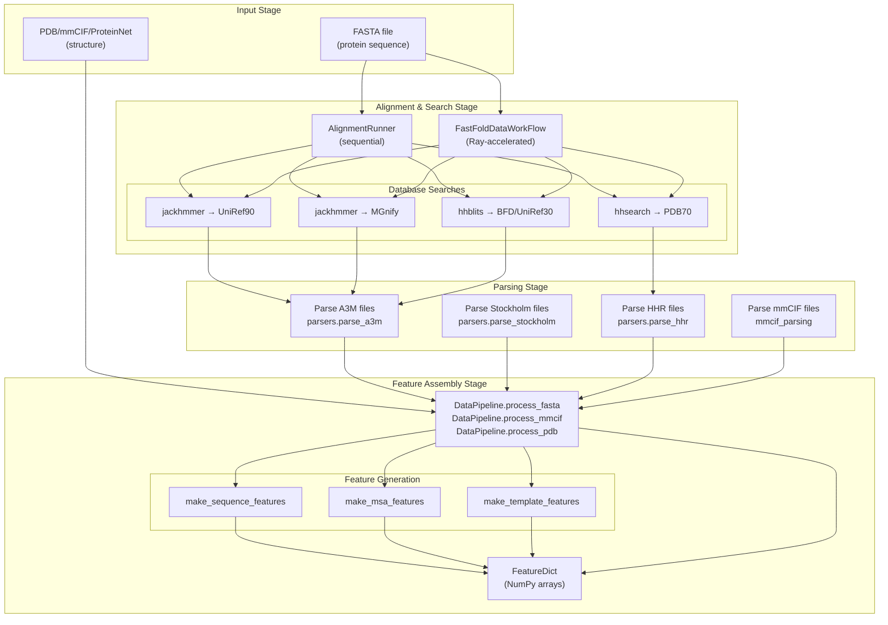
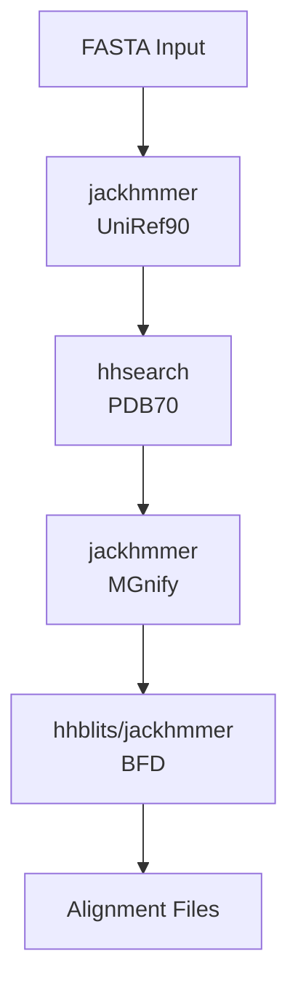
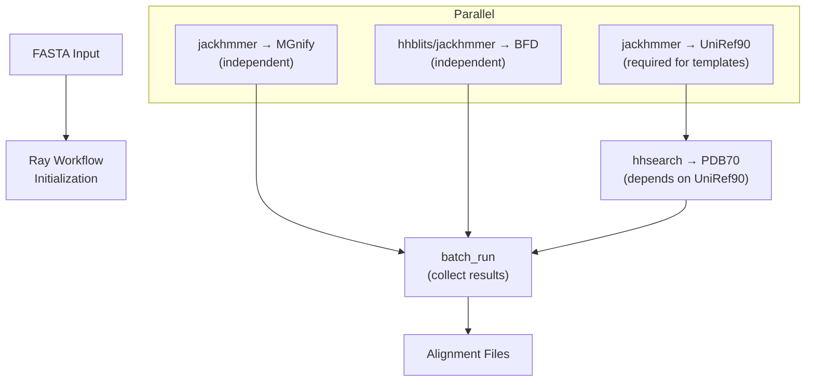
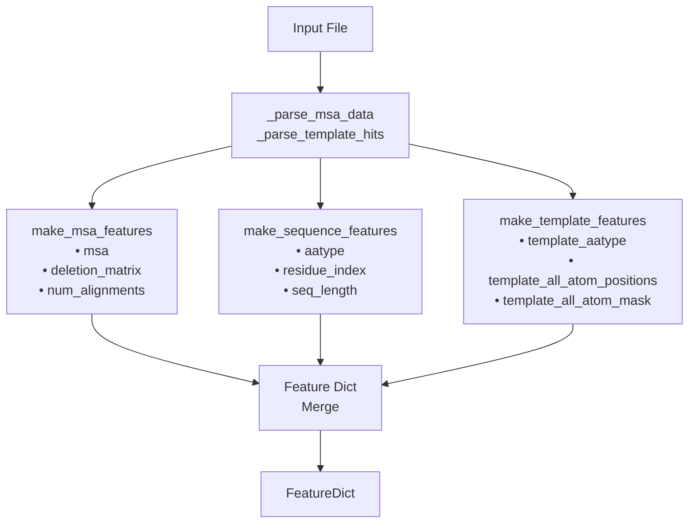
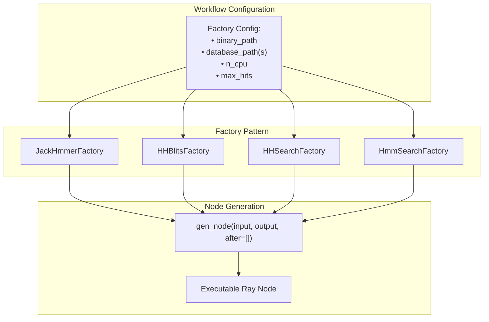

# Data Processing Pipeline

> **Relevant source files**
> * [fastfold/common/protein.py](https://github.com/hpcaitech/FastFold/blob/eba49680/fastfold/common/protein.py)
> * [fastfold/data/data_pipeline.py](https://github.com/hpcaitech/FastFold/blob/eba49680/fastfold/data/data_pipeline.py)
> * [fastfold/utils/import_weights.py](https://github.com/hpcaitech/FastFold/blob/eba49680/fastfold/utils/import_weights.py)
> * [fastfold/workflow/template/fastfold_data_workflow.py](https://github.com/hpcaitech/FastFold/blob/eba49680/fastfold/workflow/template/fastfold_data_workflow.py)
> * [fastfold/workflow/template/fastfold_multimer_data_workflow.py](https://github.com/hpcaitech/FastFold/blob/eba49680/fastfold/workflow/template/fastfold_multimer_data_workflow.py)
> * [inference_multimer.sh](https://github.com/hpcaitech/FastFold/blob/eba49680/inference_multimer.sh)

## Purpose and Scope

This document describes FastFold's data processing pipeline, which transforms raw biological inputs (FASTA sequences, PDB structures) into numerical feature dictionaries suitable for neural network consumption. The pipeline handles Multiple Sequence Alignment (MSA) generation, template structure search, and feature extraction for both monomer and multimer predictions.

For details on specific components:

* Alignment tools and MSA generation: see [Alignment and MSA Generation](/hpcaitech/FastFold/4.1-alignment-and-msa-generation)
* Template featurization: see [Template Search and Processing](/hpcaitech/FastFold/4.2-template-search-and-processing)
* Ray-accelerated workflows: see [Ray Workflow Acceleration](/hpcaitech/FastFold/4.3-ray-workflow-acceleration)
* Multimer-specific processing: see [Multimer Data Processing](/hpcaitech/FastFold/4.4-multimer-data-processing)

For using the pipeline during inference: see [Feature Generation for Inference](/hpcaitech/FastFold/5.1-feature-generation-for-inference)

## Pipeline Architecture

The data processing pipeline consists of three major stages: alignment/search, parsing, and feature assembly. FastFold provides both sequential and Ray-accelerated execution paths.



**Sources:** [fastfold/data/data_pipeline.py L263-L457](https://github.com/hpcaitech/FastFold/blob/eba49680/fastfold/data/data_pipeline.py#L263-L457)

 [fastfold/workflow/template/fastfold_data_workflow.py L10-L170](https://github.com/hpcaitech/FastFold/blob/eba49680/fastfold/workflow/template/fastfold_data_workflow.py#L10-L170)

## Execution Paths

FastFold provides two execution paths for data processing, each with distinct performance characteristics:

| Execution Path | Implementation | Speedup | Use Case |
| --- | --- | --- | --- |
| **Sequential** | `AlignmentRunner` | 1x (baseline) | Single protein, simple setup |
| **Ray Workflow** | `FastFoldDataWorkFlow` | 3x (monomer)3Nx (multimer) | Batch processing, production |

### Sequential Execution

The sequential path executes database searches serially using the `AlignmentRunner` class. Each tool runs to completion before the next begins.



**Sources:** [fastfold/data/data_pipeline.py L263-L457](https://github.com/hpcaitech/FastFold/blob/eba49680/fastfold/data/data_pipeline.py#L263-L457)

### Ray-Accelerated Execution

The Ray workflow executes independent database searches in parallel, with dependency management for sequential steps (e.g., template search depends on UniRef90 results).



**Sources:** [fastfold/workflow/template/fastfold_data_workflow.py L121-L169](https://github.com/hpcaitech/FastFold/blob/eba49680/fastfold/workflow/template/fastfold_data_workflow.py#L121-L169)

## Core Components

### Input Sources

FastFold accepts multiple input formats, each processed by specialized methods:

| Format | Method | Use Case |
| --- | --- | --- |
| FASTA | `DataPipeline.process_fasta()` | Standard sequence input |
| mmCIF | `DataPipeline.process_mmcif()` | Crystallographic structures |
| PDB | `DataPipeline.process_pdb()` | Legacy structure format |
| ProteinNet | `DataPipeline.process_core()` | ProteinNet dataset format |

**Sources:** [fastfold/data/data_pipeline.py L918-L1080](https://github.com/hpcaitech/FastFold/blob/eba49680/fastfold/data/data_pipeline.py#L918-L1080)

### Alignment Runners

#### AlignmentRunner (Monomer)

The `AlignmentRunner` class orchestrates sequential database searches for monomer predictions:

```markdown
# Key initialization parametersAlignmentRunner(    jackhmmer_binary_path=...,    hhblits_binary_path=...,    hhsearch_binary_path=...,    uniref90_database_path=...,    mgnify_database_path=...,    bfd_database_path=...,    pdb70_database_path=...,    use_small_bfd=False,    no_cpus=None,    uniref_max_hits=10000,    mgnify_max_hits=5000,)
```

The `run()` method executes the complete alignment workflow and writes output files to the specified directory.

**Sources:** [fastfold/data/data_pipeline.py L263-L457](https://github.com/hpcaitech/FastFold/blob/eba49680/fastfold/data/data_pipeline.py#L263-L457)

#### AlignmentRunnerMultimer

Extends the monomer runner with additional databases for multimer prediction:

```markdown
AlignmentRunnerMultimer(    # Standard databases    jackhmmer_binary_path=...,    hhblits_binary_path=...,    hmmsearch_binary_path=...,      # For PDB structure search    hmmbuild_binary_path=...,       # For HMM profile building    # Additional multimer databases    uniprot_database_path=...,      # For MSA pairing    pdb_seqres_database_path=...,   # For template search    uniprot_max_hits=50000,)
```

**Sources:** [fastfold/data/data_pipeline.py L461-L668](https://github.com/hpcaitech/FastFold/blob/eba49680/fastfold/data/data_pipeline.py#L461-L668)

### Data Pipelines

#### DataPipeline

The `DataPipeline` class assembles features from alignment results and input structures. It handles MSA parsing, template featurization, and feature merging.

**Key Methods:**

| Method | Input | Output | Purpose |
| --- | --- | --- | --- |
| `process_fasta()` | FASTA path, alignment dir | FeatureDict | Standard sequence processing |
| `process_mmcif()` | mmCIF object, alignment dir, chain_id | FeatureDict | Structure with alignments |
| `process_pdb()` | PDB path, alignment dir | FeatureDict | PDB structure processing |
| `process_core()` | ProteinNet core path, alignment dir | FeatureDict | ProteinNet format |

**Internal Processing:**



**Sources:** [fastfold/data/data_pipeline.py L784-L1080](https://github.com/hpcaitech/FastFold/blob/eba49680/fastfold/data/data_pipeline.py#L784-L1080)

#### DataPipelineMultimer

The `DataPipelineMultimer` class extends the monomer pipeline to handle multiple chains:

1. **Per-Chain Processing:** Each chain is processed independently using the monomer pipeline
2. **Feature Conversion:** Monomer features are converted to multimer format via `convert_monomer_features()`
3. **Assembly Features:** Chain identity features added via `add_assembly_features()`: * `entity_id`: Unique sequence identifier * `asym_id`: Unique chain identifier * `sym_id`: Symmetry copy number (for homooligomers)
4. **MSA Pairing:** Cross-chain evolutionary signals extracted from UniProt database
5. **Feature Merging:** All chains merged into single feature dictionary via `feature_processing_multimer.pair_and_merge()`

**Sources:** [fastfold/data/data_pipeline.py L1082-L1190](https://github.com/hpcaitech/FastFold/blob/eba49680/fastfold/data/data_pipeline.py#L1082-L1190)

## Feature Generation Functions

FastFold provides specialized functions for generating different feature categories:

### Sequence Features

```
make_sequence_features(sequence: str, description: str, num_res: int) -> FeatureDict
```

Generates basic sequence information:

* `aatype`: One-hot encoded amino acid types
* `residue_index`: 0-indexed residue positions
* `seq_length`: Sequence length repeated for each residue
* `sequence`: Raw sequence string
* `domain_name`: Description/identifier

**Sources:** [fastfold/data/data_pipeline.py L90-L109](https://github.com/hpcaitech/FastFold/blob/eba49680/fastfold/data/data_pipeline.py#L90-L109)

### MSA Features

```
make_msa_features(msas: Sequence[parsers.Msa]) -> FeatureDict
```

Processes multiple sequence alignments:

* `msa`: Integer-encoded aligned sequences (shape: `[num_seq, num_res]`)
* `deletion_matrix_int`: Deletion counts per position
* `num_alignments`: Number of sequences in MSA
* `msa_species_identifiers`: Species information from sequence headers

**Deduplication:** The function automatically removes duplicate sequences using a `seen_sequences` set.

**Sources:** [fastfold/data/data_pipeline.py L205-L242](https://github.com/hpcaitech/FastFold/blob/eba49680/fastfold/data/data_pipeline.py#L205-L242)

### Template Features

```
make_template_features(    input_sequence: str,    hits: Sequence[Any],    template_featurizer: Union[TemplateHitFeaturizer, HmmsearchHitFeaturizer],    query_pdb_code: Optional[str] = None,    query_release_date: Optional[str] = None,) -> FeatureDict
```

Generates structural template features:

* `template_aatype`: Amino acid types in template structures
* `template_all_atom_positions`: 3D coordinates (shape: `[num_templ, num_res, 37, 3]`)
* `template_all_atom_mask`: Presence mask for atoms
* `template_sum_probs`: Template quality scores

**Date Filtering:** When `query_release_date` is provided, templates released after the query date are excluded to prevent data leakage.

**Sources:** [fastfold/data/data_pipeline.py L57-L87](https://github.com/hpcaitech/FastFold/blob/eba49680/fastfold/data/data_pipeline.py#L57-L87)

### Structure Features

```
make_mmcif_features(mmcif_object: mmcif_parsing.MmcifObject, chain_id: str) -> FeatureDictmake_pdb_features(protein_object: protein.Protein, description: str, ...) -> FeatureDict
```

For structure-based inputs, additional features include:

* `all_atom_positions`: Ground truth coordinates
* `all_atom_mask`: Atom presence mask
* `resolution`: Experimental resolution (Å)
* `release_date`: Structure release date
* `is_distillation`: Flag for distillation training

**Sources:** [fastfold/data/data_pipeline.py L112-L202](https://github.com/hpcaitech/FastFold/blob/eba49680/fastfold/data/data_pipeline.py#L112-L202)

## FeatureDict Structure

The pipeline outputs a `FeatureDict` (defined as `Mapping[str, np.ndarray]`), which contains approximately 50 features organized into categories:

### Core Features (Always Present)

| Feature Name | Shape | Dtype | Description |
| --- | --- | --- | --- |
| `aatype` | `[num_res]` or `[num_res, 21]` | int32/float32 | Amino acid type |
| `residue_index` | `[num_res]` | int32 | Residue numbering |
| `seq_length` | `[num_res]` | int32 | Sequence length |
| `msa` | `[num_seq, num_res]` | int32 | MSA sequences |
| `deletion_matrix_int` | `[num_seq, num_res]` | int32 | Deletion counts |
| `num_alignments` | `[num_res]` | int32 | MSA depth |

### Template Features (When Available)

| Feature Name | Shape | Dtype | Description |
| --- | --- | --- | --- |
| `template_aatype` | `[num_templ, num_res]` | int32 | Template sequences |
| `template_all_atom_positions` | `[num_templ, num_res, 37, 3]` | float32 | Atomic coordinates |
| `template_all_atom_mask` | `[num_templ, num_res, 37]` | float32 | Atom presence |
| `template_sum_probs` | `[num_templ, 1]` | float32 | Template scores |

### Multimer Features (Multimer Only)

| Feature Name | Shape | Dtype | Description |
| --- | --- | --- | --- |
| `asym_id` | `[num_res]` | int64 | Chain identifier |
| `entity_id` | `[num_res]` | int64 | Sequence identifier |
| `sym_id` | `[num_res]` | int64 | Symmetry copy number |
| `*_all_seq` | varies | varies | Unpaired MSA features for pairing |

**Sources:** [fastfold/data/data_pipeline.py L44](https://github.com/hpcaitech/FastFold/blob/eba49680/fastfold/data/data_pipeline.py#L44-L44)

 [fastfold/data/data_pipeline.py L678-L702](https://github.com/hpcaitech/FastFold/blob/eba49680/fastfold/data/data_pipeline.py#L678-L702)

 [fastfold/data/data_pipeline.py L727-L769](https://github.com/hpcaitech/FastFold/blob/eba49680/fastfold/data/data_pipeline.py#L727-L769)

## Ray Workflow Components

The Ray-accelerated workflows use factory classes to generate executable workflow nodes:

### Workflow Factories



**Node Dependencies:** The `after` parameter specifies dependencies, ensuring sequential execution when required (e.g., template search must wait for UniRef90 MSA).

**Sources:** [fastfold/workflow/template/fastfold_data_workflow.py L72-L119](https://github.com/hpcaitech/FastFold/blob/eba49680/fastfold/workflow/template/fastfold_data_workflow.py#L72-L119)

### Workflow Execution

```markdown
# FastFoldDataWorkFlow.run()workflow_id = 'fastfold_data_workflow ' + str(localtime) # Generate workflow nodesuniref90_node = self.jackhmmer_uniref90_factory.gen_node(fasta_path, uniref90_out_path)hhs_node = self.hhsearch_pdb_factory.gen_node(uniref90_out_path, pdb70_out_path, after=[uniref90_node])mgnify_node = self.jackhmmer_mgnify_factory.gen_node(fasta_path, mgnify_out_path)bfd_node = self.hhblits_bfd_factory.gen_node(fasta_path, bfd_out_path) # Execute workflow with dependency managementbatch_run(workflow_id=workflow_id, dags=[hhs_node, mgnify_node, bfd_node])
```

The `batch_run()` function manages parallel execution and handles workflow cleanup.

**Sources:** [fastfold/workflow/template/fastfold_data_workflow.py L121-L169](https://github.com/hpcaitech/FastFold/blob/eba49680/fastfold/workflow/template/fastfold_data_workflow.py#L121-L169)

## File Format Support

The pipeline handles multiple alignment and structure file formats:

### Alignment Formats

| Format | Extension | Parser | Used For |
| --- | --- | --- | --- |
| A3M | `.a3m` | `parsers.parse_a3m()` | jackhmmer, hhblits output |
| Stockholm | `.sto` | `parsers.parse_stockholm()` | jackhmmer output (multimer) |
| HHR | `.hhr` | `parsers.parse_hhr()` | hhsearch template hits |

### Structure Formats

| Format | Extension | Parser | Notes |
| --- | --- | --- | --- |
| mmCIF | `.cif` | `mmcif_parsing.parse()` | Preferred for templates |
| PDB | `.pdb` | `protein.from_pdb_string()` | Legacy format |
| ProteinNet | `.core` | `protein.from_proteinnet_string()` | Dataset format |

**Format Conversion:** The pipeline automatically converts between formats when needed (e.g., Stockholm to A3M via `parsers.convert_stockholm_to_a3m()`).

**Sources:** [fastfold/data/data_pipeline.py L792-L843](https://github.com/hpcaitech/FastFold/blob/eba49680/fastfold/data/data_pipeline.py#L792-L843)

 [fastfold/data/data_pipeline.py L845-L890](https://github.com/hpcaitech/FastFold/blob/eba49680/fastfold/data/data_pipeline.py#L845-L890)

## Usage Example

### Monomer Processing

```javascript
from fastfold.data import data_pipeline, templates # Initialize template featurizertemplate_featurizer = templates.TemplateHitFeaturizer(    mmcif_dir="data/pdb_mmcif/mmcif_files",    max_template_date="2021-01-01",    max_hits=20,    kalign_binary_path="kalign",    obsolete_pdbs_path="data/pdb_mmcif/obsolete.dat",) # Initialize pipelinepipeline = data_pipeline.DataPipeline(    template_featurizer=template_featurizer) # Process FASTAfeatures = pipeline.process_fasta(    fasta_path="target.fasta",    alignment_dir="alignments/target/",) # features is now a FeatureDict ready for model input
```

### Multimer Processing

```sql
# Create monomer pipelinemonomer_pipeline = data_pipeline.DataPipeline(    template_featurizer=template_featurizer) # Create multimer pipelinemultimer_pipeline = data_pipeline.DataPipelineMultimer(    monomer_data_pipeline=monomer_pipeline) # Process multimer FASTA (multiple chains)features = multimer_pipeline.process_fasta(    fasta_path="complex.fasta",    alignment_dir="alignments/complex/",  # Contains per-chain subdirectories) # features includes assembly and pairing information
```

**Sources:** [fastfold/data/data_pipeline.py L784-L790](https://github.com/hpcaitech/FastFold/blob/eba49680/fastfold/data/data_pipeline.py#L784-L790)

 [fastfold/data/data_pipeline.py L1085-L1100](https://github.com/hpcaitech/FastFold/blob/eba49680/fastfold/data/data_pipeline.py#L1085-L1100)