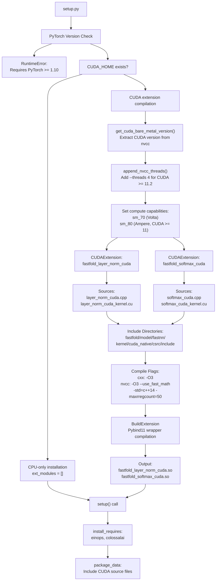
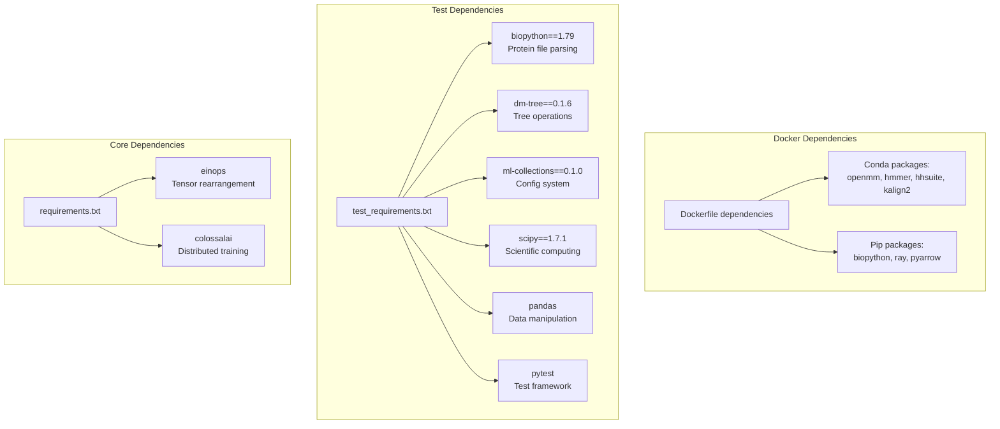
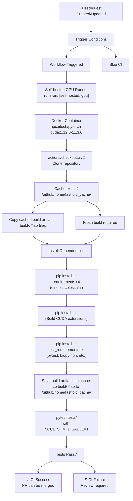
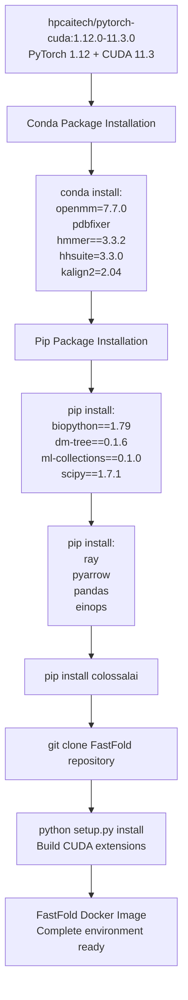

# Development and Testing

> **Relevant source files**
> * [.github/workflows/build.yml](https://github.com/hpcaitech/FastFold/blob/eba49680/.github/workflows/build.yml)
> * [docker/Dockerfile](https://github.com/hpcaitech/FastFold/blob/eba49680/docker/Dockerfile)
> * [requirements/requirements.txt](https://github.com/hpcaitech/FastFold/blob/eba49680/requirements/requirements.txt)
> * [requirements/test_requirements.txt](https://github.com/hpcaitech/FastFold/blob/eba49680/requirements/test_requirements.txt)
> * [setup.py](https://github.com/hpcaitech/FastFold/blob/eba49680/setup.py)

## Purpose and Scope

This page provides comprehensive documentation for developers contributing to FastFold, covering the build system, testing infrastructure, continuous integration pipeline, and Docker deployment. It explains how CUDA extensions are compiled, how tests are executed, and how the CI/CD workflow validates changes.

For information about the configuration system used during development, see [Configuration System](/hpcaitech/FastFold/3-configuration-system). For details on performance optimization development, see [Performance Optimizations](/hpcaitech/FastFold/8-performance-optimizations).

---

## Build System Overview

FastFold's build system manages package installation, CUDA extension compilation, and dependency resolution through a sophisticated `setup.py` configuration that conditionally compiles optimized kernels based on the development environment.

### Build Architecture



**Sources:** [setup.py L1-L143](https://github.com/hpcaitech/FastFold/blob/eba49680/setup.py#L1-L143)

### CUDA Extension Compilation

The build system conditionally compiles two critical CUDA extensions that provide fused kernel implementations:

#### Extension Configuration

| Extension | Source Files | Purpose |
| --- | --- | --- |
| `fastfold_layer_norm_cuda` | `layer_norm_cuda.cpp``layer_norm_cuda_kernel.cu` | Fused layer normalization with custom gradient computation |
| `fastfold_softmax_cuda` | `softmax_cuda.cpp``softmax_cuda_kernel.cu` | Fused softmax with warp-level reductions |

**Implementation Details:**

The `cuda_ext_helper()` function [setup.py L89-L103](https://github.com/hpcaitech/FastFold/blob/eba49680/setup.py#L89-L103)

 constructs `CUDAExtension` objects with:

* **Source Paths:** Resolved relative to `fastfold/model/fastnn/kernel/cuda_native/csrc/`
* **Include Directories:** Points to `fastfold/model/fastnn/kernel/cuda_native/csrc/include`
* **C++ Flags:** `-O3` optimization with version compatibility macros (`VERSION_GE_1_1`, `VERSION_GE_1_3`, `VERSION_GE_1_5`)
* **NVCC Flags:** * `-O3 --use_fast_math` for aggressive optimization * `-std=c++14` for modern C++ features * `-maxrregcount=50` to limit register usage * `-U__CUDA_NO_HALF_OPERATORS__` to enable FP16 operations * `--expt-relaxed-constexpr --expt-extended-lambda` for advanced CUDA C++

**Sources:** [setup.py L89-L126](https://github.com/hpcaitech/FastFold/blob/eba49680/setup.py#L89-L126)

#### Compute Capability Targeting

The build system automatically configures CUDA architectures based on detected CUDA version:

```markdown
# From setup.py:107-111cc_flag = ['-gencode', 'arch=compute_70,code=sm_70']  # Volta (V100)if int(bare_metal_major) >= 11:    cc_flag.append('-gencode')    cc_flag.append('arch=compute_80,code=sm_80')  # Ampere (A100)
```

This ensures binaries are compatible with both Volta (compute capability 7.0) and Ampere (8.0) architectures.

**Sources:** [setup.py L107-L111](https://github.com/hpcaitech/FastFold/blob/eba49680/setup.py#L107-L111)

### Version Compatibility Checks

The build system enforces strict version requirements to prevent runtime errors:

#### PyTorch Version Validation

```markdown
# From setup.py:72-74if TORCH_MAJOR < 1 or (TORCH_MAJOR == 1 and TORCH_MINOR < 10):    raise RuntimeError("FastFold requires Pytorch 1.10 or newer.")
```

**Minimum Requirements:**

* PyTorch >= 1.10.0
* CUDA Toolkit (if building extensions)
* Python >= 3.7 (implicit from PyTorch requirement)

**Sources:** [setup.py L68-L74](https://github.com/hpcaitech/FastFold/blob/eba49680/setup.py#L68-L74)

#### CUDA Version Extraction

The `get_cuda_bare_metal_version()` function [setup.py L12-L20](https://github.com/hpcaitech/FastFold/blob/eba49680/setup.py#L12-L20)

 extracts CUDA version by invoking:

```
$CUDA_HOME/bin/nvcc -V
```

This ensures the CUDA toolkit version matches PyTorch's CUDA version, preventing ABI incompatibilities.

**Sources:** [setup.py L12-L20](https://github.com/hpcaitech/FastFold/blob/eba49680/setup.py#L12-L20)

### Build Optimization

#### Parallel Compilation

For CUDA 11.2+, the build system enables multi-threaded compilation:

```python
# From setup.py:41-45def append_nvcc_threads(nvcc_extra_args):    if int(bare_metal_major) >= 11 and int(bare_metal_minor) >= 2:        return nvcc_extra_args + ["--threads", "4"]
```

This reduces compilation time by utilizing multiple CPU cores during kernel compilation.

**Sources:** [setup.py L41-L45](https://github.com/hpcaitech/FastFold/blob/eba49680/setup.py#L41-L45)

---

## Dependency Management

FastFold separates dependencies into multiple requirement files for different usage scenarios:

### Dependency Structure



**Sources:** [requirements/requirements.txt L1-L2](https://github.com/hpcaitech/FastFold/blob/eba49680/requirements/requirements.txt#L1-L2)

 [requirements/test_requirements.txt L1-L6](https://github.com/hpcaitech/FastFold/blob/eba49680/requirements/test_requirements.txt#L1-L6)

### Installation Workflow

#### Standard Installation

```markdown
# Clone repositorygit clone https://github.com/hpcaitech/FastFold.gitcd FastFold # Install core dependenciespip install -r requirements/requirements.txt # Build and install FastFold with CUDA extensionspip install -e .
```

The `-e` flag installs in editable mode, allowing source modifications without reinstallation.

#### Development Installation

```markdown
# Install test dependenciespip install -r requirements/test_requirements.txt # Install with editable mode for developmentpip install -e .
```

**Sources:** [setup.py L129-L143](https://github.com/hpcaitech/FastFold/blob/eba49680/setup.py#L129-L143)

 [requirements/requirements.txt L1-L2](https://github.com/hpcaitech/FastFold/blob/eba49680/requirements/requirements.txt#L1-L2)

 [requirements/test_requirements.txt L1-L6](https://github.com/hpcaitech/FastFold/blob/eba49680/requirements/test_requirements.txt#L1-L6)

---

## Testing Framework

FastFold uses pytest for unit and integration testing, validating model correctness, kernel performance, and distributed operations.

### Test Organization

```mermaid
flowchart TD

TestDir["tests/"]
ModelTests["Model Tests<br>AlphaFold architecture validation"]
KernelTests["Kernel Tests<br>CUDA operation correctness"]
DistTests["Distribution Tests<br>DAP and communication primitives"]
DataTests["Data Pipeline Tests<br>Feature generation validation"]
Forward["Forward pass output shapes"]
Backward["Gradient correctness"]
Recycling["Recycling mechanism"]
Softmax["Softmax kernel vs PyTorch"]
LayerNorm["LayerNorm kernel vs PyTorch"]
Attention["Attention core correctness"]
Gather["gather/scatter gradients"]
AllToAll["All-to-All communication"]
DAP["DAP initialization"]
MSAParsing["MSA file parsing"]
TemplateFeats["Template featurization"]
Multimer["Multimer pairing"]

TestDir --> ModelTests
TestDir --> KernelTests
TestDir --> DistTests
TestDir --> DataTests
ModelTests --> Forward
ModelTests --> Backward
ModelTests --> Recycling
KernelTests --> Softmax
KernelTests --> LayerNorm
KernelTests --> Attention
DistTests --> Gather
DistTests --> AllToAll
DistTests --> DAP
DataTests --> MSAParsing
DataTests --> TemplateFeats
DataTests --> Multimer
```



### Running Tests

#### Local Test Execution

```markdown
# Run all testspytest tests/ # Run specific test filepytest tests/test_kernel_softmax.py # Run with verbose outputpytest tests/ -v # Run with code coveragepytest tests/ --cov=fastfold --cov-report=html
```

#### Environment Configuration

Tests require specific environment variables to prevent NCCL shared memory issues:

```javascript
export NCCL_SHM_DISABLE=1PYTHONPATH=$PWD pytest tests/
```

The `NCCL_SHM_DISABLE=1` flag is critical for multi-GPU tests in containerized environments.

**Sources:** [.github/workflows/build.yml L34-L37](https://github.com/hpcaitech/FastFold/blob/eba49680/.github/workflows/build.yml#L34-L37)

### Test Requirements

The test suite depends on packages specified in `test_requirements.txt`:

| Package | Version | Purpose |
| --- | --- | --- |
| `pytest` | latest | Test execution framework |
| `biopython` | 1.79 | Protein file parsing validation |
| `dm-tree` | 0.1.6 | Tree structure operations |
| `ml-collections` | 0.1.0 | Configuration system testing |
| `scipy` | 1.7.1 | Numerical validation |
| `pandas` | latest | Data manipulation in tests |

**Sources:** [requirements/test_requirements.txt L1-L6](https://github.com/hpcaitech/FastFold/blob/eba49680/requirements/test_requirements.txt#L1-L6)

---

## Continuous Integration

FastFold uses GitHub Actions for automated testing on every pull request, leveraging self-hosted GPU runners for realistic validation.

### CI/CD Workflow Architecture



**Sources:** [.github/workflows/build.yml L1-L38](https://github.com/hpcaitech/FastFold/blob/eba49680/.github/workflows/build.yml#L1-L38)

### Trigger Conditions

The workflow executes only when ALL conditions are met:

```markdown
# From .github/workflows/build.yml:10-14if: |    github.event.pull_request.draft == false &&    github.base_ref == 'main' &&    github.event.pull_request.base.repo.full_name == 'hpcaitech/FastFold' &&    contains( github.event.pull_request.labels.*.name, 'Run Build and Test')
```

**Required Conditions:**

1. PR is not in draft status
2. Target branch is `main`
3. PR is against official `hpcaitech/FastFold` repository
4. PR has label: **"Run Build and Test"**

This gated execution prevents unnecessary GPU usage on draft PRs and external forks.

**Sources:** [.github/workflows/build.yml L10-L14](https://github.com/hpcaitech/FastFold/blob/eba49680/.github/workflows/build.yml#L10-L14)

### Container Configuration

The CI runs inside a Docker container with GPU access:

```markdown
# From .github/workflows/build.yml:16-18container:  image: hpcaitech/pytorch-cuda:1.12.0-11.3.0  options: --gpus all --rm -v /data/scratch/fastfold:/data/scratch/fastfold
```

**Container Features:**

* **Base Image:** `hpcaitech/pytorch-cuda:1.12.0-11.3.0` (PyTorch 1.12 with CUDA 11.3)
* **GPU Access:** `--gpus all` exposes all GPUs to container
* **Volume Mount:** `/data/scratch/fastfold` for persistent test data
* **Auto-Cleanup:** `--rm` removes container after execution

**Sources:** [.github/workflows/build.yml L16-L18](https://github.com/hpcaitech/FastFold/blob/eba49680/.github/workflows/build.yml#L16-L18)

### Build Caching Strategy

To accelerate CI runs, the workflow caches compiled CUDA extensions:

#### Cache Restoration

```markdown
# From .github/workflows/build.yml:27[ ! -z "$(ls -A /github/home/fastfold_cache/)" ] && \  cp -r /github/home/fastfold_cache/* /__w/FastFold/FastFold/
```

This copies previously compiled `build/` directory and `.so` files from persistent storage.

#### Cache Update

```markdown
# From .github/workflows/build.yml:31-32cp -r /__w/FastFold/FastFold/build /github/home/fastfold_cache/cp /__w/FastFold/FastFold/*.so /github/home/fastfold_cache/
```

After successful compilation, artifacts are saved for future runs.

**Performance Impact:**

* **Cold build:** ~15-20 minutes (compiling CUDA extensions)
* **Warm build:** ~3-5 minutes (using cached artifacts)

**Sources:** [.github/workflows/build.yml L27-L32](https://github.com/hpcaitech/FastFold/blob/eba49680/.github/workflows/build.yml#L27-L32)

### Test Execution

Tests run with environment configuration to prevent distributed errors:

```markdown
# From .github/workflows/build.yml:34-37PYTHONPATH=$PWD pytest testsenv:  NCCL_SHM_DISABLE: 1
```

**Environment Variables:**

* `PYTHONPATH=$PWD`: Ensures module imports resolve correctly
* `NCCL_SHM_DISABLE=1`: Disables NCCL shared memory, required for containerized GPU testing

**Sources:** [.github/workflows/build.yml L34-L37](https://github.com/hpcaitech/FastFold/blob/eba49680/.github/workflows/build.yml#L34-L37)

### Timeout Configuration

The workflow has a 40-minute timeout to prevent hung processes:

```markdown
# From .github/workflows/build.yml:19timeout-minutes: 40
```

**Sources:** [.github/workflows/build.yml L19](https://github.com/hpcaitech/FastFold/blob/eba49680/.github/workflows/build.yml#L19-L19)

---

## Docker Deployment

FastFold provides a Dockerfile for reproducible deployment with all dependencies pre-installed.

### Docker Image Structure



**Sources:** [docker/Dockerfile L1-L13](https://github.com/hpcaitech/FastFold/blob/eba49680/docker/Dockerfile#L1-L13)

### Dockerfile Breakdown

#### Base Image Selection

```markdown
# From docker/Dockerfile:1FROM hpcaitech/pytorch-cuda:1.12.0-11.3.0
```

This base provides:

* PyTorch 1.12.0
* CUDA 11.3.0
* cuDNN optimized libraries
* Ubuntu 20.04 base system

**Sources:** [docker/Dockerfile L1](https://github.com/hpcaitech/FastFold/blob/eba49680/docker/Dockerfile#L1-L1)

#### Bioinformatics Tools Installation

```markdown
# From docker/Dockerfile:3-4RUN conda install openmm=7.7.0 pdbfixer -c conda-forge -y \ && conda install hmmer==3.3.2 hhsuite=3.3.0 kalign2=2.04 -c bioconda -y
```

**Installed Tools:**

| Tool | Version | Channel | Purpose |
| --- | --- | --- | --- |
| `openmm` | 7.7.0 | conda-forge | Molecular dynamics for Amber relaxation |
| `pdbfixer` | latest | conda-forge | PDB file preprocessing |
| `hmmer` | 3.3.2 | bioconda | Sequence alignment (jackhmmer) |
| `hhsuite` | 3.3.0 | bioconda | Profile HMM searches (hhblits, hhsearch) |
| `kalign2` | 2.04 | bioconda | Multiple sequence alignment |

**Sources:** [docker/Dockerfile L3-L4](https://github.com/hpcaitech/FastFold/blob/eba49680/docker/Dockerfile#L3-L4)

#### Python Dependencies

```markdown
# From docker/Dockerfile:6-9RUN pip install biopython==1.79 dm-tree==0.1.6 ml-collections==0.1.0 \scipy==1.7.1 ray pyarrow pandas einops RUN pip install colossalai
```

These dependencies enable:

* **Data Processing:** biopython, pandas, pyarrow
* **Acceleration:** ray (workflow parallelization)
* **Model Operations:** einops (tensor manipulation)
* **Training:** colossalai (distributed optimization)
* **Configuration:** ml-collections (config system)

**Sources:** [docker/Dockerfile L6-L9](https://github.com/hpcaitech/FastFold/blob/eba49680/docker/Dockerfile#L6-L9)

#### FastFold Installation

```markdown
# From docker/Dockerfile:11-13Run git clone https://github.com/hpcaitech/FastFold.git \ && cd ./FastFold \ && python setup.py install
```

This clones the repository and builds CUDA extensions via `setup.py`.

**Sources:** [docker/Dockerfile L11-L13](https://github.com/hpcaitech/FastFold/blob/eba49680/docker/Dockerfile#L11-L13)

### Building Docker Image

```markdown
# Build image with tagdocker build -t fastfold:latest -f docker/Dockerfile . # Build with specific CUDA versiondocker build \  --build-arg BASE_IMAGE=hpcaitech/pytorch-cuda:1.11.0-11.3.0 \  -t fastfold:pytorch1.11 \  -f docker/Dockerfile .
```

### Running Docker Container

#### Interactive Development

```
docker run --gpus all -it --rm \  -v /path/to/data:/data \  fastfold:latest \  /bin/bash
```

#### Inference Execution

```
docker run --gpus all --rm \  -v /path/to/fasta:/input \  -v /path/to/output:/output \  fastfold:latest \  python inference.py \    --fasta_path /input/target.fasta \    --output_dir /output
```

**Docker Options:**

* `--gpus all`: Expose all GPUs to container
* `-it`: Interactive terminal
* `--rm`: Auto-remove container after exit
* `-v`: Mount host directories

**Sources:** [docker/Dockerfile L1-L13](https://github.com/hpcaitech/FastFold/blob/eba49680/docker/Dockerfile#L1-L13)

---

## Development Best Practices

### Pre-commit Checks

Before submitting a pull request:

1. **Run tests locally:** ``` NCCL_SHM_DISABLE=1 pytest tests/ -v ```
2. **Verify CUDA extensions compile:** ``` python setup.py build_ext --inplace ```
3. **Check code formatting:** ```markdown # Install formatterspip install black isort # Format codeblack fastfold/isort fastfold/ ```
4. **Add "Run Build and Test" label** to PR to trigger CI

### Debugging Build Issues

#### CUDA Extension Compilation Failures

If CUDA extensions fail to compile:

```javascript
# Check CUDA installationecho $CUDA_HOMEnvcc --version # Check PyTorch CUDA versionpython -c "import torch; print(torch.version.cuda)" # Verify versions matchpython setup.py build_ext --verbose
```

#### Missing Dependencies

If tests fail due to missing packages:

```go
# Verify all requirements installedpip install -r requirements/requirements.txtpip install -r requirements/test_requirements.txt # Check package versionspip list | grep -E "(torch|colossalai|einops)"
```

#### NCCL Errors in Tests

If distributed tests fail with NCCL errors:

```javascript
# Disable shared memoryexport NCCL_SHM_DISABLE=1 # Use alternative transportexport NCCL_P2P_DISABLE=1 # Increase timeoutexport NCCL_ASYNC_ERROR_HANDLING=1
```

**Sources:** [.github/workflows/build.yml L34-L37](https://github.com/hpcaitech/FastFold/blob/eba49680/.github/workflows/build.yml#L34-L37)

 [setup.py L1-L143](https://github.com/hpcaitech/FastFold/blob/eba49680/setup.py#L1-L143)

---

## Summary

FastFold's development infrastructure provides:

1. **Flexible Build System:** Conditional CUDA extension compilation with version checks and optimization flags
2. **Comprehensive Testing:** pytest-based validation of models, kernels, and distributed operations
3. **Automated CI/CD:** GitHub Actions workflow with GPU runners and build caching for rapid validation
4. **Reproducible Deployment:** Docker images with complete environment including bioinformatics tools

The system ensures code quality through automated testing while optimizing developer productivity via build caching and containerization.

**Sources:** [setup.py L1-L143](https://github.com/hpcaitech/FastFold/blob/eba49680/setup.py#L1-L143)

 [.github/workflows/build.yml L1-L38](https://github.com/hpcaitech/FastFold/blob/eba49680/.github/workflows/build.yml#L1-L38)

 [docker/Dockerfile L1-L13](https://github.com/hpcaitech/FastFold/blob/eba49680/docker/Dockerfile#L1-L13)

 [requirements/requirements.txt L1-L2](https://github.com/hpcaitech/FastFold/blob/eba49680/requirements/requirements.txt#L1-L2)

 [requirements/test_requirements.txt L1-L6](https://github.com/hpcaitech/FastFold/blob/eba49680/requirements/test_requirements.txt#L1-L6)