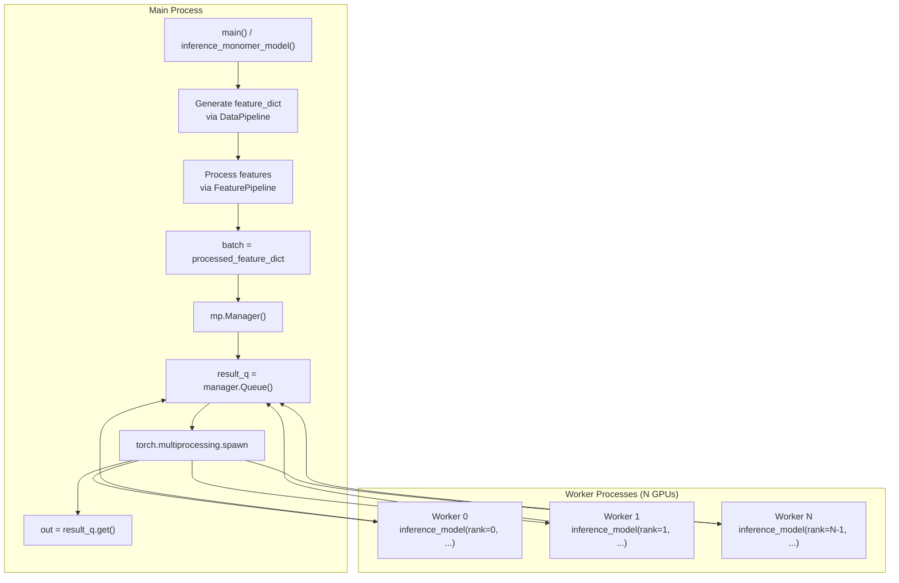
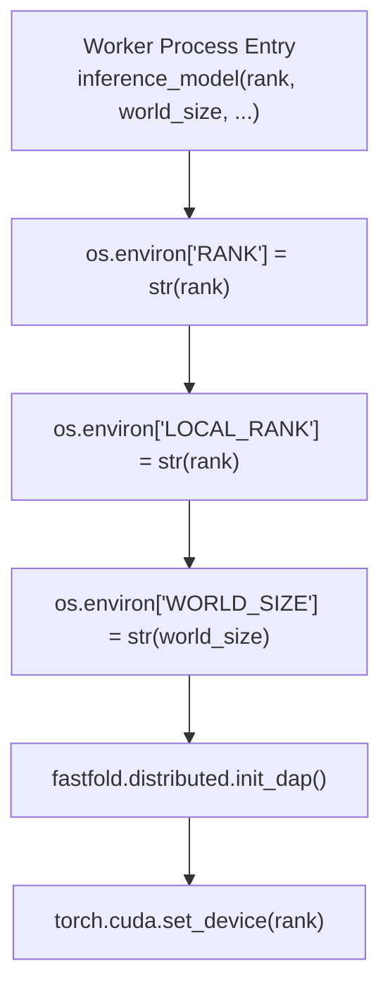
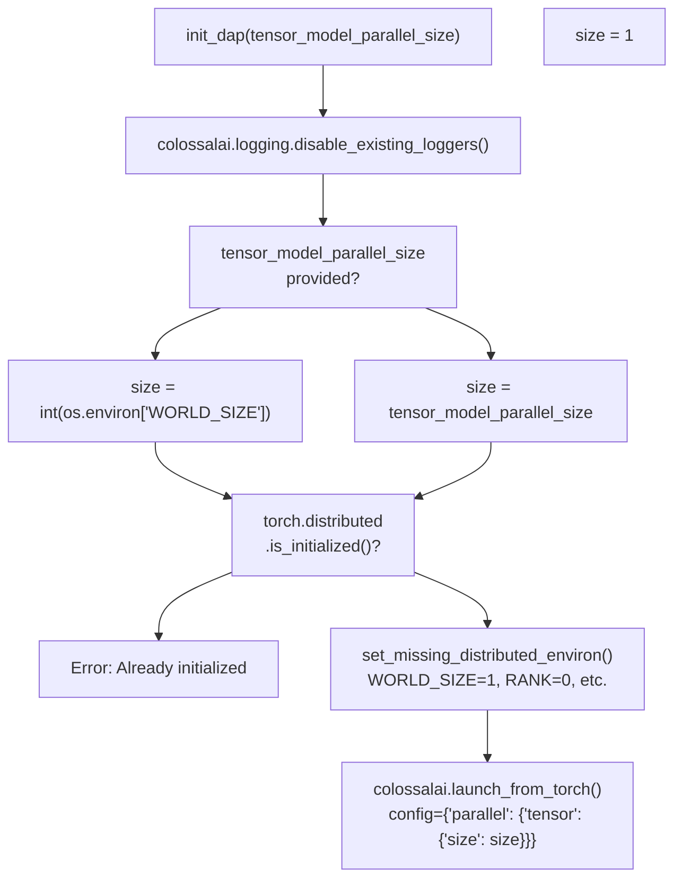
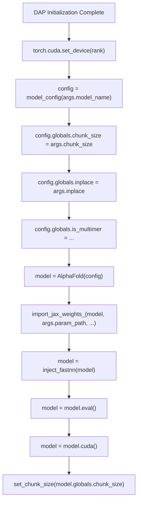
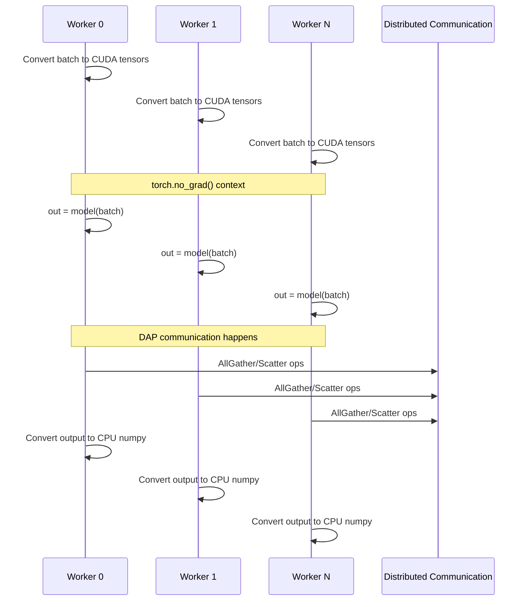
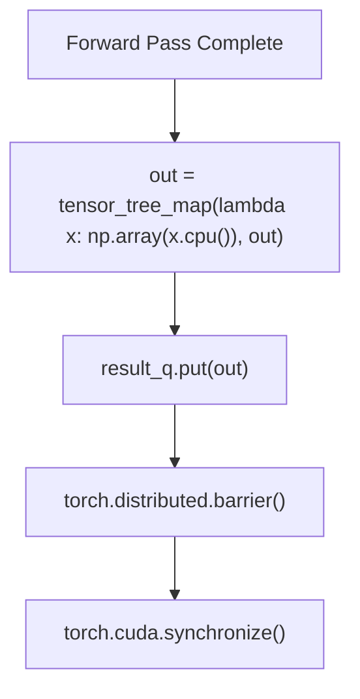
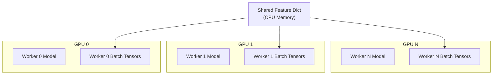

# Distributed Inference Execution

> **Relevant source files**
> * [README.md](https://github.com/hpcaitech/FastFold/blob/eba49680/README.md?plain=1)
> * [benchmark/perf.py](https://github.com/hpcaitech/FastFold/blob/eba49680/benchmark/perf.py)
> * [environment.yml](https://github.com/hpcaitech/FastFold/blob/eba49680/environment.yml)
> * [fastfold/distributed/__init__.py](https://github.com/hpcaitech/FastFold/blob/eba49680/fastfold/distributed/__init__.py)
> * [fastfold/distributed/comm.py](https://github.com/hpcaitech/FastFold/blob/eba49680/fastfold/distributed/comm.py)
> * [fastfold/distributed/core.py](https://github.com/hpcaitech/FastFold/blob/eba49680/fastfold/distributed/core.py)
> * [fastfold/model/__init__.py](https://github.com/hpcaitech/FastFold/blob/eba49680/fastfold/model/__init__.py)
> * [inference.py](https://github.com/hpcaitech/FastFold/blob/eba49680/inference.py)

## Purpose and Scope

This document explains how FastFold distributes inference workloads across multiple GPUs using process-based parallelism. It covers the multi-GPU spawning mechanism via `torch.multiprocessing.spawn`, Dynamic Axial Parallelism (DAP) initialization in each worker process, and result collection.

For details on DAP's sequence sharding and communication primitives, see [Dynamic Axial Parallelism (DAP)](/hpcaitech/FastFold/8.1-dynamic-axial-parallelism-(dap)). For feature generation before inference, see [Feature Generation for Inference](/hpcaitech/FastFold/5.1-feature-generation-for-inference). For training's distributed execution strategy, see [ColossalAI Integration](/hpcaitech/FastFold/7.2-colossalai-integration).

**Sources:** [inference.py L1-L557](https://github.com/hpcaitech/FastFold/blob/eba49680/inference.py#L1-L557)

 [README.md L115-L136](https://github.com/hpcaitech/FastFold/blob/eba49680/README.md?plain=1#L115-L136)

---

## Overview

FastFold's inference system uses **process-based data parallelism** to distribute predictions across multiple GPUs. Unlike training which uses ColossalAI's unified engine, inference spawns independent worker processes per GPU, each running the full model on the same input features. This architecture enables:

* **Sequence sharding** via Dynamic Axial Parallelism (DAP) to break single-GPU memory limits
* **Independent execution** with minimal inter-process communication
* **Simplified deployment** without complex distributed training infrastructure

The inference workflow follows this pattern:

1. Main process generates features from raw data (MSA alignments, templates)
2. Main process spawns N worker processes (one per GPU)
3. Each worker initializes DAP and loads the model
4. Workers execute inference in parallel with synchronized communication
5. Main process collects results via multiprocessing Queue

**Sources:** [inference.py L122-L160](https://github.com/hpcaitech/FastFold/blob/eba49680/inference.py#L122-L160)

 [inference.py L441-L443](https://github.com/hpcaitech/FastFold/blob/eba49680/inference.py#L441-L443)

---

## Process Spawning Architecture

### Multiprocessing Spawn Mechanism

FastFold uses `torch.multiprocessing.spawn` to create GPU worker processes. The main process coordinates spawning and result collection:



**Diagram: Process Spawning Workflow**

The spawning occurs in both monomer and multimer inference modes:

| Code Location | Purpose |
| --- | --- |
| [inference.py L441-L443](https://github.com/hpcaitech/FastFold/blob/eba49680/inference.py#L441-L443) | Monomer spawn with `nprocs=args.gpus` |
| [inference.py L293](https://github.com/hpcaitech/FastFold/blob/eba49680/inference.py#L293-L293) | Multimer spawn with `nprocs=args.gpus` |
| [inference.py L122](https://github.com/hpcaitech/FastFold/blob/eba49680/inference.py#L122-L122) | Worker entry point `inference_model` |

**Sources:** [inference.py L440-L448](https://github.com/hpcaitech/FastFold/blob/eba49680/inference.py#L440-L448)

 [inference.py L291-L295](https://github.com/hpcaitech/FastFold/blob/eba49680/inference.py#L291-L295)

### Worker Function Signature

Each spawned worker executes the `inference_model` function with this signature:

```python
def inference_model(rank, world_size, result_q, batch, args):    # rank: GPU index (0 to world_size-1)    # world_size: Total number of GPUs    # result_q: Multiprocessing queue for result collection    # batch: Preprocessed feature dictionary    # args: Inference configuration arguments
```

**Sources:** [inference.py L122](https://github.com/hpcaitech/FastFold/blob/eba49680/inference.py#L122-L122)

---

## DAP Initialization Flow

### Environment Variable Setup

Each worker process must set distributed environment variables before calling `init_dap`. The `inference_model` function configures these at entry:



**Diagram: Worker Initialization Sequence**

**Sources:** [inference.py L123-L128](https://github.com/hpcaitech/FastFold/blob/eba49680/inference.py#L123-L128)

### init_dap Implementation

The `init_dap` function in [fastfold/distributed/core.py L17-L41](https://github.com/hpcaitech/FastFold/blob/eba49680/fastfold/distributed/core.py#L17-L41)

 performs the following:

| Step | Action | Code Reference |
| --- | --- | --- |
| 1. Disable logging | Suppress ColossalAI verbose output | [core.py L18](https://github.com/hpcaitech/FastFold/blob/eba49680/core.py#L18-L18) |
| 2. Determine parallelism size | Use `WORLD_SIZE` env var or default to 1 | [core.py L20-L24](https://github.com/hpcaitech/FastFold/blob/eba49680/core.py#L20-L24) |
| 3. Check initialization state | Prevent double-initialization | [core.py L26-L30](https://github.com/hpcaitech/FastFold/blob/eba49680/core.py#L26-L30) |
| 4. Set default env vars | Fallback for single-device launch | [core.py L33-L37](https://github.com/hpcaitech/FastFold/blob/eba49680/core.py#L33-L37) |
| 5. Launch ColossalAI | Initialize process groups with tensor parallelism | [core.py L39-L40](https://github.com/hpcaitech/FastFold/blob/eba49680/core.py#L39-L40) |



**Diagram: init_dap Execution Flow**

**Sources:** [fastfold/distributed/core.py L17-L41](https://github.com/hpcaitech/FastFold/blob/eba49680/fastfold/distributed/core.py#L17-L41)

### Default Environment Variables

For single-device launches, `init_dap` sets missing environment variables:

```markdown
# From core.py:12-14, 33-37set_missing_distributed_environ('WORLD_SIZE', 1)set_missing_distributed_environ('RANK', 0)set_missing_distributed_environ('LOCAL_RANK', 0)set_missing_distributed_environ('MASTER_ADDR', "localhost")set_missing_distributed_environ('MASTER_PORT', 18417)
```

This allows code to run identically in single-GPU and multi-GPU modes without conditional logic.

**Sources:** [fastfold/distributed/core.py L12-L14](https://github.com/hpcaitech/FastFold/blob/eba49680/fastfold/distributed/core.py#L12-L14)

 [fastfold/distributed/core.py L33-L37](https://github.com/hpcaitech/FastFold/blob/eba49680/fastfold/distributed/core.py#L33-L37)

---

## Worker Execution Flow

### Model Setup and Injection

After DAP initialization, each worker loads the model and applies optimizations:



**Diagram: Worker Model Initialization**

| Configuration | Purpose | Code Reference |
| --- | --- | --- |
| `chunk_size` | Memory-compute tradeoff for large sequences | [inference.py L130-L131](https://github.com/hpcaitech/FastFold/blob/eba49680/inference.py#L130-L131) |
| `inplace` | Enable in-place operations to reduce memory | [inference.py L136](https://github.com/hpcaitech/FastFold/blob/eba49680/inference.py#L136-L136) |
| `is_multimer` | Configure multimer-specific features | [inference.py L137](https://github.com/hpcaitech/FastFold/blob/eba49680/inference.py#L137-L137) |
| `inject_fastnn` | Replace Evoformer with optimized version | [inference.py L141](https://github.com/hpcaitech/FastFold/blob/eba49680/inference.py#L141-L141) |

**Sources:** [inference.py L128-L145](https://github.com/hpcaitech/FastFold/blob/eba49680/inference.py#L128-L145)

### Forward Pass Execution

Each worker executes the forward pass independently with synchronized communication:



**Diagram: Worker Forward Pass with DAP Communication**

**Sources:** [inference.py L147-L154](https://github.com/hpcaitech/FastFold/blob/eba49680/inference.py#L147-L154)

---

## Communication and Synchronization

### Barrier Synchronization

Workers synchronize at completion using PyTorch distributed barriers:



**Diagram: Worker Completion Synchronization**

The barrier ensures all workers complete before any process exits. Only one worker (rank 0) puts results in the queue:

| Operation | Purpose | Code Reference |
| --- | --- | --- |
| `tensor_tree_map` | Recursively convert tensors to numpy | [inference.py L154](https://github.com/hpcaitech/FastFold/blob/eba49680/inference.py#L154-L154) |
| `result_q.put(out)` | Send results to main process | [inference.py L156](https://github.com/hpcaitech/FastFold/blob/eba49680/inference.py#L156-L156) |
| `torch.distributed.barrier()` | Wait for all workers | [inference.py L158](https://github.com/hpcaitech/FastFold/blob/eba49680/inference.py#L158-L158) |
| `torch.cuda.synchronize()` | Ensure CUDA operations complete | [inference.py L159](https://github.com/hpcaitech/FastFold/blob/eba49680/inference.py#L159-L159) |

**Sources:** [inference.py L154-L159](https://github.com/hpcaitech/FastFold/blob/eba49680/inference.py#L154-L159)

### Result Collection

The main process retrieves results from the queue after all workers spawn:

```markdown
# From inference.py:441-445 (monomer) and 293-295 (multimer)manager = mp.Manager()result_q = manager.Queue()torch.multiprocessing.spawn(inference_model, nprocs=args.gpus, args=(args.gpus, result_q, batch, args))out = result_q.get()
```

The `spawn` call blocks until all workers exit. Since only rank 0 puts results, `result_q.get()` retrieves the single output dictionary.

**Sources:** [inference.py L441-L445](https://github.com/hpcaitech/FastFold/blob/eba49680/inference.py#L441-L445)

 [inference.py L293-L295](https://github.com/hpcaitech/FastFold/blob/eba49680/inference.py#L293-L295)

---

## Memory and Device Management

### Per-Worker GPU Assignment

Each worker is assigned to a specific GPU via `torch.cuda.set_device(rank)`:



**Diagram: GPU Memory Allocation per Worker**

### Batch Tensor Transfer

Input features are transferred from CPU to GPU in each worker:

```css
# From inference.py:148batch = {k: torch.as_tensor(v).cuda() for k, v in batch.items()}
```

This creates independent GPU copies, enabling concurrent execution without data races.

**Sources:** [inference.py L128](https://github.com/hpcaitech/FastFold/blob/eba49680/inference.py#L128-L128)

 [inference.py L148](https://github.com/hpcaitech/FastFold/blob/eba49680/inference.py#L148-L148)

### DAP Sequence Sharding

When DAP parallelism size > 1, sequences are sharded across GPUs along the residue dimension. This is transparent to the user - `init_dap` configures the parallelism, and FastNN operations handle sharding automatically.

| Parallelism Size | Behavior | Memory Impact |
| --- | --- | --- |
| 1 | Full sequence on single GPU | Standard memory usage |
| 2+ | Sequence sharded across GPUs | ~1/N memory per GPU |

For detailed sharding mechanics, see [Dynamic Axial Parallelism (DAP)](/hpcaitech/FastFold/8.1-dynamic-axial-parallelism-(dap)).

**Sources:** [fastfold/distributed/core.py L17-L41](https://github.com/hpcaitech/FastFold/blob/eba49680/fastfold/distributed/core.py#L17-L41)

 [README.md L22-L24](https://github.com/hpcaitech/FastFold/blob/eba49680/README.md?plain=1#L22-L24)

---

## Command-Line Configuration

### GPU Count Specification

The `--gpus` argument controls the number of spawned workers:

```markdown
# Single GPU (no parallelism)python inference.py target.fasta data/pdb_mmcif/mmcif_files/ --gpus 1 ... # Dual GPU (DAP with 2-way sharding)python inference.py target.fasta data/pdb_mmcif/mmcif_files/ --gpus 2 ... # Quad GPU (DAP with 4-way sharding)python inference.py target.fasta data/pdb_mmcif/mmcif_files/ --gpus 4 ...
```

**Sources:** [README.md L115-L136](https://github.com/hpcaitech/FastFold/blob/eba49680/README.md?plain=1#L115-L136)

 [inference.py L530-L533](https://github.com/hpcaitech/FastFold/blob/eba49680/inference.py#L530-L533)

### Memory Optimization Flags

Additional flags control memory usage within each worker:

| Flag | Effect | Recommended Use Case |
| --- | --- | --- |
| `--chunk_size N` | Process tensors in chunks of size N | Long sequences (>3000 residues) |
| `--inplace` | Enable in-place tensor operations | Memory-constrained GPUs |

Example for ultra-long sequences:

```
python inference.py target.fasta data/pdb_mmcif/mmcif_files/ \    --gpus 2 \    --chunk_size 64 \    --inplace \    ...
```

**Sources:** [README.md L141-L164](https://github.com/hpcaitech/FastFold/blob/eba49680/README.md?plain=1#L141-L164)

 [inference.py L117-L119](https://github.com/hpcaitech/FastFold/blob/eba49680/inference.py#L117-L119)

---

## Workflow Comparison: Monomer vs Multimer

Both monomer and multimer modes use identical spawning mechanisms with different feature generation:

| Aspect | Monomer | Multimer |
| --- | --- | --- |
| **Feature Generation** | `DataPipeline` | `DataPipelineMultimer` |
| **Spawn Call** | [inference.py L441-L443](https://github.com/hpcaitech/FastFold/blob/eba49680/inference.py#L441-L443) | [inference.py L293](https://github.com/hpcaitech/FastFold/blob/eba49680/inference.py#L293-L293) |
| **Worker Function** | `inference_model` (same) | `inference_model` (same) |
| **DAP Initialization** | `init_dap()` (same) | `init_dap()` (same) |
| **Model Config** | `is_multimer=False` | `is_multimer=True` |

The distributed execution layer is mode-agnostic - all differences occur in preprocessing and model architecture.

**Sources:** [inference.py L162-L167](https://github.com/hpcaitech/FastFold/blob/eba49680/inference.py#L162-L167)

 [inference.py L340-L481](https://github.com/hpcaitech/FastFold/blob/eba49680/inference.py#L340-L481)

 [inference.py L169-L338](https://github.com/hpcaitech/FastFold/blob/eba49680/inference.py#L169-L338)

---

## Performance Characteristics

### Scaling Behavior

| Configuration | Expected Speedup | Memory per GPU | Use Case |
| --- | --- | --- | --- |
| 1 GPU | 1x (baseline) | 100% | Short sequences (<3K residues) |
| 2 GPUs (DAP) | ~2x | ~50% | Medium sequences (3K-6K residues) |
| 4 GPUs (DAP) | ~3.5x | ~25% | Long sequences (6K-10K+ residues) |

DAP enables inference on sequences that exceed single-GPU memory capacity. The README notes that 10,000+ residue sequences are possible with appropriate chunking.

**Sources:** [README.md L29](https://github.com/hpcaitech/FastFold/blob/eba49680/README.md?plain=1#L29-L29)

 [README.md L141-L164](https://github.com/hpcaitech/FastFold/blob/eba49680/README.md?plain=1#L141-L164)

### Communication Overhead

Process-based parallelism introduces minimal overhead compared to training's tensor parallelism:

* **Startup**: One-time `spawn` and `init_dap` cost (~1-2 seconds)
* **Runtime**: DAP AllGather/Scatter operations (overlapped with computation)
* **Shutdown**: Barrier synchronization (~100ms)

The stateless nature of inference enables efficient horizontal scaling without complex state management.

**Sources:** [inference.py L122-L160](https://github.com/hpcaitech/FastFold/blob/eba49680/inference.py#L122-L160)