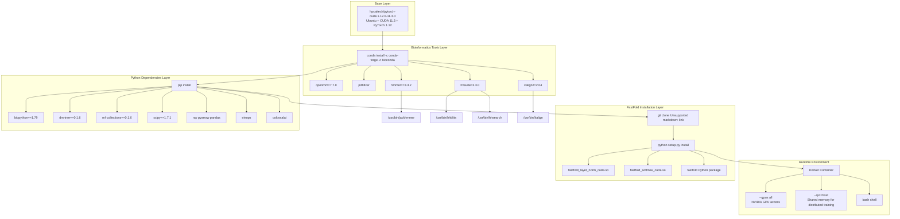
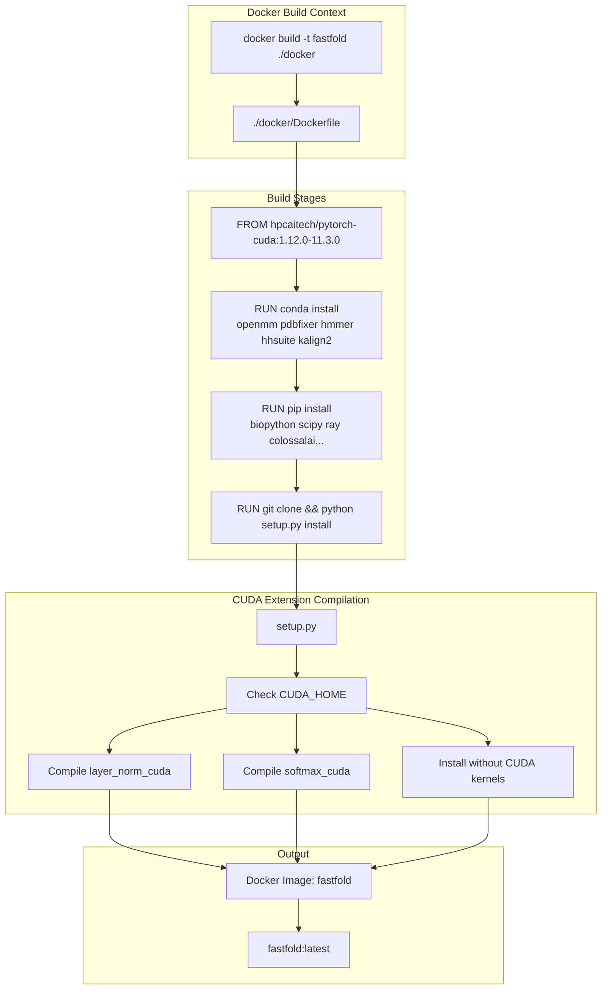

# Docker Deployment

> **Relevant source files**
> * [README.md](https://github.com/hpcaitech/FastFold/blob/eba49680/README.md?plain=1)
> * [docker/Dockerfile](https://github.com/hpcaitech/FastFold/blob/eba49680/docker/Dockerfile)
> * [environment.yml](https://github.com/hpcaitech/FastFold/blob/eba49680/environment.yml)
> * [inference.py](https://github.com/hpcaitech/FastFold/blob/eba49680/inference.py)
> * [setup.py](https://github.com/hpcaitech/FastFold/blob/eba49680/setup.py)

This page documents FastFold's Docker containerization strategy for creating reproducible execution environments. It covers the Dockerfile structure, build process, container runtime configuration, and integration with the broader development workflow. For general installation instructions including local conda setup, see [Installation](/hpcaitech/FastFold/2.1-installation). For information about the build system and CUDA extension compilation, see [Build System](/hpcaitech/FastFold/10.1-build-system).

## Overview

FastFold provides a containerized deployment option via Docker to ensure reproducible environments across different platforms. The Docker image bundles:

* PyTorch 1.12.0 with CUDA 11.3.0
* Bioinformatics tools (jackhmmer, hhblits, hhsearch, kalign)
* Python dependencies (colossalai, ray, biopython, etc.)
* Compiled CUDA extensions (layer_norm, softmax kernels)

**Sources:** [docker/Dockerfile L1-L14](https://github.com/hpcaitech/FastFold/blob/eba49680/docker/Dockerfile#L1-L14)

 [README.md L63-L78](https://github.com/hpcaitech/FastFold/blob/eba49680/README.md?plain=1#L63-L78)

## Docker Image Architecture

The following diagram illustrates the layered structure of the FastFold Docker image and its build process:



**Diagram: Docker Image Layer Architecture**

This diagram shows the four-layer build process from base image to runtime container. Each layer adds specific capabilities: the base provides CUDA and PyTorch, bioinformatics tools enable MSA/template search, Python dependencies provide data processing and training infrastructure, and the FastFold installation compiles CUDA kernels and installs the package.

**Sources:** [docker/Dockerfile L1-L14](https://github.com/hpcaitech/FastFold/blob/eba49680/docker/Dockerfile#L1-L14)

 [setup.py L86-L143](https://github.com/hpcaitech/FastFold/blob/eba49680/setup.py#L86-L143)

## Dockerfile Structure

The Dockerfile implements a multi-stage build process with clear separation of concerns:

### Base Image Selection

[docker/Dockerfile L1](https://github.com/hpcaitech/FastFold/blob/eba49680/docker/Dockerfile#L1-L1)

```dockerfile
FROM hpcaitech/pytorch-cuda:1.12.0-11.3.0
```

The base image `hpcaitech/pytorch-cuda:1.12.0-11.3.0` provides:

* Ubuntu Linux environment
* NVIDIA CUDA 11.3.0 toolkit
* PyTorch 1.12.0 with CUDA support
* cuDNN and NCCL libraries for distributed training

This base is specifically chosen for compatibility with FastFold's CUDA extension requirements [setup.py L72-L74](https://github.com/hpcaitech/FastFold/blob/eba49680/setup.py#L72-L74)

**Sources:** [docker/Dockerfile L1](https://github.com/hpcaitech/FastFold/blob/eba49680/docker/Dockerfile#L1-L1)

### Bioinformatics Tools Installation

[docker/Dockerfile L3-L4](https://github.com/hpcaitech/FastFold/blob/eba49680/docker/Dockerfile#L3-L4)

```dockerfile
RUN conda install openmm=7.7.0 pdbfixer -c conda-forge -y \
 && conda install hmmer==3.3.2 hhsuite=3.3.0 kalign2=2.04 -c bioconda -y
```

This layer installs sequence alignment and structure refinement tools:

| Tool | Version | Purpose | Binary Location |
| --- | --- | --- | --- |
| `openmm` | 7.7.0 | Molecular dynamics for AmberRelaxation | N/A (Python library) |
| `pdbfixer` | Latest | Structure cleanup before relaxation | N/A (Python library) |
| `hmmer` | 3.3.2 | jackhmmer for MSA generation | `/usr/bin/jackhmmer` |
| `hhsuite` | 3.3.0 | hhblits/hhsearch for templates | `/usr/bin/hhblits`, `/usr/bin/hhsearch` |
| `kalign2` | 2.04 | Multiple sequence alignment | `/usr/bin/kalign` |

These tools are required by `AlignmentRunner` [inference.py L414-L425](https://github.com/hpcaitech/FastFold/blob/eba49680/inference.py#L414-L425)

 and `DataPipeline` [inference.py L344-L351](https://github.com/hpcaitech/FastFold/blob/eba49680/inference.py#L344-L351)

 for data preprocessing.

**Sources:** [docker/Dockerfile L3-L4](https://github.com/hpcaitech/FastFold/blob/eba49680/docker/Dockerfile#L3-L4)

 [inference.py L104-L109](https://github.com/hpcaitech/FastFold/blob/eba49680/inference.py#L104-L109)

### Python Dependencies Installation

[docker/Dockerfile L6-L9](https://github.com/hpcaitech/FastFold/blob/eba49680/docker/Dockerfile#L6-L9)

```dockerfile
RUN pip install biopython==1.79 dm-tree==0.1.6 ml-collections==0.1.0 \
scipy==1.7.1 ray pyarrow pandas einops

RUN pip install colossalai
```

Python package installation breakdown:

| Package | Version | Usage in FastFold |
| --- | --- | --- |
| `biopython` | 1.79 | PDB/mmCIF parsing, sequence I/O |
| `dm-tree` | 0.1.6 | Nested data structure utilities |
| `ml-collections` | 0.1.0 | Configuration management (`ConfigDict`) |
| `scipy` | 1.7.1 | Numerical operations |
| `ray` | 2.0.0 | Workflow acceleration (3x speedup) |
| `pyarrow` | Latest | Ray serialization backend |
| `pandas` | Latest | Data manipulation in workflows |
| `einops` | Latest | Tensor shape transformations |
| `colossalai` | Latest | Distributed training engine |

The `colossalai` package is installed separately to ensure it uses the latest compatible version for the PyTorch installation.

**Sources:** [docker/Dockerfile L6-L9](https://github.com/hpcaitech/FastFold/blob/eba49680/docker/Dockerfile#L6-L9)

 [environment.yml L7-L20](https://github.com/hpcaitech/FastFold/blob/eba49680/environment.yml#L7-L20)

### FastFold Package Installation

[docker/Dockerfile L11-L13](https://github.com/hpcaitech/FastFold/blob/eba49680/docker/Dockerfile#L11-L13)

```
Run git clone https://github.com/hpcaitech/FastFold.git \
 && cd ./FastFold \
 && python setup.py install
```

This final layer clones the FastFold repository and runs `setup.py install`, which:

1. Detects CUDA availability and version [setup.py L86-L87](https://github.com/hpcaitech/FastFold/blob/eba49680/setup.py#L86-L87)
2. Compiles CUDA extensions if `CUDA_HOME` is set: * `fastfold_layer_norm_cuda` from [fastfold/model/fastnn/kernel/cuda_native/csrc/layer_norm_cuda.cpp](https://github.com/hpcaitech/FastFold/blob/eba49680/fastfold/model/fastnn/kernel/cuda_native/csrc/layer_norm_cuda.cpp)  and [layer_norm_cuda_kernel.cu](https://github.com/hpcaitech/FastFold/blob/eba49680/layer_norm_cuda_kernel.cu) * `fastfold_softmax_cuda` from [softmax_cuda.cpp](https://github.com/hpcaitech/FastFold/blob/eba49680/softmax_cuda.cpp)  and [softmax_cuda_kernel.cu](https://github.com/hpcaitech/FastFold/blob/eba49680/softmax_cuda_kernel.cu)
3. Installs the `fastfold` Python package with compiled extensions

The build requires GPU support during `docker build` because CUDA extension compilation queries GPU compute capabilities.

**Sources:** [docker/Dockerfile L11-L13](https://github.com/hpcaitech/FastFold/blob/eba49680/docker/Dockerfile#L11-L13)

 [setup.py L89-L125](https://github.com/hpcaitech/FastFold/blob/eba49680/setup.py#L89-L125)

## Building the Docker Image

### Build Requirements

**GPU Support During Build:** FastFold's CUDA extensions compile with architecture-specific optimizations. The build process requires NVIDIA Docker Runtime as the default runtime.

Configure Docker to use NVIDIA runtime by editing `/etc/docker/daemon.json`:

```json
{  "default-runtime": "nvidia",  "runtimes": {    "nvidia": {      "path": "nvidia-container-runtime",      "runtimeArgs": []    }  }}
```

Restart Docker after configuration changes.

**Sources:** [README.md L68](https://github.com/hpcaitech/FastFold/blob/eba49680/README.md?plain=1#L68-L68)

### Build Command

From the FastFold repository root:

```
cd FastFolddocker build -t fastfold ./docker
```

Build process stages:

1. Pull base image `hpcaitech/pytorch-cuda:1.12.0-11.3.0` (~8GB)
2. Install conda packages (~2GB, 5-10 minutes)
3. Install pip packages (~1GB, 2-5 minutes)
4. Clone and build FastFold (~500MB, 5-10 minutes with CUDA compilation)

Total image size: ~12-15GB  

Total build time: ~15-30 minutes (depending on network and CPU)

**Sources:** [README.md L66-L73](https://github.com/hpcaitech/FastFold/blob/eba49680/README.md?plain=1#L66-L73)

### Build Process Diagram



**Diagram: Docker Build Process Flow**

This diagram illustrates the sequential build stages and the CUDA extension compilation path. The `setup.py` script conditionally compiles CUDA kernels based on `CUDA_HOME` availability, ensuring the build succeeds even without GPU support (though CUDA kernels are required for optimal performance).

**Sources:** [docker/Dockerfile L1-L14](https://github.com/hpcaitech/FastFold/blob/eba49680/docker/Dockerfile#L1-L14)

 [setup.py L86-L127](https://github.com/hpcaitech/FastFold/blob/eba49680/setup.py#L86-L127)

 [README.md L66-L73](https://github.com/hpcaitech/FastFold/blob/eba49680/README.md?plain=1#L66-L73)

## Running Docker Containers

### Basic Container Execution

```
docker run -ti --gpus all --rm --ipc=host fastfold bash
```

Runtime flag explanations:

| Flag | Purpose |
| --- | --- |
| `-ti` | Interactive terminal with TTY |
| `--gpus all` | Expose all NVIDIA GPUs to container |
| `--rm` | Remove container on exit |
| `--ipc=host` | Use host IPC namespace for shared memory |
| `fastfold` | Image name |
| `bash` | Entry point command |

The `--ipc=host` flag is critical for distributed training and inference because PyTorch's multiprocessing and NCCL use shared memory for inter-process communication [inference.py L293](https://github.com/hpcaitech/FastFold/blob/eba49680/inference.py#L293-L293)

**Sources:** [README.md L76-L78](https://github.com/hpcaitech/FastFold/blob/eba49680/README.md?plain=1#L76-L78)

### Running Inference in Container

After starting the container, inference can be executed using the standard `inference.py` workflow:

```markdown
# Inside containerpython inference.py target.fasta /path/to/mmcif_files/ \    --output_dir ./outputs/ \    --gpus 2 \    --uniref90_database_path /data/uniref90/uniref90.fasta \    --mgnify_database_path /data/mgnify/mgy_clusters_2022_05.fa \    --pdb70_database_path /data/pdb70/pdb70 \    --uniref30_database_path /data/uniref30/UniRef30_2021_03 \    --bfd_database_path /data/bfd/bfd_metaclust_clu_complete_id30_c90_final_seq.sorted_opt \    --jackhmmer_binary_path $(which jackhmmer) \    --hhblits_binary_path $(which hhblits) \    --hhsearch_binary_path $(which hhsearch) \    --kalign_binary_path $(which kalign) \    --enable_workflow \    --inplace
```

Database paths must be mounted as volumes when starting the container:

```
docker run -ti --gpus all --rm --ipc=host \    -v /host/data:/data \    -v /host/outputs:/outputs \    fastfold bash
```

**Sources:** [README.md L117-L136](https://github.com/hpcaitech/FastFold/blob/eba49680/README.md?plain=1#L117-L136)

 [inference.py L117-L132](https://github.com/hpcaitech/FastFold/blob/eba49680/inference.py#L117-L132)

### Multi-GPU Configuration

For multi-GPU inference, the container needs access to all GPUs and proper NCCL configuration:

```
docker run -ti --gpus all --rm --ipc=host \    -e NCCL_DEBUG=INFO \    -e NCCL_IB_DISABLE=1 \    fastfold bash
```

Inside the container, `torch.multiprocessing.spawn` [inference.py L293](https://github.com/hpcaitech/FastFold/blob/eba49680/inference.py#L293-L293)

 creates worker processes per GPU, with each process initializing DAP via `fastfold.distributed.init_dap()` [inference.py L127](https://github.com/hpcaitech/FastFold/blob/eba49680/inference.py#L127-L127)

**Sources:** [inference.py L122-L160](https://github.com/hpcaitech/FastFold/blob/eba49680/inference.py#L122-L160)

## Container Runtime Architecture

**Diagram: Docker Container Runtime Architecture**

This diagram shows how the FastFold container integrates with the host system, including GPU access, volume mounts, and multi-process execution. The `--ipc=host` flag enables workers to communicate via shared memory, critical for NCCL collective operations during DAP initialization [inference.py L127](https://github.com/hpcaitech/FastFold/blob/eba49680/inference.py#L127-L127)

**Sources:** [README.md L76-L78](https://github.com/hpcaitech/FastFold/blob/eba49680/README.md?plain=1#L76-L78)

 [inference.py L122-L160](https://github.com/hpcaitech/FastFold/blob/eba49680/inference.py#L122-L160)

## Integration with CI/CD

The Docker image serves multiple purposes in the FastFold development workflow:

### GitHub Actions CI

The Continuous Integration workflow [build.yml](https://github.com/hpcaitech/FastFold/blob/eba49680/build.yml)

 uses the same base image (`hpcaitech/pytorch-cuda:1.12.0-11.3.0`) in its container specification, ensuring consistency between CI and Docker deployment environments.

CI workflow container configuration:

```yaml
container:  image: hpcaitech/pytorch-cuda:1.12.0-11.3.0
```

The CI build process mirrors the Dockerfile steps but installs dependencies directly rather than building an image, allowing for build artifact caching.

**Sources:** [docker/Dockerfile L1](https://github.com/hpcaitech/FastFold/blob/eba49680/docker/Dockerfile#L1-L1)

### Local Development Workflow

Developers can use the Docker image for local testing without installing bioinformatics tools:

```markdown
# Build imagedocker build -t fastfold ./docker # Run tests inside containerdocker run -ti --gpus all --rm --ipc=host \    -v $(pwd):/workspace \    -w /workspace \    fastfold bash -c "pip install -e . && pytest tests/"
```

This workflow ensures reproducible test results across different development machines.

**Sources:** [docker/Dockerfile L1-L14](https://github.com/hpcaitech/FastFold/blob/eba49680/docker/Dockerfile#L1-L14)

## Environment Variables and Configuration

### CUDA-Related Environment Variables

The container inherits CUDA environment variables from the base image:

| Variable | Value | Purpose |
| --- | --- | --- |
| `CUDA_HOME` | `/usr/local/cuda` | CUDA toolkit location |
| `PATH` | Includes `/usr/local/cuda/bin` | CUDA binaries |
| `LD_LIBRARY_PATH` | Includes `/usr/local/cuda/lib64` | CUDA libraries |

For extremely long sequences (10K+ residues), set additional memory configuration:

```
docker run -ti --gpus all --rm --ipc=host \    -e PYTORCH_CUDA_ALLOC_CONF=max_split_size_mb:15000 \    fastfold bash
```

**Sources:** [README.md L146](https://github.com/hpcaitech/FastFold/blob/eba49680/README.md?plain=1#L146-L146)

### Distributed Training Environment Variables

For multi-GPU execution, `inference_model` [inference.py L122-L160](https://github.com/hpcaitech/FastFold/blob/eba49680/inference.py#L122-L160)

 sets:

* `RANK`: Global rank of the process
* `LOCAL_RANK`: GPU device index
* `WORLD_SIZE`: Total number of processes

These are automatically configured by `torch.multiprocessing.spawn` [inference.py L293](https://github.com/hpcaitech/FastFold/blob/eba49680/inference.py#L293-L293)

 but can be overridden for debugging.

**Sources:** [inference.py L123-L125](https://github.com/hpcaitech/FastFold/blob/eba49680/inference.py#L123-L125)

### Ray Workflow Environment Variables

When using `--enable_workflow` [inference.py L118](https://github.com/hpcaitech/FastFold/blob/eba49680/inference.py#L118-L118)

 Ray may require additional configuration:

```
docker run -ti --gpus all --rm --ipc=host \    -e RAY_memory_monitor_refresh_ms=0 \    fastfold bash
```

This disables Ray's memory monitoring, which can interfere with CUDA memory allocation.

**Sources:** [inference.py L118-L119](https://github.com/hpcaitech/FastFold/blob/eba49680/inference.py#L118-L119)

## Volume Mount Patterns

### Database Mounting

AlphaFold databases are typically large (hundreds of GB) and should be mounted read-only:

```
docker run -ti --gpus all --rm --ipc=host \    -v /mnt/databases/uniref90:/data/uniref90:ro \    -v /mnt/databases/mgnify:/data/mgnify:ro \    -v /mnt/databases/bfd:/data/bfd:ro \    -v /mnt/databases/uniref30:/data/uniref30:ro \    -v /mnt/databases/pdb70:/data/pdb70:ro \    -v /mnt/databases/pdb_mmcif:/data/pdb_mmcif:ro \    fastfold bash
```

**Sources:** [README.md L117-L136](https://github.com/hpcaitech/FastFold/blob/eba49680/README.md?plain=1#L117-L136)

### Output Directory Mounting

Output directories should be mounted read-write for saving predictions and alignments:

```
docker run -ti --gpus all --rm --ipc=host \    -v /host/outputs:/outputs:rw \    -v /host/alignments:/alignments:rw \    fastfold bash
```

The alignment directory [inference.py L242-L244](https://github.com/hpcaitech/FastFold/blob/eba49680/inference.py#L242-L244)

 stores MSA and template search results, which can be reused across runs via `--use_precomputed_alignments`.

**Sources:** [inference.py L239-L244](https://github.com/hpcaitech/FastFold/blob/eba49680/inference.py#L239-L244)

 [inference.py L501-L505](https://github.com/hpcaitech/FastFold/blob/eba49680/inference.py#L501-L505)

### Model Parameters Mounting

Model weights (.npz files) should be mounted for inference:

```
docker run -ti --gpus all --rm --ipc=host \    -v /host/params:/data/params:ro \    fastfold bash
```

The `import_jax_weights_` function [inference.py L139](https://github.com/hpcaitech/FastFold/blob/eba49680/inference.py#L139-L139)

 loads parameters from the mounted directory.

**Sources:** [inference.py L139](https://github.com/hpcaitech/FastFold/blob/eba49680/inference.py#L139-L139)

 [inference.py L517-L522](https://github.com/hpcaitech/FastFold/blob/eba49680/inference.py#L517-L522)

## Best Practices

### Image Tagging Strategy

Use semantic versioning for production images:

```
docker build -t fastfold:0.2.0 ./dockerdocker tag fastfold:0.2.0 fastfold:latest
```

This allows rollback to previous versions if issues arise.

### Resource Limits

Set memory and CPU limits for containerized training:

```
docker run -ti --gpus all --rm --ipc=host \    --memory=128g \    --cpus=32 \    -v /data:/data \    fastfold bash
```

The `--cpus` flag limits CPU cores available for alignment tools [inference.py L526-L529](https://github.com/hpcaitech/FastFold/blob/eba49680/inference.py#L526-L529)

**Sources:** [inference.py L526-L529](https://github.com/hpcaitech/FastFold/blob/eba49680/inference.py#L526-L529)

### Cleanup and Maintenance

Remove stopped containers and dangling images periodically:

```
docker container prune -fdocker image prune -f
```

The `--rm` flag [README.md L77](https://github.com/hpcaitech/FastFold/blob/eba49680/README.md?plain=1#L77-L77)

 automatically removes containers on exit, preventing accumulation.

**Sources:** [README.md L77](https://github.com/hpcaitech/FastFold/blob/eba49680/README.md?plain=1#L77-L77)

### Debugging Build Failures

If CUDA extension compilation fails during build, run interactively to debug:

```markdown
docker run -ti --gpus all --rm \    hpcaitech/pytorch-cuda:1.12.0-11.3.0 bash    # Inside containergit clone https://github.com/hpcaitech/FastFold.gitcd FastFoldpython setup.py install --verbose
```

Check `CUDA_HOME` is set and nvcc is available:

```php
echo $CUDA_HOMEwhich nvccnvcc --version
```

**Sources:** [setup.py L86-L127](https://github.com/hpcaitech/FastFold/blob/eba49680/setup.py#L86-L127)

## Comparison with Local Installation

| Aspect | Docker Deployment | Local Installation |
| --- | --- | --- |
| **Setup Time** | 20-30 minutes (one-time build) | 15-30 minutes per machine |
| **Reproducibility** | Guaranteed via image versioning | Depends on environment management |
| **Bioinformatics Tools** | Pre-installed in image | Manual conda/apt installation |
| **CUDA Extensions** | Compiled during image build | Compiled during `pip install` or `setup.py install` |
| **Portability** | Image runs on any Docker host | Requires identical OS and dependencies |
| **Isolation** | Complete environment isolation | Shares host Python environment |
| **Overhead** | Minimal (<5% performance impact) | None |

For production deployments and multi-user systems, Docker provides superior reproducibility and isolation. For development with frequent code changes, local installation with conda [environment.yml](https://github.com/hpcaitech/FastFold/blob/eba49680/environment.yml)

 offers faster iteration cycles.

**Sources:** [docker/Dockerfile L1-L14](https://github.com/hpcaitech/FastFold/blob/eba49680/docker/Dockerfile#L1-L14)

 [environment.yml L1-L33](https://github.com/hpcaitech/FastFold/blob/eba49680/environment.yml#L1-L33)

 [README.md L39-L60](https://github.com/hpcaitech/FastFold/blob/eba49680/README.md?plain=1#L39-L60)