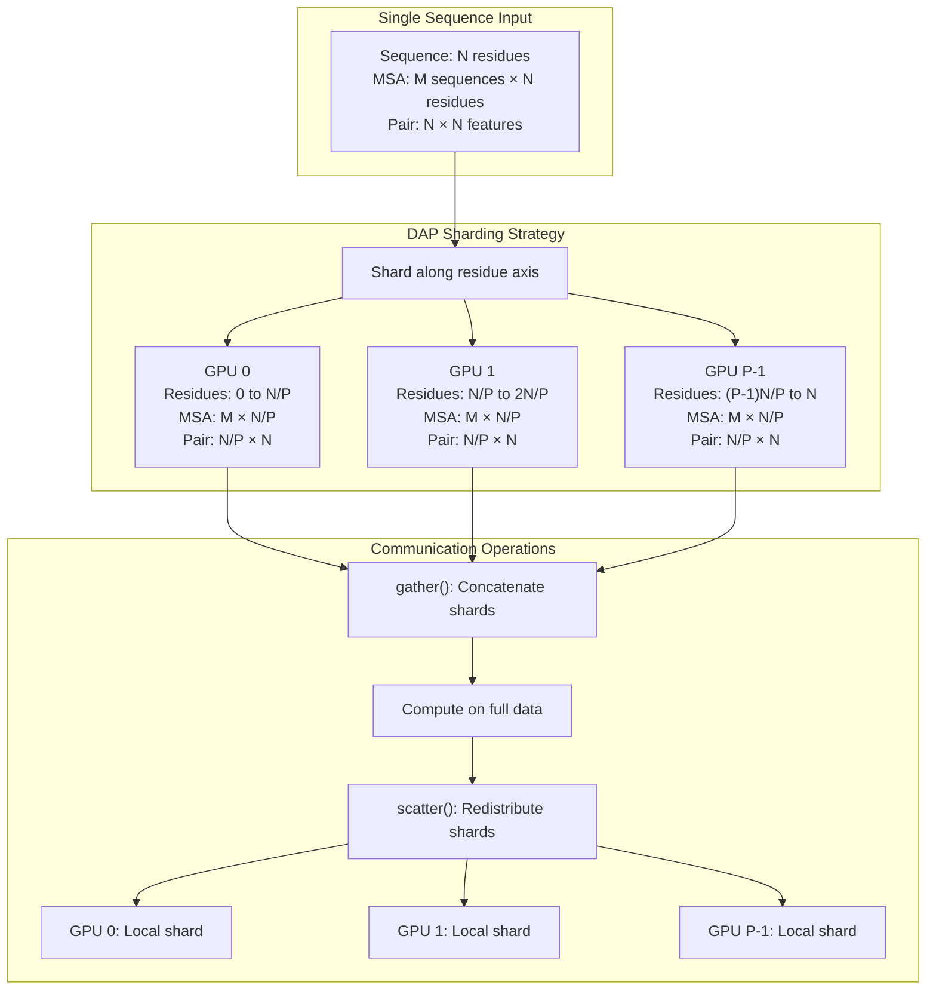
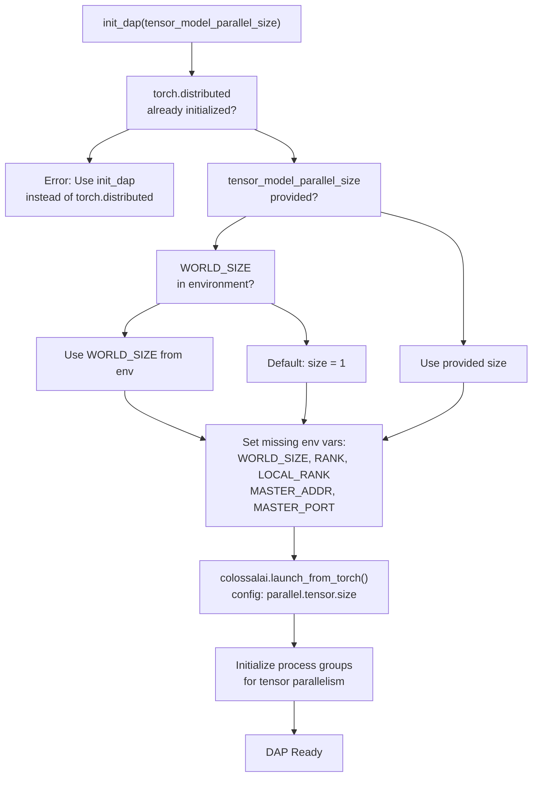
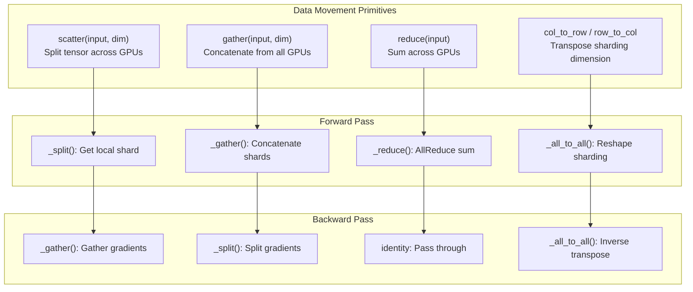
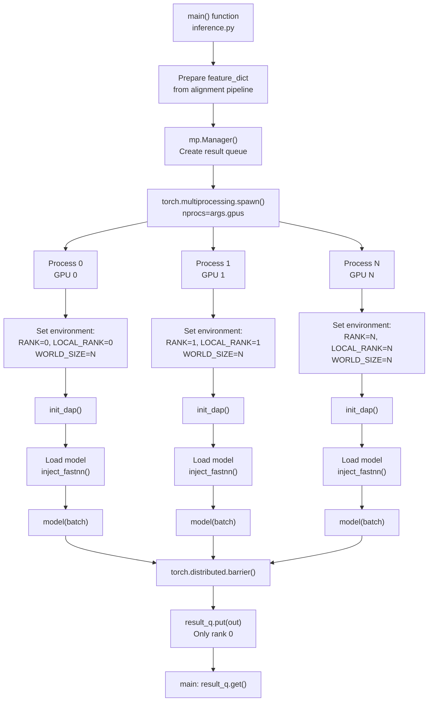

# Dynamic Axial Parallelism (DAP)

> **Relevant source files**
> * [README.md](https://github.com/hpcaitech/FastFold/blob/eba49680/README.md?plain=1)
> * [benchmark/perf.py](https://github.com/hpcaitech/FastFold/blob/eba49680/benchmark/perf.py)
> * [environment.yml](https://github.com/hpcaitech/FastFold/blob/eba49680/environment.yml)
> * [fastfold/distributed/__init__.py](https://github.com/hpcaitech/FastFold/blob/eba49680/fastfold/distributed/__init__.py)
> * [fastfold/distributed/comm.py](https://github.com/hpcaitech/FastFold/blob/eba49680/fastfold/distributed/comm.py)
> * [fastfold/distributed/core.py](https://github.com/hpcaitech/FastFold/blob/eba49680/fastfold/distributed/core.py)
> * [fastfold/model/__init__.py](https://github.com/hpcaitech/FastFold/blob/eba49680/fastfold/model/__init__.py)
> * [inference.py](https://github.com/hpcaitech/FastFold/blob/eba49680/inference.py)

Dynamic Axial Parallelism (DAP) is FastFold's distributed execution strategy that enables ultra-long sequence inference and training by sharding protein sequences across multiple GPUs. DAP breaks the single-GPU memory barrier, allowing FastFold to process sequences containing 10,000+ residues while achieving 2x speedup on standard sequence lengths.

This page covers the DAP initialization process, communication primitives, and integration patterns. For overall performance optimization strategy, see [Performance Optimizations](/hpcaitech/FastFold/8-performance-optimizations). For distributed communication implementation details, see [Distributed Communication Primitives](/hpcaitech/FastFold/8.4-distributed-communication-primitives). For training-specific distributed execution, see [ColossalAI Integration](/hpcaitech/FastFold/7.2-colossalai-integration).

## Overview

DAP partitions the residue dimension of input sequences across multiple GPUs, enabling parallel computation while maintaining model correctness through synchronized communication. Unlike traditional data parallelism (which replicates the model across GPUs with different data), DAP splits individual sequences across GPUs, making it possible to process sequences that exceed single-GPU memory capacity.

### Architecture Diagram



**Sources:** [fastfold/distributed/core.py L1-L41](https://github.com/hpcaitech/FastFold/blob/eba49680/fastfold/distributed/core.py#L1-L41)

 [fastfold/distributed/comm.py L1-L204](https://github.com/hpcaitech/FastFold/blob/eba49680/fastfold/distributed/comm.py#L1-L204)

 [README.md L22-L29](https://github.com/hpcaitech/FastFold/blob/eba49680/README.md?plain=1#L22-L29)

### Key Characteristics

| Aspect | Description |
| --- | --- |
| **Sharding Dimension** | Residue axis (sequence length) |
| **Memory Limit** | Enables 10K+ residues (vs ~3K single-GPU limit) |
| **Speedup** | ~2x on standard sequences, enables previously impossible sequences |
| **Backward Compatible** | Single GPU case (P=1) behaves identically to non-DAP execution |
| **Communication** | Synchronized collective operations (scatter, gather, reduce, all-to-all) |

**Sources:** [README.md L22-L29](https://github.com/hpcaitech/FastFold/blob/eba49680/README.md?plain=1#L22-L29)

 [inference.py L126-L127](https://github.com/hpcaitech/FastFold/blob/eba49680/inference.py#L126-L127)

## Initialization

DAP initialization establishes the distributed execution environment using ColossalAI's infrastructure. The `init_dap()` function configures process groups and tensor model parallelism.

### Initialization Flow



**Sources:** [fastfold/distributed/core.py L17-L41](https://github.com/hpcaitech/FastFold/blob/eba49680/fastfold/distributed/core.py#L17-L41)

### Implementation Details

The `init_dap()` function is implemented in [fastfold/distributed/core.py L17-L41](https://github.com/hpcaitech/FastFold/blob/eba49680/fastfold/distributed/core.py#L17-L41)

:

```python
def init_dap(tensor_model_parallel_size_=None):    colossalai.logging.disable_existing_loggers()     if tensor_model_parallel_size_ == None:        if 'WORLD_SIZE' in os.environ:            tensor_model_parallel_size_ = int(os.environ['WORLD_SIZE'])        else:            tensor_model_parallel_size_ = 1     if torch.distributed.is_initialized():        _logger = colossalai.logging.get_dist_logger()        _logger.error(            "use fastfold.distributed.init_dap instead of torch.distributed.init_process_group!")        exit(-1)     # set distributed environ for single device launch    set_missing_distributed_environ('WORLD_SIZE', 1)    set_missing_distributed_environ('RANK', 0)    set_missing_distributed_environ('LOCAL_RANK', 0)    set_missing_distributed_environ('MASTER_ADDR', "localhost")    set_missing_distributed_environ('MASTER_PORT', 18417)     colossalai.launch_from_torch(        config={"parallel": dict(tensor=dict(size=tensor_model_parallel_size_))})
```

**Key behaviors:**

* **Automatic size detection**: If `tensor_model_parallel_size_` is not provided, reads from `WORLD_SIZE` environment variable
* **Single-GPU default**: Defaults to size=1 for single-GPU execution
* **Environment setup**: Sets missing distributed environment variables for local execution
* **ColossalAI integration**: Configures tensor parallelism via ColossalAI's launch mechanism

**Sources:** [fastfold/distributed/core.py L17-L41](https://github.com/hpcaitech/FastFold/blob/eba49680/fastfold/distributed/core.py#L17-L41)

### Helper Functions

The [fastfold/distributed/core.py L12-L14](https://github.com/hpcaitech/FastFold/blob/eba49680/fastfold/distributed/core.py#L12-L14)

 provides utilities for environment setup:

| Function | Purpose |
| --- | --- |
| `ensure_divisibility(numerator, denominator)` | Validates that sequence length is divisible by GPU count |
| `set_missing_distributed_environ(key, value)` | Sets environment variables only if not already present |

**Sources:** [fastfold/distributed/core.py L7-L14](https://github.com/hpcaitech/FastFold/blob/eba49680/fastfold/distributed/core.py#L7-L14)

## Communication Primitives

DAP provides autograd-aware communication primitives that handle both forward data movement and backward gradient synchronization. Each primitive is implemented as a `torch.autograd.Function` with custom forward/backward logic.

### Primitive Operations Overview



**Sources:** [fastfold/distributed/comm.py L85-L204](https://github.com/hpcaitech/FastFold/blob/eba49680/fastfold/distributed/comm.py#L85-L204)

### Scatter and Gather

These complementary operations partition and reassemble tensors along a specified dimension.

#### Scatter Operation

[fastfold/distributed/comm.py L85-L104](https://github.com/hpcaitech/FastFold/blob/eba49680/fastfold/distributed/comm.py#L85-L104)

 implements `scatter()`:

```python
def scatter(input: Tensor, dim: int = -1) -> Tensor:    if torch.is_grad_enabled() and input.requires_grad:        input = Scatter.apply(input, dim)    else:        input = _split(input, dim=dim)    return input class Scatter(torch.autograd.Function):    @staticmethod    def forward(ctx: "Scatter", input: Tensor, dim: int = -1) -> Tensor:        ctx.save_for_backward(torch.tensor([dim]))        return _split(input, dim=dim)     @staticmethod    def backward(ctx: "Scatter", grad_output: Tensor) -> Tuple[Tensor]:        dim, = ctx.saved_tensors        return _gather(grad_output, dim=int(dim)), None
```

**Behavior:**

* **Forward**: Splits input tensor into P equal chunks along `dim`, returns chunk for current rank
* **Backward**: Gathers gradient chunks from all GPUs and concatenates

#### Gather Operation

[fastfold/distributed/comm.py L125-L144](https://github.com/hpcaitech/FastFold/blob/eba49680/fastfold/distributed/comm.py#L125-L144)

 implements `gather()`:

```python
def gather(input: Tensor, dim: int = -1) -> Tensor:    if torch.is_grad_enabled() and input.requires_grad:        input = Gather.apply(input, dim)    else:        input = _gather(input, dim=dim)    return input class Gather(torch.autograd.Function):    @staticmethod    def forward(ctx: "Gather", input: Tensor, dim: int = -1) -> Tensor:        ctx.save_for_backward(torch.tensor([dim]))        return _gather(input, dim=dim)     @staticmethod    def backward(ctx: "Gather", grad_output: Tensor) -> Tuple[Tensor]:        dim, = ctx.saved_tensors        return _split(grad_output, dim=int(dim)), None
```

**Behavior:**

* **Forward**: Collects tensor shards from all GPUs and concatenates along `dim`
* **Backward**: Splits gradient back to local shard for each GPU

**Sources:** [fastfold/distributed/comm.py L30-L144](https://github.com/hpcaitech/FastFold/blob/eba49680/fastfold/distributed/comm.py#L30-L144)

### Reduce Operation

[fastfold/distributed/comm.py L106-L123](https://github.com/hpcaitech/FastFold/blob/eba49680/fastfold/distributed/comm.py#L106-L123)

 implements `reduce()` for summing tensors across GPUs:

```python
def reduce(input: Tensor) -> Tensor:    if torch.is_grad_enabled() and input.requires_grad:        input = Reduce.apply(input)    else:        input = _reduce(input)    return input class Reduce(torch.autograd.Function):    @staticmethod    def forward(ctx: "Reduce", input: Tensor) -> Tensor:        return _reduce(input)     @staticmethod    def backward(ctx: "Reduce", grad_output: Tensor) -> Tensor:        return grad_output
```

**Behavior:**

* **Forward**: AllReduce sum operation across all GPUs
* **Backward**: Identity operation (gradient is passed through unchanged)

**Use case**: Aggregating partial results computed on different shards (e.g., attention scores)

**Sources:** [fastfold/distributed/comm.py L18-L123](https://github.com/hpcaitech/FastFold/blob/eba49680/fastfold/distributed/comm.py#L18-L123)

### All-to-All Operations

All-to-all enables transforming between row-sharded and column-sharded representations, critical for operations that require different sharding dimensions.

#### Row-Column Transformation

[fastfold/distributed/comm.py L176-L204](https://github.com/hpcaitech/FastFold/blob/eba49680/fastfold/distributed/comm.py#L176-L204)

 implements dimension transposition:

```python
def col_to_row(input_: Tensor) -> Tensor:    if torch.is_grad_enabled() and input_.requires_grad:        input_ = All_to_All.apply(input_, 1, 2)    else:        input_ = _all_to_all(input_, in_dim=1, out_dim=2)    return input_ def row_to_col(input_: Tensor) -> Tensor:    if torch.is_grad_enabled() and input_.requires_grad:        input_ = All_to_All.apply(input_, 2, 1)    else:        input_ = _all_to_all(input_, in_dim=2, out_dim=1)    return input_ class All_to_All(torch.autograd.Function):    @staticmethod    def forward(ctx: "All_to_All", input_: Tensor, in_dim: int, out_dim: int) -> Tensor:        ctx.save_for_backward(torch.tensor([in_dim, out_dim]))        return _all_to_all(input_, in_dim=in_dim, out_dim=out_dim)     @staticmethod    def backward(ctx: "All_to_All", grad_output: Tensor) -> Tuple[Tensor]:        saved_tensors = ctx.saved_tensors[0]        return _all_to_all(grad_output, in_dim=int(saved_tensors[1]),                           out_dim=int(saved_tensors[0])), None, None
```

**Behavior:**

* Transposes the sharding dimension from one axis to another
* Backward pass inverts the transformation (swaps `in_dim` and `out_dim`)

**Use case**: Converting between row-wise and column-wise attention patterns in the Evoformer

**Sources:** [fastfold/distributed/comm.py L146-L204](https://github.com/hpcaitech/FastFold/blob/eba49680/fastfold/distributed/comm.py#L146-L204)

### Communication Primitive Summary Table

| Primitive | Forward Operation | Backward Operation | Use Case |
| --- | --- | --- | --- |
| `scatter(x, dim)` | Split tensor → local shard | Gather gradients → full tensor | Distribute data to GPUs |
| `gather(x, dim)` | Concatenate shards → full tensor | Split gradients → local shard | Collect results from GPUs |
| `reduce(x)` | AllReduce sum | Identity (pass through) | Aggregate partial sums |
| `col_to_row(x)` | All-to-all (dim 1→2) | All-to-all (dim 2→1) | Row/column attention transform |
| `row_to_col(x)` | All-to-all (dim 2→1) | All-to-all (dim 1→2) | Row/column attention transform |
| `copy(x)` | Identity | AllReduce sum | Synchronize values |

**Sources:** [fastfold/distributed/comm.py L1-L204](https://github.com/hpcaitech/FastFold/blob/eba49680/fastfold/distributed/comm.py#L1-L204)

## Integration Patterns

DAP integrates differently in inference and training workflows, balancing simplicity with performance requirements.

### Inference Integration

Inference uses process-based parallelism via `torch.multiprocessing.spawn`, where each GPU runs an independent process with its own DAP context.

#### Inference Execution Flow



**Sources:** [inference.py L122-L160](https://github.com/hpcaitech/FastFold/blob/eba49680/inference.py#L122-L160)

 [inference.py L291-L295](https://github.com/hpcaitech/FastFold/blob/eba49680/inference.py#L291-L295)

 [inference.py L441-L445](https://github.com/hpcaitech/FastFold/blob/eba49680/inference.py#L441-L445)

#### Implementation

The inference workflow is implemented in [inference.py L122-L160](https://github.com/hpcaitech/FastFold/blob/eba49680/inference.py#L122-L160)

:

```python
def inference_model(rank, world_size, result_q, batch, args):    os.environ['RANK'] = str(rank)    os.environ['LOCAL_RANK'] = str(rank)    os.environ['WORLD_SIZE'] = str(world_size)    # init distributed for Dynamic Axial Parallelism    fastfold.distributed.init_dap()    torch.cuda.set_device(rank)    config = model_config(args.model_name)    if args.chunk_size:        config.globals.chunk_size = args.chunk_size     if "v3" in args.param_path:        set_fused_triangle_multiplication()     config.globals.inplace = args.inplace    config.globals.is_multimer = args.model_preset == 'multimer'    model = AlphaFold(config)    import_jax_weights_(model, args.param_path, version=args.model_name)     model = inject_fastnn(model)    model = model.eval()    model = model.cuda()     set_chunk_size(model.globals.chunk_size)     with torch.no_grad():        batch = {k: torch.as_tensor(v).cuda() for k, v in batch.items()}         t = time.perf_counter()        out = model(batch)        print(f"Inference time: {time.perf_counter() - t}")     out = tensor_tree_map(lambda x: np.array(x.cpu()), out)     result_q.put(out)     torch.distributed.barrier()    torch.cuda.synchronize()
```

**Key steps:**

1. **Environment setup** [inference.py L123-L125](https://github.com/hpcaitech/FastFold/blob/eba49680/inference.py#L123-L125) : Each worker sets its rank and world size
2. **DAP initialization** [inference.py L127](https://github.com/hpcaitech/FastFold/blob/eba49680/inference.py#L127-L127) : Establishes distributed context
3. **Model loading** [inference.py L138-L143](https://github.com/hpcaitech/FastFold/blob/eba49680/inference.py#L138-L143) : Each process loads identical model weights
4. **Inference** [inference.py L147-L152](https://github.com/hpcaitech/FastFold/blob/eba49680/inference.py#L147-L152) : Forward pass with automatic DAP communication
5. **Synchronization** [inference.py L158-L159](https://github.com/hpcaitech/FastFold/blob/eba49680/inference.py#L158-L159) : Barrier ensures all processes complete

**Sources:** [inference.py L122-L160](https://github.com/hpcaitech/FastFold/blob/eba49680/inference.py#L122-L160)

### Training Integration

Training uses ColossalAI's unified engine, which manages DAP initialization and distributed execution through configuration.

#### Training Setup

While the main training script is not included in the provided files, the benchmark script [benchmark/perf.py L1-L188](https://github.com/hpcaitech/FastFold/blob/eba49680/benchmark/perf.py#L1-L188)

 demonstrates the training pattern:

```python
def main():    parser = argparse.ArgumentParser(description='Evoformer Standalone Perf Benchmark')    parser.add_argument("--dap-size", default=1, type=int, help='batch size')    # ... other arguments ...        args = parser.parse_args()     init_dap(args.dap_size)     precision = torch.bfloat16    if args.dap_size > 1:        # (PyTorch issue) Currently All2All communication does not support the Bfloat16 datatype in PyTorch        precision = torch.float16        # ... model setup ...
```

**Key differences from inference:**

* Single `init_dap()` call per process (no manual environment setup)
* Uses `torchrun` launcher which sets environment variables automatically
* ColossalAI engine handles gradient synchronization and optimizer updates

**Sources:** [benchmark/perf.py L11-L48](https://github.com/hpcaitech/FastFold/blob/eba49680/benchmark/perf.py#L11-L48)

### Multi-GPU Invocation

#### Inference Example

From [README.md L115-L132](https://github.com/hpcaitech/FastFold/blob/eba49680/README.md?plain=1#L115-L132)

:

```markdown
python inference.py target.fasta data/pdb_mmcif/mmcif_files/ \    --output_dir .outputs/ \    --gpus 2 \    --uniref90_database_path data/uniref90/uniref90.fasta \    # ... other database paths ...    --enable_workflow \    --inplace
```

The `--gpus 2` argument causes `torch.multiprocessing.spawn(nprocs=2)`, launching two processes that call `init_dap()`.

#### Training/Benchmark Example

From [README.md L210-L215](https://github.com/hpcaitech/FastFold/blob/eba49680/README.md?plain=1#L210-L215)

:

```
cd ./benchmarktorchrun --nproc_per_node=2 perf.py --msa-length 128 --res-length 256 --dap-size 2
```

The `torchrun` launcher sets `WORLD_SIZE=2`, `RANK`, and `LOCAL_RANK` environment variables, which `init_dap()` reads.

**Sources:** [README.md L115-L132](https://github.com/hpcaitech/FastFold/blob/eba49680/README.md?plain=1#L115-L132)

 [README.md L210-L215](https://github.com/hpcaitech/FastFold/blob/eba49680/README.md?plain=1#L210-L215)

## Memory and Performance Characteristics

### Memory Scaling

DAP enables linear memory scaling with GPU count:

| Sequence Length | Single GPU Memory | 2 GPUs (DAP) | 4 GPUs (DAP) |
| --- | --- | --- | --- |
| 3,000 residues | ~40 GB | ~20 GB/GPU | ~10 GB/GPU |
| 6,000 residues | OOM | ~40 GB/GPU | ~20 GB/GPU |
| 10,000 residues | OOM | OOM | ~35 GB/GPU |

**Key insight**: DAP divides the residue dimension evenly, so memory usage scales approximately as `memory_per_gpu ≈ (N/P)²` for pair representations and `(N/P)` for MSA representations, where N is sequence length and P is GPU count.

**Sources:** [README.md L29](https://github.com/hpcaitech/FastFold/blob/eba49680/README.md?plain=1#L29-L29)

 [README.md L142-L146](https://github.com/hpcaitech/FastFold/blob/eba49680/README.md?plain=1#L142-L146)

### Performance Characteristics

From [README.md L22-L29](https://github.com/hpcaitech/FastFold/blob/eba49680/README.md?plain=1#L22-L29)

:

| Metric | Value |
| --- | --- |
| **Speedup (standard sequences)** | ~2x vs single GPU |
| **Max sequence length (BF16)** | 10,000 residues with 61GB memory |
| **Max sequence length (FP32)** | 8,000 residues on A100 80GB |
| **Communication overhead** | 20-30% of execution time (mitigated by async ops) |
| **Scaling efficiency** | Near-linear for 2-4 GPUs |

**Memory configuration note**: For extremely long sequences, set `PYTORCH_CUDA_ALLOC_CONF=max_split_size_mb:15000` to prevent memory fragmentation [README.md L146](https://github.com/hpcaitech/FastFold/blob/eba49680/README.md?plain=1#L146-L146)

**Sources:** [README.md L22-L29](https://github.com/hpcaitech/FastFold/blob/eba49680/README.md?plain=1#L22-L29)

 [README.md L142-L146](https://github.com/hpcaitech/FastFold/blob/eba49680/README.md?plain=1#L142-L146)

### Single-GPU Fallback

When `tensor_model_parallel_size=1`, all communication primitives become no-ops, ensuring zero overhead for single-GPU execution:

From [fastfold/distributed/comm.py L18-L27](https://github.com/hpcaitech/FastFold/blob/eba49680/fastfold/distributed/comm.py#L18-L27)

:

```python
def _reduce(tensor: Tensor) -> Tensor:    if gpc.get_world_size(ParallelMode.TENSOR) == 1:        return tensor    # ... actual reduction ...
```

This pattern appears in all primitives: `_split()`, `_gather()`, `_all_to_all()`, ensuring DAP-enabled models run identically on single GPUs.

**Sources:** [fastfold/distributed/comm.py L18-L27](https://github.com/hpcaitech/FastFold/blob/eba49680/fastfold/distributed/comm.py#L18-L27)

 [fastfold/distributed/comm.py L30-L65](https://github.com/hpcaitech/FastFold/blob/eba49680/fastfold/distributed/comm.py#L30-L65)

 [fastfold/distributed/comm.py L146-L174](https://github.com/hpcaitech/FastFold/blob/eba49680/fastfold/distributed/comm.py#L146-L174)

## Usage Examples

### Basic DAP Initialization

From [README.md L89-L95](https://github.com/hpcaitech/FastFold/blob/eba49680/README.md?plain=1#L89-L95)

:

```javascript
from fastfold.distributed import init_dap init_dap(args.dap_size)
```

### Inference with DAP

Complete example from [inference.py L441-L445](https://github.com/hpcaitech/FastFold/blob/eba49680/inference.py#L441-L445)

:

```
manager = mp.Manager()result_q = manager.Queue()torch.multiprocessing.spawn(inference_model, nprocs=args.gpus, args=(args.gpus, result_q, batch, args)) out = result_q.get()
```

### Using Communication Primitives

From [fastfold/distributed/__init__.py L1-L7](https://github.com/hpcaitech/FastFold/blob/eba49680/fastfold/distributed/__init__.py#L1-L7)

:

```javascript
from fastfold.distributed import scatter, gather, reduce, col_to_row, row_to_col # Distribute data to GPUslocal_shard = scatter(full_tensor, dim=1) # Compute on local shardresult = compute(local_shard) # Collect resultsfull_result = gather(result, dim=1)
```

**Sources:** [README.md L89-L95](https://github.com/hpcaitech/FastFold/blob/eba49680/README.md?plain=1#L89-L95)

 [inference.py L441-L445](https://github.com/hpcaitech/FastFold/blob/eba49680/inference.py#L441-L445)

 [fastfold/distributed/__init__.py L1-L7](https://github.com/hpcaitech/FastFold/blob/eba49680/fastfold/distributed/__init__.py#L1-L7)

## Limitations and Considerations

### Sequence Length Divisibility

DAP requires sequence length to be evenly divisible by the number of GPUs. The [fastfold/distributed/core.py L7-L9](https://github.com/hpcaitech/FastFold/blob/eba49680/fastfold/distributed/core.py#L7-L9)

 enforces this:

```python
def ensure_divisibility(numerator, denominator):    """Ensure that numerator is divisible by the denominator."""    assert numerator % denominator == 0, '{} is not divisible by {}'.format(numerator, denominator)
```

**Workaround**: Pad sequences to the nearest multiple of GPU count before processing.

### Precision Constraints

From [benchmark/perf.py L39-L42](https://github.com/hpcaitech/FastFold/blob/eba49680/benchmark/perf.py#L39-L42)

:

```markdown
precision = torch.bfloat16if args.dap_size > 1:    # (PyTorch issue) Currently All2All communication does not support the Bfloat16 datatype in PyTorch    precision = torch.float16
```

**Limitation**: Multi-GPU DAP requires FP16 instead of BF16 due to PyTorch all-to-all communication constraints.

### Initialization Order

DAP must be initialized before PyTorch distributed. From [fastfold/distributed/core.py L26-L30](https://github.com/hpcaitech/FastFold/blob/eba49680/fastfold/distributed/core.py#L26-L30)

:

```
if torch.distributed.is_initialized():    _logger = colossalai.logging.get_dist_logger()    _logger.error(        "use fastfold.distributed.init_dap instead of torch.distributed.init_process_group!")    exit(-1)
```

**Best practice**: Call `init_dap()` as the first operation in distributed code paths.

**Sources:** [fastfold/distributed/core.py L7-L9](https://github.com/hpcaitech/FastFold/blob/eba49680/fastfold/distributed/core.py#L7-L9)

 [benchmark/perf.py L39-L42](https://github.com/hpcaitech/FastFold/blob/eba49680/benchmark/perf.py#L39-L42)

 [fastfold/distributed/core.py L26-L30](https://github.com/hpcaitech/FastFold/blob/eba49680/fastfold/distributed/core.py#L26-L30)