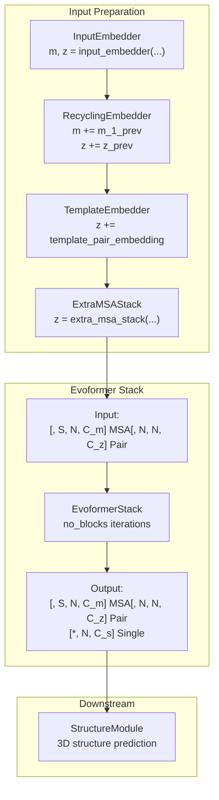
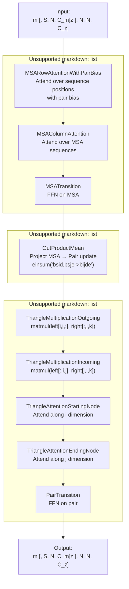
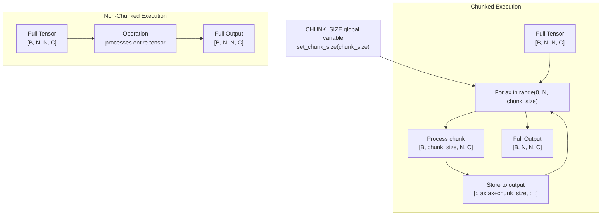
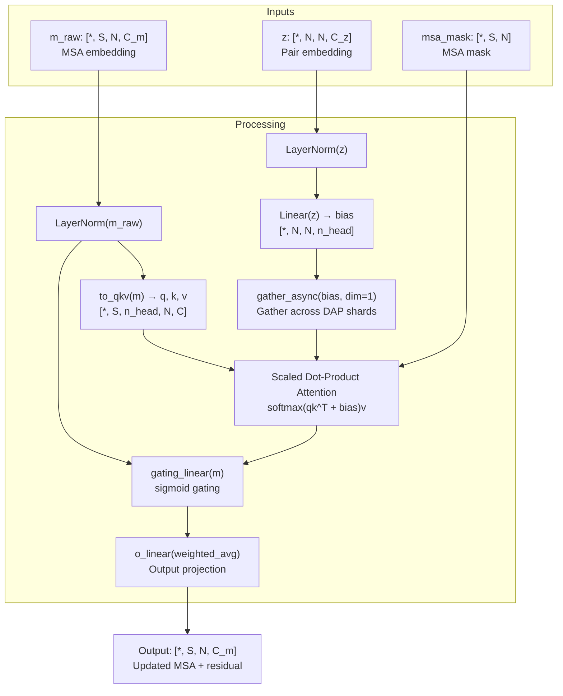
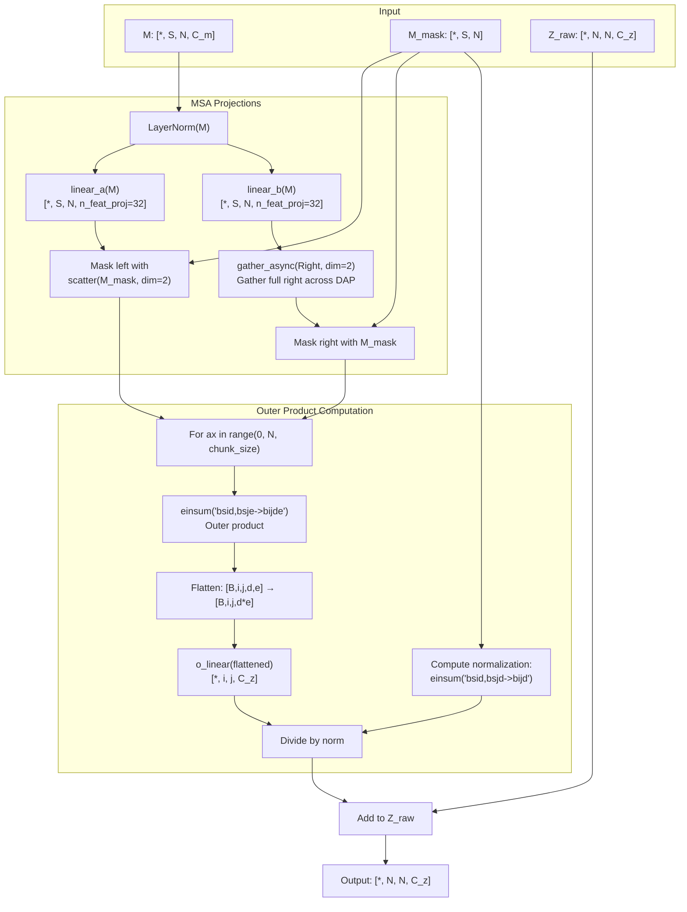
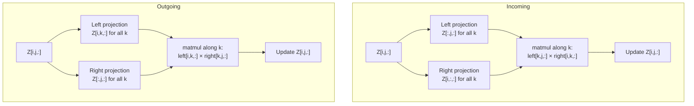
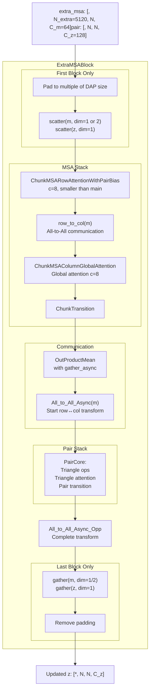
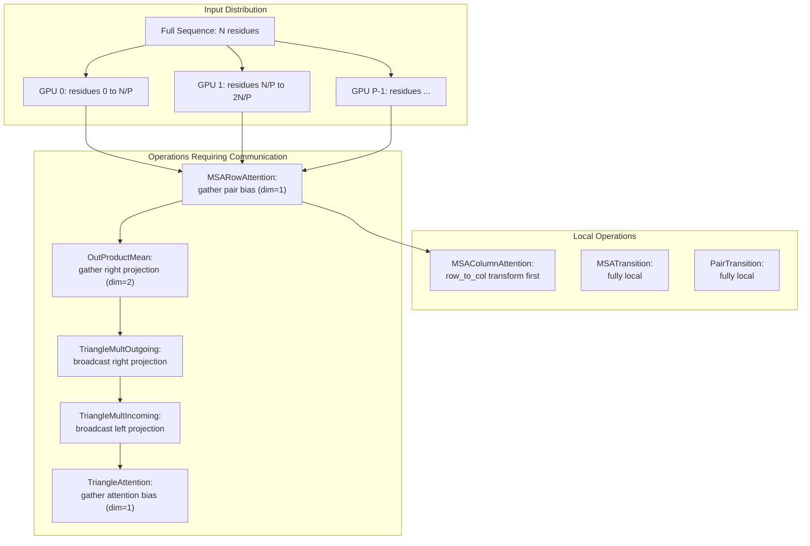

# Evoformer Stack

> **Relevant source files**
> * [fastfold/model/fastnn/__init__.py](https://github.com/hpcaitech/FastFold/blob/eba49680/fastfold/model/fastnn/__init__.py)
> * [fastfold/model/fastnn/msa.py](https://github.com/hpcaitech/FastFold/blob/eba49680/fastfold/model/fastnn/msa.py)
> * [fastfold/model/fastnn/ops.py](https://github.com/hpcaitech/FastFold/blob/eba49680/fastfold/model/fastnn/ops.py)
> * [fastfold/model/hub/alphafold.py](https://github.com/hpcaitech/FastFold/blob/eba49680/fastfold/model/hub/alphafold.py)
> * [fastfold/model/nn/embedders.py](https://github.com/hpcaitech/FastFold/blob/eba49680/fastfold/model/nn/embedders.py)
> * [fastfold/model/nn/template.py](https://github.com/hpcaitech/FastFold/blob/eba49680/fastfold/model/nn/template.py)

## Purpose and Scope

The Evoformer Stack is the core processing module of the AlphaFold architecture, responsible for jointly refining Multiple Sequence Alignment (MSA) representations and pairwise residue representations through iterative message passing. This page documents the Evoformer's architecture, implementation, and how FastFold optimizes it through the `inject_fastnn` mechanism.

For information about the input embedders that produce initial representations, see [Input Embedders](/hpcaitech/FastFold/6.1-input-embedders). For details on how `inject_fastnn` replaces standard operations with optimized kernels, see [FastNN Operations](/hpcaitech/FastFold/8.2-fastnn-operations) and [Dynamic Axial Parallelism](/hpcaitech/FastFold/8.1-dynamic-axial-parallelism-(dap)). For the overall AlphaFold model architecture, see [AlphaFold Model Architecture](/hpcaitech/FastFold/6-alphafold-model-architecture).

## Architectural Overview

The Evoformer Stack implements Algorithm 6 from AlphaFold2, processing MSA and pair embeddings through multiple blocks of attention and communication operations. Each Evoformer block performs row-wise and column-wise attention on the MSA, updates the pair representation through triangle operations, and communicates information between MSA and pair representations via outer product mean operations.

**Diagram: Evoformer Stack in AlphaFold Pipeline**



**Sources:** [fastfold/model/hub/alphafold.py L173-L424](https://github.com/hpcaitech/FastFold/blob/eba49680/fastfold/model/hub/alphafold.py#L173-L424)

### Standard vs FastNN Implementation

FastFold provides two implementations of the Evoformer Stack:

| Implementation | Location | Use Case | Key Features |
| --- | --- | --- | --- |
| **Standard** | `fastfold.model.nn.evoformer` | Default, reference | Native PyTorch operations |
| **FastNN** | `fastfold.model.fastnn.evoformer` | Optimized inference/training | Chunk-aware ops, fused kernels, DAP support |

The `inject_fastnn` mechanism (see [Key Innovations](/hpcaitech/FastFold/1.2-key-innovations)) automatically replaces standard operations with FastNN equivalents at runtime, providing 2-5x speedup without code changes.

**Sources:** [fastfold/model/fastnn/__init__.py L1-L13](https://github.com/hpcaitech/FastFold/blob/eba49680/fastfold/model/fastnn/__init__.py#L1-L13)

 [fastfold/model/hub/alphafold.py L92-L95](https://github.com/hpcaitech/FastFold/blob/eba49680/fastfold/model/hub/alphafold.py#L92-L95)

## Evoformer Block Structure

Each Evoformer block consists of four main computational stages executed sequentially:

**Diagram: Single Evoformer Block Operations**



**Sources:** [fastfold/model/fastnn/msa.py L128-L151](https://github.com/hpcaitech/FastFold/blob/eba49680/fastfold/model/fastnn/msa.py#L128-L151)

 [fastfold/model/fastnn/ops.py L126-L227](https://github.com/hpcaitech/FastFold/blob/eba49680/fastfold/model/fastnn/ops.py#L126-L227)

### FastNN Chunk-Aware Operations

FastFold's optimized implementation processes large tensors in chunks to reduce memory footprint and enable longer sequences. The global `CHUNK_SIZE` variable controls chunking granularity:

**Diagram: Chunking Strategy in FastNN Operations**



Key chunked operations include:

* **`ChunkTransition`**: Processes transition layers in chunks [fastfold/model/fastnn/ops.py L85-L124](https://github.com/hpcaitech/FastFold/blob/eba49680/fastfold/model/fastnn/ops.py#L85-L124)
* **`ChunkMSARowAttentionWithPairBias`**: Chunks MSA attention computation [fastfold/model/fastnn/ops.py L751-L821](https://github.com/hpcaitech/FastFold/blob/eba49680/fastfold/model/fastnn/ops.py#L751-L821)
* **`AsyncChunkTriangleMultiplication[Outgoing/Incoming]`**: Chunks triangle multiplication with async communication [fastfold/model/fastnn/ops.py L372-L630](https://github.com/hpcaitech/FastFold/blob/eba49680/fastfold/model/fastnn/ops.py#L372-L630)
* **`OutProductMean`**: Chunks outer product computation [fastfold/model/fastnn/ops.py L126-L227](https://github.com/hpcaitech/FastFold/blob/eba49680/fastfold/model/fastnn/ops.py#L126-L227)

**Sources:** [fastfold/model/fastnn/ops.py L31-L42](https://github.com/hpcaitech/FastFold/blob/eba49680/fastfold/model/fastnn/ops.py#L31-L42)

 [fastfold/model/fastnn/ops.py L85-L630](https://github.com/hpcaitech/FastFold/blob/eba49680/fastfold/model/fastnn/ops.py#L85-L630)

## Input and Output Specifications

### Inputs

The Evoformer Stack accepts the following inputs:

| Parameter | Shape | Description |
| --- | --- | --- |
| `m` | `[*, S, N, C_m]` | MSA embedding where S is number of sequences, N is number of residues, C_m is MSA channel dimension (typically 256) |
| `z` | `[*, N, N, C_z]` | Pair embedding with C_z pair channel dimension (typically 128) |
| `msa_mask` | `[*, S, N]` | MSA mask indicating valid positions |
| `pair_mask` | `[*, N, N]` | Pair mask indicating valid residue pairs |
| `chunk_size` | `int` | Optional chunking size for memory optimization |

### Outputs

| Output | Shape | Description |
| --- | --- | --- |
| `m` | `[*, S, N, C_m]` | Updated MSA embedding |
| `z` | `[*, N, N, C_z]` | Updated pair embedding |
| `s` | `[*, N, C_s]` | Single representation extracted from MSA (first row) with C_s single channel dimension (typically 384) |

The single representation `s` is computed by processing the first MSA row through a linear projection and is used as input to the Structure Module.

**Sources:** [fastfold/model/hub/alphafold.py L366-L394](https://github.com/hpcaitech/FastFold/blob/eba49680/fastfold/model/hub/alphafold.py#L366-L394)

 [fastfold/model/fastnn/msa.py L374-L418](https://github.com/hpcaitech/FastFold/blob/eba49680/fastfold/model/fastnn/msa.py#L374-L418)

## MSA Operations

### MSA Row Attention with Pair Bias

This operation implements attention over sequence positions (residues) for each MSA row, biased by the pair representation. This allows pairwise geometric information to influence MSA attention patterns.

**Diagram: MSA Row Attention with Pair Bias**



The FastNN implementation uses:

* **`ChunkMSARowAttentionWithPairBias`** for chunked processing [fastfold/model/fastnn/ops.py L751-L821](https://github.com/hpcaitech/FastFold/blob/eba49680/fastfold/model/fastnn/ops.py#L751-L821)
* **`gather_async`** for asynchronous distributed gathering of pair bias [fastfold/model/fastnn/ops.py L777-L801](https://github.com/hpcaitech/FastFold/blob/eba49680/fastfold/model/fastnn/ops.py#L777-L801)
* **`fused_softmax`** kernel for efficient attention computation

**Sources:** [fastfold/model/fastnn/msa.py L33-L73](https://github.com/hpcaitech/FastFold/blob/eba49680/fastfold/model/fastnn/msa.py#L33-L73)

 [fastfold/model/fastnn/ops.py L751-L821](https://github.com/hpcaitech/FastFold/blob/eba49680/fastfold/model/fastnn/ops.py#L751-L821)

### MSA Column Attention

Processes MSA embedding with attention over sequences (vertical axis) for each residue position. This captures co-evolutionary patterns across different protein sequences.

The standard implementation uses `MSAColumnAttention` [fastfold/model/fastnn/msa.py L75-L101](https://github.com/hpcaitech/FastFold/blob/eba49680/fastfold/model/fastnn/msa.py#L75-L101)

 while the ExtraMSA variant uses `ChunkMSAColumnGlobalAttention` with global attention patterns [fastfold/model/fastnn/ops.py L909-L1058](https://github.com/hpcaitech/FastFold/blob/eba49680/fastfold/model/fastnn/ops.py#L909-L1058)

**Sources:** [fastfold/model/fastnn/msa.py L75-L126](https://github.com/hpcaitech/FastFold/blob/eba49680/fastfold/model/fastnn/msa.py#L75-L126)

### Transition Layer

Feed-forward network applied to MSA embedding with expansion factor `n=4`:

```
x = LayerNorm(m)
x = Linear(C_m → 4*C_m, relu_init)(x)
x = ReLU(x)
x = Linear(4*C_m → C_m, zero_init)(x)
return m + x
```

The chunked variant `ChunkTransition` processes this in blocks along the sequence dimension [fastfold/model/fastnn/ops.py L85-L124](https://github.com/hpcaitech/FastFold/blob/eba49680/fastfold/model/fastnn/ops.py#L85-L124)

**Sources:** [fastfold/model/fastnn/ops.py L71-L124](https://github.com/hpcaitech/FastFold/blob/eba49680/fastfold/model/fastnn/ops.py#L71-L124)

## Communication Between MSA and Pair

### Outer Product Mean

The `OutProductMean` operation communicates information from MSA to pair representation by computing an outer product over MSA sequences and projecting it to pair space:

**Diagram: OutProductMean Operation**



The operation performs:

1. **Project MSA** to left and right activations of dimension `n_feat_proj=32`
2. **Gather right activations** across DAP shards using async communication
3. **Compute outer product** `einsum('bsid,bsje->bijde')` in chunks
4. **Project** from `32×32=1024` dimensions to `C_z=128`
5. **Normalize** by number of valid MSA positions

The chunking strategy processes `chunk_size` residues at a time for memory efficiency [fastfold/model/fastnn/ops.py L157-L172](https://github.com/hpcaitech/FastFold/blob/eba49680/fastfold/model/fastnn/ops.py#L157-L172)

**Sources:** [fastfold/model/fastnn/ops.py L126-L227](https://github.com/hpcaitech/FastFold/blob/eba49680/fastfold/model/fastnn/ops.py#L126-L227)

 [fastfold/model/fastnn/msa.py L200](https://github.com/hpcaitech/FastFold/blob/eba49680/fastfold/model/fastnn/msa.py#L200-L200)

## Pair Representation Operations

### Triangle Multiplication

Triangle multiplication operations update the pair representation using matrix multiplication patterns that respect the triangle inequality constraint in distance geometry.

**Diagram: Triangle Multiplication Variants**



FastFold's optimized implementations include:

* **`AsyncChunkTriangleMultiplicationOutgoing`** [fastfold/model/fastnn/ops.py L372-L499](https://github.com/hpcaitech/FastFold/blob/eba49680/fastfold/model/fastnn/ops.py#L372-L499)
* **`AsyncChunkTriangleMultiplicationIncoming`** [fastfold/model/fastnn/ops.py L501-L630](https://github.com/hpcaitech/FastFold/blob/eba49680/fastfold/model/fastnn/ops.py#L501-L630)

Both use:

1. **Chunking** along row/column dimensions with `chunk_size * 32`
2. **Async broadcasting** of projections across DAP ranks
3. **Overlapped computation and communication** for efficiency
4. **Gating and dropout** with fused kernels (`bias_ele_dropout_residual`)

The async broadcasting pattern enables computation-communication overlap [fastfold/model/fastnn/ops.py L443-L483](https://github.com/hpcaitech/FastFold/blob/eba49680/fastfold/model/fastnn/ops.py#L443-L483)

:

```markdown
# Pseudo-code for async broadcast patternfor k in range(world_size):    if work:        broadcast_async_opp(work)  # Wait for previous    if k + 1 != world_size:        work = broadcast_async(k + 1, tensor)  # Start next    # Compute with current tensor    result = matmul(left, right_from_rank_k)
```

**Sources:** [fastfold/model/fastnn/ops.py L372-L630](https://github.com/hpcaitech/FastFold/blob/eba49680/fastfold/model/fastnn/ops.py#L372-L630)

### Triangle Attention

Triangle attention operations apply self-attention along one dimension of the pair representation:

* **`ChunkTriangleAttentionStartingNode`**: Attends along the first dimension (i) for each j [fastfold/model/fastnn/ops.py L633-L748](https://github.com/hpcaitech/FastFold/blob/eba49680/fastfold/model/fastnn/ops.py#L633-L748)

The pattern is:

1. Compute pair bias `b = linear_b(z)` and gather across DAP
2. For each chunk of dimension i: * Apply attention over all j positions with pair bias * Use fused softmax and attention kernels
3. Apply gating and output projection

**Sources:** [fastfold/model/fastnn/ops.py L633-L748](https://github.com/hpcaitech/FastFold/blob/eba49680/fastfold/model/fastnn/ops.py#L633-L748)

## ExtraMSA Processing

The ExtraMSA stack processes a large number of extra MSA sequences (typically 5120 sequences vs 508 for main MSA) through a separate stack before the main Evoformer. This contributes information from the full MSA depth while keeping the main Evoformer computationally tractable.

**Diagram: ExtraMSA Block Structure**



Key differences from main Evoformer:

* Uses **smaller hidden dimensions** (c=8 vs c=32) for efficiency
* Implements **global column attention** instead of standard attention
* **Overlaps MSA→Pair communication** with pair computation using async all-to-all
* Operates in **DAP-distributed mode** with padding and scatter/gather

**Sources:** [fastfold/model/fastnn/msa.py L190-L344](https://github.com/hpcaitech/FastFold/blob/eba49680/fastfold/model/fastnn/msa.py#L190-L344)

 [fastfold/model/fastnn/msa.py L347-L464](https://github.com/hpcaitech/FastFold/blob/eba49680/fastfold/model/fastnn/msa.py#L347-L464)

## Distributed Execution with DAP

When Dynamic Axial Parallelism (DAP) is enabled, the Evoformer operations are distributed across multiple GPUs by sharding along the residue dimension:

**Diagram: DAP Sharding in Evoformer**



The distributed operations use:

* **`scatter`/`gather`**: Partition/collect tensors across GPUs [fastfold/distributed/comm.py](https://github.com/hpcaitech/FastFold/blob/eba49680/fastfold/distributed/comm.py)
* **`gather_async`**: Non-blocking gather with computation overlap [fastfold/model/fastnn/ops.py L145-L154](https://github.com/hpcaitech/FastFold/blob/eba49680/fastfold/model/fastnn/ops.py#L145-L154)
* **`row_to_col`/`All_to_All_Async`**: Transform data layout between row-sharded and column-sharded [fastfold/model/fastnn/msa.py L145-L150](https://github.com/hpcaitech/FastFold/blob/eba49680/fastfold/model/fastnn/msa.py#L145-L150)
* **`broadcast_async`**: Asynchronous broadcasting in triangle multiplication [fastfold/model/fastnn/ops.py L443-L483](https://github.com/hpcaitech/FastFold/blob/eba49680/fastfold/model/fastnn/ops.py#L443-L483)

**Sources:** [fastfold/model/fastnn/ops.py L27-L28](https://github.com/hpcaitech/FastFold/blob/eba49680/fastfold/model/fastnn/ops.py#L27-L28)

 [fastfold/model/fastnn/msa.py L204-L270](https://github.com/hpcaitech/FastFold/blob/eba49680/fastfold/model/fastnn/msa.py#L204-L270)

## Inplace Optimization Mode

FastFold provides an `inplace` execution mode that updates tensors in-place to reduce memory allocations. This is enabled via `globals.inplace = True` in the config.

Key differences in inplace mode:

* Tensors are wrapped in single-element lists `[tensor]` to enable mutation
* Operations update `tensor[0]` directly rather than creating new tensors
* Used in both ExtraMSAStack and EvoformerStack

Example pattern from `ExtraMSABlock.inplace` [fastfold/model/fastnn/msa.py L273-L344](https://github.com/hpcaitech/FastFold/blob/eba49680/fastfold/model/fastnn/msa.py#L273-L344)

:

```python
def inplace(self, m: List[Tensor], z: List[Tensor], ...):    # m and z are single-element lists    m = self.msa_stack.inplace(m, z, ...)  # Updates m[0] in place    z = self.communication.inplace(m[0], z, ...)  # Updates z[0] in place    return m, z
```

Inplace mode is particularly beneficial for:

* **Long sequences** where memory is constrained
* **Training** where intermediate activations dominate memory
* **Reducing peak memory** by ~20-30%

**Sources:** [fastfold/model/hub/alphafold.py L342-L361](https://github.com/hpcaitech/FastFold/blob/eba49680/fastfold/model/hub/alphafold.py#L342-L361)

 [fastfold/model/fastnn/msa.py L273-L344](https://github.com/hpcaitech/FastFold/blob/eba49680/fastfold/model/fastnn/msa.py#L273-L344)

## Activation Checkpointing

The Evoformer Stack supports activation checkpointing to trade computation for memory. This is controlled by the `blocks_per_ckpt` configuration parameter:

```
self.evoformer.blocks_per_ckpt = config.evoformer_stack.blocks_per_ckpt
```

When `blocks_per_ckpt` is not None, the stack checkpoints every N blocks, recomputing activations during backward pass rather than storing them. The checkpointing is disabled for all recycling iterations except the last to save computation [fastfold/model/hub/alphafold.py L426-L442](https://github.com/hpcaitech/FastFold/blob/eba49680/fastfold/model/hub/alphafold.py#L426-L442)

:

```python
def _disable_activation_checkpointing(self):    self.evoformer.blocks_per_ckpt = None def _enable_activation_checkpointing(self):    self.evoformer.blocks_per_ckpt = (        self.config.evoformer_stack.blocks_per_ckpt    ) # In forward passfor cycle_no in range(num_iters):    is_final_iter = cycle_no == (num_iters - 1)    if is_final_iter:        self._enable_activation_checkpointing()
```

**Sources:** [fastfold/model/hub/alphafold.py L426-L442](https://github.com/hpcaitech/FastFold/blob/eba49680/fastfold/model/hub/alphafold.py#L426-L442)

 [fastfold/utils/checkpointing.py](https://github.com/hpcaitech/FastFold/blob/eba49680/fastfold/utils/checkpointing.py)

## Code Entity Reference

**Key Classes and Functions:**

| Entity | Location | Purpose |
| --- | --- | --- |
| `EvoformerStack` | `fastfold.model.nn.evoformer` | Standard implementation |
| `EvoformerStack` | `fastfold.model.fastnn.evoformer` | FastNN optimized implementation |
| `MSACore` | [fastfold/model/fastnn/msa.py L128-L151](https://github.com/hpcaitech/FastFold/blob/eba49680/fastfold/model/fastnn/msa.py#L128-L151) | MSA processing operations |
| `ExtraMSACore` | [fastfold/model/fastnn/msa.py L154-L188](https://github.com/hpcaitech/FastFold/blob/eba49680/fastfold/model/fastnn/msa.py#L154-L188) | ExtraMSA processing with chunking |
| `ExtraMSABlock` | [fastfold/model/fastnn/msa.py L190-L344](https://github.com/hpcaitech/FastFold/blob/eba49680/fastfold/model/fastnn/msa.py#L190-L344) | Single ExtraMSA block with DAP |
| `ExtraMSAStack` | [fastfold/model/fastnn/msa.py L347-L464](https://github.com/hpcaitech/FastFold/blob/eba49680/fastfold/model/fastnn/msa.py#L347-L464) | Stack of ExtraMSA blocks |
| `OutProductMean` | [fastfold/model/fastnn/ops.py L126-L227](https://github.com/hpcaitech/FastFold/blob/eba49680/fastfold/model/fastnn/ops.py#L126-L227) | MSA→Pair communication |
| `ChunkMSARowAttentionWithPairBias` | [fastfold/model/fastnn/ops.py L751-L821](https://github.com/hpcaitech/FastFold/blob/eba49680/fastfold/model/fastnn/ops.py#L751-L821) | Chunked MSA row attention |
| `AsyncChunkTriangleMultiplicationOutgoing` | [fastfold/model/fastnn/ops.py L372-L499](https://github.com/hpcaitech/FastFold/blob/eba49680/fastfold/model/fastnn/ops.py#L372-L499) | Async triangle multiplication (outgoing) |
| `AsyncChunkTriangleMultiplicationIncoming` | [fastfold/model/fastnn/ops.py L501-L630](https://github.com/hpcaitech/FastFold/blob/eba49680/fastfold/model/fastnn/ops.py#L501-L630) | Async triangle multiplication (incoming) |
| `ChunkTriangleAttentionStartingNode` | [fastfold/model/fastnn/ops.py L633-L748](https://github.com/hpcaitech/FastFold/blob/eba49680/fastfold/model/fastnn/ops.py#L633-L748) | Chunked triangle attention |
| `set_chunk_size()` | [fastfold/model/fastnn/ops.py L35-L37](https://github.com/hpcaitech/FastFold/blob/eba49680/fastfold/model/fastnn/ops.py#L35-L37) | Set global chunk size |
| `get_chunk_size()` | [fastfold/model/fastnn/ops.py L40-L42](https://github.com/hpcaitech/FastFold/blob/eba49680/fastfold/model/fastnn/ops.py#L40-L42) | Get global chunk size |

**Integration Points:**

```markdown
# In AlphaFold model initializationself.evoformer = EvoformerStack(    is_multimer=self.globals.is_multimer,    **config["evoformer_stack"],) # In forward passm, z, s = self.evoformer(    m,  # [*, S, N, C_m]    z,  # [*, N, N, C_z]    msa_mask=msa_mask.to(dtype=m.dtype),    pair_mask=pair_mask.to(dtype=z.dtype),    chunk_size=self.globals.chunk_size,    _mask_trans=self.config._mask_trans,)
```

**Sources:** [fastfold/model/hub/alphafold.py L92-L95](https://github.com/hpcaitech/FastFold/blob/eba49680/fastfold/model/hub/alphafold.py#L92-L95)

 [fastfold/model/hub/alphafold.py L370-L390](https://github.com/hpcaitech/FastFold/blob/eba49680/fastfold/model/hub/alphafold.py#L370-L390)

 [fastfold/model/fastnn/__init__.py L1-L13](https://github.com/hpcaitech/FastFold/blob/eba49680/fastfold/model/fastnn/__init__.py#L1-L13)