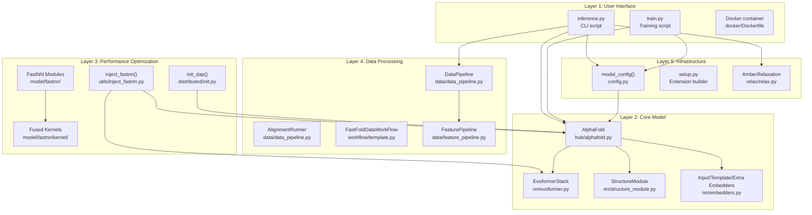
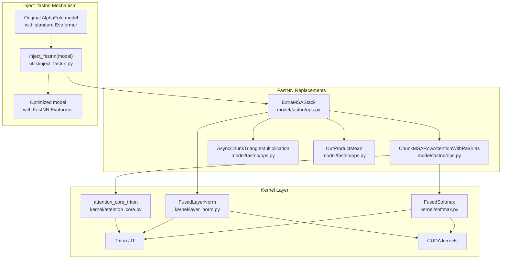
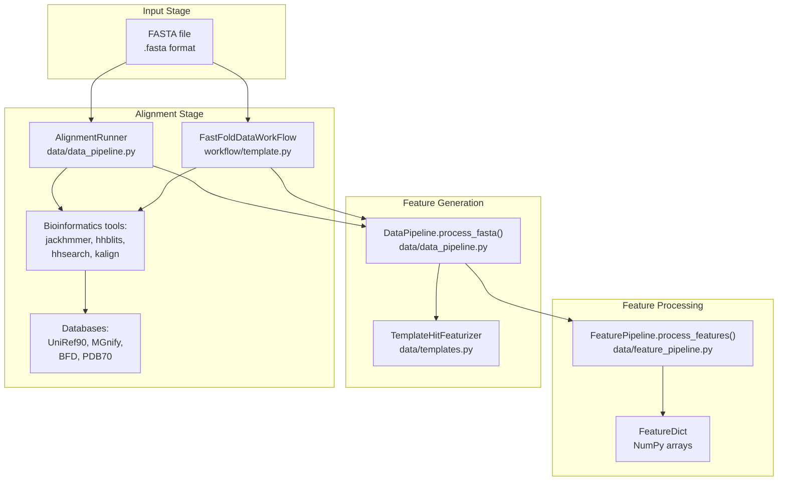
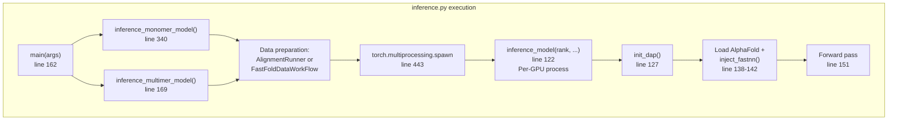

# FastFold Overview

> **Relevant source files**
> * [LICENSE](https://github.com/hpcaitech/FastFold/blob/eba49680/LICENSE)
> * [README.md](https://github.com/hpcaitech/FastFold/blob/eba49680/README.md?plain=1)
> * [environment.yml](https://github.com/hpcaitech/FastFold/blob/eba49680/environment.yml)
> * [fastfold/config.py](https://github.com/hpcaitech/FastFold/blob/eba49680/fastfold/config.py)
> * [fastfold/model/fastnn/kernel/layer_norm.py](https://github.com/hpcaitech/FastFold/blob/eba49680/fastfold/model/fastnn/kernel/layer_norm.py)
> * [fastfold/model/hub/alphafold.py](https://github.com/hpcaitech/FastFold/blob/eba49680/fastfold/model/hub/alphafold.py)
> * [fastfold/model/nn/embedders.py](https://github.com/hpcaitech/FastFold/blob/eba49680/fastfold/model/nn/embedders.py)
> * [fastfold/model/nn/template.py](https://github.com/hpcaitech/FastFold/blob/eba49680/fastfold/model/nn/template.py)
> * [fastfold/relax/relax.py](https://github.com/hpcaitech/FastFold/blob/eba49680/fastfold/relax/relax.py)
> * [fastfold/relax/utils.py](https://github.com/hpcaitech/FastFold/blob/eba49680/fastfold/relax/utils.py)
> * [inference.py](https://github.com/hpcaitech/FastFold/blob/eba49680/inference.py)

## Purpose and Scope

FastFold is a high-performance PyTorch implementation of the AlphaFold 2 protein structure prediction model, optimized for both training and inference on heterogeneous GPU clusters. This page provides an overview of FastFold's architecture, key optimizations, and execution modes.

For detailed installation instructions, see [Installation](/hpcaitech/FastFold/2.1-installation). For performance optimization strategies, see [Performance Optimizations](/hpcaitech/FastFold/8-performance-optimizations). For training-specific details, see [Training System](/hpcaitech/FastFold/7-training-system).

**Sources:** [README.md L1-L241](https://github.com/hpcaitech/FastFold/blob/eba49680/README.md?plain=1#L1-L241)

 [fastfold/model/hub/alphafold.py L1-L535](https://github.com/hpcaitech/FastFold/blob/eba49680/fastfold/model/hub/alphafold.py#L1-L535)

 [inference.py L1-L557](https://github.com/hpcaitech/FastFold/blob/eba49680/inference.py#L1-L557)

---

## What is FastFold?

FastFold maintains full compatibility with DeepMind's AlphaFold 2 while delivering **2-10x performance improvements** through a multi-level optimization strategy. The system enables:

* **Training acceleration**: Reduces AlphaFold training time from 11 days to 67 hours
* **Inference scalability**: Supports ultra-long sequences (>10,000 residues) via Dynamic Axial Parallelism
* **Data processing speedup**: 3-3Nx faster preprocessing with Ray workflow orchestration
* **Memory efficiency**: Chunking and inplace operations reduce peak memory usage

The core innovation is **surgical optimization**: FastFold replaces performance-critical components (Evoformer, kernels) while preserving the original AlphaFold architecture and model weights.

**Sources:** [README.md L17-L30](https://github.com/hpcaitech/FastFold/blob/eba49680/README.md?plain=1#L17-L30)

 [README.md L223-L236](https://github.com/hpcaitech/FastFold/blob/eba49680/README.md?plain=1#L223-L236)

---

## High-Level Architecture

FastFold's architecture consists of five major layers, each addressing different aspects of protein structure prediction:



**Architecture Layers:**

| Layer | Purpose | Key Components | Performance Impact |
| --- | --- | --- | --- |
| **User Interface** | Entry points for inference/training | `inference.py`, `train.py`, Docker | N/A |
| **Core Model** | AlphaFold architecture implementation | `AlphaFold`, `EvoformerStack`, `StructureModule` | Baseline |
| **Performance Optimization** | Acceleration via optimized kernels and parallelism | `inject_fastnn`, `init_dap`, fused kernels | 2-10x speedup |
| **Data Processing** | MSA generation, template search, feature extraction | `DataPipeline`, `AlignmentRunner`, Ray workflows | 3-3Nx speedup |
| **Infrastructure** | Configuration, build system, post-processing | `model_config`, `setup.py`, `AmberRelaxation` | N/A |

**Sources:** [fastfold/model/hub/alphafold.py L46-L106](https://github.com/hpcaitech/FastFold/blob/eba49680/fastfold/model/hub/alphafold.py#L46-L106)

 [fastfold/config.py L30-L126](https://github.com/hpcaitech/FastFold/blob/eba49680/fastfold/config.py#L30-L126)

 [inference.py L122-L160](https://github.com/hpcaitech/FastFold/blob/eba49680/inference.py#L122-L160)

 [README.md L82-L114](https://github.com/hpcaitech/FastFold/blob/eba49680/README.md?plain=1#L82-L114)

---

## Key Components and Code Mapping

### Model Components

The `AlphaFold` class ([fastfold/model/hub/alphafold.py L46-L535](https://github.com/hpcaitech/FastFold/blob/eba49680/fastfold/model/hub/alphafold.py#L46-L535)

) orchestrates the entire prediction pipeline:

```mermaid
flowchart TD

init["Initialize recycling<br>m_1_prev, z_prev, x_prev"]
iter["iteration()<br>line 173"]
recycle["Recycling loop<br>line 504"]
aux["AuxiliaryHeads<br>line 532"]
embed_in["InputEmbedder<br>line 202-210"]
embed_rec["RecyclingEmbedder<br>line 237-241"]
embed_tmpl["TemplateEmbedder<br>line 262-327"]
embed_extra["ExtraMSAEmbedder<br>line 339"]
stack_extra["ExtraMSAStack<br>line 342-362"]
stack_evo["EvoformerStack<br>line 370-390"]
struct["StructureModule<br>line 398-403"]

iter --> embed_in

subgraph subGraph1 ["iteration() method"]
    embed_in
    embed_rec
    embed_tmpl
    embed_extra
    stack_extra
    stack_evo
    struct
    embed_in --> embed_rec
    embed_rec --> embed_tmpl
    embed_tmpl --> embed_extra
    embed_extra --> stack_extra
    stack_extra --> stack_evo
    stack_evo --> struct
end

subgraph AlphaFold.forward() ["AlphaFold.forward()"]
    init
    iter
    recycle
    aux
    init --> recycle
    recycle --> iter
    iter --> recycle
    recycle --> aux
end
```

**Primary embedders** ([fastfold/model/nn/embedders.py L1-L452](https://github.com/hpcaitech/FastFold/blob/eba49680/fastfold/model/nn/embedders.py#L1-L452)

):

* `InputEmbedder`: Embeds target features and MSA into initial representations (m, z)
* `RecyclingEmbedder`: Processes previous iteration outputs for iterative refinement
* `TemplateEmbedder`: Embeds structural templates from PDB searches
* `ExtraMSAEmbedder`: Embeds unclustered MSA sequences

**Processing stacks:**

* `ExtraMSAStack`: Processes extra MSA features and updates pair representation
* `EvoformerStack`: Main transformer trunk (48 blocks by default)
* `StructureModule`: Predicts 3D coordinates from single and pair representations

**Sources:** [fastfold/model/hub/alphafold.py L173-L424](https://github.com/hpcaitech/FastFold/blob/eba49680/fastfold/model/hub/alphafold.py#L173-L424)

 [fastfold/model/nn/embedders.py L35-L138](https://github.com/hpcaitech/FastFold/blob/eba49680/fastfold/model/nn/embedders.py#L35-L138)

 [fastfold/model/nn/embedders.py L140-L234](https://github.com/hpcaitech/FastFold/blob/eba49680/fastfold/model/nn/embedders.py#L140-L234)

---

### Optimization Components



**FastNN optimization strategy:**

1. **Module replacement**: `inject_fastnn()` swaps standard Evoformer components with optimized versions
2. **Chunking**: Processes large tensors in configurable chunks to trade memory for computation
3. **Async communication**: Overlaps computation with inter-GPU communication for distributed execution
4. **Fused kernels**: Combines multiple operations into single CUDA/Triton kernels to reduce memory bandwidth

**Key optimization functions:**

* `inject_fastnn(model)`: Replaces Evoformer with FastNN version
* `set_chunk_size(chunk_size)`: Configures memory-compute tradeoff
* `init_dap(dap_size)`: Initializes Dynamic Axial Parallelism for sequence sharding

**Sources:** [README.md L82-L96](https://github.com/hpcaitech/FastFold/blob/eba49680/README.md?plain=1#L82-L96)

 [README.md L104-L114](https://github.com/hpcaitech/FastFold/blob/eba49680/README.md?plain=1#L104-L114)

 [fastfold/model/fastnn/kernel/layer_norm.py L19-L61](https://github.com/hpcaitech/FastFold/blob/eba49680/fastfold/model/fastnn/kernel/layer_norm.py#L19-L61)

---

### Data Processing Pipeline

The data processing system transforms raw protein sequences into model-ready features:



**Component details:**

| Component | Type | Function | Performance |
| --- | --- | --- | --- |
| `AlignmentRunner` | Sequential | Runs database searches in sequence | Baseline |
| `FastFoldDataWorkFlow` | Ray-accelerated | Parallelizes searches across compute nodes | 3x monomer, 3Nx multimer |
| `DataPipeline` | Processor | Parses MSA/template files into features | N/A |
| `TemplateHitFeaturizer` | Processor | Extracts features from template structures | N/A |
| `FeaturePipeline` | Processor | Applies data transformations for model input | N/A |

**Sources:** [inference.py L340-L432](https://github.com/hpcaitech/FastFold/blob/eba49680/inference.py#L340-L432)

 [inference.py L396-L412](https://github.com/hpcaitech/FastFold/blob/eba49680/inference.py#L396-L412)

---

## Execution Modes

FastFold supports two primary execution modes with distinct distributed strategies:

### Inference Mode



**Inference characteristics:**

* **Parallelism**: Process-level data parallelism via `torch.multiprocessing.spawn`
* **Communication**: Barrier synchronization only (line 158)
* **Memory**: Each GPU runs independent model copy
* **DAP usage**: Shards sequence dimension across GPUs when enabled

**Sources:** [inference.py L122-L160](https://github.com/hpcaitech/FastFold/blob/eba49680/inference.py#L122-L160)

 [inference.py L340-L489](https://github.com/hpcaitech/FastFold/blob/eba49680/inference.py#L340-L489)

 [inference.py L169-L338](https://github.com/hpcaitech/FastFold/blob/eba49680/inference.py#L169-L338)

### Training Mode

Training uses ColossalAI for sophisticated distributed execution with tensor model parallelism, data parallelism, and mixed precision training. See [Training System](/hpcaitech/FastFold/7-training-system) for details.

---

## Configuration System

FastFold uses `ml_collections.ConfigDict` for hierarchical configuration with field references:

```javascript
# Example: Loading model_1 configurationfrom fastfold.config import model_config config = model_config("model_1")# Returns ConfigDict with:# - config.globals (chunk_size, c_z, c_m, etc.)# - config.model (embedders, evoformer, structure_module)# - config.data (train, eval, predict settings)# - config.loss (fape, distogram, lddt, etc.)
```

**Available presets** ([fastfold/config.py L30-L114](https://github.com/hpcaitech/FastFold/blob/eba49680/fastfold/config.py#L30-L114)

):

* `initial_training`, `finetuning`: Training configurations
* `model_1` through `model_5`: AlphaFold model variants
* `model_1_ptm` through `model_5_ptm`: With pTM (predicted TM-score) head
* `model_*_multimer`: Multimer variants

**Field references** enable global parameter updates:

* `c_z = 128`: Pair representation dimension
* `c_m = 256`: MSA representation dimension
* `c_s = 384`: Single representation dimension
* `chunk_size = None`: Chunking size (None = no chunking)

**Sources:** [fastfold/config.py L30-L126](https://github.com/hpcaitech/FastFold/blob/eba49680/fastfold/config.py#L30-L126)

 [fastfold/config.py L128-L140](https://github.com/hpcaitech/FastFold/blob/eba49680/fastfold/config.py#L128-L140)

---

## Performance Features Summary

| Feature | Component | Speedup | Memory Impact |
| --- | --- | --- | --- |
| **inject_fastnn** | `utils/inject_fastnn.py` | 2-5x | Neutral |
| **Dynamic Axial Parallelism** | `distributed/init_dap` | 2x (enables 10K+ residues) | Distributed |
| **Fused kernels** | `model/fastnn/kernel/` | 2-10x per operation | Reduced |
| **Ray workflow** | `workflow/template.py` | 3-3Nx data processing | N/A |
| **Chunking** | `globals.chunk_size` | Slower but enables longer sequences | Reduced |
| **Inplace operations** | `globals.inplace` | Minor speedup | Reduced |

**Usage example:**

```javascript
# Inference with all optimizationsfrom fastfold.model.hub import AlphaFoldfrom fastfold.utils import inject_fastnnfrom fastfold.distributed import init_dapfrom fastfold.config import model_config # 1. Initialize DAP for multi-GPUinit_dap(dap_size=2) # 2. Load model with configurationconfig = model_config("model_1")config.globals.chunk_size = 128  # Enable chunkingconfig.globals.inplace = True     # Enable inplace opsmodel = AlphaFold(config) # 3. Inject optimizationsmodel = inject_fastnn(model) # 4. Run inferenceoutput = model(batch)
```

**Sources:** [README.md L19-L30](https://github.com/hpcaitech/FastFold/blob/eba49680/README.md?plain=1#L19-L30)

 [README.md L82-L96](https://github.com/hpcaitech/FastFold/blob/eba49680/README.md?plain=1#L82-L96)

 [inference.py L122-L145](https://github.com/hpcaitech/FastFold/blob/eba49680/inference.py#L122-L145)

---

## System Requirements

**Minimum requirements:**

* Python 3.8 or 3.9
* PyTorch 1.12 or above
* NVIDIA CUDA 11.3 or above

**Optional for maximum performance:**

* Triton (requires CUDA 11.4+) for optimized kernels
* Ray 2.0.0+ for workflow acceleration
* ColossalAI 0.2.7+ for distributed training
* Multiple GPUs for DAP

**Sources:** [README.md L32-L60](https://github.com/hpcaitech/FastFold/blob/eba49680/README.md?plain=1#L32-L60)

 [environment.yml L1-L33](https://github.com/hpcaitech/FastFold/blob/eba49680/environment.yml#L1-L33)

---

## Related Pages

* For installation details: [Installation](/hpcaitech/FastFold/2.1-installation)
* For inference workflow: [Inference Pipeline](/hpcaitech/FastFold/5-inference-pipeline)
* For training workflow: [Training System](/hpcaitech/FastFold/7-training-system)
* For optimization details: [Performance Optimizations](/hpcaitech/FastFold/8-performance-optimizations)
* For configuration reference: [Configuration System](/hpcaitech/FastFold/3-configuration-system)
* For API documentation: [API Reference](/hpcaitech/FastFold/11-api-reference)