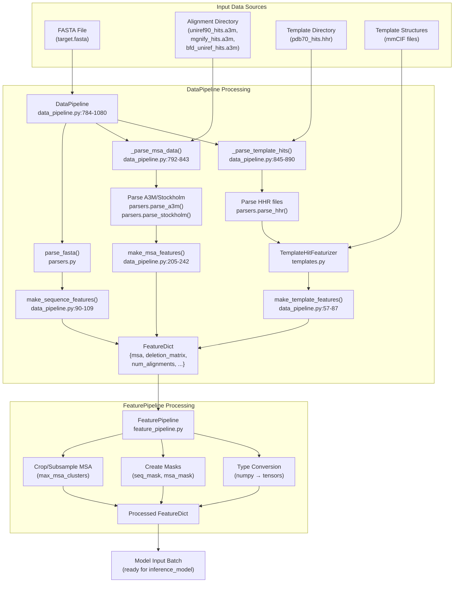
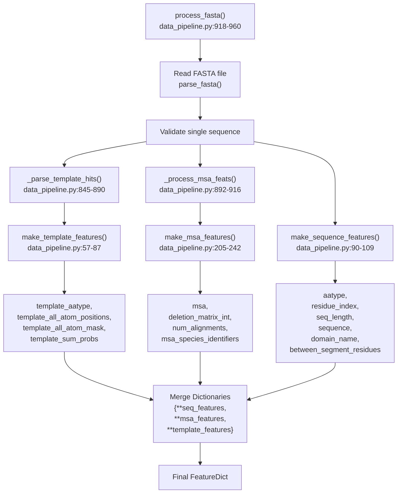
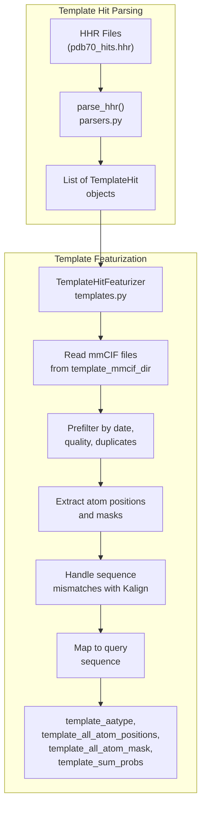
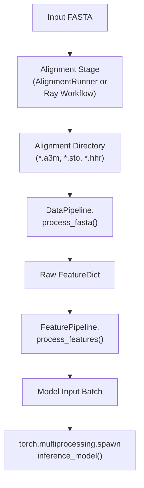

# Feature Generation for Inference

> **Relevant source files**
> * [README.md](https://github.com/hpcaitech/FastFold/blob/eba49680/README.md?plain=1)
> * [environment.yml](https://github.com/hpcaitech/FastFold/blob/eba49680/environment.yml)
> * [fastfold/common/protein.py](https://github.com/hpcaitech/FastFold/blob/eba49680/fastfold/common/protein.py)
> * [fastfold/data/data_pipeline.py](https://github.com/hpcaitech/FastFold/blob/eba49680/fastfold/data/data_pipeline.py)
> * [fastfold/utils/import_weights.py](https://github.com/hpcaitech/FastFold/blob/eba49680/fastfold/utils/import_weights.py)
> * [inference.py](https://github.com/hpcaitech/FastFold/blob/eba49680/inference.py)

This page documents how FastFold converts raw input data (FASTA files, alignment results, and template hits) into numerical feature dictionaries ready for model consumption during inference. Feature generation is a critical preprocessing step that transforms biological data into the tensor format required by the AlphaFold neural network.

For information about the alignment and MSA generation steps that produce the input data, see [Alignment and MSA Generation](/hpcaitech/FastFold/4.1-alignment-and-msa-generation). For details on how these features are processed and fed into the model, see [Distributed Inference Execution](/hpcaitech/FastFold/5.2-distributed-inference-execution).

## Overview

The feature generation pipeline consists of two main components:

1. **DataPipeline**: Parses raw alignment files, template hits, and FASTA sequences into intermediate feature dictionaries
2. **FeaturePipeline**: Applies transformations (cropping, masking, type conversion) to produce model-ready batches

The output is a `FeatureDict` containing approximately 50 different numpy arrays representing sequence information, MSA alignments, template structures, and metadata.

## Feature Generation Architecture



**Sources:** [inference.py L340-L437](https://github.com/hpcaitech/FastFold/blob/eba49680/inference.py#L340-L437)

 [fastfold/data/data_pipeline.py L784-L1080](https://github.com/hpcaitech/FastFold/blob/eba49680/fastfold/data/data_pipeline.py#L784-L1080)

## DataPipeline Class

The `DataPipeline` class is the primary interface for converting raw biological data into feature dictionaries. It is instantiated with a template featurizer and provides methods for processing different input formats.

### Initialization

```markdown
# From inference.py:360data_processor = data_pipeline.DataPipeline(    template_featurizer=template_featurizer)
```

The pipeline requires a `TemplateHitFeaturizer` instance that handles conversion of template structure hits into numerical features.

**Sources:** [inference.py L344-L360](https://github.com/hpcaitech/FastFold/blob/eba49680/inference.py#L344-L360)

 [fastfold/data/data_pipeline.py L786-L790](https://github.com/hpcaitech/FastFold/blob/eba49680/fastfold/data/data_pipeline.py#L786-L790)

### Processing FASTA Files

The main entry point is `process_fasta()`, which orchestrates all feature generation steps:



**Sources:** [fastfold/data/data_pipeline.py L918-L960](https://github.com/hpcaitech/FastFold/blob/eba49680/fastfold/data/data_pipeline.py#L918-L960)

### MSA Feature Generation

MSA features are extracted from alignment files (`.a3m` for A3M format, `.sto` for Stockholm format):

| Method | Purpose | Output Features |
| --- | --- | --- |
| `_parse_msa_data()` | Parse alignment files from directory | Dict of MSA objects |
| `make_msa_features()` | Convert MSA sequences to integer arrays | `msa`, `deletion_matrix_int`, `num_alignments`, `msa_species_identifiers` |

**Key Processing Steps:**

1. **File Parsing** [data_pipeline.py L792-L843](https://github.com/hpcaitech/FastFold/blob/eba49680/data_pipeline.py#L792-L843) : Iterates through alignment directory, parsing `.a3m` and `.sto` files using `parsers.parse_a3m()` and `parsers.parse_stockholm()`
2. **Deduplication** [data_pipeline.py L213-L222](https://github.com/hpcaitech/FastFold/blob/eba49680/data_pipeline.py#L213-L222) : Removes duplicate sequences using a set-based approach to avoid redundant information
3. **Integer Encoding** [data_pipeline.py L223-L224](https://github.com/hpcaitech/FastFold/blob/eba49680/data_pipeline.py#L223-L224) : Converts amino acid sequences to integer arrays using `residue_constants.HHBLITS_AA_TO_ID` mapping
4. **Species Extraction** [data_pipeline.py L228-L231](https://github.com/hpcaitech/FastFold/blob/eba49680/data_pipeline.py#L228-L231) : Parses species identifiers from sequence descriptions for evolutionary analysis

**Generated Features:**

* **msa** `[num_alignments, num_res]`: Integer-encoded MSA sequences (0-20 for amino acids, 21 for gaps)
* **deletion_matrix_int** `[num_alignments, num_res]`: Number of deletions after each residue
* **num_alignments** `[num_res]`: Total count of aligned sequences (repeated for each residue)
* **msa_species_identifiers** `[num_alignments]`: Species ID strings for each MSA row

**Sources:** [fastfold/data/data_pipeline.py L792-L843](https://github.com/hpcaitech/FastFold/blob/eba49680/fastfold/data/data_pipeline.py#L792-L843)

 [fastfold/data/data_pipeline.py L205-L242](https://github.com/hpcaitech/FastFold/blob/eba49680/fastfold/data/data_pipeline.py#L205-L242)

### Template Feature Generation

Template features represent structural information from known protein structures:



**Template Feature Array Shapes:**

* **template_aatype** `[num_templates, num_res]`: Integer-encoded amino acid types
* **template_all_atom_positions** `[num_templates, num_res, 37, 3]`: 3D coordinates for all atoms (37 atom types per residue)
* **template_all_atom_mask** `[num_templates, num_res, 37]`: Binary mask indicating atom presence
* **template_sum_probs** `[num_templates, 1]`: Template quality scores from alignment e-values

**Empty Templates:** If no template hits are found or the featurizer is `None`, `empty_template_feats()` [data_pipeline.py L47-L54](https://github.com/hpcaitech/FastFold/blob/eba49680/data_pipeline.py#L47-L54)

 generates zero-filled arrays with shape `[0, num_res, ...]`.

**Sources:** [fastfold/data/data_pipeline.py L57-L87](https://github.com/hpcaitech/FastFold/blob/eba49680/fastfold/data/data_pipeline.py#L57-L87)

 [fastfold/data/data_pipeline.py L845-L890](https://github.com/hpcaitech/FastFold/blob/eba49680/fastfold/data/data_pipeline.py#L845-L890)

 [inference.py L344-L351](https://github.com/hpcaitech/FastFold/blob/eba49680/inference.py#L344-L351)

### Sequence Feature Generation

Sequence features encode the target protein's primary structure and metadata:

**Generated Features:**

| Feature Name | Shape | Description |
| --- | --- | --- |
| `aatype` | `[num_res, 21]` | One-hot encoded amino acid type (20 standard + 1 unknown) |
| `residue_index` | `[num_res]` | Positional indices (0, 1, 2, ..., num_res-1) |
| `seq_length` | `[num_res]` | Constant array filled with total sequence length |
| `sequence` | `[1]` | UTF-8 encoded string of the full sequence |
| `domain_name` | `[1]` | UTF-8 encoded description from FASTA header |
| `between_segment_residues` | `[num_res]` | Zero array (reserved for domain boundaries) |

**Encoding Process:**

1. Parse FASTA sequence string
2. Convert to one-hot encoding via `residue_constants.sequence_to_onehot()` [data_pipeline.py L95-L99](https://github.com/hpcaitech/FastFold/blob/eba49680/data_pipeline.py#L95-L99)
3. Create positional and length arrays
4. Store raw sequence and description as objects

**Sources:** [fastfold/data/data_pipeline.py L90-L109](https://github.com/hpcaitech/FastFold/blob/eba49680/fastfold/data/data_pipeline.py#L90-L109)

## FeaturePipeline Processing

The `FeaturePipeline` class transforms raw feature dictionaries into model-ready batches by applying cropping, masking, and type conversions:

```markdown
# From inference.py:235-237 and 369feature_processor = feature_pipeline.FeaturePipeline(config.data)processed_feature_dict = feature_processor.process_features(    feature_dict, mode='predict')
```

**Key Transformations:**

1. **MSA Subsampling**: Crops MSA to `max_msa_clusters` to limit memory usage
2. **Mask Generation**: Creates `seq_mask` and `msa_mask` tensors for attention operations
3. **Recycling Preparation**: Adds initial recycling embeddings for iterative refinement
4. **Type Casting**: Ensures all arrays have correct dtypes (float32, int64, etc.)

**Sources:** [inference.py L235-L237](https://github.com/hpcaitech/FastFold/blob/eba49680/inference.py#L235-L237)

 [inference.py L434-L437](https://github.com/hpcaitech/FastFold/blob/eba49680/inference.py#L434-L437)

## Feature Dictionary Structure

The complete feature dictionary contains approximately 50 keys organized into logical groups:

### Core Features

| Category | Feature Keys |
| --- | --- |
| **Sequence** | `aatype`, `residue_index`, `seq_length`, `sequence`, `domain_name`, `between_segment_residues` |
| **MSA** | `msa`, `deletion_matrix_int`, `num_alignments`, `msa_species_identifiers` |
| **Templates** | `template_aatype`, `template_all_atom_positions`, `template_all_atom_mask`, `template_sum_probs` |

### Multimer-Specific Features

For multimer predictions, additional assembly features are added via `add_assembly_features()` [data_pipeline.py L727-L769](https://github.com/hpcaitech/FastFold/blob/eba49680/data_pipeline.py#L727-L769)

:

* **asym_id** `[num_res]`: Asymmetric unit ID (unique per chain copy)
* **sym_id** `[num_res]`: Symmetry ID (copy number for homooligomers)
* **entity_id** `[num_res]`: Entity ID (unique per unique sequence)
* **auth_chain_id** `[1]`: Original chain identifier from input

**Sources:** [fastfold/data/data_pipeline.py L727-L769](https://github.com/hpcaitech/FastFold/blob/eba49680/fastfold/data/data_pipeline.py#L727-L769)

 [fastfold/data/data_pipeline.py L678-L702](https://github.com/hpcaitech/FastFold/blob/eba49680/fastfold/data/data_pipeline.py#L678-L702)

## Monomer vs Multimer Pipeline Differences

FastFold provides separate pipelines for monomer and multimer predictions:


### Key Differences

**Monomer Processing** [inference.py L340-L437](https://github.com/hpcaitech/FastFold/blob/eba49680/inference.py#L340-L437)

:

* Single `process_fasta()` call
* Direct feature generation
* No assembly or pairing steps

**Multimer Processing** [inference.py L169-L338](https://github.com/hpcaitech/FastFold/blob/eba49680/inference.py#L169-L338)

 [data_pipeline.py L1082-L1189](https://github.com/hpcaitech/FastFold/blob/eba49680/data_pipeline.py#L1082-L1189)

:

* Per-chain alignment and processing
* Feature conversion via `convert_monomer_features()` (removes leading dimensions, converts aatype from one-hot to indices)
* Assembly feature addition (entity_id, asym_id, sym_id)
* MSA pairing for co-evolution signals via `pair_and_merge()` [data_pipeline.py L1182-L1184](https://github.com/hpcaitech/FastFold/blob/eba49680/data_pipeline.py#L1182-L1184)
* Padding to minimum 512 MSA sequences [data_pipeline.py L1187](https://github.com/hpcaitech/FastFold/blob/eba49680/data_pipeline.py#L1187-L1187)

**Sources:** [inference.py L169-L338](https://github.com/hpcaitech/FastFold/blob/eba49680/inference.py#L169-L338)

 [inference.py L340-L437](https://github.com/hpcaitech/FastFold/blob/eba49680/inference.py#L340-L437)

 [fastfold/data/data_pipeline.py L1082-L1189](https://github.com/hpcaitech/FastFold/blob/eba49680/fastfold/data/data_pipeline.py#L1082-L1189)

## Feature Generation in Inference Context

The complete inference workflow integrates feature generation between alignment and model execution:



**Invocation Pattern:**

```python
# Monomer example from inference.py:428-437feature_dict = data_processor.process_fasta(    fasta_path=fasta_path,    alignment_dir=local_alignment_dir) processed_feature_dict = feature_processor.process_features(    feature_dict,    mode='predict',) batch = processed_feature_dict
```

The resulting `batch` dictionary is passed to `inference_model()` via multiprocessing, where it is converted to CUDA tensors and fed into the AlphaFold model.

**Sources:** [inference.py L428-L437](https://github.com/hpcaitech/FastFold/blob/eba49680/inference.py#L428-L437)

 [inference.py L281-L288](https://github.com/hpcaitech/FastFold/blob/eba49680/inference.py#L281-L288)

 [inference.py L147-L149](https://github.com/hpcaitech/FastFold/blob/eba49680/inference.py#L147-L149)