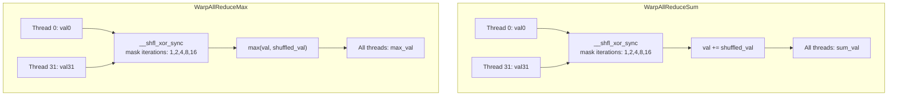
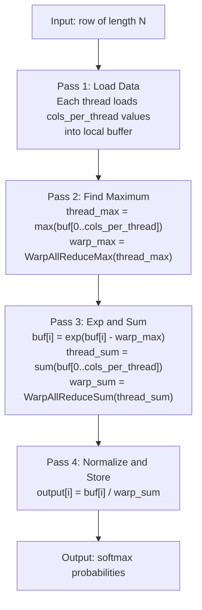
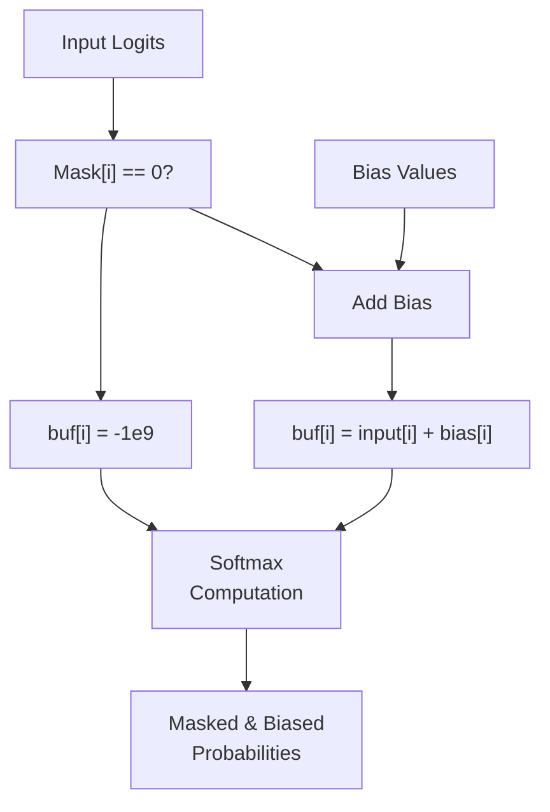
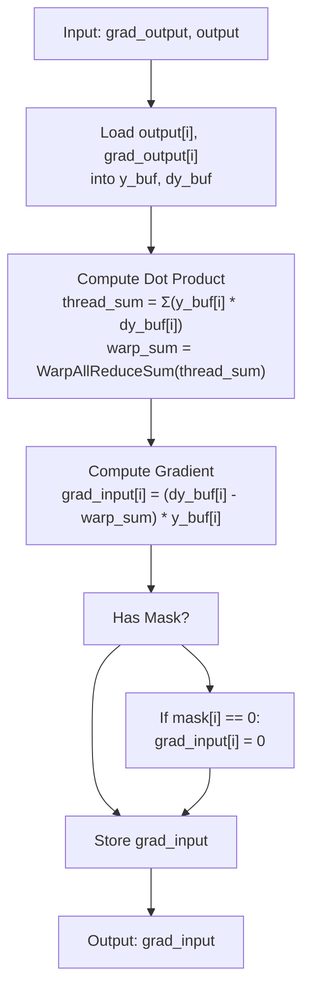
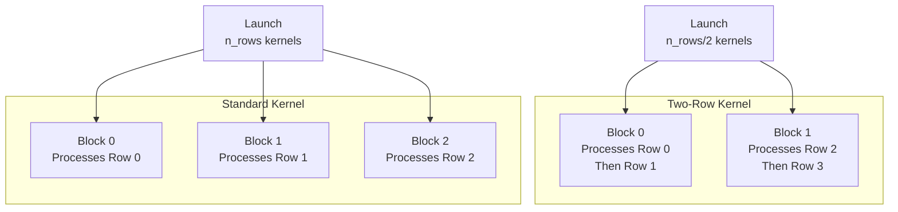
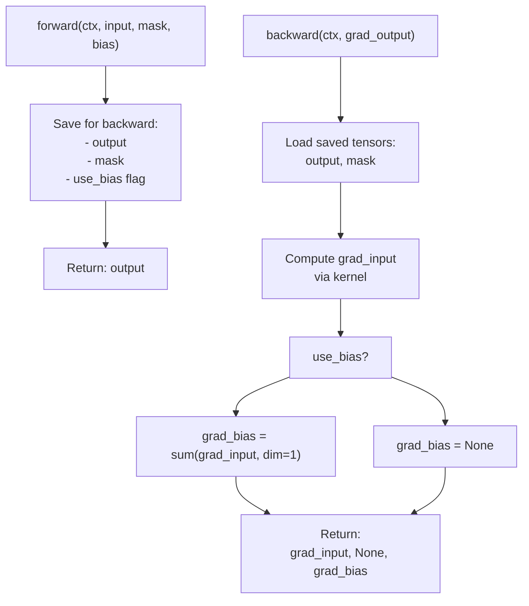
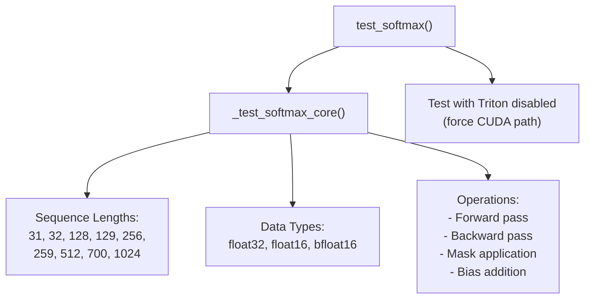

# Fused Softmax Kernel

> **Relevant source files**
> * [fastfold/model/fastnn/kernel/cuda_native/csrc/softmax_cuda.cpp](https://github.com/hpcaitech/FastFold/blob/eba49680/fastfold/model/fastnn/kernel/cuda_native/csrc/softmax_cuda.cpp)
> * [fastfold/model/fastnn/kernel/cuda_native/csrc/softmax_cuda_kernel.cu](https://github.com/hpcaitech/FastFold/blob/eba49680/fastfold/model/fastnn/kernel/cuda_native/csrc/softmax_cuda_kernel.cu)
> * [fastfold/model/fastnn/kernel/softmax.py](https://github.com/hpcaitech/FastFold/blob/eba49680/fastfold/model/fastnn/kernel/softmax.py)
> * [fastfold/model/fastnn/kernel/triton/softmax.py](https://github.com/hpcaitech/FastFold/blob/eba49680/fastfold/model/fastnn/kernel/triton/softmax.py)
> * [tests/test_fastnn/test_softmax.py](https://github.com/hpcaitech/FastFold/blob/eba49680/tests/test_fastnn/test_softmax.py)

## Purpose and Scope

The Fused Softmax Kernel provides optimized CUDA and Triton implementations of the softmax operation with integrated masking and bias addition. This kernel fuses multiple operations (mask application, bias addition, max computation, exponentiation, and normalization) into a single GPU kernel, reducing memory bandwidth requirements and improving performance by 2-10x compared to standard PyTorch implementations.

This page documents the kernel implementation details. For information about how this kernel integrates with the broader FastNN operation layer, see [FastNN Operations](/hpcaitech/FastFold/8.2-fastnn-operations). For details on other optimized kernels, see [Fused Attention Core Kernel](/hpcaitech/FastFold/8.3.2-fused-attention-core-kernel).

---

## System Architecture

The fused softmax kernel uses a two-tier dispatch strategy that automatically selects between Triton JIT-compiled kernels (when available) and optimized CUDA kernels as a fallback.

```mermaid
flowchart TD

UserCode["User Code"]
FusedSoftmaxFunc["FusedSoftmaxFunc<br>(torch.autograd.Function)"]
ForwardDispatch["forward()"]
BackwardDispatch["backward()"]
TritonCheck["_triton_available?"]
TritonWrapper["softmax_triton_kernel_wrapper()"]
TritonGradWrapper["softmax_grad_triton_kernel_wrapper()"]
SingleRowKernel["softmax_mask_bias_kernel"]
TwoRowKernel["softmax_mask_bias_kernel_two_rows"]
GradSingleRow["softmax_grad_kernel"]
GradTwoRow["softmax_grad_kernel_two_rows"]
CUDAWrapper["softmax_cuda_kernel_wrapper()"]
CUDAGradWrapper["softmax_grad_cuda_kernel_wrapper()"]
WarpKernel["fastfold_softmax<br>(cols <= 1024)"]
SharedMemKernel["fastfold_softmax_sm<br>(cols > 1024)"]
MaskKernel["fastfold_softmax_mask"]
BiasKernel["fastfold_softmax_mask_bias"]
GradKernel["fastfold_softmax_grad"]
MaskGradKernel["fastfold_softmax_mask_grad"]
SoftmaxCPP["fastfold_softmax_cuda module"]
ForwardBinding["forward()"]
BackwardBinding["backward()"]
MaskForwardBinding["fused_mask_softmax_forward()"]
MaskBackwardBinding["fused_mask_softmax_backward()"]
BiasForwardBinding["fused_mask_bias_softmax_forward()"]
BiasBackwardBinding["fused_mask_bias_softmax_backward()"]

FusedSoftmaxFunc --> ForwardDispatch
FusedSoftmaxFunc --> BackwardDispatch
TritonCheck --> TritonWrapper
TritonCheck --> TritonGradWrapper
TritonCheck --> CUDAWrapper
TritonCheck --> CUDAGradWrapper
CUDAWrapper --> SoftmaxCPP
CUDAGradWrapper --> SoftmaxCPP
ForwardBinding --> WarpKernel
ForwardBinding --> SharedMemKernel
MaskForwardBinding --> MaskKernel
BiasForwardBinding --> BiasKernel
BackwardBinding --> GradKernel
MaskBackwardBinding --> MaskGradKernel
BiasBackwardBinding --> MaskGradKernel

subgraph subGraph6 ["Pybind11 Bindings"]
    SoftmaxCPP
    ForwardBinding
    BackwardBinding
    MaskForwardBinding
    MaskBackwardBinding
    BiasForwardBinding
    BiasBackwardBinding
    SoftmaxCPP --> ForwardBinding
    SoftmaxCPP --> BackwardBinding
    SoftmaxCPP --> MaskForwardBinding
    SoftmaxCPP --> MaskBackwardBinding
    SoftmaxCPP --> BiasForwardBinding
    SoftmaxCPP --> BiasBackwardBinding
end

subgraph subGraph5 ["CUDA Implementation"]
    CUDAWrapper
    CUDAGradWrapper
    CUDAWrapper --> WarpKernel
    CUDAWrapper --> SharedMemKernel
    CUDAWrapper --> MaskKernel
    CUDAWrapper --> BiasKernel
    CUDAGradWrapper --> GradKernel
    CUDAGradWrapper --> MaskGradKernel

subgraph subGraph4 ["CUDA Kernels"]
    WarpKernel
    SharedMemKernel
    MaskKernel
    BiasKernel
    GradKernel
    MaskGradKernel
end
end

subgraph subGraph3 ["Triton Implementation"]
    TritonWrapper
    TritonGradWrapper
    TritonWrapper --> SingleRowKernel
    TritonWrapper --> TwoRowKernel
    TritonGradWrapper --> GradSingleRow
    TritonGradWrapper --> GradTwoRow

subgraph subGraph2 ["Triton Kernels"]
    SingleRowKernel
    TwoRowKernel
    GradSingleRow
    GradTwoRow
end
end

subgraph subGraph1 ["Dispatch Layer"]
    ForwardDispatch
    BackwardDispatch
    TritonCheck
    ForwardDispatch --> TritonCheck
    BackwardDispatch --> TritonCheck
end

subgraph subGraph0 ["Python Interface Layer"]
    UserCode
    FusedSoftmaxFunc
    UserCode --> FusedSoftmaxFunc
end
```



**Sources:** [fastfold/model/fastnn/kernel/softmax.py L1-L59](https://github.com/hpcaitech/FastFold/blob/eba49680/fastfold/model/fastnn/kernel/softmax.py#L1-L59)

 [fastfold/model/fastnn/kernel/cuda_native/csrc/softmax_cuda.cpp L1-L27](https://github.com/hpcaitech/FastFold/blob/eba49680/fastfold/model/fastnn/kernel/cuda_native/csrc/softmax_cuda.cpp#L1-L27)

---

## Kernel Dispatch Logic

The `FusedSoftmaxFunc` class implements PyTorch's autograd interface and handles kernel selection based on runtime availability.

### Dispatch Mechanism

| Condition | Selected Implementation | Fallback |
| --- | --- | --- |
| Triton available | `softmax_triton_kernel_wrapper` | N/A |
| Triton unavailable | `softmax_cuda_kernel_wrapper` | None (required) |
| Import error | Log warning, disable Triton | CUDA kernels |

The availability check occurs at module import time:

```javascript
_triton_available = Trueif _triton_available:    try:        from .triton.softmax import softmax_triton_kernel_wrapper        from .triton.softmax import softmax_grad_triton_kernel_wrapper    except ImportError:        logging.warning("Triton is not available, fallback to old kernel.")        _triton_available = False
```

**Sources:** [fastfold/model/fastnn/kernel/softmax.py L7-L18](https://github.com/hpcaitech/FastFold/blob/eba49680/fastfold/model/fastnn/kernel/softmax.py#L7-L18)

---

## CUDA Native Implementation

The CUDA implementation provides three main kernel variants optimized for different column sizes, using warp-level primitives for small dimensions and shared memory for larger ones.

### Warp-Based Reduction Primitives

The CUDA kernels utilize warp shuffle instructions for fast parallel reductions within a warp (32 threads):



These primitives implement the butterfly reduction pattern, where each thread exchanges data with neighbors at distances 1, 2, 4, 8, 16, completing in 5 steps (log₂(32)).

**Sources:** [fastfold/model/fastnn/kernel/cuda_native/csrc/softmax_cuda_kernel.cu L18-L30](https://github.com/hpcaitech/FastFold/blob/eba49680/fastfold/model/fastnn/kernel/cuda_native/csrc/softmax_cuda_kernel.cu#L18-L30)

### Kernel Variants by Column Size

The implementation selects kernels based on the number of columns to optimize memory access patterns:

| Column Range | Kernel | Optimization Strategy |
| --- | --- | --- |
| cols ≤ 32 | `fastfold_softmax<T, 1>` | 1 value per thread, single warp |
| 33 ≤ cols ≤ 1024 | `fastfold_softmax<T, N>` | N values per thread (2-32), warp reduction |
| cols > 1024 | `fastfold_softmax_sm<T, 128>` | Shared memory, block reduction |

The template parameter `cols_per_thread` is selected using a macro-based case statement:

```
COLS_CASE(2)   // for cols ≤ 64
COLS_CASE(3)   // for cols ≤ 96
...
COLS_CASE(32)  // for cols ≤ 1024
```

**Sources:** [fastfold/model/fastnn/kernel/cuda_native/csrc/softmax_cuda_kernel.cu L163-L249](https://github.com/hpcaitech/FastFold/blob/eba49680/fastfold/model/fastnn/kernel/cuda_native/csrc/softmax_cuda_kernel.cu#L163-L249)

### Grid Configuration

The CUDA kernels use a grid-stride loop pattern with specific block configurations:

| Kernel Type | Grid Size | Block Size | Rows per Block |
| --- | --- | --- | --- |
| Warp-based | `(rows + 3) / 4` | 128 threads | 4 rows |
| Shared memory | Dynamic (waves=32) | 128 threads | Grid-stride |

The warp-based kernel processes 4 rows per block, with each row handled by a warp (32 threads). The block contains 4 warps (128 threads total).

**Sources:** [fastfold/model/fastnn/kernel/cuda_native/csrc/softmax_cuda_kernel.cu L169-L170](https://github.com/hpcaitech/FastFold/blob/eba49680/fastfold/model/fastnn/kernel/cuda_native/csrc/softmax_cuda_kernel.cu#L169-L170)

 [fastfold/model/fastnn/kernel/cuda_native/csrc/softmax_cuda_kernel.cu L231-L234](https://github.com/hpcaitech/FastFold/blob/eba49680/fastfold/model/fastnn/kernel/cuda_native/csrc/softmax_cuda_kernel.cu#L231-L234)

### Forward Pass Algorithm (Warp-Based)

The warp-based softmax kernel implements the numerically stable softmax formula in four passes:



**Key implementation details:**

1. **Max computation** (lines 98-114): Each thread finds the local max, then warp reduction computes the global max
2. **Exp-sum** (lines 116-123): Subtract max for numerical stability, exponentiate, sum within warp
3. **Division** (lines 124-130): Normalize by warp sum using fast division `__fdividef`

**Sources:** [fastfold/model/fastnn/kernel/cuda_native/csrc/softmax_cuda_kernel.cu L84-L132](https://github.com/hpcaitech/FastFold/blob/eba49680/fastfold/model/fastnn/kernel/cuda_native/csrc/softmax_cuda_kernel.cu#L84-L132)

### Mask and Bias Integration

The fused mask-bias kernel combines three operations into a single pass:



**Mask pointer calculation:**

```
mask_ptr = mask + ((row_offset / (head * cols)) * cols)
```

**Bias pointer calculation:**

```
bias_ptr = bias + ((row_offset % (head * cols)) * cols)
```

This indexing scheme supports multi-head attention where masks are per-sequence and biases are per-head.

**Sources:** [fastfold/model/fastnn/kernel/cuda_native/csrc/softmax_cuda_kernel.cu L338-L388](https://github.com/hpcaitech/FastFold/blob/eba49680/fastfold/model/fastnn/kernel/cuda_native/csrc/softmax_cuda_kernel.cu#L338-L388)

 [fastfold/model/fastnn/kernel/cuda_native/csrc/softmax_cuda_kernel.cu L618-L670](https://github.com/hpcaitech/FastFold/blob/eba49680/fastfold/model/fastnn/kernel/cuda_native/csrc/softmax_cuda_kernel.cu#L618-L670)

### Backward Pass Algorithm

The gradient computation uses the identity: `∇L/∇x_i = (∇L/∇y_i - Σ(y_j * ∇L/∇y_j)) * y_i`



The key optimization is computing the global reduction `Σ(y * dy)` once and broadcasting it to all threads.

**Sources:** [fastfold/model/fastnn/kernel/cuda_native/csrc/softmax_cuda_kernel.cu L252-L308](https://github.com/hpcaitech/FastFold/blob/eba49680/fastfold/model/fastnn/kernel/cuda_native/csrc/softmax_cuda_kernel.cu#L252-L308)

 [fastfold/model/fastnn/kernel/cuda_native/csrc/softmax_cuda_kernel.cu L524-L585](https://github.com/hpcaitech/FastFold/blob/eba49680/fastfold/model/fastnn/kernel/cuda_native/csrc/softmax_cuda_kernel.cu#L524-L585)

---

## Triton JIT Implementation

The Triton implementation provides a high-level, portable alternative to CUDA with automatic kernel tuning and compiler optimizations.

### Two-Row Processing Optimization

When `n_cols <= 128` and `n_rows % 2 == 0`, the Triton kernel processes two rows per thread block to improve instruction-level parallelism and reduce kernel launch overhead:



This optimization reduces grid size by 50% and improves cache locality by processing consecutive rows in the same block.

**Sources:** [fastfold/model/fastnn/kernel/triton/softmax.py L168-L170](https://github.com/hpcaitech/FastFold/blob/eba49680/fastfold/model/fastnn/kernel/triton/softmax.py#L168-L170)

 [fastfold/model/fastnn/kernel/triton/softmax.py L72-L110](https://github.com/hpcaitech/FastFold/blob/eba49680/fastfold/model/fastnn/kernel/triton/softmax.py#L72-L110)

### Triton Kernel Configuration

The wrapper automatically selects warp count based on block size:

| BLOCK_SIZE | num_warps | Typical Use Case |
| --- | --- | --- |
| < 1024 | 1 | Small sequence lengths |
| 1024-2047 | 4 | Medium sequences |
| 2048-4095 | 8 | Long sequences |
| ≥ 4096 | 16 | Ultra-long sequences |

The `BLOCK_SIZE` is rounded up to the next power of 2 for optimal memory coalescing.

**Sources:** [fastfold/model/fastnn/kernel/triton/softmax.py L157-L164](https://github.com/hpcaitech/FastFold/blob/eba49680/fastfold/model/fastnn/kernel/triton/softmax.py#L157-L164)

### Triton Forward Core

The `_softmax_core` function implements the fused operation using Triton's high-level memory operations:

```markdown
# Load with out-of-bounds handlingrow = tl.load(input_ptrs, mask=col_offsets < n_cols, other=-float('inf')) # Optional bias additionif use_bias:    bias = tl.load(bias_ptrs, mask=col_offsets < n_cols, other=-inf)    row += bias # Optional maskingif use_mask:    mask = tl.load(mask_ptrs, mask=col_offsets < n_cols, other=-inf)    row = tl.where(mask == 0, -1e20, row) # Softmax computationrow_minus_max = row - tl.max(row, axis=0)numerator = tl.exp(row_minus_max)denominator = tl.sum(numerator, axis=0)softmax_output = numerator / denominator
```

The `use_mask` and `use_bias` parameters are compile-time constants (`tl.constexpr`), allowing the Triton compiler to eliminate unused code paths.

**Sources:** [fastfold/model/fastnn/kernel/triton/softmax.py L7-L27](https://github.com/hpcaitech/FastFold/blob/eba49680/fastfold/model/fastnn/kernel/triton/softmax.py#L7-L27)

### Triton Backward Core

The gradient kernel handles the special case of bfloat16 by explicitly converting to float32:

```
output_row = tl.load(output_ptrs, mask=col_offsets < n_cols, other=0)d_output_row = tl.load(d_output_ptrs, mask=col_offsets < n_cols, other=0) if is_bf16:    output_row = output_row.to(tl.float32)    d_output_row = d_output_row.to(tl.float32) row_sum = tl.sum(output_row * d_output_row, axis=0)d_softmax_output = (d_output_row - row_sum) * output_row
```

This ensures numerical accuracy for mixed-precision training scenarios.

**Sources:** [fastfold/model/fastnn/kernel/triton/softmax.py L29-L43](https://github.com/hpcaitech/FastFold/blob/eba49680/fastfold/model/fastnn/kernel/triton/softmax.py#L29-L43)

---

## Usage and Integration

### API Interface

The kernel is exposed through a single function using PyTorch's functional API:

```javascript
from fastfold.model.fastnn.kernel import fused_softmax # Basic usageoutput = fused_softmax(input, mask=None, bias=None) # With mask (shape: [batch, chunk, seq])output = fused_softmax(input, mask=mask, bias=None) # With mask and bias (shape: [batch, 1, heads, seq, seq])output = fused_softmax(input, mask=mask, bias=bias)
```

**Parameters:**

* `input`: Tensor of shape `[batch, chunk, heads, seq, seq]`
* `mask`: Optional binary mask of shape `[batch, chunk, seq]`
* `bias`: Optional bias tensor of shape `[batch, 1, heads, seq, seq]`

**Returns:**

* Tensor of same shape as `input` with softmax applied along last dimension

**Sources:** [fastfold/model/fastnn/kernel/softmax.py L59](https://github.com/hpcaitech/FastFold/blob/eba49680/fastfold/model/fastnn/kernel/softmax.py#L59-L59)

### Autograd Integration

The `FusedSoftmaxFunc` class ensures correct gradient flow:



The gradient for bias is computed by summing `grad_input` along the batch dimension, as bias is shared across batch elements.

**Sources:** [fastfold/model/fastnn/kernel/softmax.py L21-L56](https://github.com/hpcaitech/FastFold/blob/eba49680/fastfold/model/fastnn/kernel/softmax.py#L21-L56)

### Data Type Support

All kernels support three data types:

| Data Type | PyTorch Type | CUDA Type | Precision |
| --- | --- | --- | --- |
| FP32 | `torch.float32` | `float` | Full precision |
| FP16 | `torch.float16` | `at::Half` | Half precision |
| BF16 | `torch.bfloat16` | `at::BFloat16` | Brain float |

The kernels use template specialization to generate type-specific code at compile time.

**Sources:** [fastfold/model/fastnn/kernel/cuda_native/csrc/softmax_cuda_kernel.cu L173-L182](https://github.com/hpcaitech/FastFold/blob/eba49680/fastfold/model/fastnn/kernel/cuda_native/csrc/softmax_cuda_kernel.cu#L173-L182)

---

## Performance Characteristics

### Memory Access Pattern

The warp-based kernel achieves optimal memory bandwidth utilization through coalesced access:

* **Load phase**: Each warp reads consecutive memory locations (32 threads × N elements)
* **Computation**: All reduction operations use registers (no global memory access)
* **Store phase**: Coalesced writes of 32 consecutive elements per warp

For the shared memory variant (cols > 1024):

* **Shared memory size**: `cols * sizeof(float)` bytes per block
* **Bank conflicts**: Avoided by using float storage and sequential access

**Sources:** [fastfold/model/fastnn/kernel/cuda_native/csrc/softmax_cuda_kernel.cu L236](https://github.com/hpcaitech/FastFold/blob/eba49680/fastfold/model/fastnn/kernel/cuda_native/csrc/softmax_cuda_kernel.cu#L236-L236)

### Occupancy Analysis

Block configuration targets maximum occupancy:

| Block Size | Registers/Thread | Shared Memory | Theoretical Occupancy |
| --- | --- | --- | --- |
| 128 | ~20 | 0 (warp) | 100% |
| 128 | ~25 | cols × 4 bytes | 75-100% (depends on cols) |

The warp-based kernel has zero shared memory usage, maximizing occupancy. The shared memory variant's occupancy depends on the number of columns.

---

## Testing and Validation

The test suite validates correctness across multiple dimensions:

### Test Coverage



**Tolerance levels by data type:**

* FP32: `1e-6`
* FP16: `2e-4`
* BF16: `1e-3`

The tests compare FastFold kernels against PyTorch's reference implementation using manual masking and bias addition.

**Sources:** [tests/test_fastnn/test_softmax.py L1-L64](https://github.com/hpcaitech/FastFold/blob/eba49680/tests/test_fastnn/test_softmax.py#L1-L64)

---

## Build and Compilation

### Pybind11 Module Definition

The CUDA kernels are exposed to Python through Pybind11:

```
PYBIND11_MODULE(TORCH_EXTENSION_NAME, m) {    m.def("forward", &softmax, "Softmax forward (CUDA)");    m.def("backward", &softmax_gradient, "Softmax backward (CUDA)");    m.def("fused_mask_softmax_forward", &fused_mask_softmax_forward, ...);    m.def("fused_mask_softmax_backward", &fused_mask_softmax_backward, ...);    m.def("fused_mask_bias_softmax_forward", &fused_mask_bias_softmax_forward, ...);    m.def("fused_mask_bias_softmax_backward", &fused_mask_bias_softmax_backward, ...);}
```

The module is built as `fastfold_softmax_cuda` and imported by the Python wrapper layer.

**Sources:** [fastfold/model/fastnn/kernel/cuda_native/csrc/softmax_cuda.cpp L16-L27](https://github.com/hpcaitech/FastFold/blob/eba49680/fastfold/model/fastnn/kernel/cuda_native/csrc/softmax_cuda.cpp#L16-L27)

### Compilation Requirements

* **CUDA Toolkit**: Required for CUDA kernels
* **PyTorch**: >= 1.10 with CUDA support
* **Triton**: Optional, installed via pip
* **CUB**: CUDA Unbound library (included with CUDA >= 11.0)

The build system automatically detects CUDA availability and compiles extensions during `pip install`.

---

## Summary

The Fused Softmax Kernel represents a critical performance optimization in FastFold's kernel stack:

**Key Features:**

* **Fusion**: Combines mask, bias, and softmax into single kernel
* **Dual Implementation**: Triton JIT (portable) and CUDA (optimized)
* **Adaptive Selection**: Automatic kernel variant selection based on problem size
* **Data Type Support**: FP32, FP16, BF16 with appropriate numerical handling
* **Memory Efficiency**: Warp-level reductions minimize global memory traffic

**Performance Impact:**

* **Bandwidth Reduction**: 3x fewer memory operations vs. unfused implementation
* **Latency Reduction**: 2-10x speedup depending on sequence length
* **Occupancy**: Near-optimal GPU utilization through careful block configuration

The kernel serves as a foundation for higher-level attention operations in the FastNN module layer.