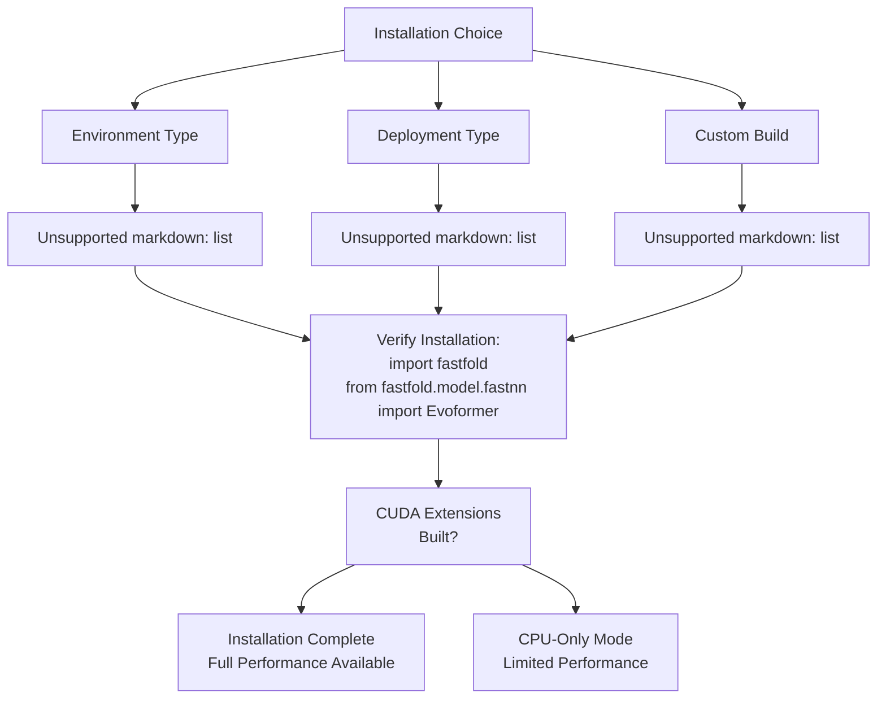
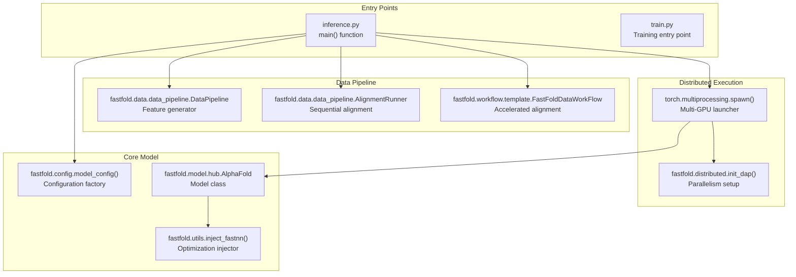
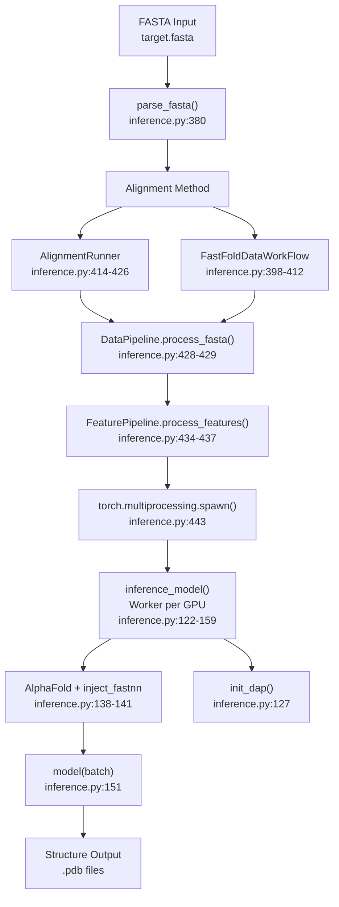

# Getting Started

> **Relevant source files**
> * [.github/workflows/build.yml](https://github.com/hpcaitech/FastFold/blob/eba49680/.github/workflows/build.yml)
> * [README.md](https://github.com/hpcaitech/FastFold/blob/eba49680/README.md?plain=1)
> * [docker/Dockerfile](https://github.com/hpcaitech/FastFold/blob/eba49680/docker/Dockerfile)
> * [environment.yml](https://github.com/hpcaitech/FastFold/blob/eba49680/environment.yml)
> * [inference.py](https://github.com/hpcaitech/FastFold/blob/eba49680/inference.py)
> * [requirements/requirements.txt](https://github.com/hpcaitech/FastFold/blob/eba49680/requirements/requirements.txt)
> * [requirements/test_requirements.txt](https://github.com/hpcaitech/FastFold/blob/eba49680/requirements/test_requirements.txt)
> * [setup.py](https://github.com/hpcaitech/FastFold/blob/eba49680/setup.py)

This guide provides an overview of how to install and begin using FastFold for protein structure prediction. It covers the essential prerequisites, installation approaches, and initial workflows to help you quickly start running inference or training experiments.

**Scope**: This page introduces the setup process and basic usage patterns. For detailed installation instructions, see [Installation](/hpcaitech/FastFold/2.1-installation). For step-by-step inference guides, see [Quick Start: Inference](/hpcaitech/FastFold/2.2-quick-start:-inference). For training setup, see [Quick Start: Training](/hpcaitech/FastFold/2.3-quick-start:-training). For the underlying system architecture, see [System Architecture](/hpcaitech/FastFold/1.1-system-architecture).

---

## Prerequisites

FastFold requires specific hardware and software configurations to leverage its performance optimizations effectively.

### Hardware Requirements

| Component | Minimum | Recommended |
| --- | --- | --- |
| **GPU** | NVIDIA GPU with CUDA 11.3+ support | NVIDIA A100/V100 with 40GB+ VRAM |
| **CPU** | 4 cores | 12+ cores for parallel alignment tools |
| **RAM** | 16 GB | 64 GB+ for long sequences |
| **Storage** | 100 GB | 2+ TB for complete database storage |

### Software Requirements

| Component | Version | Purpose |
| --- | --- | --- |
| **Python** | 3.8 or 3.9 | Runtime environment |
| **NVIDIA CUDA** | 11.3 or above | GPU acceleration |
| **PyTorch** | 1.12 or above | Deep learning framework |
| **Triton** (optional) | Latest pre-release | Optimized kernel compilation |

**Note**: Triton requires CUDA 11.4+ and provides additional 2-10x kernel speedups for softmax and attention operations.

**Sources**: [README.md L33-L60](https://github.com/hpcaitech/FastFold/blob/eba49680/README.md?plain=1#L33-L60)

 [setup.py L72-L74](https://github.com/hpcaitech/FastFold/blob/eba49680/setup.py#L72-L74)

---

## Installation Approaches

FastFold supports three installation methods, each suited for different use cases:



**Installation Path: Conda (Recommended)**

The conda-based installation automatically manages dependencies and bioinformatics tools:

1. **Environment Creation**: [environment.yml L1-L33](https://github.com/hpcaitech/FastFold/blob/eba49680/environment.yml#L1-L33)  defines a complete environment including PyTorch, CUDA toolkit, bioinformatics tools (hmmer, hhsuite, kalign2), and Python dependencies
2. **CUDA Extension Build**: [setup.py L86-L127](https://github.com/hpcaitech/FastFold/blob/eba49680/setup.py#L86-L127)  conditionally compiles optimized kernels when `CUDA_HOME` is detected
3. **Package Installation**: Installs FastFold as a Python package with `python setup.py install`

**Installation Path: Docker**

The Docker approach provides a pre-configured environment:

1. **Base Image**: [docker/Dockerfile L1](https://github.com/hpcaitech/FastFold/blob/eba49680/docker/Dockerfile#L1-L1)  uses `hpcaitech/pytorch-cuda:1.12.0-11.3.0` with PyTorch and CUDA pre-installed
2. **Tool Installation**: [docker/Dockerfile L3-L4](https://github.com/hpcaitech/FastFold/blob/eba49680/docker/Dockerfile#L3-L4)  installs bioinformatics tools via conda
3. **Dependency Setup**: [docker/Dockerfile L6-L13](https://github.com/hpcaitech/FastFold/blob/eba49680/docker/Dockerfile#L6-L13)  installs Python packages and builds FastFold from source

**Sources**: [README.md L38-L78](https://github.com/hpcaitech/FastFold/blob/eba49680/README.md?plain=1#L38-L78)

 [environment.yml L1-L33](https://github.com/hpcaitech/FastFold/blob/eba49680/environment.yml#L1-L33)

 [docker/Dockerfile L1-L14](https://github.com/hpcaitech/FastFold/blob/eba49680/docker/Dockerfile#L1-L14)

 [setup.py L86-L143](https://github.com/hpcaitech/FastFold/blob/eba49680/setup.py#L86-L143)

---

## Core Components and Entry Points

Understanding the key code entry points helps you navigate FastFold's functionality:



### Key Code Symbols

| Symbol | Location | Purpose |
| --- | --- | --- |
| `inference.py::main()` | [inference.py L162-L167](https://github.com/hpcaitech/FastFold/blob/eba49680/inference.py#L162-L167) | Entry point for structure prediction |
| `AlphaFold` | [inference.py L30](https://github.com/hpcaitech/FastFold/blob/eba49680/inference.py#L30-L30) | Main model class from `fastfold.model.hub` |
| `inject_fastnn()` | [inference.py L42](https://github.com/hpcaitech/FastFold/blob/eba49680/inference.py#L42-L42) | Replaces standard Evoformer with optimized version |
| `init_dap()` | [inference.py L127](https://github.com/hpcaitech/FastFold/blob/eba49680/inference.py#L127-L127) | Initializes Dynamic Axial Parallelism |
| `model_config()` | [inference.py L35](https://github.com/hpcaitech/FastFold/blob/eba49680/inference.py#L35-L35) | Generates configuration dictionaries |
| `FastFoldDataWorkFlow` | [inference.py L40](https://github.com/hpcaitech/FastFold/blob/eba49680/inference.py#L40-L40) | Ray-accelerated data preprocessing |

**Sources**: [inference.py L1-L557](https://github.com/hpcaitech/FastFold/blob/eba49680/inference.py#L1-L557)

 [README.md L82-L140](https://github.com/hpcaitech/FastFold/blob/eba49680/README.md?plain=1#L82-L140)

---

## First Steps After Installation

Once installation is complete, follow this workflow to verify your setup and run your first prediction:

### Step 1: Verify Installation

```javascript
# Test basic importsfrom fastfold.model.fastnn import Evoformerfrom fastfold.model.hub import AlphaFoldfrom fastfold.distributed import init_dapfrom fastfold.utils import inject_fastnn print("FastFold installed successfully!")
```

### Step 2: Download Required Data

FastFold requires sequence databases and model parameters:

```markdown
# Download databases (required for alignment)./scripts/download_all_data.sh data/ # Database structure:# data/# ├── uniref90/         # Protein sequence database# ├── mgnify/           # Metagenomic sequences  # ├── pdb70/            # Template structures# ├── bfd/              # Big Fantastic Database# └── params/           # Model weights (*.npz files)
```

**Database Paths**: Referenced in [inference.py L70-L103](https://github.com/hpcaitech/FastFold/blob/eba49680/inference.py#L70-L103)

 via command-line arguments

### Step 3: Prepare Input Data

Create a FASTA file with your target sequence:

```
>my_protein
MKTAYIAKQRQISFVKSHFSRQLEERLGLIEVQAPILSRVGDGTQDNLSGAEKAVQVKVKALPDAQFEVVHSLAKWKRQTLGQHDFSAGEGLYTHMKALRPDEDRLSPLHSVYVDQWDWERVMGDGERQFSTLKSTVEAIWAGIKATEAAVSEEFGLAPFLPDQIHFVHSQELLSRYPDLDAKGRERAIAKDLGAVFLVGIGGKLSDGHRHDVRAPDYDDWSTPSELGHAGLNGDILVWNPVLEDAFELSSMGIRVDADTLKHQLALTGDEDRLELEWHQALLRGEMPQTIGGGIGQSRLTMLLLQLPHIGQVQAGVWPAAVRESVPSLL
```

### Step 4: Run Basic Inference

```markdown
# Monomer prediction with 2 GPUspython inference.py target.fasta data/pdb_mmcif/mmcif_files/ \    --output_dir ./outputs/ \    --gpus 2 \    --uniref90_database_path data/uniref90/uniref90.fasta \    --mgnify_database_path data/mgnify/mgy_clusters_2022_05.fa \    --pdb70_database_path data/pdb70/pdb70 \    --bfd_database_path data/bfd/bfd_metaclust_clu_complete_id30_c90_final_seq.sorted_opt \    --jackhmmer_binary_path $(which jackhmmer) \    --hhsearch_binary_path $(which hhsearch) \    --kalign_binary_path $(which kalign)
```

**Inference Workflow** (detailed in [Quick Start: Inference](/hpcaitech/FastFold/2.2-quick-start:-inference)):



**Command-line Arguments**: Defined in [inference.py L68-L120](https://github.com/hpcaitech/FastFold/blob/eba49680/inference.py#L68-L120)

 and [inference.py L492-L551](https://github.com/hpcaitech/FastFold/blob/eba49680/inference.py#L492-L551)

**Sources**: [README.md L97-L140](https://github.com/hpcaitech/FastFold/blob/eba49680/README.md?plain=1#L97-L140)

 [inference.py L340-L489](https://github.com/hpcaitech/FastFold/blob/eba49680/inference.py#L340-L489)

---

## Performance Optimization Quick Reference

FastFold provides several performance knobs that can be adjusted based on your hardware:

| Parameter | Flag/Code | Impact | When to Use |
| --- | --- | --- | --- |
| **Ray Workflow** | `--enable_workflow` | 3x faster alignment | Always (if Ray installed) |
| **Inplace Ops** | `--inplace` | Reduced memory | Long sequences (>1000 residues) |
| **Chunk Size** | `--chunk_size N` | Memory-speed tradeoff | Memory-constrained GPUs |
| **GPU Count** | `--gpus N` | Linear speedup | Multiple GPUs available |
| **DAP** | Set via `--gpus` | Ultra-long sequences | Sequences >3000 residues |

**Memory Optimization Example**:

For sequences >10,000 residues, use:

```javascript
export PYTORCH_CUDA_ALLOC_CONF=max_split_size_mb:15000python inference.py ... --chunk_size 16 --inplace
```

**Performance Configuration**: Chunk size set at [inference.py L130-L131](https://github.com/hpcaitech/FastFold/blob/eba49680/inference.py#L130-L131)

 inplace at [inference.py L136](https://github.com/hpcaitech/FastFold/blob/eba49680/inference.py#L136-L136)

 workflow at [inference.py L185-L200](https://github.com/hpcaitech/FastFold/blob/eba49680/inference.py#L185-L200)

**Sources**: [README.md L141-L164](https://github.com/hpcaitech/FastFold/blob/eba49680/README.md?plain=1#L141-L164)

 [inference.py L117-L120](https://github.com/hpcaitech/FastFold/blob/eba49680/inference.py#L117-L120)

---

## Common Workflows

### Workflow 1: Standard Monomer Inference

```markdown
# Uses all performance optimizations./inference.sh
```

The script [inference.sh](https://github.com/hpcaitech/FastFold/blob/eba49680/inference.sh)

 provides a pre-configured command with recommended settings.

### Workflow 2: Multimer Prediction

```markdown
# For protein complexespython inference.py multimer.fasta data/pdb_mmcif/mmcif_files/ \    --model_preset multimer \    --model_name model_1_multimer \    --param_path data/params/params_model_1_multimer.npz \    --uniprot_database_path data/uniprot/uniprot.fasta \    --pdb_seqres_database_path data/pdb_seqres/pdb_seqres.txt \    # ... (other database paths)
```

**Multimer-specific logic**: [inference.py L169-L338](https://github.com/hpcaitech/FastFold/blob/eba49680/inference.py#L169-L338)

 handles chain pairing and assembly features

### Workflow 3: Using FastNN in Custom Code

```javascript
from fastfold.model.hub import AlphaFoldfrom fastfold.utils import inject_fastnnfrom fastfold.config import model_config # Load modelconfig = model_config("model_1")model = AlphaFold(config) # Apply performance optimizationmodel = inject_fastnn(model) # Use as standard PyTorch moduleoutput = model(batch)
```

**Integration Points**: Model loading at [inference.py L138-L139](https://github.com/hpcaitech/FastFold/blob/eba49680/inference.py#L138-L139)

 optimization injection at [inference.py L141](https://github.com/hpcaitech/FastFold/blob/eba49680/inference.py#L141-L141)

**Sources**: [README.md L82-L96](https://github.com/hpcaitech/FastFold/blob/eba49680/README.md?plain=1#L82-L96)

 [README.md L166-L187](https://github.com/hpcaitech/FastFold/blob/eba49680/README.md?plain=1#L166-L187)

 [inference.py L104-L114](https://github.com/hpcaitech/FastFold/blob/eba49680/inference.py#L104-L114)

---

## Output Files

After successful inference, FastFold generates the following outputs:

| File | Format | Contents |
| --- | --- | --- |
| `*_unrelaxed.pdb` | PDB | Raw model prediction |
| `*_relaxed.pdb` | PDB | Amber-minimized structure (if `--relaxation` enabled) |
| `*.pkl` | Pickle | Full prediction dictionary (if `--save_prediction_result`) |
| `alignments/*/` | Directory | MSA and template search results |

**Output Generation**: Unrelaxed PDB at [inference.py L460-L463](https://github.com/hpcaitech/FastFold/blob/eba49680/inference.py#L460-L463)

 relaxed PDB at [inference.py L477-L480](https://github.com/hpcaitech/FastFold/blob/eba49680/inference.py#L477-L480)

 pickle at [inference.py L484-L488](https://github.com/hpcaitech/FastFold/blob/eba49680/inference.py#L484-L488)

**Sources**: [inference.py L459-L489](https://github.com/hpcaitech/FastFold/blob/eba49680/inference.py#L459-L489)

---

## Next Steps

After completing your first inference run:

1. **Optimize Performance**: See [Performance Tuning Guide](/hpcaitech/FastFold/12-performance-tuning-guide) for chunk size selection and DAP configuration
2. **Train Custom Models**: Follow [Quick Start: Training](/hpcaitech/FastFold/2.3-quick-start:-training) to fine-tune on your data
3. **Understand the Pipeline**: Review [Data Processing Pipeline](/hpcaitech/FastFold/4-data-processing-pipeline) to customize alignment and featurization
4. **Explore Advanced Features**: See [Dynamic Axial Parallelism](/hpcaitech/FastFold/8.1-dynamic-axial-parallelism-(dap)) for ultra-long sequence support

**Sources**: [README.md L1-L241](https://github.com/hpcaitech/FastFold/blob/eba49680/README.md?plain=1#L1-L241)