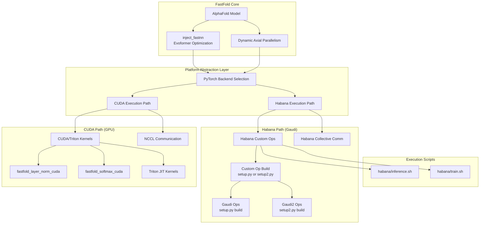
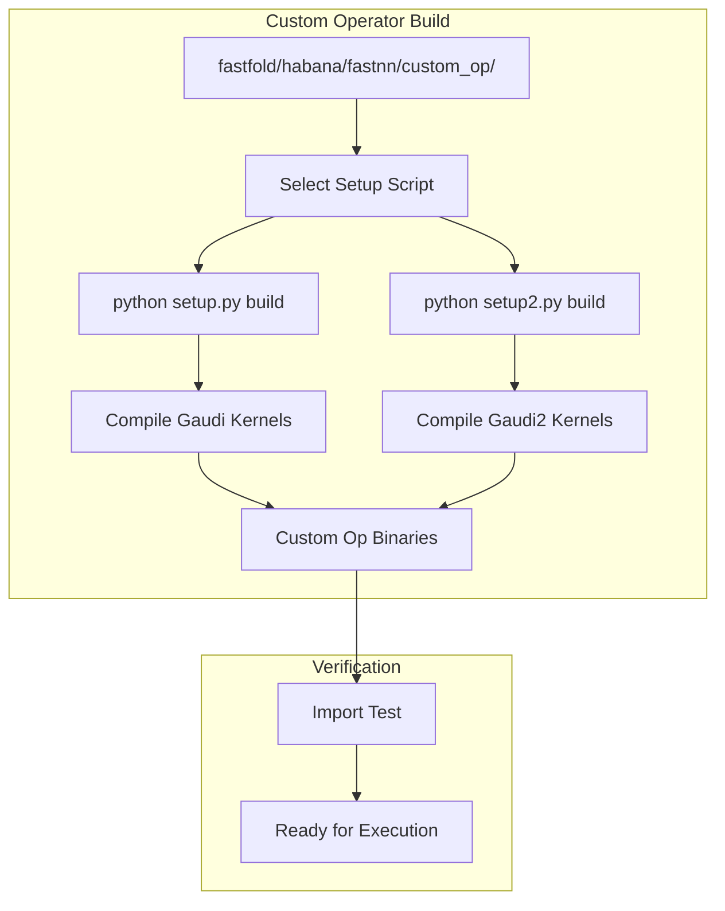
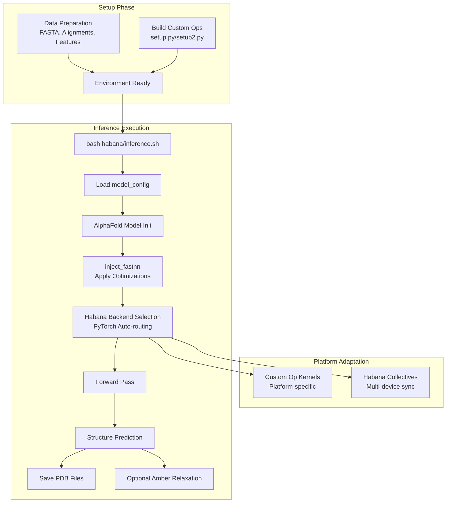
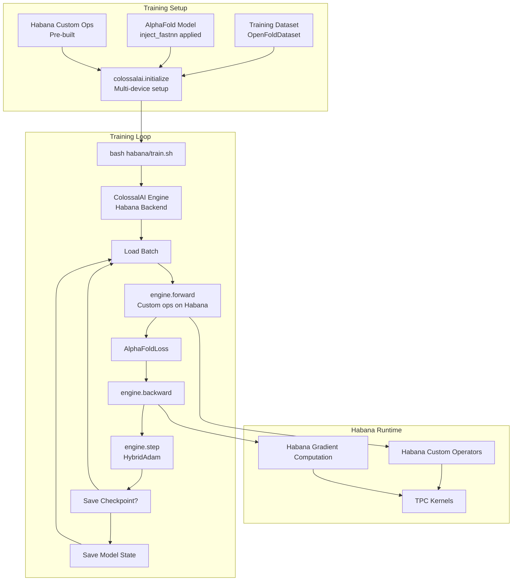
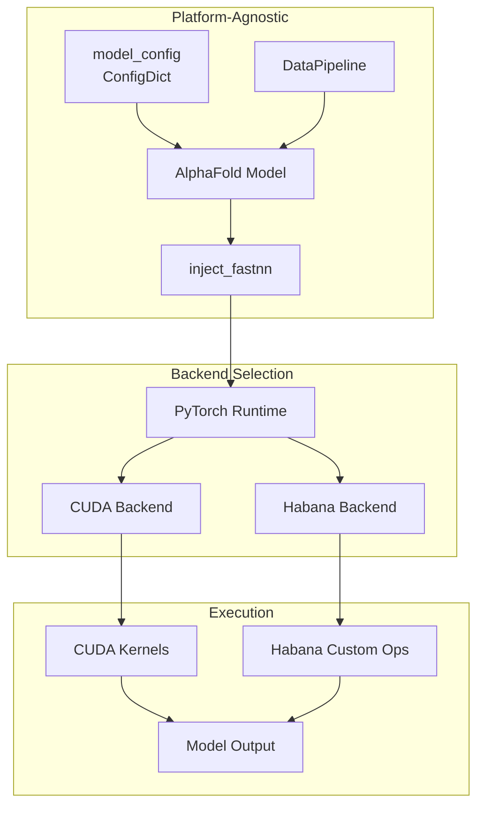

# Habana Platform Support

> **Relevant source files**
> * [README.md](https://github.com/hpcaitech/FastFold/blob/eba49680/README.md?plain=1)
> * [docker/Dockerfile](https://github.com/hpcaitech/FastFold/blob/eba49680/docker/Dockerfile)
> * [environment.yml](https://github.com/hpcaitech/FastFold/blob/eba49680/environment.yml)
> * [inference.py](https://github.com/hpcaitech/FastFold/blob/eba49680/inference.py)
> * [setup.py](https://github.com/hpcaitech/FastFold/blob/eba49680/setup.py)

## Purpose and Scope

This page documents FastFold's support for Intel Habana Gaudi processors, an alternative AI accelerator platform to NVIDIA GPUs. FastFold has been extended to run both inference and training workloads on Habana hardware, enabling users to leverage Intel's AI acceleration ecosystem.

This page covers Habana-specific setup, custom operator compilation, and execution workflows. For general inference and training procedures, see [Inference Pipeline](/hpcaitech/FastFold/5-inference-pipeline) and [Training System](/hpcaitech/FastFold/7-training-system). For GPU-based execution, refer to [Quick Start: Inference](/hpcaitech/FastFold/2.2-quick-start:-inference) and [Quick Start: Training](/hpcaitech/FastFold/2.3-quick-start:-training).

---

## Overview

FastFold extends AlphaFold's PyTorch implementation to support Intel Habana Gaudi and Gaudi2 processors. The port maintains the same model architecture and optimization strategies (inject_fastnn, DAP, chunking) while adapting low-level kernels and execution primitives to Habana's SynapseAI framework.

### Key Characteristics

| Aspect | Details |
| --- | --- |
| **Supported Hardware** | Intel Habana Gaudi, Gaudi2 |
| **Deployment Environments** | Amazon EC2 DL1 instances, on-premise servers |
| **Verified Software** | SynapseAI R1.7.1 |
| **Execution Modes** | Inference, Training |
| **Custom Operations** | Platform-specific kernels for critical operations |

The Habana implementation requires custom operator compilation before execution, as certain FastNN optimizations need platform-specific kernels.

**Sources:** [README.md L7](https://github.com/hpcaitech/FastFold/blob/eba49680/README.md?plain=1#L7-L7)

 [README.md L13](https://github.com/hpcaitech/FastFold/blob/eba49680/README.md?plain=1#L13-L13)

 [README.md L189-L199](https://github.com/hpcaitech/FastFold/blob/eba49680/README.md?plain=1#L189-L199)

---

## Platform Architecture



**Diagram: FastFold Platform Abstraction Architecture**

This diagram illustrates how FastFold abstracts between CUDA and Habana execution paths. The core model and optimization layers (inject_fastnn, DAP) remain platform-agnostic, while platform-specific kernels and communication primitives are selected at runtime based on the execution environment.

**Sources:** [README.md L189-L199](https://github.com/hpcaitech/FastFold/blob/eba49680/README.md?plain=1#L189-L199)

 [setup.py L86-L127](https://github.com/hpcaitech/FastFold/blob/eba49680/setup.py#L86-L127)

---

## Hardware and Environment Setup

### Supported Deployment Options

FastFold on Habana can run in two environments:

1. **Amazon EC2 DL1 Instances**: Managed cloud instances with pre-configured Habana hardware
2. **On-Premise Installations**: Self-hosted Habana Gaudi servers

### Software Requirements

| Component | Version/Details |
| --- | --- |
| **SynapseAI** | R1.7.1 (verified internally) |
| **Python** | 3.8 or 3.9 |
| **PyTorch** | 1.12 or above with Habana backend |
| **Base Dependencies** | Same as CUDA installation (see [Installation](/hpcaitech/FastFold/2.1-installation)) |

### Initial Setup Steps

Follow Intel's official installation guide to set up the Habana environment:

1. **Configure System Environment** * Install SynapseAI R1.7.1 following the [Installation Guide](https://docs.habana.ai/en/latest/Installation_Guide/) * Verify Habana drivers and runtime are correctly installed * Ensure PyTorch is built with Habana support
2. **Install FastFold Base Package** * Follow standard installation procedure from [Installation](/hpcaitech/FastFold/2.1-installation) * The same conda environment and Python dependencies apply * CUDA kernels are not required for Habana execution
3. **Prepare Datasets** * Download sequence databases and templates using standard scripts * Data processing pipeline is platform-agnostic * See [Data Processing Pipeline](/hpcaitech/FastFold/4-data-processing-pipeline) for details

**Sources:** [README.md L189-L192](https://github.com/hpcaitech/FastFold/blob/eba49680/README.md?plain=1#L189-L192)

---

## Building Custom Operators

FastFold's optimized kernels require platform-specific compilation for Habana processors. Custom operators must be built before running inference or training.

### Build Process Overview



**Diagram: Habana Custom Operator Build Workflow**

### Build Commands

The build process differs based on the target Habana generation:

**For Gaudi (1st Generation):**

```
cd fastfold/habana/fastnn/custom_op/python setup.py build
```

**For Gaudi2 (2nd Generation):**

```
cd fastfold/habana/fastnn/custom_op/python setup2.py build
```

### Build Script Structure

The custom operator build scripts are located at:

* [fastfold/habana/fastnn/custom_op/setup.py](https://github.com/hpcaitech/FastFold/blob/eba49680/fastfold/habana/fastnn/custom_op/setup.py)  - Gaudi build configuration
* [fastfold/habana/fastnn/custom_op/setup2.py](https://github.com/hpcaitech/FastFold/blob/eba49680/fastfold/habana/fastnn/custom_op/setup2.py)  - Gaudi2 build configuration

These scripts compile platform-specific implementations of critical operations such as:

* Custom attention kernels adapted for Habana's TPC (Tensor Processing Core)
* Fused operations optimized for Habana's memory hierarchy
* Communication primitives leveraging Habana's interconnect fabric

### Troubleshooting Build Issues

| Issue | Solution |
| --- | --- |
| Missing SynapseAI headers | Verify SynapseAI installation and environment variables |
| Compiler version mismatch | Use the compiler version specified in Habana documentation |
| Build directory permissions | Ensure write access to `fastfold/habana/fastnn/custom_op/` |

**Sources:** [README.md L196](https://github.com/hpcaitech/FastFold/blob/eba49680/README.md?plain=1#L196-L196)

---

## Execution Workflows

### Inference on Habana

Once custom operators are built, inference follows a similar workflow to GPU execution with Habana-specific scripts.



**Diagram: Habana Inference Execution Flow**

#### Running Inference

Execute the Habana inference script:

```
bash habana/inference.sh
```

The script [habana/inference.sh](https://github.com/hpcaitech/FastFold/blob/eba49680/habana/inference.sh)

 internally:

1. Sets Habana-specific environment variables
2. Configures SynapseAI runtime parameters
3. Invokes the standard `inference.py` with appropriate backend selection
4. Routes tensor operations to Habana custom operators

#### Script Customization

Edit [habana/inference.sh](https://github.com/hpcaitech/FastFold/blob/eba49680/habana/inference.sh)

 to modify:

* Input FASTA paths
* Database paths (same as CUDA workflow)
* Model preset (`model_1` through `model_5`, `multimer`)
* Output directory
* Number of Habana devices (equivalent to `--gpus` parameter)

The inference logic remains identical to [inference.py](https://github.com/hpcaitech/FastFold/blob/eba49680/inference.py)

 - the script primarily handles backend-specific environment setup.

**Sources:** [README.md L197](https://github.com/hpcaitech/FastFold/blob/eba49680/README.md?plain=1#L197-L197)

 [inference.py L122-L160](https://github.com/hpcaitech/FastFold/blob/eba49680/inference.py#L122-L160)

---

### Training on Habana

Training on Habana follows the same ColossalAI-based distributed training framework as GPU execution, with platform-specific kernel routing.



**Diagram: Habana Training Execution Flow**

#### Running Training

Execute the Habana training script:

```
bash habana/train.sh
```

The script [habana/train.sh](https://github.com/hpcaitech/FastFold/blob/eba49680/habana/train.sh)

 configures:

1. Training configuration paths
2. Dataset locations
3. Habana-specific distributed training parameters
4. Learning rate schedules
5. Checkpoint saving policies

#### Training Configuration

The training workflow uses the same configuration system as GPU training:

* Configuration presets: `initial_training`, `finetuning` (see [Model Presets](/hpcaitech/FastFold/3.1-model-presets))
* Loss functions: `AlphaFoldLoss` with FAPE, distillation, and auxiliary losses
* Optimizer: `HybridAdam` with gradient clipping
* Data loading: `OpenFoldDataLoader` with stochastic filtering

The primary difference is backend routing - PyTorch automatically dispatches operations to Habana when the appropriate runtime is detected.

**Sources:** [README.md L198](https://github.com/hpcaitech/FastFold/blob/eba49680/README.md?plain=1#L198-L198)

---

## Platform-Specific Considerations

### Differences from CUDA Execution

| Aspect | CUDA Implementation | Habana Implementation |
| --- | --- | --- |
| **Kernel Compilation** | Automatic via `setup.py` | Manual pre-build required |
| **Backend Selection** | Explicit CUDA device setup | Implicit via PyTorch backend |
| **Custom Operators** | CUDA/Triton kernels | Habana custom ops (setup.py/setup2.py) |
| **Communication** | NCCL primitives | Habana collective operations |
| **Memory Management** | CUDA allocator | Habana memory manager |
| **Triton Support** | Full support (optional) | Not applicable |

### Performance Characteristics

The Habana implementation maintains FastFold's core optimizations:

* **inject_fastnn**: Evoformer replacement works identically
* **DAP (Dynamic Axial Parallelism)**: Multi-device sharding supported
* **Chunking**: Memory management strategies apply
* **Inplace Operations**: Memory optimization compatible

However, raw performance may differ due to hardware architecture differences. Benchmark your specific workload to determine optimal chunk sizes and parallelism settings.

### Limitations and Known Issues

1. **Triton Kernels**: Not available on Habana - only custom ops via setup scripts
2. **Mixed Precision**: Ensure Habana-compatible mixed precision settings
3. **NCCL**: Not used - Habana provides its own collective communication library
4. **Environment Variables**: Habana requires SynapseAI-specific environment configuration

### Debugging and Monitoring

To debug Habana execution:

* Enable SynapseAI logging via environment variables (see Habana documentation)
* Use `HABANA_PROFILE=1` for profiling
* Check SynapseAI version compatibility: `hl-smi` command
* Verify custom ops loaded correctly: check import errors in Python

**Sources:** [README.md L189-L199](https://github.com/hpcaitech/FastFold/blob/eba49680/README.md?plain=1#L189-L199)

 [setup.py L86-L127](https://github.com/hpcaitech/FastFold/blob/eba49680/setup.py#L86-L127)

---

## Environment Variable Configuration

### Critical Environment Variables

When running on Habana, certain environment variables must be set:

```javascript
# Example Habana environment setup (typically in habana/inference.sh or habana/train.sh)export HABANA_VISIBLE_DEVICES=0,1,2,3  # Similar to CUDA_VISIBLE_DEVICESexport HABANA_PROFILE=0                 # Disable unless profilingexport PT_HPU_LAZY_MODE=1               # Enable lazy execution mode
```

These variables are typically configured within [habana/inference.sh](https://github.com/hpcaitech/FastFold/blob/eba49680/habana/inference.sh)

 and [habana/train.sh](https://github.com/hpcaitech/FastFold/blob/eba49680/habana/train.sh)

 and should not require manual adjustment for standard use cases.

**Sources:** [README.md L196-L199](https://github.com/hpcaitech/FastFold/blob/eba49680/README.md?plain=1#L196-L199)

---

## Integration with FastFold Components

### Model Integration

The Habana platform integrates with FastFold's existing components without modification:



**Diagram: Backend-Agnostic Model Execution**

The core FastFold codebase ([fastfold/model/hub.py](https://github.com/hpcaitech/FastFold/blob/eba49680/fastfold/model/hub.py)

 [fastfold/utils/inject_fastnn.py](https://github.com/hpcaitech/FastFold/blob/eba49680/fastfold/utils/inject_fastnn.py)

) remains unchanged. Backend selection happens automatically at the PyTorch level when Habana runtime is detected.

**Sources:** [inference.py L122-L160](https://github.com/hpcaitech/FastFold/blob/eba49680/inference.py#L122-L160)

 [README.md L189-L199](https://github.com/hpcaitech/FastFold/blob/eba49680/README.md?plain=1#L189-L199)

---

## Acknowledgments

FastFold's Habana support was developed in collaboration with the Intel Habana team, who provided technical resources and platform access. This partnership enabled the port of FastFold's optimizations to the Habana ecosystem while maintaining compatibility with the core AlphaFold model architecture.

**Sources:** [README.md L238-L240](https://github.com/hpcaitech/FastFold/blob/eba49680/README.md?plain=1#L238-L240)