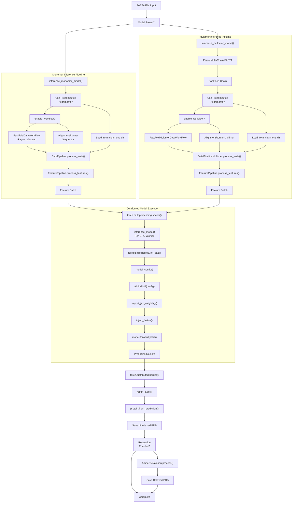
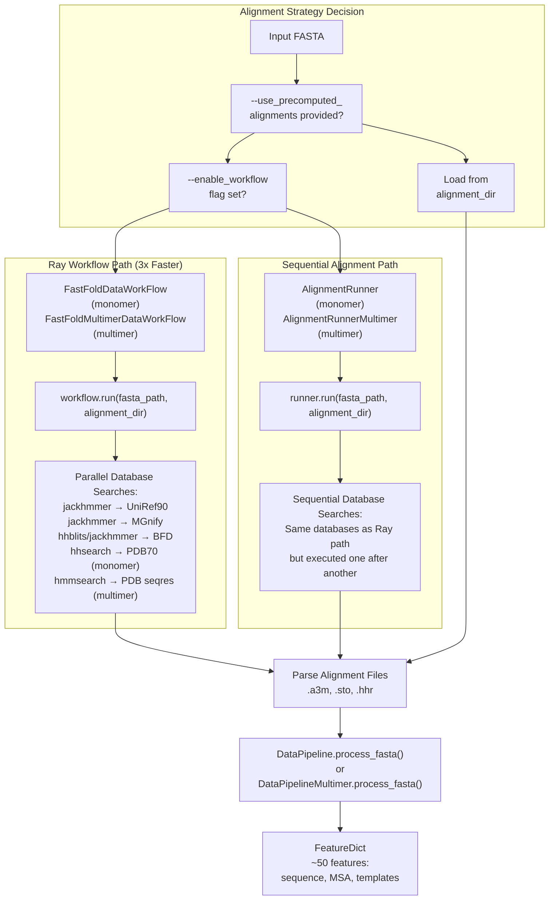
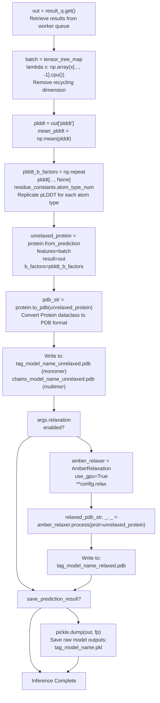

# Inference Pipeline

> **Relevant source files**
> * [README.md](https://github.com/hpcaitech/FastFold/blob/eba49680/README.md?plain=1)
> * [environment.yml](https://github.com/hpcaitech/FastFold/blob/eba49680/environment.yml)
> * [fastfold/common/protein.py](https://github.com/hpcaitech/FastFold/blob/eba49680/fastfold/common/protein.py)
> * [fastfold/data/data_pipeline.py](https://github.com/hpcaitech/FastFold/blob/eba49680/fastfold/data/data_pipeline.py)
> * [fastfold/utils/import_weights.py](https://github.com/hpcaitech/FastFold/blob/eba49680/fastfold/utils/import_weights.py)
> * [inference.py](https://github.com/hpcaitech/FastFold/blob/eba49680/inference.py)

## Purpose and Scope

The Inference Pipeline executes protein structure prediction using pre-trained AlphaFold models. This document covers the complete workflow from FASTA input to PDB output, including data preprocessing, feature generation, multi-GPU execution, and optional structure refinement.

For details on the data preprocessing components, see [Data Processing Pipeline](/hpcaitech/FastFold/4-data-processing-pipeline). For training workflows, see [Training System](/hpcaitech/FastFold/7-training-system). For structure refinement details, see [Structure Refinement with Amber](/hpcaitech/FastFold/5.3-structure-refinement-with-amber).

**Sources:** [inference.py L1-L557](https://github.com/hpcaitech/FastFold/blob/eba49680/inference.py#L1-L557)

 [README.md L102-L187](https://github.com/hpcaitech/FastFold/blob/eba49680/README.md?plain=1#L102-L187)

## Overview

The inference pipeline follows a linear workflow that transforms raw protein sequences into predicted 3D structures. The pipeline supports both monomer and multimer predictions with optional Ray-accelerated data preprocessing and multi-GPU distributed execution.



**Sources:** [inference.py L122-L160](https://github.com/hpcaitech/FastFold/blob/eba49680/inference.py#L122-L160)

 [inference.py L169-L338](https://github.com/hpcaitech/FastFold/blob/eba49680/inference.py#L169-L338)

 [inference.py L340-L488](https://github.com/hpcaitech/FastFold/blob/eba49680/inference.py#L340-L488)

 [inference.py L491-L556](https://github.com/hpcaitech/FastFold/blob/eba49680/inference.py#L491-L556)

## Entry Point and Argument Parsing

The inference pipeline is invoked via the `inference.py` script, which parses command-line arguments and dispatches to either monomer or multimer inference based on the `--model_preset` flag.

### Required Arguments

| Argument | Type | Description |
| --- | --- | --- |
| `fasta_path` | str | Path to input FASTA file containing protein sequence(s) |
| `template_mmcif_dir` | str | Directory containing mmCIF template structures |

### Key Optional Arguments

| Argument | Default | Description |
| --- | --- | --- |
| `--model_name` | `"model_1"` | Model configuration (model_1-5, model_1-5_ptm, model_1-5_multimer) |
| `--model_preset` | `"monomer"` | Prediction mode: "monomer" or "multimer" |
| `--param_path` | Auto-detected | Path to model parameters (.npz file) |
| `--gpus` | `1` | Number of GPUs for distributed inference |
| `--chunk_size` | `None` | Chunk size for memory optimization |
| `--enable_workflow` | `False` | Enable Ray-accelerated data preprocessing |
| `--inplace` | `False` | Enable in-place operations for memory efficiency |
| `--relaxation` | `False` | Enable Amber structure refinement |
| `--output_dir` | `os.getcwd()` | Output directory for results |

**Sources:** [inference.py L491-L556](https://github.com/hpcaitech/FastFold/blob/eba49680/inference.py#L491-L556)

 [inference.py L68-L120](https://github.com/hpcaitech/FastFold/blob/eba49680/inference.py#L68-L120)

## Monomer Inference Workflow

The `inference_monomer_model` function orchestrates the complete monomer prediction workflow from FASTA input to PDB output.

```mermaid
flowchart TD

Entry["inference_monomer_model(args)"]
Config["config = model_config(args.model_name)"]
TemplFeat["TemplateHitFeaturizer<br>max_template_date<br>kalign_binary_path"]
CheckBFD["args.preset ==<br>'reduced_dbs'?"]
SmallBFD["use_small_bfd = True"]
FullBFD["use_small_bfd = False<br>Require BFD + UniRef30"]
DataProc["DataPipeline(template_featurizer)"]
ParseFASTA["parse_fasta(fasta_path)"]
ExtractSeq["seq, tag = seqs[0], tags[0]"]
CheckPrecomp["use_precomputed_<br>alignments?"]
LoadAlign["alignment_dir = args.use_precomputed_alignments"]
MkAlignDir["alignment_dir = output_dir/alignments"]
CheckWF["args.enable_workflow?"]
RayRunner["FastFoldDataWorkFlow<br>jackhmmer, hhblits, hhsearch<br>databases: uniref90, mgnify, bfd, pdb70"]
SeqRunner["AlignmentRunner<br>Same tools and databases"]
RunAlign["runner.run(fasta_path, alignment_dir)"]
ProcessFASTA["data_processor.process_fasta()"]
FeatureDict["feature_dict<br>sequence, MSA, template features"]
FeatPipe["FeaturePipeline(config.data)"]
ProcessFeat["feature_processor.process_features<br>mode='predict'"]
Batch["batch = processed_feature_dict"]
MPManager["mp.Manager()<br>result_q = manager.Queue()"]
Spawn["torch.multiprocessing.spawn<br>inference_model<br>nprocs=args.gpus"]
GetResult["out = result_q.get()"]
ExtractRecycle["batch = tensor_tree_map<br>x[..., -1]<br>Remove recycling dimension"]
CalcPLDDT["plddt = out['plddt']<br>mean_plddt = np.mean(plddt)"]
CreateBFactors["plddt_b_factors = np.repeat<br>plddt[..., None]<br>residue_constants.atom_type_num"]
CreateProt["unrelaxed_protein = protein.from_prediction<br>features=batch, result=out<br>b_factors=plddt_b_factors"]
SaveUnrelaxed["Save unrelaxed PDB<br>tag_model_name_unrelaxed.pdb"]
CheckRelax["args.relaxation?"]
InitRelaxer["amber_relaxer = AmberRelaxation<br>use_gpu=True, **config.relax"]
SavePkl["save_prediction_result?"]
Relax["relaxed_pdb_str, _, _ = <br>amber_relaxer.process(prot)"]
SaveRelaxed["Save relaxed PDB<br>tag_model_name_relaxed.pdb"]
PickleDump["pickle.dump(out, fp)<br>tag_model_name.pkl"]
Done["Complete"]

Entry --> Config
Config --> TemplFeat
TemplFeat --> CheckBFD
CheckBFD --> SmallBFD
CheckBFD --> FullBFD
SmallBFD --> DataProc
FullBFD --> DataProc
DataProc --> ParseFASTA
ParseFASTA --> ExtractSeq
ExtractSeq --> CheckPrecomp
CheckPrecomp --> LoadAlign
CheckPrecomp --> MkAlignDir
MkAlignDir --> CheckWF
CheckWF --> RayRunner
CheckWF --> SeqRunner
RayRunner --> RunAlign
SeqRunner --> RunAlign
LoadAlign --> ProcessFASTA
RunAlign --> ProcessFASTA
ProcessFASTA --> FeatureDict
FeatureDict --> FeatPipe
FeatPipe --> ProcessFeat
ProcessFeat --> Batch
Batch --> MPManager
MPManager --> Spawn
Spawn --> GetResult
GetResult --> ExtractRecycle
ExtractRecycle --> CalcPLDDT
CalcPLDDT --> CreateBFactors
CreateBFactors --> CreateProt
CreateProt --> SaveUnrelaxed
SaveUnrelaxed --> CheckRelax
CheckRelax --> InitRelaxer
CheckRelax --> SavePkl
InitRelaxer --> Relax
Relax --> SaveRelaxed
SaveRelaxed --> SavePkl
SavePkl --> PickleDump
SavePkl --> Done
PickleDump --> Done
```



**Sources:** [inference.py L340-L488](https://github.com/hpcaitech/FastFold/blob/eba49680/inference.py#L340-L488)

 [fastfold/data/data_pipeline.py L784-L960](https://github.com/hpcaitech/FastFold/blob/eba49680/fastfold/data/data_pipeline.py#L784-L960)

## Multimer Inference Workflow

The `inference_multimer_model` function handles multi-chain protein complexes with additional steps for per-chain alignment, MSA pairing, and assembly feature generation.

### Chain Processing

For multimer predictions, the pipeline processes each chain independently before merging:

1. **Parse Multi-Chain FASTA**: Split input by `>` delimiters to extract individual chains [inference.py L246-L256](https://github.com/hpcaitech/FastFold/blob/eba49680/inference.py#L246-L256)
2. **Per-Chain Alignment**: Run alignment tools for each chain in separate directories [inference.py L258-L277](https://github.com/hpcaitech/FastFold/blob/eba49680/inference.py#L258-L277)
3. **Chain Feature Processing**: Convert monomer features to multimer format [fastfold/data/data_pipeline.py L1101-L1127](https://github.com/hpcaitech/FastFold/blob/eba49680/fastfold/data/data_pipeline.py#L1101-L1127)
4. **Assembly Features**: Add entity_id, asym_id, sym_id for chain identification [fastfold/data/data_pipeline.py L727-L769](https://github.com/hpcaitech/FastFold/blob/eba49680/fastfold/data/data_pipeline.py#L727-L769)
5. **MSA Pairing**: Merge MSAs to capture co-evolutionary signals [fastfold/data/data_pipeline.py L1182-L1184](https://github.com/hpcaitech/FastFold/blob/eba49680/fastfold/data/data_pipeline.py#L1182-L1184)

### Template Featurizer Differences

Multimer uses `HmmsearchHitFeaturizer` instead of `TemplateHitFeaturizer`:

```markdown
# Multimer template featurizertemplate_featurizer = templates.HmmsearchHitFeaturizer(    mmcif_dir=args.template_mmcif_dir,    max_template_date=args.max_template_date,    max_hits=4,  # predict_max_templates    kalign_binary_path=args.kalign_binary_path,    release_dates_path=args.release_dates_path,    obsolete_pdbs_path=args.obsolete_pdbs_path,)
```

**Sources:** [inference.py L169-L338](https://github.com/hpcaitech/FastFold/blob/eba49680/inference.py#L169-L338)

 [inference.py L175-L182](https://github.com/hpcaitech/FastFold/blob/eba49680/inference.py#L175-L182)

 [fastfold/data/data_pipeline.py L1082-L1189](https://github.com/hpcaitech/FastFold/blob/eba49680/fastfold/data/data_pipeline.py#L1082-L1189)

## Data Processing Branch Selection

The pipeline provides two parallel data processing paths: sequential alignment or Ray-accelerated workflow.



**Sources:** [inference.py L184-L217](https://github.com/hpcaitech/FastFold/blob/eba49680/inference.py#L184-L217)

 [inference.py L396-L426](https://github.com/hpcaitech/FastFold/blob/eba49680/inference.py#L396-L426)

 [fastfold/data/data_pipeline.py L263-L457](https://github.com/hpcaitech/FastFold/blob/eba49680/fastfold/data/data_pipeline.py#L263-L457)

## Distributed Model Execution

The `inference_model` function runs as a worker process on each GPU, initialized via `torch.multiprocessing.spawn`.

### Worker Initialization Sequence

```mermaid
flowchart TD

Spawn["torch.multiprocessing.spawn<br>inference_model<br>nprocs=args.gpus<br>args=(world_size, result_q, batch, args)"]
Worker["inference_model(rank, world_size,<br>result_q, batch, args)"]
SetEnv["os.environ['RANK'] = str(rank)<br>os.environ['LOCAL_RANK'] = str(rank)<br>os.environ['WORLD_SIZE'] = str(world_size)"]
InitDAP["fastfold.distributed.init_dap()<br>Initialize Distributed Process Groups"]
SetDevice["torch.cuda.set_device(rank)<br>Pin worker to specific GPU"]
LoadConfig["config = model_config(args.model_name)<br>Load model configuration"]
ConfigChunk["args.chunk_size<br>specified?"]
SetChunk["config.globals.chunk_size = args.chunk_size"]
CheckV3["'v3' in<br>args.param_path?"]
SetFused["set_fused_triangle_multiplication()<br>Enable fused tri_mul kernels"]
SetInplace["config.globals.inplace = args.inplace<br>config.globals.is_multimer = is_multimer"]
CreateModel["model = AlphaFold(config)<br>Instantiate model architecture"]
LoadWeights["import_jax_weights_<br>model, args.param_path<br>version=args.model_name"]
Inject["model = inject_fastnn(model)<br>Replace Evoformer with optimized version"]
SetEval["model = model.eval()<br>Set to evaluation mode"]
ToCUDA["model = model.cuda()<br>Move model to GPU"]
SetGlobalChunk["set_chunk_size(model.globals.chunk_size)<br>Configure global chunk size"]
MoveBatch["batch = {k: torch.as_tensor(v).cuda()<br>for k, v in batch.items()}<br>Move batch to GPU"]
NoGrad["with torch.no_grad():<br>Disable gradient computation"]
Forward["out = model(batch)<br>Forward pass through model"]
ToCPU["out = tensor_tree_map<br>lambda x: np.array(x.cpu())<br>Move results to CPU"]
Queue["result_q.put(out)<br>Send results to main process"]
Barrier["torch.distributed.barrier()<br>Synchronize all workers"]
Sync["torch.cuda.synchronize()<br>Ensure CUDA operations complete"]

Spawn --> Worker
Worker --> SetEnv
SetEnv --> InitDAP
InitDAP --> SetDevice
SetDevice --> LoadConfig
LoadConfig --> ConfigChunk
ConfigChunk --> SetChunk
ConfigChunk --> CheckV3
SetChunk --> CheckV3
CheckV3 --> SetFused
CheckV3 --> SetInplace
SetFused --> SetInplace
SetInplace --> CreateModel
CreateModel --> LoadWeights
LoadWeights --> Inject
Inject --> SetEval
SetEval --> ToCUDA
ToCUDA --> SetGlobalChunk
SetGlobalChunk --> MoveBatch
MoveBatch --> NoGrad
NoGrad --> Forward
Forward --> ToCPU
ToCPU --> Queue
Queue --> Barrier
Barrier --> Sync
```



**Sources:** [inference.py L122-L160](https://github.com/hpcaitech/FastFold/blob/eba49680/inference.py#L122-L160)

 [inference.py L291-L293](https://github.com/hpcaitech/FastFold/blob/eba49680/inference.py#L291-L293)

 [inference.py L441-L443](https://github.com/hpcaitech/FastFold/blob/eba49680/inference.py#L441-L443)

### Configuration and Optimization Setup

The model configuration is loaded using `model_config()` and can be customized based on command-line arguments:

| Configuration | Source | Description |
| --- | --- | --- |
| `config.globals.chunk_size` | `--chunk_size` | Controls memory-compute tradeoff for processing large tensors |
| `config.globals.inplace` | `--inplace` | Enables in-place tensor operations for memory efficiency |
| `config.globals.is_multimer` | `--model_preset` | Configures multimer-specific features |
| Fused triangle multiplication | Detected from param path | Enables optimized kernels for AlphaFold v3 parameters |

**Sources:** [inference.py L129-L137](https://github.com/hpcaitech/FastFold/blob/eba49680/inference.py#L129-L137)

 [fastfold/config/model.py](https://github.com/hpcaitech/FastFold/blob/eba49680/fastfold/config/model.py)

## Weight Import and Model Optimization

After model instantiation, two critical transformations occur:

### JAX Weight Import

The `import_jax_weights_` function loads pre-trained parameters from DeepMind's JAX format into PyTorch tensors:

```
import_jax_weights_(model, args.param_path, version=args.model_name)
```

This function:

* Loads weights from `.npz` files
* Applies necessary transpositions for PyTorch (e.g., `LinearWeight` transposes last two dimensions)
* Handles version-specific parameter naming conventions
* Supports both monomer and multimer parameter formats

**Sources:** [inference.py L139](https://github.com/hpcaitech/FastFold/blob/eba49680/inference.py#L139-L139)

 [fastfold/utils/import_weights.py L588-L628](https://github.com/hpcaitech/FastFold/blob/eba49680/fastfold/utils/import_weights.py#L588-L628)

### FastNN Injection

The `inject_fastnn` function surgically replaces the standard Evoformer with optimized implementations:

```
model = inject_fastnn(model)
```

This transformation:

* Replaces `EvoformerStack` with chunk-aware, distributed variants
* Enables fused CUDA/Triton kernels for attention, softmax, and layer normalization
* Maintains identical model behavior with 2-10x performance improvement
* Is transparent to the forward pass logic

**Sources:** [inference.py L141](https://github.com/hpcaitech/FastFold/blob/eba49680/inference.py#L141-L141)

 [fastfold/utils/inject_fastnn.py](https://github.com/hpcaitech/FastFold/blob/eba49680/fastfold/utils/inject_fastnn.py)

## Output Generation and Post-Processing

After the distributed forward pass completes, the main process collects results and generates output files.



### Output Files

| File Type | Naming Convention | Contents |
| --- | --- | --- |
| Unrelaxed PDB | `{tag}_{model_name}_unrelaxed.pdb` | Raw model predictions with pLDDT as B-factors |
| Relaxed PDB | `{tag}_{model_name}_relaxed.pdb` | Amber-refined structure (if `--relaxation` enabled) |
| Prediction Pickle | `{tag}_{model_name}.pkl` | Complete model outputs including logits, embeddings |

**Sources:** [inference.py L304-L320](https://github.com/hpcaitech/FastFold/blob/eba49680/inference.py#L304-L320)

 [inference.py L322-L337](https://github.com/hpcaitech/FastFold/blob/eba49680/inference.py#L322-L337)

 [inference.py L447-L480](https://github.com/hpcaitech/FastFold/blob/eba49680/inference.py#L447-L480)

 [fastfold/common/protein.py L322-L358](https://github.com/hpcaitech/FastFold/blob/eba49680/fastfold/common/protein.py#L322-L358)

## Memory Optimization Strategies

The inference pipeline provides several mechanisms for managing GPU memory consumption:

### Chunk Size Configuration

The `--chunk_size` parameter controls the granularity of tensor processing in memory-intensive operations:

```
python inference.py target.fasta templates/ \    --chunk_size 128 \    --gpus 2
```

* **Smaller chunk sizes**: Reduce peak memory at the cost of increased computation time
* **Larger chunk sizes**: Faster execution but higher memory requirements
* **Default behavior**: No chunking, processes entire tensors at once

For ultra-long sequences (>8000 residues), set `PYTORCH_CUDA_ALLOC_CONF=max_split_size_mb:15000` to allow larger memory allocations.

**Sources:** [inference.py L130-L131](https://github.com/hpcaitech/FastFold/blob/eba49680/inference.py#L130-L131)

 [inference.py L143-L163](https://github.com/hpcaitech/FastFold/blob/eba49680/inference.py#L143-L163)

 [README.md L141-L164](https://github.com/hpcaitech/FastFold/blob/eba49680/README.md?plain=1#L141-L164)

### In-Place Operations

The `--inplace` flag enables tensor reuse to reduce memory allocations:

```
python inference.py target.fasta templates/ \    --inplace \    --gpus 2
```

This modifies tensors in-place during forward pass operations, reducing peak memory consumption without affecting numerical results.

**Sources:** [inference.py L136](https://github.com/hpcaitech/FastFold/blob/eba49680/inference.py#L136-L136)

 [inference.py L119](https://github.com/hpcaitech/FastFold/blob/eba49680/inference.py#L119-L119)

 [README.md L139](https://github.com/hpcaitech/FastFold/blob/eba49680/README.md?plain=1#L139-L139)

### Distributed Axial Parallelism (DAP)

When using multiple GPUs (`--gpus > 1`), DAP shards the sequence dimension across devices:

* Each GPU processes a subset of residues
* Communication occurs via `AllGather` and `Scatter` operations
* Enables sequences >10,000 residues (standard limit ~3,000 on single GPU)
* Linear scaling for inference throughput

**Sources:** [inference.py L127](https://github.com/hpcaitech/FastFold/blob/eba49680/inference.py#L127-L127)

 [README.md L23-L25](https://github.com/hpcaitech/FastFold/blob/eba49680/README.md?plain=1#L23-L25)

## Command-Line Usage Examples

### Basic Monomer Inference

```
python inference.py target.fasta data/pdb_mmcif/mmcif_files/ \    --output_dir ./outputs/ \    --gpus 1 \    --uniref90_database_path data/uniref90/uniref90.fasta \    --mgnify_database_path data/mgnify/mgy_clusters_2022_05.fa \    --pdb70_database_path data/pdb70/pdb70 \    --uniref30_database_path data/uniref30/UniRef30_2021_03 \    --bfd_database_path data/bfd/bfd_metaclust_clu_complete_id30_c90_final_seq.sorted_opt \    --jackhmmer_binary_path `which jackhmmer` \    --hhblits_binary_path `which hhblits` \    --hhsearch_binary_path `which hhsearch` \    --kalign_binary_path `which kalign`
```

### Accelerated Monomer Inference with Ray Workflow

```
python inference.py target.fasta data/pdb_mmcif/mmcif_files/ \    --output_dir ./outputs/ \    --gpus 2 \    --enable_workflow \    --inplace \    --uniref90_database_path data/uniref90/uniref90.fasta \    --mgnify_database_path data/mgnify/mgy_clusters_2022_05.fa \    --pdb70_database_path data/pdb70/pdb70 \    --uniref30_database_path data/uniref30/UniRef30_2021_03 \    --bfd_database_path data/bfd/bfd_metaclust_clu_complete_id30_c90_final_seq.sorted_opt \    --jackhmmer_binary_path `which jackhmmer` \    --hhblits_binary_path `which hhblits` \    --hhsearch_binary_path `which hhsearch` \    --kalign_binary_path `which kalign`
```

The `--enable_workflow` flag activates Ray-based parallel processing for ~3x speedup in data preprocessing.

### Multimer Prediction

```
python inference.py multimer.fasta data/pdb_mmcif/mmcif_files/ \    --output_dir ./outputs/ \    --gpus 2 \    --model_preset multimer \    --param_path data/params/params_model_1_multimer.npz \    --model_name model_1_multimer \    --uniref90_database_path data/uniref90/uniref90.fasta \    --mgnify_database_path data/mgnify/mgy_clusters_2022_05.fa \    --bfd_database_path data/bfd/bfd_metaclust_clu_complete_id30_c90_final_seq.sorted_opt \    --uniref30_database_path data/uniref30/UniRef30_2021_03 \    --uniprot_database_path data/uniprot/uniprot.fasta \    --pdb_seqres_database_path data/pdb_seqres/pdb_seqres.txt \    --jackhmmer_binary_path `which jackhmmer` \    --hhblits_binary_path `which hhblits` \    --hmmsearch_binary_path `which hmmsearch` \    --kalign_binary_path `which kalign`
```

Note the additional databases required for multimer: `uniprot` and `pdb_seqres`.

### Memory-Constrained Inference

For long sequences on limited GPU memory:

```
PYTORCH_CUDA_ALLOC_CONF=max_split_size_mb:15000 \python inference.py long_sequence.fasta data/pdb_mmcif/mmcif_files/ \    --output_dir ./outputs/ \    --gpus 2 \    --chunk_size 64 \    --inplace \    --enable_workflow \    --uniref90_database_path data/uniref90/uniref90.fasta \    --mgnify_database_path data/mgnify/mgy_clusters_2022_05.fa \    --bfd_database_path data/bfd/bfd_metaclust_clu_complete_id30_c90_final_seq.sorted_opt
```

This configuration enables inference on sequences up to 10,000 residues in BF16 precision (8,000 in FP32).

### Using Precomputed Alignments

To skip the alignment step and use pre-generated alignment files:

```
python inference.py target.fasta data/pdb_mmcif/mmcif_files/ \    --output_dir ./outputs/ \    --gpus 2 \    --use_precomputed_alignments ./outputs/alignments/target_tag/ \    --model_name model_1
```

**Sources:** [README.md L115-L187](https://github.com/hpcaitech/FastFold/blob/eba49680/README.md?plain=1#L115-L187)

 [inference.py L501-L556](https://github.com/hpcaitech/FastFold/blob/eba49680/inference.py#L501-L556)

## Key Performance Characteristics

| Optimization | Speedup | Configuration |
| --- | --- | --- |
| Ray Workflow | ~3x (monomer), ~3Nx (multimer with N chains) | `--enable_workflow` |
| FastNN Injection | 2-5x on Evoformer | Automatic via `inject_fastnn()` |
| Fused Kernels | 2-10x on individual ops | Enabled by Triton/CUDA kernels |
| Dynamic Axial Parallelism | ~2x standard sequences, enables >10K residues | `--gpus > 1` |
| In-Place Operations | 20-30% memory reduction | `--inplace` |
| Chunking | Enables longer sequences at cost of speed | `--chunk_size` |

**Sources:** [README.md L19-L30](https://github.com/hpcaitech/FastFold/blob/eba49680/README.md?plain=1#L19-L30)

 [inference.py L127-L145](https://github.com/hpcaitech/FastFold/blob/eba49680/inference.py#L127-L145)