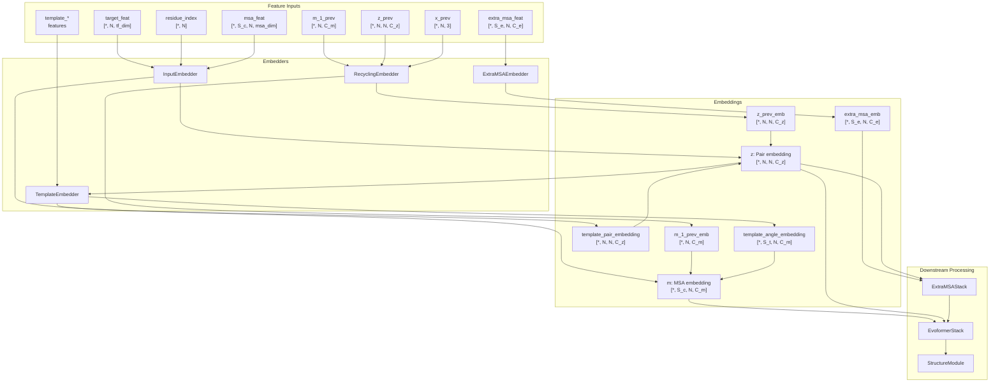
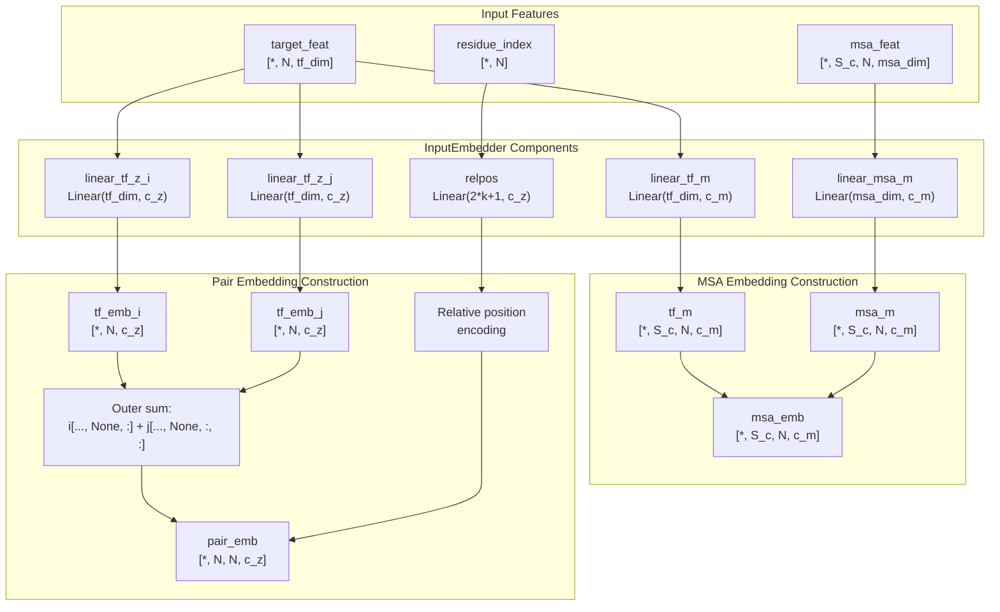
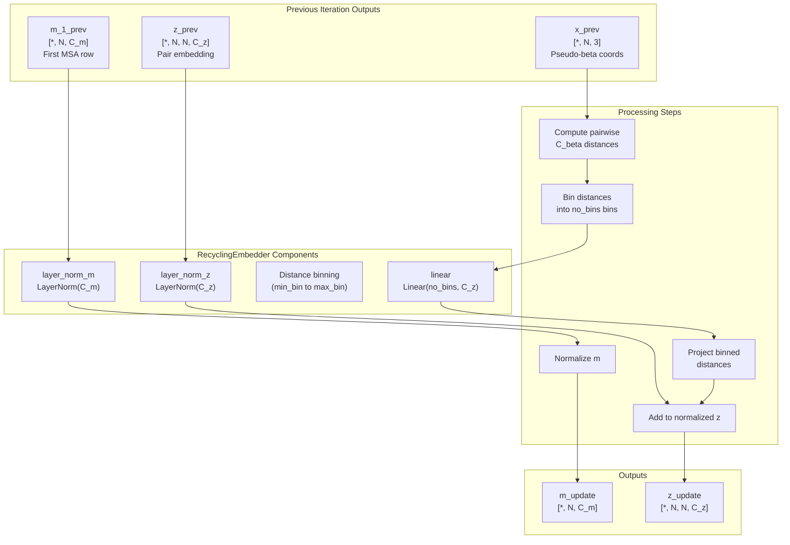
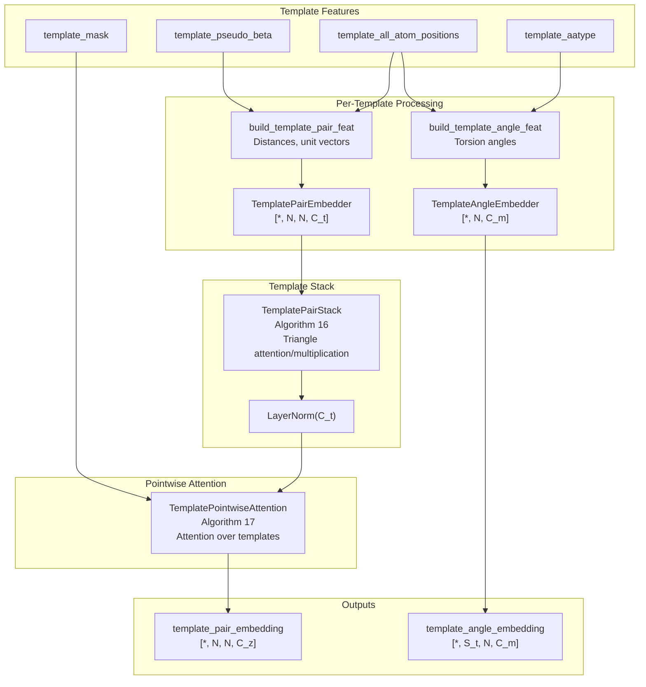
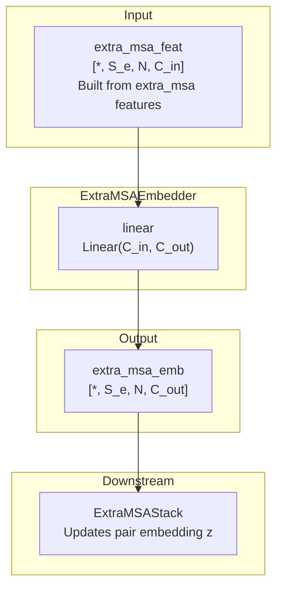
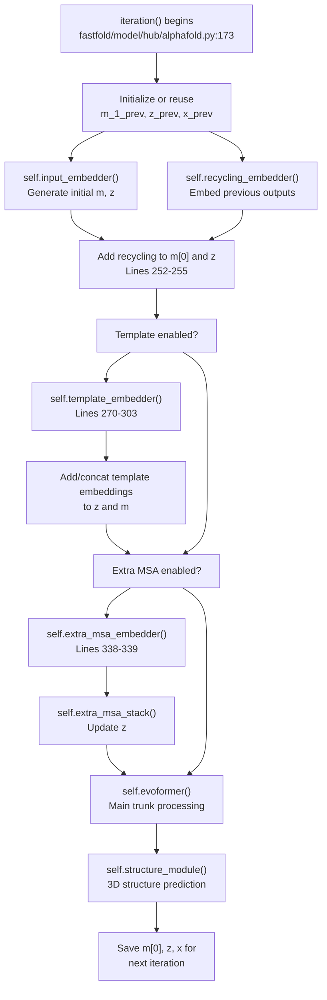

# Input Embedders

> **Relevant source files**
> * [fastfold/model/hub/alphafold.py](https://github.com/hpcaitech/FastFold/blob/eba49680/fastfold/model/hub/alphafold.py)
> * [fastfold/model/nn/embedders.py](https://github.com/hpcaitech/FastFold/blob/eba49680/fastfold/model/nn/embedders.py)
> * [fastfold/model/nn/template.py](https://github.com/hpcaitech/FastFold/blob/eba49680/fastfold/model/nn/template.py)

## Purpose and Scope

This document describes the input embedding modules in FastFold's AlphaFold model implementation. Input embedders transform raw protein features into high-dimensional representations that serve as inputs to the Evoformer stack.

This page covers the four primary embedder types: `InputEmbedder`, `RecyclingEmbedder`, `TemplateEmbedder`, and `ExtraMSAEmbedder`. For information about the Evoformer architecture that processes these embeddings, see [Evoformer Stack](/hpcaitech/FastFold/6.3-evoformer-stack). For details on the recycling mechanism, see [Recycling Mechanism](/hpcaitech/FastFold/6.2-recycling-mechanism).

---

## Overview

Input embedders are the first processing stage in the AlphaFold model, converting raw feature dictionaries into learned representations. The model uses four distinct embedder types, each handling different aspects of the input data:

| Embedder | Purpose | Input Features | Output Representations |
| --- | --- | --- | --- |
| `InputEmbedder` | Initial sequence and MSA embedding | `target_feat`, `residue_index`, `msa_feat` | MSA embedding `m` [*, S_c, N, C_m]Pair embedding `z` [*, N, N, C_z] |
| `RecyclingEmbedder` | Embed previous iteration outputs | Previous `m`, `z`, and coordinates | Updated `m` [*, N, C_m]Updated `z` [*, N, N, C_z] |
| `TemplateEmbedder` | Embed template structures | Template features (`template_aatype`, positions, masks) | Template pair embedding [*, N, N, C_z]Template angle embedding [*, S_t, N, C_m] |
| `ExtraMSAEmbedder` | Embed extra MSA sequences | `extra_msa_feat` | Extra MSA embedding [*, S_e, N, C_e] |

**Sources:** [fastfold/model/nn/embedders.py L1-L452](https://github.com/hpcaitech/FastFold/blob/eba49680/fastfold/model/nn/embedders.py#L1-L452)

 [fastfold/model/hub/alphafold.py L28-L87](https://github.com/hpcaitech/FastFold/blob/eba49680/fastfold/model/hub/alphafold.py#L28-L87)

---

## Architecture Overview

The following diagram shows how embedders fit into the AlphaFold model's forward pass:



**Sources:** [fastfold/model/hub/alphafold.py L173-L424](https://github.com/hpcaitech/FastFold/blob/eba49680/fastfold/model/hub/alphafold.py#L173-L424)

---

## InputEmbedder

The `InputEmbedder` class implements Algorithms 3 and 4 from the AlphaFold supplement. It generates the initial MSA and pair representations from raw sequence features.

### Architecture



**Sources:** [fastfold/model/nn/embedders.py L35-L137](https://github.com/hpcaitech/FastFold/blob/eba49680/fastfold/model/nn/embedders.py#L35-L137)

### Implementation Details

The `InputEmbedder` performs the following operations:

1. **Pair Embedding Generation**: * Projects `target_feat` through two separate linear layers (`linear_tf_z_i` and `linear_tf_z_j`) * Computes outer sum: `pair_emb[i,j] = tf_emb_i[i] + tf_emb_j[j]` * Adds relative positional encoding using Algorithm 4
2. **Relative Positional Encoding**: * Computes pairwise residue distance: `d[i,j] = residue_index[i] - residue_index[j]` * Bins distances into `2*relpos_k + 1` bins (typically 65 bins for k=32) * Projects one-hot binned distances to `c_z` dimensions
3. **MSA Embedding Generation**: * Projects `target_feat` through `linear_tf_m` and broadcasts to all sequences * Projects `msa_feat` through `linear_msa_m` * Sums both projections to create initial MSA embedding

**Configuration Parameters:**

| Parameter | Typical Value | Description |
| --- | --- | --- |
| `tf_dim` | 21 | Target feature dimension (one-hot amino acid) |
| `msa_dim` | 49 | MSA feature dimension |
| `c_z` | 128 | Pair embedding dimension |
| `c_m` | 256 | MSA embedding dimension |
| `relpos_k` | 32 | Half-window size for relative position encoding |

**Sources:** [fastfold/model/nn/embedders.py L42-L137](https://github.com/hpcaitech/FastFold/blob/eba49680/fastfold/model/nn/embedders.py#L42-L137)

 [fastfold/model/hub/alphafold.py L68-L77](https://github.com/hpcaitech/FastFold/blob/eba49680/fastfold/model/hub/alphafold.py#L68-L77)

---

## RecyclingEmbedder

The `RecyclingEmbedder` class implements Algorithm 32 from the AlphaFold supplement. It embeds outputs from the previous iteration for use in the current iteration, enabling iterative refinement.

### Architecture



**Sources:** [fastfold/model/nn/embedders.py L140-L233](https://github.com/hpcaitech/FastFold/blob/eba49680/fastfold/model/nn/embedders.py#L140-L233)

### Implementation Details

The `RecyclingEmbedder` processes previous iteration outputs as follows:

1. **MSA Update**: * Applies layer normalization to the first MSA row: `m_update = layer_norm_m(m_1_prev)`
2. **Pair Update**: * Computes pairwise squared distances: `d[i,j] = ||x[i] - x[j]||^2` * Bins distances into `no_bins` bins (typically 15 bins from 3.25Å to 50.75Å) * Creates one-hot encoding of binned distances * Projects through linear layer: `dist_emb = linear(one_hot(binned_d))` * Adds to normalized previous pair embedding: `z_update = dist_emb + layer_norm_z(z_prev)`
3. **Recycling Control**: * During the first iteration, these embeddings are initialized to zeros * The `_recycle` flag in `iteration()` controls whether to use recycling embeddings or zero them out

**Configuration Parameters:**

| Parameter | Typical Value | Description |
| --- | --- | --- |
| `c_m` | 256 | MSA embedding dimension |
| `c_z` | 128 | Pair embedding dimension |
| `min_bin` | 3.25 | Minimum distance bin (Angstroms) |
| `max_bin` | 50.75 | Maximum distance bin (Angstroms) |
| `no_bins` | 15 | Number of distance bins |

**Sources:** [fastfold/model/nn/embedders.py L147-L233](https://github.com/hpcaitech/FastFold/blob/eba49680/fastfold/model/nn/embedders.py#L147-L233)

 [fastfold/model/hub/alphafold.py L82-L84](https://github.com/hpcaitech/FastFold/blob/eba49680/fastfold/model/hub/alphafold.py#L82-L84)

 [fastfold/model/hub/alphafold.py L237-L249](https://github.com/hpcaitech/FastFold/blob/eba49680/fastfold/model/hub/alphafold.py#L237-L249)

---

## TemplateEmbedder

The `TemplateEmbedder` class embeds template structural information into the pair representation. Templates are known protein structures that are evolutionarily or structurally similar to the target protein.

### Architecture



**Sources:** [fastfold/model/nn/embedders.py L235-L324](https://github.com/hpcaitech/FastFold/blob/eba49680/fastfold/model/nn/embedders.py#L235-L324)

 [fastfold/model/nn/template.py L45-L363](https://github.com/hpcaitech/FastFold/blob/eba49680/fastfold/model/nn/template.py#L45-L363)

### Template Processing Pipeline

The template embedding process involves multiple stages:

1. **Feature Construction**: * `build_template_angle_feat()`: Extracts backbone torsion angles (φ, ψ, ω) from template coordinates * `build_template_pair_feat()`: Computes pairwise features (distances, unit vectors) from template pseudo-beta positions
2. **Per-Template Embedding**: * Each template is processed independently (vmap-style iteration) * `TemplateAngleEmbedder`: Projects angle features to C_m dimensions through 2-layer MLP with ReLU * `TemplatePairEmbedder`: Projects pair features to C_t dimensions through single linear layer
3. **Template Pair Stack** (Algorithm 16): * Processes template pair embeddings through multiple blocks * Each block contains: * Triangle attention (starting node and ending node) * Triangle multiplication (outgoing and incoming) * Pair transition * Templates are processed one at a time to save memory
4. **Template Pointwise Attention** (Algorithm 17): * Aggregates information across all templates * Uses multi-head attention where: * Query: Current pair embedding `z` * Key/Value: Template embeddings * Mask: Template mask to disable invalid templates

**Configuration Parameters:**

| Parameter | Typical Value | Description |
| --- | --- | --- |
| `c_t` | 64 | Template embedding dimension |
| `c_z` | 128 | Pair embedding dimension |
| `c_m` | 256 | MSA embedding dimension |
| `no_blocks` | 2 | Number of TemplatePairStack blocks |
| `no_heads` | 4 | Number of attention heads |

**Multimer Variant:**

The `TemplateEmbedderMultimer` (imported from `embedders_multimer`) extends template processing for multimer predictions:

* Applies `multichain_mask_2d` to disable cross-chain template edges
* Uses different template feature construction from `data_transforms_multimer`
* Returns `template_mask` for downstream masking

**Sources:** [fastfold/model/nn/embedders.py L235-L324](https://github.com/hpcaitech/FastFold/blob/eba49680/fastfold/model/nn/embedders.py#L235-L324)

 [fastfold/model/nn/template.py L45-L363](https://github.com/hpcaitech/FastFold/blob/eba49680/fastfold/model/nn/template.py#L45-L363)

 [fastfold/model/hub/alphafold.py L262-L327](https://github.com/hpcaitech/FastFold/blob/eba49680/fastfold/model/hub/alphafold.py#L262-L327)

---

## ExtraMSAEmbedder

The `ExtraMSAEmbedder` embeds the extra MSA sequences that are not clustered into the main MSA. These extra sequences provide additional evolutionary information without the computational cost of full Evoformer processing.

### Architecture



**Sources:** [fastfold/model/nn/embedders.py L414-L451](https://github.com/hpcaitech/FastFold/blob/eba49680/fastfold/model/nn/embedders.py#L414-L451)

### Implementation Details

The `ExtraMSAEmbedder` is the simplest embedder:

1. **Linear Projection**: * Single linear layer: `extra_msa_emb = linear(extra_msa_feat)` * No nonlinearity or normalization
2. **Feature Construction**: * `build_extra_msa_feat()` constructs features from: * `extra_msa`: Raw extra MSA sequences * `extra_deletion_matrix`: Deletion counts * `extra_has_deletion`: Deletion flags * `extra_cluster_assignment`: Cluster membership * For multimers, uses `data_transforms_multimer.build_extra_msa_feat`
3. **Processing Flow**: * Extra MSA embeddings feed directly into `ExtraMSAStack` * `ExtraMSAStack` performs lightweight processing and updates the pair embedding * Extra MSA sequences are NOT concatenated with the main MSA for Evoformer processing

**Configuration Parameters:**

| Parameter | Typical Value | Description |
| --- | --- | --- |
| `c_in` | 25 | Extra MSA feature dimension |
| `c_out` | 64 | Extra MSA embedding dimension |

**Sources:** [fastfold/model/nn/embedders.py L414-L451](https://github.com/hpcaitech/FastFold/blob/eba49680/fastfold/model/nn/embedders.py#L414-L451)

 [fastfold/model/hub/alphafold.py L331-L362](https://github.com/hpcaitech/FastFold/blob/eba49680/fastfold/model/hub/alphafold.py#L331-L362)

---

## Multimer-Specific Embedders

FastFold provides specialized embedder variants for multimer (protein complex) predictions:

### InputEmbedderMultimer

Located in `fastfold/model/nn/embedders_multimer`, this variant extends `InputEmbedder` with:

* **Additional Features**: Processes `asym_id`, `entity_id`, `sym_id` for chain identification
* **Interface Token**: Adds special token for inter-chain interfaces
* **Chain-Aware Embeddings**: Embeds chain identity information into both MSA and pair representations

### TemplateEmbedderMultimer

The multimer template embedder includes:

* **Multichain Masking**: Uses `multichain_mask_2d` to prevent cross-chain template edges
* **Template Mask Output**: Returns `template_mask` for torsion angle masking
* **Chain Assembly Features**: Processes templates in the context of chain assembly

**Usage Pattern:**

```markdown
# In AlphaFold.__init__()if self.globals.is_multimer:    self.input_embedder = InputEmbedderMultimer(**config["input_embedder"])    self.template_embedder = TemplateEmbedderMultimer(template_config)else:    self.input_embedder = InputEmbedder(**config["input_embedder"])    self.template_embedder = TemplateEmbedder(template_config)
```

**Sources:** [fastfold/model/hub/alphafold.py L67-L80](https://github.com/hpcaitech/FastFold/blob/eba49680/fastfold/model/hub/alphafold.py#L67-L80)

 [fastfold/model/nn/embedders_multimer.py L1-L100](https://github.com/hpcaitech/FastFold/blob/eba49680/fastfold/model/nn/embedders_multimer.py#L1-L100)

---

## Integration with AlphaFold Model

The following diagram shows the complete flow of embedders within a single iteration of the AlphaFold model:



**Sources:** [fastfold/model/hub/alphafold.py L173-L424](https://github.com/hpcaitech/FastFold/blob/eba49680/fastfold/model/hub/alphafold.py#L173-L424)

---

## Embedding Dimensions

The following table summarizes the typical embedding dimensions throughout the model:

| Representation | Shape | Notation | Typical Value |
| --- | --- | --- | --- |
| Target features | [*, N, tf_dim] | - | tf_dim=21 |
| MSA features | [*, S_c, N, msa_dim] | - | msa_dim=49 |
| MSA embedding | [*, S_c, N, C_m] | m | C_m=256 |
| Pair embedding | [*, N, N, C_z] | z | C_z=128 |
| Single embedding | [*, N, C_s] | s | C_s=384 |
| Extra MSA features | [*, S_e, N, C_in] | - | C_in=25 |
| Extra MSA embedding | [*, S_e, N, C_out] | - | C_out=64 |
| Template pair | [*, S_t, N, N, C_t] | - | C_t=64 |
| Template angle | [*, S_t, N, C_m] | - | C_m=256 |

Where:

* `*` = Batch dimensions
* `N` = Number of residues
* `S_c` = Number of clustered MSA sequences (typically 512)
* `S_e` = Number of extra MSA sequences (typically 1024)
* `S_t` = Number of templates (typically 4)

**Sources:** [fastfold/model/nn/embedders.py L42-L451](https://github.com/hpcaitech/FastFold/blob/eba49680/fastfold/model/nn/embedders.py#L42-L451)

 [fastfold/config.py L1-L500](https://github.com/hpcaitech/FastFold/blob/eba49680/fastfold/config.py#L1-L500)

---

## Key Files

| File Path | Description |
| --- | --- |
| [fastfold/model/nn/embedders.py L1-L452](https://github.com/hpcaitech/FastFold/blob/eba49680/fastfold/model/nn/embedders.py#L1-L452) | Main embedder implementations (InputEmbedder, RecyclingEmbedder, TemplateEmbedder, ExtraMSAEmbedder) |
| [fastfold/model/nn/embedders_multimer.py L1-L100](https://github.com/hpcaitech/FastFold/blob/eba49680/fastfold/model/nn/embedders_multimer.py#L1-L100) | Multimer-specific embedder variants |
| [fastfold/model/nn/template.py L1-L363](https://github.com/hpcaitech/FastFold/blob/eba49680/fastfold/model/nn/template.py#L1-L363) | Template processing modules (TemplatePairStack, TemplatePointwiseAttention) |
| [fastfold/model/hub/alphafold.py L46-L534](https://github.com/hpcaitech/FastFold/blob/eba49680/fastfold/model/hub/alphafold.py#L46-L534) | AlphaFold model integrating all embedders |
| [fastfold/utils/feats.py L1-L500](https://github.com/hpcaitech/FastFold/blob/eba49680/fastfold/utils/feats.py#L1-L500) | Feature construction utilities (build_template_angle_feat, build_template_pair_feat) |

**Sources:** [fastfold/model/nn/embedders.py L1-L452](https://github.com/hpcaitech/FastFold/blob/eba49680/fastfold/model/nn/embedders.py#L1-L452)

 [fastfold/model/hub/alphafold.py L1-L534](https://github.com/hpcaitech/FastFold/blob/eba49680/fastfold/model/hub/alphafold.py#L1-L534)

 [fastfold/model/nn/template.py L1-L363](https://github.com/hpcaitech/FastFold/blob/eba49680/fastfold/model/nn/template.py#L1-L363)