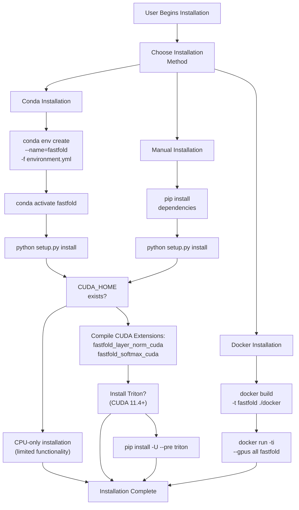
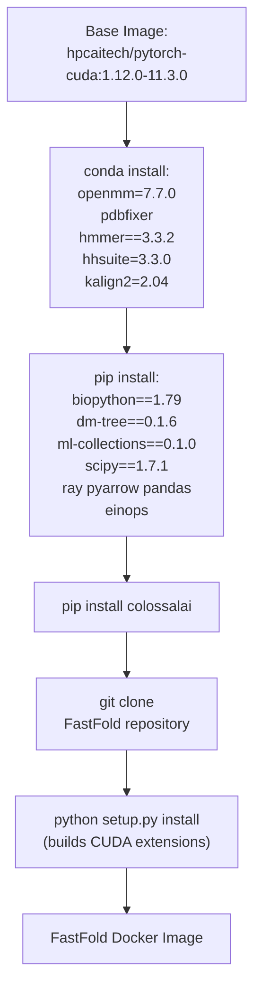
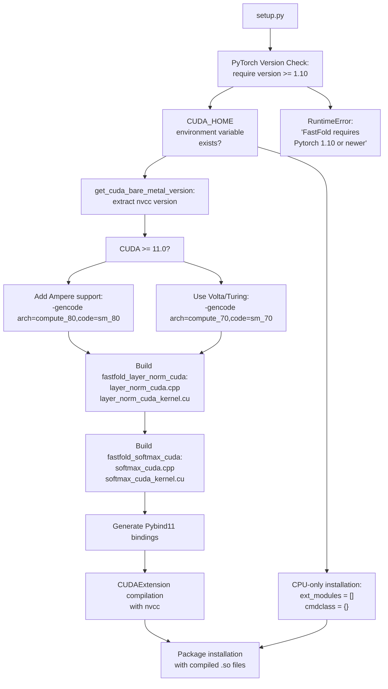

# Installation

> **Relevant source files**
> * [README.md](https://github.com/hpcaitech/FastFold/blob/eba49680/README.md?plain=1)
> * [docker/Dockerfile](https://github.com/hpcaitech/FastFold/blob/eba49680/docker/Dockerfile)
> * [environment.yml](https://github.com/hpcaitech/FastFold/blob/eba49680/environment.yml)
> * [inference.py](https://github.com/hpcaitech/FastFold/blob/eba49680/inference.py)
> * [setup.py](https://github.com/hpcaitech/FastFold/blob/eba49680/setup.py)

This document provides detailed instructions for installing FastFold and its dependencies. Installation options include conda environments, Docker containers, and manual setup. The installation process includes compiling CUDA extensions for optimized kernel operations and setting up bioinformatics tools for data preprocessing.

For running inference after installation, see [Quick Start: Inference](/hpcaitech/FastFold/2.2-quick-start:-inference). For training setup, see [Quick Start: Training](/hpcaitech/FastFold/2.3-quick-start:-training). For advanced CUDA extension development, see [Custom CUDA Extensions](/hpcaitech/FastFold/9.2-custom-cuda-extensions).

---

## Prerequisites

FastFold requires the following system dependencies:

| Component | Minimum Version | Recommended Version | Notes |
| --- | --- | --- | --- |
| Python | 3.8 | 3.8 or 3.9 | Specified in [environment.yml L25](https://github.com/hpcaitech/FastFold/blob/eba49680/environment.yml#L25-L25) |
| NVIDIA CUDA | 11.3 | 11.4+ | CUDA 11.4+ required for Triton support |
| PyTorch | 1.10 | 1.12 | Version check enforced at [setup.py L72-L74](https://github.com/hpcaitech/FastFold/blob/eba49680/setup.py#L72-L74) |
| GPU | - | Compute Capability 7.0+ | Required for CUDA extensions |

**Critical Requirements:**

* CUDA toolkit with `nvcc` compiler accessible via `CUDA_HOME` environment variable
* GPU support for building CUDA extensions (required during `setup.py install`)
* Conda or Docker for simplified dependency management

**Sources:** [README.md L33-L36](https://github.com/hpcaitech/FastFold/blob/eba49680/README.md?plain=1#L33-L36)

 [setup.py L72-L74](https://github.com/hpcaitech/FastFold/blob/eba49680/setup.py#L72-L74)

 [environment.yml L24-L25](https://github.com/hpcaitech/FastFold/blob/eba49680/environment.yml#L24-L25)

---

## Installation Methods Overview



**Diagram: FastFold Installation Decision Flow**

**Sources:** [README.md L31-L78](https://github.com/hpcaitech/FastFold/blob/eba49680/README.md?plain=1#L31-L78)

 [setup.py L86-L127](https://github.com/hpcaitech/FastFold/blob/eba49680/setup.py#L86-L127)

---

## Conda Installation (Recommended)

The conda-based installation provides a reproducible environment with all dependencies pre-configured.

### Step 1: Clone Repository

```
git clone https://github.com/hpcaitech/FastFoldcd FastFold
```

### Step 2: Create Conda Environment

The [environment.yml L1-L33](https://github.com/hpcaitech/FastFold/blob/eba49680/environment.yml#L1-L33)

 file defines all required dependencies:

```sql
conda env create --name=fastfold -f environment.ymlconda activate fastfold
```

**Key Dependencies Installed:**

| Category | Packages | Source |
| --- | --- | --- |
| **Deep Learning** | `pytorch=1.12`, `torchvision`, `torchaudio`, `cudatoolkit=11.3`, `colossalai==0.2.7` | [environment.yml L20-L24](https://github.com/hpcaitech/FastFold/blob/eba49680/environment.yml#L20-L24) |
| **Scientific Computing** | `biopython==1.79`, `scipy==1.7.1`, `einops`, `dm-tree==0.1.6` | [environment.yml L8-L16](https://github.com/hpcaitech/FastFold/blob/eba49680/environment.yml#L8-L16) |
| **Bioinformatics Tools** | `hmmer==3.3.2`, `hhsuite==3.3.0`, `kalign2==2.04` | [environment.yml L30-L32](https://github.com/hpcaitech/FastFold/blob/eba49680/environment.yml#L30-L32) |
| **Structure Relaxation** | `openmm=7.7.0`, `pdbfixer` | [environment.yml L28-L29](https://github.com/hpcaitech/FastFold/blob/eba49680/environment.yml#L28-L29) |
| **Workflow Acceleration** | `ray==2.0.0`, `pyarrow`, `pandas` | [environment.yml L17-L19](https://github.com/hpcaitech/FastFold/blob/eba49680/environment.yml#L17-L19) |
| **Configuration** | `ml-collections==0.1.0`, `PyYAML==5.4.1` | [environment.yml L10-L11](https://github.com/hpcaitech/FastFold/blob/eba49680/environment.yml#L10-L11) |

### Step 3: Install FastFold Package

```
python setup.py install
```

This triggers CUDA extension compilation if `CUDA_HOME` is detected (see [CUDA Extension Build Process](https://github.com/hpcaitech/FastFold/blob/eba49680/CUDA Extension Build Process)

 below).

**Sources:** [README.md L39-L50](https://github.com/hpcaitech/FastFold/blob/eba49680/README.md?plain=1#L39-L50)

 [environment.yml L1-L33](https://github.com/hpcaitech/FastFold/blob/eba49680/environment.yml#L1-L33)

---

## Docker Installation

Docker provides a complete, containerized environment with all tools pre-installed.

### Dockerfile Build Stages

The [docker/Dockerfile L1-L14](https://github.com/hpcaitech/FastFold/blob/eba49680/docker/Dockerfile#L1-L14)

 implements a multi-stage build process:



**Diagram: Docker Build Pipeline**

### Building the Image

**Important:** Building from scratch requires GPU support. Use Nvidia Docker Runtime as default:

```
cd FastFolddocker build -t fastfold ./docker
```

### Running the Container

```
docker run -ti --gpus all --rm --ipc=host fastfold bash
```

**Runtime Flags:**

* `--gpus all`: Expose all GPUs to container
* `--rm`: Auto-remove container on exit
* `--ipc=host`: Use host IPC namespace (required for multi-process training)

**Sources:** [README.md L63-L78](https://github.com/hpcaitech/FastFold/blob/eba49680/README.md?plain=1#L63-L78)

 [docker/Dockerfile L1-L14](https://github.com/hpcaitech/FastFold/blob/eba49680/docker/Dockerfile#L1-L14)

---

## CUDA Extension Build Process

The [setup.py L1-L144](https://github.com/hpcaitech/FastFold/blob/eba49680/setup.py#L1-L144)

 file orchestrates CUDA extension compilation for optimized kernels.

### Build System Architecture



**Diagram: setup.py CUDA Extension Build Flow**

### Compiled Extensions

The build process generates two CUDA extensions:

| Extension | Source Files | Purpose |
| --- | --- | --- |
| `fastfold_layer_norm_cuda` | [layer_norm_cuda.cpp, layer_norm_cuda_kernel.cu](https://github.com/hpcaitech/FastFold/blob/eba49680/layer_norm_cuda.cpp, layer_norm_cuda_kernel.cu) | Fused layer normalization kernel |
| `fastfold_softmax_cuda` | [softmax_cuda.cpp, softmax_cuda_kernel.cu](https://github.com/hpcaitech/FastFold/blob/eba49680/softmax_cuda.cpp, softmax_cuda_kernel.cu) | Fused softmax with two-row optimization |

### Key Build Functions

**Version Checking:**

* `get_cuda_bare_metal_version(cuda_dir)`: Extracts CUDA version from `nvcc -V`
* `check_cuda_torch_binary_vs_bare_metal(cuda_dir)`: Validates CUDA/PyTorch compatibility (currently commented out)

**Extension Configuration:**

* `cuda_ext_helper(name, sources, extra_cuda_flags)`: Creates `CUDAExtension` objects with: * Include directories: [fastfold/model/fastnn/kernel/cuda_native/csrc/include](https://github.com/hpcaitech/FastFold/blob/eba49680/fastfold/model/fastnn/kernel/cuda_native/csrc/include) () * Compiler flags: `-O3`, `--use_fast_math`, `-std=c++14`, `-maxrregcount=50` * Version macros: `VERSION_GE_1_1`, `VERSION_GE_1_3`, `VERSION_GE_1_5`

### Compilation Flags

The CUDA extensions are compiled with optimizations at [setup.py L113-L116](https://github.com/hpcaitech/FastFold/blob/eba49680/setup.py#L113-L116)

:

```
extra_cuda_flags = [    '-std=c++14', '-maxrregcount=50', '-U__CUDA_NO_HALF_OPERATORS__',    '-U__CUDA_NO_HALF_CONVERSIONS__', '--expt-relaxed-constexpr',     '--expt-extended-lambda']
```

**Flag Purposes:**

* `-maxrregcount=50`: Limit register usage for better occupancy
* `-U__CUDA_NO_HALF_OPERATORS__`: Enable FP16 operations
* `--expt-relaxed-constexpr`: Allow extended constexpr usage
* `--expt-extended-lambda`: Enable device lambda functions

**Sources:** [setup.py L1-L144](https://github.com/hpcaitech/FastFold/blob/eba49680/setup.py#L1-L144)

---

## Optional Components

### Triton Installation (Performance Critical)

Triton enables optimized kernel execution for attention and softmax operations. **Requires CUDA 11.4 or later.**

```
pip install -U --pre triton
```

**Performance Impact:**

* 2-10x speedup on fused attention operations (see [Fused Attention Core Kernel](/hpcaitech/FastFold/8.3.2-fused-attention-core-kernel))
* Memory bandwidth reduction through kernel fusion
* Automatic fallback to CUDA kernels if Triton unavailable

**Note:** The system will automatically use CUDA fallback kernels if Triton is not installed. For maximum performance, Triton installation is strongly recommended.

**Sources:** [README.md L52-L60](https://github.com/hpcaitech/FastFold/blob/eba49680/README.md?plain=1#L52-L60)

### Intel Habana Platform Support

For Intel Habana Gaudi/Gaudi2 accelerators, additional setup is required:

```markdown
cd fastfold/habana/fastnn/custom_op/python setup.py build  # For Gaudi# ORpython setup2.py build  # For Gaudi2cd -
```

See [Habana Platform Support](/hpcaitech/FastFold/9.3-habana-platform-support) for detailed configuration.

**Sources:** [README.md L189-L199](https://github.com/hpcaitech/FastFold/blob/eba49680/README.md?plain=1#L189-L199)

---

## Verification

### Verify CUDA Extensions

After installation, verify that CUDA extensions loaded successfully:

```javascript
import torchimport fastfold # Check CUDA extension availabilitytry:    from fastfold_layer_norm_cuda import layer_norm_fw, layer_norm_bw    from fastfold_softmax_cuda import softmax_fw, softmax_bw    print("✓ CUDA extensions loaded successfully")except ImportError as e:    print(f"✗ CUDA extensions not available: {e}")    print("  Running in CPU-only mode (limited functionality)")
```

### Verify Core Imports

Test that core FastFold modules are accessible:

```javascript
from fastfold.model.hub import AlphaFoldfrom fastfold.utils.inject_fastnn import inject_fastnnfrom fastfold.distributed import init_dapfrom fastfold.config import model_configfrom fastfold.data import data_pipeline print("✓ All core modules imported successfully")
```

### Verify Bioinformatics Tools

Ensure external tools are accessible (if installed via conda):

```markdown
which jackhmmer  # Should output path to binarywhich hhblits    # Should output path to binarywhich hhsearch   # Should output path to binarywhich kalign     # Should output path to binary
```

**Expected Output:**

```
/path/to/conda/envs/fastfold/bin/jackhmmer
/path/to/conda/envs/fastfold/bin/hhblits
/path/to/conda/envs/fastfold/bin/hhsearch
/path/to/conda/envs/fastfold/bin/kalign
```

**Sources:** [inference.py L104-L109](https://github.com/hpcaitech/FastFold/blob/eba49680/inference.py#L104-L109)

 [environment.yml L30-L32](https://github.com/hpcaitech/FastFold/blob/eba49680/environment.yml#L30-L32)

---

## Installation Troubleshooting

### Common Issues

| Issue | Cause | Solution |
| --- | --- | --- |
| `RuntimeError: FastFold requires Pytorch 1.10 or newer` | Incompatible PyTorch version | Install PyTorch 1.12+ via conda or pip |
| `CUDA extensions not built` | `CUDA_HOME` not set | Export `CUDA_HOME=/path/to/cuda` before running setup.py |
| `nvcc not found` | CUDA toolkit not in PATH | Add CUDA bin directory to PATH: `export PATH=/usr/local/cuda/bin:$PATH` |
| Docker build fails | No GPU access during build | Use Nvidia Docker Runtime as default (see [Docker installation](https://github.com/hpcaitech/FastFold/blob/eba49680/Docker installation) <br> ) |
| Triton import fails | CUDA < 11.4 | Upgrade CUDA to 11.4+ or run without Triton (uses CUDA fallback) |

### Build Without CUDA Extensions

For CPU-only or development environments without GPU:

```
CUDA_HOME="" python setup.py install
```

This installs FastFold without CUDA extensions. Performance optimizations will be disabled, but the core model architecture remains functional.

**Sources:** [setup.py L48-L127](https://github.com/hpcaitech/FastFold/blob/eba49680/setup.py#L48-L127)

---

## Next Steps

After successful installation:

1. **Download Databases:** Use [scripts/download_all_data.sh](https://github.com/hpcaitech/FastFold/blob/eba49680/scripts/download_all_data.sh)  to fetch alignment databases (see [Alignment and MSA Generation](/hpcaitech/FastFold/4.1-alignment-and-msa-generation))
2. **Download Model Parameters:** Obtain pre-trained weights from AlphaFold (see [JAX Weight Import](/hpcaitech/FastFold/9.1-jax-weight-import))
3. **Run Inference:** Follow [Quick Start: Inference](/hpcaitech/FastFold/2.2-quick-start:-inference) to predict protein structures
4. **Configure Training:** See [Quick Start: Training](/hpcaitech/FastFold/2.3-quick-start:-training) for distributed training setup

**Sources:** [README.md L97-L100](https://github.com/hpcaitech/FastFold/blob/eba49680/README.md?plain=1#L97-L100)