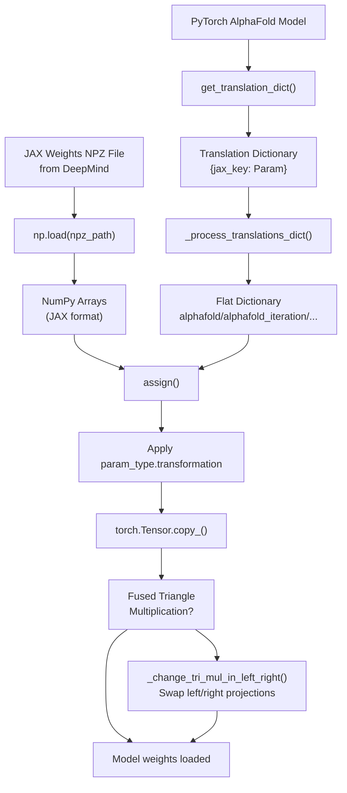
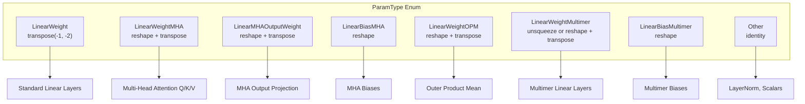
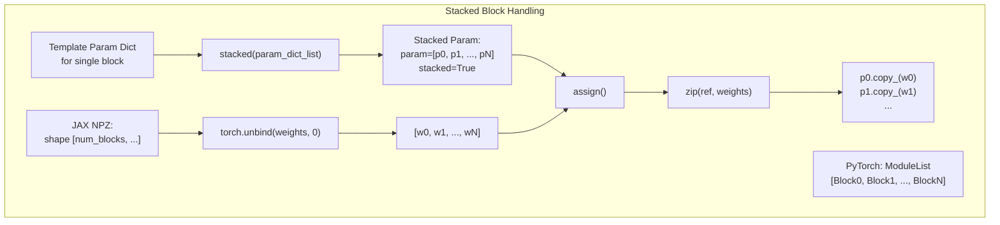
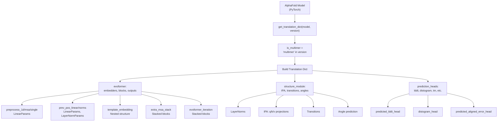
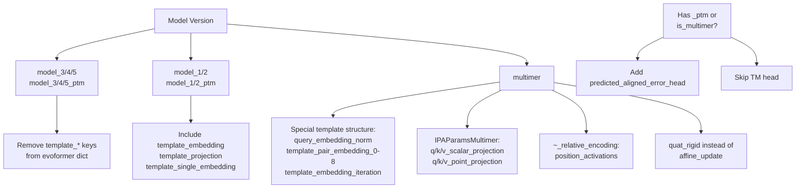
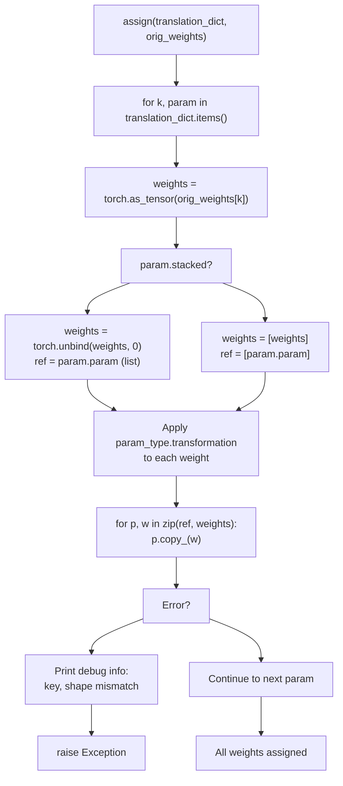
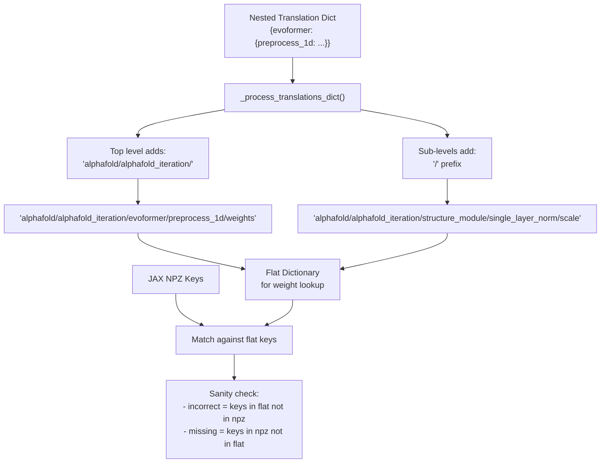

# JAX Weight Import

> **Relevant source files**
> * [fastfold/common/protein.py](https://github.com/hpcaitech/FastFold/blob/eba49680/fastfold/common/protein.py)
> * [fastfold/data/data_pipeline.py](https://github.com/hpcaitech/FastFold/blob/eba49680/fastfold/data/data_pipeline.py)
> * [fastfold/utils/import_weights.py](https://github.com/hpcaitech/FastFold/blob/eba49680/fastfold/utils/import_weights.py)

## Purpose and Scope

The JAX weight import system enables FastFold to load pre-trained AlphaFold model parameters from DeepMind's JAX implementation into FastFold's PyTorch model architecture. This functionality is critical for leveraging DeepMind's officially released AlphaFold weights while benefiting from FastFold's performance optimizations.

This document covers the weight conversion pipeline, parameter type transformations, translation dictionary construction, and model-specific handling. For information about model architecture and initialization, see [AlphaFold Model Architecture](/hpcaitech/FastFold/6-alphafold-model-architecture). For training from scratch, see [Training System](/hpcaitech/FastFold/7-training-system).

**Sources:** [fastfold/utils/import_weights.py L1-L628](https://github.com/hpcaitech/FastFold/blob/eba49680/fastfold/utils/import_weights.py#L1-L628)

---

## Weight Conversion Pipeline

The weight import process follows a systematic pipeline that maps JAX parameter names to PyTorch model attributes, applies format transformations, and assigns the converted weights.

### High-Level Flow



**Sources:** [fastfold/utils/import_weights.py L588-L628](https://github.com/hpcaitech/FastFold/blob/eba49680/fastfold/utils/import_weights.py#L588-L628)

---

## Parameter Type System

The weight conversion relies on a type system that defines how to transform JAX parameters into PyTorch format. Different parameter types require different transformations due to differences in tensor layout conventions between JAX and PyTorch.

### ParamType Enumeration



**Sources:** [fastfold/utils/import_weights.py L29-L53](https://github.com/hpcaitech/FastFold/blob/eba49680/fastfold/utils/import_weights.py#L29-L53)

### Transformation Functions

| ParamType | Transformation | Purpose |
| --- | --- | --- |
| `LinearWeight` | `lambda w: w.transpose(-1, -2)` | Standard linear layer weight transposition (JAX uses opposite convention) |
| `LinearWeightMHA` | `lambda w: w.reshape(*w.shape[:-2], -1).transpose(-1, -2)` | Multi-head attention weights: flatten heads then transpose |
| `LinearMHAOutputWeight` | `lambda w: w.reshape(*w.shape[:-3], -1, w.shape[-1]).transpose(-1, -2)` | MHA output projection with head-specific reshaping |
| `LinearBiasMHA` | `lambda w: w.reshape(*w.shape[:-2], -1)` | MHA biases: flatten head dimension |
| `LinearWeightOPM` | `lambda w: w.reshape(*w.shape[:-3], -1, w.shape[-1]).transpose(-1, -2)` | Outer product mean: special reshaping for output dimension |
| `LinearWeightMultimer` | `lambda w: w.unsqueeze(-1) if len(w.shape) == 1 else w.reshape(w.shape[0], -1).transpose(-1, -2)` | Multimer models: handle 1D or 2D weights |
| `LinearBiasMultimer` | `lambda w: w.reshape(-1)` | Multimer biases: flatten to 1D |
| `Other` | `lambda w: w` | No transformation (LayerNorm parameters, etc.) |

**Sources:** [fastfold/utils/import_weights.py L30-L49](https://github.com/hpcaitech/FastFold/blob/eba49680/fastfold/utils/import_weights.py#L30-L49)

---

## Param Wrapper and Stacking

### Param Dataclass

The `Param` dataclass wraps PyTorch tensors or lists of tensors with metadata about how to transform them:

```python
@dataclassclass Param:    param: Union[torch.Tensor, List[torch.Tensor]]  # Target PyTorch parameter(s)    param_type: ParamType = ParamType.Other          # Transformation to apply    stacked: bool = False                            # Whether param is list of stacked params
```

**Sources:** [fastfold/utils/import_weights.py L55-L60](https://github.com/hpcaitech/FastFold/blob/eba49680/fastfold/utils/import_weights.py#L55-L60)

### Stacked Parameters

Repeated blocks (Evoformer iterations, template pair stack) use stacked parameters to handle JAX's layer stacking convention:



**Sources:** [fastfold/utils/import_weights.py L81-L107](https://github.com/hpcaitech/FastFold/blob/eba49680/fastfold/utils/import_weights.py#L81-L107)

 [fastfold/utils/import_weights.py L110-L129](https://github.com/hpcaitech/FastFold/blob/eba49680/fastfold/utils/import_weights.py#L110-L129)

---

## Translation Dictionary Construction

The `get_translation_dict()` function builds a nested dictionary that maps JAX parameter paths to PyTorch model parameters. This mapping is model-version-specific.

### Structure Overview



**Sources:** [fastfold/utils/import_weights.py L131-L585](https://github.com/hpcaitech/FastFold/blob/eba49680/fastfold/utils/import_weights.py#L131-L585)

### Module-Level Mapping Templates

The translation dictionary uses lambda templates to construct mappings for common module types:

| Template | Maps To | Structure |
| --- | --- | --- |
| `LinearParams` | `nn.Linear` | `{"weights": LinearWeight(l.weight), "bias": LinearBias(l.bias)}` |
| `LayerNormParams` | `nn.LayerNorm` | `{"scale": Param(l.weight), "offset": Param(l.bias)}` |
| `AttentionParams` | `Attention` | `{"query_w": ..., "key_w": ..., "value_w": ..., "output_w": ..., "output_b": ...}` |
| `AttentionGatedParams` | `Attention` with gating | Extends `AttentionParams` with `gating_w` and `gating_b` |
| `TriMulOutParams` | Triangle Multiplication Outgoing | Layer norms, projections, gates, output |
| `TriMulInParams` | Triangle Multiplication Incoming | Special handling: swaps left/right due to JAX convention |
| `IPAParams` | Invariant Point Attention | Scalar/point projections, attention 2D, output |
| `EvoformerBlockParams` | Evoformer Block | MSA attention, outer product, triangle ops, transitions |

**Sources:** [fastfold/utils/import_weights.py L136-L362](https://github.com/hpcaitech/FastFold/blob/eba49680/fastfold/utils/import_weights.py#L136-L362)

---

## Model Version Handling

Different AlphaFold model versions require specific parameter mappings. The system handles monomer models (model_1 through model_5), PTM variants, and multimer models.

### Version-Specific Differences



**Sources:** [fastfold/utils/import_weights.py L565-L584](https://github.com/hpcaitech/FastFold/blob/eba49680/fastfold/utils/import_weights.py#L565-L584)

### Monomer vs Multimer Differences

| Component | Monomer | Multimer |
| --- | --- | --- |
| **Input Embedder** | `preprocess_1d/msa`, `left_single`, `right_single` | Same structure |
| **Relative Encoding** | `pair_activiations: LinearParams` | `~_relative_encoding: {position_activations: LinearParams}` |
| **Template Embedding** | Single block with `embedding2d`, simple structure | Multi-component: 9 separate `template_pair_embedding_*` layers |
| **IPA** | `IPAParams`: `q_scalar`, `kv_scalar`, `q_point_local`, `kv_point_local` | `IPAParamsMultimer`: separate `q/k/v_scalar_projection`, `q/k/v_point_projection` |
| **Backbone Update** | `affine_update: LinearParams` | `quat_rigid: {rigid: LinearParams}` |
| **Linear Layers** | `LinearParams` | `LinearParamsMultimer` with special transformations |

**Sources:** [fastfold/utils/import_weights.py L404-L584](https://github.com/hpcaitech/FastFold/blob/eba49680/fastfold/utils/import_weights.py#L404-L584)

---

## Weight Assignment Process

The `assign()` function performs the actual weight transfer with transformation:



**Sources:** [fastfold/utils/import_weights.py L110-L129](https://github.com/hpcaitech/FastFold/blob/eba49680/fastfold/utils/import_weights.py#L110-L129)

---

## Special Case: Fused Triangle Multiplication

FastFold's fused triangle multiplication implementation requires post-processing after weight import to swap left/right projections for incoming triangle multiplication.

### Fused Triangle Handling

**Sources:** [fastfold/utils/import_weights.py L610-L627](https://github.com/hpcaitech/FastFold/blob/eba49680/fastfold/utils/import_weights.py#L610-L627)

### Why Swapping is Necessary

In JAX AlphaFold (commit b88f8da), the naming convention for incoming vs outgoing triangle multiplication differs from the standard pseudocode. FastFold's implementation follows the pseudocode, requiring a swap of left/right parameters when importing from JAX. For fused implementations, the parameters are concatenated, so we chunk and reverse them.

**Sources:** [fastfold/utils/import_weights.py L202-L213](https://github.com/hpcaitech/FastFold/blob/eba49680/fastfold/utils/import_weights.py#L202-L213)

 [fastfold/utils/import_weights.py L226-L239](https://github.com/hpcaitech/FastFold/blob/eba49680/fastfold/utils/import_weights.py#L226-L239)

---

## Key Flattening and Prefix Handling

JAX weights use a specific key prefix structure that must be processed for matching:



**Key Prefix:** All JAX weights have the prefix `"alphafold/alphafold_iteration/"` which is added during flattening.

**Sources:** [fastfold/utils/import_weights.py L25](https://github.com/hpcaitech/FastFold/blob/eba49680/fastfold/utils/import_weights.py#L25-L25)

 [fastfold/utils/import_weights.py L62-L78](https://github.com/hpcaitech/FastFold/blob/eba49680/fastfold/utils/import_weights.py#L62-L78)

 [fastfold/utils/import_weights.py L594-L605](https://github.com/hpcaitech/FastFold/blob/eba49680/fastfold/utils/import_weights.py#L594-L605)

---

## Usage Example

### Basic Import

```javascript
from fastfold.utils.import_weights import import_jax_weights_ # Create PyTorch modelmodel = AlphaFold(config) # Import JAX weightsimport_jax_weights_(    model=model,    npz_path="params_model_1.npz",  # DeepMind's JAX weights    version="model_1"                # Model version identifier) # Model now has DeepMind's weights in PyTorch format
```

### Supported Versions

| Version String | Description |
| --- | --- |
| `"model_1"` | Monomer model 1 with templates |
| `"model_2"` | Monomer model 2 with templates |
| `"model_3"` | Monomer model 3 without templates |
| `"model_4"` | Monomer model 4 without templates |
| `"model_5"` | Monomer model 5 without templates |
| `"model_1_ptm"` | Model 1 with pTM head |
| `"model_2_ptm"` | Model 2 with pTM head |
| `"model_3_ptm"` | Model 3 with pTM head |
| `"model_4_ptm"` | Model 4 with pTM head |
| `"model_5_ptm"` | Model 5 with pTM head |
| `"multimer"` | Multimer model (any version) |

**Sources:** [fastfold/utils/import_weights.py L588-L589](https://github.com/hpcaitech/FastFold/blob/eba49680/fastfold/utils/import_weights.py#L588-L589)

---

## Implementation Details

### Critical Implementation Points

1. **Transpose Convention**: JAX uses `[out_features, in_features]` while PyTorch uses `[in_features, out_features]`, requiring transposition for all linear weights.
2. **Multi-Head Attention**: JAX stores MHA weights with explicit head dimension `[..., num_heads, head_dim]` while PyTorch flattens to `[..., num_heads * head_dim]`, requiring reshaping before transposition.
3. **Stacked Blocks**: JAX stores block parameters with leading block dimension while PyTorch uses ModuleList. The `stacked()` function handles this by creating lists of Param objects.
4. **Triangle Multiplication**: The incoming variant has swapped left/right projections in JAX. For fused implementations, parameters are concatenated, requiring chunk-and-reverse operation.
5. **Multimer Models**: Use different linear layer transformations (`LinearWeightMultimer`) and have additional structural differences (separate q/k/v projections in IPA, quaternion-based backbone updates).

**Sources:** [fastfold/utils/import_weights.py L30-L49](https://github.com/hpcaitech/FastFold/blob/eba49680/fastfold/utils/import_weights.py#L30-L49)

 [fastfold/utils/import_weights.py L192-L239](https://github.com/hpcaitech/FastFold/blob/eba49680/fastfold/utils/import_weights.py#L192-L239)

 [fastfold/utils/import_weights.py L366-L390](https://github.com/hpcaitech/FastFold/blob/eba49680/fastfold/utils/import_weights.py#L366-L390)

---

## Error Handling and Validation

The import process includes validation steps:

```markdown
# Sanity check in import_jax_weights_keys = list(data.keys())              # Keys in JAX NPZflat_keys = list(flat.keys())         # Keys in translation dict incorrect = [k for k in flat_keys if k not in keys]  # Keys we expect but NPZ doesn't havemissing = [k for k in keys if k not in flat_keys]    # Keys in NPZ we don't handle assert len(incorrect) == 0  # Fail if we reference non-existent keys
```

During assignment, shape mismatches are caught and printed:

```python
try:    weights = list(map(param_type.transformation, weights))    for p, w in zip(ref, weights):        p.copy_(w)except:    print(k)                    # Parameter key    print(ref[0].shape)        # Expected PyTorch shape    print(weights[0].shape)    # Actual JAX shape    raise
```

**Sources:** [fastfold/utils/import_weights.py L596-L605](https://github.com/hpcaitech/FastFold/blob/eba49680/fastfold/utils/import_weights.py#L596-L605)

 [fastfold/utils/import_weights.py L121-L129](https://github.com/hpcaitech/FastFold/blob/eba49680/fastfold/utils/import_weights.py#L121-L129)