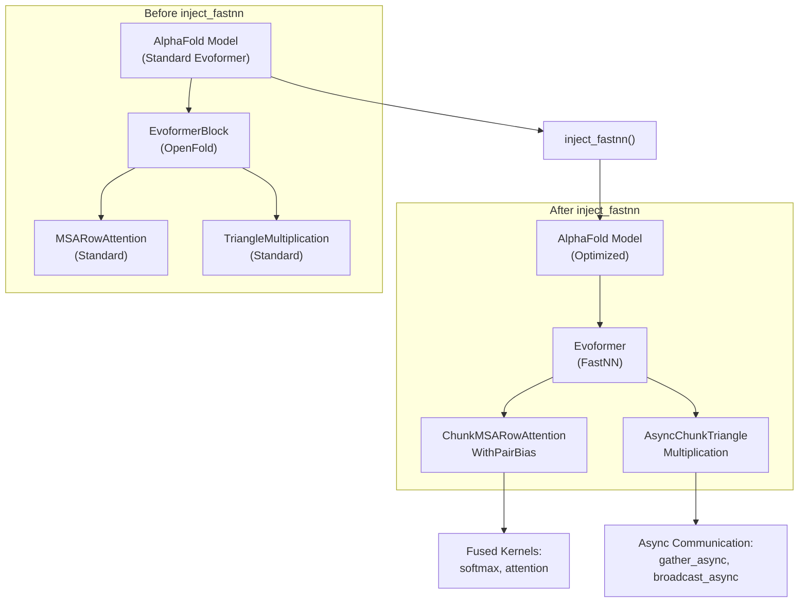
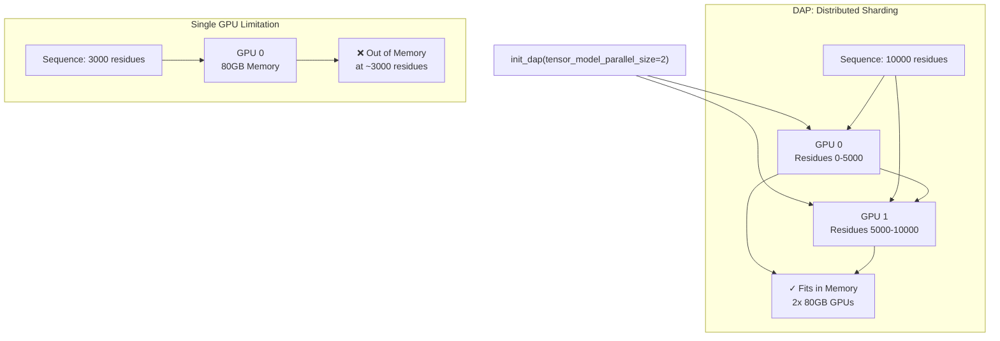
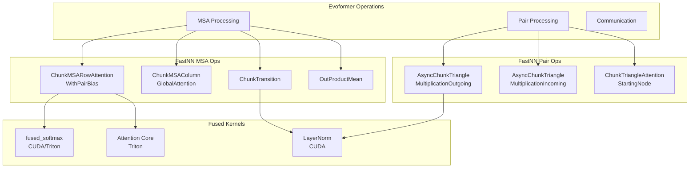
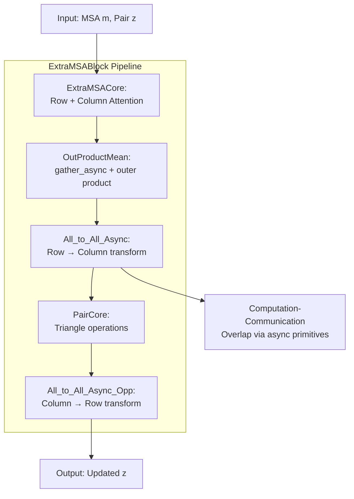
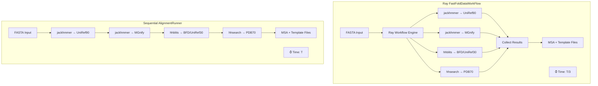
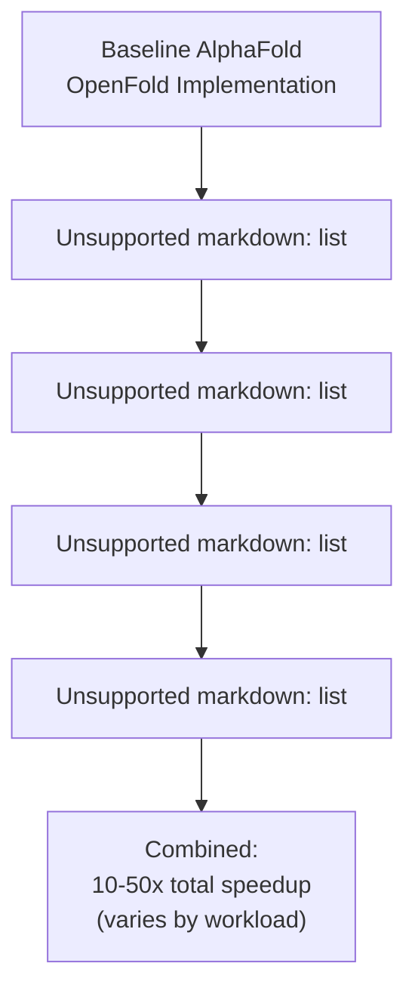

# Key Innovations

> **Relevant source files**
> * [README.md](https://github.com/hpcaitech/FastFold/blob/eba49680/README.md?plain=1)
> * [benchmark/perf.py](https://github.com/hpcaitech/FastFold/blob/eba49680/benchmark/perf.py)
> * [environment.yml](https://github.com/hpcaitech/FastFold/blob/eba49680/environment.yml)
> * [fastfold/distributed/__init__.py](https://github.com/hpcaitech/FastFold/blob/eba49680/fastfold/distributed/__init__.py)
> * [fastfold/distributed/comm.py](https://github.com/hpcaitech/FastFold/blob/eba49680/fastfold/distributed/comm.py)
> * [fastfold/distributed/core.py](https://github.com/hpcaitech/FastFold/blob/eba49680/fastfold/distributed/core.py)
> * [fastfold/model/__init__.py](https://github.com/hpcaitech/FastFold/blob/eba49680/fastfold/model/__init__.py)
> * [fastfold/model/fastnn/__init__.py](https://github.com/hpcaitech/FastFold/blob/eba49680/fastfold/model/fastnn/__init__.py)
> * [fastfold/model/fastnn/msa.py](https://github.com/hpcaitech/FastFold/blob/eba49680/fastfold/model/fastnn/msa.py)
> * [fastfold/model/fastnn/ops.py](https://github.com/hpcaitech/FastFold/blob/eba49680/fastfold/model/fastnn/ops.py)
> * [inference.py](https://github.com/hpcaitech/FastFold/blob/eba49680/inference.py)

## Purpose and Scope

This document details FastFold's core technical innovations that enable 2-10x performance improvements over baseline AlphaFold implementations. The four main contributions are: (1) the `inject_fastnn` mechanism for transparent optimization injection, (2) Dynamic Axial Parallelism (DAP) for memory-efficient sequence scaling, (3) fused CUDA/Triton kernels for computational efficiency, and (4) Ray-based workflow acceleration for data preprocessing.

For architectural context, see [System Architecture](/hpcaitech/FastFold/1.1-system-architecture). For detailed performance tuning guidance, see [Performance Tuning Guide](/hpcaitech/FastFold/12-performance-tuning-guide). For specific optimization implementations, see [Performance Optimizations](/hpcaitech/FastFold/8-performance-optimizations).

---

## Innovation Overview

FastFold achieves significant performance gains through optimization at multiple system levels. The table below summarizes the key innovations and their impact:

| Innovation | Primary Benefit | Performance Gain | Code Entry Points |
| --- | --- | --- | --- |
| **inject_fastnn** | Transparent optimization replacement | 2-5x Evoformer speedup | `fastfold.utils.inject_fastnn` |
| **Dynamic Axial Parallelism (DAP)** | Break GPU memory limits | 10K+ residue support, 2x speedup | `fastfold.distributed.init_dap` |
| **Fused Kernels** | Reduced memory bandwidth | 2-10x operation speedup | `fastfold.model.fastnn.kernel` |
| **Ray Workflow** | Parallel data processing | 3-3Nx preprocessing speedup | `FastFoldDataWorkFlow` |

Sources: [README.md L19-L29](https://github.com/hpcaitech/FastFold/blob/eba49680/README.md?plain=1#L19-L29)

 [inference.py L104-L145](https://github.com/hpcaitech/FastFold/blob/eba49680/inference.py#L104-L145)

---

## 1. inject_fastnn: Transparent Optimization Injection

### Mechanism Overview

The `inject_fastnn` function provides a surgical replacement mechanism that swaps standard Evoformer modules with optimized FastNN implementations while maintaining AlphaFold compatibility. This enables "huge performance gains with a few lines changes" as stated in the README.



**Diagram: inject_fastnn Module Replacement Strategy**

### Usage Pattern

The injection occurs in two lines of code during model initialization:

```markdown
# Load standard AlphaFold modelmodel = AlphaFold(config)import_jax_weights_(model, args.param_path, version=args.model_name) # Inject optimized operationsmodel = inject_fastnn(model)
```

Sources: [inference.py L138-L141](https://github.com/hpcaitech/FastFold/blob/eba49680/inference.py#L138-L141)

### Key Replacements

The `inject_fastnn` mechanism performs the following module substitutions:

| Standard Module | Optimized Replacement | Optimization Type |
| --- | --- | --- |
| `EvoformerStack` | `fastfold.model.fastnn.EvoformerStack` | Chunk-aware processing |
| `ExtraMSAStack` | `fastfold.model.fastnn.ExtraMSAStack` | Distributed + chunked |
| `TriangleMultiplication` | `AsyncChunkTriangleMultiplication` | Async communication |
| `MSARowAttention` | `ChunkMSARowAttentionWithPairBias` | Fused kernels + chunking |
| `TemplatePairStack` | `fastfold.model.fastnn.TemplatePairStack` | Optimized pair processing |

The replacement strategy maintains identical input/output signatures, ensuring seamless integration without requiring changes to downstream code.

Sources: [README.md L104-L112](https://github.com/hpcaitech/FastFold/blob/eba49680/README.md?plain=1#L104-L112)

 [fastfold/model/fastnn/__init__.py L1-L13](https://github.com/hpcaitech/FastFold/blob/eba49680/fastfold/model/fastnn/__init__.py#L1-L13)

---

## 2. Dynamic Axial Parallelism (DAP)

### Concept and Architecture

DAP enables ultra-long sequence inference (10K+ residues) by sharding the sequence dimension across multiple GPUs. Unlike data parallelism (which replicates the model), DAP partitions activations along the residue or MSA axis, allowing each GPU to process a shard of the sequence.



**Diagram: Dynamic Axial Parallelism Memory Sharding**

### Initialization and Configuration

DAP is initialized via `fastfold.distributed.init_dap()` which sets up the distributed process group and configures tensor model parallelism:

```javascript
# Initialize DAP for 2-GPU parallelismfrom fastfold.distributed import init_dapinit_dap(args.dap_size) # Automatically detects world size if not specified# Sets environment variables: WORLD_SIZE, RANK, LOCAL_RANK# Launches ColossalAI with tensor parallelism configuration
```

The initialization process:

1. **Environment Setup**: Sets `WORLD_SIZE`, `RANK`, `LOCAL_RANK` environment variables if missing
2. **ColossalAI Launch**: Configures `parallel.tensor.size` for tensor model parallelism
3. **Process Group Creation**: Initializes distributed communication backend

Sources: [fastfold/distributed/core.py L17-L40](https://github.com/hpcaitech/FastFold/blob/eba49680/fastfold/distributed/core.py#L17-L40)

 [inference.py L122-L127](https://github.com/hpcaitech/FastFold/blob/eba49680/inference.py#L122-L127)

### Communication Primitives

DAP relies on autograd-aware communication primitives that ensure correct gradient flow:

| Operation | Forward Pass | Backward Pass | Use Case |
| --- | --- | --- | --- |
| `scatter` | Split tensor across GPUs | Gather gradients | Distribute activations |
| `gather` | Concatenate from all GPUs | Split gradients | Collect full tensor |
| `reduce` | Sum across GPUs | Identity | Gradient accumulation |
| `all_to_all` | Row↔Column transform | Inverse transform | Axis switching |

Sources: [fastfold/distributed/comm.py L85-L203](https://github.com/hpcaitech/FastFold/blob/eba49680/fastfold/distributed/comm.py#L85-L203)

### Practical Usage in Inference

For multi-GPU inference, DAP is initialized per worker process using `torch.multiprocessing.spawn`:

```python
# Spawn worker processes (one per GPU)torch.multiprocessing.spawn(    inference_model,     nprocs=args.gpus,     args=(args.gpus, result_q, batch, args)) # Each worker initializes DAPdef inference_model(rank, world_size, ...):    os.environ['RANK'] = str(rank)    os.environ['LOCAL_RANK'] = str(rank)    os.environ['WORLD_SIZE'] = str(world_size)        fastfold.distributed.init_dap()  # Auto-detects world_size    torch.cuda.set_device(rank)    # ... model loading and inference
```

Sources: [inference.py L122-L159](https://github.com/hpcaitech/FastFold/blob/eba49680/inference.py#L122-L159)

 [inference.py L291-L293](https://github.com/hpcaitech/FastFold/blob/eba49680/inference.py#L291-L293)

---

## 3. FastNN Optimized Operations

### Operation Categories

FastNN provides chunk-aware, kernel-optimized implementations of the computationally intensive operations in the Evoformer architecture:



**Diagram: FastNN Operation Hierarchy and Kernel Usage**

### Chunking Strategy

The global `CHUNK_SIZE` parameter controls memory-compute tradeoffs by processing activations in smaller chunks:

```javascript
# Set chunk size globallyfrom fastfold.model.fastnn import set_chunk_sizeset_chunk_size(model.globals.chunk_size)  # Typically 4-128 # Operations automatically chunk when CHUNK_SIZE is set# Example from ChunkTransition:if CHUNK_SIZE == None:    out = self.norm(src)    out = self.linear2(F.relu(self.linear1(out)))else:    chunk_size = CHUNK_SIZE * 48    para_dim = src.shape[1]    out = torch.empty_like(src)    for ax in range(0, para_dim, chunk_size):        x = self.norm(src[:, ax:ax + chunk_size, :, :])        x = self.linear2(F.relu(self.linear1(x)))        out[:, ax:ax + chunk_size, :, :] = x
```

**Chunk Size Guidelines:**

* **Lower values (4-16)**: Reduced memory usage, slower execution
* **Higher values (32-128)**: Increased memory usage, faster execution
* **None**: No chunking, maximum memory usage

Sources: [fastfold/model/fastnn/ops.py L31-L42](https://github.com/hpcaitech/FastFold/blob/eba49680/fastfold/model/fastnn/ops.py#L31-L42)

 [fastfold/model/fastnn/ops.py L85-L108](https://github.com/hpcaitech/FastFold/blob/eba49680/fastfold/model/fastnn/ops.py#L85-L108)

### Asynchronous Triangle Multiplication

The `AsyncChunkTriangleMultiplicationOutgoing` and `AsyncChunkTriangleMultiplicationIncoming` operations implement computation-communication overlap through asynchronous broadcasting:

**Key Innovation**: While GPU `k` broadcasts its activations, GPUs can simultaneously compute using previously received data, hiding communication latency.

```python
# Pseudocode from AsyncChunkTriangleMultiplicationOutgoingfor i in range(0, para_dim, chunk_size):    for j in range(0, para_dim, chunk_size):        for k in range(0, world_size):            if work:                broadcast_async_opp(work)  # Wait for previous broadcast                        if k + 1 != world_size:                work = broadcast_async(k+1, ...)  # Launch next broadcast                        # Compute with current k's data while next broadcast happens            p = torch.matmul(left_proj_act, right_proj_act)            output[...] = p
```

Sources: [fastfold/model/fastnn/ops.py L372-L498](https://github.com/hpcaitech/FastFold/blob/eba49680/fastfold/model/fastnn/ops.py#L372-L498)

 [fastfold/model/fastnn/ops.py L501-L630](https://github.com/hpcaitech/FastFold/blob/eba49680/fastfold/model/fastnn/ops.py#L501-L630)

### ExtraMSAStack Optimization

The `ExtraMSAStack` combines MSA processing, communication (OutProductMean), and pair processing with optimized scheduling:



**Diagram: ExtraMSAStack Communication-Computation Overlap**

The `inplace` variant further reduces memory by reusing input buffers:

```markdown
# Standard: Creates new tensorsz = block(m, z, msa_mask, pair_mask) # Inplace: Reuses buffers (wrapped in list for in-place modification)m_inplace = [m]z_inplace = [z]m_inplace, z_inplace = block.inplace(m_inplace, z_inplace, msa_mask, pair_mask)
```

Sources: [fastfold/model/fastnn/msa.py L190-L344](https://github.com/hpcaitech/FastFold/blob/eba49680/fastfold/model/fastnn/msa.py#L190-L344)

 [fastfold/model/fastnn/msa.py L347-L464](https://github.com/hpcaitech/FastFold/blob/eba49680/fastfold/model/fastnn/msa.py#L347-L464)

---

## 4. Ray Workflow Acceleration

### Architecture Overview

FastFold accelerates data preprocessing using Ray workflows to parallelize database searches and alignment computations, achieving 3x speedup for monomers and 3Nx for multimers (where N is the number of chains).



**Diagram: Sequential vs Ray-Accelerated Data Processing**

### Implementation Pattern

The Ray workflow is enabled via the `--enable_workflow` flag and uses `FastFoldDataWorkFlow` or `FastFoldMultimerDataWorkFlow`:

```python
if args.enable_workflow:    print("Running alignment with ray workflow...")    alignment_runner = FastFoldDataWorkFlow(        jackhmmer_binary_path=args.jackhmmer_binary_path,        hhblits_binary_path=args.hhblits_binary_path,        hhsearch_binary_path=args.hhsearch_binary_path,        uniref90_database_path=args.uniref90_database_path,        mgnify_database_path=args.mgnify_database_path,        bfd_database_path=args.bfd_database_path,        uniref30_database_path=args.uniref30_database_path,        pdb70_database_path=args.pdb70_database_path,        use_small_bfd=use_small_bfd,        no_cpus=args.cpus,    )        alignment_runner.run(fasta_path, alignment_dir=local_alignment_dir)else:    # Use sequential AlignmentRunner    alignment_runner = data_pipeline.AlignmentRunner(...)    alignment_runner.run(fasta_path, local_alignment_dir)
```

Sources: [inference.py L395-L426](https://github.com/hpcaitech/FastFold/blob/eba49680/inference.py#L395-L426)

 [inference.py L184-L215](https://github.com/hpcaitech/FastFold/blob/eba49680/inference.py#L184-L215)

### Performance Characteristics

| Workflow Type | Parallelization | Speedup | Use Case |
| --- | --- | --- | --- |
| Sequential `AlignmentRunner` | None | 1x (baseline) | Single-chain, low CPU count |
| `FastFoldDataWorkFlow` | Database search parallelism | ~3x | Monomer proteins |
| `FastFoldMultimerDataWorkFlow` | Per-chain + database parallelism | ~3Nx (N chains) | Multimer proteins |

The speedup scales with available CPU cores (`--cpus` parameter), as database search tools like `jackhmmer` and `hhblits` are CPU-bound.

Sources: [README.md L138-L139](https://github.com/hpcaitech/FastFold/blob/eba49680/README.md?plain=1#L138-L139)

 [inference.py L269-L275](https://github.com/hpcaitech/FastFold/blob/eba49680/inference.py#L269-L275)

---

## 5. Integration and Combined Impact

### Optimization Layers

The four innovations operate at different system levels and can be combined for maximum performance:

| Layer | Innovation | Applies To | Can Combine With |
| --- | --- | --- | --- |
| **Data Preprocessing** | Ray Workflow | Alignment & search | All others |
| **Model Architecture** | inject_fastnn | Evoformer operations | DAP, kernels |
| **Memory Management** | DAP | Sequence sharding | inject_fastnn, kernels |
| **Computation** | Fused Kernels | Primitive operations | inject_fastnn, DAP |

### Typical Inference Configuration

A production inference setup combines all innovations:

```python
# 1. Ray workflow for data preprocessingalignment_runner = FastFoldDataWorkFlow(...)alignment_runner.run(fasta_path, alignment_dir) # 2. Multi-GPU DAP initializationtorch.multiprocessing.spawn(    inference_model,    nprocs=args.gpus,  # e.g., 2 GPUs    args=(args.gpus, result_q, batch, args)) def inference_model(rank, world_size, ...):    # 3. Initialize DAP    fastfold.distributed.init_dap()        # 4. Load model and inject FastNN    model = AlphaFold(config)    import_jax_weights_(model, args.param_path)    model = inject_fastnn(model)  # Fused kernels applied here        # 5. Set chunk size for memory control    set_chunk_size(model.globals.chunk_size)        # Run inference    out = model(batch)
```

Sources: [inference.py L122-L159](https://github.com/hpcaitech/FastFold/blob/eba49680/inference.py#L122-L159)

 [inference.py L396-L412](https://github.com/hpcaitech/FastFold/blob/eba49680/inference.py#L396-L412)

### Performance Gains Summary

Combining all optimizations yields multiplicative performance improvements:



**Diagram: Cumulative Performance Impact**

**Specific Improvements:**

* **Data Preprocessing**: 3x faster (monomer), 3Nx faster (multimer)
* **Evoformer Forward/Backward**: 2-5x faster via inject_fastnn
* **Individual Operations**: 2-10x faster via fused kernels
* **Memory Capacity**: 3K → 10K+ residues with DAP
* **Overall Training**: 11 days → 67 hours (per paper title)

Sources: [README.md L19-L29](https://github.com/hpcaitech/FastFold/blob/eba49680/README.md?plain=1#L19-L29)

 [README.md L228-L235](https://github.com/hpcaitech/FastFold/blob/eba49680/README.md?plain=1#L228-L235)

---

## Configuration and Usage

### Command-Line Interface

Key flags for enabling innovations:

```markdown
python inference.py target.fasta template_dir/ \    --gpus 2 \                      # Enable DAP across 2 GPUs    --enable_workflow \             # Enable Ray workflow acceleration    --chunk_size 32 \               # Control memory usage via chunking    --inplace \                     # Enable inplace memory optimization    --model_name model_1 \    --param_path params.npz
```

### Memory-Performance Tradeoffs

| Configuration | Memory Usage | Speed | Max Sequence Length |
| --- | --- | --- | --- |
| `chunk_size=None`, `gpus=1` | Highest | Fastest | ~3000 residues |
| `chunk_size=64`, `gpus=1` | Medium | Medium | ~5000 residues |
| `chunk_size=32`, `gpus=1` | Low | Slower | ~8000 residues |
| `chunk_size=32`, `gpus=2` (DAP) | Distributed | Fast | 10K+ residues |

**Note**: For sequences >8K residues, set `PYTORCH_CUDA_ALLOC_CONF=max_split_size_mb:15000` to avoid memory fragmentation.

Sources: [README.md L141-L164](https://github.com/hpcaitech/FastFold/blob/eba49680/README.md?plain=1#L141-L164)

 [inference.py L117-L119](https://github.com/hpcaitech/FastFold/blob/eba49680/inference.py#L117-L119)

 [inference.py L130-L136](https://github.com/hpcaitech/FastFold/blob/eba49680/inference.py#L130-L136)