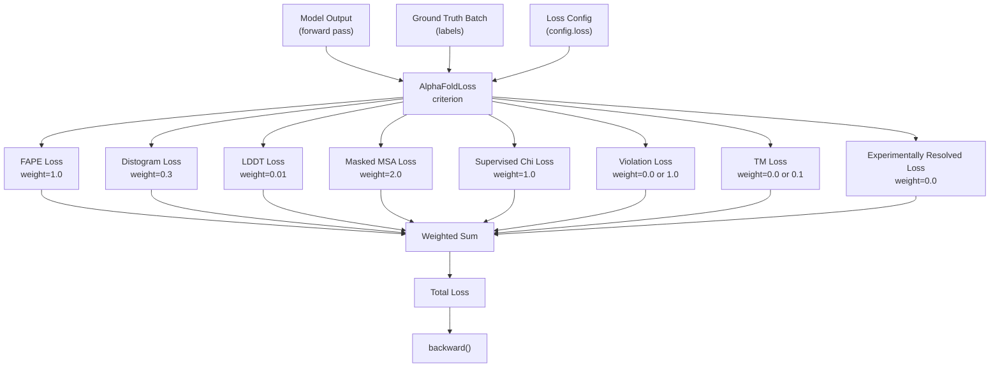
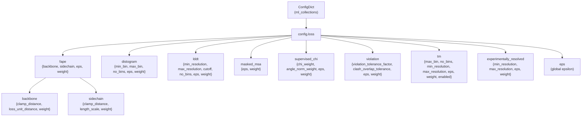

# Loss Functions and Metrics

> **Relevant source files**
> * [LICENSE](https://github.com/hpcaitech/FastFold/blob/eba49680/LICENSE)
> * [fastfold/config.py](https://github.com/hpcaitech/FastFold/blob/eba49680/fastfold/config.py)
> * [fastfold/data/data_modules.py](https://github.com/hpcaitech/FastFold/blob/eba49680/fastfold/data/data_modules.py)
> * [fastfold/model/fastnn/kernel/layer_norm.py](https://github.com/hpcaitech/FastFold/blob/eba49680/fastfold/model/fastnn/kernel/layer_norm.py)
> * [fastfold/relax/relax.py](https://github.com/hpcaitech/FastFold/blob/eba49680/fastfold/relax/relax.py)
> * [fastfold/relax/utils.py](https://github.com/hpcaitech/FastFold/blob/eba49680/fastfold/relax/utils.py)
> * [fastfold/utils/tensor_utils.py](https://github.com/hpcaitech/FastFold/blob/eba49680/fastfold/utils/tensor_utils.py)
> * [fastfold/utils/test_utils.py](https://github.com/hpcaitech/FastFold/blob/eba49680/fastfold/utils/test_utils.py)
> * [tests/test_train.py](https://github.com/hpcaitech/FastFold/blob/eba49680/tests/test_train.py)
> * [train.py](https://github.com/hpcaitech/FastFold/blob/eba49680/train.py)

This page documents the loss functions used to train the AlphaFold model in FastFold and the metrics computed during validation. The loss system consists of multiple weighted components that guide the model to predict accurate protein structures. For information about the training loop and optimizer integration, see [ColossalAI Integration](/hpcaitech/FastFold/7.2-colossalai-integration).

## Overview

The `AlphaFoldLoss` class aggregates multiple loss components, each targeting different aspects of protein structure prediction. Loss values are computed by comparing model outputs against ground truth labels from the training data. During training, losses guide gradient descent optimization. During validation, additional metrics are computed to assess model performance without contributing to the optimization objective.

**Key Components:**

* **AlphaFoldLoss**: Main loss aggregator that computes weighted sum of individual losses
* **Loss Configuration**: ConfigDict specifying weights and hyperparameters for each loss component
* **Validation Metrics**: Additional metrics computed during evaluation for monitoring

Sources: [train.py L206](https://github.com/hpcaitech/FastFold/blob/eba49680/train.py#L206-L206)

 [fastfold/config.py L468-L530](https://github.com/hpcaitech/FastFold/blob/eba49680/fastfold/config.py#L468-L530)

## Loss Architecture



**Diagram: AlphaFoldLoss Architecture**

The loss system computes multiple objectives simultaneously, each with a configurable weight. The total loss is the weighted sum of all enabled components.

Sources: [train.py L230-L236](https://github.com/hpcaitech/FastFold/blob/eba49680/train.py#L230-L236)

 [fastfold/config.py L468-L530](https://github.com/hpcaitech/FastFold/blob/eba49680/fastfold/config.py#L468-L530)

## Loss Components

### FAPE Loss (Frame Aligned Point Error)

FAPE measures the error in predicted atomic coordinates after alignment to local reference frames. It is the primary geometric loss that ensures structural accuracy.

**Configuration Parameters:**

| Parameter | Default Value | Description |
| --- | --- | --- |
| `weight` | 1.0 | Overall weight for FAPE loss |
| `backbone.weight` | 0.5 | Weight for backbone atoms |
| `backbone.clamp_distance` | 10.0 | Maximum distance for clamping (Angstroms) |
| `backbone.loss_unit_distance` | 10.0 | Unit distance for normalization |
| `sidechain.weight` | 0.5 | Weight for sidechain atoms |
| `sidechain.clamp_distance` | 10.0 | Maximum distance for clamping |
| `sidechain.length_scale` | 10.0 | Length scale for normalization |
| `eps` | 1e-4 | Small constant for numerical stability |

**Key Properties:**

* Uses clamped L1 distance to prevent large errors from dominating
* Computes separate losses for backbone and sidechain atoms
* Frame-aligned to handle rotation/translation invariance
* Essential for learning accurate 3D structure

Sources: [fastfold/config.py L482-L495](https://github.com/hpcaitech/FastFold/blob/eba49680/fastfold/config.py#L482-L495)

### Distogram Loss

Predicts inter-residue distance distribution as a classification problem over binned distances. This auxiliary task helps the model learn spatial relationships.

**Configuration Parameters:**

| Parameter | Default Value | Description |
| --- | --- | --- |
| `weight` | 0.3 | Overall weight for distogram loss |
| `min_bin` | 2.3125 | Minimum distance bin (Angstroms) |
| `max_bin` | 21.6875 | Maximum distance bin (Angstroms) |
| `no_bins` | 64 | Number of distance bins |
| `eps` | 1e-6 | Small constant for numerical stability |

**Implementation:**

* Cross-entropy loss over distance bins
* Predicted from pair representation (c_z)
* Helps constrain inter-residue distances during training

Sources: [fastfold/config.py L469-L475](https://github.com/hpcaitech/FastFold/blob/eba49680/fastfold/config.py#L469-L475)

### LDDT Loss (Local Distance Difference Test)

Predicts per-residue confidence scores (pLDDT) by classifying local distance preservation into bins.

**Configuration Parameters:**

| Parameter | Default Value | Description |
| --- | --- | --- |
| `weight` | 0.01 | Overall weight for LDDT loss |
| `min_resolution` | 0.1 | Minimum resolution for filtering |
| `max_resolution` | 3.0 | Maximum resolution for filtering |
| `cutoff` | 15.0 | Distance cutoff for local environment (Angstroms) |
| `no_bins` | 50 | Number of LDDT bins |
| `eps` | 1e-10 | Small constant for numerical stability |

**Key Properties:**

* Trains the model to predict confidence scores
* Only applied to high-resolution structures (< 3.0 Angstroms)
* Low weight (0.01) as it's an auxiliary task

Sources: [fastfold/config.py L496-L503](https://github.com/hpcaitech/FastFold/blob/eba49680/fastfold/config.py#L496-L503)

### Masked MSA Loss

Language modeling objective on MSA sequences. The model predicts masked amino acids based on evolutionary context.

**Configuration Parameters:**

| Parameter | Default Value | Description |
| --- | --- | --- |
| `weight` | 2.0 | Overall weight for masked MSA loss |
| `eps` | 1e-8 | Small constant for numerical stability |

**Implementation:**

* Cross-entropy loss over amino acid vocabulary (23 classes)
* Predicted from MSA representation (c_m)
* Highest weight (2.0) among auxiliary losses
* Helps learn evolutionary patterns

Sources: [fastfold/config.py L504-L507](https://github.com/hpcaitech/FastFold/blob/eba49680/fastfold/config.py#L504-L507)

### Supervised Chi Loss

Supervises sidechain torsion angle predictions. Ensures accurate modeling of sidechain conformations.

**Configuration Parameters:**

| Parameter | Default Value | Description |
| --- | --- | --- |
| `weight` | 1.0 | Overall weight for supervised chi loss |
| `chi_weight` | 0.5 | Weight for chi angle prediction |
| `angle_norm_weight` | 0.01 | Weight for angle normalization term |
| `eps` | 1e-6 | Small constant for numerical stability |

**Key Properties:**

* Supervises up to 4 chi angles per residue
* Uses angle normalization penalty to enforce unit vectors
* Important for accurate sidechain placement

Sources: [fastfold/config.py L508-L513](https://github.com/hpcaitech/FastFold/blob/eba49680/fastfold/config.py#L508-L513)

### Violation Loss

Penalizes structural violations including atomic clashes and bond geometry errors.

**Configuration Parameters:**

| Parameter | Default Value | Description |
| --- | --- | --- |
| `weight` | 0.0 (initial training)1.0 (finetuning) | Overall weight for violation loss |
| `violation_tolerance_factor` | 12.0 | Tolerance multiplier for violations |
| `clash_overlap_tolerance` | 1.5 | Tolerance for atomic clashes (Angstroms) |
| `eps` | 1e-6 | Small constant for numerical stability |

**Key Properties:**

* Disabled during initial training (weight=0.0)
* Enabled during finetuning (weight=1.0)
* Checks for physically impossible geometries
* Helps produce chemically valid structures

Sources: [fastfold/config.py L514-L519](https://github.com/hpcaitech/FastFold/blob/eba49680/fastfold/config.py#L514-L519)

 [fastfold/config.py L40](https://github.com/hpcaitech/FastFold/blob/eba49680/fastfold/config.py#L40-L40)

### TM Loss (Template Modeling)

Predicts TM-score aligned error, enabled for PTM (Predicted TM-score) model variants.

**Configuration Parameters:**

| Parameter | Default Value | Description |
| --- | --- | --- |
| `weight` | 0.0 (base models)0.1 (PTM models) | Overall weight for TM loss |
| `no_bins` | 64 | Number of error bins |
| `max_bin` | 31 | Maximum error bin value |
| `min_resolution` | 0.1 | Minimum resolution for filtering |
| `max_resolution` | 3.0 | Maximum resolution for filtering |
| `eps` | 1e-8 | Small constant for numerical stability |
| `enabled` | False (base)True (PTM) | Whether TM head is enabled |

**Key Properties:**

* Only enabled for PTM model variants (model_1_ptm through model_5_ptm)
* Predicts alignment errors for ranking predictions
* Cross-entropy loss over error bins

Sources: [fastfold/config.py L520-L528](https://github.com/hpcaitech/FastFold/blob/eba49680/fastfold/config.py#L520-L528)

 [fastfold/config.py L72-L93](https://github.com/hpcaitech/FastFold/blob/eba49680/fastfold/config.py#L72-L93)

### Experimentally Resolved Loss

Predicts which atoms are experimentally resolved in the structure. Currently disabled in all presets.

**Configuration Parameters:**

| Parameter | Default Value | Description |
| --- | --- | --- |
| `weight` | 0.0 | Overall weight (disabled) |
| `min_resolution` | 0.1 | Minimum resolution for filtering |
| `max_resolution` | 3.0 | Maximum resolution for filtering |
| `eps` | 1e-8 | Small constant for numerical stability |

Sources: [fastfold/config.py L476-L481](https://github.com/hpcaitech/FastFold/blob/eba49680/fastfold/config.py#L476-L481)

## Loss Configuration by Model Preset

Different model configurations use different loss weights:

| Preset | FAPE | Distogram | LDDT | Masked MSA | Chi | Violation | TM |
| --- | --- | --- | --- | --- | --- | --- | --- |
| initial_training | 1.0 | 0.3 | 0.01 | 2.0 | 1.0 | 0.0 | 0.0 |
| finetuning | 1.0 | 0.3 | 0.01 | 2.0 | 1.0 | 1.0 | 0.0 |
| model_1-5 | 1.0 | 0.3 | 0.01 | 2.0 | 1.0 | 0.0 | 0.0 |
| model_1-5_ptm | 1.0 | 0.3 | 0.01 | 2.0 | 1.0 | 0.0 | 0.1 |

**Key Differences:**

* **Violation Loss**: Enabled only during finetuning to enforce physical constraints
* **TM Loss**: Enabled only for PTM model variants to predict ranking scores
* All other losses remain constant across presets

Sources: [fastfold/config.py L30-L125](https://github.com/hpcaitech/FastFold/blob/eba49680/fastfold/config.py#L30-L125)

## Loss Computation Flow

```mermaid
flowchart TD

TrainBatch["Train Batch<br>(features + labels)"]
EngineForward["engine.forward(batch)"]
ModelOutput["Model Output<br>(predictions)"]
SliceRecycling["tensor_tree_map<br>slice last recycling"]
ProcessedBatch["Processed Batch<br>(single recycling)"]
Criterion["engine.criterion<br>(AlphaFoldLoss)"]
LossBreakdown["Loss Breakdown<br>(dict of individual losses)"]
TotalLoss["Total Loss<br>(scalar)"]
EngineBackward["engine.backward(loss)"]
Gradients["Gradients"]
EngineStep["engine.step()"]
LogLoss["log_loss()<br>(format for logging)"]
ComputeMetrics["compute_validation_metrics<br>(additional metrics)"]
Logger["Logger Output"]
Engine["ColossalAI Engine"]

subgraph subGraph0 ["Training Loop (train.py)"]
    TrainBatch
    EngineForward
    ModelOutput
    SliceRecycling
    ProcessedBatch
    Criterion
    LossBreakdown
    TotalLoss
    EngineBackward
    Gradients
    EngineStep
    LogLoss
    ComputeMetrics
    Logger
    Engine
    TrainBatch --> EngineForward
    EngineForward --> ModelOutput
    ModelOutput --> SliceRecycling
    TrainBatch --> SliceRecycling
    SliceRecycling --> ProcessedBatch
    ProcessedBatch --> Criterion
    ModelOutput --> Criterion
    Criterion --> LossBreakdown
    Criterion --> TotalLoss
    TotalLoss --> EngineBackward
    EngineBackward --> Gradients
    Gradients --> EngineStep
    LossBreakdown --> LogLoss
    ProcessedBatch --> LogLoss
    ModelOutput --> LogLoss
    LogLoss --> ComputeMetrics
    ComputeMetrics --> Logger
end
```



**Diagram: Loss Computation in Training Loop**

The training process involves several key steps:

1. Forward pass through the model
2. Slice to last recycling iteration (models are trained with recycling)
3. Compute loss breakdown and total loss
4. Backward pass to compute gradients
5. Optimizer step to update parameters
6. Log losses and validation metrics

Sources: [train.py L226-L238](https://github.com/hpcaitech/FastFold/blob/eba49680/train.py#L226-L238)

## Loss Implementation Details

### Loss Instantiation

The `AlphaFoldLoss` class is instantiated with the loss configuration:

```
criterion = AlphaFoldLoss(config.loss)
```

The configuration is loaded from the model preset (e.g., "initial_training", "finetuning"):

```
config = model_config(args.config_preset, train=True)
```

Sources: [train.py L171-L206](https://github.com/hpcaitech/FastFold/blob/eba49680/train.py#L171-L206)

### Loss Computation

During training, the loss is computed with the `_return_breakdown` flag to get individual loss values:

```
loss, loss_breakdown = engine.criterion(    output, batch, _return_breakdown=True)
```

The `loss_breakdown` dictionary contains individual loss values for each component, enabling detailed monitoring during training.

Sources: [train.py L230-L231](https://github.com/hpcaitech/FastFold/blob/eba49680/train.py#L230-L231)

### Recycling Dimension Handling

Before computing loss, the batch tensors are sliced to extract only the last recycling iteration:

```
batch = tensor_tree_map(lambda t: t[..., -1], batch)
```

This is necessary because the model processes multiple recycling iterations, but the loss is only computed on the final iteration.

Sources: [train.py L229](https://github.com/hpcaitech/FastFold/blob/eba49680/train.py#L229-L229)

## Validation Metrics

During training and validation, additional metrics are computed using `compute_validation_metrics` from `fastfold.utils.validation_utils`. These metrics provide insights into model performance beyond the training loss.

### Metric Computation

```
other_metrics = compute_validation_metrics(    batch,     outputs,    superimposition_metrics=(not train))
```

**Parameters:**

* `batch`: Ground truth data
* `outputs`: Model predictions
* `superimposition_metrics`: If True, computes additional alignment-based metrics (enabled only during validation)

Sources: [train.py L26-L32](https://github.com/hpcaitech/FastFold/blob/eba49680/train.py#L26-L32)

### Logging Loss and Metrics

The `log_loss` function formats loss breakdown and validation metrics for logging:

```python
def log_loss(loss_breakdown, batch, outputs, train=True):    loss_info = ''    for loss_name, loss_value in loss_breakdown.items():        loss_info += (f' {loss_name}=' + "{:.3f}".format(loss_value))    with torch.no_grad():        other_metrics = compute_validation_metrics(            batch,             outputs,            superimposition_metrics=(not train)        )    for loss_name, loss_value in other_metrics.items():        loss_info += (f' {loss_name}=' + "{:.3f}".format(loss_value))    return loss_info
```

This produces a formatted string with all loss components and metrics for monitoring.

Sources: [train.py L21-L33](https://github.com/hpcaitech/FastFold/blob/eba49680/train.py#L21-L33)

## Training vs Validation Modes

### Training Mode

During training:

* All enabled losses contribute to the optimization objective
* `use_clamped_fape` is randomly sampled based on `clamp_prob`
* Superimposition metrics are **not** computed (expensive)
* Losses are logged at specified intervals

Sources: [train.py L226-L238](https://github.com/hpcaitech/FastFold/blob/eba49680/train.py#L226-L238)

### Validation Mode

During validation:

* Loss computed with `use_clamped_fape=0.0` for consistent evaluation
* Superimposition metrics **are** computed for detailed assessment
* No gradient computation (`torch.no_grad()`)
* All validation samples evaluated each epoch

```
batch["use_clamped_fape"] = 0._, loss_breakdown = engine.criterion(    output, batch, _return_breakdown=True)
```

Sources: [train.py L240-L251](https://github.com/hpcaitech/FastFold/blob/eba49680/train.py#L240-L251)

## Loss Configuration Structure

The loss configuration in `config.py` follows a hierarchical structure:



**Diagram: Loss Configuration Hierarchy**

Each loss component has its own nested configuration dictionary with component-specific parameters and a weight that determines its contribution to the total loss.

Sources: [fastfold/config.py L468-L530](https://github.com/hpcaitech/FastFold/blob/eba49680/fastfold/config.py#L468-L530)

## Integration with ColossalAI Engine

The loss function integrates with the ColossalAI training engine:

```markdown
engine, train_dataloader, test_dataloader, lr_scheduler = colossalai.initialize(    model=model,    optimizer=optimizer,    criterion=criterion,  # AlphaFoldLoss    lr_scheduler=lr_scheduler,    train_dataloader=train_dataloader,    test_dataloader=test_dataloader,)
```

The engine wraps the criterion and handles:

* Distributed loss computation across GPUs
* Gradient accumulation
* Mixed precision training
* Loss scaling for numerical stability

The wrapped criterion is called via `engine.criterion()` during training.

Sources: [train.py L213-L220](https://github.com/hpcaitech/FastFold/blob/eba49680/train.py#L213-L220)

## Field References and Global Parameters

Loss configurations use `FieldReference` objects for shared parameters:

```
eps = mlc.FieldReference(1e-8, field_type=float)
```

This `eps` value is referenced throughout the loss configuration to ensure consistency. It can be globally modified for low precision training:

```
if low_prec:    config.globals.eps = 1e-4    set_inf(c, 1e4)
```

This is useful when training with reduced precision (e.g., float16) to avoid numerical instabilities.

Sources: [fastfold/config.py L119-L529](https://github.com/hpcaitech/FastFold/blob/eba49680/fastfold/config.py#L119-L529)

## Summary

The FastFold loss system implements a multi-objective training approach:

**Core Geometric Losses:**

* **FAPE**: Primary structural accuracy objective (weight=1.0)
* **Distogram**: Inter-residue distance distribution (weight=0.3)
* **Supervised Chi**: Sidechain torsion angles (weight=1.0)

**Auxiliary Losses:**

* **Masked MSA**: Evolutionary context learning (weight=2.0)
* **LDDT**: Confidence prediction (weight=0.01)
* **Violation**: Physical constraint enforcement (weight=0.0 or 1.0)
* **TM**: Ranking score prediction (weight=0.0 or 0.1)

**Loss Weights:**

* Configured per model preset (initial_training, finetuning, PTM variants)
* Violation loss enabled only during finetuning
* TM loss enabled only for PTM models

**Validation Metrics:**

* Computed alongside losses for monitoring
* Include superimposition metrics during evaluation
* Do not contribute to optimization objective

For details on how these losses are used in the training loop, see [ColossalAI Integration](/hpcaitech/FastFold/7.2-colossalai-integration). For information about the training data that provides ground truth labels, see [Training Data Loading](/hpcaitech/FastFold/7.1-training-data-loading).

Sources: [fastfold/config.py L468-L530](https://github.com/hpcaitech/FastFold/blob/eba49680/fastfold/config.py#L468-L530)

 [train.py L21-L252](https://github.com/hpcaitech/FastFold/blob/eba49680/train.py#L21-L252)