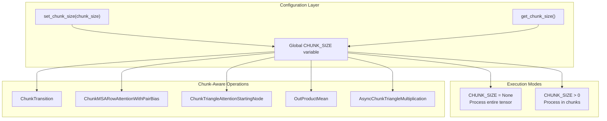
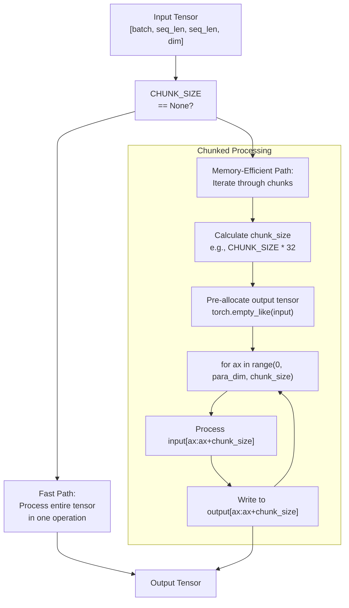
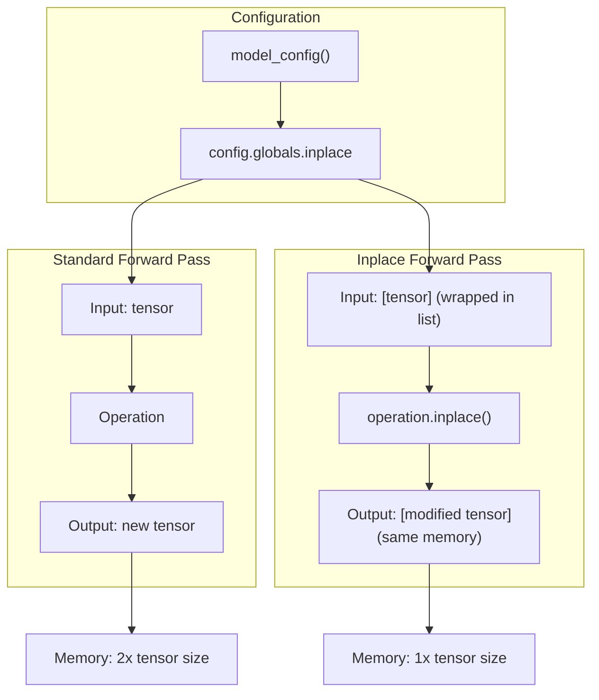
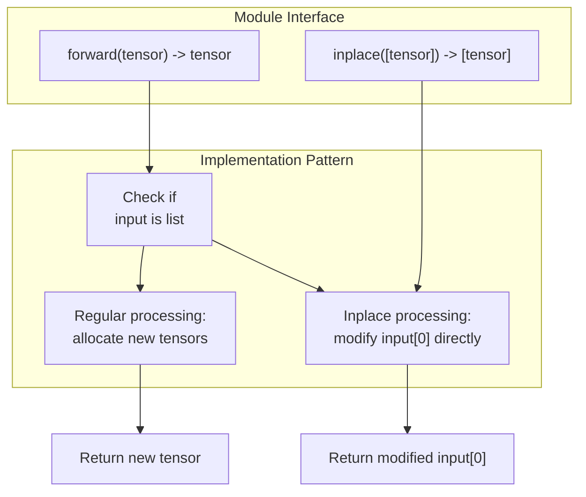
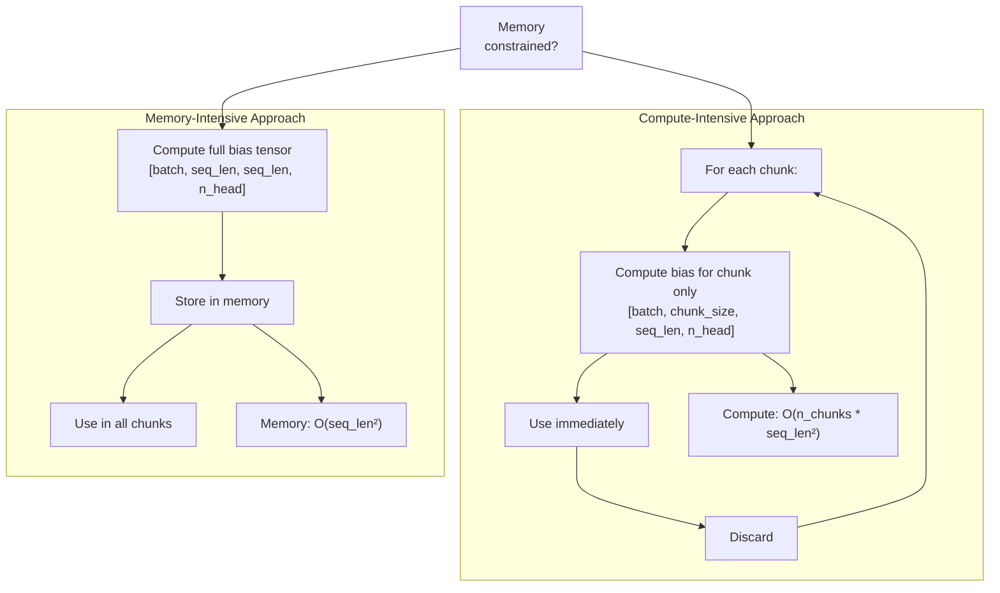
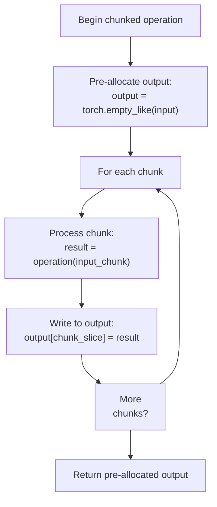
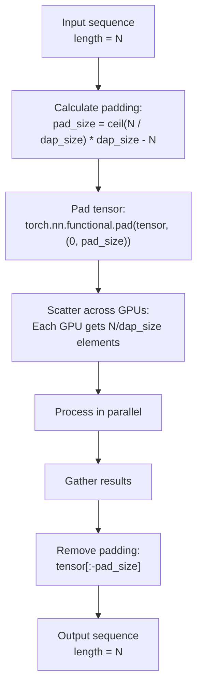
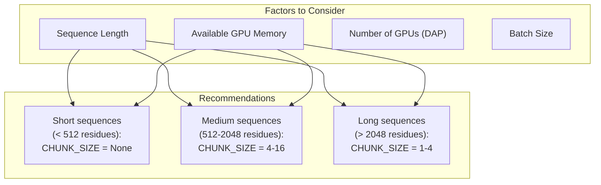

# Memory Optimization Techniques

> **Relevant source files**
> * [fastfold/data/data_modules.py](https://github.com/hpcaitech/FastFold/blob/eba49680/fastfold/data/data_modules.py)
> * [fastfold/model/fastnn/__init__.py](https://github.com/hpcaitech/FastFold/blob/eba49680/fastfold/model/fastnn/__init__.py)
> * [fastfold/model/fastnn/msa.py](https://github.com/hpcaitech/FastFold/blob/eba49680/fastfold/model/fastnn/msa.py)
> * [fastfold/model/fastnn/ops.py](https://github.com/hpcaitech/FastFold/blob/eba49680/fastfold/model/fastnn/ops.py)
> * [fastfold/utils/tensor_utils.py](https://github.com/hpcaitech/FastFold/blob/eba49680/fastfold/utils/tensor_utils.py)
> * [fastfold/utils/test_utils.py](https://github.com/hpcaitech/FastFold/blob/eba49680/fastfold/utils/test_utils.py)
> * [tests/test_train.py](https://github.com/hpcaitech/FastFold/blob/eba49680/tests/test_train.py)
> * [train.py](https://github.com/hpcaitech/FastFold/blob/eba49680/train.py)

## Purpose and Scope

This page documents FastFold's memory optimization strategies for reducing GPU memory consumption during training and inference. These techniques enable processing of longer protein sequences and larger batch sizes by controlling peak memory usage through chunking, inplace operations, and strategic recomputation.

For distributed memory optimization across multiple GPUs, see [Dynamic Axial Parallelism](/hpcaitech/FastFold/8.1-dynamic-axial-parallelism-(dap)). For optimized kernel implementations that reduce memory bandwidth, see [Optimized Kernels](/hpcaitech/FastFold/8.3-optimized-kernels).

---

## Overview

FastFold implements a multi-layered memory optimization strategy:

| **Technique** | **Mechanism** | **Memory Reduction** | **Compute Overhead** |
| --- | --- | --- | --- |
| **Chunking** | Process tensors in smaller chunks | 50-80% reduction in peak memory | 5-15% slowdown |
| **Inplace Operations** | Update tensors without allocations | 20-40% reduction | Minimal (<5%) |
| **Recomputation** | Recompute instead of store intermediates | Variable, depends on config | 10-30% slowdown |
| **Strategic Allocation** | Pre-allocate and reuse buffers | 10-20% reduction | Negligible |

The primary control mechanism is the global `CHUNK_SIZE` parameter, which determines the granularity of chunked operations throughout the model.

**Sources:** [fastfold/model/fastnn/ops.py L31-L42](https://github.com/hpcaitech/FastFold/blob/eba49680/fastfold/model/fastnn/ops.py#L31-L42)

---

## Chunking Mechanism

### Global Chunk Size Configuration

FastFold uses a global `CHUNK_SIZE` variable to control memory-compute tradeoffs across all chunk-aware operations:



**Global Chunk Size API**

The chunk size is managed through two simple functions:

* **[fastfold/model/fastnn/ops.py L35-L37](https://github.com/hpcaitech/FastFold/blob/eba49680/fastfold/model/fastnn/ops.py#L35-L37)**: `set_chunk_size(chunk_size)` - Sets global chunk size
* **[fastfold/model/fastnn/ops.py L40-L42](https://github.com/hpcaitech/FastFold/blob/eba49680/fastfold/model/fastnn/ops.py#L40-L42)**: `get_chunk_size()` - Retrieves current chunk size
* **[fastfold/model/fastnn/ops.py L31](https://github.com/hpcaitech/FastFold/blob/eba49680/fastfold/model/fastnn/ops.py#L31-L31)**: `CHUNK_SIZE` - Global variable, `None` disables chunking

**Sources:** [fastfold/model/fastnn/ops.py L31-L42](https://github.com/hpcaitech/FastFold/blob/eba49680/fastfold/model/fastnn/ops.py#L31-L42)

 [fastfold/model/fastnn/__init__.py L2](https://github.com/hpcaitech/FastFold/blob/eba49680/fastfold/model/fastnn/__init__.py#L2-L2)

### Chunk-Aware Operation Pattern

All chunk-aware operations follow a consistent pattern: check `CHUNK_SIZE`, then either process the entire tensor (fast path) or iterate through chunks (memory-efficient path).



**Example: ChunkTransition**

[fastfold/model/fastnn/ops.py L85-L108](https://github.com/hpcaitech/FastFold/blob/eba49680/fastfold/model/fastnn/ops.py#L85-L108)

 demonstrates the chunking pattern:

```python
def forward(self, src):    if CHUNK_SIZE == None:        # Fast path: process entire tensor        out = self.norm(src)        out = self.linear2(F.relu(self.linear1(out)))    else:        # Memory-efficient path: process in chunks        chunk_size = CHUNK_SIZE * 48        para_dim = src.shape[1]        out = torch.empty_like(src)        for ax in range(0, para_dim, chunk_size):            x = self.norm(src[:, ax:ax + chunk_size, :, :])            x = self.linear2(F.relu(self.linear1(x)))            out[:, ax:ax + chunk_size, :, :] = x    out.add_(src)  # Inplace residual addition    return out
```

The chunk dimension is typically scaled by a factor (32, 48, etc.) to balance memory and compute efficiency. Different operations use different scaling factors based on their memory footprint.

**Sources:** [fastfold/model/fastnn/ops.py L85-L124](https://github.com/hpcaitech/FastFold/blob/eba49680/fastfold/model/fastnn/ops.py#L85-L124)

### Chunk Size Scaling Factors

Different operations use different chunk size scaling factors based on their computational and memory characteristics:

| **Operation** | **Scaling Factor** | **File Reference** | **Rationale** |
| --- | --- | --- | --- |
| `ChunkTransition` | 48 | [ops.py L98](https://github.com/hpcaitech/FastFold/blob/eba49680/ops.py#L98-L98) | Large MLPs, high memory footprint |
| `OutProductMean` | 32 (inplace mode) | [ops.py L185-L197](https://github.com/hpcaitech/FastFold/blob/eba49680/ops.py#L185-L197) | Outer product creates large intermediate |
| `AsyncChunkTriangleMultiplication` | 32 | [ops.py L415-L544](https://github.com/hpcaitech/FastFold/blob/eba49680/ops.py#L415-L544) | Triangle updates with distributed comm |
| `ChunkMSARowAttentionWithPairBias` | Not scaled (raw CHUNK_SIZE) | [ops.py L791](https://github.com/hpcaitech/FastFold/blob/eba49680/ops.py#L791-L791) | Attention has own memory management |
| `ChunkTriangleAttentionStartingNode` | Not scaled (raw CHUNK_SIZE) | [ops.py L672](https://github.com/hpcaitech/FastFold/blob/eba49680/ops.py#L672-L672) | Similar to MSA attention |

**Sources:** [fastfold/model/fastnn/ops.py L98](https://github.com/hpcaitech/FastFold/blob/eba49680/fastfold/model/fastnn/ops.py#L98-L98)

 [fastfold/model/fastnn/ops.py L185](https://github.com/hpcaitech/FastFold/blob/eba49680/fastfold/model/fastnn/ops.py#L185-L185)

 [fastfold/model/fastnn/ops.py L415](https://github.com/hpcaitech/FastFold/blob/eba49680/fastfold/model/fastnn/ops.py#L415-L415)

### Chunk-Aware Operations Catalog

```mermaid
flowchart TD

ChunkMSAAttn["ChunkMSARowAttentionWithPairBias<br>ops.py:751-948"]
ChunkMSACol["ChunkMSAColumnGlobalAttention<br>ops.py:950-1072"]
ChunkTriAttn["ChunkTriangleAttentionStartingNode<br>ops.py:633-748"]
AsyncTriOut["AsyncChunkTriangleMultiplicationOutgoing<br>ops.py:372-498"]
AsyncTriIn["AsyncChunkTriangleMultiplicationIncoming<br>ops.py:501-630"]
OutProd["OutProductMean<br>ops.py:126-228"]
OutProdInplace["OutProductMean.inplace<br>ops.py:175-227"]
ChunkTrans["ChunkTransition<br>ops.py:85-124"]
SelfAttn["SelfAttention (chunked mode)<br>ops.py:326-361"]
CHUNK_SIZE["Global CHUNK_SIZE"]

CHUNK_SIZE --> ChunkMSAAttn
CHUNK_SIZE --> ChunkMSACol
CHUNK_SIZE --> ChunkTriAttn
CHUNK_SIZE --> AsyncTriOut
CHUNK_SIZE --> AsyncTriIn
CHUNK_SIZE --> OutProd
CHUNK_SIZE --> OutProdInplace
CHUNK_SIZE --> ChunkTrans
CHUNK_SIZE --> SelfAttn

subgraph Utilities ["Utilities"]
    ChunkTrans
    SelfAttn
end

subgraph Communication ["Communication"]
    OutProd
    OutProdInplace
end

subgraph subGraph1 ["Pair Operations"]
    ChunkTriAttn
    AsyncTriOut
    AsyncTriIn
end

subgraph subGraph0 ["MSA Operations"]
    ChunkMSAAttn
    ChunkMSACol
end
```



Each operation implements both fast and chunked paths. The chunked path typically:

1. Calculates `chunk_size = CHUNK_SIZE * scaling_factor`
2. Pre-allocates output with `torch.empty_like()`
3. Iterates through dimension in chunks
4. Processes each chunk independently
5. Writes results to pre-allocated output

**Sources:** [fastfold/model/fastnn/ops.py L85-L1072](https://github.com/hpcaitech/FastFold/blob/eba49680/fastfold/model/fastnn/ops.py#L85-L1072)

### Generic Chunking Utility

For operations not specifically optimized with chunking, FastFold provides a generic `chunk_layer` utility:

[fastfold/utils/tensor_utils.py L298-L415](https://github.com/hpcaitech/FastFold/blob/eba49680/fastfold/utils/tensor_utils.py#L298-L415)

 implements algorithmic chunking as described in AlphaFold section 1.11.8:

```python
def chunk_layer(    layer: Callable,    inputs: Dict[str, Any],    chunk_size: int,    no_batch_dims: int,    low_mem: bool = False,) -> Any:    """    Chunks layer execution across batch dimensions to reduce peak memory.        Args:        layer: Function to apply chunk-wise        inputs: Dictionary of input tensors        chunk_size: Number of sub-batches per chunk        no_batch_dims: How many initial dims are batch dims        low_mem: Avoid flattening large tensors (slower but more memory efficient)    """
```

The function:

1. Flattens batch dimensions: `(B1, B2, ..., Bn, Features) → (B1*B2*...*Bn, Features)`
2. Processes in chunks of `chunk_size` along flattened dimension
3. Reassembles outputs into original batch shape

**Key Features:**

* **Low-memory mode** [line 326](https://github.com/hpcaitech/FastFold/blob/eba49680/line 326) : Uses `_chunk_slice()` to avoid full tensor flattening
* **Smart allocation** [line 384](https://github.com/hpcaitech/FastFold/blob/eba49680/line 384) : Allocates output only after first chunk completes
* **Shape preservation**: Automatically restores original batch dimensions

**Sources:** [fastfold/utils/tensor_utils.py L298-L415](https://github.com/hpcaitech/FastFold/blob/eba49680/fastfold/utils/tensor_utils.py#L298-L415)

---

## Inplace Operations

### Inplace Execution Mode

FastFold supports an "inplace" execution mode where tensors are updated in-place rather than creating new allocations. This is controlled by the `config.globals.inplace` flag.



**Configuration Example:**

[train.py L172](https://github.com/hpcaitech/FastFold/blob/eba49680/train.py#L172-L172)

 shows inplace mode being disabled for training:

```markdown
config = model_config(args.config_preset, train=True)config.globals.inplace = False  # Standard mode for training
```

Inplace mode is typically used during inference when gradients are not needed and maximum memory efficiency is desired.

**Sources:** [train.py L171-L172](https://github.com/hpcaitech/FastFold/blob/eba49680/train.py#L171-L172)

### Inplace Method Pattern

Operations that support inplace execution implement a separate `.inplace()` method alongside the standard `.forward()` method:



**Example: ChunkTransition.inplace()**

[fastfold/model/fastnn/ops.py L110-L123](https://github.com/hpcaitech/FastFold/blob/eba49680/fastfold/model/fastnn/ops.py#L110-L123)

 demonstrates the inplace pattern:

```python
def inplace(self, src):    """Inplace version wraps input in list: src = [tensor]"""    para_dim = src[0].shape[1]    chunk_size = CHUNK_SIZE * 48 if CHUNK_SIZE else para_dim        for ax in range(0, para_dim, chunk_size):        x = self.norm(src[0][:, ax:ax + chunk_size, :, :])        x = self.linear2(F.relu(self.linear1(x)))        # Inplace update instead of allocating new tensor        src[0][:, ax:ax + chunk_size, :, :] += x    return src
```

Key differences from regular forward:

* Input wrapped in list: `src[0]` instead of `src`
* Direct assignment: `src[0][...] += x` instead of `out[...] = x`
* No output allocation: modifies input buffer directly

**Sources:** [fastfold/model/fastnn/ops.py L110-L123](https://github.com/hpcaitech/FastFold/blob/eba49680/fastfold/model/fastnn/ops.py#L110-L123)

### Inplace Operations Catalog

| **Module** | **Regular Forward** | **Inplace Method** | **Memory Savings** |
| --- | --- | --- | --- |
| `ChunkTransition` | [ops.py L93-L108](https://github.com/hpcaitech/FastFold/blob/eba49680/ops.py#L93-L108) | [ops.py L110-L123](https://github.com/hpcaitech/FastFold/blob/eba49680/ops.py#L110-L123) | 1x hidden dim tensor |
| `OutProductMean` | [ops.py L141-L173](https://github.com/hpcaitech/FastFold/blob/eba49680/ops.py#L141-L173) | [ops.py L175-L227](https://github.com/hpcaitech/FastFold/blob/eba49680/ops.py#L175-L227) | 1x pair representation |
| `ChunkTriangleAttentionStartingNode` | [ops.py L657-L701](https://github.com/hpcaitech/FastFold/blob/eba49680/ops.py#L657-L701) | [ops.py L703-L748](https://github.com/hpcaitech/FastFold/blob/eba49680/ops.py#L703-L748) | 1x pair tensor |
| `ChunkMSARowAttentionWithPairBias` | [ops.py L777-L821](https://github.com/hpcaitech/FastFold/blob/eba49680/ops.py#L777-L821) | [ops.py L823-L948](https://github.com/hpcaitech/FastFold/blob/eba49680/ops.py#L823-L948) | 1x MSA tensor |
| `ExtraMSACore` | [ops.py L165-L175](https://github.com/hpcaitech/FastFold/blob/eba49680/ops.py in msa.py#L165-L175) | [ops.py L177-L187](https://github.com/hpcaitech/FastFold/blob/eba49680/ops.py in msa.py#L177-L187) | Multiple MSA intermediates |
| `ExtraMSABlock` | [msa.py L204-L271](https://github.com/hpcaitech/FastFold/blob/eba49680/msa.py#L204-L271) | [msa.py L273-L344](https://github.com/hpcaitech/FastFold/blob/eba49680/msa.py#L273-L344) | Full block intermediates |

**Sources:** [fastfold/model/fastnn/ops.py](https://github.com/hpcaitech/FastFold/blob/eba49680/fastfold/model/fastnn/ops.py)

 [fastfold/model/fastnn/msa.py](https://github.com/hpcaitech/FastFold/blob/eba49680/fastfold/model/fastnn/msa.py)

### List-Wrapping Convention

Inplace methods use list-wrapping to signal mutable intent:

```sql
# Standard mode: create new tensorsz = operation.forward(z_input)  # z_input unchanged # Inplace mode: modify existing tensorz = operation.inplace([z_input])  # z_input[0] modified in-place
```

This convention:

* Prevents accidental aliasing bugs
* Makes mutation explicit in the API
* Allows mixed inplace/standard operations in same call stack

**Important:** The outer list `[tensor]` is not the actual modification target. Operations modify `input[0]` directly, creating no new allocations. The list itself is just a wrapper indicating inplace intent.

**Sources:** [fastfold/model/fastnn/ops.py L110](https://github.com/hpcaitech/FastFold/blob/eba49680/fastfold/model/fastnn/ops.py#L110-L110)

 [fastfold/model/fastnn/msa.py L177](https://github.com/hpcaitech/FastFold/blob/eba49680/fastfold/model/fastnn/msa.py#L177-L177)

---

## Memory-Compute Tradeoffs

### Recomputation Strategy

FastFold employs selective recomputation to reduce memory usage at the cost of additional computation. The canonical example is bias computation in attention mechanisms.



**Example: ChunkMSARowAttentionWithPairBias**

[fastfold/model/fastnn/ops.py L791-L819](https://github.com/hpcaitech/FastFold/blob/eba49680/fastfold/model/fastnn/ops.py#L791-L819)

 demonstrates recomputation strategy:

```markdown
# Phase 1: Compute small bias tensor in chunksb = torch.empty((Z.shape[0], Z.shape[1], Z.shape[2], self.n_head), ...)for i in range(0, para_dim_z, chunk_size):    z = self.layernormZ(Z[:, i:i + chunk_size, :, :])    b[:, i:i + chunk_size, :, :] = F.linear(z, self.linear_b_weights) # Gather and broadcast bias (small tensor, affordable to store)b, work = gather_async(b, dim=1)b = gather_async_opp(b, work, dim=1)b = rearrange(b, 'b q k h -> b h q k') # Phase 2: Process MSA in chunks, recomputing layernorm each timefor i in range(0, para_dim_m, chunk_size):    # Recompute: cheaper than storing large normalized MSA    m = self.layernormM(M_raw[:, i:i + chunk_size, :, :])    m_mask = M_mask[:, i:i + chunk_size, :]        # Use pre-computed bias (stored because it's small)    m = self.attention(m, m_mask, (b, -1))
```

**Tradeoff Analysis:**

* **Stored:** Bias tensor (small: `[batch, seq_len, seq_len, n_head]`)
* **Recomputed:** LayerNorm on MSA (large tensor, but cheap operation)
* **Savings:** Avoid storing full normalized MSA (`[batch, n_msa, seq_len, dim]`)

**Sources:** [fastfold/model/fastnn/ops.py L791-L819](https://github.com/hpcaitech/FastFold/blob/eba49680/fastfold/model/fastnn/ops.py#L791-L819)

### Activation Checkpointing Pattern

While not explicitly implemented in the chunking code, FastFold's design supports PyTorch's gradient checkpointing. The commented-out code in [fastfold/model/fastnn/msa.py L395-L410](https://github.com/hpcaitech/FastFold/blob/eba49680/fastfold/model/fastnn/msa.py#L395-L410)

 shows the intended pattern:

```rust
# checkpoint_fn = get_checkpoint_fn()# blocks = [partial(b, msa_mask=msa_mask, ...) for b in self.blocks]# # for b in blocks:#     if(torch.is_grad_enabled()):#         m, z = checkpoint_fn(b, *(m, z))  # Recompute forward during backward#     else:#         m, z = b(m, z)
```

This allows trading compute for memory during backpropagation by recomputing forward passes instead of storing all intermediate activations.

**Sources:** [fastfold/model/fastnn/msa.py L395-L410](https://github.com/hpcaitech/FastFold/blob/eba49680/fastfold/model/fastnn/msa.py#L395-L410)

---

## Strategic Tensor Allocation

### Pre-allocation Pattern

FastFold pre-allocates output tensors to avoid repeated allocations during chunked processing:



**Example: AsyncChunkTriangleMultiplicationOutgoing**

[fastfold/model/fastnn/ops.py L414-L418](https://github.com/hpcaitech/FastFold/blob/eba49680/fastfold/model/fastnn/ops.py#L414-L418)

 shows pre-allocation:

```markdown
para_dim = Z_raw.shape[1]chunk_size = CHUNK_SIZE * 32output = torch.empty_like(Z_raw)  # Pre-allocate entire output for i in range(0, para_dim, chunk_size):    # Process chunk and write to pre-allocated buffer    # ...    output[:, i:i + chunk_size, :, :] = z
```

**Benefits:**

* Single allocation instead of N allocations
* Contiguous memory layout
* No concatenation overhead

**Sources:** [fastfold/model/fastnn/ops.py L414-L498](https://github.com/hpcaitech/FastFold/blob/eba49680/fastfold/model/fastnn/ops.py#L414-L498)

### Temporary Buffer Management

For operations requiring temporary buffers, FastFold allocates exactly-sized tensors rather than over-allocating:

[fastfold/model/fastnn/ops.py L675-L678](https://github.com/hpcaitech/FastFold/blob/eba49680/fastfold/model/fastnn/ops.py#L675-L678)

 demonstrates precise allocation:

```markdown
# Allocate temporary buffer for small intermediate (bias)b = torch.empty(    (Z_raw.shape[0], Z_raw.shape[1], Z_raw.shape[2], self.n_head),    device=Z_raw.device,    dtype=Z_raw.dtype)
```

This avoids wasting memory on unnecessarily large buffers.

**Sources:** [fastfold/model/fastnn/ops.py L675-L678](https://github.com/hpcaitech/FastFold/blob/eba49680/fastfold/model/fastnn/ops.py#L675-L678)

### Cache Clearing

[fastfold/model/fastnn/msa.py L415-L416](https://github.com/hpcaitech/FastFold/blob/eba49680/fastfold/model/fastnn/msa.py#L415-L416)

 shows explicit cache clearing between blocks:

```markdown
for b in self.blocks:    m, z = b(m, z, msa_mask, pair_mask, chunk_size=chunk_size)        if(self.clear_cache_between_blocks):        torch.cuda.empty_cache()  # Free unused memory
```

The `clear_cache_between_blocks` flag trades performance for memory by explicitly releasing cached allocations between major operations.

**Sources:** [fastfold/model/fastnn/msa.py L415-L416](https://github.com/hpcaitech/FastFold/blob/eba49680/fastfold/model/fastnn/msa.py#L415-L416)

---

## Padding for Distributed Execution

When using Dynamic Axial Parallelism (DAP), tensors are padded to be evenly divisible across GPUs:



**Example: ExtraMSABlock**

[fastfold/model/fastnn/msa.py L217-L233](https://github.com/hpcaitech/FastFold/blob/eba49680/fastfold/model/fastnn/msa.py#L217-L233)

 shows padding logic:

```markdown
dap_size = gpc.get_world_size(ParallelMode.TENSOR)seq_cnt = msa_mask.size(-2)seq_len = pair_mask.size(-1) # Calculate padding to make evenly divisibleseq_cnt_padding_size = (int(seq_cnt / dap_size) + 1) * dap_size - seq_cntseq_len_padding_size = (int(seq_len / dap_size) + 1) * dap_size - seq_len # Pad MSA and pair representationsm = torch.nn.functional.pad(    m, (0, 0, 0, seq_len_padding_size, 0, seq_cnt_padding_size))z = torch.nn.functional.pad(    z, (0, 0, 0, seq_len_padding_size, 0, seq_len_padding_size))
```

After processing, padding is removed [msa.py L265-L266](https://github.com/hpcaitech/FastFold/blob/eba49680/msa.py#L265-L266)

:

```
m = m[:, :-seq_cnt_padding_size, :-seq_len_padding_size, :]z = z[:, :-seq_len_padding_size, :-seq_len_padding_size, :]
```

This ensures load balancing across GPUs while maintaining correct sequence lengths.

**Sources:** [fastfold/model/fastnn/msa.py L217-L266](https://github.com/hpcaitech/FastFold/blob/eba49680/fastfold/model/fastnn/msa.py#L217-L266)

---

## Best Practices

### Chunk Size Selection

Choosing an appropriate `CHUNK_SIZE` requires balancing memory and performance:



**Guidelines:**

* **`CHUNK_SIZE = None`**: Maximum performance, requires sufficient memory
* **`CHUNK_SIZE = 16`**: Good balance for most use cases
* **`CHUNK_SIZE = 4`**: High memory efficiency for long sequences
* **`CHUNK_SIZE = 1`**: Maximum memory efficiency, significant compute overhead

**Testing:** Use [tests/test_train.py](https://github.com/hpcaitech/FastFold/blob/eba49680/tests/test_train.py)

 to verify memory usage with different chunk sizes.

**Sources:** [fastfold/model/fastnn/ops.py L35-L37](https://github.com/hpcaitech/FastFold/blob/eba49680/fastfold/model/fastnn/ops.py#L35-L37)

### Inplace Mode Usage

| **Use Case** | **Inplace Setting** | **Rationale** |
| --- | --- | --- |
| Training | `config.globals.inplace = False` | Need gradients, automatic differentiation |
| Inference (small models) | `config.globals.inplace = False` | Performance overhead not worth savings |
| Inference (large models) | `config.globals.inplace = True` | Maximize throughput, no gradients needed |
| Inference (memory-constrained) | `config.globals.inplace = True` | Essential for fitting in memory |

**Configuration:**

```markdown
config = model_config(preset, train=False)config.globals.inplace = True  # Enable for inference
```

**Sources:** [train.py L171-L172](https://github.com/hpcaitech/FastFold/blob/eba49680/train.py#L171-L172)

### Memory Profiling

To monitor memory usage during execution:

```javascript
import torch # Before operationtorch.cuda.reset_peak_memory_stats() # Run operationoutput = model(batch) # Check peak memorypeak_memory = torch.cuda.max_memory_allocated() / (1024**3)  # GBprint(f"Peak memory: {peak_memory:.2f} GB")
```

Use this to empirically determine optimal chunk sizes for your hardware and sequence lengths.

**Sources:** [fastfold/utils/test_utils.py](https://github.com/hpcaitech/FastFold/blob/eba49680/fastfold/utils/test_utils.py)

### Combining Optimizations

For maximum memory efficiency, combine multiple techniques:

```javascript
from fastfold.model.fastnn import set_chunk_sizefrom fastfold.config import model_config # Configure modelconfig = model_config('model_1', train=False)config.globals.inplace = True  # Enable inplace operations model = AlphaFold(config)model = inject_fastnn(model)  # Use optimized implementations # Set chunk size based on sequence lengthseq_len = batch['aatype'].shape[-1]if seq_len > 2048:    set_chunk_size(4)  # Aggressive chunking for long sequenceselif seq_len > 512:    set_chunk_size(16)  # Moderate chunkingelse:    set_chunk_size(None)  # No chunking for short sequences # Enable cache clearing for very long sequencesconfig.model.extra_msa.clear_cache_between_blocks = (seq_len > 3000)
```

**Sources:** [fastfold/model/fastnn/ops.py](https://github.com/hpcaitech/FastFold/blob/eba49680/fastfold/model/fastnn/ops.py)

 [train.py L171-L174](https://github.com/hpcaitech/FastFold/blob/eba49680/train.py#L171-L174)

 [fastfold/model/fastnn/msa.py L362](https://github.com/hpcaitech/FastFold/blob/eba49680/fastfold/model/fastnn/msa.py#L362-L362)