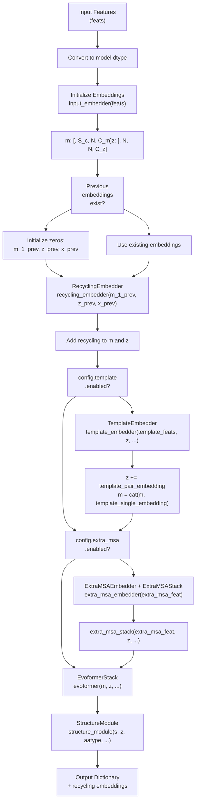
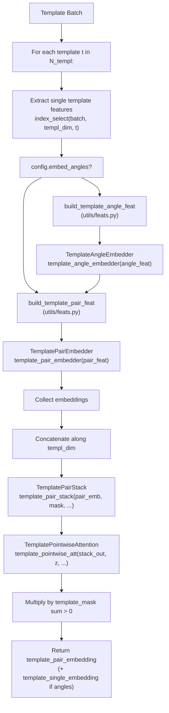
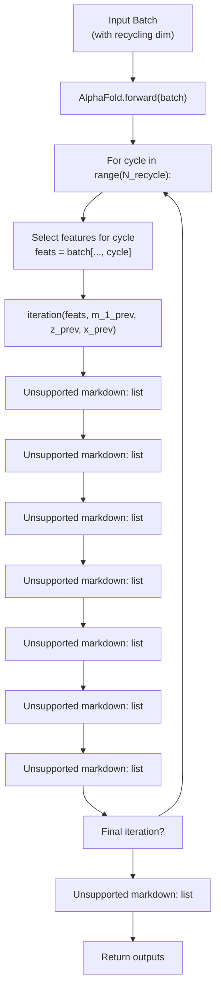

# Model API

> **Relevant source files**
> * [fastfold/model/hub/alphafold.py](https://github.com/hpcaitech/FastFold/blob/eba49680/fastfold/model/hub/alphafold.py)
> * [fastfold/model/nn/embedders.py](https://github.com/hpcaitech/FastFold/blob/eba49680/fastfold/model/nn/embedders.py)
> * [fastfold/model/nn/template.py](https://github.com/hpcaitech/FastFold/blob/eba49680/fastfold/model/nn/template.py)

This page provides comprehensive API reference documentation for the core AlphaFold model classes in FastFold. It covers the main `AlphaFold` model class, input embedders, recycling mechanisms, template processing components, and auxiliary prediction heads.

For data processing and feature generation, see [Data Pipeline API](/hpcaitech/FastFold/11.2-data-pipeline-api). For optimized kernel implementations, see [FastNN Kernel API](/hpcaitech/FastFold/11.3-fastnn-kernel-api). For distributed training primitives, see [Distributed API](/hpcaitech/FastFold/11.4-distributed-api).

---

## Overview

The FastFold model implementation follows the AlphaFold2 architecture described in Algorithm 2 of the original paper. The core components are:

* **AlphaFold**: Main model class orchestrating the prediction pipeline
* **Embedders**: Convert raw features into learned representations
* **Evoformer**: Trunk network for MSA and pair representation refinement
* **Structure Module**: Predicts 3D atomic coordinates from learned representations
* **Auxiliary Heads**: Predict secondary outputs (pLDDT, PAE, etc.)

```mermaid
flowchart TD

AlphaFold["AlphaFold<br>(hub/alphafold.py)"]
InputEmb["InputEmbedder<br>(nn/embedders.py)"]
InputEmbMultimer["InputEmbedderMultimer<br>(nn/embedders_multimer.py)"]
RecycEmb["RecyclingEmbedder<br>(nn/embedders.py)"]
TemplEmb["TemplateEmbedder<br>(nn/embedders.py)"]
TemplEmbMultimer["TemplateEmbedderMultimer<br>(nn/embedders_multimer.py)"]
ExtraEmb["ExtraMSAEmbedder<br>(nn/embedders.py)"]
Evoformer["EvoformerStack<br>(nn/evoformer.py)"]
ExtraMSA["ExtraMSAStack<br>(nn/evoformer.py)"]
StructMod["StructureModule<br>(nn/structure_module.py)"]
AuxHeads["AuxiliaryHeads<br>(nn/heads.py)"]

AlphaFold --> InputEmb
AlphaFold --> InputEmbMultimer
AlphaFold --> RecycEmb
AlphaFold --> TemplEmb
AlphaFold --> TemplEmbMultimer
AlphaFold --> ExtraEmb
AlphaFold --> Evoformer
AlphaFold --> ExtraMSA
AlphaFold --> StructMod
AlphaFold --> AuxHeads

subgraph subGraph3 ["Output Heads"]
    AuxHeads
end

subgraph subGraph2 ["Core Processing"]
    Evoformer
    ExtraMSA
    StructMod
end

subgraph subGraph1 ["Input Embedders"]
    InputEmb
    InputEmbMultimer
    RecycEmb
    TemplEmb
    TemplEmbMultimer
    ExtraEmb
end

subgraph subGraph0 ["Main Model Class"]
    AlphaFold
end
```



**Sources:** [fastfold/model/hub/alphafold.py L46-L105](https://github.com/hpcaitech/FastFold/blob/eba49680/fastfold/model/hub/alphafold.py#L46-L105)

---

## AlphaFold Model Class

The `AlphaFold` class is the top-level model class implementing Algorithm 2 with recycling iterations.

### Constructor

```
AlphaFold(config)
```

| Parameter | Type | Description |
| --- | --- | --- |
| `config` | ConfigDict | Configuration object from `config.py` containing `globals` and `model` sections |

The constructor initializes all sub-modules based on the `globals.is_multimer` flag:

* **Monomer mode**: Uses `InputEmbedder`, `TemplateEmbedder`
* **Multimer mode**: Uses `InputEmbedderMultimer`, `TemplateEmbedderMultimer`

**Initialized Modules:**

| Attribute | Class | Purpose |
| --- | --- | --- |
| `input_embedder` | `InputEmbedder` / `InputEmbedderMultimer` | Embeds target, MSA, and residue index features |
| `recycling_embedder` | `RecyclingEmbedder` | Embeds previous iteration outputs for recycling |
| `template_embedder` | `TemplateEmbedder` / `TemplateEmbedderMultimer` | Processes template structures |
| `extra_msa_embedder` | `ExtraMSAEmbedder` | Embeds unclustered MSA sequences |
| `extra_msa_stack` | `ExtraMSAStack` | Processes extra MSA features |
| `evoformer` | `EvoformerStack` | Main trunk network |
| `structure_module` | `StructureModule` | Predicts 3D structure |
| `aux_heads` | `AuxiliaryHeads` | Computes auxiliary predictions |

**Sources:** [fastfold/model/hub/alphafold.py L46-L105](https://github.com/hpcaitech/FastFold/blob/eba49680/fastfold/model/hub/alphafold.py#L46-L105)

### Forward Method

```
forward(batch: Dict[str, torch.Tensor]) -> Dict[str, torch.Tensor]
```

Main entry point for model inference and training.

**Input Features (batch dictionary):**

| Key | Shape | Description |
| --- | --- | --- |
| `aatype` | `[*, N_res, N_recycle]` | Residue type indices (0-20) |
| `target_feat` | `[*, N_res, C_tf, N_recycle]` | One-hot target sequence |
| `residue_index` | `[*, N_res, N_recycle]` | Consecutive residue indices |
| `msa_feat` | `[*, N_seq, N_res, C_msa, N_recycle]` | MSA features |
| `seq_mask` | `[*, N_res, N_recycle]` | Sequence mask |
| `msa_mask` | `[*, N_seq, N_res, N_recycle]` | MSA mask |
| `extra_msa_mask` | `[*, N_extra, N_res, N_recycle]` | Extra MSA mask |
| `template_mask` | `[*, N_templ, N_recycle]` | Template-level mask |
| `template_aatype` | `[*, N_templ, N_res, N_recycle]` | Template residue types |
| `template_all_atom_positions` | `[*, N_templ, N_res, 37, 3, N_recycle]` | Template atom coordinates |
| `template_all_atom_mask` | `[*, N_templ, N_res, 37, N_recycle]` | Template atom masks |

**Note:** The final dimension of each input is the recycling dimension `N_recycle`.

**Output Dictionary:**

| Key | Shape | Description |
| --- | --- | --- |
| `msa` | `[*, N_seq, N_res, C_m]` | Final MSA representation |
| `pair` | `[*, N_res, N_res, C_z]` | Final pair representation |
| `single` | `[*, N_res, C_s]` | Final single representation |
| `sm` | Dict | Structure module outputs |
| `final_atom_positions` | `[*, N_res, 37, 3]` | Predicted atom37 coordinates |
| `final_atom_mask` | `[*, N_res, 37]` | Atom37 mask |
| `final_affine_tensor` | `[*, N_res, 7]` | Final backbone frames |
| Additional keys from `aux_heads` | Various | pLDDT, PAE, etc. |

**Recycling Loop Behavior:**

* Runs `N_recycle` iterations
* Only the final iteration has gradients enabled during training
* Activation checkpointing is disabled for early iterations, enabled for the final iteration
* Each iteration calls `self.iteration()` with features from that recycling step

**Sources:** [fastfold/model/hub/alphafold.py L444-L534](https://github.com/hpcaitech/FastFold/blob/eba49680/fastfold/model/hub/alphafold.py#L444-L534)

---

### Iteration Method

```
iteration(feats, m_1_prev, z_prev, x_prev, _recycle=True)     -> Tuple[Dict, torch.Tensor, torch.Tensor, torch.Tensor]
```

Executes a single iteration of the model (one pass through the network).

**Parameters:**

| Parameter | Type | Shape | Description |
| --- | --- | --- | --- |
| `feats` | Dict | Various | Features for current iteration (no recycling dim) |
| `m_1_prev` | Tensor | `[*, N_res, C_m]` | Previous MSA row embedding (or None) |
| `z_prev` | Tensor | `[*, N_res, N_res, C_z]` | Previous pair embedding (or None) |
| `x_prev` | Tensor | `[*, N_res, 37, 3]` | Previous atom positions (or None) |
| `_recycle` | bool | - | Whether to use recycling embeddings |

**Returns:**

| Return Value | Type | Shape | Description |
| --- | --- | --- | --- |
| `outputs` | Dict | Various | Model outputs for this iteration |
| `m_1_prev` | Tensor | `[*, N_res, C_m]` | Updated MSA row for next iteration |
| `z_prev` | Tensor | `[*, N_res, N_res, C_z]` | Updated pair embedding for next iteration |
| `x_prev` | Tensor | `[*, N_res, 37, 3]` | Updated atom positions for next iteration |

**Processing Pipeline:**



**Sources:** [fastfold/model/hub/alphafold.py L173-L424](https://github.com/hpcaitech/FastFold/blob/eba49680/fastfold/model/hub/alphafold.py#L173-L424)

---

### Activation Checkpointing Control

The model provides methods to control gradient checkpointing for memory optimization:

**`_disable_activation_checkpointing()`**

Disables activation checkpointing by setting `blocks_per_ckpt = None` for:

* `template_embedder.template_pair_stack`
* `evoformer`
* `extra_msa_stack.blocks` (sets `ckpt = False`)

Used during early recycling iterations where gradients are not needed.

**`_enable_activation_checkpointing()`**

Restores checkpointing settings from config:

* `template_embedder.template_pair_stack.blocks_per_ckpt`
* `evoformer.blocks_per_ckpt`
* `extra_msa_stack.blocks[].ckpt`

Used during the final recycling iteration where gradients are computed.

**Sources:** [fastfold/model/hub/alphafold.py L426-L443](https://github.com/hpcaitech/FastFold/blob/eba49680/fastfold/model/hub/alphafold.py#L426-L443)

---

## Input Embedders

### InputEmbedder

Embeds target features, MSA features, and relative positional encodings for monomer predictions.

**Constructor:**

```
InputEmbedder(tf_dim, msa_dim, c_z, c_m, relpos_k)
```

| Parameter | Type | Description |
| --- | --- | --- |
| `tf_dim` | int | Target feature dimension (typically 21 or 22) |
| `msa_dim` | int | MSA feature dimension (typically 49) |
| `c_z` | int | Pair embedding dimension |
| `c_m` | int | MSA embedding dimension |
| `relpos_k` | int | Relative position encoding window size |

**Submodules:**

| Attribute | Description |
| --- | --- |
| `linear_tf_z_i` | Projects target features to pair embedding (i-axis) |
| `linear_tf_z_j` | Projects target features to pair embedding (j-axis) |
| `linear_tf_m` | Projects target features to MSA embedding |
| `linear_msa_m` | Projects MSA features to MSA embedding |
| `linear_relpos` | Projects relative position one-hot to pair embedding |

**Forward Method:**

```
forward(tf, ri, msa) -> Tuple[torch.Tensor, torch.Tensor]
```

| Parameter | Shape | Description |
| --- | --- | --- |
| `tf` | `[*, N_res, tf_dim]` | Target features (one-hot amino acid) |
| `ri` | `[*, N_res]` | Residue indices |
| `msa` | `[*, N_seq, N_res, msa_dim]` | MSA features |

| Return | Shape | Description |
| --- | --- | --- |
| `msa_emb` | `[*, N_seq, N_res, C_m]` | MSA embedding |
| `pair_emb` | `[*, N_res, N_res, C_z]` | Pair embedding |

**Relative Position Encoding (Algorithm 4):**

The `relpos()` method computes relative positional encodings:

```
d[i,j] = residue_index[i] - residue_index[j]
d_clipped = clip(d, -relpos_k, relpos_k)
d_onehot = one_hot(d_clipped, bins=[-relpos_k, ..., relpos_k])
relpos_emb = linear_relpos(d_onehot)
```

This creates a learnable bias based on sequence distance, with a clipping window of `±relpos_k`.

**Sources:** [fastfold/model/nn/embedders.py L35-L137](https://github.com/hpcaitech/FastFold/blob/eba49680/fastfold/model/nn/embedders.py#L35-L137)

---

### InputEmbedderMultimer

Multimer-specific input embedder with additional features for multi-chain assemblies. Located in `fastfold/model/nn/embedders_multimer.py`.

Key differences from monomer version:

* Processes `asym_id`, `sym_id`, `entity_id` features
* Includes chain-specific relative position encodings
* Handles cluster profile features differently

**Sources:** [fastfold/model/hub/alphafold.py L68-L70](https://github.com/hpcaitech/FastFold/blob/eba49680/fastfold/model/hub/alphafold.py#L68-L70)

 [fastfold/model/nn/embedders.py L35-L41](https://github.com/hpcaitech/FastFold/blob/eba49680/fastfold/model/nn/embedders.py#L35-L41)

---

## Recycling Embedder

### RecyclingEmbedder

Embeds outputs from the previous iteration for use in the current iteration (Algorithm 32).

**Constructor:**

```
RecyclingEmbedder(c_m, c_z, min_bin, max_bin, no_bins, inf=1e8)
```

| Parameter | Type | Description |
| --- | --- | --- |
| `c_m` | int | MSA channel dimension |
| `c_z` | int | Pair embedding channel dimension |
| `min_bin` | float | Minimum distance bin (Angstroms) |
| `max_bin` | float | Maximum distance bin (Angstroms) |
| `no_bins` | int | Number of distance bins |
| `inf` | float | Value representing infinity for binning |

**Forward Method:**

```
forward(m, z, x) -> Tuple[torch.Tensor, torch.Tensor]
```

| Parameter | Shape | Description |
| --- | --- | --- |
| `m` | `[*, N_res, C_m]` | First row of previous MSA embedding |
| `z` | `[*, N_res, N_res, C_z]` | Previous pair embedding |
| `x` | `[*, N_res, 3]` | Previous pseudo-beta coordinates |

| Return | Shape | Description |
| --- | --- | --- |
| `m_update` | `[*, N_res, C_m]` | MSA embedding update |
| `z_update` | `[*, N_res, N_res, C_z]` | Pair embedding update |

**Distance Binning Process:**

1. Compute pairwise squared distances: `d[i,j] = ||x[i] - x[j]||^2`
2. Bin into `no_bins` using boundaries `[min_bin^2, ..., max_bin^2, inf]`
3. One-hot encode binned distances
4. Project through linear layer and add to layer-normalized `z`

**Sources:** [fastfold/model/nn/embedders.py L140-L233](https://github.com/hpcaitech/FastFold/blob/eba49680/fastfold/model/nn/embedders.py#L140-L233)

---

## Template Embedders

### TemplateEmbedder

Processes template structures for monomer predictions. Orchestrates template angle and pair embeddings, followed by template pair stack and pointwise attention.

**Constructor:**

```
TemplateEmbedder(config)
```

The config dictionary should contain:

* `template_angle_embedder`: Config for `TemplateAngleEmbedder`
* `template_pair_embedder`: Config for `TemplatePairEmbedder`
* `template_pair_stack`: Config for `TemplatePairStack`
* `template_pointwise_attention`: Config for `TemplatePointwiseAttention`

**Forward Method:**

```
forward(batch, z, pair_mask, templ_dim, chunk_size, _mask_trans=True)    -> Dict[str, torch.Tensor]
```

| Parameter | Type | Description |
| --- | --- | --- |
| `batch` | Dict | Template features (keys start with `template_`) |
| `z` | Tensor `[*, N, N, C_z]` | Current pair embedding |
| `pair_mask` | Tensor `[*, N, N]` | Pair mask |
| `templ_dim` | int | Dimension index for templates |
| `chunk_size` | int | Chunk size for memory optimization |
| `_mask_trans` | bool | Whether to mask pair transition |

**Returns:**

| Key | Shape | Description |
| --- | --- | --- |
| `template_pair_embedding` | `[*, N, N, C_z]` | Template pair embedding to add to `z` |
| `template_single_embedding` | `[*, N_templ, N, C_m]` | Template angle embeddings (if `embed_angles=True`) |

**Processing Pipeline:**



**Sources:** [fastfold/model/nn/embedders.py L235-L324](https://github.com/hpcaitech/FastFold/blob/eba49680/fastfold/model/nn/embedders.py#L235-L324)

---

### TemplateAngleEmbedder

Embeds template torsion angle features (Algorithm 2, line 7).

**Constructor:**

```
TemplateAngleEmbedder(c_in, c_out)
```

| Parameter | Type | Description |
| --- | --- | --- |
| `c_in` | int | Template angle feature dimension |
| `c_out` | int | Output embedding dimension (typically `C_m`) |

**Architecture:**

```
linear_1 (c_in -> c_out, init='relu')
  -> ReLU
  -> linear_2 (c_out -> c_out, init='relu')
```

**Forward:**

```
forward(x) -> torch.Tensor
```

| Parameter | Shape | Description |
| --- | --- | --- |
| `x` | `[*, N_templ, N_res, c_in]` | Template angle features |

Returns: `[*, N_templ, N_res, c_out]` angle embeddings

**Sources:** [fastfold/model/nn/embedders.py L327-L367](https://github.com/hpcaitech/FastFold/blob/eba49680/fastfold/model/nn/embedders.py#L327-L367)

---

### TemplatePairEmbedder

Embeds template pair features (Algorithm 2, line 9).

**Constructor:**

```
TemplatePairEmbedder(c_in, c_out)
```

| Parameter | Type | Description |
| --- | --- | --- |
| `c_in` | int | Template pair feature dimension |
| `c_out` | int | Output embedding dimension (typically `C_t`) |

**Architecture:**

Single linear projection: `linear(c_in -> c_out, init='relu')`

**Forward:**

```
forward(x) -> torch.Tensor
```

| Parameter | Shape | Description |
| --- | --- | --- |
| `x` | `[*, C_in]` | Template pair features |

Returns: `[*, C_out]` pair embeddings

**Sources:** [fastfold/model/nn/embedders.py L370-L411](https://github.com/hpcaitech/FastFold/blob/eba49680/fastfold/model/nn/embedders.py#L370-L411)

---

### TemplateEmbedderMultimer

Multimer-specific template embedder with support for multi-chain templates. Located in `fastfold/model/nn/embedders_multimer.py`.

Differences from monomer version:

* Handles `multichain_mask_2d` for cross-chain template masking
* Different template feature construction
* Uses `template_mask` as `template_torsion_angles_mask`

**Sources:** [fastfold/model/hub/alphafold.py L71-L73](https://github.com/hpcaitech/FastFold/blob/eba49680/fastfold/model/hub/alphafold.py#L71-L73)

 [fastfold/model/hub/alphafold.py L267-L283](https://github.com/hpcaitech/FastFold/blob/eba49680/fastfold/model/hub/alphafold.py#L267-L283)

---

## Extra MSA Embedder

### ExtraMSAEmbedder

Embeds unclustered MSA sequences (Algorithm 2, line 15).

**Constructor:**

```
ExtraMSAEmbedder(c_in, c_out)
```

| Parameter | Type | Description |
| --- | --- | --- |
| `c_in` | int | Extra MSA feature dimension |
| `c_out` | int | Output embedding dimension (typically `C_e`) |

**Architecture:**

Single linear projection: `linear(c_in -> c_out)`

**Forward:**

```
forward(x) -> torch.Tensor
```

| Parameter | Shape | Description |
| --- | --- | --- |
| `x` | `[*, N_extra_seq, N_res, c_in]` | Extra MSA features |

Returns: `[*, N_extra_seq, N_res, c_out]` embeddings

**Usage in AlphaFold:**

```markdown
extra_msa_feat = build_extra_msa_feat(feats)  # or multimer versionextra_msa_feat = self.extra_msa_embedder(extra_msa_feat)z = self.extra_msa_stack(extra_msa_feat, z, ...)
```

**Sources:** [fastfold/model/nn/embedders.py L414-L451](https://github.com/hpcaitech/FastFold/blob/eba49680/fastfold/model/nn/embedders.py#L414-L451)

---

## Template Processing Components

### TemplatePairStack

Stack of blocks for processing template pair representations (Algorithm 16).

**Constructor:**

```
TemplatePairStack(c_t, c_hidden_tri_att, c_hidden_tri_mul, no_blocks,                   no_heads, pair_transition_n, dropout_rate, blocks_per_ckpt, inf=1e9)
```

| Parameter | Type | Description |
| --- | --- | --- |
| `c_t` | int | Template embedding channel dimension |
| `c_hidden_tri_att` | int | Hidden dimension for triangular attention |
| `c_hidden_tri_mul` | int | Hidden dimension for triangular multiplication |
| `no_blocks` | int | Number of blocks in stack |
| `no_heads` | int | Number of attention heads |
| `pair_transition_n` | int | Scale factor for pair transition hidden dim |
| `dropout_rate` | float | Dropout rate |
| `blocks_per_ckpt` | int | Blocks per activation checkpoint (None disables) |
| `inf` | float | Value for masked positions |

**Forward Method:**

```
forward(t, mask, chunk_size, _mask_trans=True) -> torch.Tensor
```

| Parameter | Shape | Description |
| --- | --- | --- |
| `t` | `[*, N_templ, N_res, N_res, C_t]` | Template embeddings |
| `mask` | `[*, N_templ, N_res, N_res]` | Template mask |
| `chunk_size` | int | Chunk size for operations |
| `_mask_trans` | bool | Mask pair transition |

Returns: `[*, N_templ, N_res, N_res, C_t]` processed template embeddings

**Block Architecture:**

Each `TemplatePairStackBlock` contains:

1. Triangle Attention Starting Node
2. Triangle Attention Ending Node
3. Triangle Multiplication Outgoing
4. Triangle Multiplication Incoming
5. Pair Transition

Operations are applied per-template (unbind along template dimension, process, concatenate).

**Sources:** [fastfold/model/nn/template.py L272-L363](https://github.com/hpcaitech/FastFold/blob/eba49680/fastfold/model/nn/template.py#L272-L363)

---

### TemplatePairStackBlock

Single block in the template pair stack.

**Components:**

| Module | Class | Purpose |
| --- | --- | --- |
| `tri_att_start` | `TriangleAttentionStartingNode` | Attention along starting node axis |
| `tri_att_end` | `TriangleAttentionEndingNode` | Attention along ending node axis |
| `tri_mul_out` | `TriangleMultiplicationOutgoing` | Outgoing triangle update |
| `tri_mul_in` | `TriangleMultiplicationIncoming` | Incoming triangle update |
| `pair_transition` | `PairTransition` | MLP on pair representation |
| `dropout_row` | `DropoutRowwise` | Row-wise dropout |
| `dropout_col` | `DropoutColumnwise` | Column-wise dropout |

**Forward:**

```
forward(z, mask, chunk_size=None, _mask_trans=True) -> torch.Tensor
```

Processes each template independently (unbinds along template dimension).

**Sources:** [fastfold/model/nn/template.py L139-L269](https://github.com/hpcaitech/FastFold/blob/eba49680/fastfold/model/nn/template.py#L139-L269)

---

### TemplatePointwiseAttention

Aggregates template embeddings into the pair representation using pointwise attention (Algorithm 17).

**Constructor:**

```
TemplatePointwiseAttention(c_t, c_z, c_hidden, no_heads, inf)
```

| Parameter | Type | Description |
| --- | --- | --- |
| `c_t` | int | Template embedding dimension |
| `c_z` | int | Pair embedding dimension |
| `c_hidden` | int | Hidden dimension for attention |
| `no_heads` | int | Number of attention heads |
| `inf` | float | Masking value |

**Forward Method:**

```
forward(t, z, template_mask=None, chunk_size=None) -> torch.Tensor
```

| Parameter | Shape | Description |
| --- | --- | --- |
| `t` | `[*, N_templ, N_res, N_res, C_t]` | Template embeddings |
| `z` | `[*, N_res, N_res, C_z]` | Current pair embedding |
| `template_mask` | `[*, N_templ]` | Template mask |
| `chunk_size` | int | Chunk size (optional) |

Returns: `[*, N_res, N_res, C_z]` updated pair embedding

**Mechanism:**

1. Permute templates: `t -> [*, N_res, N_res, N_templ, C_t]`
2. Add template dimension to z: `z -> [*, N_res, N_res, 1, C_z]`
3. Apply attention with z as query, t as key/value
4. Template mask creates bias: `inf * (template_mask - 1)`
5. Squeeze output: `[*, N_res, N_res, 1, C_z] -> [*, N_res, N_res, C_z]`

**Sources:** [fastfold/model/nn/template.py L45-L136](https://github.com/hpcaitech/FastFold/blob/eba49680/fastfold/model/nn/template.py#L45-L136)

---

## Auxiliary Heads

### AuxiliaryHeads

Computes auxiliary predictions from model outputs. Located in `fastfold/model/nn/heads.py`.

**Typical Heads:**

| Head | Purpose | Output |
| --- | --- | --- |
| pLDDT | Per-residue confidence score | `[*, N_res]` |
| Distogram | Predicted distance distribution | `[*, N_res, N_res, n_bins]` |
| Experimentally Resolved | Mask prediction | `[*, N_res]` |
| Masked MSA | Masked MSA logits | `[*, N_seq, N_res, 21]` |
| PAE (if multimer) | Predicted aligned error | `[*, N_res, N_res]` |

Called at the end of `AlphaFold.forward()`:

```sql
outputs.update(self.aux_heads(outputs))
```

**Sources:** [fastfold/model/hub/alphafold.py L101-L103](https://github.com/hpcaitech/FastFold/blob/eba49680/fastfold/model/hub/alphafold.py#L101-L103)

 [fastfold/model/hub/alphafold.py L532](https://github.com/hpcaitech/FastFold/blob/eba49680/fastfold/model/hub/alphafold.py#L532-L532)

---

## Configuration Example

Typical configuration structure for the model:

```css
config = {    "globals": {        "is_multimer": False,        "chunk_size": 4,        "inplace": False,    },    "model": {        "input_embedder": {            "tf_dim": 21,            "msa_dim": 49,            "c_z": 128,            "c_m": 256,            "relpos_k": 32,        },        "recycling_embedder": {            "c_m": 256,            "c_z": 128,            "min_bin": 3.25,            "max_bin": 20.75,            "no_bins": 15,        },        "template": {            "enabled": True,            "embed_angles": True,            # ... template configs        },        "extra_msa": {            "enabled": True,            # ... extra MSA configs        },        "evoformer_stack": {            # ... evoformer configs        },        "structure_module": {            # ... structure module configs        },        "heads": {            # ... auxiliary head configs        },    }}
```

For complete configuration details, see [Configuration System](/hpcaitech/FastFold/3-configuration-system).

**Sources:** [fastfold/model/hub/alphafold.py L53-L105](https://github.com/hpcaitech/FastFold/blob/eba49680/fastfold/model/hub/alphafold.py#L53-L105)

---

## Model Execution Flow

High-level data flow through the model:



**Sources:** [fastfold/model/hub/alphafold.py L173-L534](https://github.com/hpcaitech/FastFold/blob/eba49680/fastfold/model/hub/alphafold.py#L173-L534)

---

## Key Implementation Notes

### Inplace Operations

The model supports an `inplace` mode for memory optimization:

```
if self.globals.inplace:    m = [m]    z = [z]    m, z, s = self.evoformer.inplace(m, z, ...)    m = m[0]    z = z[0]else:    m, z, s = self.evoformer(m, z, ...)
```

Inplace mode wraps tensors in lists to enable mutation without creating new tensors.

**Sources:** [fastfold/model/hub/alphafold.py L369-L390](https://github.com/hpcaitech/FastFold/blob/eba49680/fastfold/model/hub/alphafold.py#L369-L390)

### Multimer vs Monomer

The model automatically selects appropriate embedders based on `globals.is_multimer`:

| Component | Monomer | Multimer |
| --- | --- | --- |
| Input Embedder | `InputEmbedder` | `InputEmbedderMultimer` |
| Template Embedder | `TemplateEmbedder` | `TemplateEmbedderMultimer` |
| Extra MSA feat builder | `build_extra_msa_feat` | `data_transforms_multimer.build_extra_msa_feat` |

**Sources:** [fastfold/model/hub/alphafold.py L67-L80](https://github.com/hpcaitech/FastFold/blob/eba49680/fastfold/model/hub/alphafold.py#L67-L80)

 [fastfold/model/hub/alphafold.py L332-L335](https://github.com/hpcaitech/FastFold/blob/eba49680/fastfold/model/hub/alphafold.py#L332-L335)

### Activation Checkpointing

Checkpointing is controlled per recycling iteration:

* **Early iterations**: Checkpointing disabled (saves time, no gradients needed)
* **Final iteration**: Checkpointing enabled (saves memory during backward pass)

This is managed by `_disable_activation_checkpointing()` and `_enable_activation_checkpointing()`.

**Sources:** [fastfold/model/hub/alphafold.py L426-L443](https://github.com/hpcaitech/FastFold/blob/eba49680/fastfold/model/hub/alphafold.py#L426-L443)

 [fastfold/model/hub/alphafold.py L498-L520](https://github.com/hpcaitech/FastFold/blob/eba49680/fastfold/model/hub/alphafold.py#L498-L520)

### Habana Platform Support

The model includes conditional Habana (Intel Gaudi) performance profiling:

```javascript
if habana.is_habana():    from habana.hpuhelper import hpu_perf    perf = hpu_perf("iteration", sync=False)    # ... checkpoints throughout iteration    perf.checkahead("step description")
```

**Sources:** [fastfold/model/hub/alphafold.py L177-L179](https://github.com/hpcaitech/FastFold/blob/eba49680/fastfold/model/hub/alphafold.py#L177-L179)

 [fastfold/habana.py](https://github.com/hpcaitech/FastFold/blob/eba49680/fastfold/habana.py)