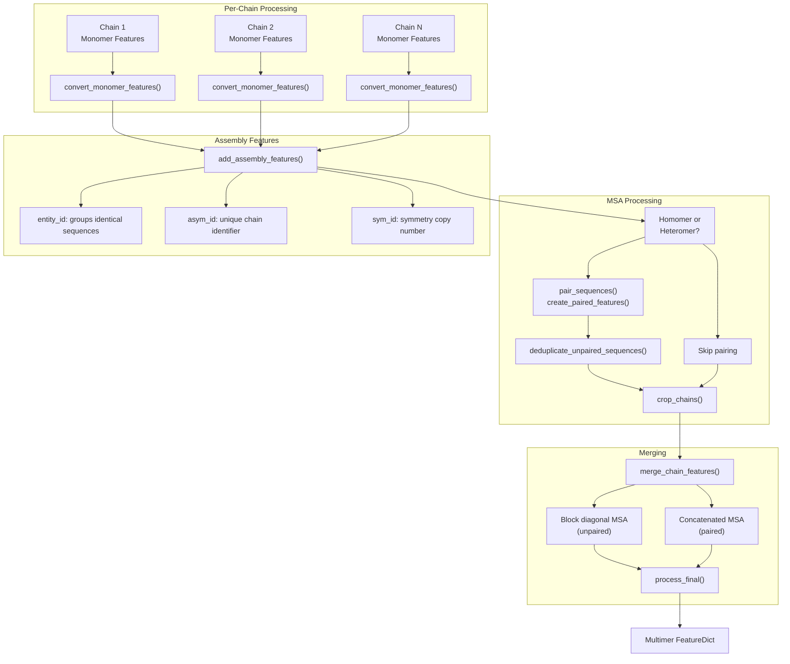
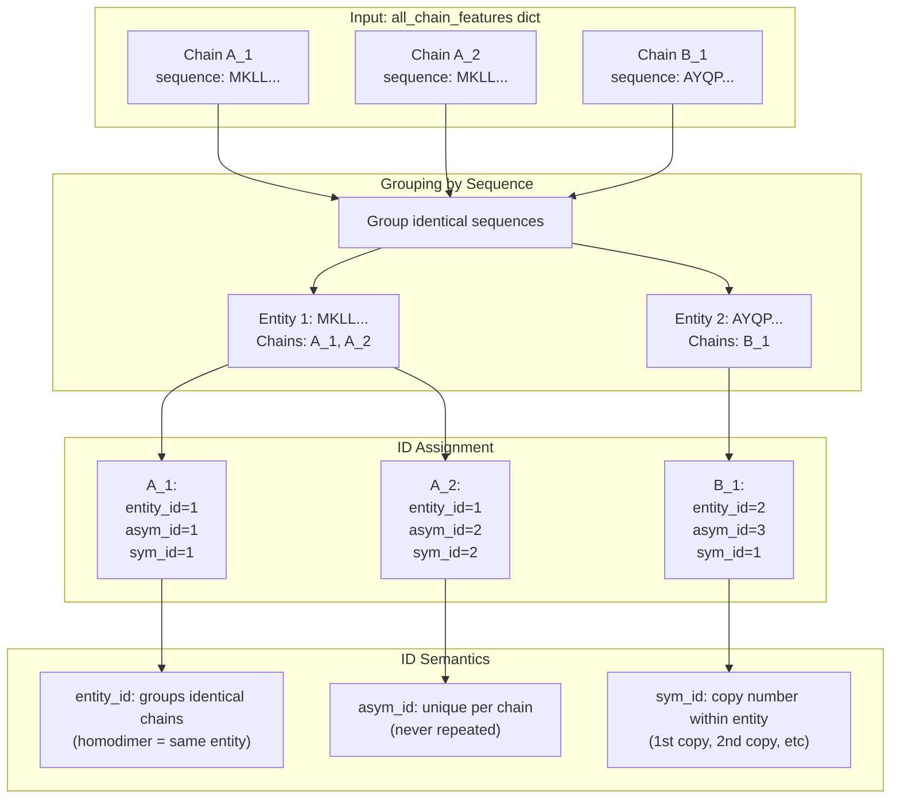
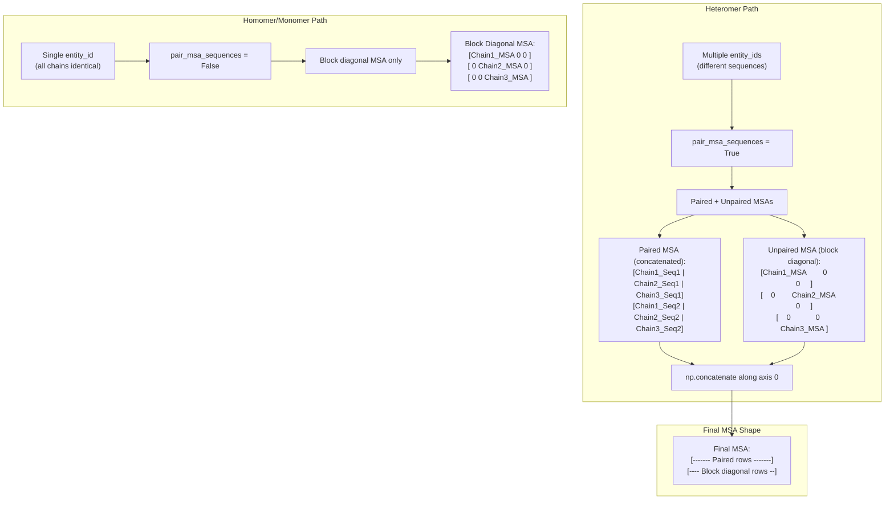
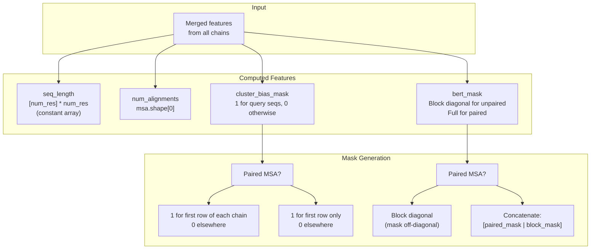

# Multimer Data Processing

> **Relevant source files**
> * [fastfold/common/protein.py](https://github.com/hpcaitech/FastFold/blob/eba49680/fastfold/common/protein.py)
> * [fastfold/data/data_pipeline.py](https://github.com/hpcaitech/FastFold/blob/eba49680/fastfold/data/data_pipeline.py)
> * [fastfold/data/feature_processing_multimer.py](https://github.com/hpcaitech/FastFold/blob/eba49680/fastfold/data/feature_processing_multimer.py)
> * [fastfold/data/msa_pairing.py](https://github.com/hpcaitech/FastFold/blob/eba49680/fastfold/data/msa_pairing.py)
> * [fastfold/data/parsers.py](https://github.com/hpcaitech/FastFold/blob/eba49680/fastfold/data/parsers.py)
> * [fastfold/data/templates.py](https://github.com/hpcaitech/FastFold/blob/eba49680/fastfold/data/templates.py)
> * [fastfold/data/tools/hmmbuild.py](https://github.com/hpcaitech/FastFold/blob/eba49680/fastfold/data/tools/hmmbuild.py)
> * [fastfold/data/tools/jackhmmer.py](https://github.com/hpcaitech/FastFold/blob/eba49680/fastfold/data/tools/jackhmmer.py)
> * [fastfold/utils/import_weights.py](https://github.com/hpcaitech/FastFold/blob/eba49680/fastfold/utils/import_weights.py)

Multimer data processing extends the monomer pipeline to handle protein complexes with multiple interacting chains. This system transforms per-chain monomer features into a unified multimer representation, capturing cross-chain evolutionary signals through MSA pairing and managing chain assembly information.

For monomer-specific MSA and template processing, see [Alignment and MSA Generation](/hpcaitech/FastFold/4.1-alignment-and-msa-generation) and [Template Search and Processing](/hpcaitech/FastFold/4.2-template-search-and-processing). For the base data pipeline implementation, see [Data Processing Pipeline](/hpcaitech/FastFold/4-data-processing-pipeline).

## Overview

The multimer pipeline processes each chain independently using monomer tools, then performs multimer-specific transformations:

1. **Feature Conversion**: Monomer features are reshaped and augmented for multimer models
2. **Assembly Annotation**: Chain identity features (entity_id, asym_id, sym_id) distinguish chains
3. **MSA Pairing**: Cross-chain MSA rows are paired based on species co-occurrence
4. **Feature Merging**: Chain features are combined via block-diagonalization or concatenation



**Sources**: [fastfold/data/data_pipeline.py L678-L769](https://github.com/hpcaitech/FastFold/blob/eba49680/fastfold/data/data_pipeline.py#L678-L769)

 [fastfold/data/msa_pairing.py L56-L460](https://github.com/hpcaitech/FastFold/blob/eba49680/fastfold/data/msa_pairing.py#L56-L460)

 [fastfold/data/feature_processing_multimer.py L50-L84](https://github.com/hpcaitech/FastFold/blob/eba49680/fastfold/data/feature_processing_multimer.py#L50-L84)

## Chain-Level Feature Conversion

### Monomer to Multimer Transformation

The `convert_monomer_features()` function reshapes monomer features for multimer compatibility:

**Key Transformations** ([data_pipeline.py L678-L702](https://github.com/hpcaitech/FastFold/blob/eba49680/data_pipeline.py#L678-L702)

):

| Feature | Monomer Format | Multimer Format | Transformation |
| --- | --- | --- | --- |
| `aatype` | One-hot [N, 21] | Integer [N] | `np.argmax()` - model does one-hot internally |
| `template_aatype` | One-hot [T, N, 22] | Remapped [T, N] | Remap HHBLITS → standard order |
| `sequence` | Array [1] | Scalar | Remove leading dimension |
| `domain_name` | Array [1] | Scalar | Remove leading dimension |
| `num_alignments` | Array [N] → [1] | Scalar | Extract single value |

```mermaid
flowchart TD

MonoAAType["aatype: [N, 21]<br>one-hot"]
MonoSeq["sequence: [1]<br>with leading dim"]
MonoTempl["template_aatype: [T, N, 22]<br>HHBLITS order"]
ConvFunc["Feature Conversion"]
ArgMax["np.argmax(axis=-1)"]
MultiAAType["aatype: [N]<br>integer indices"]
RemoveDim["np.asarray([0])"]
MultiSeq["sequence: scalar<br>string"]
Remap["Remap to standard<br>residue order"]
MultiTempl["template_aatype: [T, N]<br>standard order"]
AddChain["Add auth_chain_id"]
ChainFeats["Chain Features<br>with chain_id"]

MonoAAType --> ArgMax
MonoSeq --> RemoveDim
MonoTempl --> Remap
MultiAAType --> AddChain
MultiSeq --> AddChain
MultiTempl --> AddChain

subgraph subGraph2 ["Add Chain ID"]
    AddChain
    ChainFeats
    AddChain --> ChainFeats
end

subgraph convert_monomer_features() ["convert_monomer_features()"]
    ConvFunc
    ArgMax
    MultiAAType
    RemoveDim
    MultiSeq
    Remap
    MultiTempl
    ArgMax --> MultiAAType
    RemoveDim --> MultiSeq
    Remap --> MultiTempl
end

subgraph subGraph0 ["Monomer Features"]
    MonoAAType
    MonoSeq
    MonoTempl
end
```

**Sources**: [fastfold/data/data_pipeline.py L678-L702](https://github.com/hpcaitech/FastFold/blob/eba49680/fastfold/data/data_pipeline.py#L678-L702)

### Assembly Feature Generation

The `add_assembly_features()` function ([data_pipeline.py L727-L769](https://github.com/hpcaitech/FastFold/blob/eba49680/data_pipeline.py#L727-L769)

) adds three critical identifiers to distinguish chains in the complex:

**Chain Encoding System**:



**Implementation Details**:

* **Entity ID**: Integer starting from 1, groups chains with identical sequences
* **Asym ID**: Monotonically increasing unique chain identifier (1, 2, 3, ...)
* **Sym ID**: Copy number within entity (homodimers: sym_id ∈ {1, 2})
* **Chain Naming**: Uses `int_id_to_str_id()` for mmCIF-style encoding (1→A, 27→AA, 28→BA)

**Sources**: [fastfold/data/data_pipeline.py L705-L769](https://github.com/hpcaitech/FastFold/blob/eba49680/fastfold/data/data_pipeline.py#L705-L769)

## MSA Pairing Mechanism

### Pairing Strategy

MSA pairing captures co-evolutionary signals between interacting chains by identifying sequences from the same organism across different chain MSAs.

```mermaid
flowchart TD

MSA1["Chain 1 MSA<br>UniRef90_A123 species:9606<br>UniRef90_B456 species:10090<br>UniRef90_C789 species:9606"]
MSA2["Chain 2 MSA<br>UniRef90_X111 species:9606<br>UniRef90_Y222 species:10090<br>UniRef90_Z333 species:9606"]
MakeDf1["_make_msa_df()<br>Extract species IDs"]
MakeDf2["_make_msa_df()<br>Extract species IDs"]
SpeciesDict1["species_dict<br>{9606: [A123, C789]<br>10090: [B456]}"]
SpeciesDict2["species_dict<br>{9606: [X111, Z333]<br>10090: [Y222]}"]
FindCommon["Find common species:<br>{9606, 10090}"]
Species9606["Species 9606<br>Chain 1: [A123, C789]<br>Chain 2: [X111, Z333]"]
Species10090["Species 10090<br>Chain 1: [B456]<br>Chain 2: [Y222]"]
Match1["_match_rows_by_sequence_similarity()<br>Sort by similarity, pair top N"]
Match2["_match_rows_by_sequence_similarity()<br>Sort by similarity, pair top N"]
Pairs1["Paired rows:<br>[A123, X111]<br>[C789, Z333]"]
Pairs2["Paired rows:<br>[B456, Y222]"]
Reorder["reorder_paired_rows()<br>Order by num chains, then e-value"]
PairedMSA["Paired MSA indices<br>np.array([[A_idx, X_idx],<br>          [B_idx, Y_idx], ...])"]

MSA1 --> MakeDf1
MSA2 --> MakeDf2
FindCommon --> Species9606
FindCommon --> Species10090
Pairs1 --> Reorder
Pairs2 --> Reorder

subgraph Output ["Output"]
    Reorder
    PairedMSA
    Reorder --> PairedMSA
end

subgraph subGraph2 ["Pairing by Species"]
    Species9606
    Species10090
    Match1
    Match2
    Pairs1
    Pairs2
    Species9606 --> Match1
    Species10090 --> Match2
    Match1 --> Pairs1
    Match2 --> Pairs2
end

subgraph pair_sequences() ["pair_sequences()"]
    MakeDf1
    MakeDf2
    SpeciesDict1
    SpeciesDict2
    FindCommon
    MakeDf1 --> SpeciesDict1
    MakeDf2 --> SpeciesDict2
    SpeciesDict1 --> FindCommon
    SpeciesDict2 --> FindCommon
end

subgraph subGraph0 ["Input MSAs"]
    MSA1
    MSA2
end
```

**Pairing Algorithm** ([msa_pairing.py L181-L232](https://github.com/hpcaitech/FastFold/blob/eba49680/msa_pairing.py#L181-L232)

):

1. Extract species identifiers from MSA descriptions for each chain
2. Find species present in multiple chains (skip species in only one chain)
3. For each common species: * Sort sequences by similarity to query sequence * Pair top N sequences (N = min sequences across chains) * Skip species with >600 sequences (performance optimization)
4. Reorder paired rows: all-chain pairings first, then by product of e-values

**Sources**: [fastfold/data/msa_pairing.py L56-L232](https://github.com/hpcaitech/FastFold/blob/eba49680/fastfold/data/msa_pairing.py#L56-L232)

### Paired vs Unpaired MSAs

After pairing, chains have two MSA representations:

```mermaid
flowchart TD

OrigMSA["Original MSA<br>(unpaired)<br>Shape: [S, N]"]
Padding["pad_features()<br>Add padding row"]
Select["Select paired indices"]
PairedMSA["msa_all_seq<br>(paired)<br>Shape: [P, N]"]
UnpairedMSA["msa<br>(unpaired)<br>Shape: [U, N]"]
DedupCheck["deduplicate_unpaired_sequences()"]
Remove["Remove unpaired rows<br>that exist in paired MSA"]
CleanUnpaired["Clean unpaired MSA"]
AllSeq["Features with '_all_seq' suffix:<br>msa_all_seq<br>deletion_matrix_all_seq<br>msa_mask_all_seq"]
RegFeats["Regular MSA features:<br>msa<br>deletion_matrix<br>msa_mask"]

OrigMSA --> Padding
PairedMSA --> DedupCheck
UnpairedMSA --> DedupCheck
PairedMSA --> AllSeq
CleanUnpaired --> RegFeats

subgraph subGraph3 ["Final Features"]
    AllSeq
    RegFeats
end

subgraph Deduplication ["Deduplication"]
    DedupCheck
    Remove
    CleanUnpaired
    DedupCheck --> Remove
    Remove --> CleanUnpaired
end

subgraph create_paired_features() ["create_paired_features()"]
    Padding
    Select
    PairedMSA
    UnpairedMSA
    Padding --> Select
    Select --> PairedMSA
    Select --> UnpairedMSA
end

subgraph Input ["Input"]
    OrigMSA
end
```

**Key Points**:

* **Paired MSA** (`*_all_seq`): Sequences paired across chains, captures co-evolution
* **Unpaired MSA** (regular): Chain-specific sequences after removing duplicates
* **Padding row**: Added to MSAs for alignment - selected when chain has no pair for a species

**Sources**: [fastfold/data/msa_pairing.py L56-L116](https://github.com/hpcaitech/FastFold/blob/eba49680/fastfold/data/msa_pairing.py#L56-L116)

 [fastfold/data/msa_pairing.py L463-L483](https://github.com/hpcaitech/FastFold/blob/eba49680/fastfold/data/msa_pairing.py#L463-L483)

## Feature Merging Strategies

### Block Diagonal vs Concatenation

The merging strategy depends on whether MSAs are paired:



**Implementation** ([msa_pairing.py L357-L388](https://github.com/hpcaitech/FastFold/blob/eba49680/msa_pairing.py#L357-L388)

):

| Feature Type | Paired Mode | Unpaired Mode |
| --- | --- | --- |
| MSA features (`msa`, `deletion_matrix`, `msa_mask`) | `*_all_seq`: ConcatenatedRegular: Block diagonal | Block diagonal only |
| Sequence features (`aatype`, `residue_index`, `asym_id`) | Concatenated | Concatenated |
| Template features (`template_aatype`, `template_all_atom_positions`) | Concatenated | Concatenated |
| Chain features (`num_alignments`, `seq_length`) | Summed | Summed |

**Sources**: [fastfold/data/msa_pairing.py L357-L388](https://github.com/hpcaitech/FastFold/blob/eba49680/fastfold/data/msa_pairing.py#L357-L388)

### Block Diagonal Implementation

The `block_diag()` function ([msa_pairing.py L261-L267](https://github.com/hpcaitech/FastFold/blob/eba49680/msa_pairing.py#L261-L267)

) creates block diagonal matrices with custom padding:

```markdown
# Example: Block diagonal with gap padding for MSAChain1_MSA: [[1, 2], [3, 4]]  # 2 seqs, 2 residuesChain2_MSA: [[5, 6], [7, 8]]  # 2 seqs, 2 residues block_diag(Chain1_MSA, Chain2_MSA, pad_value=MSA_GAP_IDX)# Result: [[1, 2, 21, 21],   # 21 = gap index#          [3, 4, 21, 21],#          [21, 21, 5, 6],#          [21, 21, 7, 8]]
```

Off-diagonal blocks are filled with `pad_value` (gap index for MSAs, 0 for masks).

**Sources**: [fastfold/data/msa_pairing.py L261-L267](https://github.com/hpcaitech/FastFold/blob/eba49680/fastfold/data/msa_pairing.py#L261-L267)

## DataPipelineMultimer Workflow

### Complete Processing Pipeline

The `DataPipelineMultimer` class ([data_pipeline.py L1054-L1214](https://github.com/hpcaitech/FastFold/blob/eba49680/data_pipeline.py#L1054-L1214)

) orchestrates multimer-specific processing:

```mermaid
flowchart TD

Fasta["FASTA file<br>Multiple sequences<br>(one per chain)"]
ParseFasta["parse_fasta()<br>Extract chain sequences"]
ChainLoop["For each chain sequence"]
TempFasta["temp_fasta_file()<br>Create single-chain FASTA"]
ParseMSA["_parse_msa_data()<br>Load MSA files"]
ParseHits["_parse_template_hits()<br>Load template hits"]
MSAFeats["make_msa_features()"]
TmplFeats["make_template_features()"]
MonomerFeats["Monomer FeatureDict"]
Convert["convert_monomer_features()"]
AssemblyFeats["add_assembly_features()"]
AllChains["all_chain_features dict<br>{chain_id: features}"]
PairMerge["pair_and_merge()<br>(feature_processing_multimer)"]
ProcessUnmerged["process_unmerged_features()<br>Per-chain preprocessing"]
CheckHomo["_is_homomer_or_monomer()"]
Pair["MSA pairing + dedup"]
NoPair["Skip pairing"]
Crop["crop_chains()"]
MergeChains["merge_chain_features()"]
ProcessFinal["process_final()"]
CorrectMSA["_correct_msa_restypes()<br>Remap to standard order"]
MakeMasks["_make_seq_mask()<br>_make_msa_mask()"]
Filter["_filter_features()<br>Keep only required features"]
Output["Multimer FeatureDict"]

Fasta --> ParseFasta
MonomerFeats --> Convert
AllChains --> PairMerge
ProcessFinal --> CorrectMSA

subgraph subGraph4 ["Final Processing"]
    CorrectMSA
    MakeMasks
    Filter
    Output
    CorrectMSA --> MakeMasks
    MakeMasks --> Filter
    Filter --> Output
end

subgraph subGraph3 ["Pairing and Merging"]
    PairMerge
    ProcessUnmerged
    CheckHomo
    Pair
    NoPair
    Crop
    MergeChains
    ProcessFinal
    PairMerge --> ProcessUnmerged
    ProcessUnmerged --> CheckHomo
    CheckHomo --> Pair
    CheckHomo --> NoPair
    Pair --> Crop
    NoPair --> Crop
    Crop --> MergeChains
    MergeChains --> ProcessFinal
end

subgraph subGraph2 ["Multimer Conversion"]
    Convert
    AssemblyFeats
    AllChains
    Convert --> AssemblyFeats
    AssemblyFeats --> AllChains
end

subgraph subGraph1 ["Per-Chain Processing"]
    ParseFasta
    ChainLoop
    TempFasta
    ParseMSA
    ParseHits
    MSAFeats
    TmplFeats
    MonomerFeats
    ParseFasta --> ChainLoop
    ChainLoop --> TempFasta
    TempFasta --> ParseMSA
    TempFasta --> ParseHits
    ParseMSA --> MSAFeats
    ParseHits --> TmplFeats
    MSAFeats --> MonomerFeats
    TmplFeats --> MonomerFeats
end

subgraph Input ["Input"]
    Fasta
end
```



**Key Methods**:

1. **`process_fasta_multimer()`** ([data_pipeline.py L1156-L1214](https://github.com/hpcaitech/FastFold/blob/eba49680/data_pipeline.py#L1156-L1214) ): Main entry point * Parse multi-chain FASTA * Process each chain independently * Convert to multimer format * Add assembly features * Call `pair_and_merge()`
2. **`pair_and_merge()`** ([feature_processing_multimer.py L50-L84](https://github.com/hpcaitech/FastFold/blob/eba49680/feature_processing_multimer.py#L50-L84) ): * Preprocess per-chain features * Determine if pairing needed (homomer check) * Execute MSA pairing if heteromer * Crop MSAs to limit size * Merge all chains into single feature dict * Final postprocessing

**Sources**: [fastfold/data/data_pipeline.py L1054-L1214](https://github.com/hpcaitech/FastFold/blob/eba49680/fastfold/data/data_pipeline.py#L1054-L1214)

 [fastfold/data/feature_processing_multimer.py L50-L84](https://github.com/hpcaitech/FastFold/blob/eba49680/fastfold/data/feature_processing_multimer.py#L50-L84)

### Cropping and Size Limits

MSA cropping ([feature_processing_multimer.py L87-L166](https://github.com/hpcaitech/FastFold/blob/eba49680/feature_processing_multimer.py#L87-L166)

) manages memory by limiting MSA size:

**Cropping Strategy**:

| Mode | Paired MSA Crop | Unpaired MSA Crop | Total |
| --- | --- | --- | --- |
| With pairing | ≤ MSA_CROP_SIZE/2 | ≤ MSA_CROP_SIZE - num_paired | MSA_CROP_SIZE |
| Without pairing | N/A | ≤ MSA_CROP_SIZE | MSA_CROP_SIZE |

**Configuration** ([feature_processing_multimer.py L37-L38](https://github.com/hpcaitech/FastFold/blob/eba49680/feature_processing_multimer.py#L37-L38)

):

* `MSA_CROP_SIZE = 2048`: Maximum MSA rows per chain
* `MAX_TEMPLATES = 4`: Maximum templates per chain

When pairing is enabled, the crop size is split between paired and unpaired MSAs to maintain a consistent total MSA size per chain.

**Sources**: [fastfold/data/feature_processing_multimer.py L37-L38](https://github.com/hpcaitech/FastFold/blob/eba49680/fastfold/data/feature_processing_multimer.py#L37-L38)

 [fastfold/data/feature_processing_multimer.py L87-L166](https://github.com/hpcaitech/FastFold/blob/eba49680/fastfold/data/feature_processing_multimer.py#L87-L166)

## Post-Merging Corrections

The `_correct_post_merged_feats()` function ([msa_pairing.py L270-L332](https://github.com/hpcaitech/FastFold/blob/eba49680/msa_pairing.py#L270-L332)

) adds computed features after merging:



**Cluster Bias Mask**: Ensures the first MSA row (query) from each chain is always selected during clustering.

**BERT Mask**: Controls which MSA positions can attend to each other during training (prevents information leakage across non-interacting chains).

**Sources**: [fastfold/data/msa_pairing.py L270-L332](https://github.com/hpcaitech/FastFold/blob/eba49680/fastfold/data/msa_pairing.py#L270-L332)

## Key Feature Differences: Monomer vs Multimer

| Aspect | Monomer | Multimer |
| --- | --- | --- |
| **aatype** | One-hot [N, 21] | Integer [N] |
| **Chain IDs** | Single chain (implicit) | entity_id, asym_id, sym_id [N] |
| **MSA** | Single MSA [S, N] | Paired + block diagonal [P+B, N_total] |
| **Templates** | Per sequence [T, N, ...] | Concatenated [T, N_total, ...] |
| **Sequence features** | [N] shape | [N_total] concatenated |
| **Template remapping** | HHBLITS order | Standard residue order |

**Model Processing**: The multimer model expects integer `aatype` and performs one-hot encoding internally, whereas monomer models receive pre-encoded one-hot features.

**Sources**: [fastfold/data/data_pipeline.py L678-L702](https://github.com/hpcaitech/FastFold/blob/eba49680/fastfold/data/data_pipeline.py#L678-L702)

 [fastfold/data/msa_pairing.py L357-L388](https://github.com/hpcaitech/FastFold/blob/eba49680/fastfold/data/msa_pairing.py#L357-L388)

 [fastfold/utils/import_weights.py L131-L563](https://github.com/hpcaitech/FastFold/blob/eba49680/fastfold/utils/import_weights.py#L131-L563)