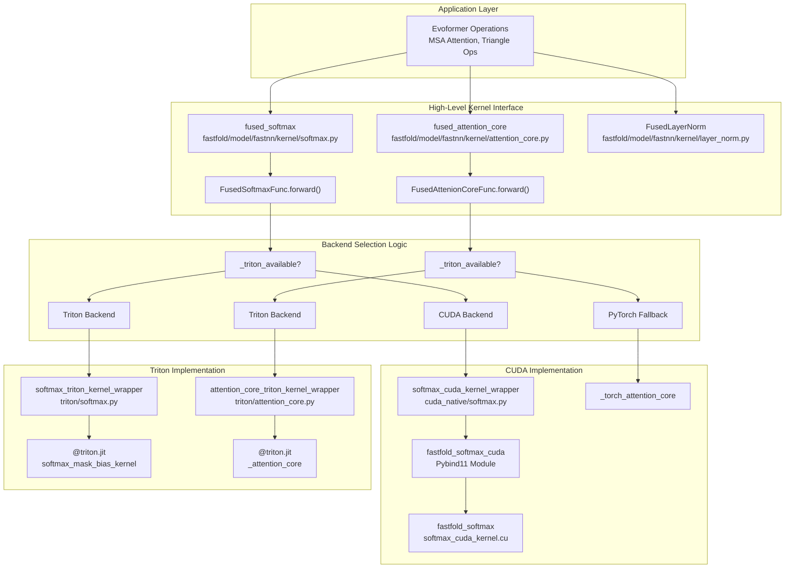
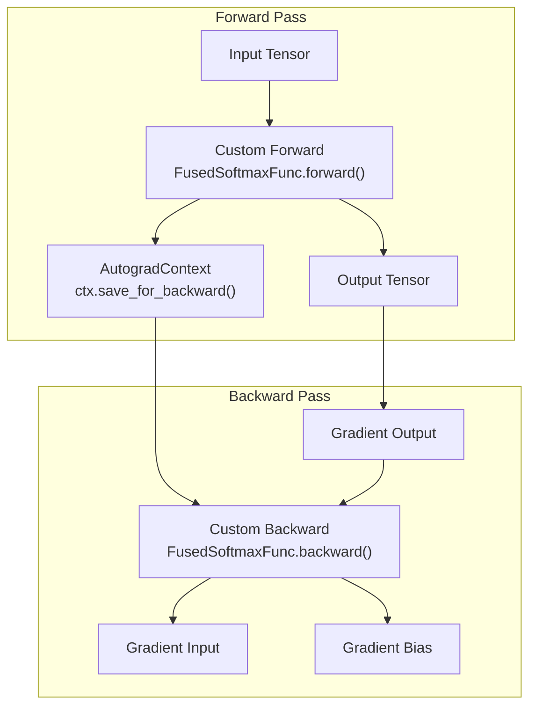
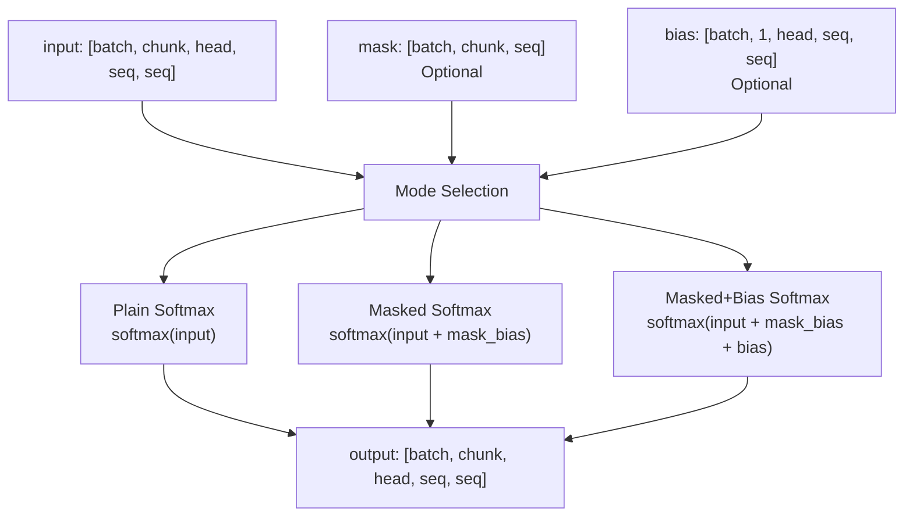
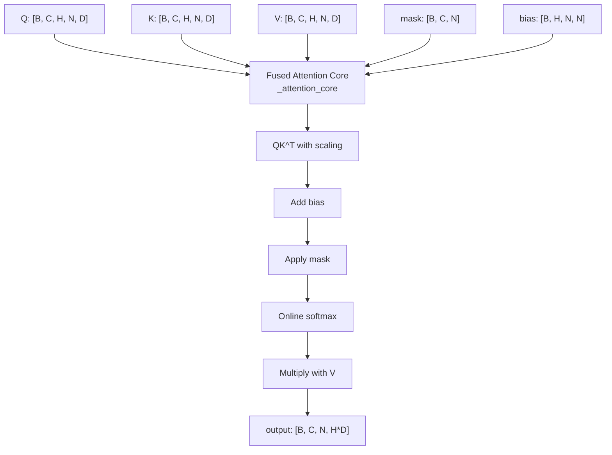
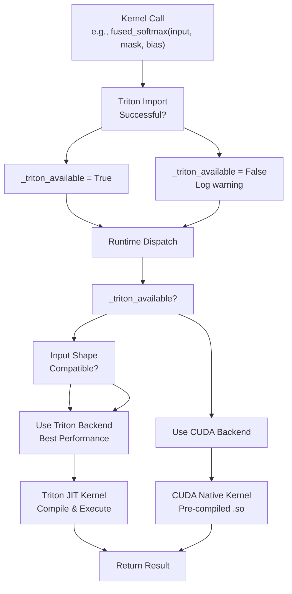
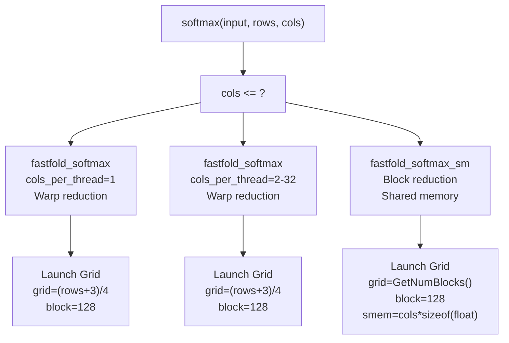
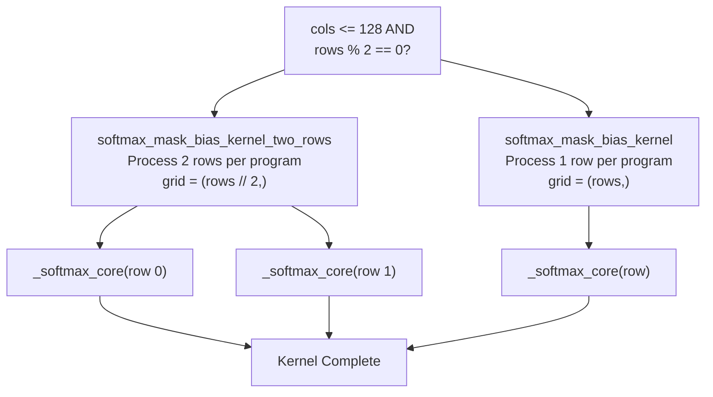
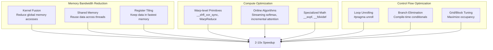
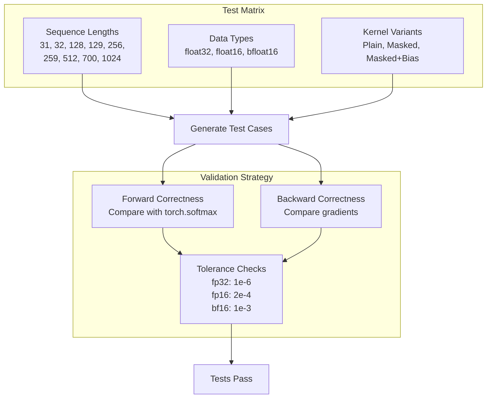

# Optimized Kernels

> **Relevant source files**
> * [fastfold/model/fastnn/kernel/__init__.py](https://github.com/hpcaitech/FastFold/blob/eba49680/fastfold/model/fastnn/kernel/__init__.py)
> * [fastfold/model/fastnn/kernel/attention_core.py](https://github.com/hpcaitech/FastFold/blob/eba49680/fastfold/model/fastnn/kernel/attention_core.py)
> * [fastfold/model/fastnn/kernel/cuda_native/csrc/softmax_cuda.cpp](https://github.com/hpcaitech/FastFold/blob/eba49680/fastfold/model/fastnn/kernel/cuda_native/csrc/softmax_cuda.cpp)
> * [fastfold/model/fastnn/kernel/cuda_native/csrc/softmax_cuda_kernel.cu](https://github.com/hpcaitech/FastFold/blob/eba49680/fastfold/model/fastnn/kernel/cuda_native/csrc/softmax_cuda_kernel.cu)
> * [fastfold/model/fastnn/kernel/softmax.py](https://github.com/hpcaitech/FastFold/blob/eba49680/fastfold/model/fastnn/kernel/softmax.py)
> * [fastfold/model/fastnn/kernel/triton/attention_core.py](https://github.com/hpcaitech/FastFold/blob/eba49680/fastfold/model/fastnn/kernel/triton/attention_core.py)
> * [fastfold/model/fastnn/kernel/triton/softmax.py](https://github.com/hpcaitech/FastFold/blob/eba49680/fastfold/model/fastnn/kernel/triton/softmax.py)
> * [tests/test_fastnn/test_attention_core.py](https://github.com/hpcaitech/FastFold/blob/eba49680/tests/test_fastnn/test_attention_core.py)
> * [tests/test_fastnn/test_softmax.py](https://github.com/hpcaitech/FastFold/blob/eba49680/tests/test_fastnn/test_softmax.py)

## Purpose and Scope

This page documents FastFold's low-level optimized CUDA and Triton kernels that provide 2-10x speedup over standard PyTorch operations through memory bandwidth reduction and compute fusion. These kernels operate on primitive operations like softmax, attention, and layer normalization, fusing multiple operations into single GPU kernel launches.

For higher-level chunked operations that use these kernels, see [FastNN Operations](/hpcaitech/FastFold/8.2-fastnn-operations). For specific kernel implementations, see [Fused Softmax Kernel](/hpcaitech/FastFold/8.3.1-fused-softmax-kernel) and [Fused Attention Core Kernel](/hpcaitech/FastFold/8.3.2-fused-attention-core-kernel).

## Kernel Architecture Overview

FastFold implements a dual-backend kernel architecture with automatic fallback: Triton kernels provide optimal performance when available, falling back to hand-written CUDA kernels for broader compatibility.

### Dual-Backend Design



**Sources:** [fastfold/model/fastnn/kernel/softmax.py L1-L59](https://github.com/hpcaitech/FastFold/blob/eba49680/fastfold/model/fastnn/kernel/softmax.py#L1-L59)

 [fastfold/model/fastnn/kernel/attention_core.py L1-L53](https://github.com/hpcaitech/FastFold/blob/eba49680/fastfold/model/fastnn/kernel/attention_core.py#L1-L53)

The architecture implements three layers:

| Layer | Purpose | Components |
| --- | --- | --- |
| **High-Level Interface** | Uniform API for all kernels | `fused_softmax`, `fused_attention_core`, `FusedLayerNorm` |
| **Backend Selection** | Runtime dispatch based on availability | `_triton_available` flag, conditional imports |
| **Backend Implementations** | Optimized kernel code | Triton JIT kernels, CUDA C++ kernels, PyTorch fallbacks |

### Autograd Integration

All optimized kernels integrate seamlessly with PyTorch's autograd system through `torch.autograd.Function`:



**Sources:** [fastfold/model/fastnn/kernel/softmax.py L21-L57](https://github.com/hpcaitech/FastFold/blob/eba49680/fastfold/model/fastnn/kernel/softmax.py#L21-L57)

Each kernel implements:

* **Forward pass**: Optimized computation, saves tensors needed for backward
* **Backward pass**: Gradient computation using saved context

## Available Kernels

FastFold provides optimized implementations for the following operations:

### Kernel Catalog

| Kernel | Function | Variants | Backend Support |
| --- | --- | --- | --- |
| **Softmax** | Numerically stable softmax | Plain, masked, masked+bias | CUDA, Triton |
| **Attention Core** | Fused QKV attention with online softmax | Masked, with bias | Triton only |
| **Layer Normalization** | Fused layer norm computation | Standard, affine | CUDA |
| **Bias Operations** | Element-wise ops with bias | Dropout+add, sigmoid, etc. | JIT |

**Sources:** [fastfold/model/fastnn/kernel/__init__.py L1-L13](https://github.com/hpcaitech/FastFold/blob/eba49680/fastfold/model/fastnn/kernel/__init__.py#L1-L13)

### Softmax Kernel Family

The softmax kernel supports three operation modes with a unified interface:



**Sources:** [fastfold/model/fastnn/kernel/softmax.py L23-L41](https://github.com/hpcaitech/FastFold/blob/eba49680/fastfold/model/fastnn/kernel/softmax.py#L23-L41)

Each variant is optimized for its specific use case:

* **Plain**: Maximum throughput for unmasked attention
* **Masked**: Handles padding/causal masks efficiently
* **Masked+Bias**: Full attention with positional/pair bias

### Attention Core Kernel

The attention core kernel fuses the entire attention computation into a single kernel launch:



**Sources:** [fastfold/model/fastnn/kernel/triton/attention_core.py L12-L121](https://github.com/hpcaitech/FastFold/blob/eba49680/fastfold/model/fastnn/kernel/triton/attention_core.py#L12-L121)

The kernel implements **online softmax**, computing attention weights incrementally without materializing the full attention matrix, dramatically reducing memory usage for long sequences.

## Kernel Selection Strategy

FastFold automatically selects the optimal kernel implementation at runtime based on availability and input characteristics.

### Selection Hierarchy



**Sources:** [fastfold/model/fastnn/kernel/softmax.py L7-L16](https://github.com/hpcaitech/FastFold/blob/eba49680/fastfold/model/fastnn/kernel/softmax.py#L7-L16)

 [fastfold/model/fastnn/kernel/attention_core.py L7-L14](https://github.com/hpcaitech/FastFold/blob/eba49680/fastfold/model/fastnn/kernel/attention_core.py#L7-L14)

The selection process occurs in two phases:

1. **Import Time**: Attempt to import Triton, set `_triton_available` flag
2. **Runtime**: Check flag and dispatch to appropriate backend

### Backend-Specific Optimizations

Each backend applies different optimization strategies:

| Optimization | CUDA Backend | Triton Backend |
| --- | --- | --- |
| **Warp-level reduction** | Manual `__shfl_xor_sync` | Automatic by compiler |
| **Shared memory** | Explicit allocation, manual indexing | Automatic via block reduce |
| **Kernel fusion** | Template specialization | JIT compilation with constexpr |
| **Block size tuning** | Compile-time constants | Runtime `next_power_of_2` selection |
| **Two-row processing** | N/A | Special kernel for small sequences |

**Sources:** [fastfold/model/fastnn/kernel/cuda_native/csrc/softmax_cuda_kernel.cu L18-L30](https://github.com/hpcaitech/FastFold/blob/eba49680/fastfold/model/fastnn/kernel/cuda_native/csrc/softmax_cuda_kernel.cu#L18-L30)

 [fastfold/model/fastnn/kernel/triton/softmax.py L72-L110](https://github.com/hpcaitech/FastFold/blob/eba49680/fastfold/model/fastnn/kernel/triton/softmax.py#L72-L110)

## CUDA Kernel Implementation Details

The CUDA backend provides hand-optimized kernels with multiple specializations based on sequence length.

### Softmax CUDA Kernel Dispatch



**Sources:** [fastfold/model/fastnn/kernel/cuda_native/csrc/softmax_cuda_kernel.cu L163-L249](https://github.com/hpcaitech/FastFold/blob/eba49680/fastfold/model/fastnn/kernel/cuda_native/csrc/softmax_cuda_kernel.cu#L163-L249)

The dispatch logic in [softmax_cuda_kernel.cu L172-L228](https://github.com/hpcaitech/FastFold/blob/eba49680/softmax_cuda_kernel.cu#L172-L228)

 uses a macro-based template expansion to generate specialized kernels for `cols_per_thread` from 1 to 32, ensuring optimal performance across a wide range of sequence lengths.

### CUDA Kernel Variants

| Kernel Name | Input Range | Reduction Strategy | Memory Usage |
| --- | --- | --- | --- |
| `fastfold_softmax<T, 1>` | cols ≤ 32 | Warp shuffle | Registers only |
| `fastfold_softmax<T, 2-32>` | 32 < cols ≤ 1024 | Warp shuffle | Registers only |
| `fastfold_softmax_sm<T, 128>` | cols > 1024 | Block reduction (CUB) | Shared memory |

**Sources:** [fastfold/model/fastnn/kernel/cuda_native/csrc/softmax_cuda_kernel.cu L84-L161](https://github.com/hpcaitech/FastFold/blob/eba49680/fastfold/model/fastnn/kernel/cuda_native/csrc/softmax_cuda_kernel.cu#L84-L161)

The warp-based kernels process 4 rows per block using a 128-thread configuration (4 warps), with each warp handling one row. This design maximizes occupancy while minimizing synchronization overhead.

## Triton Kernel Implementation Details

The Triton backend uses JIT compilation to generate optimized kernels tailored to input shapes.

### Triton Softmax Optimizations

The Triton softmax implementation includes a special two-row optimization for small sequence lengths:



**Sources:** [fastfold/model/fastnn/kernel/triton/softmax.py L73-L110](https://github.com/hpcaitech/FastFold/blob/eba49680/fastfold/model/fastnn/kernel/triton/softmax.py#L73-L110)

 [fastfold/model/fastnn/kernel/triton/softmax.py L153-L186](https://github.com/hpcaitech/FastFold/blob/eba49680/fastfold/model/fastnn/kernel/triton/softmax.py#L153-L186)

This optimization reduces kernel launch overhead by 2x for small sequences, which is common in early Evoformer layers or when using large chunk sizes.

### Triton Block Size Selection

Triton kernels automatically select block size and warp count based on sequence length:

| Sequence Length | BLOCK_SIZE | num_warps | Rationale |
| --- | --- | --- | --- |
| < 1024 | `next_power_of_2(cols)` | 1 | Minimize resource usage |
| 1024-2047 | `next_power_of_2(cols)` | 4 | Balance occupancy/resources |
| 2048-4095 | `next_power_of_2(cols)` | 8 | Higher parallelism |
| ≥ 4096 | `next_power_of_2(cols)` | 16 | Maximum parallelism |

**Sources:** [fastfold/model/fastnn/kernel/triton/softmax.py L157-L164](https://github.com/hpcaitech/FastFold/blob/eba49680/fastfold/model/fastnn/kernel/triton/softmax.py#L157-L164)

## Performance Characteristics

Optimized kernels achieve significant speedups through multiple optimization techniques.

### Optimization Techniques



**Sources:** [fastfold/model/fastnn/kernel/cuda_native/csrc/softmax_cuda_kernel.cu L18-L30](https://github.com/hpcaitech/FastFold/blob/eba49680/fastfold/model/fastnn/kernel/cuda_native/csrc/softmax_cuda_kernel.cu#L18-L30)

 [fastfold/model/fastnn/kernel/triton/attention_core.py L79-L106](https://github.com/hpcaitech/FastFold/blob/eba49680/fastfold/model/fastnn/kernel/triton/attention_core.py#L79-L106)

### Kernel-Specific Performance

| Kernel | Speedup vs PyTorch | Primary Optimization |
| --- | --- | --- |
| **Softmax (Triton)** | 5-8x | Kernel fusion, warp reduction |
| **Softmax (CUDA)** | 3-6x | Template specialization, warp shuffle |
| **Attention Core (Triton)** | 8-12x | Online softmax, no materialization |
| **LayerNorm (CUDA)** | 2-4x | Welford's algorithm, single pass |

The attention core kernel's dramatic speedup comes from avoiding materialization of the `[B, H, N, N]` attention matrix, instead computing attention weights on-the-fly and immediately using them to weight values.

### Gradient Computation

Backward passes also use optimized kernels with similar performance gains:

**Softmax Gradient**: [fastfold/model/fastnn/kernel/cuda_native/csrc/softmax_cuda_kernel.cu L252-L334](https://github.com/hpcaitech/FastFold/blob/eba49680/fastfold/model/fastnn/kernel/cuda_native/csrc/softmax_cuda_kernel.cu#L252-L334)

* Computes `d_input = (d_output - sum(output * d_output)) * output`
* Single kernel launch, no intermediate tensors

**Attention Gradient**: Currently falls back to PyTorch autograd

* Triton attention kernel does not implement custom backward
* Future optimization opportunity

**Sources:** [fastfold/model/fastnn/kernel/softmax.py L43-L56](https://github.com/hpcaitech/FastFold/blob/eba49680/fastfold/model/fastnn/kernel/softmax.py#L43-L56)

 [fastfold/model/fastnn/kernel/attention_core.py L34-L50](https://github.com/hpcaitech/FastFold/blob/eba49680/fastfold/model/fastnn/kernel/attention_core.py#L34-L50)

## Kernel API and Usage

The high-level kernel API provides a simple interface that abstracts backend selection.

### Softmax API

```python
def fused_softmax(input, mask=None, bias=None) -> Tensor
```

**Parameters:**

* `input`: Input tensor of shape `[B, C, H, N, N]` (5D) or `[B, H, N, N]` (4D)
* `mask`: Optional boolean mask `[B, C, N]`, zeros indicate masked positions
* `bias`: Optional bias tensor `[B, 1, H, N, N]` added before softmax

**Returns:**

* Softmax output with same shape as input

**Example Usage from Evoformer:**

```markdown
# In MSA row attention with pair biaslogits = fused_softmax(logits, mask=msa_mask, bias=pair_bias)
```

**Sources:** [fastfold/model/fastnn/kernel/softmax.py L59](https://github.com/hpcaitech/FastFold/blob/eba49680/fastfold/model/fastnn/kernel/softmax.py#L59-L59)

### Attention Core API

```python
def fused_attention_core(q, k, v, mask=None, bias=None) -> Tensor
```

**Parameters:**

* `q`, `k`, `v`: Query, key, value tensors `[B, C, H, N, D]`
* `mask`: Optional boolean mask `[B, C, N]`
* `bias`: Optional attention bias `[B, H, N, N]`

**Returns:**

* Attention output `[B, C, N, H*D]` (heads concatenated)

**Constraints:**

* Only supports `float16` and `bfloat16` dtypes
* Head dimension `D` must be in `{16, 32, 64, 128}`
* Triton backend only (no CUDA fallback)

**Sources:** [fastfold/model/fastnn/kernel/attention_core.py L53](https://github.com/hpcaitech/FastFold/blob/eba49680/fastfold/model/fastnn/kernel/attention_core.py#L53-L53)

 [fastfold/model/fastnn/kernel/triton/attention_core.py L124-L126](https://github.com/hpcaitech/FastFold/blob/eba49680/fastfold/model/fastnn/kernel/triton/attention_core.py#L124-L126)

## Testing and Validation

FastFold includes comprehensive tests for kernel correctness across data types and input sizes.

### Test Coverage



**Sources:** [tests/test_fastnn/test_softmax.py L7-L54](https://github.com/hpcaitech/FastFold/blob/eba49680/tests/test_fastnn/test_softmax.py#L7-L54)

The test suite in [test_softmax.py L7-L61](https://github.com/hpcaitech/FastFold/blob/eba49680/test_softmax.py#L7-L61)

 validates:

1. **Forward pass accuracy**: Maximum absolute error vs PyTorch reference
2. **Backward pass accuracy**: Gradient correctness for inputs and bias
3. **Fallback behavior**: Disabling Triton and retesting with CUDA backend

### Numerical Precision

Different data types require different error tolerances due to precision limitations:

| Data Type | Mantissa Bits | Tolerance | Use Case |
| --- | --- | --- | --- |
| `float32` | 23 | 1e-6 | Debugging, validation |
| `float16` | 10 | 2e-4 | Training with mixed precision |
| `bfloat16` | 7 | 1e-3 | Memory-constrained training |

**Sources:** [tests/test_fastnn/test_softmax.py L14](https://github.com/hpcaitech/FastFold/blob/eba49680/tests/test_fastnn/test_softmax.py#L14-L14)

The tests ensure kernels maintain acceptable numerical accuracy across all supported data types, with special attention to edge cases like very small/large sequence lengths and boundary conditions.