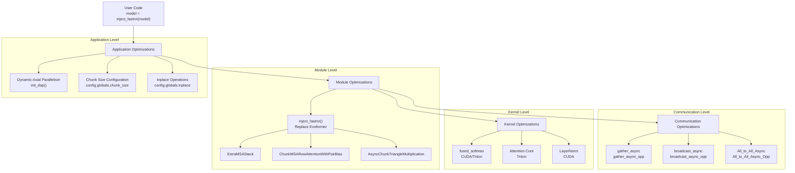
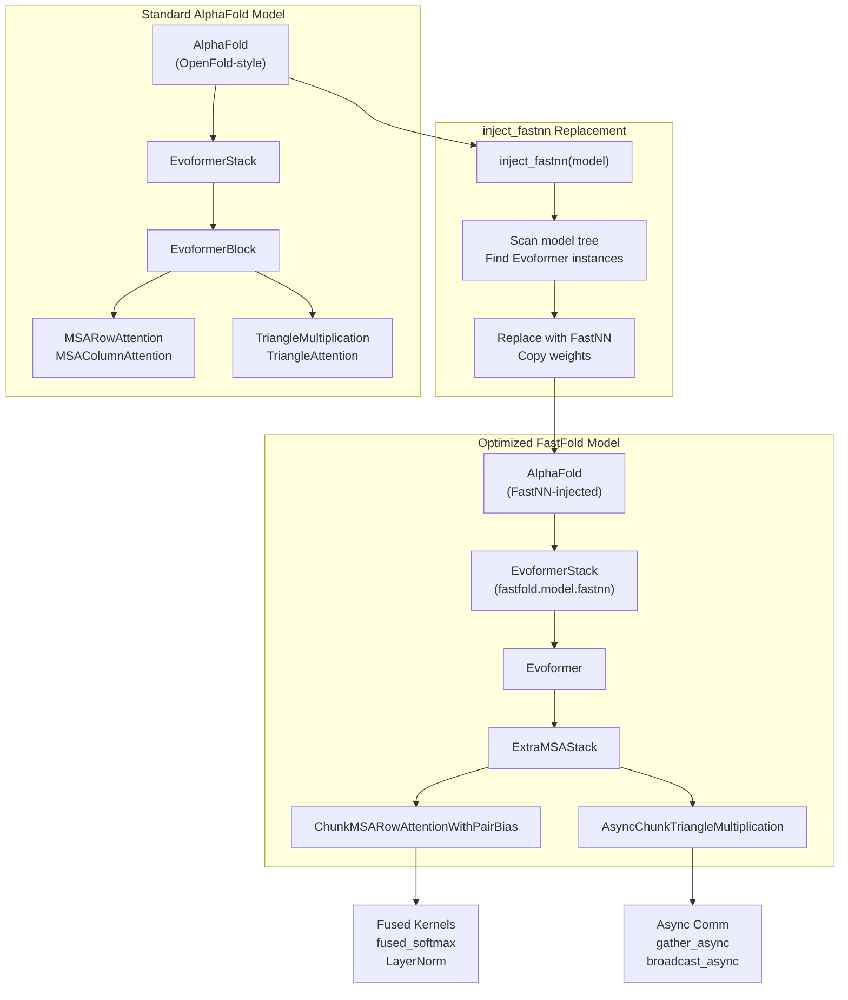
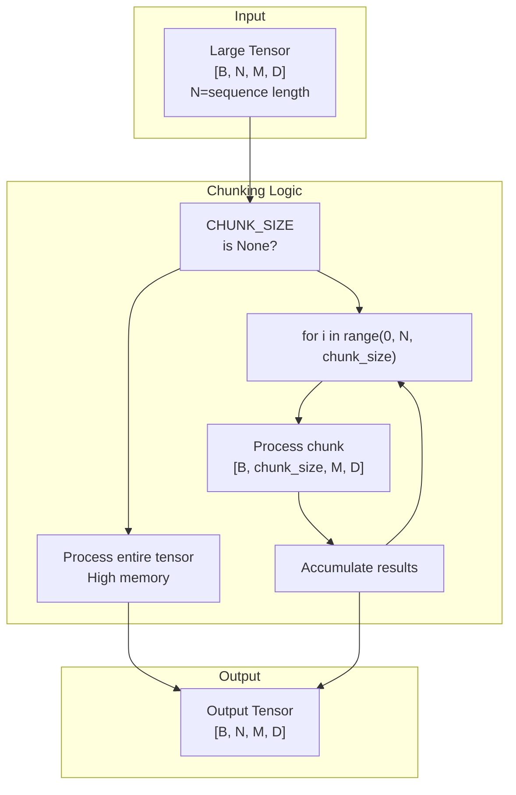
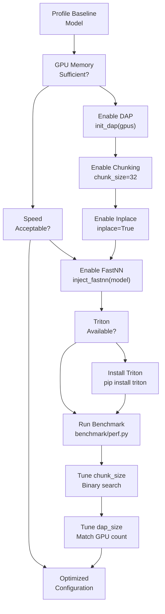

# Performance Optimizations

> **Relevant source files**
> * [README.md](https://github.com/hpcaitech/FastFold/blob/eba49680/README.md?plain=1)
> * [benchmark/perf.py](https://github.com/hpcaitech/FastFold/blob/eba49680/benchmark/perf.py)
> * [environment.yml](https://github.com/hpcaitech/FastFold/blob/eba49680/environment.yml)
> * [fastfold/distributed/__init__.py](https://github.com/hpcaitech/FastFold/blob/eba49680/fastfold/distributed/__init__.py)
> * [fastfold/distributed/comm.py](https://github.com/hpcaitech/FastFold/blob/eba49680/fastfold/distributed/comm.py)
> * [fastfold/distributed/core.py](https://github.com/hpcaitech/FastFold/blob/eba49680/fastfold/distributed/core.py)
> * [fastfold/model/__init__.py](https://github.com/hpcaitech/FastFold/blob/eba49680/fastfold/model/__init__.py)
> * [fastfold/model/fastnn/__init__.py](https://github.com/hpcaitech/FastFold/blob/eba49680/fastfold/model/fastnn/__init__.py)
> * [fastfold/model/fastnn/msa.py](https://github.com/hpcaitech/FastFold/blob/eba49680/fastfold/model/fastnn/msa.py)
> * [fastfold/model/fastnn/ops.py](https://github.com/hpcaitech/FastFold/blob/eba49680/fastfold/model/fastnn/ops.py)
> * [inference.py](https://github.com/hpcaitech/FastFold/blob/eba49680/inference.py)

This document provides an overview of FastFold's multi-level optimization strategy for accelerating AlphaFold model training and inference. FastFold achieves 2-10x performance improvements over standard implementations through a combination of application-level parallelism, module-level operation fusion, kernel-level optimizations, and communication overlap.

For details on specific optimization techniques, see:

* [Dynamic Axial Parallelism (DAP)](/hpcaitech/FastFold/8.1-dynamic-axial-parallelism-(dap)) - GPU memory scaling for ultra-long sequences
* [FastNN Operations](/hpcaitech/FastFold/8.2-fastnn-operations) - Chunk-aware MSA and attention modules
* [Optimized Kernels](/hpcaitech/FastFold/8.3-optimized-kernels) - Fused CUDA/Triton implementations
* [Distributed Communication Primitives](/hpcaitech/FastFold/8.4-distributed-communication-primitives) - Async communication with computation overlap
* [Memory Optimization Techniques](/hpcaitech/FastFold/8.5-memory-optimization-techniques) - Chunking and inplace operations

## Optimization Philosophy

FastFold's optimization strategy is based on three core principles:

1. **Transparent Injection**: Optimizations are applied via `inject_fastnn()`, requiring minimal code changes to existing AlphaFold implementations
2. **Graceful Degradation**: Each optimization level can function independently; if a lower-level optimization is unavailable (e.g., no CUDA), higher levels still work
3. **Configurable Trade-offs**: Users can tune memory-compute trade-offs via parameters like `chunk_size`

The key insight is that AlphaFold's Evoformer architecture processes large tensors with regular structure, enabling:

* **Chunking**: Processing large tensors in smaller blocks to reduce peak memory
* **Fusion**: Combining multiple operations into single kernels to reduce memory bandwidth
* **Parallelism**: Sharding sequence dimensions across GPUs when single-GPU memory is insufficient

Sources: [README.md L19-L29](https://github.com/hpcaitech/FastFold/blob/eba49680/README.md?plain=1#L19-L29)

 [inference.py L104-L113](https://github.com/hpcaitech/FastFold/blob/eba49680/inference.py#L104-L113)

## Optimization Stack Architecture

FastFold's optimizations operate at four hierarchical levels, each targeting different performance bottlenecks:



**Application Level** enables breaking GPU memory limits and configuring memory-compute trade-offs. **Module Level** replaces standard Evoformer blocks with chunk-aware, distributed variants. **Kernel Level** fuses primitive operations to reduce memory bandwidth. **Communication Level** overlaps computation with data transfers in distributed settings.

Sources: [fastfold/distributed/core.py L17-L41](https://github.com/hpcaitech/FastFold/blob/eba49680/fastfold/distributed/core.py#L17-L41)

 [fastfold/model/fastnn/ops.py L35-L42](https://github.com/hpcaitech/FastFold/blob/eba49680/fastfold/model/fastnn/ops.py#L35-L42)

 [inference.py L122-L145](https://github.com/hpcaitech/FastFold/blob/eba49680/inference.py#L122-L145)

## Performance Characteristics

FastFold achieves significant speedups across different model components and configurations:

| Optimization | Target Component | Speedup | Memory Reduction | Configuration |
| --- | --- | --- | --- | --- |
| DAP | Full Model | 2x | Enables 10K+ residues | `init_dap(dap_size)` |
| inject_fastnn | Evoformer | 2-5x | 30-50% | `inject_fastnn(model)` |
| Fused Kernels | Softmax, Attention, LayerNorm | 2-10x per op | 20-40% | Automatic (Triton/CUDA) |
| Async Communication | Distributed Ops | 20-30% | - | Automatic with DAP |
| Chunking | Large Tensors | -10-30% speed | 50-80% | `chunk_size=N` |
| Inplace Operations | Memory Allocations | 5-10% | 10-20% | `inplace=True` |

**Trade-offs**:

* Smaller `chunk_size` reduces memory but increases compute time due to repeated operations
* DAP adds communication overhead but enables sequences impossible on single GPU
* Fused kernels require CUDA 11.3+ for Triton; fallback to native CUDA available

Sources: [README.md L19-L29](https://github.com/hpcaitech/FastFold/blob/eba49680/README.md?plain=1#L19-L29)

 [inference.py L117-L164](https://github.com/hpcaitech/FastFold/blob/eba49680/inference.py#L117-L164)

## Enabling Optimizations

### Basic Usage: inject_fastnn

The primary interface for enabling FastFold optimizations is `inject_fastnn()`:

```javascript
from fastfold.utils import inject_fastnnfrom fastfold.model.hub import AlphaFoldfrom fastfold.config import model_config config = model_config("model_1")model = AlphaFold(config) # Load weightsimport_jax_weights_(model, param_path, version="model_1") # Enable FastFold optimizations - single line!model = inject_fastnn(model)
```

This function performs surgical replacement of standard Evoformer modules with optimized versions while preserving model weights and behavior.

Sources: [inference.py L104-L113](https://github.com/hpcaitech/FastFold/blob/eba49680/inference.py#L104-L113)

 [README.md L104-L113](https://github.com/hpcaitech/FastFold/blob/eba49680/README.md?plain=1#L104-L113)

### Multi-GPU Inference with DAP

For distributed inference across multiple GPUs:

```javascript
from fastfold.distributed import init_dap # Initialize Dynamic Axial Parallelism# Must be called before model creation in each processinit_dap(tensor_model_parallel_size=2) # Model creation and inject_fastnn as above# Sequences are automatically sharded across GPUs
```

When using `torch.multiprocessing.spawn`, each worker initializes DAP independently:

Sources: [inference.py L122-L160](https://github.com/hpcaitech/FastFold/blob/eba49680/inference.py#L122-L160)

 [fastfold/distributed/core.py L17-L41](https://github.com/hpcaitech/FastFold/blob/eba49680/fastfold/distributed/core.py#L17-L41)

### Memory Optimization with Chunking

To reduce memory usage at the cost of some speed:

```javascript
from fastfold.model.fastnn import set_chunk_size config = model_config("model_1")config.globals.chunk_size = 32  # Smaller = less memory, slower model = AlphaFold(config)model = inject_fastnn(model) # Also set globally for operations that checkset_chunk_size(config.globals.chunk_size)
```

**Chunk Size Guidelines**:

* `chunk_size=None`: No chunking, maximum speed, highest memory
* `chunk_size=64`: Balanced (default for many operations)
* `chunk_size=32`: Reduced memory, moderate slowdown
* `chunk_size=16`: Minimal memory, ~20-30% slower

For extreme sequences (>10K residues):

```javascript
# Set PyTorch memory allocator configurationexport PYTORCH_CUDA_ALLOC_CONF=max_split_size_mb:15000 python inference.py ... --chunk_size 16 --inplace
```

Sources: [inference.py L117-L164](https://github.com/hpcaitech/FastFold/blob/eba49680/inference.py#L117-L164)

 [fastfold/model/fastnn/ops.py L35-L42](https://github.com/hpcaitech/FastFold/blob/eba49680/fastfold/model/fastnn/ops.py#L35-L42)

## Optimization Flow: inject_fastnn in Detail



The `inject_fastnn()` function traverses the model's module hierarchy, identifying standard Evoformer implementations and replacing them with optimized variants. Weight tensors are preserved, ensuring identical mathematical behavior while enabling chunk-aware processing, kernel fusion, and distributed communication.

Sources: [README.md L104-L113](https://github.com/hpcaitech/FastFold/blob/eba49680/README.md?plain=1#L104-L113)

 [fastfold/model/fastnn/__init__.py L1-L14](https://github.com/hpcaitech/FastFold/blob/eba49680/fastfold/model/fastnn/__init__.py#L1-L14)

## Chunk-Based Processing Pattern

Many FastFold operations use a chunking pattern to process large tensors in smaller blocks:



**Example from ChunkTransition**:

The pattern appears in multiple modules:

* `ChunkTransition`: Processes MSA features in chunks ([fastfold/model/fastnn/ops.py L93-L124](https://github.com/hpcaitech/FastFold/blob/eba49680/fastfold/model/fastnn/ops.py#L93-L124) )
* `ChunkMSARowAttentionWithPairBias`: Chunks attention computation ([fastfold/model/fastnn/ops.py L304-L363](https://github.com/hpcaitech/FastFold/blob/eba49680/fastfold/model/fastnn/ops.py#L304-L363) )
* `OutProductMean`: Chunks outer product computation ([fastfold/model/fastnn/ops.py L157-L173](https://github.com/hpcaitech/FastFold/blob/eba49680/fastfold/model/fastnn/ops.py#L157-L173) )

Sources: [fastfold/model/fastnn/ops.py L85-L124](https://github.com/hpcaitech/FastFold/blob/eba49680/fastfold/model/fastnn/ops.py#L85-L124)

 [fastfold/model/fastnn/ops.py L304-L363](https://github.com/hpcaitech/FastFold/blob/eba49680/fastfold/model/fastnn/ops.py#L304-L363)

## Key Code Entities

### Core Optimization Functions

| Function/Class | Location | Purpose |
| --- | --- | --- |
| `inject_fastnn()` | `fastfold.utils.inject_fastnn` | Replace standard Evoformer with FastNN version |
| `init_dap()` | `fastfold.distributed.core:17-41` | Initialize Dynamic Axial Parallelism |
| `set_chunk_size()` | `fastfold.model.fastnn.ops:35-38` | Set global chunk size for operations |
| `CHUNK_SIZE` | `fastfold.model.fastnn.ops:31` | Global variable controlling chunking behavior |

### Optimized Modules

| Module | Location | Replaces | Key Features |
| --- | --- | --- | --- |
| `ExtraMSAStack` | `fastfold.model.fastnn.msa:347-465` | Standard ExtraMSA | Chunk-aware, DAP-enabled |
| `ExtraMSABlock` | `fastfold.model.fastnn.msa:190-345` | Standard MSA Block | Scatter/gather for parallelism |
| `ChunkMSARowAttentionWithPairBias` | `fastfold.model.fastnn.ops` | MSARowAttention | Chunked processing |
| `AsyncChunkTriangleMultiplication` | `fastfold.model.fastnn.ops:372-631` | TriangleMultiplication | Async broadcast, chunking |
| `OutProductMean` | `fastfold.model.fastnn.ops:126-228` | Outer product | Async gather, chunking |

### Kernel Functions

| Function | Location | Purpose | Implementations |
| --- | --- | --- | --- |
| `fused_softmax` | `fastfold.model.fastnn.kernel` | Fused softmax with masking | Triton + CUDA fallback |
| `LayerNorm` | `fastfold.model.fastnn.kernel` | Fused layer normalization | CUDA |
| `bias_sigmod_ele` | `fastfold.model.fastnn.kernel` | Fused bias + sigmoid + element-wise multiply | CUDA |
| `bias_dropout_add` | `fastfold.model.fastnn.kernel` | Fused bias + dropout + residual | CUDA |

Sources: [fastfold/model/fastnn/ops.py L1-L631](https://github.com/hpcaitech/FastFold/blob/eba49680/fastfold/model/fastnn/ops.py#L1-L631)

 [fastfold/model/fastnn/msa.py L1-L465](https://github.com/hpcaitech/FastFold/blob/eba49680/fastfold/model/fastnn/msa.py#L1-L465)

## Performance Tuning Workflow



**Recommended Starting Points**:

1. **Single GPU, Standard Sequences (<3K residues)**: ``` config.globals.chunk_size = Noneconfig.globals.inplace = Truemodel = inject_fastnn(model) ```
2. **Single GPU, Long Sequences (3K-8K residues)**: ``` config.globals.chunk_size = 32config.globals.inplace = Truemodel = inject_fastnn(model) ```
3. **Multi-GPU, Ultra-Long Sequences (>8K residues)**: ```markdown init_dap(tensor_model_parallel_size=2)  # or 4, 8config.globals.chunk_size = 16config.globals.inplace = Truemodel = inject_fastnn(model) ```

Sources: [inference.py L122-L160](https://github.com/hpcaitech/FastFold/blob/eba49680/inference.py#L122-L160)

 [benchmark/perf.py L11-L188](https://github.com/hpcaitech/FastFold/blob/eba49680/benchmark/perf.py#L11-L188)

## Compatibility and Fallbacks

FastFold's optimization stack includes fallback mechanisms for different environments:

| Feature | Requirement | Fallback | Impact |
| --- | --- | --- | --- |
| Triton Kernels | CUDA 11.4+ | Native CUDA kernels | 10-20% slower |
| CUDA Extensions | CUDA_HOME + build tools | CPU-only (error) | Not supported |
| DAP | Multiple GPUs | Single GPU | Standard memory limits |
| inject_fastnn | PyTorch 1.12+ | Standard Evoformer | No speedup |

**Environment Detection**:

* CUDA availability: `torch.cuda.is_available()`
* Triton availability: `import triton` (optional dependency)
* CUDA_HOME: Checked during `setup.py` build

Sources: [README.md L32-L60](https://github.com/hpcaitech/FastFold/blob/eba49680/README.md?plain=1#L32-L60)

 [environment.yml L1-L33](https://github.com/hpcaitech/FastFold/blob/eba49680/environment.yml#L1-L33)

## Benchmarking Optimizations

FastFold includes a comprehensive benchmarking tool:

```markdown
# Benchmark single GPUcd benchmarktorchrun --nproc_per_node=1 perf.py \    --msa-length 128 \    --res-length 256 \    --layers 12 # Benchmark with DAP (2 GPUs)torchrun --nproc_per_node=2 perf.py \    --msa-length 128 \    --res-length 256 \    --layers 12 \    --dap-size 2 # Compare with OpenFold (requires openfold installed)torchrun --nproc_per_node=1 perf.py \    --msa-length 128 \    --res-length 256 \    --openfold
```

The benchmark measures forward and backward pass times per Evoformer layer, enabling direct comparison of optimization impact.

Sources: [benchmark/perf.py L1-L188](https://github.com/hpcaitech/FastFold/blob/eba49680/benchmark/perf.py#L1-L188)

 [README.md L201-L222](https://github.com/hpcaitech/FastFold/blob/eba49680/README.md?plain=1#L201-L222)

## Related Optimizations

This page provides an overview of FastFold's optimization architecture. For detailed information on specific techniques:

* **[Dynamic Axial Parallelism](/hpcaitech/FastFold/8.1-dynamic-axial-parallelism-(dap))**: GPU memory scaling, sequence sharding, distributed initialization
* **[FastNN Operations](/hpcaitech/FastFold/8.2-fastnn-operations)**: Module-level chunk-aware operations, ExtraMSA, Triangle operations
* **[Optimized Kernels](/hpcaitech/FastFold/8.3-optimized-kernels)**: Low-level CUDA/Triton implementations of primitives
* **[Distributed Communication](/hpcaitech/FastFold/8.4-distributed-communication-primitives)**: Async scatter, gather, all-to-all with autograd support
* **[Memory Optimization](/hpcaitech/FastFold/8.5-memory-optimization-techniques)**: Inplace operations, chunking strategies, memory-compute trade-offs

For training-specific optimizations including ColossalAI integration, see [Training System](/hpcaitech/FastFold/7-training-system).

Sources: [README.md L1-L241](https://github.com/hpcaitech/FastFold/blob/eba49680/README.md?plain=1#L1-L241)

 [inference.py L1-L557](https://github.com/hpcaitech/FastFold/blob/eba49680/inference.py#L1-L557)