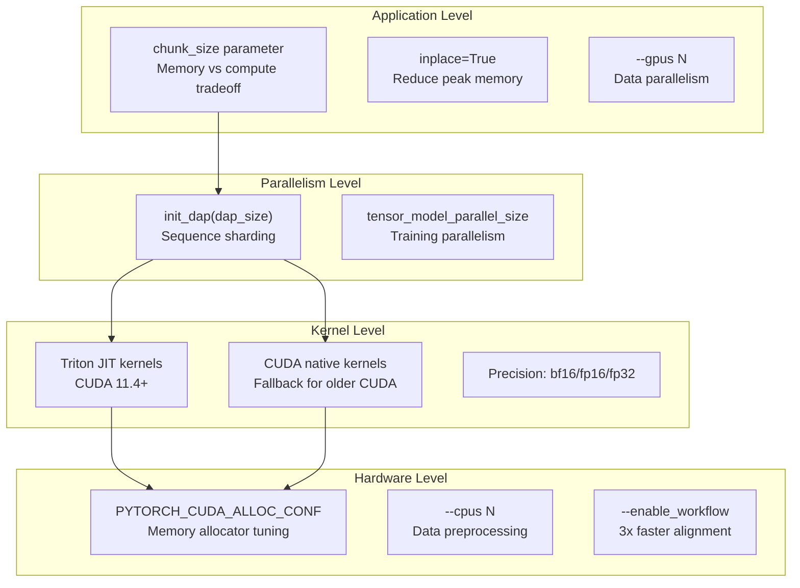
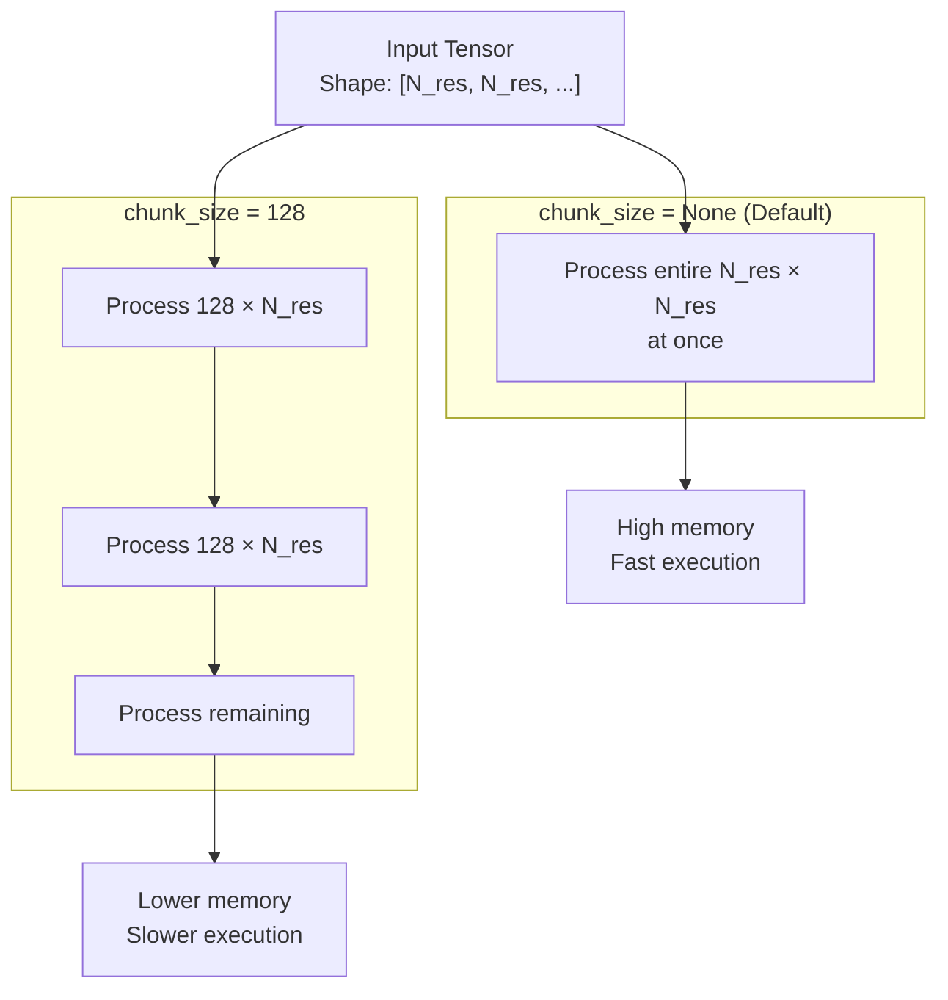
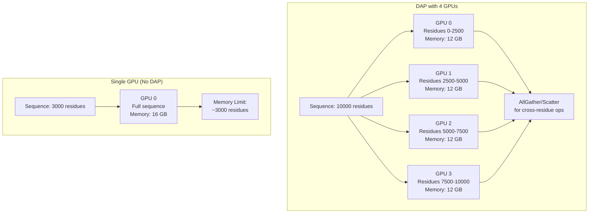
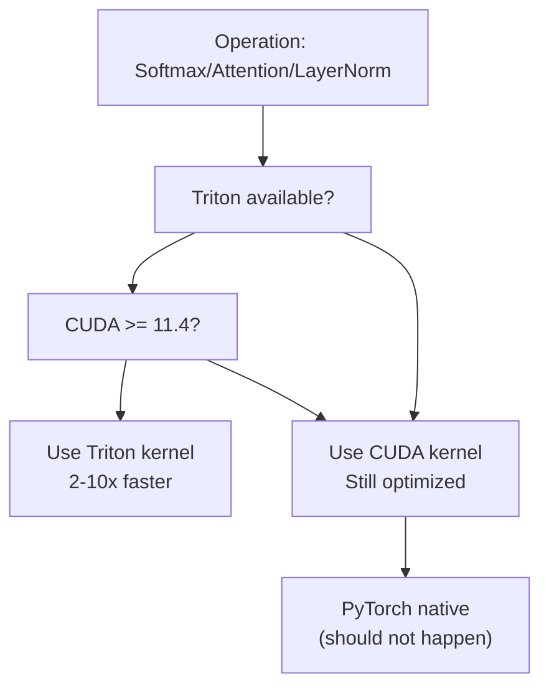
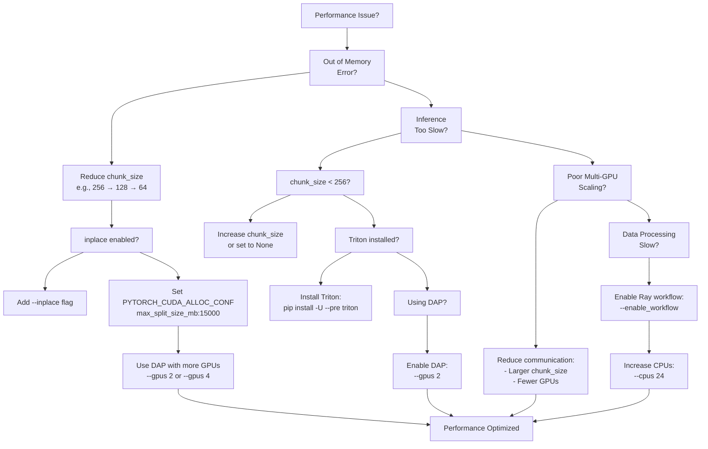

# Performance Tuning Guide

> **Relevant source files**
> * [LICENSE](https://github.com/hpcaitech/FastFold/blob/eba49680/LICENSE)
> * [README.md](https://github.com/hpcaitech/FastFold/blob/eba49680/README.md?plain=1)
> * [benchmark/perf.py](https://github.com/hpcaitech/FastFold/blob/eba49680/benchmark/perf.py)
> * [environment.yml](https://github.com/hpcaitech/FastFold/blob/eba49680/environment.yml)
> * [fastfold/config.py](https://github.com/hpcaitech/FastFold/blob/eba49680/fastfold/config.py)
> * [fastfold/distributed/__init__.py](https://github.com/hpcaitech/FastFold/blob/eba49680/fastfold/distributed/__init__.py)
> * [fastfold/distributed/comm.py](https://github.com/hpcaitech/FastFold/blob/eba49680/fastfold/distributed/comm.py)
> * [fastfold/distributed/core.py](https://github.com/hpcaitech/FastFold/blob/eba49680/fastfold/distributed/core.py)
> * [fastfold/model/__init__.py](https://github.com/hpcaitech/FastFold/blob/eba49680/fastfold/model/__init__.py)
> * [fastfold/model/fastnn/kernel/layer_norm.py](https://github.com/hpcaitech/FastFold/blob/eba49680/fastfold/model/fastnn/kernel/layer_norm.py)
> * [fastfold/relax/relax.py](https://github.com/hpcaitech/FastFold/blob/eba49680/fastfold/relax/relax.py)
> * [fastfold/relax/utils.py](https://github.com/hpcaitech/FastFold/blob/eba49680/fastfold/relax/utils.py)
> * [inference.py](https://github.com/hpcaitech/FastFold/blob/eba49680/inference.py)

## Purpose and Scope

This guide provides practical recommendations for optimizing FastFold's performance across different hardware configurations and workloads. It covers memory management, multi-GPU parallelism, kernel selection, and hardware-specific optimizations for both inference and training workflows.

For basic usage instructions, see [Quick Start: Inference](/hpcaitech/FastFold/2.2-quick-start:-inference) and [Quick Start: Training](/hpcaitech/FastFold/2.3-quick-start:-training). For detailed architecture of the optimization systems, see [Performance Optimizations](/hpcaitech/FastFold/8-performance-optimizations) and its subsections.

---

## Performance Optimization Hierarchy

FastFold's performance optimizations operate at four distinct levels, each addressing different bottlenecks. Understanding this hierarchy helps prioritize tuning efforts based on your specific constraints.



**Optimization Priority**: Start with application-level parameters (`chunk_size`, `--gpus`), then configure parallelism (DAP), and finally tune hardware-specific settings.

**Sources**: [README.md L19-L29](https://github.com/hpcaitech/FastFold/blob/eba49680/README.md?plain=1#L19-L29)

 [inference.py L117-L140](https://github.com/hpcaitech/FastFold/blob/eba49680/inference.py#L117-L140)

 [fastfold/config.py L115-L125](https://github.com/hpcaitech/FastFold/blob/eba49680/fastfold/config.py#L115-L125)

---

## Memory Management

### Chunk Size Configuration

The `chunk_size` parameter controls the granularity of tensor processing, trading compute efficiency for memory consumption. It is the single most important parameter for handling long sequences or limited GPU memory.

#### What is Chunk Size?

`chunk_size` determines how many residues are processed simultaneously in attention and triangle operations. Smaller values reduce peak memory at the cost of increased computation time due to repeated overhead.



**Sources**: [inference.py L117](https://github.com/hpcaitech/FastFold/blob/eba49680/inference.py#L117-L117)

 [inference.py L130-L131](https://github.com/hpcaitech/FastFold/blob/eba49680/inference.py#L130-L131)

 [fastfold/config.py L134](https://github.com/hpcaitech/FastFold/blob/eba49680/fastfold/config.py#L134-L134)

#### Selecting Chunk Size

Use this table to select an appropriate `chunk_size` based on sequence length and GPU memory:

| Sequence Length | GPU Memory | Recommended `chunk_size` | Expected Memory Usage | Notes |
| --- | --- | --- | --- | --- |
| ≤ 1000 | 16 GB | `None` (default) | ~10-12 GB | Fastest, no chunking overhead |
| 1000-3000 | 16 GB | `None` | ~14-16 GB | May require `--inplace` |
| 1000-3000 | 24 GB | `None` | ~14-16 GB | Comfortable headroom |
| 3000-5000 | 24 GB | `256` | ~20-22 GB | Moderate slowdown |
| 5000-8000 | 40 GB | `128` | ~32-38 GB | Requires A100 40GB |
| 8000-10000 | 80 GB | `64` | ~55-65 GB | Requires A100 80GB + settings |
| > 10000 | 80 GB | `32-64` + DAP | Variable | Requires DAP parallelism |

**Configuration Examples**:

```javascript
# Inference with chunk_size for 5000 residue sequencepython inference.py target.fasta mmcif_dir/ \    --chunk_size 128 \    --gpus 1 \    --output_dir outputs/ # For extreme sequences (8000+ residues), also set memory allocatorexport PYTORCH_CUDA_ALLOC_CONF=max_split_size_mb:15000python inference.py target.fasta mmcif_dir/ \    --chunk_size 64 \    --inplace \    --gpus 1 \    --output_dir outputs/
```

**In-Code Configuration**:

```javascript
from fastfold.config import model_config config = model_config("model_1")config.globals.chunk_size = 128  # Set custom chunk size
```

**Sources**: [inference.py L117](https://github.com/hpcaitech/FastFold/blob/eba49680/inference.py#L117-L117)

 [inference.py L130-L131](https://github.com/hpcaitech/FastFold/blob/eba49680/inference.py#L130-L131)

 [README.md L141-L164](https://github.com/hpcaitech/FastFold/blob/eba49680/README.md?plain=1#L141-L164)

 [fastfold/config.py L134](https://github.com/hpcaitech/FastFold/blob/eba49680/fastfold/config.py#L134-L134)

#### Chunking Implementation Details

FastFold implements adaptive chunking for large tensors automatically in certain operations. For example, the fused layer normalization kernel chunks inputs exceeding 4000 elements along the batch/sequence dimension:

[fastfold/model/fastnn/kernel/layer_norm.py L37-L52](https://github.com/hpcaitech/FastFold/blob/eba49680/fastfold/model/fastnn/kernel/layer_norm.py#L37-L52)

This automatic chunking prevents out-of-memory errors while maintaining numerical precision.

**Sources**: [fastfold/model/fastnn/kernel/layer_norm.py L19-L61](https://github.com/hpcaitech/FastFold/blob/eba49680/fastfold/model/fastnn/kernel/layer_norm.py#L19-L61)

### Inplace Operations

The `--inplace` flag enables in-place tensor updates, reducing peak memory consumption by reusing buffers instead of allocating new ones.

**When to Enable**:

* Long sequences (> 2000 residues) on limited memory GPUs
* When `chunk_size` alone is insufficient
* Training with large batch sizes

**Configuration**:

```markdown
# Inference with inplace optimizationpython inference.py target.fasta mmcif_dir/ \    --inplace \    --chunk_size 128 \    --output_dir outputs/
```

**In-Code Configuration**:

```
config = model_config("model_1")config.globals.inplace = True
```

**Memory Savings**: Typically 15-25% reduction in peak memory usage, enabling inference on sequences 20-30% longer on the same hardware.

**Sources**: [inference.py L119](https://github.com/hpcaitech/FastFold/blob/eba49680/inference.py#L119-L119)

 [inference.py L136](https://github.com/hpcaitech/FastFold/blob/eba49680/inference.py#L136-L136)

 [README.md L139](https://github.com/hpcaitech/FastFold/blob/eba49680/README.md?plain=1#L139-L139)

---

## Multi-GPU Scaling

### Dynamic Axial Parallelism (DAP)

DAP shards sequences along the residue axis across multiple GPUs, enabling ultra-long sequence inference (10,000+ residues) that would be impossible on a single GPU.

#### How DAP Works



**Sources**: [README.md L22-L24](https://github.com/hpcaitech/FastFold/blob/eba49680/README.md?plain=1#L22-L24)

 [fastfold/distributed/core.py L17-L41](https://github.com/hpcaitech/FastFold/blob/eba49680/fastfold/distributed/core.py#L17-L41)

#### Configuring DAP for Inference

DAP is initialized via `fastfold.distributed.init_dap()` and configured through environment variables or the `--gpus` argument in `inference.py`.

**Basic Usage**:

```markdown
# 2-GPU DAP inferencepython inference.py target.fasta mmcif_dir/ \    --gpus 2 \    --chunk_size 128 \    --output_dir outputs/ \    [other args...]
```

The `--gpus N` parameter triggers `torch.multiprocessing.spawn` with N processes, each calling `init_dap()` internally:

[inference.py L122-L127](https://github.com/hpcaitech/FastFold/blob/eba49680/inference.py#L122-L127)

**Manual DAP Initialization** (for custom code):

```javascript
import osfrom fastfold.distributed import init_dap # Set distributed environmentos.environ['WORLD_SIZE'] = '4'os.environ['RANK'] = str(rank)os.environ['LOCAL_RANK'] = str(rank) # Initialize DAP with 4 GPUsinit_dap(tensor_model_parallel_size_=4)
```

**Sources**: [inference.py L122-L128](https://github.com/hpcaitech/FastFold/blob/eba49680/inference.py#L122-L128)

 [fastfold/distributed/core.py L17-L41](https://github.com/hpcaitech/FastFold/blob/eba49680/fastfold/distributed/core.py#L17-L41)

#### DAP Performance Characteristics

| GPUs | Sequence Length Limit | Speedup vs 1 GPU | Communication Overhead | Recommended For |
| --- | --- | --- | --- | --- |
| 1 | ~3000 residues | 1.0x | 0% | Standard proteins |
| 2 | ~6000 residues | 1.8x | ~10% | Long sequences |
| 4 | ~12000 residues | 3.2x | ~20% | Ultra-long sequences |
| 8 | ~24000 residues | 5.5x | ~30% | Massive complexes |

**Communication Overhead**: DAP requires `AllGather` and `Scatter` operations for cross-residue interactions (triangle operations, pair representations). Overhead increases with GPU count but is offset by parallelism gains.

**Sources**: [README.md L22-L29](https://github.com/hpcaitech/FastFold/blob/eba49680/README.md?plain=1#L22-L29)

#### DAP Training Configuration

For training, DAP is configured through ColossalAI's parallel config:

```javascript
import colossalai config = {    "parallel": {        "tensor": {            "size": 4  # 4-way tensor parallelism        }    }} colossalai.launch_from_torch(config=config)
```

The `init_dap()` function wraps this initialization:

[fastfold/distributed/core.py L39-L40](https://github.com/hpcaitech/FastFold/blob/eba49680/fastfold/distributed/core.py#L39-L40)

**Sources**: [fastfold/distributed/core.py L17-L41](https://github.com/hpcaitech/FastFold/blob/eba49680/fastfold/distributed/core.py#L17-L41)

### Number of GPUs

#### Inference: Data Parallelism

For inference, multiple GPUs operate independently on different sequences (data parallelism via `torch.multiprocessing.spawn`):

```markdown
# 4 GPUs processing different sequences in parallelpython inference.py sequences.fasta mmcif_dir/ \    --gpus 4 \    --output_dir outputs/
```

Each process loads the full model and processes inputs independently. Synchronization occurs only at the end via `torch.distributed.barrier`:

[inference.py L158-L159](https://github.com/hpcaitech/FastFold/blob/eba49680/inference.py#L158-L159)

**Scaling Efficiency**: Near-linear for multiple sequences. For single sequences, use DAP instead.

**Sources**: [inference.py L122-L160](https://github.com/hpcaitech/FastFold/blob/eba49680/inference.py#L122-L160)

#### Training: Tensor Parallelism

Training uses tensor model parallelism through ColossalAI, which shards model parameters across GPUs:

[fastfold/distributed/core.py L39-L40](https://github.com/hpcaitech/FastFold/blob/eba49680/fastfold/distributed/core.py#L39-L40)

**Sources**: [fastfold/distributed/core.py L17-L41](https://github.com/hpcaitech/FastFold/blob/eba49680/fastfold/distributed/core.py#L17-L41)

---

## Kernel Selection and Precision

### Triton vs CUDA Kernels

FastFold implements critical operations (softmax, attention, layer norm) in both Triton (JIT-compiled) and CUDA (native) for maximum compatibility.

#### Kernel Selection Logic



**Sources**: [fastfold/model/fastnn/kernel/layer_norm.py L9-L16](https://github.com/hpcaitech/FastFold/blob/eba49680/fastfold/model/fastnn/kernel/layer_norm.py#L9-L16)

 [README.md L54-L60](https://github.com/hpcaitech/FastFold/blob/eba49680/README.md?plain=1#L54-L60)

#### Installing Triton for Maximum Performance

Triton requires CUDA 11.4 or higher:

```markdown
# Check CUDA versionnvcc --version # Install Triton (CUDA 11.4+ only)pip install -U --pre triton
```

**Performance Impact**: Triton kernels provide 2-10x speedup for individual operations compared to PyTorch native implementations. The automatic fallback ensures compatibility but sacrifices performance.

**Sources**: [README.md L54-L60](https://github.com/hpcaitech/FastFold/blob/eba49680/README.md?plain=1#L54-L60)

 [fastfold/model/fastnn/kernel/layer_norm.py L9-L16](https://github.com/hpcaitech/FastFold/blob/eba49680/fastfold/model/fastnn/kernel/layer_norm.py#L9-L16)

### Precision Selection

FastFold supports three precision modes: `bfloat16`, `float16`, and `float32`.

#### Precision Comparison

| Precision | Memory | Speed | Numerical Stability | Hardware Requirement | Recommended For |
| --- | --- | --- | --- | --- | --- |
| `bfloat16` | 50% of fp32 | ~2x faster | Excellent (wider range) | NVIDIA Ampere+ (A100, A6000) | Inference, training |
| `float16` | 50% of fp32 | ~2x faster | Good (careful tuning needed) | NVIDIA Volta+ (V100, T4) | Inference, DAP |
| `float32` | Baseline | Baseline | Perfect | All GPUs | Debugging, verification |

#### Configuration

**Automatic Precision Selection** (PyTorch 1.12+):

FastFold enables TF32 mode automatically on compatible hardware:

[inference.py L47-L48](https://github.com/hpcaitech/FastFold/blob/eba49680/inference.py#L47-L48)

**Manual Precision** (for custom code):

```javascript
import torch # Use bfloat16 on Ampere GPUsprecision = torch.bfloat16model = model.to(dtype=precision)inputs = {k: v.to(dtype=precision) for k, v in inputs.items()} # Note: DAP with multiple GPUs currently requires float16if dap_size > 1:    precision = torch.float16  # PyTorch all2all limitation
```

**Sources**: [inference.py L47-L48](https://github.com/hpcaitech/FastFold/blob/eba49680/inference.py#L47-L48)

 [benchmark/perf.py L39-L42](https://github.com/hpcaitech/FastFold/blob/eba49680/benchmark/perf.py#L39-L42)

#### DAP Precision Constraint

Due to a PyTorch limitation, `AllToAll` communication (used in DAP) does not support `bfloat16`. When using DAP with multiple GPUs, use `float16`:

[benchmark/perf.py L39-L42](https://github.com/hpcaitech/FastFold/blob/eba49680/benchmark/perf.py#L39-L42)

**Sources**: [benchmark/perf.py L39-L42](https://github.com/hpcaitech/FastFold/blob/eba49680/benchmark/perf.py#L39-L42)

---

## Hardware-Specific Tuning

### GPU Memory Allocation

For extreme sequences (8000+ residues), configure PyTorch's CUDA memory allocator to handle fragmentation:

```javascript
# Increase max split size to 15 GBexport PYTORCH_CUDA_ALLOC_CONF=max_split_size_mb:15000 python inference.py target.fasta mmcif_dir/ \    --chunk_size 64 \    --inplace \    --gpus 1 \    --output_dir outputs/
```

**What This Does**: Allows PyTorch to allocate larger contiguous blocks, preventing fragmentation-related OOM errors. The default is `max_split_size_mb=524` (512 MB).

**When to Use**: Sequences > 8000 residues, repeated OOM errors despite sufficient total memory.

**Sources**: [README.md L146](https://github.com/hpcaitech/FastFold/blob/eba49680/README.md?plain=1#L146-L146)

### CPU Configuration for Data Processing

Data preprocessing (MSA generation, template search) is CPU-intensive and parallelizable. The `--cpus` parameter controls the number of threads for bioinformatics tools:

```markdown
# Use 24 CPU cores for jackhmmer, hhblits, etc.python inference.py target.fasta mmcif_dir/ \    --cpus 24 \    --enable_workflow \  # Ray acceleration    [other args...]
```

**Default**: 12 CPUs ([inference.py L527-L529](https://github.com/hpcaitech/FastFold/blob/eba49680/inference.py#L527-L529)

)

**Optimal Setting**: Set to the number of physical CPU cores available. Hyperthreading provides minimal benefit for alignment tools.

**Sources**: [inference.py L526-L529](https://github.com/hpcaitech/FastFold/blob/eba49680/inference.py#L526-L529)

### Ray Workflow Acceleration

Enable Ray-based distributed data processing for 3x speedup on monomers and 3Nx speedup on multimers (N = number of chains):

```
python inference.py target.fasta mmcif_dir/ \    --enable_workflow \    --cpus 24 \    [other args...]
```

**When to Enable**: Always, unless debugging data pipeline issues.

**Sources**: [README.md L138](https://github.com/hpcaitech/FastFold/blob/eba49680/README.md?plain=1#L138-L138)

 [inference.py L118](https://github.com/hpcaitech/FastFold/blob/eba49680/inference.py#L118-L118)

---

## Benchmarking and Profiling

### Using the Performance Benchmark

FastFold includes a standalone Evoformer benchmark in `benchmark/perf.py`:

```markdown
# Benchmark single GPUcd benchmarktorchrun --nproc_per_node=1 perf.py \    --msa-length 128 \    --res-length 256 # Benchmark DAP with 2 GPUstorchrun --nproc_per_node=2 perf.py \    --msa-length 128 \    --res-length 256 \    --dap-size 2 # Forward-only benchmarktorchrun --nproc_per_node=1 perf.py \    --msa-length 128 \    --res-length 256 \    --fwd
```

**Key Parameters**:

* `--msa-length`: MSA depth (default: 132)
* `--res-length`: Sequence length (default: 256)
* `--layers`: Number of Evoformer blocks (default: 12)
* `--trials`: Measurement trials (default: 50)
* `--warmup-trials`: Warmup iterations (default: 5)

**Output**: Reports per-layer forward/backward time in milliseconds.

**Sources**: [benchmark/perf.py L1-L188](https://github.com/hpcaitech/FastFold/blob/eba49680/benchmark/perf.py#L1-L188)

 [README.md L201-L221](https://github.com/hpcaitech/FastFold/blob/eba49680/README.md?plain=1#L201-L221)

### PyTorch Profiler Integration

Enable profiling with the `--prof` flag:

```
cd benchmarktorchrun --nproc_per_node=1 perf.py \    --msa-length 128 \    --res-length 256 \    --prof
```

Profiling output is saved to `./log/fastfold/` and can be visualized with TensorBoard:

```
tensorboard --logdir=./log/fastfold
```

**Sources**: [benchmark/perf.py L122-L169](https://github.com/hpcaitech/FastFold/blob/eba49680/benchmark/perf.py#L122-L169)

### Key Metrics to Track

| Metric | Target | How to Measure | Improvement Strategies |
| --- | --- | --- | --- |
| **Inference Time** | < 5 min for 500-res | `time python inference.py ...` | Reduce `chunk_size`, enable DAP |
| **Peak Memory** | < 80% GPU capacity | `nvidia-smi` during run | Increase `chunk_size`, enable `--inplace` |
| **GPU Utilization** | > 85% | `nvidia-smi dmon` | Reduce chunking, use Triton kernels |
| **Multi-GPU Efficiency** | > 75% linear scaling | Compare N-GPU vs 1-GPU time | Minimize communication (larger chunk_size) |
| **Data Processing Time** | < 20 min for monomer | Logs from `inference.py` | Enable `--enable_workflow`, increase `--cpus` |

---

## Performance Tuning Decision Tree

Use this flowchart to systematically optimize performance based on your constraints:



**Sources**: [README.md L141-L164](https://github.com/hpcaitech/FastFold/blob/eba49680/README.md?plain=1#L141-L164)

 [inference.py L117-L140](https://github.com/hpcaitech/FastFold/blob/eba49680/inference.py#L117-L140)

---

## Common Performance Bottlenecks

### Out of Memory (OOM) Errors

**Symptoms**:

```yaml
RuntimeError: CUDA out of memory. Tried to allocate X.XX GiB
```

**Solutions** (in order of preference):

1. **Reduce `chunk_size`**: ```markdown python inference.py ... --chunk_size 128  # Try 128, 64, 32 ```
2. **Enable inplace operations**: ``` python inference.py ... --inplace ```
3. **Configure memory allocator**: ```javascript export PYTORCH_CUDA_ALLOC_CONF=max_split_size_mb:15000python inference.py ... ```
4. **Use DAP multi-GPU sharding**: ``` python inference.py ... --gpus 2 --chunk_size 128 ```

**Sources**: [README.md L141-L164](https://github.com/hpcaitech/FastFold/blob/eba49680/README.md?plain=1#L141-L164)

### Slow Inference

**Symptoms**: Inference takes > 10 minutes for 500-residue protein.

**Diagnostics**:

```markdown
# Time inferencetime python inference.py ...  # Monitor GPU utilizationnvidia-smi dmon -s u -d 1
```

**Solutions**:

1. **Increase `chunk_size`** (if memory permits): ```markdown python inference.py ... --chunk_size 256  # or None ```
2. **Install Triton** for kernel acceleration: ``` pip install -U --pre triton ```
3. **Enable DAP** for large sequences: ``` python inference.py ... --gpus 2 ```
4. **Verify CUDA version** (should be 11.3+): ``` nvcc --version ```

**Sources**: [README.md L54-L60](https://github.com/hpcaitech/FastFold/blob/eba49680/README.md?plain=1#L54-L60)

 [inference.py L130-L131](https://github.com/hpcaitech/FastFold/blob/eba49680/inference.py#L130-L131)

### Poor Multi-GPU Scaling

**Symptoms**: 2 GPUs only 1.3x faster than 1 GPU (expected: ~1.8x).

**Diagnostics**:

```markdown
# Compare scalingpython inference.py ... --gpus 1  # Measure timepython inference.py ... --gpus 2  # Measure time
```

**Causes and Solutions**:

1. **High communication overhead**: Increase `chunk_size` to reduce AllGather/Scatter frequency
2. **Load imbalance**: Ensure sequence length is divisible by number of GPUs
3. **Insufficient work**: Use DAP only for sequences > 2000 residues

**Sources**: [fastfold/distributed/comm.py L1-L204](https://github.com/hpcaitech/FastFold/blob/eba49680/fastfold/distributed/comm.py#L1-L204)

### Data Processing Bottleneck

**Symptoms**: Alignment generation takes > 30 minutes.

**Solutions**:

1. **Enable Ray workflow** (3x speedup): ``` python inference.py ... --enable_workflow ```
2. **Increase CPU allocation**: ``` python inference.py ... --cpus 32 ```
3. **Use precomputed alignments**: ``` python inference.py ... --use_precomputed_alignments /path/to/alignments/ ```

**Sources**: [README.md L138](https://github.com/hpcaitech/FastFold/blob/eba49680/README.md?plain=1#L138-L138)

 [inference.py L118](https://github.com/hpcaitech/FastFold/blob/eba49680/inference.py#L118-L118)

 [inference.py L501-L505](https://github.com/hpcaitech/FastFold/blob/eba49680/inference.py#L501-L505)

---

## Hardware-Specific Recommendations

### NVIDIA A100 (80 GB)

**Optimal Configuration**:

```javascript
export PYTORCH_CUDA_ALLOC_CONF=max_split_size_mb:15000 python inference.py target.fasta mmcif_dir/ \    --chunk_size 64 \    --inplace \    --gpus 1 \    --enable_workflow \    --cpus 32 \    --output_dir outputs/
```

**Capabilities**: Supports sequences up to 10,000 residues with bf16 precision.

### NVIDIA V100 (16/32 GB)

**Optimal Configuration**:

```markdown
python inference.py target.fasta mmcif_dir/ \    --chunk_size 128 \    --inplace \    --gpus 2 \  # Use DAP for sequences > 2000    --enable_workflow \    --output_dir outputs/
```

**Note**: V100 does not support `bfloat16`; use `float16` instead.

### NVIDIA T4 (16 GB)

**Optimal Configuration**:

```
python inference.py target.fasta mmcif_dir/ \    --chunk_size 256 \    --inplace \    --gpus 1 \    --enable_workflow \    --output_dir outputs/
```

**Limitations**: Sequences > 2000 residues require DAP with multiple T4s.

### Intel Habana Gaudi/Gaudi2

For Habana-specific optimization, see [Habana Platform Support](/hpcaitech/FastFold/9.3-habana-platform-support).

**Sources**: [README.md L189-L199](https://github.com/hpcaitech/FastFold/blob/eba49680/README.md?plain=1#L189-L199)

---

**Summary**: Performance tuning in FastFold is a multi-level optimization process. Start with `chunk_size` and `--inplace` for memory management, enable DAP for ultra-long sequences, install Triton for kernel acceleration, and configure hardware-specific settings as needed. Use the benchmark suite to validate improvements and the decision tree to systematically address bottlenecks.