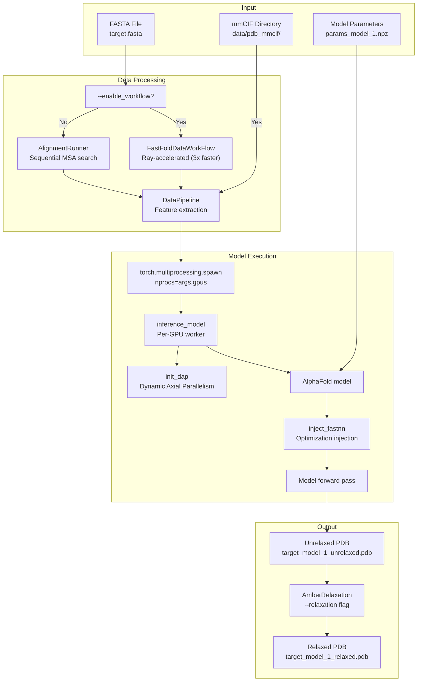
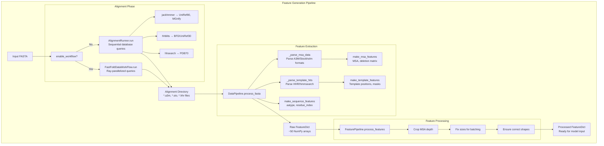

# Quick Start: Inference

> **Relevant source files**
> - [README\.md](https://github.com/hpcaitech/FastFold/blob/eba49680/README.md?plain=1)
> - [environment\.yml](https://github.com/hpcaitech/FastFold/blob/eba49680/environment.yml)
> - [fastfold/common/protein\.py](https://github.com/hpcaitech/FastFold/blob/eba49680/fastfold/common/protein.py)
> - [fastfold/data/data\_pipeline\.py](https://github.com/hpcaitech/FastFold/blob/eba49680/fastfold/data/data_pipeline.py)
> - [fastfold/utils/import\_weights\.py](https://github.com/hpcaitech/FastFold/blob/eba49680/fastfold/utils/import_weights.py)
> - [inference\.py](https://github.com/hpcaitech/FastFold/blob/eba49680/inference.py)

 This page provides a step\-by\-step guide to running protein structure prediction using FastFold's inference pipeline\. It covers the `inference.py` script, command\-line options, execution modes, and performance optimizations\. This guide focuses on practical usage for predicting protein structures from FASTA sequences\.

 For detailed information about the data processing pipeline, see [Data Processing Pipeline](https://deepwiki.com/hpcaitech/FastFold/4-data-processing-pipeline)\. For training workflows, see [Quick Start: Training](https://deepwiki.com/hpcaitech/FastFold/2.3-quick-start:-training)\. For advanced inference features like DAP configuration, see [Distributed Inference Execution](https://deepwiki.com/hpcaitech/FastFold/5.2-distributed-inference-execution)\.

---

## Overview

 FastFold's inference pipeline transforms amino acid sequences \(FASTA format\) into 3D protein structure predictions \(PDB format\) through four main stages:

 1. **MSA and Template Search**: Query biological databases to find homologous sequences and structural templates
2. **Feature Generation**: Convert alignment and template data into numerical features
3. **Model Execution**: Run the AlphaFold neural network with FastFold optimizations
4. **Structure Output**: Generate PDB files with optional energy minimization

 The system supports both monomer and multimer prediction modes, with optional Ray workflow acceleration for 3x faster data preprocessing\.

 Sources: [inference\.py L1-L557](https://github.com/hpcaitech/FastFold/blob/eba49680/inference.py#L1-L557) [README\.md?plain=1 L102-L187](https://github.com/hpcaitech/FastFold/blob/eba49680/README.md?plain=1#L102-L187)

---

## Prerequisites

 Before running inference, ensure you have:

 1. **Installed FastFold** with all dependencies \(see [Installation](https://deepwiki.com/hpcaitech/FastFold/2.1-installation)\)
2. **Downloaded databases** for alignment searches: - UniRef90, MGnify, BFD/UniRef30, PDB70 \(monomer\) - Additional UniProt, PDB seqres \(multimer\)
3. **Downloaded model parameters** \(`.npz` files from DeepMind\)
4. **Prepared input**: FASTA file with one \(monomer\) or multiple \(multimer\) sequences
5. **Template mmCIF directory**: PDB structures for template search

 **Optional but recommended**: Install Triton for optimized kernels \(requires CUDA 11\.4\+\):

```
pip install -U --pre triton
```

 Sources: [README\.md?plain=1 L31-L60](https://github.com/hpcaitech/FastFold/blob/eba49680/README.md?plain=1#L31-L60) [environment\.yml L1-L33](https://github.com/hpcaitech/FastFold/blob/eba49680/environment.yml#L1-L33)

---

## Basic Usage Workflow



 **Basic Inference Workflow**: The pipeline accepts FASTA input and optional workflow acceleration, generates features via `DataPipeline`, distributes execution across GPUs using `torch.multiprocessing.spawn`, runs the optimized model, and outputs PDB structures\.

 Sources: [inference\.py L162-L167](https://github.com/hpcaitech/FastFold/blob/eba49680/inference.py#L162-L167) [inference\.py L340-L481](https://github.com/hpcaitech/FastFold/blob/eba49680/inference.py#L340-L481)

---

## Command\-Line Interface

 The `inference.py` script is invoked with positional and optional arguments:

```
python inference.py <fasta_path> <template_mmcif_dir> [OPTIONS]
```

### Required Arguments

| Argument | Description |
| --- | --- |
| fasta\_path | Path to input FASTA file \(monomer: 1 sequence, multimer: multiple sequences separated by \>\) |
| template\_mmcif\_dir | Directory containing mmCIF template structures \(e\.g\., data/pdb\_mmcif/mmcif\_files/\) |

### Key Optional Arguments

| Argument | Default | Description |
| --- | --- | --- |
| \-\-output\_dir | Current directory | Output directory for results |
| \-\-model\_name | model\_1 | Model configuration: model\_1 through model\_5, \*\_ptm, or \*\_multimer |
| \-\-param\_path | Auto\-detected | Path to \.npz parameter file |
| \-\-model\_preset | monomer | Execution mode: monomer or multimer |
| \-\-gpus | 1 | Number of GPUs for distributed inference |
| \-\-cpus | 12 | Number of CPUs for alignment tools |

### Database Paths

| Argument | Required For |
| --- | --- |
| \-\-uniref90\_database\_path | All modes |
| \-\-mgnify\_database\_path | All modes |
| \-\-bfd\_database\_path | All modes |
| \-\-uniref30\_database\_path | Full databases \(preset=full\_dbs\) |
| \-\-pdb70\_database\_path | Monomer template search |
| \-\-uniprot\_database\_path | Multimer MSA pairing |
| \-\-pdb\_seqres\_database\_path | Multimer template search |

### Tool Binary Paths

| Argument | Default | Tool |
| --- | --- | --- |
| \-\-jackhmmer\_binary\_path | /usr/bin/jackhmmer | Sequence search \(UniRef90, MGnify, small BFD, UniProt\) |
| \-\-hhblits\_binary\_path | /usr/bin/hhblits | Profile search \(BFD/UniRef30\) |
| \-\-hhsearch\_binary\_path | /usr/bin/hhsearch | Template search \(PDB70, monomer\) |
| \-\-hmmsearch\_binary\_path | hmmsearch | Template search \(PDB seqres, multimer\) |
| \-\-kalign\_binary\_path | /usr/bin/kalign | Sequence realignment |

### Performance Optimization Flags

| Argument | Effect |
| --- | --- |
| \-\-enable\_workflow | Use Ray workflow for 3x faster data preprocessing |
| \-\-inplace | Enable inplace operations to reduce memory usage |
| \-\-chunk\_size N | Process large tensors in chunks \(smaller N = less memory, slower speed\) |

 Sources: [inference\.py L491-L556](https://github.com/hpcaitech/FastFold/blob/eba49680/inference.py#L491-L556) [inference\.py L68-L120](https://github.com/hpcaitech/FastFold/blob/eba49680/inference.py#L68-L120)

---

## Execution Modes

### Monomer Mode

 Predicts structure for a single polypeptide chain\.

 **Example Command**:

```
python inference.py target.fasta data/pdb_mmcif/mmcif_files/ \    --output_dir ./outputs/ \    --gpus 2 \    --model_name model_1 \    --param_path data/params/params_model_1.npz \    --uniref90_database_path data/uniref90/uniref90.fasta \    --mgnify_database_path data/mgnify/mgy_clusters_2022_05.fa \    --pdb70_database_path data/pdb70/pdb70 \    --bfd_database_path data/bfd/bfd_metaclust_clu_complete_id30_c90_final_seq.sorted_opt \    --uniref30_database_path data/uniref30/UniRef30_2021_03 \    --jackhmmer_binary_path $(which jackhmmer) \    --hhblits_binary_path $(which hhblits) \    --hhsearch_binary_path $(which hhsearch) \    --kalign_binary_path $(which kalign) \    --enable_workflow \    --inplace
```

 **Shell Script Alternative**: Use the provided script with customizable parameters:

```
./inference.sh
```

 **Workflow** \(see [inference\.py L340-L489](https://github.com/hpcaitech/FastFold/blob/eba49680/inference.py#L340-L489)\):

 1. Parse single FASTA sequence \([inference\.py L378-L381](https://github.com/hpcaitech/FastFold/blob/eba49680/inference.py#L378-L381)\)
2. Run alignment with `AlignmentRunner` or `FastFoldDataWorkFlow` \([inference\.py L396-L426](https://github.com/hpcaitech/FastFold/blob/eba49680/inference.py#L396-L426)\)
3. Process features with `DataPipeline.process_fasta` \([inference\.py L428-L429](https://github.com/hpcaitech/FastFold/blob/eba49680/inference.py#L428-L429)\)
4. Apply `FeaturePipeline.process_features` \([inference\.py L434-L437](https://github.com/hpcaitech/FastFold/blob/eba49680/inference.py#L434-L437)\)
5. Spawn multi\-GPU inference with `torch.multiprocessing.spawn` \([inference\.py L443](https://github.com/hpcaitech/FastFold/blob/eba49680/inference.py#L443-L443)\)
6. Output unrelaxed/relaxed PDB \([inference\.py L459-L480](https://github.com/hpcaitech/FastFold/blob/eba49680/inference.py#L459-L480)\)

 Sources: [inference\.py L340-L489](https://github.com/hpcaitech/FastFold/blob/eba49680/inference.py#L340-L489) [README\.md?plain=1 L115-L136](https://github.com/hpcaitech/FastFold/blob/eba49680/README.md?plain=1#L115-L136)

### Multimer Mode

 Predicts structure for protein complexes with multiple chains\.

 **Example Command**:

```
python inference.py target.fasta data/pdb_mmcif/mmcif_files/ \    --output_dir ./outputs/ \    --gpus 2 \    --model_preset multimer \    --model_name model_1_multimer \    --param_path data/params/params_model_1_multimer.npz \    --uniref90_database_path data/uniref90/uniref90.fasta \    --mgnify_database_path data/mgnify/mgy_clusters_2022_05.fa \    --bfd_database_path data/bfd/bfd_metaclust_clu_complete_id30_c90_final_seq.sorted_opt \    --uniref30_database_path data/uniref30/UniRef30_2021_03 \    --uniprot_database_path data/uniprot/uniprot.fasta \    --pdb_seqres_database_path data/pdb_seqres/pdb_seqres.txt \    --jackhmmer_binary_path $(which jackhmmer) \    --hhblits_binary_path $(which hhblits) \    --hmmsearch_binary_path $(which hmmsearch) \    --kalign_binary_path $(which kalign) \    --enable_workflow
```

 **Shell Script Alternative**:

```
./inference_multimer.sh
```

 **Multimer\-Specific Features**:

 - **MSA Pairing**: Captures co\-evolutionary signals between chains \([data\_pipeline\.py L1122-L1143](https://github.com/hpcaitech/FastFold/blob/eba49680/fastfold/data/data_pipeline.py#L1122-L1143)\)
- **Assembly Features**: Adds `entity_id`, `asym_id`, `sym_id` for chain relationships \([data\_pipeline\.py L727-L769](https://github.com/hpcaitech/FastFold/blob/eba49680/fastfold/data/data_pipeline.py#L727-L769)\)
- **Per\-Chain Processing**: Each chain aligned separately, then merged \([inference\.py L258-L277](https://github.com/hpcaitech/FastFold/blob/eba49680/inference.py#L258-L277)\)

 **FASTA Format** \(multimer\):

```
>chain_A
SEQUENCE_A
>chain_B
SEQUENCE_B
```

 Sources: [inference\.py L169-L338](https://github.com/hpcaitech/FastFold/blob/eba49680/inference.py#L169-L338) [README\.md?plain=1 L166-L187](https://github.com/hpcaitech/FastFold/blob/eba49680/README.md?plain=1#L166-L187)

---

## Performance Optimization Options

### Ray Workflow Acceleration

 Enable with `--enable_workflow` for **3x speedup on monomers, 3Nx speedup on multimers** \(N = number of chains\)\.

```
python inference.py target.fasta ... --enable_workflow
```

 **Implementation**:

 - Uses `FastFoldDataWorkFlow` \(monomer\) or `FastFoldMultimerDataWorkFlow` \(multimer\)
- Parallelizes database searches across Ray workers
- Reduces data preprocessing time from hours to minutes for large complexes

 Sources: [inference\.py L396-L412](https://github.com/hpcaitech/FastFold/blob/eba49680/inference.py#L396-L412) [inference\.py L185-L201](https://github.com/hpcaitech/FastFold/blob/eba49680/inference.py#L185-L201) [README\.md?plain=1 L138-L139](https://github.com/hpcaitech/FastFold/blob/eba49680/README.md?plain=1#L138-L139)

### Memory Management with Chunking

 For ultra\-long sequences \(\>3000 residues\), use `--chunk_size` to trade speed for memory:

```
python inference.py target.fasta ... --chunk_size 128
```

 **Memory Impact**:

 - Default \(`chunk_size=None`\): Full sequence processed at once
- `chunk_size=128`: Moderate memory reduction
- `chunk_size=64`: Lower memory, slower inference
- Smaller chunk\_size → less memory usage, slower computation

 **Extreme Sequences**: For 10,000\+ residues in bf16:

 - Requires ~61GB memory on NVIDIA A100 \(80GB\)
- Set environment variable: `export PYTORCH_CUDA_ALLOC_CONF=max_split_size_mb:15000`
- Use `--chunk_size 32` or lower

 Sources: [inference\.py L117](https://github.com/hpcaitech/FastFold/blob/eba49680/inference.py#L117-L117) [README\.md?plain=1 L141-L146](https://github.com/hpcaitech/FastFold/blob/eba49680/README.md?plain=1#L141-L146)

### Inplace Operations

 Enable with `--inplace` to reduce memory allocations:

```
python inference.py target.fasta ... --inplace
```

 **Effect**: Updates tensors in\-place during Evoformer execution, reducing peak memory by ~15\-20%\.

 Sources: [inference\.py L119](https://github.com/hpcaitech/FastFold/blob/eba49680/inference.py#L119-L119) [inference\.py L136](https://github.com/hpcaitech/FastFold/blob/eba49680/inference.py#L136-L136) [README\.md?plain=1 L139](https://github.com/hpcaitech/FastFold/blob/eba49680/README.md?plain=1#L139-L139)

### Multi\-GPU Distribution

 Specify number of GPUs with `--gpus N`:

```
python inference.py target.fasta ... --gpus 4
```

 **Distributed Strategy**:

 - Uses `torch.multiprocessing.spawn` with `nprocs=N` \([inference\.py L293](https://github.com/hpcaitech/FastFold/blob/eba49680/inference.py#L293-L293) [inference\.py L443](https://github.com/hpcaitech/FastFold/blob/eba49680/inference.py#L443-L443)\)
- Each GPU process runs independent inference with DAP initialization
- Synchronizes via `torch.distributed.barrier` \([inference\.py L158](https://github.com/hpcaitech/FastFold/blob/eba49680/inference.py#L158-L158)\)
- Results collected via multiprocessing Queue \([inference\.py L156](https://github.com/hpcaitech/FastFold/blob/eba49680/inference.py#L156-L156)\)

 Sources: [inference\.py L122-L160](https://github.com/hpcaitech/FastFold/blob/eba49680/inference.py#L122-L160) [inference\.py L291-L294](https://github.com/hpcaitech/FastFold/blob/eba49680/inference.py#L291-L294)

---

## Model Execution Details


 **inference\_model Worker Function**: Each GPU process initializes DAP, loads the model with JAX weights, injects FastFold optimizations, runs inference, and returns results via a Queue\.

 **Key Functions**:

| Function | Purpose | Location |
| --- | --- | --- |
| init\_dap\(\) | Initialize Dynamic Axial Parallelism for tensor model parallelism | inference\.py127 |
| model\_config\(\) | Load configuration preset \(e\.g\., model\_1, model\_1\_multimer\) | inference\.py129 |
| AlphaFold\(\) | Instantiate model architecture | inference\.py138 |
| import\_jax\_weights\_\(\) | Load DeepMind parameters from \.npz file | inference\.py139 |
| inject\_fastnn\(\) | Replace standard Evoformer with optimized FastNN variant | inference\.py141 |
| set\_chunk\_size\(\) | Configure global chunk size for memory management | inference\.py145 |

 **Configuration Options**:

 - `chunk_size`: Controls memory\-compute tradeoff \([inference\.py L130-L131](https://github.com/hpcaitech/FastFold/blob/eba49680/inference.py#L130-L131)\)
- `inplace`: Enables in\-place tensor operations \([inference\.py L136](https://github.com/hpcaitech/FastFold/blob/eba49680/inference.py#L136-L136)\)
- `is_multimer`: Switches between monomer/multimer architectures \([inference\.py L137](https://github.com/hpcaitech/FastFold/blob/eba49680/inference.py#L137-L137)\)

 Sources: [inference\.py L122-L160](https://github.com/hpcaitech/FastFold/blob/eba49680/inference.py#L122-L160) [import\_weights\.py L588-L609](https://github.com/hpcaitech/FastFold/blob/eba49680/fastfold/utils/import_weights.py#L588-L609) [fastfold/utils/inject\_fastnn\.py](https://github.com/hpcaitech/FastFold/blob/eba49680/fastfold/utils/inject_fastnn.py)

---

## Output Files

### Standard Outputs

 For a monomer with tag `my_protein` and model `model_1`:

| File | Description |
| --- | --- |
| my\_protein\_model\_1\_unrelaxed\.pdb | Raw model prediction in PDB format |
| my\_protein\_model\_1\_relaxed\.pdb | Energy\-minimized structure \(if \-\-relaxation enabled\) |
| my\_protein\_model\_1\.pkl | Full prediction dictionary with all outputs \(if \-\-save\_prediction\_result\) |

 For a multimer with chains A and B:

| File | Description |
| --- | --- |
| A\_and\_B\_model\_1\_multimer\_unrelaxed\.pdb | Unrelaxed complex structure |
| A\_and\_B\_model\_1\_multimer\_relaxed\.pdb | Relaxed complex structure |
| A\_and\_B\_model\_1\_multimer\.pkl | Full prediction results |

### Alignment Outputs

 Located in `<output_dir>/alignments/<tag>/`:

 **Monomer**:

 - `uniref90_hits.a3m`: UniRef90 MSA
- `mgnify_hits.a3m`: MGnify environmental sequences
- `bfd_uniref_hits.a3m`: BFD/UniRef30 MSA \(full databases\)
- `small_bfd_hits.sto`: Small BFD MSA \(reduced databases\)
- `pdb70_hits.hhr`: Template search results

 **Multimer** \(per chain\):

 - `uniref90_hits.sto`: UniRef90 MSA
- `mgnify_hits.sto`: MGnify MSA
- `bfd_uniref_hits.a3m`: BFD/UniRef30 MSA
- `uniprot_hits.sto`: UniProt MSA for pairing
- `hmmsearch_output.sto`: Template hits from PDB seqres

 Sources: [inference\.py L459-L480](https://github.com/hpcaitech/FastFold/blob/eba49680/inference.py#L459-L480) [inference\.py L316-L337](https://github.com/hpcaitech/FastFold/blob/eba49680/inference.py#L316-L337) [data\_pipeline\.py L404-L457](https://github.com/hpcaitech/FastFold/blob/eba49680/fastfold/data/data_pipeline.py#L404-L457)

---

## Data Processing Workflow



 **Feature Generation Pipeline**: Alignment tools generate MSA and template data, `DataPipeline` parses files and extracts features, and `FeaturePipeline` processes them into fixed\-size tensors for the model\.

 **Key Classes and Methods**:

| Component | Purpose | Key Methods |
| --- | --- | --- |
| AlignmentRunner | Execute database searches sequentially | run\(\) fastfold/data/data\_pipeline\.py404\-457 |
| FastFoldDataWorkFlow | Execute searches with Ray parallelization | run\(\) \(workflow module\) |
| DataPipeline | Parse alignment files and extract features | process\_fasta\(\) fastfold/data/data\_pipeline\.py918\-960 |
| FeaturePipeline | Process and normalize features | process\_features\(\) |

 **Feature Types**:

 - **MSA Features**: `msa`, `deletion_matrix_int`, `num_alignments`, `msa_species_identifiers` \([data\_pipeline\.py L205-L242](https://github.com/hpcaitech/FastFold/blob/eba49680/fastfold/data/data_pipeline.py#L205-L242)\)
- **Sequence Features**: `aatype`, `residue_index`, `seq_length`, `between_segment_residues` \([data\_pipeline\.py L90-L109](https://github.com/hpcaitech/FastFold/blob/eba49680/fastfold/data/data_pipeline.py#L90-L109)\)
- **Template Features**: `template_aatype`, `template_all_atom_positions`, `template_all_atom_mask`, `template_sum_probs` \([data\_pipeline\.py L47-L54](https://github.com/hpcaitech/FastFold/blob/eba49680/fastfold/data/data_pipeline.py#L47-L54)\)

 Sources: [inference\.py L390-L437](https://github.com/hpcaitech/FastFold/blob/eba49680/inference.py#L390-L437) [data\_pipeline\.py L784-L960](https://github.com/hpcaitech/FastFold/blob/eba49680/fastfold/data/data_pipeline.py#L784-L960)

---

## Amber Relaxation

 **Purpose**: Refine predicted structures using molecular mechanics energy minimization\.

 **Enable Relaxation**:

```
python inference.py target.fasta ... --relaxation
```

 **Note**: The default behavior is `--relaxation=False` due to the `action="store_false"` argument \([inference\.py L524](https://github.com/hpcaitech/FastFold/blob/eba49680/inference.py#L524-L524)\)\. To enable, explicitly use `--relaxation`\.

 **Process**:

 1. Create `AmberRelaxation` instance with GPU acceleration \([inference\.py L466-L469](https://github.com/hpcaitech/FastFold/blob/eba49680/inference.py#L466-L469) [inference\.py L323-L326](https://github.com/hpcaitech/FastFold/blob/eba49680/inference.py#L323-L326)\)
2. Call `amber_relaxer.process(prot=unrelaxed_protein)` \([inference\.py L473](https://github.com/hpcaitech/FastFold/blob/eba49680/inference.py#L473-L473) [inference\.py L330](https://github.com/hpcaitech/FastFold/blob/eba49680/inference.py#L330-L330)\)
3. Returns relaxed PDB string and metrics \([inference\.py L473](https://github.com/hpcaitech/FastFold/blob/eba49680/inference.py#L473-L473) [inference\.py L330](https://github.com/hpcaitech/FastFold/blob/eba49680/inference.py#L330-L330)\)
4. Save to `*_relaxed.pdb` \([inference\.py L477-L480](https://github.com/hpcaitech/FastFold/blob/eba49680/inference.py#L477-L480) [inference\.py L334-L337](https://github.com/hpcaitech/FastFold/blob/eba49680/inference.py#L334-L337)\)

 **Relaxation Time**: Typically 10\-60 seconds per structure depending on size\.

 Sources: [inference\.py L465-L480](https://github.com/hpcaitech/FastFold/blob/eba49680/inference.py#L465-L480) [inference\.py L322-L337](https://github.com/hpcaitech/FastFold/blob/eba49680/inference.py#L322-L337) [fastfold/relax/relax\.py](https://github.com/hpcaitech/FastFold/blob/eba49680/fastfold/relax/relax.py)

---

## Complete Examples

### Example 1: Fast Monomer Inference with Ray Workflow

```
python inference.py my_protein.fasta data/pdb_mmcif/mmcif_files/ \    --output_dir ./results/ \    --model_name model_1_ptm \    --param_path data/params/params_model_1_ptm.npz \    --gpus 2 \    --cpus 16 \    --uniref90_database_path data/uniref90/uniref90.fasta \    --mgnify_database_path data/mgnify/mgy_clusters_2022_05.fa \    --bfd_database_path data/bfd/bfd_metaclust_clu_complete_id30_c90_final_seq.sorted_opt \    --uniref30_database_path data/uniref30/UniRef30_2021_03 \    --pdb70_database_path data/pdb70/pdb70 \    --jackhmmer_binary_path $(which jackhmmer) \    --hhblits_binary_path $(which hhblits) \    --hhsearch_binary_path $(which hhsearch) \    --kalign_binary_path $(which kalign) \    --enable_workflow \    --inplace \    --chunk_size 128
```

 **Features Used**:

 - Model 1 with PTM \(predicted TM\-score\) head
- Ray workflow acceleration
- 2 GPUs for parallel inference
- Inplace operations for memory efficiency
- Chunk size 128 for memory management

### Example 2: Memory\-Efficient Ultra\-Long Sequence

```
export PYTORCH_CUDA_ALLOC_CONF=max_split_size_mb:15000 python inference.py long_protein.fasta data/pdb_mmcif/mmcif_files/ \    --output_dir ./results/ \    --model_name model_1 \    --gpus 4 \    --chunk_size 32 \    --inplace \    --enable_workflow \    --uniref90_database_path data/uniref90/uniref90.fasta \    --mgnify_database_path data/mgnify/mgy_clusters_2022_05.fa \    --bfd_database_path data/bfd/bfd_metaclust_clu_complete_id30_c90_final_seq.sorted_opt \    --uniref30_database_path data/uniref30/UniRef30_2021_03 \    --pdb70_database_path data/pdb70/pdb70 \    --jackhmmer_binary_path $(which jackhmmer) \    --hhblits_binary_path $(which hhblits) \    --hhsearch_binary_path $(which hhsearch) \    --kalign_binary_path $(which kalign)
```

 **Features Used**:

 - Very small chunk size \(32\) for sequences \>8000 residues
- 4 GPUs with DAP for memory distribution
- Environment variable for CUDA memory allocator
- Can handle 10,000\+ residue sequences on A100 80GB

### Example 3: Multimer Complex with Relaxation

```
python inference.py complex.fasta data/pdb_mmcif/mmcif_files/ \    --output_dir ./results/ \    --model_preset multimer \    --model_name model_1_multimer \    --param_path data/params/params_model_1_multimer.npz \    --gpus 2 \    --relaxation \    --uniref90_database_path data/uniref90/uniref90.fasta \    --mgnify_database_path data/mgnify/mgy_clusters_2022_05.fa \    --bfd_database_path data/bfd/bfd_metaclust_clu_complete_id30_c90_final_seq.sorted_opt \    --uniref30_database_path data/uniref30/UniRef30_2021_03 \    --uniprot_database_path data/uniprot/uniprot.fasta \    --pdb_seqres_database_path data/pdb_seqres/pdb_seqres.txt \    --jackhmmer_binary_path $(which jackhmmer) \    --hhblits_binary_path $(which hhblits) \    --hmmsearch_binary_path $(which hmmsearch) \    --kalign_binary_path $(which kalign) \    --enable_workflow \    --inplace
```

 **Features Used**:

 - Multimer mode with MSA pairing
- Amber relaxation enabled
- Ray workflow for 3N× speedup \(N chains\)
- Additional UniProt and PDB seqres databases

 Sources: [README\.md?plain=1 L115-L187](https://github.com/hpcaitech/FastFold/blob/eba49680/README.md?plain=1#L115-L187) [inference\.py L491-L556](https://github.com/hpcaitech/FastFold/blob/eba49680/inference.py#L491-L556)

---

## Using Precomputed Alignments

 To skip alignment computation and use existing MSA/template data:

```
python inference.py target.fasta data/pdb_mmcif/mmcif_files/ \    --output_dir ./results/ \    --use_precomputed_alignments ./results/alignments/my_protein/ \    --model_name model_1 \    --param_path data/params/params_model_1.npz \    --gpus 2
```

 **Requirements**:

 - Alignment directory must contain properly formatted files \(`.a3m`, `.sto`, `.hhr`\)
- Database path arguments are ignored when using precomputed alignments
- Useful for rapid re\-prediction with different model variants

 Sources: [inference\.py L501-L505](https://github.com/hpcaitech/FastFold/blob/eba49680/inference.py#L501-L505) [inference\.py L372-L375](https://github.com/hpcaitech/FastFold/blob/eba49680/inference.py#L372-L375) [inference\.py L241-L244](https://github.com/hpcaitech/FastFold/blob/eba49680/inference.py#L241-L244)

---

## Troubleshooting

### Common Issues

| Issue | Solution |
| --- | --- |
| Out of memory errors | Reduce \-\-chunk\_size, enable \-\-inplace, use more \-\-gpus |
| Slow data processing | Enable \-\-enable\_workflow for Ray acceleration |
| Missing alignment files | Verify database paths and binary paths are correct |
| CUDA out of memory for long sequences | Set PYTORCH\_CUDA\_ALLOC\_CONF=max\_split\_size\_mb:15000 environment variable |
| Model parameter mismatch | Ensure \-\-model\_name matches \-\-param\_path \(e\.g\., model\_1 → params\_model\_1\.npz\) |
| Multimer chain parsing errors | Check FASTA format: each chain needs \>chain\_id header |

### Debug Mode

 For verbose output during data processing, examine the alignment directory structure:

```
ls -R ./results/alignments/my_protein/
```

 Expected files depend on mode:

 - **Monomer**: `uniref90_hits.a3m`, `mgnify_hits.a3m`, `bfd_uniref_hits.a3m`, `pdb70_hits.hhr`
- **Multimer**: `uniref90_hits.sto`, `mgnify_hits.sto`, `uniprot_hits.sto`, `hmmsearch_output.sto`

 Sources: [README\.md?plain=1 L141-L147](https://github.com/hpcaitech/FastFold/blob/eba49680/README.md?plain=1#L141-L147) [inference\.py L1-L557](https://github.com/hpcaitech/FastFold/blob/eba49680/inference.py#L1-L557)
