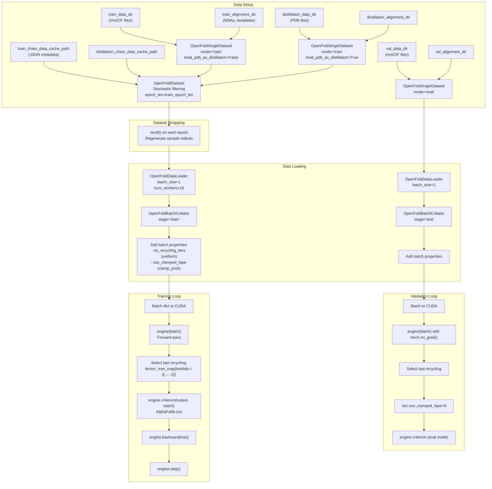

# Quick Start: Training

> **Relevant source files**
> - [LICENSE](https://github.com/hpcaitech/FastFold/blob/eba49680/LICENSE)
> - [fastfold/config\.py](https://github.com/hpcaitech/FastFold/blob/eba49680/fastfold/config.py)
> - [fastfold/data/data\_modules\.py](https://github.com/hpcaitech/FastFold/blob/eba49680/fastfold/data/data_modules.py)
> - [fastfold/model/fastnn/kernel/layer\_norm\.py](https://github.com/hpcaitech/FastFold/blob/eba49680/fastfold/model/fastnn/kernel/layer_norm.py)
> - [fastfold/relax/relax\.py](https://github.com/hpcaitech/FastFold/blob/eba49680/fastfold/relax/relax.py)
> - [fastfold/relax/utils\.py](https://github.com/hpcaitech/FastFold/blob/eba49680/fastfold/relax/utils.py)
> - [fastfold/utils/tensor\_utils\.py](https://github.com/hpcaitech/FastFold/blob/eba49680/fastfold/utils/tensor_utils.py)
> - [fastfold/utils/test\_utils\.py](https://github.com/hpcaitech/FastFold/blob/eba49680/fastfold/utils/test_utils.py)
> - [tests/test\_train\.py](https://github.com/hpcaitech/FastFold/blob/eba49680/tests/test_train.py)
> - [train\.py](https://github.com/hpcaitech/FastFold/blob/eba49680/train.py)

 This guide demonstrates how to set up and run training experiments with FastFold's `train.py` script\. It covers basic training invocation, dataset preparation, configuration options, and distributed execution\. For comprehensive details about the training system architecture, loss functions, and advanced topics, see [Training System](https://deepwiki.com/hpcaitech/FastFold/7-training-system)\.

 For running inference on pretrained models, see [Quick Start: Inference](https://deepwiki.com/hpcaitech/FastFold/2.2-quick-start:-inference)\. For installation and environment setup, see [Installation](https://deepwiki.com/hpcaitech/FastFold/2.1-installation)\.

---

## Overview

 FastFold training uses the `train.py` script to train AlphaFold models from scratch or fine\-tune existing weights\. The training pipeline integrates:

 - **Data Loading**: OpenFold\-compatible datasets with stochastic filtering
- **Model Architecture**: AlphaFold with FastNN optimizations via `inject_fastnn`
- **Distributed Training**: ColossalAI engine with optional Dynamic Axial Parallelism \(DAP\)
- **Optimization**: HybridAdam optimizer with custom learning rate scheduling

---

## Training Execution Flow

```mermaid
flowchart TD

Start["train.py Execution"]
ParseArgs["Parse Command Arguments<br>(config_preset, data_dirs, dap_size)"]
SetSeed["Set Random Seeds<br>random.seed, np.random.seed, torch.manual_seed"]
LaunchChoice["Launch Method"]
LaunchTorch["colossalai.launch_from_torch<br>parallel.tensor.size = dap_size"]
LaunchConfig["colossalai.launch<br>from config"]
LoadConfig["model_config(config_preset, train=True)<br>Set globals.blocks_per_ckpt=1<br>Set globals.chunk_size=None"]
CreateModel["AlphaFold(config)"]
InjectFastNN["inject_fastnn(model)"]
SetupData["SetupTrainDataset:<br>- OpenFoldSingleDataset (train)<br>- OpenFoldSingleDataset (distillation)<br>- OpenFoldSingleDataset (validation)"]
WrapData["OpenFoldDataset:<br>Stochastic filtering wrapper"]
CreateLoader["TrainDataLoader:<br>OpenFoldDataLoader with<br>OpenFoldBatchCollator"]
CreateOptim["HybridAdam(model.parameters)<br>AlphaFoldLRScheduler"]
CreateLoss["AlphaFoldLoss(config.loss)"]
InitEngine["colossalai.initialize:<br>Wrap model, optimizer,<br>criterion, lr_scheduler"]
TrainLoop["Training Loop"]
Forward["engine(batch)"]
Criterion["engine.criterion(output, batch)"]
Backward["engine.backward(loss)"]
Step["engine.step()"]
LogMetrics["Log loss breakdown and<br>validation metrics"]
CheckEpoch["Epoch Complete?"]
LRStep["lr_scheduler.step()"]
Validate["Validation Set?"]
ValLoop["Validation Loop:<br>engine.eval(), no gradients"]
CheckSave["Save Checkpoint?"]
SaveCkpt["torch.save(engine.model,<br>save_ckpt_path/model.pth)"]
NextEpoch["More Epochs?"]
End["Training Complete"]

Start --> ParseArgs
ParseArgs --> SetSeed
SetSeed -->|"config file"| LaunchChoice
LaunchChoice -->|"--from_torch"| LaunchTorch
LaunchChoice -->|"config file"| LaunchConfig
LaunchTorch -->|"--from_torch"| LoadConfig
LaunchConfig -->|"config file"| LoadConfig
LoadConfig --> CreateModel
CreateModel --> InjectFastNN
InjectFastNN --> SetupData
SetupData --> WrapData
WrapData --> CreateLoader
CreateLoader --> CreateOptim
CreateOptim --> CreateLoss
CreateLoss --> InitEngine
InitEngine --> TrainLoop
TrainLoop --> Forward
Forward --> Criterion
Criterion -->|"No"| Backward
Backward -->|"No"| Step
Step -->|"No"| LogMetrics
LogMetrics -->|"Yes"| CheckEpoch
CheckEpoch -->|"No"| Forward
CheckEpoch -->|"Yes"| LRStep
LRStep -->|"Yes"| Validate
Validate -->|"Yes"| ValLoop
Validate -->|"No"| CheckSave
ValLoop -->|"Yes"| CheckSave
CheckSave -->|"epoch % save_interval == 0"| SaveCkpt
CheckSave -->|"No"| NextEpoch
SaveCkpt -->|"epoch % save_interval == 0"| NextEpoch
NextEpoch -->|"Yes"| TrainLoop
NextEpoch -->|"No"| End
```



 **Sources:** [train\.py L36-L256](https://github.com/hpcaitech/FastFold/blob/eba49680/train.py#L36-L256)

---

## Basic Training Command

### Minimal Example

```
python train.py \  --config_preset initial_training \  --template_mmcif_dir /path/to/pdb_mmcif/mmcif_files \  --max_template_date 2020-05-14 \  --train_data_dir /path/to/training_data \  --train_alignment_dir /path/to/training_alignments \  --train_chain_data_cache_path /path/to/train_chain_cache.json \  --log_path ./train_logs \  --save_ckpt_path ./checkpoints \  --from_torch \  --dap_size 1
```

### With Distillation Data

```
python train.py \  --config_preset initial_training \  --template_mmcif_dir /path/to/pdb_mmcif/mmcif_files \  --max_template_date 2020-05-14 \  --train_data_dir /path/to/training_mmcif \  --train_alignment_dir /path/to/training_alignments \  --train_chain_data_cache_path /path/to/train_chain_cache.json \  --distillation_data_dir /path/to/distillation_pdb \  --distillation_alignment_dir /path/to/distillation_alignments \  --distillation_chain_data_cache_path /path/to/distill_chain_cache.json \  --val_data_dir /path/to/validation_mmcif \  --val_alignment_dir /path/to/validation_alignments \  --log_path ./train_logs \  --save_ckpt_path ./checkpoints \  --from_torch \  --dap_size 1
```

 **Sources:** [train\.py L36-L159](https://github.com/hpcaitech/FastFold/blob/eba49680/train.py#L36-L159)

---

## Command\-Line Arguments

### Required Arguments

| Argument | Type | Description |
| --- | --- | --- |
| \-\-template\_mmcif\_dir | str | Directory containing template mmCIF files for structural templates |
| \-\-max\_template\_date | str | Cutoff date for templates \(YYYY\-MM\-DD format\)\. Training filters by target release date |
| \-\-train\_data\_dir | str | Directory with training mmCIF files |
| \-\-train\_alignment\_dir | str | Directory with precomputed training alignments \(MSAs, templates\) |
| \-\-train\_chain\_data\_cache\_path | str | JSON cache mapping chain IDs to metadata \(resolution, sequence, cluster size\) |

### Data Arguments

| Argument | Type | Default | Description |
| --- | --- | --- | --- |
| \-\-distillation\_data\_dir | str | None | Directory with PDB files for self\-distillation |
| \-\-distillation\_alignment\_dir | str | None | Precomputed alignments for distillation set |
| \-\-distillation\_chain\_data\_cache\_path | str | None | Chain metadata cache for distillation |
| \-\-val\_data\_dir | str | None | Validation mmCIF directory |
| \-\-val\_alignment\_dir | str | None | Validation alignment directory |
| \-\-kalign\_binary\_path | str | /usr/bin/kalign | Path to kalign binary for template realignment |

### Training Configuration

| Argument | Type | Default | Description |
| --- | --- | --- | --- |
| \-\-config\_preset | str | initial\_training | Model config: initial\_training, finetuning, model\_1\-5, model\_X\_ptm |
| \-\-train\_epoch\_len | int | 10000 | Virtual epoch length \(affects checkpoint/validation frequency\) |
| \-\-max\_epochs | int | 10000 | Maximum training epochs |
| \-\-seed | int | 42 | Random seed for reproducibility |

### Distributed Training

| Argument | Type | Default | Description |
| --- | --- | --- | --- |
| \-\-from\_torch | flag | False | Use colossalai\.launch\_from\_torch instead of config file |
| \-\-dap\_size | int | 1 | Dynamic Axial Parallelism size \(1 to nproc\_per\_node\) |

### Logging and Checkpointing

| Argument | Type | Default | Description |
| --- | --- | --- | --- |
| \-\-log\_path | str | train\_log | Directory for training logs |
| \-\-log\_interval | int | 1 | Log metrics every N steps |
| \-\-save\_ckpt\_path | str | None | Checkpoint save directory \(None = no saving\) |
| \-\-save\_ckpt\_interval | int | 1 | Save checkpoint every N epochs |

 **Sources:** [train\.py L37-L157](https://github.com/hpcaitech/FastFold/blob/eba49680/train.py#L37-L157)

---

## Configuration Presets

 The `--config_preset` argument selects predefined model configurations\. Each preset modifies the base configuration with specific settings for data processing, model architecture, and loss weights\.

### Available Presets

| Preset | Description | Key Settings |
| --- | --- | --- |
| initial\_training | AlphaFold Suppl\. Table 4, initial training phase | Default settings, max\_extra\_msa=1024 |
| finetuning | AlphaFold Suppl\. Table 4, finetuning phase | max\_extra\_msa=5120, crop\_size=384, max\_msa\_clusters=512, violation loss weight=1\.0 |
| model\_1 | Model 1\.1\.1 \(with templates\) | max\_extra\_msa=5120, templates enabled, template torsion angles enabled |
| model\_2 | Model 1\.1\.2 \(with templates\) | Templates enabled, template torsion angles enabled |
| model\_3 | Model 1\.2\.1 \(no templates\) | max\_extra\_msa=5120, templates disabled |
| model\_4 | Model 1\.2\.2 \(no templates\) | max\_extra\_msa=5120, templates disabled |
| model\_5 | Model 1\.2\.3 \(no templates\) | Templates disabled |
| model\_1\_ptm through model\_5\_ptm | PTM \(predicted TM\-score\) variants | Same as base models \+ TM head enabled, TM loss weight=0\.1 |

### Training\-Specific Config Modifications

 When `train=True` is passed to `model_config()`:

 - `globals.blocks_per_ckpt = 1` \- Enable gradient checkpointing per block
- `globals.chunk_size = None` \- Disable chunking \(train on full sequences\)

 **Sources:** [config\.py L30-L125](https://github.com/hpcaitech/FastFold/blob/eba49680/fastfold/config.py#L30-L125)

---

## Dataset Preparation

### Chain Data Cache Format

 The chain data cache JSON files map chain IDs to metadata for stochastic filtering:

```
{  "1ABC_A": {    "seq": "MKFLKFSLLTAVLLSVVFAFSSCGDDDDTGYLPPSQAIQDLLKRMK...",    "resolution": 2.1,    "cluster_size": 45  },  "2XYZ_B": {    "seq": "MTEYKLVVVGAGGVGKSALTIQLIQNHFVDEYDPTIEDSYRKQVV...",    "resolution": 1.8,    "cluster_size": 120  }}
```

### Stochastic Filtering

 The training pipeline applies two types of filters to control data distribution:

 **Deterministic Filters** \(hard filters\):

 - Resolution must be ≤ 9\.0 Å
- No single amino acid can comprise \> 80% of sequence

 **Stochastic Filters** \(probability\-based\):

 - Cluster size filter: P = 1 / cluster\_size
- Length filter: P = \(1/512\) × max\(min\(length, 512\), 256\)
- Combined probability: P\_total = P\_cluster × P\_length

 **Sources:** [data\_modules\.py L225-L266](https://github.com/hpcaitech/FastFold/blob/eba49680/fastfold/data/data_modules.py#L225-L266)

---

## Training Data Flow



 **Sources:** [train\.py L177-L251](https://github.com/hpcaitech/FastFold/blob/eba49680/train.py#L177-L251) [data\_modules\.py L479-L640](https://github.com/hpcaitech/FastFold/blob/eba49680/fastfold/data/data_modules.py#L479-L640)

---

## ColossalAI Integration

### Initialization Options

#### Option 1: Launch from Torch \(Recommended\)

```
# train.py with --from_torch flagcolossalai.launch_from_torch(    config=dict(        parallel=dict(            tensor=dict(size=args.dap_size)        ),         torch_ddp=dict(static_graph=True)    ))
```

#### Option 2: Launch from Config File

```
# Using a config.py filecolossalai.launch(config='config.py', ...)
```

### Engine Wrapping

 The `colossalai.initialize()` call wraps all training components:

```
engine, train_dataloader, test_dataloader, lr_scheduler = colossalai.initialize(    model=model,                      # AlphaFold with inject_fastnn    optimizer=optimizer,              # HybridAdam    criterion=criterion,              # AlphaFoldLoss    lr_scheduler=lr_scheduler,        # AlphaFoldLRScheduler    train_dataloader=train_dataloader,    test_dataloader=test_dataloader,)
```

 The resulting `engine` provides unified methods:

 - `engine(batch)` \- Forward pass
- `engine.criterion(output, batch)` \- Loss computation
- `engine.backward(loss)` \- Backward pass with gradient communication
- `engine.step()` \- Optimizer step
- `engine.zero_grad()` \- Zero gradients

 **Sources:** [train\.py L164-L220](https://github.com/hpcaitech/FastFold/blob/eba49680/train.py#L164-L220)

---

## Dynamic Axial Parallelism \(DAP\)

 DAP enables training on sequences longer than what fits in a single GPU by sharding along the residue axis\. The `--dap_size` argument controls the parallelism degree\.

### DAP Size Guidelines

| DAP Size | Use Case | Sequence Length Support | GPUs Required |
| --- | --- | --- | --- |
| 1 | Standard training | Up to ~1024 residues | 1 |
| 2 | Long sequences | Up to ~2048 residues | 2 |
| 4 | Very long sequences | Up to ~4096 residues | 4 |
| 8 | Ultra\-long sequences | Up to ~8192 residues | 8 |

### Configuration

 The DAP size is passed to ColossalAI's tensor parallel configuration:

```
config = dict(    parallel=dict(        tensor=dict(size=args.dap_size)    ))
```

 During model execution, FastFold's distributed primitives \(scatter, gather, all\-to\-all\) handle cross\-GPU communication automatically\. For details, see [Dynamic Axial Parallelism](https://deepwiki.com/hpcaitech/FastFold/8.1-dynamic-axial-parallelism-(dap))\.

 **Sources:** [train\.py L155-L166](https://github.com/hpcaitech/FastFold/blob/eba49680/train.py#L155-L166)

---

## Loss Computation and Metrics

### Loss Breakdown Logging

 The training loop computes and logs individual loss components:

```
loss, loss_breakdown = engine.criterion(    output, batch, _return_breakdown=True)
```

 Loss components logged:

 - **FAPE**: Frame Aligned Point Error \(backbone \+ sidechain\)
- **distogram**: Predicted distance distribution
- **masked\_msa**: Masked MSA prediction
- **lddt**: Local Distance Difference Test
- **supervised\_chi**: Side\-chain torsion angles
- **violation**: Structural violations \(if weight \> 0\)
- **tm**: TM\-score prediction \(if PTM head enabled\)

### Validation Metrics

 Additional metrics computed during validation via `compute_validation_metrics()`:

 - **RMSD**: Root mean square deviation from ground truth
- **GDT\-TS**: Global Distance Test \- Total Score
- **GDT\-HA**: Global Distance Test \- High Accuracy
- **TMScore**: Template Modeling score

 **Sources:** [train\.py L21-L33](https://github.com/hpcaitech/FastFold/blob/eba49680/train.py#L21-L33) [train\.py L226-L251](https://github.com/hpcaitech/FastFold/blob/eba49680/train.py#L226-L251)

---

## Checkpointing

### Saving Checkpoints

 Checkpoints are saved at intervals controlled by `--save_ckpt_interval`:

```
if (args.save_ckpt_path is not None) and ((epoch+1) % args.save_ckpt_interval == 0):    torch.save(engine.model, os.path.join(args.save_ckpt_path, 'model.pth'))
```

 The saved checkpoint includes:

 - Model weights \(after ColossalAI wrapping\)
- FastNN optimizations \(inject\_fastnn is part of model structure\)

### Loading Checkpoints

 To resume training from a checkpoint:

```
# Load the saved modelmodel = torch.load('/path/to/checkpoints/model.pth') # Continue with optimizer initialization and trainingoptimizer = HybridAdam(model.parameters(), lr=1e-3)# ... rest of training setup
```

 **Sources:** [train\.py L253-L254](https://github.com/hpcaitech/FastFold/blob/eba49680/train.py#L253-L254)

---

## Training Loop Structure

### Main Training Loop

```
for epoch in range(max_epochs):    engine.train()    for i, batch in enumerate(train_dataloader):        # 1. Move batch to GPU        batch = {k: torch.as_tensor(v).cuda() for k, v in batch.items()}                # 2. Forward pass        output = engine(batch)                # 3. Select last recycling iteration        batch = tensor_tree_map(lambda t: t[..., -1], batch)                # 4. Compute loss        loss, loss_breakdown = engine.criterion(            output, batch, _return_breakdown=True        )                # 5. Log metrics        if (i+1) % log_interval == 0:            logger.info(f'Epoch: {epoch}, Step: {i+1}, Loss: ...')                # 6. Backward and optimize        engine.zero_grad()        engine.backward(loss)        engine.step()        # 7. Update learning rate    lr_scheduler.step()        # 8. Validation    if test_dataloader is not None:        engine.eval()        # ... validation loop        # 9. Save checkpoint    if (epoch+1) % save_ckpt_interval == 0:        torch.save(engine.model, ...)
```

### Recycling Selection

 The model outputs contain predictions for each recycling iteration\. Training uses only the final iteration:

```
batch = tensor_tree_map(lambda t: t[..., -1], batch)
```

 This extracts the last slice along the recycling dimension for all tensors in the batch\.

 **Sources:** [train\.py L224-L254](https://github.com/hpcaitech/FastFold/blob/eba49680/train.py#L224-L254)

---

## Example Training Workflow

### 1\. Prepare Data

```
# Generate alignment cache (see Data Processing Pipeline docs)# Generate chain data cache (scripts/generate_chain_data_cache.py)
```

### 2\. Start Training

```
# Single GPU trainingpython train.py \  --config_preset initial_training \  --template_mmcif_dir /data/pdb_mmcif/mmcif_files \  --max_template_date 2020-05-14 \  --train_data_dir /data/train/mmcif \  --train_alignment_dir /data/train/alignments \  --train_chain_data_cache_path /data/train/chain_cache.json \  --train_epoch_len 10000 \  --max_epochs 100 \  --log_path ./logs \  --save_ckpt_path ./checkpoints \  --save_ckpt_interval 10 \  --from_torch \  --dap_size 1
```

### 3\. Monitor Training

 Training logs contain:

```yaml
Training, Epoch: 0, Step: 100, Global_Step: 100, 
Loss: fape=2.145 distogram=1.823 masked_msa=0.756 lddt=0.234 ...
```

### 4\. Distributed Training \(Multi\-GPU\)

```
# Launch with torchrun for multi-GPUtorchrun --nproc_per_node=4 train.py \  --config_preset initial_training \  --dap_size 4 \  --from_torch \  ... # same other arguments
```

 **Sources:** [train\.py L1-L259](https://github.com/hpcaitech/FastFold/blob/eba49680/train.py#L1-L259)

---

## Common Issues and Solutions

### Out of Memory

 **Problem**: CUDA out of memory during training

 **Solutions**:

 1. Reduce crop size in config: `config.data.train.crop_size = 128`
2. Increase DAP size to shard across more GPUs
3. Reduce number of recycling iterations: `config.common.max_recycling_iters = 2`

### Slow Data Loading

 **Problem**: Training bottlenecked by data loading

 **Solutions**:

 1. Increase `num_workers` in config: `config.data_module.data_loaders.num_workers = 32`
2. Use alignment index for faster lookup: `--_alignment_index_path`
3. Precompute and cache all features

### Validation Takes Too Long

 **Problem**: Validation loop significantly slower than training

 **Solution**: Validation runs on full\-length sequences without cropping\. Consider:

 1. Reducing validation set size
2. Validating less frequently \(every N epochs\)
3. Using a separate validation script

 **Sources:** [config\.py L279-L301](https://github.com/hpcaitech/FastFold/blob/eba49680/fastfold/config.py#L279-L301) [data\_modules\.py L592-L639](https://github.com/hpcaitech/FastFold/blob/eba49680/fastfold/data/data_modules.py#L592-L639)

---

## Next Steps

 - **Advanced Training Configuration**: See [Training System](https://deepwiki.com/hpcaitech/FastFold/7-training-system) for detailed architecture
- **Loss Function Components**: See [Loss Functions and Metrics](https://deepwiki.com/hpcaitech/FastFold/7.3-loss-functions-and-metrics)
- **Data Pipeline Details**: See [Training Data Loading](https://deepwiki.com/hpcaitech/FastFold/7.1-training-data-loading)
- **Distributed Strategies**: See [Dynamic Axial Parallelism](https://deepwiki.com/hpcaitech/FastFold/8.1-dynamic-axial-parallelism-(dap))
- **Performance Tuning**: See [Performance Tuning Guide](https://deepwiki.com/hpcaitech/FastFold/12-performance-tuning-guide)

 **Sources:** [train\.py L1-L259](https://github.com/hpcaitech/FastFold/blob/eba49680/train.py#L1-L259) [config\.py L1-L607](https://github.com/hpcaitech/FastFold/blob/eba49680/fastfold/config.py#L1-L607) [data\_modules\.py L1-L640](https://github.com/hpcaitech/FastFold/blob/eba49680/fastfold/data/data_modules.py#L1-L640)
