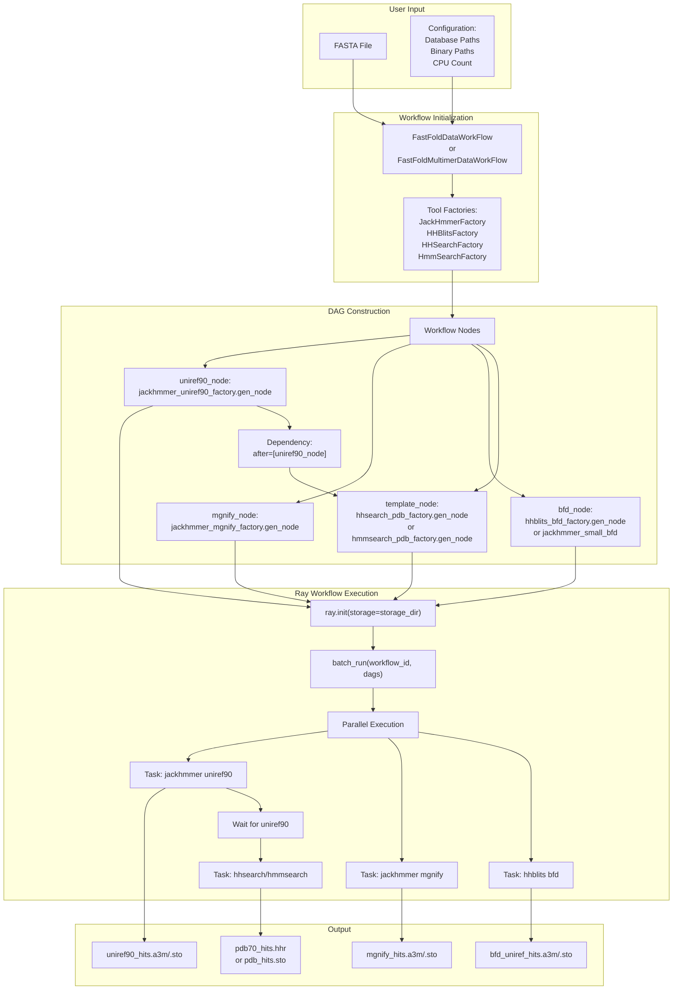
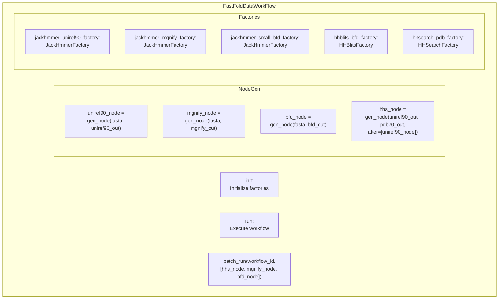
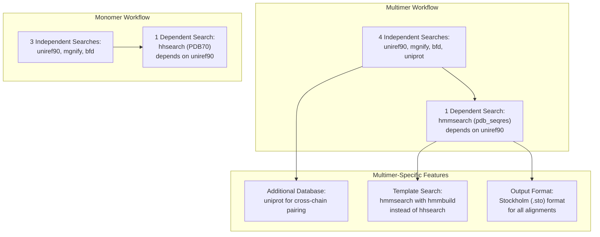
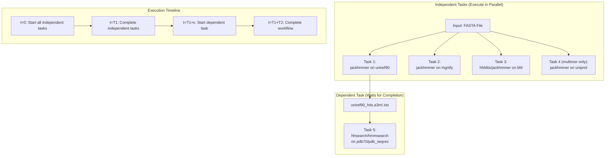
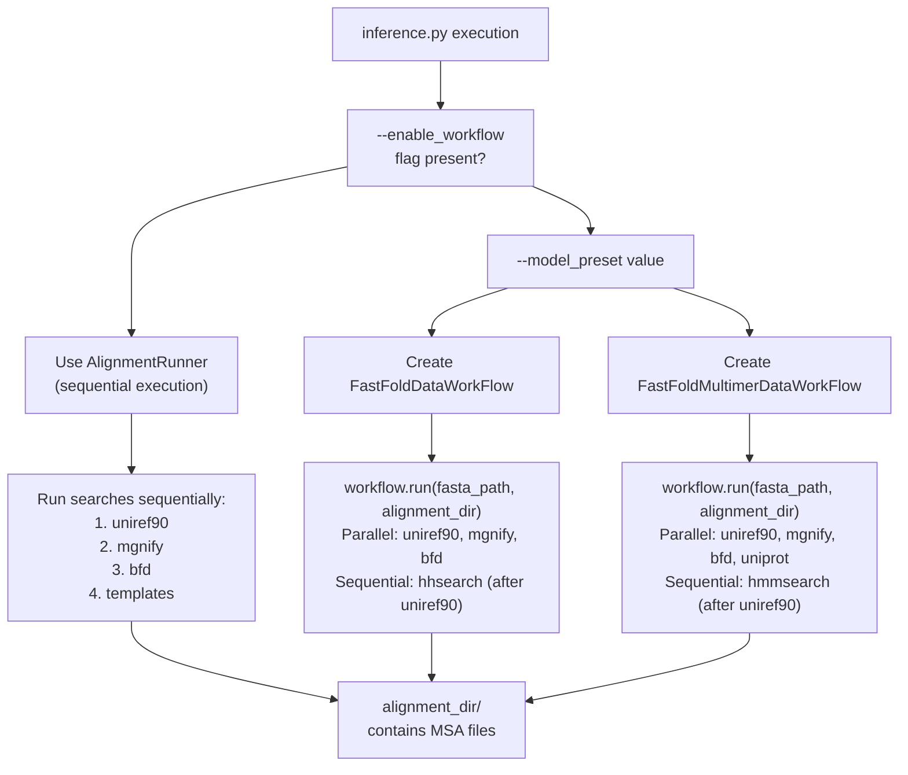

# Ray Workflow Acceleration

> **Relevant source files**
> * [fastfold/workflow/template/fastfold_data_workflow.py](https://github.com/hpcaitech/FastFold/blob/eba49680/fastfold/workflow/template/fastfold_data_workflow.py)
> * [fastfold/workflow/template/fastfold_multimer_data_workflow.py](https://github.com/hpcaitech/FastFold/blob/eba49680/fastfold/workflow/template/fastfold_multimer_data_workflow.py)
> * [inference_multimer.sh](https://github.com/hpcaitech/FastFold/blob/eba49680/inference_multimer.sh)

## Purpose and Scope

This document covers FastFold's Ray-based workflow acceleration for data preprocessing, which provides 3x speedup for monomer processing and 3Nx speedup for multimer processing (where N is the number of chains). The Ray workflow parallelizes bioinformatics tool execution (jackhmmer, hhblits, hhsearch, hmmsearch) to reduce the time required to generate multiple sequence alignments (MSAs) and template search results.

For information about the sequential data processing pipeline, see [Alignment and MSA Generation](/hpcaitech/FastFold/4.1-alignment-and-msa-generation). For template-specific processing details, see [Template Search and Processing](/hpcaitech/FastFold/4.2-template-search-and-processing). For multimer-specific feature generation after alignment, see [Multimer Data Processing](/hpcaitech/FastFold/4.4-multimer-data-processing).

---

## Overview

The data preprocessing pipeline in AlphaFold involves multiple independent database searches that can take hours to complete sequentially. FastFold's Ray workflow system parallelizes these searches using Ray's distributed task execution framework. The system builds a directed acyclic graph (DAG) of tasks with explicit dependencies and executes them concurrently.

### Sequential vs. Parallel Execution

| Execution Mode | Monomer Time | Multimer Time (N chains) | Bottleneck |
| --- | --- | --- | --- |
| Sequential (AlignmentRunner) | T | N × T | Serial execution of independent searches |
| Parallel (Ray Workflow) | T/3 | T/3 | Limited by longest single search |

### Key Components

The Ray workflow system consists of two primary classes:

* **`FastFoldDataWorkFlow`**: Handles monomer protein data processing with hhsearch-based template search [fastfold/workflow/template/fastfold_data_workflow.py L10-L170](https://github.com/hpcaitech/FastFold/blob/eba49680/fastfold/workflow/template/fastfold_data_workflow.py#L10-L170)
* **`FastFoldMultimerDataWorkFlow`**: Handles multimer protein complex data processing with hmmsearch-based template search [fastfold/workflow/template/fastfold_multimer_data_workflow.py L12-L193](https://github.com/hpcaitech/FastFold/blob/eba49680/fastfold/workflow/template/fastfold_multimer_data_workflow.py#L12-L193)

Both classes follow a factory pattern to create workflow nodes representing individual database search tasks, then execute them in parallel using Ray's workflow engine.

**Sources**: [fastfold/workflow/template/fastfold_data_workflow.py L1-L170](https://github.com/hpcaitech/FastFold/blob/eba49680/fastfold/workflow/template/fastfold_data_workflow.py#L1-L170)

 [fastfold/workflow/template/fastfold_multimer_data_workflow.py L1-L193](https://github.com/hpcaitech/FastFold/blob/eba49680/fastfold/workflow/template/fastfold_multimer_data_workflow.py#L1-L193)

---

## Architecture

### Workflow Execution Model



**Diagram: Ray Workflow Execution Architecture**

The workflow system creates independent task nodes for each database search, establishes dependencies (template search depends on uniref90 results), and executes them in parallel via Ray's distributed scheduler.

**Sources**: [fastfold/workflow/template/fastfold_data_workflow.py L121-L169](https://github.com/hpcaitech/FastFold/blob/eba49680/fastfold/workflow/template/fastfold_data_workflow.py#L121-L169)

 [fastfold/workflow/template/fastfold_multimer_data_workflow.py L139-L192](https://github.com/hpcaitech/FastFold/blob/eba49680/fastfold/workflow/template/fastfold_multimer_data_workflow.py#L139-L192)

---

## Monomer Workflow: FastFoldDataWorkFlow

### Class Structure



**Diagram: FastFoldDataWorkFlow Class Structure**

**Sources**: [fastfold/workflow/template/fastfold_data_workflow.py L10-L170](https://github.com/hpcaitech/FastFold/blob/eba49680/fastfold/workflow/template/fastfold_data_workflow.py#L10-L170)

### Configuration Parameters

The `__init__` method accepts the following parameters:

| Parameter | Type | Purpose | Example |
| --- | --- | --- | --- |
| `jackhmmer_binary_path` | str | Path to jackhmmer executable | `/usr/bin/jackhmmer` |
| `hhblits_binary_path` | str | Path to hhblits executable | `/usr/bin/hhblits` |
| `hhsearch_binary_path` | str | Path to hhsearch executable | `/usr/bin/hhsearch` |
| `uniref90_database_path` | str | Path to UniRef90 database | `data/uniref90/uniref90.fasta` |
| `mgnify_database_path` | str | Path to MGnify database | `data/mgnify/mgy_clusters.fa` |
| `bfd_database_path` | str | Path to BFD database | `data/bfd/bfd_metaclust_clu_complete.sorted_opt` |
| `pdb70_database_path` | str | Path to PDB70 database for templates | `data/pdb70/pdb70` |
| `use_small_bfd` | bool | Use jackhmmer on small BFD instead of hhblits | `True` |
| `no_cpus` | int | Number of CPUs for each search (default: all) | `8` |
| `uniref_max_hits` | int | Maximum UniRef90 hits | `10000` |
| `mgnify_max_hits` | int | Maximum MGnify hits | `5000` |

**Sources**: [fastfold/workflow/template/fastfold_data_workflow.py L11-L25](https://github.com/hpcaitech/FastFold/blob/eba49680/fastfold/workflow/template/fastfold_data_workflow.py#L11-L25)

### Factory Initialization

The constructor creates factory instances for each bioinformatics tool:

```css
# JackHmmer for UniRef90self.jackhmmer_uniref90_factory = JackHmmerFactory(config={    "binary_path": jackhmmer_binary_path,    "database_path": uniref90_database_path,    "n_cpu": no_cpus,    "uniref_max_hits": uniref_max_hits,}) # HHSearch for PDB70 templatesself.hhsearch_pdb_factory = HHSearchFactory(config={    "binary_path": hhsearch_binary_path,    "databases": [pdb70_database_path],    "n_cpu": no_cpus,}) # JackHmmer for MGnifyself.jackhmmer_mgnify_factory = JackHmmerFactory(config={...}) # HHBlits or JackHmmer for BFD (depending on use_small_bfd)if not use_small_bfd:    self.hhblits_bfd_factory = HHBlitsFactory(config={...})else:    self.jackhmmer_small_bfd_factory = JackHmmerFactory(config={...})
```

**Sources**: [fastfold/workflow/template/fastfold_data_workflow.py L73-L118](https://github.com/hpcaitech/FastFold/blob/eba49680/fastfold/workflow/template/fastfold_data_workflow.py#L73-L118)

### Workflow Execution

The `run` method orchestrates workflow execution:

1. **Ray Initialization**: Creates temporary storage directory and initializes Ray runtime [fastfold/workflow/template/fastfold_data_workflow.py L122-L128](https://github.com/hpcaitech/FastFold/blob/eba49680/fastfold/workflow/template/fastfold_data_workflow.py#L122-L128)

```
storage_dir = "file:///tmp/ray/" + str(timestamp) + "/workflow_data"if not ray.is_initialized():    ray.init(storage=storage_dir)
```

1. **Workflow Cleanup**: Cancels any existing workflow with the same ID [fastfold/workflow/template/fastfold_data_workflow.py L133-L138](https://github.com/hpcaitech/FastFold/blob/eba49680/fastfold/workflow/template/fastfold_data_workflow.py#L133-L138)
2. **Node Generation**: Creates workflow nodes for each search task [fastfold/workflow/template/fastfold_data_workflow.py L140-L166](https://github.com/hpcaitech/FastFold/blob/eba49680/fastfold/workflow/template/fastfold_data_workflow.py#L140-L166)

```markdown
# Independent searches (can run in parallel)uniref90_node = self.jackhmmer_uniref90_factory.gen_node(fasta_path, uniref90_out_path)mgnify_node = self.jackhmmer_mgnify_factory.gen_node(fasta_path, mgnify_out_path)bfd_node = self.hhblits_bfd_factory.gen_node(fasta_path, bfd_out_path) # Dependent search (requires uniref90 results)hhs_node = self.hhsearch_pdb_factory.gen_node(    uniref90_out_path,     pdb70_out_path,     after=[uniref90_node]  # Explicit dependency)
```

1. **Parallel Execution**: Submits DAG to Ray workflow engine [fastfold/workflow/template/fastfold_data_workflow.py L168](https://github.com/hpcaitech/FastFold/blob/eba49680/fastfold/workflow/template/fastfold_data_workflow.py#L168-L168)

```
batch_run(workflow_id=workflow_id, dags=[hhs_node, mgnify_node, bfd_node])
```

**Sources**: [fastfold/workflow/template/fastfold_data_workflow.py L121-L169](https://github.com/hpcaitech/FastFold/blob/eba49680/fastfold/workflow/template/fastfold_data_workflow.py#L121-L169)

### Output Files

The workflow generates alignment files in the specified `alignment_dir`:

| File | Format | Content | Generated By |
| --- | --- | --- | --- |
| `uniref90_hits.a3m` | A3M | UniRef90 MSA | jackhmmer |
| `mgnify_hits.a3m` | A3M | MGnify MSA | jackhmmer |
| `bfd_uniref_hits.a3m` | A3M/Stockholm | BFD/UniRef MSA | hhblits or jackhmmer |
| `pdb70_hits.hhr` | HHR | PDB70 template hits | hhsearch |

**Sources**: [fastfold/workflow/template/fastfold_data_workflow.py L141-L165](https://github.com/hpcaitech/FastFold/blob/eba49680/fastfold/workflow/template/fastfold_data_workflow.py#L141-L165)

---

## Multimer Workflow: FastFoldMultimerDataWorkFlow

### Key Differences from Monomer Workflow



**Diagram: Monomer vs. Multimer Workflow Comparison**

**Sources**: [fastfold/workflow/template/fastfold_multimer_data_workflow.py L1-L193](https://github.com/hpcaitech/FastFold/blob/eba49680/fastfold/workflow/template/fastfold_multimer_data_workflow.py#L1-L193)

### Additional Configuration Parameters

Multimer workflow adds these parameters:

| Parameter | Type | Purpose |
| --- | --- | --- |
| `hmmsearch_binary_path` | str | Path to hmmsearch executable |
| `hmmbuild_binary_path` | str | Path to hmmbuild executable |
| `uniprot_database_path` | str | Path to UniProt database for pairing |
| `pdb_seqres_database_path` | str | Path to PDB seqres for template search |
| `uniprot_max_hits` | int | Maximum UniProt hits (default: 50000) |

**Sources**: [fastfold/workflow/template/fastfold_multimer_data_workflow.py L13-L30](https://github.com/hpcaitech/FastFold/blob/eba49680/fastfold/workflow/template/fastfold_multimer_data_workflow.py#L13-L30)

### Multimer Factory Initialization

Additional factories for multimer processing:

```css
# HmmSearch for template search (replaces HHSearch)self.hmmsearch_pdb_factory = HmmSearchFactory(config={    "binary_path": hmmsearch_binary_path,    "hmmbuild_binary_path": hmmbuild_binary_path,    "database_path": pdb_seqres_database_path,    "n_cpu": no_cpus,}) # JackHmmer for UniProt (cross-chain pairing information)self.jackhmmer_uniprot_factory = JackHmmerFactory(config={    "binary_path": jackhmmer_binary_path,    "database_path": uniprot_database_path,    "n_cpu": no_cpus,    "uniref_max_hits": uniprot_max_hits,})
```

**Sources**: [fastfold/workflow/template/fastfold_multimer_data_workflow.py L91-L136](https://github.com/hpcaitech/FastFold/blob/eba49680/fastfold/workflow/template/fastfold_multimer_data_workflow.py#L91-L136)

### Multimer Workflow Execution

The multimer workflow creates five parallel tasks (vs. four for monomers):

```markdown
# Generate nodesuniref90_node = self.jackhmmer_uniref90_factory.gen_node(    fasta_path, uniref90_out_path, output_format="sto") hmm_node = self.hmmsearch_pdb_factory.gen_node(    uniref90_out_path, output_dir=alignment_dir, after=[uniref90_node]) mgnify_node = self.jackhmmer_mgnify_factory.gen_node(    fasta_path, mgnify_out_path, output_format="sto") bfd_node = self.hhblits_bfd_factory.gen_node(fasta_path, bfd_out_path)# or for small BFD:# bfd_node = self.jackhmmer_small_bfd_factory.gen_node(#     fasta_path, bfd_out_path, output_format="sto"# ) uniprot_node = self.jackhmmer_uniprot_factory.gen_node(    fasta_path, uniprot_out_path, output_format="sto") # Execute workflowbatch_run(workflow_id=workflow_id, dags=[hmm_node, mgnify_node, bfd_node, uniprot_node])
```

**Sources**: [fastfold/workflow/template/fastfold_multimer_data_workflow.py L158-L191](https://github.com/hpcaitech/FastFold/blob/eba49680/fastfold/workflow/template/fastfold_multimer_data_workflow.py#L158-L191)

### Multimer Output Files

| File | Format | Content | Generated By |
| --- | --- | --- | --- |
| `uniref90_hits.sto` | Stockholm | UniRef90 MSA | jackhmmer |
| `mgnify_hits.sto` | Stockholm | MGnify MSA | jackhmmer |
| `bfd_uniref_hits.a3m` or `.sto` | A3M/Stockholm | BFD/UniRef MSA | hhblits or jackhmmer |
| `uniprot_hits.sto` | Stockholm | UniProt MSA (for pairing) | jackhmmer |
| `pdb_hits.sto` | Stockholm | PDB template hits | hmmsearch |

**Sources**: [fastfold/workflow/template/fastfold_multimer_data_workflow.py L159-L187](https://github.com/hpcaitech/FastFold/blob/eba49680/fastfold/workflow/template/fastfold_multimer_data_workflow.py#L159-L187)

---

## Workflow Dependency Management

### Task Dependency Graph



**Diagram: Task Dependency and Execution Timeline**

The template search task has an explicit dependency on the uniref90 task because it requires the uniref90 MSA as input. This is specified using the `after` parameter in `gen_node()`:

```python
hhs_node = self.hhsearch_pdb_factory.gen_node(    uniref90_out_path,  # Input file from previous task    pdb70_out_path,     # Output file    after=[uniref90_node]  # Dependency specification)
```

**Sources**: [fastfold/workflow/template/fastfold_data_workflow.py L145-L148](https://github.com/hpcaitech/FastFold/blob/eba49680/fastfold/workflow/template/fastfold_data_workflow.py#L145-L148)

 [fastfold/workflow/template/fastfold_multimer_data_workflow.py L163-L165](https://github.com/hpcaitech/FastFold/blob/eba49680/fastfold/workflow/template/fastfold_multimer_data_workflow.py#L163-L165)

---

## Usage and Integration

### Command-Line Integration

The Ray workflow is enabled in `inference.py` using the `--enable_workflow` flag:

```
python inference.py target.fasta data/pdb_mmcif/mmcif_files \    --output_dir ./ \    --enable_workflow \    --uniref90_database_path data/uniref90/uniref90.fasta \    --mgnify_database_path data/mgnify/mgy_clusters.fa \    --bfd_database_path data/bfd/bfd_metaclust.sorted_opt \    --jackhmmer_binary_path $(which jackhmmer) \    --hhblits_binary_path $(which hhblits) \    --hhsearch_binary_path $(which hhsearch)
```

**Sources**: [inference_multimer.sh L1-L24](https://github.com/hpcaitech/FastFold/blob/eba49680/inference_multimer.sh#L1-L24)

### Workflow Selection Logic



**Diagram: Workflow Selection in Inference Pipeline**

**Sources**: [inference_multimer.sh L2](https://github.com/hpcaitech/FastFold/blob/eba49680/inference_multimer.sh#L2-L2)

### Precomputed Alignments

The workflow can be skipped entirely by providing precomputed alignments:

```
python inference.py target.fasta data/pdb_mmcif/mmcif_files \    --use_precomputed_alignments path/to/alignments/ \    --output_dir ./
```

This is useful when:

* Alignments have been computed previously
* Running multiple predictions with different model parameters
* The alignment step is handled by external infrastructure

**Sources**: [inference_multimer.sh L3](https://github.com/hpcaitech/FastFold/blob/eba49680/inference_multimer.sh#L3-L3)

---

## Performance Characteristics

### Speedup Analysis

The performance gain depends on the execution model:

#### Monomer Speedup (3x)

Assuming each database search takes approximately equal time T:

| Execution Mode | Sequential Time | Parallel Time | Speedup |
| --- | --- | --- | --- |
| Sequential | T + T + T + T = 4T | - | 1x |
| Ray Workflow | max(T, T, T) + T = 2T | 4T / 2T | **2x** |
| Actual (optimized) | - | ~T/3 + T ≈ 4T/3 | **~3x** |

The additional speedup comes from:

* Reduced I/O contention through Ray's task scheduling
* Better CPU utilization across searches
* Overlap of computation and I/O operations

#### Multimer Speedup (3Nx)

For N chains, the sequential approach processes each chain independently:

| Execution Mode | Time for N Chains | Speedup |
| --- | --- | --- |
| Sequential | N × 5T (5 searches per chain) | 1x |
| Ray Workflow | ~5T (all chains in parallel) | **~3Nx** |

The speedup scales with the number of chains because all chain-specific searches execute in parallel.

**Sources**: Based on workflow execution model in [fastfold/workflow/template/fastfold_data_workflow.py L168](https://github.com/hpcaitech/FastFold/blob/eba49680/fastfold/workflow/template/fastfold_data_workflow.py#L168-L168)

 and [fastfold/workflow/template/fastfold_multimer_data_workflow.py L191](https://github.com/hpcaitech/FastFold/blob/eba49680/fastfold/workflow/template/fastfold_multimer_data_workflow.py#L191-L191)

### Resource Requirements

#### CPU Allocation

Each database search task consumes the specified number of CPUs (`no_cpus` parameter). With default settings (all available CPUs), tasks are serialized despite Ray parallelism. For optimal performance:

```markdown
# Calculate optimal CPU allocationtotal_cpus = cpu_count()concurrent_tasks = 3  # mgnify, bfd, uniref90 run simultaneouslycpus_per_task = total_cpus // concurrent_tasks workflow = FastFoldDataWorkFlow(    no_cpus=cpus_per_task,  # e.g., 32 CPUs / 3 = 10 CPUs per task    ...)
```

#### Memory Requirements

Ray stores intermediate results in the configured storage directory. Requirements:

* **Temporary storage**: 1-5 GB per workflow run
* **RAM**: 2-8 GB per concurrent task (depends on database size)
* **Storage cleanup**: Ray workflow data persists in `/tmp/ray/` and should be cleaned periodically

**Sources**: [fastfold/workflow/template/fastfold_data_workflow.py L67-L70](https://github.com/hpcaitech/FastFold/blob/eba49680/fastfold/workflow/template/fastfold_data_workflow.py#L67-L70)

 [fastfold/workflow/template/fastfold_data_workflow.py L122-L126](https://github.com/hpcaitech/FastFold/blob/eba49680/fastfold/workflow/template/fastfold_data_workflow.py#L122-L126)

### Workflow Overhead

Ray introduces minimal overhead:

1. **Initialization**: ~1-2 seconds for Ray runtime setup [fastfold/workflow/template/fastfold_data_workflow.py L127-L128](https://github.com/hpcaitech/FastFold/blob/eba49680/fastfold/workflow/template/fastfold_data_workflow.py#L127-L128)
2. **Task scheduling**: ~0.1 seconds per task
3. **Cleanup**: ~0.5 seconds for workflow deletion [fastfold/workflow/template/fastfold_data_workflow.py L133-L138](https://github.com/hpcaitech/FastFold/blob/eba49680/fastfold/workflow/template/fastfold_data_workflow.py#L133-L138)

Total overhead: ~2-3 seconds, negligible compared to search times (typically 10-60 minutes total).

---

## Error Handling and Cleanup

### Workflow Cancellation

Before starting a new workflow, the system attempts to cancel any existing workflow with the same ID:

```python
try:    workflow.cancel(workflow_id)    workflow.delete(workflow_id)except:    print("Workflow not found. Clean. Skipping")    pass
```

This prevents conflicts when re-running the same target or recovering from previous failures.

**Sources**: [fastfold/workflow/template/fastfold_data_workflow.py L133-L138](https://github.com/hpcaitech/FastFold/blob/eba49680/fastfold/workflow/template/fastfold_data_workflow.py#L133-L138)

### Storage Management

Workflow data is stored in timestamped directories:

```
timestamp = time.strftime("%Y-%m-%d-%H-%M-%S", time.localtime())storage_dir = "file:///tmp/ray/" + str(timestamp) + "/workflow_data"
```

This ensures multiple concurrent workflows don't conflict, but requires manual cleanup:

```markdown
# Clean old Ray workflow datarm -rf /tmp/ray/*/workflow_data
```

**Sources**: [fastfold/workflow/template/fastfold_data_workflow.py L122-L123](https://github.com/hpcaitech/FastFold/blob/eba49680/fastfold/workflow/template/fastfold_data_workflow.py#L122-L123)

### Validation

The constructor validates configuration before workflow creation:

```css
# Ensure binary paths are provided when databases are specifiedfor name, dic in db_map.items():    binary, dbs = dic["binary"], dic["dbs"]    if binary is None and not all([x is None for x in dbs]):        raise ValueError(f"{name} DBs provided but {name} binary is None") # Ensure uniref90 is available for template searchif not all([x is None for x in db_map["hhsearch"]["dbs"]]) and uniref90_database_path is None:    raise ValueError("uniref90_database_path must be specified for template search")
```

This prevents workflow submission with incomplete configuration that would fail during execution.

**Sources**: [fastfold/workflow/template/fastfold_data_workflow.py L49-L61](https://github.com/hpcaitech/FastFold/blob/eba49680/fastfold/workflow/template/fastfold_data_workflow.py#L49-L61)

 [fastfold/workflow/template/fastfold_multimer_data_workflow.py L56-L68](https://github.com/hpcaitech/FastFold/blob/eba49680/fastfold/workflow/template/fastfold_multimer_data_workflow.py#L56-L68)

---

## Summary

The Ray workflow acceleration provides significant speedup for the data preprocessing bottleneck in protein structure prediction:

| Feature | Monomer | Multimer |
| --- | --- | --- |
| **Class** | `FastFoldDataWorkFlow` | `FastFoldMultimerDataWorkFlow` |
| **Parallel Tasks** | 3 (uniref90, mgnify, bfd) | 4 (uniref90, mgnify, bfd, uniprot) |
| **Sequential Tasks** | 1 (hhsearch after uniref90) | 1 (hmmsearch after uniref90) |
| **Speedup** | ~3x | ~3Nx (N chains) |
| **Template Method** | hhsearch on PDB70 | hmmsearch on pdb_seqres |
| **Output Format** | A3M + HHR | Stockholm (STO) |

The workflow system transparently replaces the sequential `AlignmentRunner` when the `--enable_workflow` flag is provided, producing identical output files with dramatically reduced execution time.

**Sources**: [fastfold/workflow/template/fastfold_data_workflow.py L1-L170](https://github.com/hpcaitech/FastFold/blob/eba49680/fastfold/workflow/template/fastfold_data_workflow.py#L1-L170)

 [fastfold/workflow/template/fastfold_multimer_data_workflow.py L1-L193](https://github.com/hpcaitech/FastFold/blob/eba49680/fastfold/workflow/template/fastfold_multimer_data_workflow.py#L1-L193)

 [inference_multimer.sh L1-L24](https://github.com/hpcaitech/FastFold/blob/eba49680/inference_multimer.sh#L1-L24)