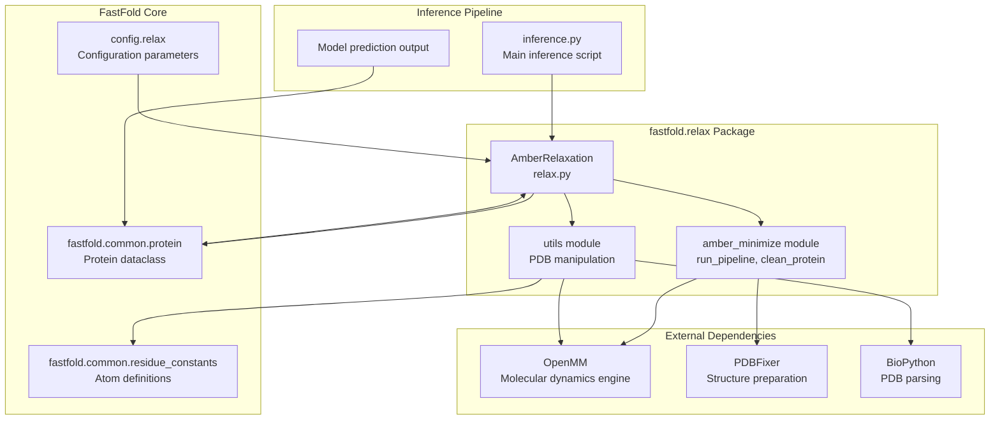
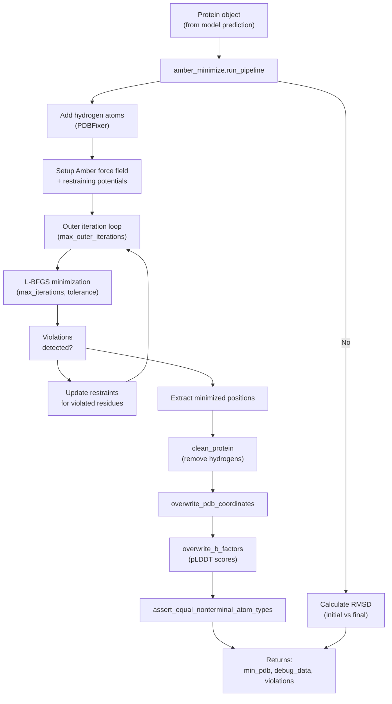
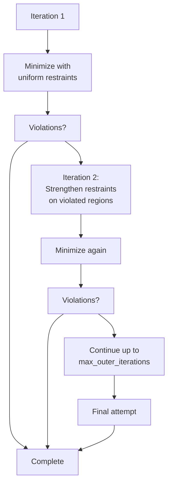

# Structure Refinement with Amber

> **Relevant source files**
> * [LICENSE](https://github.com/hpcaitech/FastFold/blob/eba49680/LICENSE)
> * [README.md](https://github.com/hpcaitech/FastFold/blob/eba49680/README.md?plain=1)
> * [environment.yml](https://github.com/hpcaitech/FastFold/blob/eba49680/environment.yml)
> * [fastfold/config.py](https://github.com/hpcaitech/FastFold/blob/eba49680/fastfold/config.py)
> * [fastfold/model/fastnn/kernel/layer_norm.py](https://github.com/hpcaitech/FastFold/blob/eba49680/fastfold/model/fastnn/kernel/layer_norm.py)
> * [fastfold/relax/relax.py](https://github.com/hpcaitech/FastFold/blob/eba49680/fastfold/relax/relax.py)
> * [fastfold/relax/utils.py](https://github.com/hpcaitech/FastFold/blob/eba49680/fastfold/relax/utils.py)
> * [inference.py](https://github.com/hpcaitech/FastFold/blob/eba49680/inference.py)

This document describes the Amber-based structure refinement system used in FastFold's inference pipeline. This optional post-processing step uses energy minimization to resolve local geometry violations and improve the physical realism of predicted protein structures.

**Scope**: This page covers the `AmberRelaxation` module, its configuration, and integration into the inference workflow. For information about the main inference pipeline that produces the initial prediction, see [Distributed Inference Execution](/hpcaitech/FastFold/5.2-distributed-inference-execution).

---

## Overview

Amber relaxation is an optional post-processing step that refines protein structure predictions using molecular dynamics energy minimization. The AlphaFold model produces structures that are highly accurate but may contain minor violations of stereochemistry (bond lengths, bond angles, clashes). The relaxation process uses OpenMM with the Amber force field to minimize potential energy while maintaining the overall predicted structure through restraining potentials.

**Key characteristics**:

* Uses OpenMM library with Amber force field
* Applies restraining potentials to heavy atoms to preserve predicted structure
* Iteratively resolves violations through energy minimization
* GPU-accelerated for performance
* Optional (disabled by default in FastFold)

Sources: [fastfold/relax/relax.py L1-L93](https://github.com/hpcaitech/FastFold/blob/eba49680/fastfold/relax/relax.py#L1-L93)

 [inference.py L322-L337](https://github.com/hpcaitech/FastFold/blob/eba49680/inference.py#L322-L337)

 [inference.py L465-L480](https://github.com/hpcaitech/FastFold/blob/eba49680/inference.py#L465-L480)

---

## Architecture

### Module Structure



**Module Responsibilities**:

| Module | Primary Functionality |
| --- | --- |
| `AmberRelaxation` | High-level interface, orchestrates relaxation pipeline |
| `amber_minimize` | Core minimization logic, force field setup, violation detection |
| `utils` | PDB file manipulation, coordinate/B-factor updates |
| `protein` | Protein structure representation |

Sources: [fastfold/relax/relax.py L1-L93](https://github.com/hpcaitech/FastFold/blob/eba49680/fastfold/relax/relax.py#L1-L93)

 [fastfold/relax/utils.py L1-L112](https://github.com/hpcaitech/FastFold/blob/eba49680/fastfold/relax/utils.py#L1-L112)

 [environment.yml L28-L29](https://github.com/hpcaitech/FastFold/blob/eba49680/environment.yml#L28-L29)

---

## AmberRelaxation Class

### Class Definition

The `AmberRelaxation` class provides the main interface for structure refinement.

**Constructor Parameters**:

```python
AmberRelaxation(    max_iterations: int,           # L-BFGS iterations (0 = no limit)    tolerance: float,              # Energy tolerance (kcal/mol)    stiffness: float,              # Restraint spring constant (kcal/mol·Å²)    exclude_residues: Sequence[int],  # Residues excluded from restraints    max_outer_iterations: int,     # Violation-informed iterations    use_gpu: bool                  # GPU acceleration flag)
```

| Parameter | Default | Description |
| --- | --- | --- |
| `max_iterations` | 0 | Maximum L-BFGS steps; 0 means unlimited |
| `tolerance` | 2.39 | Energy convergence criterion (kcal/mol) |
| `stiffness` | 10.0 | Spring constant for heavy atom restraints (kcal/mol·Å²) |
| `exclude_residues` | [] | Zero-indexed residue positions to exclude from restraints |
| `max_outer_iterations` | 20 | Maximum violation resolution iterations |
| `use_gpu` | True (in inference) | Whether to use GPU acceleration |

Sources: [fastfold/relax/relax.py L27-L59](https://github.com/hpcaitech/FastFold/blob/eba49680/fastfold/relax/relax.py#L27-L59)

 [fastfold/config.py L461-L467](https://github.com/hpcaitech/FastFold/blob/eba49680/fastfold/config.py#L461-L467)

### Process Method

The `process` method executes the relaxation pipeline:

```python
def process(*, prot: protein.Protein) -> Tuple[str, Dict[str, Any], np.ndarray]:    """    Args:        prot: Protein object with atom positions and metadata            Returns:        min_pdb: Relaxed structure as PDB string        debug_data: Dict with 'initial_energy', 'final_energy', 'attempts', 'rmsd'        violations: Per-residue violation mask    """
```

**Return values**:

* `min_pdb` (str): PDB-formatted string with minimized coordinates and B-factors
* `debug_data` (dict): Energy metrics and RMSD statistics
* `violations` (np.ndarray): Per-residue mask indicating unresolved violations

Sources: [fastfold/relax/relax.py L61-L92](https://github.com/hpcaitech/FastFold/blob/eba49680/fastfold/relax/relax.py#L61-L92)

---

## Relaxation Pipeline

### Workflow Diagram



**Pipeline Stages**:

1. **Hydrogen Addition**: PDBFixer adds missing hydrogens required for force field calculations
2. **Force Field Setup**: Amber force field configured with harmonic restraints on heavy atoms
3. **Violation-Informed Relaxation**: Iterative minimization that detects and resolves stereochemistry violations
4. **L-BFGS Minimization**: Quasi-Newton optimization to minimize potential energy
5. **Post-Processing**: Extract coordinates, remove hydrogens, update B-factors with pLDDT scores
6. **Validation**: Verify atom consistency between input and output structures

Sources: [fastfold/relax/relax.py L65-L92](https://github.com/hpcaitech/FastFold/blob/eba49680/fastfold/relax/relax.py#L65-L92)

 [fastfold/relax/utils.py L28-L82](https://github.com/hpcaitech/FastFold/blob/eba49680/fastfold/relax/utils.py#L28-L82)

### Violation-Informed Iteration

The outer iteration loop implements the violation-informed relaxation strategy:



This approach (introduced in AlphaFold 2.1) resolves >95% of difficult cases while adding minimal overhead to typical structures that relax cleanly in the first iteration.

Sources: [fastfold/relax/relax.py L45-L50](https://github.com/hpcaitech/FastFold/blob/eba49680/fastfold/relax/relax.py#L45-L50)

---

## Configuration Parameters

### Default Configuration

The relaxation configuration is defined in `config.relax`:

| Parameter | Value | Purpose |
| --- | --- | --- |
| `max_iterations` | 0 | No iteration limit; runs until tolerance met |
| `tolerance` | 2.39 kcal/mol | Energy convergence threshold |
| `stiffness` | 10.0 kcal/mol·Å² | Restraint strength balances structure preservation vs. violation resolution |
| `max_outer_iterations` | 20 | Sufficient for >95% of structures |
| `exclude_residues` | [] | No residues excluded by default |

**Stiffness Parameter**: The value of 10.0 kcal/mol·Å² provides a balance:

* High enough to preserve the predicted structure's overall geometry
* Low enough to allow resolution of local violations (bond lengths, angles, clashes)

Sources: [fastfold/config.py L461-L467](https://github.com/hpcaitech/FastFold/blob/eba49680/fastfold/config.py#L461-L467)

### Usage in Inference

The relaxation step is controlled by the `--relaxation` flag in `inference.py`:

```markdown
parser.add_argument(    "--relaxation",     action="store_false",  # Note: action is store_false    default=False,         # Default is False (relaxation disabled))
```

**Note**: The `action="store_false"` combined with `default=False` means relaxation is **disabled by default**. To enable, the flag must be explicitly set.

To run inference with relaxation:

```
python inference.py target.fasta ... --relaxation
```

Sources: [inference.py L524-L525](https://github.com/hpcaitech/FastFold/blob/eba49680/inference.py#L524-L525)

 [inference.py L322-L337](https://github.com/hpcaitech/FastFold/blob/eba49680/inference.py#L322-L337)

 [inference.py L465-L480](https://github.com/hpcaitech/FastFold/blob/eba49680/inference.py#L465-L480)

---

## Integration with Inference Workflow

### Inference Pipeline Integration

```mermaid
sequenceDiagram
  participant inference.py::main
  participant AlphaFold Model
  participant AmberRelaxation
  participant File System

  inference.py::main->>AlphaFold Model: Forward pass
  AlphaFold Model-->>inference.py::main: out (prediction dict)
  inference.py::main->>inference.py::main: protein.from_prediction
  note over inference.py::main: Create Protein object
  inference.py::main->>File System: (features, result, b_factors)
  loop [Relaxation Enabled]
    inference.py::main->>AmberRelaxation: Save unrelaxed PDB
    inference.py::main->>AmberRelaxation: (tag_model_unrelaxed.pdb)
    note over AmberRelaxation: Run amber_minimize.run_pipeline
    AmberRelaxation-->>inference.py::main: AmberRelaxation(**config.relax)
    note over inference.py::main: debug_data contains:
    inference.py::main->>File System: process(prot=unrelaxed_protein)
  end
```

**Monomer Workflow** ([inference.py L465-L480](https://github.com/hpcaitech/FastFold/blob/eba49680/inference.py#L465-L480)

):

```python
if(args.relaxation):    amber_relaxer = relax.AmberRelaxation(        use_gpu=True,        **config.relax,    )        t = time.perf_counter()    relaxed_pdb_str, _, _ = amber_relaxer.process(prot=unrelaxed_protein)    print(f"Relaxation time: {time.perf_counter() - t}")        relaxed_output_path = os.path.join(        args.output_dir,        f'{tag}_{args.model_name}_relaxed.pdb'    )    with open(relaxed_output_path, 'w') as f:        f.write(relaxed_pdb_str)
```

**Multimer Workflow**: Identical logic at [inference.py L322-L337](https://github.com/hpcaitech/FastFold/blob/eba49680/inference.py#L322-L337)

Sources: [inference.py L322-L337](https://github.com/hpcaitech/FastFold/blob/eba49680/inference.py#L322-L337)

 [inference.py L465-L480](https://github.com/hpcaitech/FastFold/blob/eba49680/inference.py#L465-L480)

---

## Utility Functions

### PDB Manipulation

The `fastfold.relax.utils` module provides PDB file manipulation functions:

#### overwrite_pdb_coordinates

```python
def overwrite_pdb_coordinates(pdb_str: str, pos) -> str:    """Replaces coordinates in PDB string with new positions.        Uses OpenMM to parse topology and write new coordinates.    """
```

**Process**:

1. Parse PDB string into OpenMM `PdbStructure`
2. Extract topology
3. Write new PDB with updated coordinates using `openmm_app.PDBFile.writeFile`

Sources: [fastfold/relax/utils.py L28-L34](https://github.com/hpcaitech/FastFold/blob/eba49680/fastfold/relax/utils.py#L28-L34)

#### overwrite_b_factors

```python
def overwrite_b_factors(pdb_str: str, bfactors: np.ndarray) -> str:    """Replaces B-factors with pLDDT confidence scores.        Args:        pdb_str: PDB string        bfactors: Array [n_residues, 37] with pLDDT values            Returns:        PDB string with updated B-factors    """
```

**Implementation**:

* Uses BioPython's PDB parser
* Iterates through atoms, assigns B-factor from corresponding residue's CA atom
* Ensures per-residue pLDDT scores are propagated to all atoms

Sources: [fastfold/relax/utils.py L37-L72](https://github.com/hpcaitech/FastFold/blob/eba49680/fastfold/relax/utils.py#L37-L72)

#### assert_equal_nonterminal_atom_types

```python
def assert_equal_nonterminal_atom_types(    atom_mask: np.ndarray,     ref_atom_mask: np.ndarray):    """Validates that atom sets match pre- and post-relaxation.        Ignores terminal OXT atoms added during minimization.    """
```

This validation ensures the relaxation process hasn't inadvertently changed the protein's atom composition (except for expected terminal oxygen additions).

Sources: [fastfold/relax/utils.py L75-L81](https://github.com/hpcaitech/FastFold/blob/eba49680/fastfold/relax/utils.py#L75-L81)

---

## Output and Metrics

### Output Files

When relaxation is enabled, the inference pipeline produces two PDB files:

| File | Description |
| --- | --- |
| `{tag}_{model}_unrelaxed.pdb` | Direct model output with predicted coordinates |
| `{tag}_{model}_relaxed.pdb` | Energy-minimized structure with resolved violations |

Both files include pLDDT scores as B-factors.

Sources: [inference.py L460-L480](https://github.com/hpcaitech/FastFold/blob/eba49680/inference.py#L460-L480)

### Debug Data

The `debug_data` dictionary returned by `process()` contains:

```css
{    'initial_energy': float,   # Potential energy before minimization (kcal/mol)    'final_energy': float,     # Potential energy after minimization (kcal/mol)    'attempts': int,           # Number of outer iterations performed    'rmsd': float             # RMSD between initial and final structures (Å)}
```

**Interpreting Metrics**:

* **Energy decrease**: Larger decrease indicates more violations resolved
* **Attempts**: More attempts suggest challenging violations; typically 1-3 for good structures
* **RMSD**: Low RMSD (<0.5 Å) indicates minimal structural change; high RMSD may indicate initial structure had significant violations

Sources: [fastfold/relax/relax.py L74-L82](https://github.com/hpcaitech/FastFold/blob/eba49680/fastfold/relax/relax.py#L74-L82)

### Violations Mask

The `violations` array is a per-residue binary mask indicating which residues still have unresolved violations after relaxation. This can be used for quality control:

```python
relaxed_pdb, debug_data, violations = amber_relaxer.process(prot=protein) if violations.sum() > 0:    print(f"Warning: {violations.sum()} residues have unresolved violations")
```

Sources: [fastfold/relax/relax.py L89-L91](https://github.com/hpcaitech/FastFold/blob/eba49680/fastfold/relax/relax.py#L89-L91)

---

## Performance Considerations

### GPU Acceleration

Amber relaxation can be GPU-accelerated through OpenMM:

* Enabled by default in inference (`use_gpu=True`)
* Provides 5-10x speedup over CPU minimization
* Particularly beneficial for large proteins or multimers

### Timing

Typical relaxation times:

* Small proteins (100-300 residues): 5-15 seconds on GPU
* Medium proteins (300-600 residues): 15-45 seconds on GPU
* Large proteins (600+ residues): 45-120+ seconds on GPU

The violation-informed approach (max 20 iterations) ensures most structures complete in 1-2 iterations, adding minimal overhead.

Sources: [inference.py L329-L331](https://github.com/hpcaitech/FastFold/blob/eba49680/inference.py#L329-L331)

 [inference.py L472-L474](https://github.com/hpcaitech/FastFold/blob/eba49680/inference.py#L472-L474)

### Memory Requirements

OpenMM requires additional memory for:

* Force field parameter storage
* Minimization state vectors
* Typically adds 1-3 GB for most structures

This is separate from the main model's GPU memory usage, so relaxation typically runs after model inference completes and model memory is freed.

---

## Dependencies

The relaxation module requires:

```markdown
# From environment.yml- conda-forge::openmm=7.7.0      # Molecular dynamics engine- conda-forge::pdbfixer           # Structure preparation- pip::biopython==1.79            # PDB parsing
```

These are installed automatically when using the provided Conda environment.

Sources: [environment.yml L28-L32](https://github.com/hpcaitech/FastFold/blob/eba49680/environment.yml#L28-L32)

---

## Summary

The Amber relaxation system provides an optional but valuable post-processing step that:

1. **Resolves violations**: Fixes bond lengths, angles, and clashes that violate stereochemistry
2. **Preserves structure**: Uses restraints to maintain the model's predicted geometry
3. **Iterates intelligently**: Violation-informed approach focuses computation on problematic regions
4. **Integrates seamlessly**: Simple boolean flag in inference script
5. **Provides metrics**: Energy changes and RMSD for quality assessment

While disabled by default for performance, relaxation is recommended for final production structures, particularly when physical accuracy is critical for downstream applications like molecular dynamics or docking.

Sources: [fastfold/relax/relax.py L1-L93](https://github.com/hpcaitech/FastFold/blob/eba49680/fastfold/relax/relax.py#L1-L93)

 [inference.py L322-L337](https://github.com/hpcaitech/FastFold/blob/eba49680/inference.py#L322-L337)

 [inference.py L465-L480](https://github.com/hpcaitech/FastFold/blob/eba49680/inference.py#L465-L480)

 [fastfold/config.py L461-L467](https://github.com/hpcaitech/FastFold/blob/eba49680/fastfold/config.py#L461-L467)