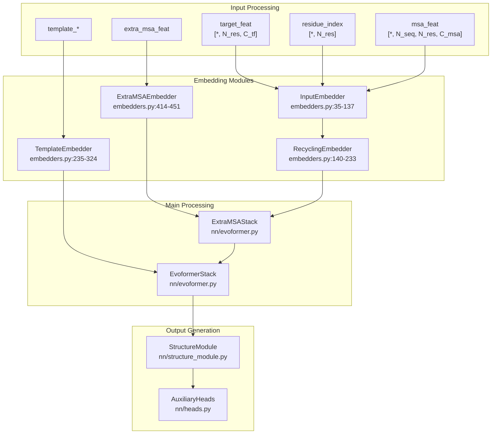
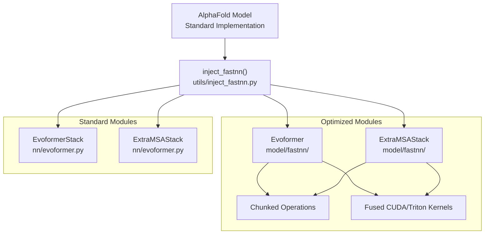
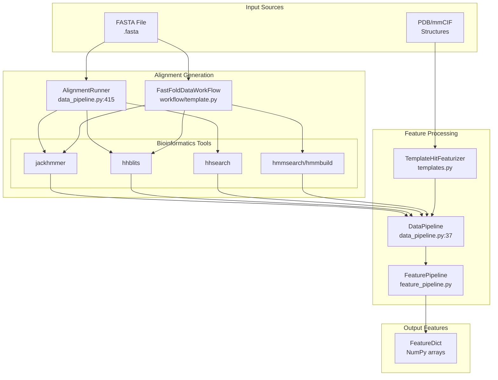
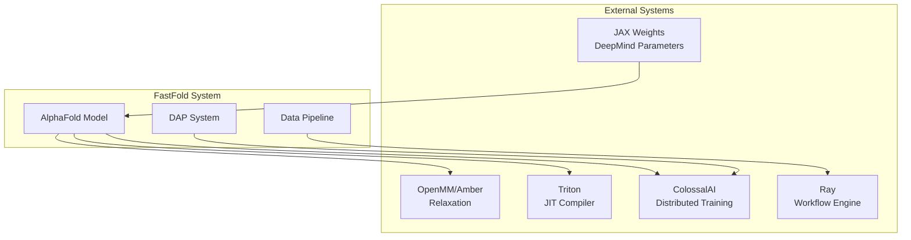

# System Architecture

> **Relevant source files**
> * [README.md](https://github.com/hpcaitech/FastFold/blob/eba49680/README.md?plain=1)
> * [benchmark/perf.py](https://github.com/hpcaitech/FastFold/blob/eba49680/benchmark/perf.py)
> * [environment.yml](https://github.com/hpcaitech/FastFold/blob/eba49680/environment.yml)
> * [fastfold/distributed/__init__.py](https://github.com/hpcaitech/FastFold/blob/eba49680/fastfold/distributed/__init__.py)
> * [fastfold/distributed/comm.py](https://github.com/hpcaitech/FastFold/blob/eba49680/fastfold/distributed/comm.py)
> * [fastfold/distributed/core.py](https://github.com/hpcaitech/FastFold/blob/eba49680/fastfold/distributed/core.py)
> * [fastfold/model/__init__.py](https://github.com/hpcaitech/FastFold/blob/eba49680/fastfold/model/__init__.py)
> * [fastfold/model/hub/alphafold.py](https://github.com/hpcaitech/FastFold/blob/eba49680/fastfold/model/hub/alphafold.py)
> * [fastfold/model/nn/embedders.py](https://github.com/hpcaitech/FastFold/blob/eba49680/fastfold/model/nn/embedders.py)
> * [fastfold/model/nn/template.py](https://github.com/hpcaitech/FastFold/blob/eba49680/fastfold/model/nn/template.py)
> * [inference.py](https://github.com/hpcaitech/FastFold/blob/eba49680/inference.py)

This document provides a detailed technical overview of FastFold's architectural organization, covering the five primary layers: User Interface, Core Model, Performance Optimization, Data Processing, and Infrastructure. For specific information about FastFold's key performance innovations, see [Key Innovations](/hpcaitech/FastFold/1.2-key-innovations). For installation and setup procedures, see [Installation](/hpcaitech/FastFold/2.1-installation).

## Purpose and Scope

FastFold is a high-performance implementation of AlphaFold 2 that maintains compatibility with the original architecture while providing significant speedups through optimized kernels, distributed parallelism, and accelerated data workflows. The system is organized into distinct architectural layers that separate concerns while enabling transparent performance optimizations.

## Architectural Overview

FastFold's architecture consists of five primary layers that interact to provide both training and inference capabilities:


**Sources:** [inference.py](https://github.com/hpcaitech/FastFold/blob/eba49680/inference.py)

 [fastfold/model/hub/alphafold.py](https://github.com/hpcaitech/FastFold/blob/eba49680/fastfold/model/hub/alphafold.py)

 [fastfold/distributed/core.py](https://github.com/hpcaitech/FastFold/blob/eba49680/fastfold/distributed/core.py)

 [fastfold/model/nn/embedders.py](https://github.com/hpcaitech/FastFold/blob/eba49680/fastfold/model/nn/embedders.py)

## Layer Details

### User Interface Layer

The user interface layer provides entry points for both inference and training workflows through Python CLI scripts.

| Component | File | Purpose |
| --- | --- | --- |
| `inference.py` | [inference.py](https://github.com/hpcaitech/FastFold/blob/eba49680/inference.py) | Main script for protein structure prediction |
| `train.py` | [train.py](https://github.com/hpcaitech/FastFold/blob/eba49680/train.py) | Main script for model training |
| Docker images | [docker/Dockerfile](https://github.com/hpcaitech/FastFold/blob/eba49680/docker/Dockerfile) | Containerized execution environment |

**Inference Execution Flow:**

The `inference_model()` function at [inference.py L122-L159](https://github.com/hpcaitech/FastFold/blob/eba49680/inference.py#L122-L159)

 demonstrates the inference initialization sequence:

1. Set distributed environment variables (`RANK`, `LOCAL_RANK`, `WORLD_SIZE`)
2. Initialize DAP via `fastfold.distributed.init_dap()` at [inference.py L127](https://github.com/hpcaitech/FastFold/blob/eba49680/inference.py#L127-L127)
3. Load model configuration via `model_config()` at [inference.py L129](https://github.com/hpcaitech/FastFold/blob/eba49680/inference.py#L129-L129)
4. Instantiate `AlphaFold` model at [inference.py L138](https://github.com/hpcaitech/FastFold/blob/eba49680/inference.py#L138-L138)
5. Import JAX weights at [inference.py L139](https://github.com/hpcaitech/FastFold/blob/eba49680/inference.py#L139-L139)
6. Apply `inject_fastnn()` optimization at [inference.py L141](https://github.com/hpcaitech/FastFold/blob/eba49680/inference.py#L141-L141)
7. Execute forward pass with CUDA tensors at [inference.py L151](https://github.com/hpcaitech/FastFold/blob/eba49680/inference.py#L151-L151)

**Multi-GPU Distribution:**

Inference uses `torch.multiprocessing.spawn` for process-based parallelism at [inference.py L293](https://github.com/hpcaitech/FastFold/blob/eba49680/inference.py#L293-L293)

 and [inference.py L443](https://github.com/hpcaitech/FastFold/blob/eba49680/inference.py#L443-L443)

 spawning independent processes per GPU that synchronize via barriers at [inference.py L158](https://github.com/hpcaitech/FastFold/blob/eba49680/inference.py#L158-L158)

**Sources:** [inference.py L122-L159](https://github.com/hpcaitech/FastFold/blob/eba49680/inference.py#L122-L159)

 [inference.py L293](https://github.com/hpcaitech/FastFold/blob/eba49680/inference.py#L293-L293)

 [inference.py L443](https://github.com/hpcaitech/FastFold/blob/eba49680/inference.py#L443-L443)

### Core Model Architecture

The core model implements the AlphaFold 2 architecture through the `AlphaFold` class defined at [fastfold/model/hub/alphafold.py L46-L534](https://github.com/hpcaitech/FastFold/blob/eba49680/fastfold/model/hub/alphafold.py#L46-L534)

#### Model Components



**Sources:** [fastfold/model/hub/alphafold.py L46-L534](https://github.com/hpcaitech/FastFold/blob/eba49680/fastfold/model/hub/alphafold.py#L46-L534)

 [fastfold/model/nn/embedders.py L35-L451](https://github.com/hpcaitech/FastFold/blob/eba49680/fastfold/model/nn/embedders.py#L35-L451)

#### Iteration and Recycling

The `iteration()` method at [fastfold/model/hub/alphafold.py L173-L424](https://github.com/hpcaitech/FastFold/blob/eba49680/fastfold/model/hub/alphafold.py#L173-L424)

 implements the core forward pass with recycling:

**Key steps in iteration:**

1. **Input Embedding** [alphafold.py L200-L210](https://github.com/hpcaitech/FastFold/blob/eba49680/alphafold.py#L200-L210) : Generate initial MSA representation `m` and pair representation `z` via `InputEmbedder`
2. **Recycling** [alphafold.py L212-L255](https://github.com/hpcaitech/FastFold/blob/eba49680/alphafold.py#L212-L255) : Apply `RecyclingEmbedder` to previous iteration outputs (`m_1_prev`, `z_prev`, `x_prev`)
3. **Template Processing** [alphafold.py L262-L327](https://github.com/hpcaitech/FastFold/blob/eba49680/alphafold.py#L262-L327) : Process template features via `TemplateEmbedder` if enabled
4. **Extra MSA** [alphafold.py L331-L362](https://github.com/hpcaitech/FastFold/blob/eba49680/alphafold.py#L331-L362) : Process extra MSA features via `ExtraMSAStack` if enabled
5. **Evoformer** [alphafold.py L369-L390](https://github.com/hpcaitech/FastFold/blob/eba49680/alphafold.py#L369-L390) : Run main trunk via `EvoformerStack`
6. **Structure Module** [alphafold.py L398-L408](https://github.com/hpcaitech/FastFold/blob/eba49680/alphafold.py#L398-L408) : Predict 3D coordinates via `StructureModule`

The `forward()` method at [fastfold/model/hub/alphafold.py L444-L534](https://github.com/hpcaitech/FastFold/blob/eba49680/fastfold/model/hub/alphafold.py#L444-L534)

 orchestrates multiple recycling iterations, with the final iteration having gradients enabled for training at [alphafold.py L514-L519](https://github.com/hpcaitech/FastFold/blob/eba49680/alphafold.py#L514-L519)

**Sources:** [fastfold/model/hub/alphafold.py L173-L424](https://github.com/hpcaitech/FastFold/blob/eba49680/fastfold/model/hub/alphafold.py#L173-L424)

 [fastfold/model/hub/alphafold.py L444-L534](https://github.com/hpcaitech/FastFold/blob/eba49680/fastfold/model/hub/alphafold.py#L444-L534)

### Performance Optimization Layer

FastFold's performance optimizations are applied transparently through two primary mechanisms: `inject_fastnn` and Dynamic Axial Parallelism (DAP).

#### inject_fastnn Mechanism

The `inject_fastnn()` function replaces standard `EvoformerStack` and `ExtraMSAStack` modules with optimized implementations:



Usage pattern shown in [inference.py L141](https://github.com/hpcaitech/FastFold/blob/eba49680/inference.py#L141-L141)

:

```
model = inject_fastnn(model)
```

**Sources:** [inference.py L141](https://github.com/hpcaitech/FastFold/blob/eba49680/inference.py#L141-L141)

 [fastfold/utils/inject_fastnn.py](https://github.com/hpcaitech/FastFold/blob/eba49680/fastfold/utils/inject_fastnn.py)

#### Dynamic Axial Parallelism (DAP)

DAP initialization is handled by `init_dap()` at [fastfold/distributed/core.py L17-L40](https://github.com/hpcaitech/FastFold/blob/eba49680/fastfold/distributed/core.py#L17-L40)

 which configures tensor model parallelism via ColossalAI:

**Initialization sequence:**

1. Disable existing ColossalAI loggers at [core.py L18](https://github.com/hpcaitech/FastFold/blob/eba49680/core.py#L18-L18)
2. Determine `tensor_model_parallel_size` from `WORLD_SIZE` environment variable at [core.py L21-L24](https://github.com/hpcaitech/FastFold/blob/eba49680/core.py#L21-L24)
3. Set missing distributed environment variables at [core.py L33-L37](https://github.com/hpcaitech/FastFold/blob/eba49680/core.py#L33-L37)
4. Launch ColossalAI with tensor parallelism config at [core.py L39-L40](https://github.com/hpcaitech/FastFold/blob/eba49680/core.py#L39-L40)

The parallel configuration specifies tensor parallelism size:

```
config={"parallel": dict(tensor=dict(size=tensor_model_parallel_size_))}
```

**Sources:** [fastfold/distributed/core.py L17-L40](https://github.com/hpcaitech/FastFold/blob/eba49680/fastfold/distributed/core.py#L17-L40)

#### Communication Primitives

The `fastfold.distributed.comm` module at [fastfold/distributed/comm.py](https://github.com/hpcaitech/FastFold/blob/eba49680/fastfold/distributed/comm.py)

 provides autograd-aware distributed primitives:

| Operation | Forward | Backward | Purpose |
| --- | --- | --- | --- |
| `scatter` | `_split()` | `_gather()` | Shard tensor across GPUs |
| `gather` | `_gather()` | `_split()` | Collect shards from GPUs |
| `reduce` | `_reduce()` | identity | Sum across GPUs |
| `col_to_row` | `_all_to_all()` | `_all_to_all()` | Transform column-sharded to row-sharded |
| `row_to_col` | `_all_to_all()` | `_all_to_all()` | Transform row-sharded to column-sharded |

Each operation is implemented as a `torch.autograd.Function` subclass with proper gradient handling. For example, `Scatter` at [comm.py L93-L103](https://github.com/hpcaitech/FastFold/blob/eba49680/comm.py#L93-L103)

 splits in forward and gathers in backward.

**Sources:** [fastfold/distributed/comm.py L85-L204](https://github.com/hpcaitech/FastFold/blob/eba49680/fastfold/distributed/comm.py#L85-L204)

### Data Processing Pipeline

The data processing pipeline transforms raw biological data (FASTA sequences, PDB structures) into numerical features for model consumption.

#### Pipeline Architecture



**Sources:** [fastfold/data/data_pipeline.py](https://github.com/hpcaitech/FastFold/blob/eba49680/fastfold/data/data_pipeline.py)

 [fastfold/workflow/template.py](https://github.com/hpcaitech/FastFold/blob/eba49680/fastfold/workflow/template.py)

 [fastfold/data/templates.py](https://github.com/hpcaitech/FastFold/blob/eba49680/fastfold/data/templates.py)

#### Monomer vs Multimer Processing

**Monomer workflow** at [inference.py L340-L488](https://github.com/hpcaitech/FastFold/blob/eba49680/inference.py#L340-L488)

:

* Uses `DataPipeline` at [inference.py L360](https://github.com/hpcaitech/FastFold/blob/eba49680/inference.py#L360-L360)
* Alignment via `AlignmentRunner` or `FastFoldDataWorkFlow` at [inference.py L414-L426](https://github.com/hpcaitech/FastFold/blob/eba49680/inference.py#L414-L426)
* Feature processing via `FeaturePipeline` at [inference.py L434-L437](https://github.com/hpcaitech/FastFold/blob/eba49680/inference.py#L434-L437)

**Multimer workflow** at [inference.py L169-L338](https://github.com/hpcaitech/FastFold/blob/eba49680/inference.py#L169-L338)

:

* Uses `DataPipelineMultimer` at [inference.py L224-L226](https://github.com/hpcaitech/FastFold/blob/eba49680/inference.py#L224-L226)
* Per-chain alignment at [inference.py L258-L277](https://github.com/hpcaitech/FastFold/blob/eba49680/inference.py#L258-L277)
* MSA pairing for cross-chain interactions
* Feature merging at [inference.py L281-L287](https://github.com/hpcaitech/FastFold/blob/eba49680/inference.py#L281-L287)

**Sources:** [inference.py L169-L488](https://github.com/hpcaitech/FastFold/blob/eba49680/inference.py#L169-L488)

### Infrastructure Layer

The infrastructure layer manages configuration, dependency management, build processes, and deployment.

#### Configuration System

Configuration is managed via `model_config()` function in `config.py`, which returns a `ConfigDict` with hierarchical settings:

**Configuration structure:**

* `globals`: chunk_size, inplace, is_multimer
* `model.input_embedder`: tf_dim, msa_dim, c_z, c_m
* `model.evoformer_stack`: blocks, c_m, c_z
* `model.structure_module`: c_s, c_z, no_blocks
* `model.template`: enabled, embed_angles
* `model.extra_msa`: enabled
* `data`: predict/train settings
* `relax`: amber relaxation parameters

Configuration is loaded at [inference.py L129](https://github.com/hpcaitech/FastFold/blob/eba49680/inference.py#L129-L129)

 and [inference.py L171](https://github.com/hpcaitech/FastFold/blob/eba49680/inference.py#L171-L171)

**Sources:** [fastfold/config.py](https://github.com/hpcaitech/FastFold/blob/eba49680/fastfold/config.py)

#### Dependency Management

The `environment.yml` at [environment.yml L1-L33](https://github.com/hpcaitech/FastFold/blob/eba49680/environment.yml#L1-L33)

 specifies the conda environment with:

**Core dependencies:**

* PyTorch 1.12 with CUDA 11.3 at [environment.yml L21-L24](https://github.com/hpcaitech/FastFold/blob/eba49680/environment.yml#L21-L24)
* ColossalAI 0.2.7 for distributed training at [environment.yml L20](https://github.com/hpcaitech/FastFold/blob/eba49680/environment.yml#L20-L20)
* Ray 2.0.0 for workflow acceleration at [environment.yml L17](https://github.com/hpcaitech/FastFold/blob/eba49680/environment.yml#L17-L17)

**Bioinformatics tools:**

* hmmer 3.3.2 at [environment.yml L30](https://github.com/hpcaitech/FastFold/blob/eba49680/environment.yml#L30-L30)
* hhsuite 3.3.0 at [environment.yml L31](https://github.com/hpcaitech/FastFold/blob/eba49680/environment.yml#L31-L31)
* kalign2 2.04 at [environment.yml L32](https://github.com/hpcaitech/FastFold/blob/eba49680/environment.yml#L32-L32)

**Python packages:**

* biopython, scipy, einops
* ml-collections for configuration at [environment.yml L10](https://github.com/hpcaitech/FastFold/blob/eba49680/environment.yml#L10-L10)

**Sources:** [environment.yml L1-L33](https://github.com/hpcaitech/FastFold/blob/eba49680/environment.yml#L1-L33)

#### Build System

The build system at `setup.py` conditionally compiles CUDA extensions:

**Build process:**

1. Check PyTorch version ≥ 1.10
2. Detect CUDA_HOME environment variable
3. Build CUDA extensions: `fastfold_layer_norm_cuda`, `fastfold_softmax_cuda`
4. Create Pybind11 bindings
5. Install via `BuildExtension`

If CUDA is not available, the package installs in CPU-only mode.

**Sources:** [setup.py](https://github.com/hpcaitech/FastFold/blob/eba49680/setup.py)

#### Docker Deployment

The Dockerfile at `docker/Dockerfile` provides a complete environment:

**Build steps:**

1. Start from `hpcaitech/pytorch-cuda:1.12.0-11.3.0`
2. Install conda packages (openmm, hmmer, hhsuite, kalign2)
3. Install pip packages (biopython, scipy, ray, colossalai)
4. Clone FastFold repository
5. Run `python setup.py install` to build CUDA extensions

Usage shown in README at [README.md L66-L78](https://github.com/hpcaitech/FastFold/blob/eba49680/README.md?plain=1#L66-L78)

**Sources:** [docker/Dockerfile](https://github.com/hpcaitech/FastFold/blob/eba49680/docker/Dockerfile)

 [README.md L66-L78](https://github.com/hpcaitech/FastFold/blob/eba49680/README.md?plain=1#L66-L78)

## Execution Modes

FastFold supports two primary execution modes with different distributed strategies.

### Inference Mode

**Distribution strategy:** Process-based data parallelism via `torch.multiprocessing.spawn`

**Execution flow:**

1. Load and process input features (monomer or multimer)
2. Spawn N processes where N = number of GPUs at [inference.py L293](https://github.com/hpcaitech/FastFold/blob/eba49680/inference.py#L293-L293)
3. Each process: * Initializes DAP at [inference.py L127](https://github.com/hpcaitech/FastFold/blob/eba49680/inference.py#L127-L127) * Loads model and applies `inject_fastnn` at [inference.py L141](https://github.com/hpcaitech/FastFold/blob/eba49680/inference.py#L141-L141) * Runs forward pass at [inference.py L151](https://github.com/hpcaitech/FastFold/blob/eba49680/inference.py#L151-L151) * Synchronizes via barrier at [inference.py L158](https://github.com/hpcaitech/FastFold/blob/eba49680/inference.py#L158-L158)
4. Collect results via `Queue` at [inference.py L295](https://github.com/hpcaitech/FastFold/blob/eba49680/inference.py#L295-L295)
5. Optional: Amber relaxation for structure refinement

**Sources:** [inference.py L122-L159](https://github.com/hpcaitech/FastFold/blob/eba49680/inference.py#L122-L159)

 [inference.py L291-L295](https://github.com/hpcaitech/FastFold/blob/eba49680/inference.py#L291-L295)

### Training Mode

**Distribution strategy:** Tensor model parallelism via ColossalAI

**Execution components:**

* `SetupTrainDataset`: Dataset configuration
* `OpenFoldDataset`: Stochastic filtering and batching
* `colossalai.initialize`: Distributed training setup
* `ColossalAI Engine`: Unified model, optimizer, loss interface
* Training loop with validation checkpointing

For details on training workflow, see [Training System](/hpcaitech/FastFold/7-training-system).

**Sources:** [train.py](https://github.com/hpcaitech/FastFold/blob/eba49680/train.py)

## Memory and Performance Characteristics

### Memory Optimization Features

| Feature | Mechanism | Impact |
| --- | --- | --- |
| DAP | Sequence sharding across GPUs | Enables 10K+ residue sequences |
| Chunking | Process in chunks via `chunk_size` parameter | Configurable memory-compute tradeoff |
| Inplace operations | Memory reuse via `globals.inplace=True` | Reduces peak memory |
| Gradient checkpointing | Activation checkpointing in Evoformer | Lower memory during training |

### Performance Characteristics

According to [README.md L19-L29](https://github.com/hpcaitech/FastFold/blob/eba49680/README.md?plain=1#L19-L29)

:

* **Kernel speedup:** 2-10x for individual operations
* **Evoformer speedup:** 2-5x for forward/backward
* **Data workflow:** 3x faster monomer, 3Nx faster multimer (N sequences)
* **Sequence length:** Up to 10,000 residues in BF16 (vs ~3,000 standard)

**Sources:** [README.md L19-L29](https://github.com/hpcaitech/FastFold/blob/eba49680/README.md?plain=1#L19-L29)

## Integration Points

### External System Integration



**Key integrations:**

* **ColossalAI:** Provides distributed training infrastructure at [fastfold/distributed/core.py L39-L40](https://github.com/hpcaitech/FastFold/blob/eba49680/fastfold/distributed/core.py#L39-L40)
* **Ray:** Accelerates data preprocessing workflows at [fastfold/workflow/template.py](https://github.com/hpcaitech/FastFold/blob/eba49680/fastfold/workflow/template.py)
* **Triton:** JIT-compiles optimized kernels (optional, requires CUDA 11.4+) per [README.md L54-L60](https://github.com/hpcaitech/FastFold/blob/eba49680/README.md?plain=1#L54-L60)
* **OpenMM/Amber:** Structure refinement at [fastfold/relax/relax.py](https://github.com/hpcaitech/FastFold/blob/eba49680/fastfold/relax/relax.py)
* **JAX:** Weight import from DeepMind checkpoints via `import_jax_weights_()` at [fastfold/utils/import_weights.py](https://github.com/hpcaitech/FastFold/blob/eba49680/fastfold/utils/import_weights.py)

**Sources:** [README.md L54-L60](https://github.com/hpcaitech/FastFold/blob/eba49680/README.md?plain=1#L54-L60)

 [fastfold/distributed/core.py L39-L40](https://github.com/hpcaitech/FastFold/blob/eba49680/fastfold/distributed/core.py#L39-L40)

 [fastfold/workflow/template.py](https://github.com/hpcaitech/FastFold/blob/eba49680/fastfold/workflow/template.py)