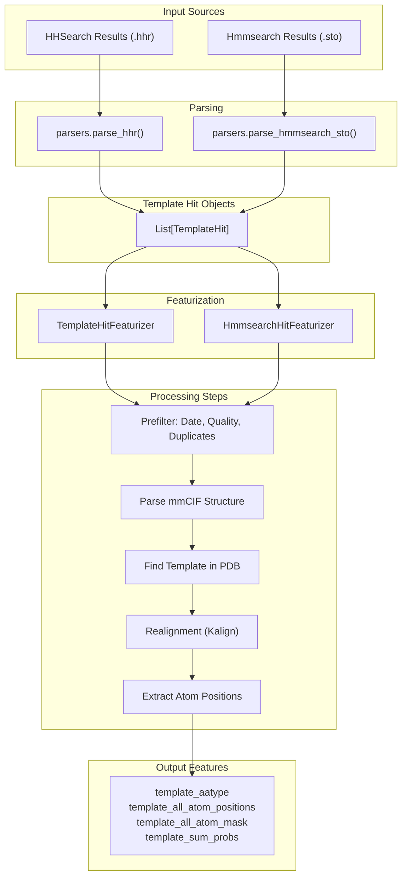
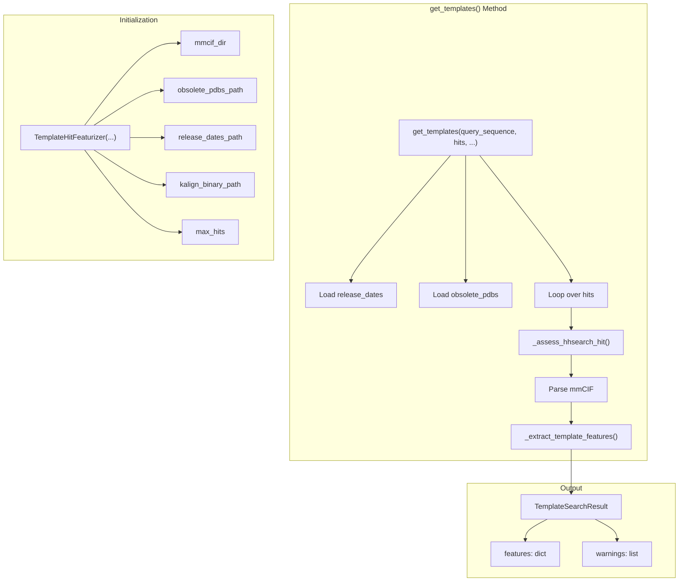
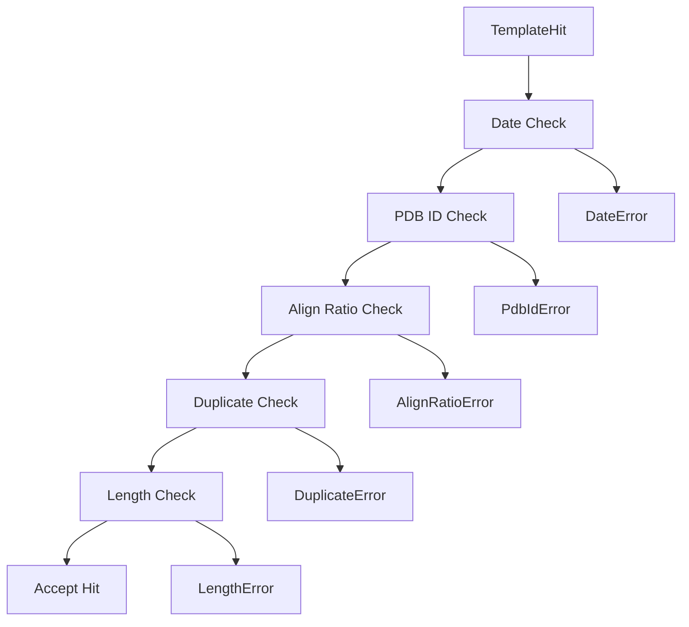
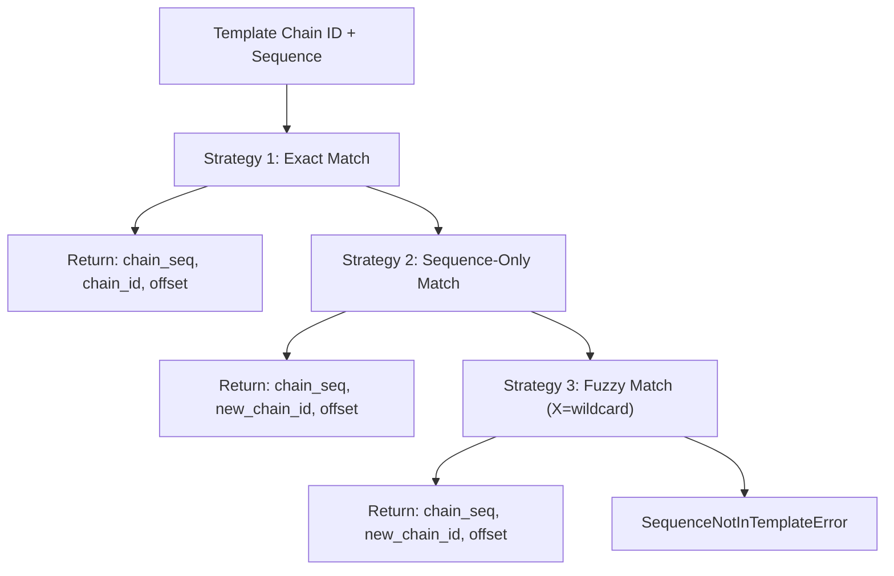
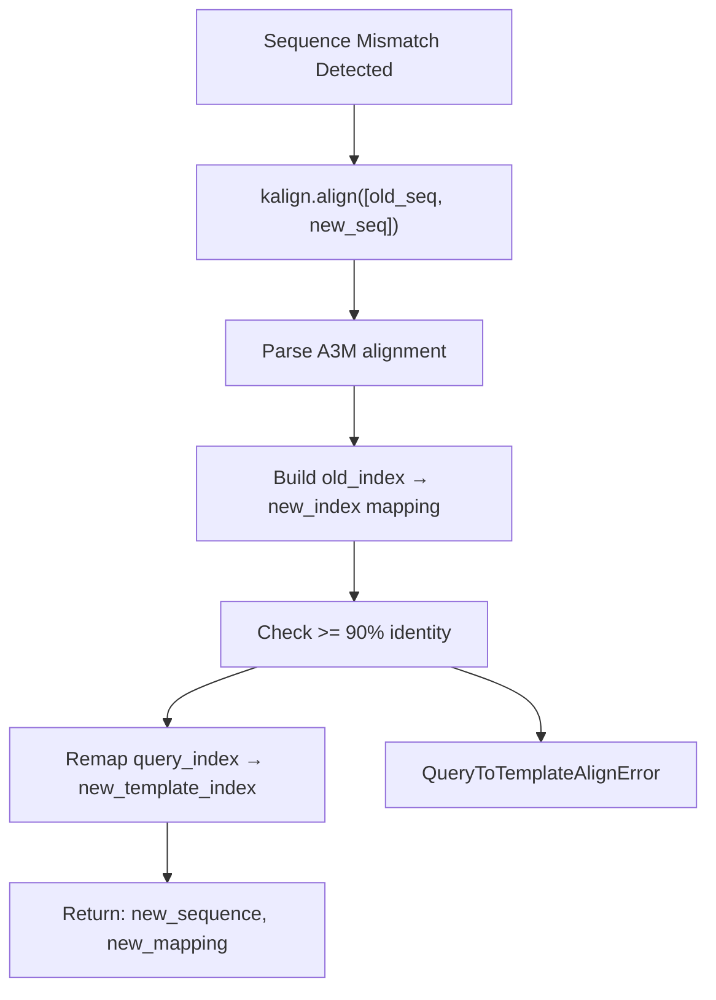
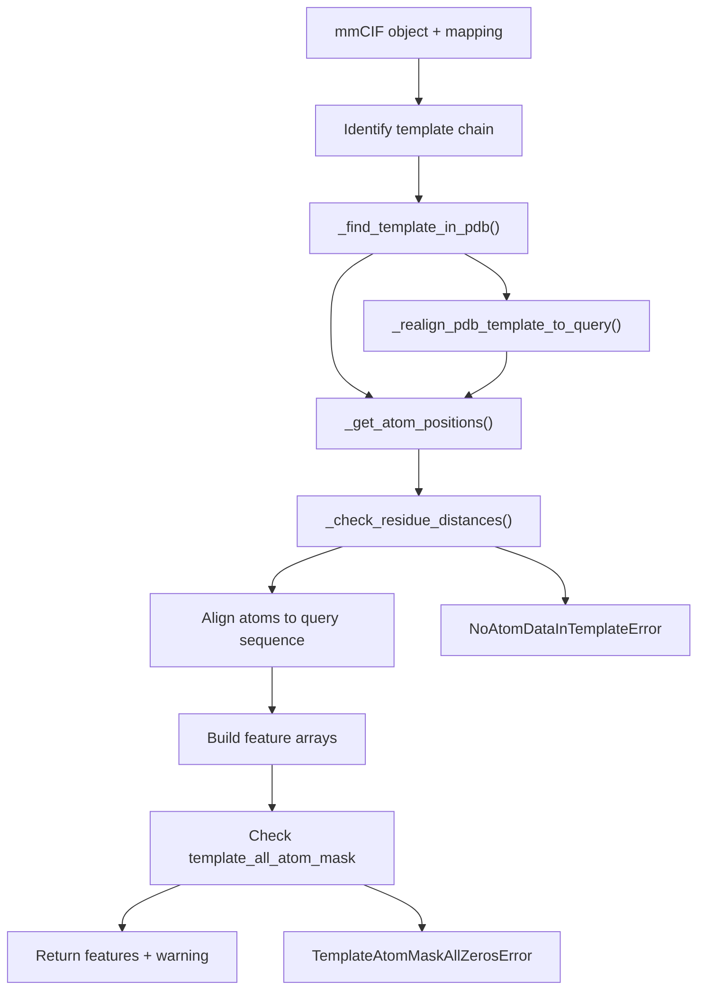

# Template Search and Processing

> **Relevant source files**
> * [fastfold/common/protein.py](https://github.com/hpcaitech/FastFold/blob/eba49680/fastfold/common/protein.py)
> * [fastfold/data/data_pipeline.py](https://github.com/hpcaitech/FastFold/blob/eba49680/fastfold/data/data_pipeline.py)
> * [fastfold/data/feature_processing_multimer.py](https://github.com/hpcaitech/FastFold/blob/eba49680/fastfold/data/feature_processing_multimer.py)
> * [fastfold/data/msa_pairing.py](https://github.com/hpcaitech/FastFold/blob/eba49680/fastfold/data/msa_pairing.py)
> * [fastfold/data/parsers.py](https://github.com/hpcaitech/FastFold/blob/eba49680/fastfold/data/parsers.py)
> * [fastfold/data/templates.py](https://github.com/hpcaitech/FastFold/blob/eba49680/fastfold/data/templates.py)
> * [fastfold/data/tools/hmmbuild.py](https://github.com/hpcaitech/FastFold/blob/eba49680/fastfold/data/tools/hmmbuild.py)
> * [fastfold/data/tools/jackhmmer.py](https://github.com/hpcaitech/FastFold/blob/eba49680/fastfold/data/tools/jackhmmer.py)
> * [fastfold/utils/import_weights.py](https://github.com/hpcaitech/FastFold/blob/eba49680/fastfold/utils/import_weights.py)

This page documents the template search and processing pipeline, which converts template structure hits (from HHsearch or hmmsearch) into numerical features for the AlphaFold model. Template processing involves prefiltering hits by date and quality, parsing mmCIF structure files, aligning template sequences to the query, and extracting atom position features.

**Related Pages**: For information about running alignment searches that produce template hits, see [Alignment and MSA Generation](/hpcaitech/FastFold/4.1-alignment-and-msa-generation). For multimer-specific template processing, see [Multimer Data Processing](/hpcaitech/FastFold/4.4-multimer-data-processing).

## Overview

Template processing transforms raw template search results (`.hhr` or `.sto` files) into structured feature arrays containing atom positions, masks, and metadata. The pipeline handles common challenges like sequence mismatches, obsolete PDB entries, and missing structural data.



**Sources**: [fastfold/data/templates.py L1-L1429](https://github.com/hpcaitech/FastFold/blob/eba49680/fastfold/data/templates.py#L1-L1429)

 [fastfold/data/data_pipeline.py L57-L87](https://github.com/hpcaitech/FastFold/blob/eba49680/fastfold/data/data_pipeline.py#L57-L87)

 [fastfold/data/parsers.py L56-L68](https://github.com/hpcaitech/FastFold/blob/eba49680/fastfold/data/parsers.py#L56-L68)

## Template Hit Data Structures

### TemplateHit

The `TemplateHit` dataclass represents a parsed template hit from HHSearch or hmmsearch:

| Field | Type | Description |
| --- | --- | --- |
| `index` | `int` | Hit number in the search results |
| `name` | `str` | Template identifier (e.g., `"4abc_A"`) |
| `aligned_cols` | `int` | Number of aligned columns |
| `sum_probs` | `float` | Sum of posterior probabilities |
| `query` | `str` | Query sequence (with gaps) |
| `hit_sequence` | `str` | Template sequence (with gaps) |
| `indices_query` | `List[int]` | Query residue indices (-1 for gaps) |
| `indices_hit` | `List[int]` | Template residue indices (-1 for gaps) |

**Sources**: [fastfold/data/parsers.py L56-L68](https://github.com/hpcaitech/FastFold/blob/eba49680/fastfold/data/parsers.py#L56-L68)

### Template Feature Dictionary

The final output is a feature dictionary with standardized shapes:

| Feature | Shape | dtype | Description |
| --- | --- | --- | --- |
| `template_aatype` | `(N_templ, N_res)` | `int64` | Amino acid type indices |
| `template_all_atom_positions` | `(N_templ, N_res, 37, 3)` | `float32` | Atom coordinates (Å) |
| `template_all_atom_mask` | `(N_templ, N_res, 37)` | `float32` | Atom presence mask |
| `template_sum_probs` | `(N_templ, 1)` | `float32` | Alignment confidence |

**Sources**: [fastfold/data/templates.py L84-L91](https://github.com/hpcaitech/FastFold/blob/eba49680/fastfold/data/templates.py#L84-L91)

 [fastfold/data/data_pipeline.py L47-L54](https://github.com/hpcaitech/FastFold/blob/eba49680/fastfold/data/data_pipeline.py#L47-L54)

## Template Featurizer Classes

### TemplateHitFeaturizer

`TemplateHitFeaturizer` processes HHSearch hits from PDB70 searches for monomer predictions.



**Key Parameters**:

* `mmcif_dir`: Directory containing mmCIF structure files (e.g., `*.cif`)
* `max_hits`: Maximum number of templates to process (default: 20)
* `kalign_binary_path`: Path to Kalign for sequence realignment
* `release_dates_path`: JSON file mapping PDB IDs to release dates
* `obsolete_pdbs_path`: File mapping obsolete PDB IDs to replacements

**Sources**: [fastfold/data/templates.py L711-L896](https://github.com/hpcaitech/FastFold/blob/eba49680/fastfold/data/templates.py#L711-L896)

### HmmsearchHitFeaturizer

`HmmsearchHitFeaturizer` processes hmmsearch hits from PDB SeqRes for multimer predictions.

**Key Differences from TemplateHitFeaturizer**:

1. Uses `pdb_seqres_database` instead of PDB70
2. Parses hmmsearch `.sto` format instead of `.hhr`
3. No query PDB code filtering (multimers typically don't have known structures)
4. Different hit parsing logic via `parsers.parse_hmmsearch_sto()`

**Sources**: [fastfold/data/templates.py L899-L1043](https://github.com/hpcaitech/FastFold/blob/eba49680/fastfold/data/templates.py#L899-L1043)

## Prefiltering Pipeline

Template hits undergo multiple prefilter checks before structure parsing. Hits that fail any check raise a `PrefilterError` and are skipped.

### Prefilter Checks



| Check | Threshold | Raises | Description |
| --- | --- | --- | --- |
| **Date** | `release_date <= query_release_date` | `DateError` | Template released after query structure |
| **PDB ID** | `template_pdb != query_pdb` | `PdbIdError` | Template identical to query |
| **Align Ratio** | `aligned_cols / len(query) >= 0.1` | `AlignRatioError` | Insufficient alignment coverage |
| **Duplicate** | `template_seq not in query_seq` OR `len_ratio <= 0.95` | `DuplicateError` | Template is exact subsequence of query |
| **Length** | `len(template_seq) >= 10` | `LengthError` | Template too short |

**Sources**: [fastfold/data/templates.py L187-L263](https://github.com/hpcaitech/FastFold/blob/eba49680/fastfold/data/templates.py#L187-L263)

### _assess_hhsearch_hit Function

```python
def _assess_hhsearch_hit(    hit: parsers.TemplateHit,    hit_pdb_code: str,    query_sequence: str,    release_dates: Mapping[str, datetime.datetime],    release_date_cutoff: datetime.datetime,    query_pdb_code: Optional[str] = None,    max_subsequence_ratio: float = 0.95,    min_align_ratio: float = 0.1,) -> bool:
```

This function implements all prefilter checks. It returns `True` if the hit passes, otherwise raises a specific `PrefilterError` subclass.

**Sources**: [fastfold/data/templates.py L187-L263](https://github.com/hpcaitech/FastFold/blob/eba49680/fastfold/data/templates.py#L187-L263)

## Template Matching and Sequence Alignment

### Finding Templates in mmCIF Files

The `_find_template_in_pdb` function locates the template sequence within the parsed mmCIF structure using three matching strategies:



**Sources**: [fastfold/data/templates.py L266-L337](https://github.com/hpcaitech/FastFold/blob/eba49680/fastfold/data/templates.py#L266-L337)

### Sequence Realignment with Kalign

When the template sequence in the mmCIF file differs from the sequence in the hit (common when PDB70 is outdated), realignment is performed:



**Key Constraint**: The realignment must have ≥90% sequence identity (relative to the shorter sequence). This ensures the structural data is still relevant.

**Sources**: [fastfold/data/templates.py L340-L475](https://github.com/hpcaitech/FastFold/blob/eba49680/fastfold/data/templates.py#L340-L475)

### _realign_pdb_template_to_query Function

```python
def _realign_pdb_template_to_query(    old_template_sequence: str,    template_chain_id: str,    mmcif_object: mmcif_parsing.MmcifObject,    old_mapping: Mapping[int, int],    kalign_binary_path: str,) -> Tuple[str, Mapping[int, int]]:
```

This function:

1. Extracts the full sequence from mmCIF
2. Aligns `old_template_sequence` (from hit) to new sequence using Kalign
3. Builds a mapping: `old_template_index → new_template_index`
4. Composes with `query_index → old_template_index` to get final mapping

**Sources**: [fastfold/data/templates.py L340-L475](https://github.com/hpcaitech/FastFold/blob/eba49680/fastfold/data/templates.py#L340-L475)

## Feature Extraction

### Atom Position Extraction

The `_extract_template_features` function is the core feature extraction routine:



**Sources**: [fastfold/data/templates.py L521-L678](https://github.com/hpcaitech/FastFold/blob/eba49680/fastfold/data/templates.py#L521-L678)

### Atom Coordinate Validation

The `_check_residue_distances` function validates that consecutive Cα atoms are within 150Å (essentially unlimited):

```python
def _check_residue_distances(    all_positions: np.ndarray,    all_positions_mask: np.ndarray,    max_ca_ca_distance: float,  # = 150.0):
```

This check catches egregiously bad structures where chains are incorrectly connected.

**Sources**: [fastfold/data/templates.py L478-L499](https://github.com/hpcaitech/FastFold/blob/eba49680/fastfold/data/templates.py#L478-L499)

### Atom Position Mapping

The extracted atom positions are mapped to query sequence indices using the alignment mapping:

```markdown
# Initialize arrays with zeros for all query residuestemplates_all_atom_positions = []templates_all_atom_masks = []output_templates_sequence = [] for _ in query_sequence:    templates_all_atom_positions.append(np.zeros((37, 3)))    templates_all_atom_masks.append(np.zeros(37))    output_templates_sequence.append("-") # Fill in aligned positionsfor query_idx, template_idx in mapping.items():    template_index = template_idx + mapping_offset    templates_all_atom_positions[query_idx] = all_atom_positions[template_index]    templates_all_atom_masks[query_idx] = all_atom_masks[template_index]    output_templates_sequence[query_idx] = template_sequence[template_idx]
```

**Sources**: [fastfold/data/templates.py L633-L647](https://github.com/hpcaitech/FastFold/blob/eba49680/fastfold/data/templates.py#L633-L647)

## Integration with Data Pipeline

### make_template_features Function

The `make_template_features` function provides the high-level interface used by `DataPipeline`:

```python
def make_template_features(    input_sequence: str,    hits: Sequence[Any],    template_featurizer: Union[TemplateHitFeaturizer, HmmsearchHitFeaturizer],    query_pdb_code: Optional[str] = None,    query_release_date: Optional[str] = None,) -> FeatureDict:
```

**Behavior**:

* If `hits` is empty or `template_featurizer` is None: returns `empty_template_feats()`
* Otherwise: calls `template_featurizer.get_templates()` and returns `features` dict
* Ensures empty template features are properly formatted even when featurizer returns empty results

**Sources**: [fastfold/data/data_pipeline.py L57-L87](https://github.com/hpcaitech/FastFold/blob/eba49680/fastfold/data/data_pipeline.py#L57-L87)

### Usage in DataPipeline

The `DataPipeline` class integrates template processing in its `process_fasta()` and `process_mmcif()` methods:

```mermaid
flowchart TD

ParseHits["_parse_template_hits(alignment_dir)"]
MakeTemp["make_template_features(...)"]
MakeSeq["make_sequence_features(...)"]
MakeMSA["_process_msa_feats(...)"]
Merge["Merge all features"]
Output["FeatureDict with:<br>- sequence features<br>- MSA features<br>- template features"]

Merge --> Output

subgraph subGraph1 ["Feature Dict Output"]
    Output
end

subgraph DataPipeline.process_fasta() ["DataPipeline.process_fasta()"]
    ParseHits
    MakeTemp
    MakeSeq
    MakeMSA
    Merge
    ParseHits --> MakeTemp
    MakeTemp --> Merge
    MakeSeq --> Merge
    MakeMSA --> Merge
end
```

**Template Hit Parsing**:

* For `.hhr` files: uses `parsers.parse_hhr()`
* For `hmm_output.sto` (multimer): uses `parsers.parse_hmmsearch_sto()`
* Aggregates all hits into a single dict: `{filename: List[TemplateHit]}`

**Sources**: [fastfold/data/data_pipeline.py L845-L890](https://github.com/hpcaitech/FastFold/blob/eba49680/fastfold/data/data_pipeline.py#L845-L890)

 [fastfold/data/data_pipeline.py L918-L960](https://github.com/hpcaitech/FastFold/blob/eba49680/fastfold/data/data_pipeline.py#L918-L960)

### Empty Template Features

When no templates are available, `empty_template_feats()` returns properly shaped zero arrays:

```python
def empty_template_feats(n_res) -> FeatureDict:    return {        "template_aatype": np.zeros((0, n_res)).astype(np.int64),        "template_all_atom_positions": np.zeros((0, n_res, 37, 3)).astype(np.float32),        "template_sum_probs": np.zeros((0, 1)).astype(np.float32),        "template_all_atom_mask": np.zeros((0, n_res, 37)).astype(np.float32),    }
```

This ensures the model always receives template features with the correct structure, even when no templates are found.

**Sources**: [fastfold/data/data_pipeline.py L47-L54](https://github.com/hpcaitech/FastFold/blob/eba49680/fastfold/data/data_pipeline.py#L47-L54)

## Error Handling

Template processing uses a hierarchical exception system to handle various failure modes gracefully:

### Exception Hierarchy

```mermaid
flowchart TD

Error["templates.Error"]
NoChains["NoChainsError"]
SeqNotFound["SequenceNotInTemplateError"]
NoAtom["NoAtomDataInTemplateError"]
AllZeroMask["TemplateAtomMaskAllZerosError"]
AlignError["QueryToTemplateAlignError"]
CaDist["CaDistanceError"]
PrefilterError["PrefilterError"]
DateError["DateError"]
PdbIdError["PdbIdError"]
AlignRatioError["AlignRatioError"]
DuplicateError["DuplicateError"]
LengthError["LengthError"]

Error --> NoChains
Error --> SeqNotFound
Error --> NoAtom
Error --> AllZeroMask
Error --> AlignError
Error --> CaDist
PrefilterError --> DateError
PrefilterError --> PdbIdError
PrefilterError --> AlignRatioError
PrefilterError --> DuplicateError
PrefilterError --> LengthError
```



### Error Recovery

The featurizer's `get_templates()` method catches errors per-hit and continues processing:

```css
for hit in hits:    try:        # Prefilter        _assess_hhsearch_hit(...)        # Parse mmCIF        mmcif_object = mmcif_parsing.parse(...)        # Extract features        features, warning = _extract_template_features(...)            except PrefilterError as e:        msg = f"Hit {hit.name} did not pass prefilter: {str(e)}"        warnings.append(msg)        continue    except Error as e:        msg = f"Hit {hit.name} failed feature extraction: {str(e)}"        warnings.append(msg)        continue
```

This ensures that a single bad template doesn't break the entire pipeline.

**Sources**: [fastfold/data/templates.py L35-L82](https://github.com/hpcaitech/FastFold/blob/eba49680/fastfold/data/templates.py#L35-L82)

 [fastfold/data/templates.py L820-L890](https://github.com/hpcaitech/FastFold/blob/eba49680/fastfold/data/templates.py#L820-L890)

## Release Date Management

### Release Dates Dictionary

The `release_dates` dictionary maps PDB IDs (uppercase) to `datetime.datetime` objects representing structure release dates:

```
{    "4ABC": datetime.datetime(2015, 3, 18, 0, 0),    "1XYZ": datetime.datetime(2001, 6, 5, 0, 0),    ...}
```

### Loading Release Dates

```python
def _parse_release_dates(path: str) -> Mapping[str, datetime.datetime]:    with open(path, "r") as fp:        data = json.load(fp)        return {        pdb.upper(): to_date(v)        for pdb, d in data.items()        for k, v in d.items()        if k == "release_date"    }
```

The expected JSON format is nested with PDB IDs as keys and metadata including `release_date` as values.

**Sources**: [fastfold/data/templates.py L174-L184](https://github.com/hpcaitech/FastFold/blob/eba49680/fastfold/data/templates.py#L174-L184)

### Obsolete PDB Handling

The obsolete PDBs file maps obsolete IDs to their replacements:

```
OBSLTE    31-JUL-94 116L     216L
```

This allows the featurizer to automatically use the updated structure when the hit references an obsolete entry.

**Sources**: [fastfold/data/templates.py L133-L146](https://github.com/hpcaitech/FastFold/blob/eba49680/fastfold/data/templates.py#L133-L146)

## Configuration and Usage Examples

### Monomer Template Processing

```javascript
from fastfold.data import templates, data_pipeline # Initialize featurizertemplate_featurizer = templates.TemplateHitFeaturizer(    mmcif_dir="/path/to/pdb_mmcif",    max_hits=20,    kalign_binary_path="/usr/bin/kalign",    release_dates_path="/path/to/release_dates.json",    obsolete_pdbs_path="/path/to/obsolete.dat",) # Initialize data pipelinedata_pipeline = data_pipeline.DataPipeline(    template_featurizer=template_featurizer) # Process FASTAfeatures = data_pipeline.process_fasta(    fasta_path="query.fasta",    alignment_dir="alignments/",)
```

**Sources**: [fastfold/data/data_pipeline.py L784-L790](https://github.com/hpcaitech/FastFold/blob/eba49680/fastfold/data/data_pipeline.py#L784-L790)

 [fastfold/data/data_pipeline.py L918-L960](https://github.com/hpcaitech/FastFold/blob/eba49680/fastfold/data/data_pipeline.py#L918-L960)

### Multimer Template Processing

```javascript
from fastfold.data import templates # Initialize hmmsearch featurizertemplate_featurizer = templates.HmmsearchHitFeaturizer(    mmcif_dir="/path/to/pdb_mmcif",    max_hits=20,    kalign_binary_path="/usr/bin/kalign",    release_dates_path="/path/to/release_dates.json",) # Use in multimer pipeline# (typically called internally by DataPipelineMultimer)
```

**Sources**: [fastfold/data/templates.py L899-L1043](https://github.com/hpcaitech/FastFold/blob/eba49680/fastfold/data/templates.py#L899-L1043)

## Performance Considerations

### Template Count Limits

* **Default max_hits**: 20 templates per target
* Controlled by `max_hits` parameter in featurizer initialization
* More templates increase memory and compute requirements linearly

### Prefiltering Benefits

Prefiltering reduces unnecessary mmCIF parsing:

* Date check: ~40-60% of hits typically filtered (depends on query date)
* Alignment ratio: ~10-20% filtered
* Duplicate check: ~5-10% filtered
* Combined effect: ~50-70% reduction in mmCIF I/O

### mmCIF Parsing

mmCIF parsing is the most expensive operation:

* File I/O dominates when templates are on disk
* Biopython parsing can take 50-500ms per structure
* Consider caching parsed structures for repeated queries

**Sources**: [fastfold/data/templates.py L711-L896](https://github.com/hpcaitech/FastFold/blob/eba49680/fastfold/data/templates.py#L711-L896)