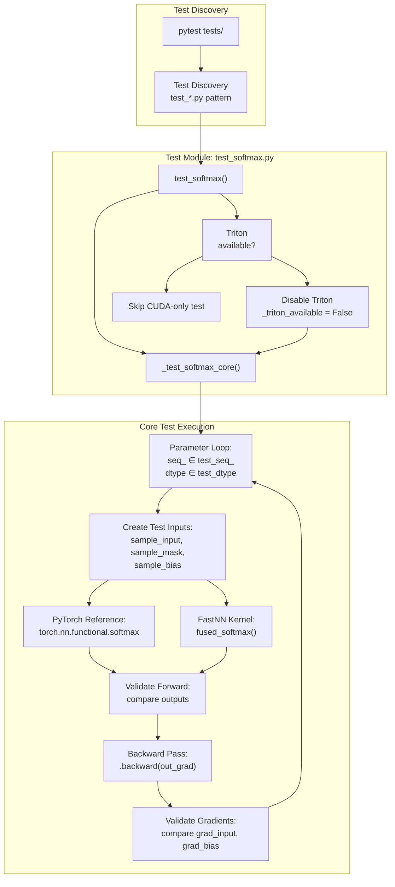
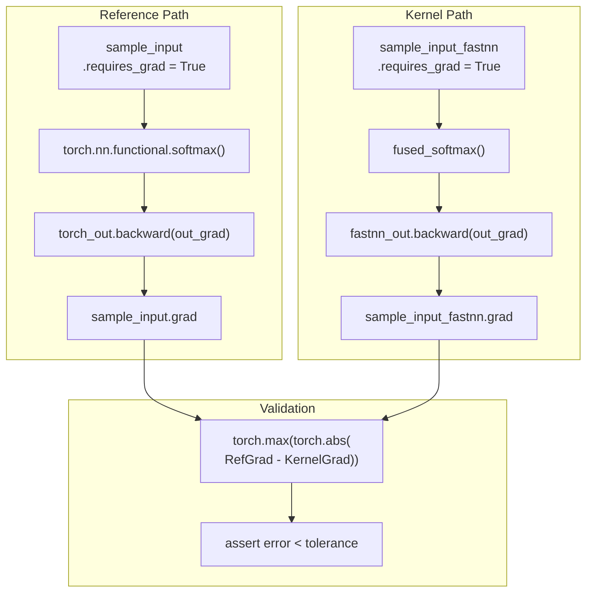
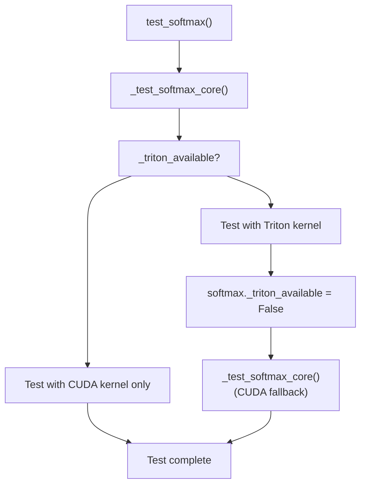
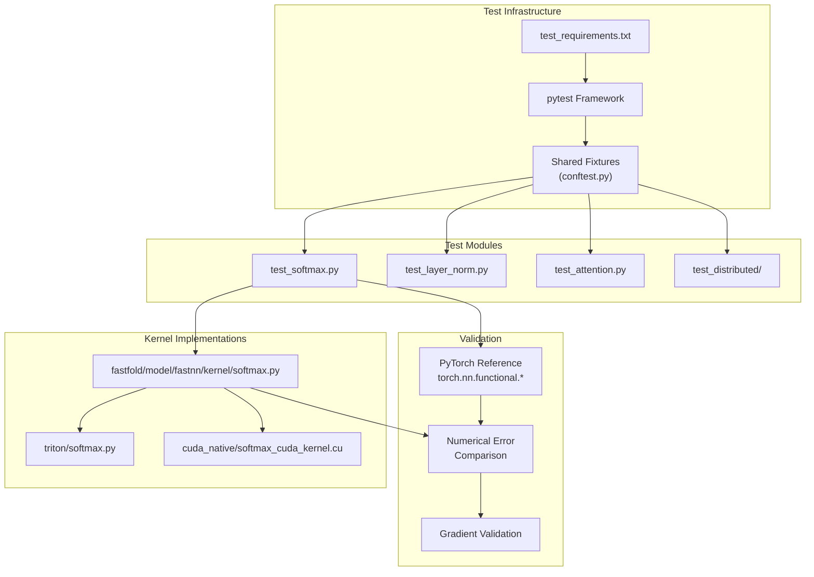

# Testing Framework

> **Relevant source files**
> * [.github/workflows/build.yml](https://github.com/hpcaitech/FastFold/blob/eba49680/.github/workflows/build.yml)
> * [fastfold/model/fastnn/kernel/cuda_native/csrc/softmax_cuda.cpp](https://github.com/hpcaitech/FastFold/blob/eba49680/fastfold/model/fastnn/kernel/cuda_native/csrc/softmax_cuda.cpp)
> * [fastfold/model/fastnn/kernel/cuda_native/csrc/softmax_cuda_kernel.cu](https://github.com/hpcaitech/FastFold/blob/eba49680/fastfold/model/fastnn/kernel/cuda_native/csrc/softmax_cuda_kernel.cu)
> * [fastfold/model/fastnn/kernel/softmax.py](https://github.com/hpcaitech/FastFold/blob/eba49680/fastfold/model/fastnn/kernel/softmax.py)
> * [fastfold/model/fastnn/kernel/triton/softmax.py](https://github.com/hpcaitech/FastFold/blob/eba49680/fastfold/model/fastnn/kernel/triton/softmax.py)
> * [requirements/requirements.txt](https://github.com/hpcaitech/FastFold/blob/eba49680/requirements/requirements.txt)
> * [requirements/test_requirements.txt](https://github.com/hpcaitech/FastFold/blob/eba49680/requirements/test_requirements.txt)
> * [tests/test_fastnn/test_softmax.py](https://github.com/hpcaitech/FastFold/blob/eba49680/tests/test_fastnn/test_softmax.py)

## Purpose and Scope

The FastFold testing framework validates the correctness and performance of optimized kernels, distributed operations, and model components. This document covers the test suite organization, validation strategies, and execution methods. For build system configuration, see [Build System](/hpcaitech/FastFold/10.1-build-system). For CI/CD pipeline details, see [Continuous Integration](/hpcaitech/FastFold/10.3-continuous-integration).

The testing framework focuses primarily on kernel-level validation, ensuring that optimized CUDA/Triton implementations produce numerically equivalent results to PyTorch reference implementations. Tests validate both forward and backward passes across multiple data types and sequence lengths.

---

## Test Suite Organization

The test suite is organized under the `tests/` directory with a structure mirroring the main codebase. Test files follow the naming convention `test_<module>.py`.

### Directory Structure

```markdown
tests/
├── test_fastnn/
│   ├── test_softmax.py          # Softmax kernel validation
│   ├── test_layer_norm.py       # Layer normalization tests
│   └── test_attention.py        # Attention kernel tests
├── test_distributed/
│   └── test_primitives.py       # Distributed communication tests
└── conftest.py                  # Shared pytest fixtures
```

### Test Module Organization

Each test module typically contains:

* **Core test functions**: Primary validation logic (e.g., `_test_softmax_core`)
* **Wrapper functions**: Pytest entry points that may test multiple configurations
* **Test data generators**: Functions to create sample inputs with various shapes and dtypes
* **Tolerance configurations**: Accuracy thresholds for different data types

**Sources**: [tests/test_fastnn/test_softmax.py L1-L64](https://github.com/hpcaitech/FastFold/blob/eba49680/tests/test_fastnn/test_softmax.py#L1-L64)

---

## Test Execution Flow



**Sources**: [tests/test_fastnn/test_softmax.py L7-L61](https://github.com/hpcaitech/FastFold/blob/eba49680/tests/test_fastnn/test_softmax.py#L7-L61)

 [tests/test_fastnn/test_softmax.py L56-L63](https://github.com/hpcaitech/FastFold/blob/eba49680/tests/test_fastnn/test_softmax.py#L56-L63)

---

## Unit Testing Framework

FastFold uses `pytest` as its primary testing framework. Tests leverage PyTorch's autograd functionality to validate gradient computation.

### Pytest Configuration

Tests are executed with the `pytest` command, which automatically discovers and runs all test functions matching the pattern `test_*`:

```
PYTHONPATH=$PWD pytest tests
```

The `PYTHONPATH` is set to ensure proper module imports. Environment variables may be set to control test behavior (e.g., `NCCL_SHM_DISABLE=1` for distributed tests).

### Test Dependencies

Testing requires additional packages beyond the core FastFold dependencies:

| Package | Version | Purpose |
| --- | --- | --- |
| `pytest` | Latest | Test framework and runner |
| `biopython` | 1.79 | Biological data structure validation |
| `dm-tree` | 0.1.6 | Nested data structure utilities |
| `ml-collections` | 0.1.0 | Configuration testing |
| `scipy` | 1.7.1 | Scientific computing utilities |
| `pandas` | Latest | Data manipulation for test analysis |

**Sources**: [requirements/test_requirements.txt L1-L7](https://github.com/hpcaitech/FastFold/blob/eba49680/requirements/test_requirements.txt#L1-L7)

 [.github/workflows/build.yml L30](https://github.com/hpcaitech/FastFold/blob/eba49680/.github/workflows/build.yml#L30-L30)

---

## Test Validation Strategies

### Numerical Accuracy Validation

Tests compare optimized kernel outputs against PyTorch reference implementations using absolute error thresholds:

```python
# Example from test_softmax.pytolerance_eps = {    torch.float32: 1e-6,    torch.float16: 2e-4,    torch.bfloat16: 1e-3} fwd_error = torch.max(torch.abs(torch_out - fastnn_out)).cpu().item()assert fwd_error < tolerance_eps[dtype], f"Error: {fwd_error}"
```

Tolerance levels vary by data type to account for reduced precision in FP16 and BF16 formats.

**Sources**: [tests/test_fastnn/test_softmax.py L14](https://github.com/hpcaitech/FastFold/blob/eba49680/tests/test_fastnn/test_softmax.py#L14-L14)

 [tests/test_fastnn/test_softmax.py L36-L38](https://github.com/hpcaitech/FastFold/blob/eba49680/tests/test_fastnn/test_softmax.py#L36-L38)

### Gradient Validation

Backward pass correctness is validated by comparing gradients computed through the optimized kernel against PyTorch's autograd:



**Sources**: [tests/test_fastnn/test_softmax.py L40-L53](https://github.com/hpcaitech/FastFold/blob/eba49680/tests/test_fastnn/test_softmax.py#L40-L53)

### Multi-Configuration Testing

Tests iterate over multiple parameter combinations to ensure robustness:

| Parameter | Test Values | Purpose |
| --- | --- | --- |
| `test_seq_` | [31, 32, 128, 129, 256, 259, 512, 700, 1024] | Validate edge cases around power-of-2 boundaries |
| `test_dtype` | [float32, float16, bfloat16] | Verify support for all precision modes |
| `batch_` | 1 | Batch dimension |
| `chunk_` | 8 | Chunking dimension |
| `head_` | 4 | Attention head dimension |

Sequence length values are deliberately chosen to test both warp-aligned (32, 128, 256, 512, 1024) and non-aligned cases (31, 129, 259, 700).

**Sources**: [tests/test_fastnn/test_softmax.py L9-L12](https://github.com/hpcaitech/FastFold/blob/eba49680/tests/test_fastnn/test_softmax.py#L9-L12)

---

## Kernel Fallback Testing

FastFold kernels support both Triton and CUDA implementations with automatic fallback. Tests validate both paths:



The test explicitly disables Triton after the first run to force CUDA fallback and verify both implementations:

```python
def test_softmax():    _test_softmax_core()    if softmax._triton_available:        softmax._triton_available = False        _test_softmax_core()
```

**Sources**: [tests/test_fastnn/test_softmax.py L56-L60](https://github.com/hpcaitech/FastFold/blob/eba49680/tests/test_fastnn/test_softmax.py#L56-L60)

 [fastfold/model/fastnn/kernel/softmax.py L7-L15](https://github.com/hpcaitech/FastFold/blob/eba49680/fastfold/model/fastnn/kernel/softmax.py#L7-L15)

---

## Test Input Generation

Tests create comprehensive input tensors covering various scenarios:

### Input Tensor Creation

```markdown
# Shape: (batch, chunk, head, seq, seq)sample_input = torch.rand(    batch_, chunk_, head_, seq_, seq_).to(device=test_device, dtype=dtype).requires_grad_(True) # Mask: random binary masksample_mask = torch.cuda.FloatTensor(batch_, chunk_, seq_).uniform_() > 0 # Bias: additive attention biassample_bias = torch.rand(    batch_, 1, head_, seq_, seq_).to(device=test_device, dtype=dtype).requires_grad_(True)
```

**Cloning for Independent Gradients**: Test inputs are cloned to create independent gradient computation graphs:

```
sample_input_fastnn = torch.clone(sample_input.detach()).requires_grad_(True)sample_mask_fastnn = torch.clone(sample_mask.detach()).requires_grad_(False)sample_bias_fastnn = torch.clone(sample_bias.detach()).requires_grad_(True)
```

This ensures that gradients computed for the reference and kernel implementations do not interfere with each other.

**Sources**: [tests/test_fastnn/test_softmax.py L18-L27](https://github.com/hpcaitech/FastFold/blob/eba49680/tests/test_fastnn/test_softmax.py#L18-L27)

---

## Running Tests

### Local Execution

Run all tests from the repository root:

```
PYTHONPATH=$PWD pytest tests
```

Run specific test modules:

```
PYTHONPATH=$PWD pytest tests/test_fastnn/test_softmax.py
```

Run with verbose output:

```
PYTHONPATH=$PWD pytest tests -v
```

Run specific test functions:

```
PYTHONPATH=$PWD pytest tests/test_fastnn/test_softmax.py::test_softmax -v
```

### Environment Variables

| Variable | Value | Purpose |
| --- | --- | --- |
| `PYTHONPATH` | `$PWD` | Ensure module imports work correctly |
| `NCCL_SHM_DISABLE` | `1` | Disable shared memory for NCCL (CI environment) |
| `CUDA_VISIBLE_DEVICES` | Device IDs | Control GPU visibility |

**Sources**: [.github/workflows/build.yml L35-L37](https://github.com/hpcaitech/FastFold/blob/eba49680/.github/workflows/build.yml#L35-L37)

### CI Execution

GitHub Actions automatically runs tests on labeled pull requests. The workflow:

1. Checks out the repository
2. Restores cached build artifacts
3. Installs dependencies from `requirements.txt` and `test_requirements.txt`
4. Compiles CUDA extensions
5. Executes `pytest tests` with `NCCL_SHM_DISABLE=1`

**Sources**: [.github/workflows/build.yml L8-L38](https://github.com/hpcaitech/FastFold/blob/eba49680/.github/workflows/build.yml#L8-L38)

---

## Test Coverage by Component

### Kernel-Level Tests

The test suite focuses heavily on validating optimized kernels:

| Component | Test File | Validated Operations |
| --- | --- | --- |
| Softmax | `test_fastnn/test_softmax.py` | Forward pass, backward pass, mask support, bias support |
| Layer Norm | `test_fastnn/test_layer_norm.py` | Normalization, gradient computation |
| Attention | `test_fastnn/test_attention.py` | Attention core, online softmax |

### Validation Metrics

For each kernel, tests validate:

1. **Forward Pass Accuracy**: `max(|reference_output - kernel_output|) < tolerance`
2. **Gradient Computation**: `max(|reference_grad - kernel_grad|) < tolerance` for all inputs
3. **Data Type Support**: Correctness across FP32, FP16, BF16
4. **Shape Handling**: Correctness for various sequence lengths and batch configurations

**Sources**: [tests/test_fastnn/test_softmax.py L36-L53](https://github.com/hpcaitech/FastFold/blob/eba49680/tests/test_fastnn/test_softmax.py#L36-L53)

---

## Test Architecture Reference



**Sources**: [tests/test_fastnn/test_softmax.py L1-L64](https://github.com/hpcaitech/FastFold/blob/eba49680/tests/test_fastnn/test_softmax.py#L1-L64)

 [fastfold/model/fastnn/kernel/softmax.py L1-L59](https://github.com/hpcaitech/FastFold/blob/eba49680/fastfold/model/fastnn/kernel/softmax.py#L1-L59)

 [fastfold/model/fastnn/kernel/triton/softmax.py L1-L221](https://github.com/hpcaitech/FastFold/blob/eba49680/fastfold/model/fastnn/kernel/triton/softmax.py#L1-L221)

 [fastfold/model/fastnn/kernel/cuda_native/csrc/softmax_cuda_kernel.cu L1-L840](https://github.com/hpcaitech/FastFold/blob/eba49680/fastfold/model/fastnn/kernel/cuda_native/csrc/softmax_cuda_kernel.cu#L1-L840)