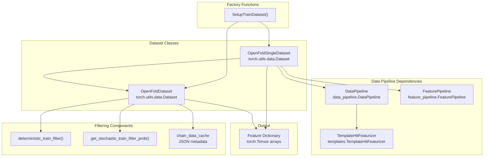
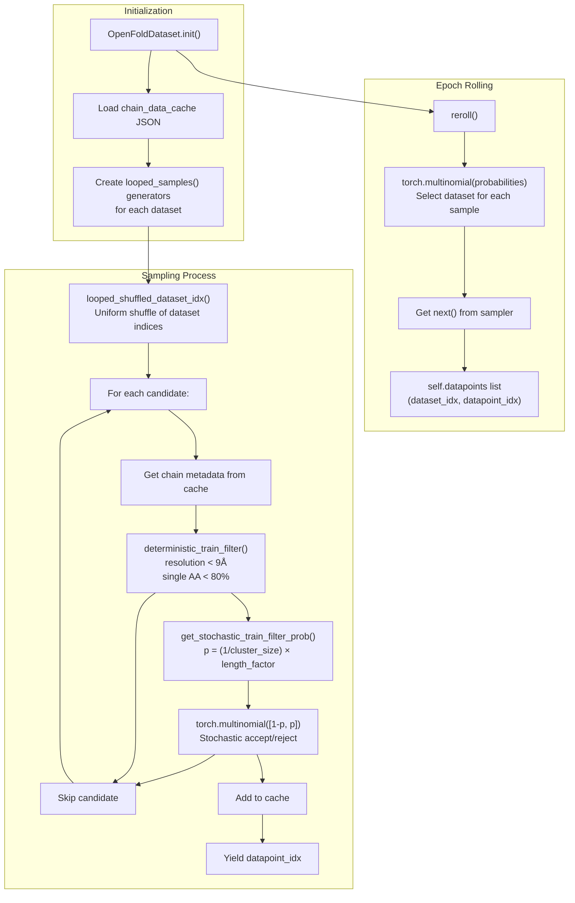
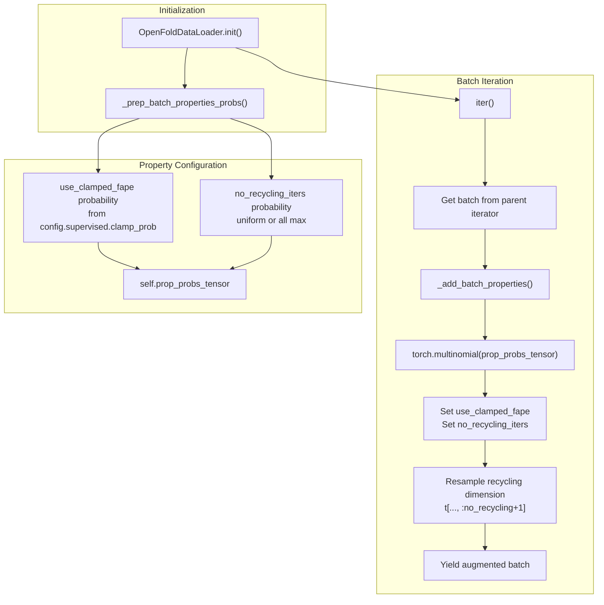
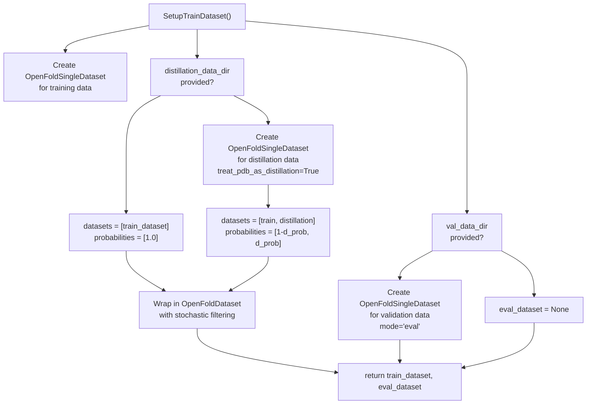
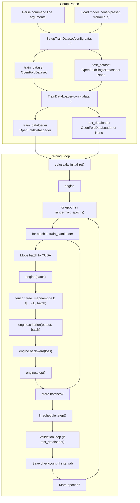
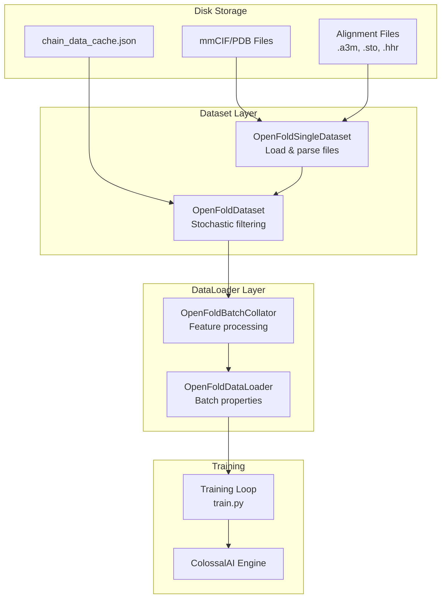

# Training Data Loading

> **Relevant source files**
> * [fastfold/data/data_modules.py](https://github.com/hpcaitech/FastFold/blob/eba49680/fastfold/data/data_modules.py)
> * [fastfold/utils/tensor_utils.py](https://github.com/hpcaitech/FastFold/blob/eba49680/fastfold/utils/tensor_utils.py)
> * [fastfold/utils/test_utils.py](https://github.com/hpcaitech/FastFold/blob/eba49680/fastfold/utils/test_utils.py)
> * [tests/test_train.py](https://github.com/hpcaitech/FastFold/blob/eba49680/tests/test_train.py)
> * [train.py](https://github.com/hpcaitech/FastFold/blob/eba49680/train.py)

## Purpose and Scope

This page documents the training data loading system in FastFold, including dataset classes, stochastic filtering mechanisms, batch collation, and data loader implementations. It covers how raw protein structure data is loaded, filtered, and prepared for training the AlphaFold model.

For information about data preprocessing and feature generation (MSA alignment, template search), see [Data Processing Pipeline](/hpcaitech/FastFold/4-data-processing-pipeline). For details about the ColossalAI training engine integration, see [ColossalAI Integration](/hpcaitech/FastFold/7.2-colossalai-integration).

## Overview

FastFold's training data loading system implements AlphaFold's training procedure, which includes:

1. **Multiple data sources**: Training data from PDB/mmCIF files and optional distillation data
2. **Stochastic filtering**: AlphaFold's cluster-based and length-based sampling strategies
3. **Dynamic batch properties**: Random selection of recycling iterations and FAPE clamping
4. **Feature processing**: Conversion of raw data into model-ready tensors

The system is designed to handle both single-chain and multimer training data, with support for validation datasets.

**Key Design Principles**:

* Virtual epoch length rather than full dataset iteration
* Stochastic filtering applied per-epoch for data diversity
* Batch size fixed at 1 due to memory constraints
* Support for distributed training via DistributedSampler

Sources: [fastfold/data/data_modules.py L1-L640](https://github.com/hpcaitech/FastFold/blob/eba49680/fastfold/data/data_modules.py#L1-L640)

 [train.py L1-L259](https://github.com/hpcaitech/FastFold/blob/eba49680/train.py#L1-L259)

## Dataset Architecture

### Class Hierarchy



**OpenFoldSingleDataset** loads individual protein examples from disk, processing mmCIF, PDB, or ProteinNet Core files. **OpenFoldDataset** wraps one or more OpenFoldSingleDataset instances and implements AlphaFold's stochastic filtering strategy.

Sources: [fastfold/data/data_modules.py L34-L223](https://github.com/hpcaitech/FastFold/blob/eba49680/fastfold/data/data_modules.py#L34-L223)

 [fastfold/data/data_modules.py L269-L365](https://github.com/hpcaitech/FastFold/blob/eba49680/fastfold/data/data_modules.py#L269-L365)

 [fastfold/data/data_modules.py L479-L589](https://github.com/hpcaitech/FastFold/blob/eba49680/fastfold/data/data_modules.py#L479-L589)

### OpenFoldSingleDataset

The base dataset class that handles loading and processing individual protein examples.

**Key Attributes**:

* `data_dir`: Directory containing structure files (`.cif`, `.pdb`, or `.core`)
* `alignment_dir`: Directory with precomputed alignments (`.a3m`, `.sto`, `.hhr`)
* `mode`: One of `"train"`, `"eval"`, or `"predict"`
* `_alignment_index`: Optional JSON index for faster alignment lookup
* `data_pipeline`: Processes raw structure files into feature dictionaries
* `feature_pipeline`: Applies feature transformations based on configuration

**File Type Support**:

| File Type | Processing Method | Use Case |
| --- | --- | --- |
| `.cif` | `_parse_mmcif()` | Training data from PDB |
| `.core` | `process_core()` | ProteinNet Core format |
| `.pdb` | `process_pdb()` | Distillation data |
| `.fasta` | `process_fasta()` | Prediction mode |

**Example Usage**:

```markdown
# Created via SetupTrainDataset factory functiondataset = OpenFoldSingleDataset(    data_dir="/path/to/pdb",    alignment_dir="/path/to/alignments",    template_mmcif_dir="/path/to/templates",    max_template_date="2020-05-14",    config=config.data,    mode="train",    _output_raw=True,  # Skip feature pipeline in OpenFoldDataset)
```

Sources: [fastfold/data/data_modules.py L34-L223](https://github.com/hpcaitech/FastFold/blob/eba49680/fastfold/data/data_modules.py#L34-L223)

### OpenFoldDataset with Stochastic Filtering

Implements AlphaFold's stochastic filtering strategy to balance training data by cluster size and sequence length.



**Stochastic Filter Probabilities**:

The probability of selecting a chain is computed as:

```sql
P(select) = (1 / cluster_size) × min(512, max(256, length)) / 512
```

This ensures:

* Chains from large clusters are downsampled
* Short chains (< 256 residues) have equal probability
* Long chains (> 512 residues) have equal probability
* Medium chains scale linearly with length

**Virtual Epoch Length**: The dataset does not iterate through all available data. Instead, `epoch_len` samples are drawn per epoch, allowing frequent validation and checkpointing without processing the entire dataset.

Sources: [fastfold/data/data_modules.py L269-L365](https://github.com/hpcaitech/FastFold/blob/eba49680/fastfold/data/data_modules.py#L269-L365)

 [fastfold/data/data_modules.py L225-L267](https://github.com/hpcaitech/FastFold/blob/eba49680/fastfold/data/data_modules.py#L225-L267)

## Stochastic Filtering Implementation

### Deterministic Filters

Hard filters that immediately reject training examples:

```python
def deterministic_train_filter(    chain_data_cache_entry: Any,    max_resolution: float = 9.,    max_single_aa_prop: float = 0.8,) -> bool
```

| Filter | Threshold | Purpose |
| --- | --- | --- |
| Resolution | ≤ 9.0 Å | Exclude low-quality structures |
| Single AA proportion | ≤ 0.8 | Exclude homopolymers and low-complexity sequences |

Sources: [fastfold/data/data_modules.py L225-L246](https://github.com/hpcaitech/FastFold/blob/eba49680/fastfold/data/data_modules.py#L225-L246)

### Stochastic Filters

Probabilistic filters applied after deterministic filters pass:

**Cluster Size Filter**:

* Purpose: Balance representation across sequence similarity clusters
* Probability: `1 / cluster_size`
* Effect: Rare sequences selected more frequently than abundant ones

**Length Filter**:

* Purpose: Balance representation across sequence lengths
* Probability: `(1 / 512) × max(min(length, 512), 256)`
* Effect: * Chains < 256 residues: probability ∝ 0.5 * Chains 256-512 residues: probability scales linearly * Chains > 512 residues: probability ∝ 1.0

Sources: [fastfold/data/data_modules.py L248-L267](https://github.com/hpcaitech/FastFold/blob/eba49680/fastfold/data/data_modules.py#L248-L267)

### Chain Data Cache

The `chain_data_cache` JSON file provides metadata for filtering without loading full structures:

```
{  "1ABC_A": {    "seq": "MKTAYIAKQRQISFVKSHFSRQ...",    "resolution": 2.5,    "cluster_size": 47  },  ...}
```

This cache is loaded once at initialization and queried during sampling for efficient filtering.

Sources: [fastfold/data/data_modules.py L289-L292](https://github.com/hpcaitech/FastFold/blob/eba49680/fastfold/data/data_modules.py#L289-L292)

## Batch Collation and Feature Processing

### OpenFoldBatchCollator

Collates individual protein examples into batches, applying feature pipeline transformations.

```python
class OpenFoldBatchCollator:    def __init__(self, config, stage="train"):        self.feature_pipeline = feature_pipeline.FeaturePipeline(config)        def __call__(self, raw_prots):        # Process each protein through feature pipeline        # Stack tensors along batch dimension
```

**Processing Steps**:

1. Apply `FeaturePipeline.process_features()` to each raw protein
2. Stack tensors along batch dimension using `dict_multimap()`
3. Special handling for batch size 1: shape is `[...]` not `[1, ...]`

Sources: [fastfold/data/data_modules.py L367-L384](https://github.com/hpcaitech/FastFold/blob/eba49680/fastfold/data/data_modules.py#L367-L384)

 [fastfold/utils/tensor_utils.py L49-L60](https://github.com/hpcaitech/FastFold/blob/eba49680/fastfold/utils/tensor_utils.py#L49-L60)

### Feature Pipeline Integration

The collator delegates to `FeaturePipeline` (see [Feature Generation for Inference](/hpcaitech/FastFold/5.1-feature-generation-for-inference)) which applies:

* Cropping to maximum sequence length
* MSA subsampling
* Template selection and featurization
* Padding and masking
* Data augmentation (for training)

Sources: [fastfold/data/data_modules.py L370-L378](https://github.com/hpcaitech/FastFold/blob/eba49680/fastfold/data/data_modules.py#L370-L378)

## OpenFoldDataLoader

Custom data loader that augments batches with training-specific properties.

### Batch Property Augmentation



**Augmented Properties**:

| Property | Values | Purpose |
| --- | --- | --- |
| `use_clamped_fape` | 0 or 1 | Whether to clamp FAPE loss (reduces gradient magnitude early in training) |
| `no_recycling_iters` | 0 to `max_recycling_iters` | Number of recycling iterations to perform |

**Recycling Strategy**:

* `uniform_recycling=True`: Each iteration count equally likely
* `uniform_recycling=False`: Always use maximum iterations

The recycling dimension is resampled to only include the selected number of iterations, reducing memory usage.

Sources: [fastfold/data/data_modules.py L386-L477](https://github.com/hpcaitech/FastFold/blob/eba49680/fastfold/data/data_modules.py#L386-L477)

## Training Data Setup

### SetupTrainDataset Factory Function

Creates training and validation datasets from configuration:

```python
def SetupTrainDataset(    config: mlc.ConfigDict,    template_mmcif_dir: str,    max_template_date: str,    train_data_dir: Optional[str] = None,    train_alignment_dir: Optional[str] = None,    train_chain_data_cache_path: Optional[str] = None,    distillation_data_dir: Optional[str] = None,    distillation_alignment_dir: Optional[str] = None,    distillation_chain_data_cache_path: Optional[str] = None,    val_data_dir: Optional[str] = None,    val_alignment_dir: Optional[str] = None,    train_epoch_len: int = 50000,    ...)
```

**Dataset Creation Logic**:



**Key Parameters**:

* `train_epoch_len`: Virtual epoch length (default 50,000 samples)
* `config.train.distillation_prob`: Probability of sampling from distillation dataset
* `_alignment_index`: Optional JSON index for faster alignment access

Sources: [fastfold/data/data_modules.py L479-L589](https://github.com/hpcaitech/FastFold/blob/eba49680/fastfold/data/data_modules.py#L479-L589)

### TrainDataLoader Factory Function

Creates data loaders with proper collation and distributed sampling:

```python
def TrainDataLoader(    config: mlc.ConfigDict,    train_dataset: torch.utils.data.Dataset,    test_dataset: Optional[torch.utils.data.Dataset] = None,    batch_seed: Optional[int] = None,)
```

**Data Loader Configuration**:

| Parameter | Default | Purpose |
| --- | --- | --- |
| `batch_size` | 1 | Only value supported due to memory constraints |
| `num_workers` | From config | Number of worker processes for data loading |
| `generator` | Random with seed | Controls batch property sampling |
| `sampler` | `DistributedSampler` if DDP | Ensures each rank gets different samples |

**Distributed Training Support**:

* Checks `colossalai.utils.is_using_ddp()` to detect distributed mode
* Creates `torch.utils.data.distributed.DistributedSampler` when needed
* Ensures each GPU processes different subset of data

Sources: [fastfold/data/data_modules.py L592-L640](https://github.com/hpcaitech/FastFold/blob/eba49680/fastfold/data/data_modules.py#L592-L640)

## Integration with Training Loop

### Usage in train.py

The complete data loading pipeline in the training script:



**Key Operations**:

1. **Batch Conversion** [train.py L227](https://github.com/hpcaitech/FastFold/blob/eba49680/train.py#L227-L227) : Convert NumPy arrays to CUDA tensors ``` batch = {k: torch.as_tensor(v).cuda() for k, v in batch.items()} ```
2. **Recycling Dimension Selection** [train.py L229](https://github.com/hpcaitech/FastFold/blob/eba49680/train.py#L229-L229) : Extract last recycling iteration for loss computation ``` batch = tensor_tree_map(lambda t: t[..., -1], batch) ```
3. **Validation** [train.py L240-L251](https://github.com/hpcaitech/FastFold/blob/eba49680/train.py#L240-L251) : Runs without clamped FAPE loss ``` batch["use_clamped_fape"] = 0. ```

Sources: [train.py L36-L259](https://github.com/hpcaitech/FastFold/blob/eba49680/train.py#L36-L259)

### Data Flow Summary



**Performance Characteristics**:

* **Memory Efficient**: Batch size of 1, on-the-fly feature processing
* **I/O Optimized**: Multi-process data loading with `num_workers`
* **Diverse Training**: Stochastic filtering ensures variety across epochs
* **Reproducible**: Seeded generators for batch property sampling

Sources: [train.py L177-L203](https://github.com/hpcaitech/FastFold/blob/eba49680/train.py#L177-L203)

 [fastfold/data/data_modules.py L1-L640](https://github.com/hpcaitech/FastFold/blob/eba49680/fastfold/data/data_modules.py#L1-L640)