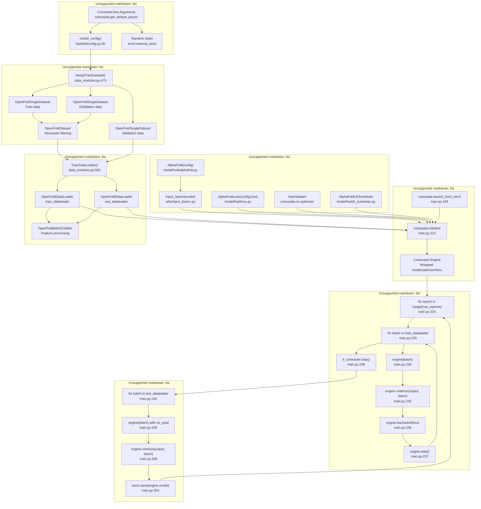
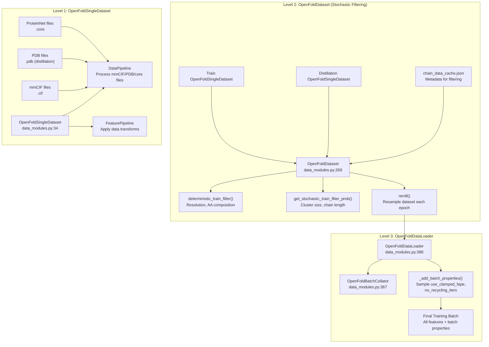
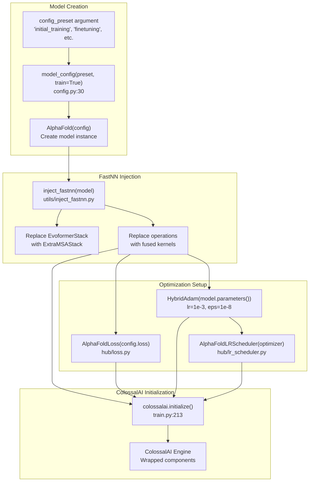
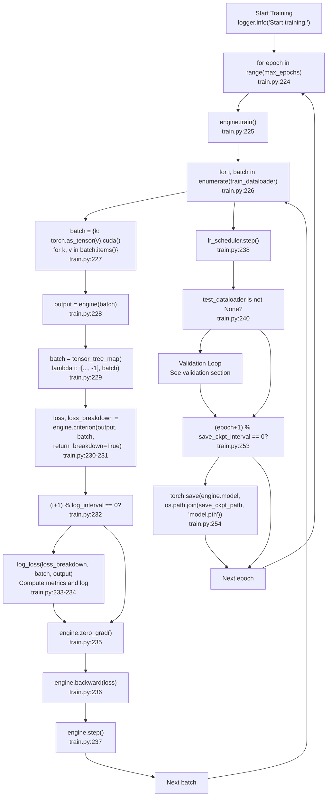

# Training System

> **Relevant source files**
> * [LICENSE](https://github.com/hpcaitech/FastFold/blob/eba49680/LICENSE)
> * [fastfold/config.py](https://github.com/hpcaitech/FastFold/blob/eba49680/fastfold/config.py)
> * [fastfold/data/data_modules.py](https://github.com/hpcaitech/FastFold/blob/eba49680/fastfold/data/data_modules.py)
> * [fastfold/model/fastnn/kernel/layer_norm.py](https://github.com/hpcaitech/FastFold/blob/eba49680/fastfold/model/fastnn/kernel/layer_norm.py)
> * [fastfold/relax/relax.py](https://github.com/hpcaitech/FastFold/blob/eba49680/fastfold/relax/relax.py)
> * [fastfold/relax/utils.py](https://github.com/hpcaitech/FastFold/blob/eba49680/fastfold/relax/utils.py)
> * [fastfold/utils/tensor_utils.py](https://github.com/hpcaitech/FastFold/blob/eba49680/fastfold/utils/tensor_utils.py)
> * [fastfold/utils/test_utils.py](https://github.com/hpcaitech/FastFold/blob/eba49680/fastfold/utils/test_utils.py)
> * [tests/test_train.py](https://github.com/hpcaitech/FastFold/blob/eba49680/tests/test_train.py)
> * [train.py](https://github.com/hpcaitech/FastFold/blob/eba49680/train.py)

This page provides a comprehensive guide to the FastFold training system, covering the complete training pipeline from data loading through distributed execution to checkpointing. It documents the [train.py](https://github.com/hpcaitech/FastFold/blob/eba49680/train.py)

 script, training-specific dataset classes, ColossalAI integration, and the training loop structure.

**Scope:** This page focuses on the training infrastructure and workflow. For inference execution, see [Inference Pipeline](/hpcaitech/FastFold/5-inference-pipeline). For the underlying model architecture, see [AlphaFold Model Architecture](/hpcaitech/FastFold/6-alphafold-model-architecture). For performance optimizations applied during training, see [Performance Optimizations](/hpcaitech/FastFold/8-performance-optimizations).

## Training Pipeline Overview

The FastFold training system implements the AlphaFold training procedure with several enhancements for distributed execution and performance. The pipeline consists of five major stages: configuration setup, dataset preparation with stochastic filtering, model initialization with FastNN injection, ColossalAI distributed engine setup, and the training/validation loop.



**Sources:** [train.py L36-L258](https://github.com/hpcaitech/FastFold/blob/eba49680/train.py#L36-L258)

 [fastfold/data/data_modules.py L479-L640](https://github.com/hpcaitech/FastFold/blob/eba49680/fastfold/data/data_modules.py#L479-L640)

 [fastfold/config.py L30-L125](https://github.com/hpcaitech/FastFold/blob/eba49680/fastfold/config.py#L30-L125)

## Command-Line Interface

The training script uses ColossalAI's argument parser and extends it with FastFold-specific parameters. The interface is divided into data paths, filtering options, training hyperparameters, and system configuration.

| Argument Category | Key Parameters | Description |
| --- | --- | --- |
| **Data Paths** | `--train_data_dir``--train_alignment_dir``--template_mmcif_dir` | Directories containing mmCIF structures, precomputed alignments, and template structures |
| **Distillation** | `--distillation_data_dir``--distillation_alignment_dir` | Optional self-distillation dataset paths |
| **Validation** | `--val_data_dir``--val_alignment_dir` | Optional validation dataset paths |
| **Filtering** | `--train_filter_path``--obsolete_pdbs_file_path``--template_release_dates_cache_path` | Filtering and caching for dataset quality control |
| **Configuration** | `--config_preset``--train_epoch_len``--seed` | Model configuration preset (e.g., "initial_training", "finetuning") and virtual epoch length |
| **Training Control** | `--max_epochs``--log_interval``--save_ckpt_interval` | Training duration and logging frequency |
| **Output** | `--log_path``--save_ckpt_path` | Directories for logs and checkpoints |
| **Distributed** | `--dap_size``--from_torch` | DAP parallelism size and launch mode |

**Sources:** [train.py L36-L158](https://github.com/hpcaitech/FastFold/blob/eba49680/train.py#L36-L158)

## Training Configuration

The training system uses configuration presets defined in [fastfold/config.py](https://github.com/hpcaitech/FastFold/blob/eba49680/fastfold/config.py)

 When `train=True` is passed to `model_config()`, specific training-mode adjustments are made:

```markdown
# Key training configuration adjustmentsconfig.globals.blocks_per_ckpt = 1        # Enable gradient checkpointing per blockconfig.globals.chunk_size = None          # Disable chunking during trainingconfig.globals.inplace = False            # Disable inplace operations for gradient safety
```

### Training Data Configuration

The `config.data.train` section controls data processing during training:

| Parameter | Default | Purpose |
| --- | --- | --- |
| `crop_size` | 256 | Spatial crop size (residues), 384 for finetuning |
| `max_msa_clusters` | 128 | Maximum MSA sequences to use |
| `max_templates` | 4 | Maximum template structures |
| `subsample_templates` | True | Randomly subsample templates |
| `shuffle_top_k_prefiltered` | 20 | Shuffle top K templates before selection |
| `uniform_recycling` | True | Uniform distribution over recycling iterations |
| `distillation_prob` | 0.75 | Probability of sampling from distillation set |
| `masked_msa_replace_fraction` | 0.15 | Fraction of MSA to mask |

**Sources:** [fastfold/config.py L279-L294](https://github.com/hpcaitech/FastFold/blob/eba49680/fastfold/config.py#L279-L294)

 [train.py L171-L172](https://github.com/hpcaitech/FastFold/blob/eba49680/train.py#L171-L172)

## Dataset Architecture

The training data loading system consists of three levels: `OpenFoldSingleDataset` for individual chains, `OpenFoldDataset` for stochastic filtering, and `OpenFoldDataLoader` for batch property sampling.



**Sources:** [fastfold/data/data_modules.py L34-L640](https://github.com/hpcaitech/FastFold/blob/eba49680/fastfold/data/data_modules.py#L34-L640)

### Stochastic Filtering

The `OpenFoldDataset` implements AlphaFold's stochastic filtering procedure to balance the training distribution. Two types of filters are applied:

**Deterministic Filters:**

* Resolution filter: `resolution <= 9.0 Å`
* Single amino acid composition: `max(aa_count) / seq_len <= 0.8`

**Stochastic Filters (probability of inclusion):**

* Cluster size filter: `P = 1 / cluster_size`
* Chain length filter: `P = (1/512) * max(min(length, 512), 256)`
* Combined probability: `P_total = P_cluster * P_length`

```markdown
# Example: Chain with cluster_size=4, length=384P_cluster = 1 / 4 = 0.25P_length = (1/512) * 384 = 0.75P_total = 0.25 * 0.75 = 0.1875  # 18.75% chance of inclusion per epoch
```

**Sources:** [fastfold/data/data_modules.py L225-L267](https://github.com/hpcaitech/FastFold/blob/eba49680/fastfold/data/data_modules.py#L225-L267)

### Batch Property Sampling

The `OpenFoldDataLoader` dynamically samples batch properties during iteration:

| Property | Training Setting | Purpose |
| --- | --- | --- |
| `use_clamped_fape` | Sampled: 10% probability | Controls whether FAPE loss uses clamped distance |
| `no_recycling_iters` | Uniform over [0, max_recycling_iters] | Number of recycling iterations for this batch |

These properties are sampled per batch and broadcast to all recycling iterations using [data_modules.py L433-L467](https://github.com/hpcaitech/FastFold/blob/eba49680/data_modules.py#L433-L467)

**Sources:** [fastfold/data/data_modules.py L398-L476](https://github.com/hpcaitech/FastFold/blob/eba49680/fastfold/data/data_modules.py#L398-L476)

## Model Initialization and Optimization

The training script initializes the model with FastNN optimizations and sets up the optimizer and learning rate scheduler before passing them to ColossalAI.



**Sources:** [train.py L171-L220](https://github.com/hpcaitech/FastFold/blob/eba49680/train.py#L171-L220)

### HybridAdam Optimizer

FastFold uses ColossalAI's `HybridAdam` optimizer, which provides efficient mixed-precision training support:

```
optimizer = HybridAdam(model.parameters(), lr=1e-3, eps=1e-8)
```

The optimizer is wrapped by ColossalAI's engine to handle gradient synchronization in distributed settings.

**Sources:** [train.py L208](https://github.com/hpcaitech/FastFold/blob/eba49680/train.py#L208-L208)

### Learning Rate Scheduling

The `AlphaFoldLRScheduler` implements a warmup schedule followed by exponential decay, matching the original AlphaFold training procedure. The scheduler is stepped once per epoch.

**Sources:** [train.py L210](https://github.com/hpcaitech/FastFold/blob/eba49680/train.py#L210-L210)

 [train.py L238](https://github.com/hpcaitech/FastFold/blob/eba49680/train.py#L238-L238)

## ColossalAI Integration

ColossalAI provides the distributed training infrastructure for FastFold. The integration occurs in three phases: launch configuration, process group initialization, and engine creation.

### Launch Configuration

```python
# Launch from torch distributedcolossalai.launch_from_torch(    config=dict(        parallel=dict(            tensor=dict(size=args.dap_size)  # DAP size for tensor parallelism        ),        torch_ddp=dict(static_graph=True)    ))
```

The `dap_size` parameter controls Dynamic Axial Parallelism, which shards sequences across multiple GPUs. Common values: 1 (no DAP), 2, 4, 8.

**Sources:** [train.py L165-L166](https://github.com/hpcaitech/FastFold/blob/eba49680/train.py#L165-L166)

### Engine Initialization

The `colossalai.initialize()` function wraps the model, optimizer, criterion, and data loaders into a unified engine:

```
engine, train_dataloader, test_dataloader, lr_scheduler = colossalai.initialize(    model=model,    optimizer=optimizer,    criterion=criterion,    lr_scheduler=lr_scheduler,    train_dataloader=train_dataloader,    test_dataloader=test_dataloader,)
```

The engine provides methods: `engine.train()`, `engine.eval()`, `engine.zero_grad()`, `engine.backward()`, `engine.step()`, and `engine.criterion()`.

**Sources:** [train.py L213-L220](https://github.com/hpcaitech/FastFold/blob/eba49680/train.py#L213-L220)

### Distributed Sampler

When using DDP (Data Distributed Parallel), `DistributedSampler` ensures each rank processes different data:

```
if is_using_ddp():    train_sampler = torch.utils.data.distributed.DistributedSampler(train_dataset)
```

**Sources:** [fastfold/data/data_modules.py L608-L609](https://github.com/hpcaitech/FastFold/blob/eba49680/fastfold/data/data_modules.py#L608-L609)

## Training Loop

The main training loop iterates over epochs and batches, performing forward passes, loss computation, backpropagation, and optimization steps.



**Sources:** [train.py L223-L256](https://github.com/hpcaitech/FastFold/blob/eba49680/train.py#L223-L256)

### Recycling Dimension Handling

The training data includes a recycling dimension for iterative refinement. After the forward pass, only the final recycling iteration is used for loss computation:

```sql
# Forward pass with all recycling iterationsoutput = engine(batch) # Select only the last recycling iteration for lossbatch = tensor_tree_map(lambda t: t[..., -1], batch) # Compute loss on final iterationloss, loss_breakdown = engine.criterion(output, batch, _return_breakdown=True)
```

This matches the AlphaFold training procedure where gradients flow through all recycling iterations but loss is computed only on the final output.

**Sources:** [train.py L228-L231](https://github.com/hpcaitech/FastFold/blob/eba49680/train.py#L228-L231)

### Loss Logging

The `log_loss()` function computes and formats loss breakdown and validation metrics:

```python
def log_loss(loss_breakdown, batch, outputs, train=True):    loss_info = ''    for loss_name, loss_value in loss_breakdown.items():        loss_info += (f' {loss_name}=' + "{:.3f}".format(loss_value))        with torch.no_grad():        other_metrics = compute_validation_metrics(            batch,             outputs,            superimposition_metrics=(not train)  # Compute RMSD only for validation        )        for loss_name, loss_value in other_metrics.items():        loss_info += (f' {loss_name}=' + "{:.3f}".format(loss_value))        return loss_info
```

Metrics include individual loss components (FAPE, distogram, masked MSA, etc.) and structural metrics (RMSD, TM-score) during validation.

**Sources:** [train.py L21-L33](https://github.com/hpcaitech/FastFold/blob/eba49680/train.py#L21-L33)

## Validation Loop

The validation loop evaluates the model on held-out data without gradient computation. It uses a separate test dataloader and computes losses with `use_clamped_fape=0`.

```css
if test_dataloader is not None:    engine.eval()    for i, batch in enumerate(test_dataloader):        batch = {k: torch.as_tensor(v).cuda() for k, v in batch.items()}        with torch.no_grad():            output = engine(batch)            batch = tensor_tree_map(lambda t: t[..., -1], batch)            batch["use_clamped_fape"] = 0.  # Force unclamped FAPE for validation            _, loss_breakdown = engine.criterion(                output, batch, _return_breakdown=True            )            logger.info(f'Validation, Step: {i+1}, '                       f'Loss:{log_loss(loss_breakdown, batch, output, False)}',                        ranks=[0])
```

**Key differences from training:**

* `engine.eval()` disables dropout
* `with torch.no_grad()` disables gradient computation
* `use_clamped_fape = 0.` forces unclamped FAPE loss
* `superimposition_metrics=True` in `log_loss()` computes structural alignment metrics

**Sources:** [train.py L240-L251](https://github.com/hpcaitech/FastFold/blob/eba49680/train.py#L240-L251)

## Checkpointing

Model checkpoints are saved at regular intervals controlled by `save_ckpt_interval`:

```
if (args.save_ckpt_path is not None) and ((epoch+1) % args.save_ckpt_interval == 0):    torch.save(engine.model, os.path.join(args.save_ckpt_path, 'model.pth'))
```

The checkpoint contains the wrapped ColossalAI engine model, which includes the FastNN-optimized AlphaFold model with all parameters.

**Note:** For loading checkpoints, the same ColossalAI configuration must be used during initialization to properly reconstruct the distributed model state.

**Sources:** [train.py L253-L254](https://github.com/hpcaitech/FastFold/blob/eba49680/train.py#L253-L254)

## Training Data Flow

The complete data flow from raw files to model input involves multiple transformations:

```mermaid
flowchart TD

MMCIF["mmCIF files<br>*.cif in train_data_dir"]
PDB["PDB files<br>*.pdb in distillation_data_dir"]
Alignment["Alignment files<br>*.a3m, *.sto, *.hhr in alignment_dir"]
ChainCache["chain_data_cache.json<br>Metadata for filtering"]
GetItem["getitem(idx)<br>data_modules.py:168"]
ParseFile["Parse mmCIF/PDB<br>Extract structure"]
ProcessAlign["Load alignments<br>MSA and templates"]
DataPipeProc["DataPipeline.process_mmcif/pdb<br>Combine structure + alignments"]
RawFeats["Raw Feature Dict<br>NumPy arrays"]
Reroll["reroll()<br>data_modules.py:352"]
Multinomial["torch.multinomial<br>Sample from train/distillation"]
LoopedSamples["looped_samples<br>Apply filters and resample"]
FilteredIdx["Filtered datapoint indices"]
Collate["call(raw_prots)<br>data_modules.py:372"]
FeaturePipe["FeaturePipeline.process_features<br>Apply crops, masks, transforms"]
Stack["torch.stack(dim=0)<br>Create batch dimension"]
ProcessedBatch["Processed Batch<br>Tensors with batch dim"]
Iterator["iter()<br>data_modules.py:469"]
AddProps["_add_batch_properties<br>Sample use_clamped_fape, no_recycling_iters"]
ResampleRecycling["Resample recycling dimension<br>t[..., :no_recycling+1]"]
FinalBatch["Final Training Batch<br>Ready for model.forward()"]
ModelForward["engine(batch)<br>train.py:228"]

MMCIF --> GetItem
PDB --> GetItem
Alignment --> GetItem
ChainCache --> Reroll
RawFeats --> FilteredIdx
FilteredIdx --> Collate
ProcessedBatch --> Iterator
FinalBatch --> ModelForward

subgraph OpenFoldDataLoader.__iter__() ["OpenFoldDataLoader.iter()"]
    Iterator
    AddProps
    ResampleRecycling
    FinalBatch
    Iterator --> AddProps
    AddProps --> ResampleRecycling
    ResampleRecycling --> FinalBatch
end

subgraph OpenFoldBatchCollator.__call__() ["OpenFoldBatchCollator.call()"]
    Collate
    FeaturePipe
    Stack
    ProcessedBatch
    Collate --> FeaturePipe
    FeaturePipe --> Stack
    Stack --> ProcessedBatch
end

subgraph subGraph2 ["OpenFoldDataset (Stochastic Filtering)"]
    Reroll
    Multinomial
    LoopedSamples
    FilteredIdx
    Reroll --> Multinomial
    Multinomial --> LoopedSamples
    LoopedSamples --> FilteredIdx
end

subgraph OpenFoldSingleDataset.__getitem__() ["OpenFoldSingleDataset.getitem()"]
    GetItem
    ParseFile
    ProcessAlign
    DataPipeProc
    RawFeats
    GetItem --> ParseFile
    GetItem --> ProcessAlign
    ParseFile --> DataPipeProc
    ProcessAlign --> DataPipeProc
    DataPipeProc --> RawFeats
end

subgraph subGraph0 ["Raw Data Files"]
    MMCIF
    PDB
    Alignment
    ChainCache
end
```

**Sources:** [fastfold/data/data_modules.py L34-L640](https://github.com/hpcaitech/FastFold/blob/eba49680/fastfold/data/data_modules.py#L34-L640)

 [train.py L226-L228](https://github.com/hpcaitech/FastFold/blob/eba49680/train.py#L226-L228)

## Memory Management

Training AlphaFold models requires careful memory management. FastFold provides several mechanisms:

| Mechanism | Configuration | Purpose |
| --- | --- | --- |
| **Gradient Checkpointing** | `config.globals.blocks_per_ckpt = 1` | Recompute activations during backward pass to save memory |
| **Inplace Operations** | `config.globals.inplace = False` | Disabled during training to ensure correct gradients |
| **Chunking** | `config.globals.chunk_size = None` | Disabled during training for maximum performance |
| **Cropping** | `config.data.train.crop_size = 256` | Spatial crop to limit memory usage |
| **DAP** | `--dap_size` argument | Shard sequences across GPUs to increase effective memory |

**Sources:** [train.py L171-L172](https://github.com/hpcaitech/FastFold/blob/eba49680/train.py#L171-L172)

 [fastfold/config.py L116-L117](https://github.com/hpcaitech/FastFold/blob/eba49680/fastfold/config.py#L116-L117)

## Example Training Command

A typical training command combines all the components:

```
torchrun --nproc_per_node=8 train.py \    --from_torch \    --dap_size 1 \    --config_preset initial_training \    --seed 42 \    --train_data_dir /data/pdb_mmcif/mmcif_files \    --train_alignment_dir /data/alignments/train \    --train_chain_data_cache_path /data/caches/train_chain_data_cache.json \    --distillation_data_dir /data/distillation \    --distillation_alignment_dir /data/alignments/distillation \    --distillation_chain_data_cache_path /data/caches/distillation_chain_data_cache.json \    --val_data_dir /data/val \    --val_alignment_dir /data/alignments/val \    --template_mmcif_dir /data/pdb_mmcif/mmcif_files \    --max_template_date 2021-11-01 \    --obsolete_pdbs_file_path /data/pdb_mmcif/obsolete.dat \    --template_release_dates_cache_path /data/caches/template_release_dates.json \    --kalign_binary_path /usr/bin/kalign \    --train_epoch_len 10000 \    --max_epochs 100 \    --log_interval 10 \    --log_path ./logs \    --save_ckpt_path ./checkpoints \    --save_ckpt_interval 1
```

**Sources:** [train.py L36-L158](https://github.com/hpcaitech/FastFold/blob/eba49680/train.py#L36-L158)

## Training vs Inference Differences

The training and inference pipelines differ in several key aspects:

| Aspect | Training | Inference |
| --- | --- | --- |
| **Configuration** | `model_config(preset, train=True)` | `model_config(preset, train=False)` |
| **Chunking** | `chunk_size = None` (disabled) | `chunk_size = 4` (enabled) |
| **Gradient Checkpointing** | `blocks_per_ckpt = 1` | `blocks_per_ckpt = None` |
| **Data Loading** | Stochastic filtering, cropping, augmentation | Direct feature loading |
| **Recycling** | Variable iterations per batch | Fixed maximum iterations |
| **Distributed** | ColossalAI engine with DDP/DAP | torch.multiprocessing.spawn |
| **Output** | Loss values and metrics | Structure predictions |

**Sources:** [train.py](https://github.com/hpcaitech/FastFold/blob/eba49680/train.py)

 [inference.py](https://github.com/hpcaitech/FastFold/blob/eba49680/inference.py)

 [fastfold/config.py L115-L117](https://github.com/hpcaitech/FastFold/blob/eba49680/fastfold/config.py#L115-L117)

## Related Pages

* For data preprocessing and alignment generation, see [Data Processing Pipeline](/hpcaitech/FastFold/4-data-processing-pipeline)
* For model architecture details, see [AlphaFold Model Architecture](/hpcaitech/FastFold/6-alphafold-model-architecture)
* For loss function implementation, see [Loss Functions and Metrics](/hpcaitech/FastFold/7.3-loss-functions-and-metrics)
* For distributed training setup, see [ColossalAI Integration](/hpcaitech/FastFold/7.2-colossalai-integration)
* For performance optimization techniques, see [Performance Optimizations](/hpcaitech/FastFold/8-performance-optimizations)